<!--
author:   Lori Jordan; Kate Dirga

email:    LiaScript@web.de

version:  0.0.1

language: en

narrator: US English Female

comment:  CK-12 Foundation’s Algebra II with Trigonometry FlexBook® textbook is an expansion on the algebraic topics of functions, equations, and graphs for high-school students.

logo:     ../cover.jpg

tags:      algebra, trigonometry, equations, functions, inequalities, linear equations, matrices, polynomial functions, quadratic functions, systems of equations

-->

# CK-12 Algebra II with Trigonometry

> This document was automatically translated to LiaScript from
>
> https://www.ck12.org/book/ck-12-algebra-ii-with-trigonometry/

## 1.0 Equations and Inequalities

<article>

**Algebra II with Trigonometry**

Algebra II is considered the third year of math in the on-level mathematics high-school sequence. Depending on the level of the students in your class, the option of Trigonometry can be added at the end of the coursework. There is a lot of material to be covered in this course, including: systems of equations, quadratics, higher level polynomials, exponential and logarithmic functions, modeling, rational functions, conics, sequences and series, probability, and trigonometry.

**Equations and Inequalities**

This chapter of Algebra II is a review of much of the topics covered in Algebra I. Students will review real numbers, solving equations, inequalities, absolute value equations, and absolute value inequalities.

</article>

### 1.1 Real Numbers

<article>

 

**Objective**

To familiarize students with the subsets of real numbers and review their properties.

**Review Queue**

1. Write down one example of each of the following: a fraction, a decimal, an integer, and a square root.

2. Do you remember the Order of Operations from another math class? What is it?

3. Which fraction is larger?

a) $\frac{5}{6}$ or $\frac{1}{2}$

b) $\frac{1}{4}$ or $\frac{1}{3}$

c) $\frac{6}{7}$ or $\frac{7}{9}$

Subsets of Real Numbers
-----------------------

**Objective**

Identify the subsets of real numbers.

**Watch This**

!?[0](https://www.youtube.com/watch?v=htP2goe31MM)

[James Sousa: Identifying Sets of Real Numbers](http://www.youtube.com/watch?v=htP2goe31MM)

**Guidance**

There are several types of real numbers. You are probably familiar with fractions, decimals, integers, whole numbers and even square roots. All of these types of numbers are real numbers. There are two main types of numbers: real and complex. We will address complex (imaginary) numbers in the Quadratic Functions chapter.

| **Real Numbers** | Any number that can be plotted on a number line. _Symbol:_ $\mathbb{R}$ | _Examples:_ $8, 4.67, - \frac{1}{3}, \pi$ |
| --- | --- | --- |
| **Rational Numbers** | Any number that can be written as a fraction, including repeating decimals. _Symbol:_ $\mathbb{Q}$ | _Examples:_ $-\frac{5}{9},\frac{1}{8},1.\overline{3},\frac{16}{4}$ |
| **Irrational Numbers** | Real numbers that are not rational. When written as a decimal, these numbers do not end nor repeat. | _Example:_ $e, \pi, -\sqrt{2},\sqrt[3]{5}$ |
| **Integers** | All positive and negative “counting” numbers and zero. _Symbol:_ $\mathbb{Z}$ | _Example:_ -4, 6, 23, -10 |
| **Whole Numbers** | All positive “counting” numbers and zero. | _Example:_ 0, 1, 2, 3, ... |
| **Natural Numbers** | All positive “counting” numbers. _Symbol:_ $\mathbb{N}$ | _Example:_ 1, 2, 3, ... |

A “counting” number is any number that can be counted on your fingers.

The real numbers can be grouped together as follows:

What is the most specific subset of the real numbers that -7 is a part of?

**Solution:** -7 is an integer.

**Example B**

List all the subsets that 1.3 lies in.

**Solution:** 1.3 is a terminating decimal. Therefore, it is considered a rational number. It would also be a real number.

**Guided Practice**

1. What type of real number is $\sqrt{5}$?

2. List all the subsets that -8 is a part of.

3. True or False: $-\sqrt{9}$ is an irrational number.

**Answers**

1. $\sqrt{5}$ is an irrational number because, when converted to a decimal, it does not end nor does it repeat.

2. -8 is a negative integer. Therefore, it is also a rational number and a real number.

3. $-\sqrt{9}=-3$, which is an integer. The statement is false.

**Vocabulary**

__Subset__

A set of numbers that is contained in a larger group of numbers.

__Real Numbers__

Any number that can be plotted on a number line.

__Rational Numbers__

Any number that can be written as a fraction, including repeating decimals.

__Irrational Numbers__

Real numbers that are not rational. When written as a decimal, these numbers do not end nor repeat.

__Integers__

All positive and negative “counting” numbers and zero.

__Whole Numbers__

All positive “counting” numbers and zero.

__Natural Numbers or Counting Numbers__

Numbers than can be counted on your fingers; 1, 2, 3, 4, ...

__Terminating Decimal__

When a decimal number ends.

__Repeating Decimal__

When a decimal number repeats itself in a pattern. 1.666..., 0.98989898... are examples of repeating decimals.

**Problem Set**

What is the most specific subset of real numbers that the following numbers belong in?

1.  5.67
2.  $-\sqrt{6}$
3.  $\frac{9}{5}$
4.  0
5.  \-75
6.  $\sqrt{16}$

List ALL the subsets that the following numbers are a part of.

7.  4
8.  $\frac{6}{9}$
9.  $\pi$

Determine if the following statements are true or false.

10. Integers are rational numbers.
11. Every whole number is a real number.
12. Integers are irrational numbers.
13. A natural number is a rational number.
14. An irrational number is a real number.
15. Zero is a natural number.

Ordering Real Numbers
---------------------

**Objective**

Listing and comparing real numbers in order according to the directions given.

**Watch This**

Watch the middle part of this video, from about 3:15 to 7:30.

!?[0](https://www.youtube.com/watch?v=py-iSJziA_8)

[James Sousa: Real Numbers](http://www.youtube.com/watch?v=py-iSJziA_8)

**Guidance**

Real numbers can be listed in order even if they are different types of real numbers. The easiest way to do this is to convert all the real numbers into decimals.

**Example A**

Plot $1.25, \frac{7}{2}$, and $2\sqrt{6}$ on a number line.

**Solution:** One way to compare numbers is to use a number line. To plot these numbers, convert them all to decimals. $1.25, \frac{7}{2}=3.5$, and $2\sqrt{6}\approx 4.899$ (The symbol $\approx$ means _approximately_.) Draw your number line and plot the points. Recall that 0 is called the origin.

**Example B**

List $\frac{3}{4}, 1.23, \sqrt{2}, \frac{2}{3}, 1$ and $\frac{8}{7}$ in order from least to greatest.

**Solution:** First, write each number as a decimal.

$\frac{3}{4}=0.75, 1.23, \sqrt{2} \approx 1.4142, \frac{2}{3}=0.6\overline{6},1,\frac{8}{7}=1.\overline{142857}$. Now, write the decimals, in order, starting with the smallest and ending with the largest: $0.6667, 0.75, 1, 1.1428, 1.23, 1.4142$

Finally, exchange the decimals with the original numbers: $\frac{2}{3}, \frac{3}{4}, 1,\frac{8}{7},1.23,\sqrt{2}$

**Example C**

Replace the blank between $-\frac{5}{3}$ \_\_\_\_\_\_ $-\frac{\pi}{2}$ with &lt;, &gt;, or =.

**Solution:** Write both numbers in decimals. $-\frac{5}{3}=-1.6\overline{6},-\frac{\pi}{2} \approx -1.57079$. This means that $-\frac{\pi}{2}$ is the larger number, so $-\frac{5}{3}<-\frac{\pi}{2}$.

**Guided Practice**

1. List $-\frac{1}{4},\frac{3}{2},-\sqrt{3},\frac{3}{5}$, and 2 in order from greatest to least.

2. Compare $\sqrt{7}$ and 2.5 by using &lt;, &gt;, or =.

**Answers**

1. Write all the real numbers as decimals. $-\frac{1}{4}=-0.25,\frac{3}{2}=1.5,-\sqrt{3} \approx -1.732, \frac{3}{5}=0.6,2$ In order, the numbers are: $2, \frac{3}{2},\frac{3}{5},-\frac{1}{4},-\sqrt{3}$

2. $\sqrt{7} \approx 2.646$. Therefore, it is larger than 2.5. Comparing the two numbers, we have $\sqrt{7} > 2.5$.

**Problem Set**

Plot the following numbers on a number line. Use an appropriate scale.

1.  $-1,0.3,\sqrt{2}$
2.  $-\frac{1}{4},-2\frac{1}{2},3.15$
3.  $1.4,\frac{5}{6},\sqrt{9}$
4.  $-\sqrt{6},\frac{4}{3}, \pi$

Order the following sets of numbers from least to greatest.

5.  $-4,-\frac{9}{2},-\frac{1}{3},-\frac{1}{4},-\pi$
6.  $0,-\frac{1}{2},\frac{4}{5},\frac{1}{6},-\sqrt{\frac{1}{3}}$

Order the following sets of numbers from greatest to least.

7.  $3.68,4 \frac{1}{2},5,3 \frac{11}{12},\sqrt{10}$
8.  $-2,-\frac{6}{5},-\frac{11}{4},-\sqrt{5},-\sqrt{3}$

Compare each pair of numbers using &lt;, &gt;, and =.

9.  $-\frac{1}{4} \underline{\;\;\;\;\;\;\;} -\frac{3}{8}$
10. $\sqrt{8}\underline{\;\;\;\;\;\;\;} 2.9$
11. $-2 \frac{8}{9} \underline{\;\;\;\;\;\;\;}-2.75$
12. $\frac{10}{15} \underline{\;\;\;\;\;\;\;}\frac{8}{12}$
13. $-\sqrt{50} \underline{\;\;\;\;\;\;\;}-5\sqrt{2}$
14. $1 \frac{5}{6} \underline{\;\;\;\;\;\;\;}1.95$
15. **Calculator Challenge** Locate the button $e$ on your scientific calculator. $e$ is called the _natural number_and will be used in the Exponential and Logarithmic Functions chapter.
    1.  Press the $e$ button. What is $e$ equivalent to?
    2.  What type of real number do you think $e$ is?
    3.  Which number is larger? $e$ or $\pi$?
    4.  Which number is larger? $e$ or $\sqrt{7}$?

Algebraic Properties
--------------------

**Objective**

To become familiar with the properties of algebra and the Order of Operations.

**Watch This**

!?[0](https://www.youtube.com/watch?v=WHTBgwBWlF4)

[James Sousa: The Order of Operations](http://www.youtube.com/watch?v=WHTBgwBWlF4)

**Guidance**

The properties of algebra enable us to solve mathematical equations. Notice that these properties hold for addition and multiplication.

| **Property** | **Example** |
| --- | --- |
| Commutative | $a+b=b+a,ab=ba$ |
| Associative | $a+(b+c)=(a+b)+c,a(bc)=(ab)c$ |
| Identity | $a+0=a,a \cdot 1=a$ |
| Inverse | $a+(-a)=0,a \cdot \frac{1}{a}=1$ |
| Distributive | $a(b+c)=ab+ac$ |

From the Identity Property, we can say that 0 is the **additive identity** and 1 is the **multiplicative identity.** Similarly, from the Inverse Property, $-a$ is the **additive inverse** of $a$ and $\frac{1}{a}$ is the **multiplicative inverse** of $a$ because they both equal the identity.

**Example A**

Identify the property used in the equations below.

a) $2(4x-3)=8x-6$

b) $5 \cdot \frac{1}{5}=1$

c) $6 \cdot (7 \cdot 8)=(6 \cdot 7) \cdot 8$

**Solution:**

a) is an example of the Distributive Property,

b) is an example of the Inverse Property, and

c) is an example of the Associative Property.

**More Guidance**

Going along with the properties of algebra, are the Order of Operations. The Order of Operations is a set of guidelines that allow mathematicians to perform problems in the exact same way. The order is as follows:

**Parenthesis** Do anything in parenthesis first.

**Exponents** Next, all powers (exponents) need to be evaluated.

**Multiplication/Division** Multiplication and division must be done at the same time, from left to right, because they are inverses of each other.

**Addition/Subtraction** Addition and subtraction are also done together, from left to right.

**Example B**

Simplify $2^2+6 \cdot 3-(5-1)$.

**Solution:**

Parenthesis $\rightarrow 2^2+6 \cdot 3-4$

Exponents $\rightarrow 4+6 \cdot 3-4$

Multiplication $\rightarrow 4+18-4$

Add/Subtract $\rightarrow 18$

**Example C**

Simplify $\frac{9-4 \div 2+13}{2^2 \cdot 3-7}$.

**Solution:** Think of everything in the numerator in its own set of parenthesis as well as everything in the denominator. The problem can be rewritten as $(9-4 \div 2 +13) \div (2^2 \cdot 3-7)$. When there are multiple operations in a set of parenthesis, use the Order of Operations within each set.

$$
\begin{align*}
&(9-4 \div 2 +13) \div (2^2 \cdot 3-7)\\
&(9-2+13) \div (4 \cdot 3-7)\\
&(7+13) \div (12-7)\\
& 20 \div 5\\
&4
\end{align*}
$$

Parenthesis can also be written within another set of parenthesis. This is called _embedding_ parenthesis. When embedded parenthesis are in a problem, you may see brackets, \[ \], in addition to parenthesis.

**Guided Practice**

1. What property is being used?

a) $5(c - 9) = 5c - 45$

b) $6 \cdot 7=7 \cdot 6$

2. Use the Order of Operations to simplify $8+[4^2-6 \div (5+1)]$.

**Answers**

1. a) 5 is being distributed to each term inside the parenthesis, therefore the Distributive Property is being used.

b) Here, order does not matter when multiplying 6 and 7. This is an example of the Commutative Property.

2. This is an example of embedded parenthesis, as discussed above. Start by simplifying the parenthesis that are inside the brackets. Then, simplify what is inside the brackets according to the Order of Operations.

$$
\begin{align*}
&8+[4^2-6 \div (5+1)]\\
&8+[4^2-6 \div 6]\\
&8+[16-6\div 6]\\
&8+[16-1]\\
&8+15\\
&23
\end{align*}
$$

**Vocabulary**

__Additive Inverse__

A number that is the opposite sign of a given number, such that, when added, their sum is zero.

__Multiplicative Inverse__

A number that is the reciprocal (and same sign) of a given number, such that, when multiplied, their product is 1.

__Additive Identity__

The additive identity is zero.

__Multiplicative Identity__

The multiplicative identity is 1.

__The Order of Operations__

A set of guidelines used to simplify mathematical expressions. When simplifying an expression, the order is perform all operations inside any parenthesis first, followed by evaluating all exponents. Third, do all multiplication and division at the same time, from left to right. Lastly, do all addition and subtraction at the same time, from left to right.

__Evaluate__

Solve.

__Simplify__

To combine like terms within an expression to make it as “simple” as possible.

**Problem Set**

Determine which algebraic property is being used below.

1.  $8 + 5 = 5 + 8$
2.  $7(x - 2) = 7x - 14$
3.  $\frac{2}{3} \cdot \frac{3}{2}=1$
4.  $4 \cdot (5 \cdot 2)=(4 \cdot 5) \cdot 2$
5.  $-\frac{1}{4}+0=-\frac{1}{4}$
6.  $-6+6=0$
7.  What is the additive inverse of 1?
8.  What is the multiplicative inverse of $-\frac{1}{5}$?
9.  Simplify $6(4-9+5)$using:
    1.  the Distributive Property
    2.  the Order of Operations
    3.  Do you get the same answer? Why do you think that is?

Simplify the following expressions using the Order of Operations.

10. $12 \div 4+3^3 \cdot 2-10$
11. $8 \div 4+(15 \div 3-2^2) \cdot 6$
12. $\frac{10-4 \div 2}{7 \cdot 2+2}$
13. $\frac{1+20-16 \div 4^2}{(5-3)^2+12\div 2}$
14. $[3+(4+7 \cdot 3)\div 5]^2-47$
15. $\frac{7 \cdot 4-4}{\frac{6}{2}+5} \cdot 4^2-18$
16. $6^2-[9+(7-5)^3]+49 \div 7$
17. $\frac{27 \div 3^2+(6-2^2)}{(32 \div 8+1) \cdot 3}$
18. $6+5 \cdot 2-9 \div 3+4$
19. Using #18 above, insert parenthesis to make the expression equal 1. You may need to use more than one set of parenthesis.
20. Using #18 above, insert parenthesis to make the expression equal 23. You may need to use more than one set of parenthesis.

</article>

### 1.2 Simplifying Algebraic Expressions and Equations

<article>

**Objective**

To solve and simplify algebraic expressions and equations for a variable or number.

**Review Queue**

Use the Order of Operations to simplify the following expressions.

1. $9+6 \cdot 2+6^2 \div 4-5$

2. $(9+6) \cdot 2+6^2 \div (4-5)$

3. $7(3x-4)+x$

4. $x+5-(4x+3)$

Evaluating Algebraic Expressions and Equations
----------------------------------------------

**Objective**

To solve an expression or equation for a given value of a variable.

**Watch This**

!?[0](https://www.youtube.com/watch?v=vDqOoI-4Z6M)

[Khan Academy: Variables Expressions and Equations](http://www.youtube.com/watch?v=vDqOoI-4Z6M)

**Guidance**

In #3 and #4 in the Review Queue above, we introduce a letter into a mathematical expression. These letters, also called **variables,** represent an unknown number. One of the goals of algebra is to solve various equations for a variable. Typically, $x$ is used to represent the unknown number, but any letter can be used.

To evaluate an expression or equation, that means, a value for the variable will be given and we need to plug it into the expression or equation and test it. In order for the given value to be true for an equation, the two sides of the equation must simplify to the same number.

**Example A**

Evaluate $2x^2-9$ for $x=-3$.

**Solution:** We know that $2x^2-9$ is an expression because it does not have an equals sign. Therefore, to evaluate this expression, plug in -3 for $x$ and simplify using the Order of Operations.

$$
\begin{align*}
&2(-3)^2-9 \rightarrow (-3)^2=-3 \cdot -3=9\\
&2(9)-9\\
&18-9\\
&9
\end{align*}
$$

You will need to remember that when squaring a negative number, the answer will always be positive. There are three different ways to write multiplication: $2 \times 9, 2 \cdot 9$, and 2(9).

**Example B**

Determine if $x=5$ is a solution to $3x-11=14$.

**Solution:** Even though the directions are different, this problem is almost identical to Example A. However, this is an equation because of the equals sign. Both sides of an equation must be equal to each other in order for it to be true. Plug in 5 everywhere there is an $x$. Then, determine if both sides are the same.

$$
\begin{align*}
& \ ?\\
3(5)-11 &= 14\\
15-11 & \neq 14\\
4 &\neq 14
\end{align*}
$$

Because $4 \ne 14$, this is not a true equation. Therefore, 5 is not a solution.

**Example C**

Determine if $t=-2$ is a solution to $7t^2-9t-10=36$.

**Solution:** Here, $t$ is the variable and it is listed twice in this equation. Plug in -2 everywhere there is a $t$ and simplify.

$$
\begin{align*}
& \ ?\\
7(-2)^2-9(-2)-10 &= 36\\
& \ ?\\
7(4)+18-10 &=36\\
& \ ?\\
28+18-10 &= 36\\
36 &= 36
\end{align*}
$$

\-2 is a solution to this equation.

**Guided Practice**

1. Evaluate $s^3-5s+6$ for $s=4$.

2. Determine if $a=-1$ is a solution to $4a-a^2+11=-2-2a$.

**Answers**

1. Plug in 4 everywhere there is an $s$.

$$
\begin{align*}
&4^3-5(4)+6\\
&64-20+6\\
&50
\end{align*}
$$

2. Plug in -1 for $a$ and see if both sides of the equation are the same.

$$
\begin{align*}
& \ ? \\
4(-1)-(-1)^2+11 &= -2-2(-1)\\
& \ ? \\
-4-1+11 &=-2+2\\
6 & \neq 0
\end{align*}
$$

Because the two sides are not equal, -1 is not a solution to this equation.

**Vocabulary**

__Variable__

A letter used to represent an unknown value.

__Expression__

A group of variables, numbers, and operators.

__Equation__

Two expressions joined by an equal sign.

__Solution__

A numeric value that makes an equation true.

**Problem Set**

Evaluate the following expressions for $x = 5$.

1.  $4x-11$
2.  $x^2+8$
3.  $\frac{1}{2}x+1$

Evaluate the following expressions for the given value.

4.  $-2a+7; a=-1$
5.  $3t^2-4t+5; t=4$
6.  $\frac{2}{3}c-7; c=-9$
7.  $x^2-5x+6; x=3$
8.  $8p^2-3p-15; p=-2$
9.  $m^3-1; m=1$

Determine if the given values are solutions to the equations below.

10. $x^2-5x+4=0; x=4$
11. $y^3-7=y+3; x=2$
12. $7x-3=4; x=1$
13. $6z+z-5=2z+12;z=-3$
14. $2b-5b^2+1=b^2;b=6$
15. $-\frac{1}{4}g+9=g+15;g=-8$

Find the value of each expression, given that $a=-1,b=2,c=-4$, and $d=0$.

16. $ab-c$
17. $b^2+2d$
18. $c+\frac{1}{2}b-a$
19. $b(a+c)-d^2$

For problems 20-25, use the equation $y^2+y-12=0$.

20. Is $y = 4$ a solution to this equation?
21. Is $y = -4$ a solution to this equation?
22. Is $y = 3$ a solution to this equation?
23. Is $y = -3$ a solution to this equation?
24. Do you think there are any other solutions to this equation, other than the ones found above?
25. **Challenge** Using the solutions you found from problems 20-23, find the sum of these solutions and their product. What do you notice?

Simplifying Algebraic Expressions
---------------------------------

**Objective**

To combine like terms within an expression.

**Watch This**

!?[0](https://www.youtube.com/watch?v=C72lpuGQYo4)

[James Sousa: Combining Like Terms](http://www.youtube.com/watch?v=C72lpuGQYo4)

**Guidance**

You might have noticed from the previous concept, that sometimes variables and numbers can be repeated within an expression. If the same variable is in an expression more than once, they can be combined by addition or subtraction. This process is called **combining like terms.**

**Example A**

Simplify $5x-12-3x+4$.

**Solution:** Reorganize the expression to group together the $x$’s and the numbers. You can either place the like terms next to each together or place parenthesis around the like terms.

$$
\begin{align*}
& 5x-12-3x+4\\
& 5x-3x-12+4 \ or \ (5x-3x)+(-12+4)\\
& 2x-8
\end{align*}
$$

Notice that the Greatest Common Factor (GCF) for $2x$ and 8 is 2. Therefore, you can and use the Distributive Property to pull out the GCF to get $2(x-4)$.

**Example B**

Simplify $6a-5b+2a-10b+7$

**Solution:** Here there are two different variables, $a$ and $b$. Even though they are both variables, they are _different_ variables and cannot be combined. Group together the like terms.

$$
\begin{align*}
& 6a-5b+2a-10b+7\\
& (6a+2a)+(-5b-10b)+7\\
& (8a-15b+7)
\end{align*}
$$

There is only one number term, called the **constant**, so we leave it at the end. Also, in general, list the variables in alphabetical order.

**Example C**

Simplify $w^2+9-4w^2+3w^4-7w-11$.

**Solution:** Here we have one variable, but there are different powers (exponents). Like terms must have the same exponent in order to combine them.

$$
\begin{align*}
& w^2+9-4w^2+3w^4-7w-11\\
& 3w^4+(w^2-4w^2)-7w+(9-11)\\
& 3w^4-3w^2-7w-2
\end{align*}
$$

When writing an expression with different powers, list the powers from greatest to least, like above.

**Guided Practice**

Simplify the expressions below.

1. $6s-7t+12t-10s$

2. $7y^2-9x^2+y^2-14x+3x^2-4$

**Answers**

1. Combine the $s$’s and the $t$’s.

$$
\begin{align*}
& 6s-7t+12t-10s\\
& (6s-10s)+(-7t+12t)\\
& -4s+5t
\end{align*}
$$

2. Group together the like terms.

$$
\begin{align*}
& 7y^2-9x^2+y^2-14x+3x^2-4\\
& (-9x^2+3x^2)+(7y^2+y^2)-14x-4\\
& -6x^2+8y^2-14x-4
\end{align*}
$$

Notice in #1, we did not write $(6s-10s)-(7t+12t)$ in the second step. This would lead us to an incorrect answer. Whenever grouping together like terms and one is negative (or being subtracted), always change the operator to addition and make the number negative.

In #2, we can also take out the Greatest Common Factor of -2 from each term using the Distributive Property. This would reduce to $-2(3x^2-4y^2+7x+2)$. In this case, we take out a -2 so that the first term is positive.

**Vocabulary**

__Constant__

A number that is added or subtracted within an expression. In the expression $3x^2-8x-15$, -15 is the constant.

__Greatest Common Factor (GCF)__

The largest number or variable that goes into a set of numbers.

**Problem Set**

Simplify the following expressions as much as possible. If the expression cannot be simplified, write “cannot be simplified.”

1.  $5b-15b+8d+7d$
2.  $6-11c+5c-18$
3.  $3g^2-7g^2+9+12$
4.  $8u^2+5u-3u^2-9u+14$
5.  $2a-5f$
6.  $7p-p^2+9p+q^2-16-5q^2+6$
7.  $20x-6-13x+19$
8.  $8n-2-5n^2+9n+14$

Find the GCF of the following expressions and use the Distributive Property to simplify each one.

9.  $6a-18$
10. $9x^2-15$
11. $14d+7$
12. $3x-24y+21$

**Challenge** We can also use the Distributive Property and GCF to pull out common variables from an expression. Find the GCF and use the Distributive Property to simplify the following expressions.

13. $2b^2-5b$
14. $m^3-6m^2+11m$
15. $4y^4-12y^3-8y^2$

Solving Algebraic Equations for a Variable
------------------------------------------

**Objective**

To isolate the variable in an equation or formula.

**Watch This**

!?[0](https://www.youtube.com/watch?v=Aig1hkq3OsU)

[Khan Academy: Example of Solving for a Variable](http://www.youtube.com/watch?v=Aig1hkq3OsU)

**Guidance**

Solving an algebraic equation for a variable can be tricky, but it can also be very useful. This technique can be used to go back and forth between to different units of measurement. To solve for, or **isolate**, a variable within an equation, you must undo the operations that are in the equation.

**Example A**

Solve for $x$ in the equation $3x-4y=12$.

**Solution:** To solve for $x$, you need to move the $4y$ to the other side of the equation. In order to do this, we must do the opposite operation. Since the $4y$ is being subtracted, we must add it to the other side of the equation.

$$
\begin{align*}
& \ 3x-4y=12\\
& \underline{ \quad \ \ +4y=+4y \; \; \; \; \;}\\
& \qquad \ 3x=4y+12
\end{align*}
$$

Now we need to get $x$ alone. $3x$ is the same as “3 multiplied by $x$.” Therefore, to undo the multiplication we must divide both sides of the equation by 3.

$$
\begin{align*}
\frac{3x}{3} &= \frac{4y}{3}+\frac{12}{3}\\
x &= \frac{4}{3}y+4
\end{align*}
$$

When undoing multiplication, you must divide _everything_ in the equation by 3.

A few things to note:

1.  To undo an operation within an equation, do the opposite.
2.  Perform the opposite operations in the reverse order of the Order of Operations.
3.  Combine all like terms on the same side of the equals sign before doing #1.

**Example B**

Given the equation $\frac{2b}{3}+6a-4=8$, find $b$ when $a = 1$ and $a = -2$.

**Solution:** This example combines what was learned in the last section with what we did in the previous example. First, isolate $b$. Move both the $6a$ and the 4 over to the other side by doing the opposite operation.

$$
\begin{align*}
& \frac{2b}{3}+6a-4=8\\
& \underline{\quad \ \ -6a+4=+4-6a}\\
& \qquad \qquad \frac{2b}{3}=12-6a
\end{align*}
$$

Now, we have a fraction multiplied by $b$. To undo this we must multiply by the reciprocal of $\frac{2}{3}$, which is $\frac{3}{2}$. This means, we must multiply everything in the equation by the reciprocal.

$$
\begin{align*}
& \quad \ \frac{2b}{3} = 12-6a\\
& \frac{3}{2} \left( \frac{2b}{3} = 12-6a \right)\\
& \frac{3}{2} \cdot \frac{2b}{3} = \frac{3}{2} \cdot 12-\frac{3}{2} \cdot 6a\\
& \qquad b = 18-9a
\end{align*}
$$

Even though we know that a 9 can be pulled out of the 18 and the 9 in the above equation, it is not a necessary step in solving for $b$. Now, we can do what the question asks, find $b$ when $a = 1$ and -2. Plug in these values for $a$.

$$
\begin{align*}
a = 1: b=18-9(1)=18-9=9 && a = -2: 18-9(-2)=18+18=36
\end{align*}
$$

**Example C**

The area of a triangle is $A=\frac{1}{2}bh$, where $b$ is the base of the triangle and $h$ is the height. You know that the area of a triangle is $60 \ in^2$ and the base is 12 in. Find the height.

**Solution:** First solve the equation for $h$.

$$
\begin{align*}
A &= \frac{1}{2}bh\\
2 \cdot A &= 2 \cdot \frac{1}{2}bh && \text{Multiply both sides by 2.}\\
2A &= bh && \text{Divide both side by} \ b.\\
\frac{2A}{b} &= h
\end{align*}
$$

Now, plug in what we know to find $h$. $\frac{2(60)}{12}=\frac{120}{12}=10$. The height is 10 inches.

This process is helpful when solving for any variable in any equation or formula. Some formulas you may need to know for this text are listed below.

|     |     |     |
| --- | --- | --- |Helpful Formulas
| Distance | $d = rt$ | $d=\text{distance}, r = \text{rate}, t = \text{time}$ |
| --- | --- | --- |
| Temperature | $F= \frac{9}{5}C+32$ | $F=\text{degrees in Fahrenheit}, C = \text{degrees in Celsius}$ |
| Area of a Triangle | $A = \frac{1}{2}bh$ | $A=\text{area}, b = \text{base}, h = \text{height}$ |
| Area of a Rectangle | $A=bh$ | $A = \text{area}, b = \text{base}, h = \text{height}$ |
| Area of a Circle | $A=\pi r^2$ | $A = \text{area}, r = \text{radius}$ |
| Area of a Trapezoid | $A=\frac{1}{2}h(b_1+b_2)$ | $A = \text{area}, h = \text{height}, b_1 = \text{one base}, b_2 = \text{other base}$ |
| Perimeter of a Rectangle | $P=2l+2w$ | $P = \text{perimeter}, l = \text{length}, w = \text{width}$ |
| Circumference of a Circle | $C=2 \pi r$ | $C = \text{circumference}, r = \text{radius}$ |

**Guided Practice**

1. Solve $\frac{3}{4}x-2y=15$ for $x$.

2. If the temperature is $41^\circ F$, what is it in Celsius?

**Answers**

1. First add $2y$ to both sides, then multiply both sides by the reciprocal of $\frac{3}{4}$.

$$
\begin{align*}
& \ \frac{3}{4}x-2y=15\\
& \underline{\quad \ \ +2y \ +2y \; \; \; \; \; \; \; \; \; \; \; \; \; \; \; \; \;}\\
& \qquad \frac{3}{4}x=2y+15\\
& \qquad \ \ x=\frac{4}{3} \cdot 2y+\frac{4}{3} \cdot 15\\
& \qquad \ \ x=\frac{8}{3}y+20
\end{align*}
$$

2. You can solve this problem two different ways: First, plug in 41 for $F$ and then solve for $C$ or solve for $C$ first and then plug in 41 for $F$. We will do the second option.

$$
\begin{align*}
F &= \frac{9}{5}C+32\\
F-32 &= \frac{9}{5}C\\
\frac{5(F-32)}{9} &= C
\end{align*}
$$

Now, plug in 41 for $F$.

$$
\begin{align*}
C&=\frac{5(41-32)}{9}\\C&=\frac{5 \cdot 9}{9}\\C&=5^\circ
\end{align*}
$$

.

**Problem Set**

Solve the following equations or formulas for the indicated variable.

1.  $6x-3y=9$; solve for $y$.
2.  $4c+9d=16$; solve for $c$.
3.  $5f-6g=14$; solve for $f$.
4.  $\frac{1}{3}x+5y=1$; solve for $x$.
5.  $\frac{4}{5}m+\frac{2}{3}n=24$; solve for $m$.
6.  $\frac{4}{5}m+\frac{2}{3}n=24$; solve for $n$.
7.  $P=2l+2w$; solve for $w$.
8.  $F=\frac{9}{5}C+32$; solve for $C$.

Find the value of $y$ given the value of $x$.

9.  $4x-8y=2; x = -1$
10. $2y-5x=12; x = 16$
11. $3x+\frac{1}{2}y=-5; x = 7$
12. $\frac{1}{4}x+\frac{2}{3}y-18=0; x = -24$

For questions 13-15, use the formulas in the chart above to answer the following questions.

13. If the temperature is $86^\circ F$, what is it in Celsius?
14. If the area of a circle is $36 \pi \ cm^2$, what is the radius?
15. The area of a trapezoid is $72 \ ft^2$, the height is 8 ft and $b_1$ is 6, what is the length of the other base?

For questions 16-17, use the equation for the surface area of a cylinder, $SA=2 \pi r^2+2 \pi rh$, where $r$ is the radius and $h$ is the height.

17. Find $h$ if the surface area is $120\pi \ cm^2$ and the radius is 6 cm.
18. **Challenge** The formula for the volume of a sphere is $V=\frac{4}{3}\pi r^3$. Solve the equation for $r$, the radius.

\[Figure 2\]

</article>

### 1.3 Solving Linear Equations

<article>

**Objective**

To solve equations in one variable using one, two, or multiple steps.

**Review Queue**

1. Find the value of each expression if $a = 5$ and $b = -3$.

a) $6a-b$

b) $a^2-b^2$

c) $9b+2a$

2. Solve $9x+7y=63$ for $y$.

3. Solve $9x+7y=63$ for $x$.

Solving One-Step Linear Equations
---------------------------------

**Objective**

To solve simple linear equations with one step.

**Watch This**

!?[0](https://www.youtube.com/watch?v=VidnbCEOGdg)

[Khan Academy: Solving One-Step Equations](http://www.youtube.com/watch?v=VidnbCEOGdg)

**Guidance**

When solving an equation for a variable, you must get the variable _by itself._ All the equations in this lesson are **linear equations.** That means the equation can be simplified to $ax+b=c$, where $a, b$, and $c$ are real numbers. Here we will only deal with using one operation; addition, subtraction, multiplication or division.

**Example A**

Solve $7+y=16$ for $y$.

**Solution:** This problem is simple and you could probably solve it in your head. However, to start good practices, you should always use algebra to solve any equation. Even if the problem seems easy, equations will get more difficult to solve.

To solve an equation for a variable, you must do the opposite, or undo, whatever is on the same side as the variable. 7 is being added to $y$, so we must subtract 7 from both sides. Notice that this is very similar to the last concept in the previous concept (_Solving Algebraic Equations for a Variable_).

$$
\begin{align*}
& \ \bcancel{7}+y = 16\\
& \underline{-\bcancel{7} \quad \quad -7 \; \;}\\
& \ \quad \ \ y = 9
\end{align*}
$$

You can check that $y= 9$ is correct by plugging 9 back into the original equation. 7 + 9 does equal 16, so we know that we found the correct answer.

**Example B**

Solve $-7h=84$.

**Solution:** Recall that $-7h = -7 \times h$, so the opposite, or **inverse**, operation of multiplication is division. Therefore, we must divide both sides by -7 to solve for $h$.

$$
\begin{align*}
\frac{-\bcancel{7}h}{-\bcancel{7}} &= \frac{84}{-7}\\
h &= -12
\end{align*}
$$

Again, check your work. $-7 \cdot -12$ is equal to 84, so we know our answer is correct.

**Example C**

Solve $\frac{3}{8} x = \frac{3}{2}$.

**Solution:** The variable is being multiplied by a fraction. Instead of dividing by a fraction, we multiply by the **reciprocal** of $\frac{3}{8}$, which is $\frac{8}{3}$.

$$
\begin{align*}
\xcancel{\frac{8}{3} \cdot \frac{3}{8}} x &= \bcancel{\frac{3}{2} \cdot \frac{8}{3}}\\
x &= \frac{8}{2}=4
\end{align*}
$$

Check the answer: $\frac{3}{_2\cancel{8}} \cdot \cancel{4}=\frac{3}{2}$. This is correct, so we know that $x = 4$ is the answer.

**Guided Practice**

Solve the following equations for the given variable. Check your answer.

1. $5+j=17$

2. $\frac{h}{6}=-11$

**Answers**

1. Subtract 5 from both sides to solve for $j$.

 

$$
\begin{align*}
& \ \ \bcancel{5}+j=17\\
& \underline{-\bcancel{5} \qquad -5 \; \;}\\
& \qquad \ j=12
\end{align*}
$$

Check the answer: $5+12=17 \ \boxed{\checkmark}$

2. $h$ is being divided by 6. To undo division, we must multiply both sides by 6.

$$
\begin{align*}
\cancel{6} \cdot \frac{h}{\cancel{6}} &= -11.6\\
h &= -66
\end{align*}
$$

Check the answer: $\frac{-66}{6}=-11 \ \boxed{\checkmark}$

**Vocabulary**

__Linear Equation__

An equation in one variable without exponents. Linear equations are in the form $ax \pm b=c$, where $a, b$, and $c$ are real numbers.

__Inverse__

The opposite operation of a given operation in an equation. For example, subtraction is the inverse of addition and multiplication is the inverse of division.

__Reciprocal__

The reciprocal of $\frac{a}{b}$ is $\frac{b}{a}$.

**Problem Set**

Solve each equation below and check your answer. Reduce any fractions.

1.  $-3+x=-1$
2.  $r+6=2$
3.  $5s=30$
4.  $-8k=-64$
5.  $\frac{m}{-4}=14$
6.  $90=10n$
7.  $-16=y-5$
8.  $\frac{6}{7}d=36$
9.  $6=-\frac{1}{3}p$
10. $u-\frac{3}{4}=\frac{5}{6}$
11. $\frac{8}{5}a=-\frac{72}{13}$
12. $\frac{7}{8}=b+\frac{1}{2}$
13. $w-(-5)=16$
14. $\frac{1}{4}=b-\left(-\frac{2}{5}\right)$
15. $\frac{3}{5}q=-\frac{12}{11}$
16. $\frac{t}{12}=-4$
17. $45=15x$
18. $7=\frac{g}{-8}$

**Challenge** Solve the two equations below. Be careful!

19. $14-z=-3$
20. $\frac{-k}{9}=5$

Solving Two-Step Equations
--------------------------

**Objective**

To solve linear equations involving two steps.

**Watch This**

!?[0](https://www.youtube.com/watch?v=9ITsXICV2u0)

[James Sousa: Solving Two Step Equations](http://www.youtube.com/watch?v=9ITsXICV2u0)

**Guidance**

Now, we will compound steps to solve slightly more complicated equations that the previous concept. We will continue to undo the operations that are in an equation. Remember that order matters. To undo the operations, work in the opposite order of the Order of Operations.

**Example A**

Solve $4x-9=11$

**Solution:** Now we need to undo two operations. Therefore, we need to get everything on the other side of the equals sign to solve for $x$. First, add 9 to both sides.

$$
\begin{align*}
& 4x - \bcancel{9} = 11\\
& \underline{\quad \ + \bcancel{9} \ \ +9}\\
& \quad \ \ 4x=20
\end{align*}
$$

Now, undo the multiplication. Divide both sides by 4 to solve for $x$.

$$
\begin{align*}
\frac{\cancel{4}x}{\cancel{4}} &= \frac{20}{4}\\
x &= 5
\end{align*}
$$

Check your answer: $4(5) - 9 = 20 - 9 = 11 \ \boxed{\checkmark}$

**Example B**

Solve $-\frac{1}{2}g+5=14$.

**Solution:** First, subtract 5 from both sides.

$$
\begin{align*}
& -\frac{1}{2}g+\bcancel{5}=14\\
& \underline{\qquad \ \ -\bcancel{5} \ \ -5 \; \;}\\
& \quad \ -\frac{1}{2}g=9
\end{align*}
$$

Multiplying by one-half is the same as dividing by 2. To undo this fraction, multiply both sides by –2.

$$
\begin{align*}
-\frac{1}{2}g &= 9\\
-\bcancel{2} \cdot -\frac{1}{\bcancel{2}}g &= 9 \cdot -2\\
g &= -18
\end{align*}
$$

Check your answer: $-\frac{1}{2}(-18)+5=9+5=14 \ \boxed{\checkmark}$

**Example C**

Solve $\frac{3}{4}x-\frac{2}{3}=\frac{7}{3}$.

**Solution:** Even though this problem involves fractions, it is still solved the same way. First, add $\frac{2}{3}$ to both sides and then multiply both sides by the reciprocal of $\frac{3}{4}$.

$$
\begin{align*}
& \frac{3}{4}x-\bcancel{\frac{2}{3}}=\frac{7}{3}\\
& \underline{\quad \ + \bcancel{\frac{2}{3}} \ +\frac{2}{3} \; \; \; \; \; \; \;}\\
& \quad \ \ \frac{3}{4}x=\frac{9}{3}=3\\
& \ \ \xcancel{\frac{4}{3} \cdot \frac{3}{4}} x=\bcancel{3} \cdot \frac{4}{\bcancel{3}}\\
& \qquad \ \ x=4
\end{align*}
$$

Check your answer: $\frac{3}{4}(4)-\frac{2}{3}=3-\frac{2}{3}=\frac{9}{3}-\frac{2}{3}=\frac{7}{3} \ \boxed{\checkmark}$.

For two-step equations:

1.  First, undo any addition or subtraction.
2.  Second, undo any multiplication or division.

**Guided Practice**

Solve the following equations and check your answer.

1. $\frac{x}{-6}-7=-11$

2. $18=6-\frac{2}{5}y$

**Answers**

1. Follow the steps from above. First add 7 to both sides and then multiply both sides by –6.

$$
\begin{align*}
& \ \frac{x}{-6} -\bcancel{7} = -11\\
& \underline{\qquad +\bcancel{7} \quad \ +7 \; \; \; \; \; \; \; \;}\\
& \qquad \frac{x}{-6}=-4\\
& -\bcancel{6} \cdot \frac{x}{-\bcancel{6}}=-4 \cdot -6\\
& \qquad \quad x=24
\end{align*}
$$

Check your answer: $\frac{24}{-6}-7=-4-7=-11 \ \boxed{\checkmark}$

2. Again, follow the steps. Here, we will subtract 6 and then multiply by $-\frac{5}{2}$.

$$
\begin{align*}
& \qquad \quad 18=\bcancel{6}-\frac{2}{5}y\\
& \qquad \ \ \underline{-6 \ -\bcancel{6} \; \; \; \; \; \; \; \; \; \; \;}\\
& \qquad \ \ 12=-\frac{2}{5}y\\
& -\frac{5}{2} \cdot 12=-\frac{\bcancel{2}}{\cancel{5}}y \cdot - \frac{\cancel{5}}{\bcancel{2}}\\
& \quad \ -30=y
\end{align*}
$$

Check your answer: $6-\frac{2}{5}(-30)=6+12=18 \ \boxed{\checkmark}$

**Problem Set**

Solve the following equations and check your answer. Reduce any fractions.

1.  $2x-5=-17$
2.  $-4x+3=-5$
3.  $-1=\frac{x}{2}-6$
4.  $\frac{1}{3}x+11=-2$
5.  $\frac{3}{4}=\frac{1}{2}-\frac{1}{8}x$
6.  $-18=\frac{x}{-5}-3$
7.  $\frac{5}{6}x+4=29$
8.  $-11x+4=125$
9.  $6-x=-22$
10. $\frac{2}{7}x+8=20$
11. $\frac{4}{5}=-\frac{2}{5}+\frac{3}{2}x$
12. $15-\frac{x}{-9}=21$
13. $1.4x-5.6=2.8$
14. $14.4=-2.7x - 1.8$
15. $-\frac{5}{4}=\frac{1}{6}x+\frac{3}{12}$

When dealing with fractions, one way to “get rid” of them is to multiply everything in the equation by the Least Common Denominator (LCD) for the entire equation. Try this technique with the following equations. We will get you started in #16.

16. $\frac{3}{8}x-\frac{2}{5}=\frac{7}{4}$ The LCD of 8, 5, and 4 is 40. $40 \left(\frac{3}{8}x-\frac{2}{5}=\frac{7}{4}\right)$. Distribute the 40 and solve.
17. $\frac{10}{3}x+\frac{3}{4}=\frac{5}{2}$
18. $\frac{9}{10}x-\frac{1}{2}=\frac{2}{3}$
19. Solve #15 using the LCD method.
20. Which method is easier for you to solve equations with fractions?

Solving Multi-Step Equations
----------------------------

**Objective**

To solve multi-step linear equations involving the Distributive Property, combining like terms or having the variable on both sides of the equals sign.

**Watch This**

!?[0](https://www.youtube.com/watch?v=CGS0vihzSlc)

[Khan Academy: Multi-step equations 1](http://www.youtube.com/watch?v=CGS0vihzSlc)

**Guidance**

The types of equations in this concept involve at least three steps. Keep in mind that the last two steps when solving a linear equation will always be the same: add or subtract the number that is on the same side of the equals sign as the variable, then multiply or divide by the number with the variable.

**Example A**

Solve $3(x-5)+4=10$.

**Solution:** When solving more complicated equations, start with one side and simplify as much as you can. The left side of this equation looks more complicated, so let’s simplify it by using the Distributive Property and combining like terms.

$$
\begin{align*}
3(x-5)+4 &= 10\\
3x-15+4 &= 10\\
3x-11 &= 10
\end{align*}
$$

Now, this looks like an equation from the previous concept. Continue to solve.

$$
\begin{align*}
& \ 3x-\bcancel{11}=10\\
& \underline{\quad \ \ + \bcancel{11} \ + 11 \; \;}\\
& \qquad \frac{\bcancel{3}x}{\bcancel{3}}=\frac{21}{3}\\
& \qquad \ \ x=7
\end{align*}
$$

Check your answer: $3(7-5)+4=3 \cdot 2+4=6+4=10 \ \boxed{\checkmark}$

**Example B**

Solve $8x-17=4x+23$.

**Solution:** This equation has $x$ on both sides of the equals sign. Therefore, we need to move one of the $x$ terms to the other side of the equation. It does not matter which $x$ term you move. We will move the $4x$ to the other side so that, when combined, the $x$ term is positive.

$$
\begin{align*}
& 8x-17=\bcancel{4x}+23\\
& \underline{-4x \quad \ \ -\bcancel{4x} \; \; \; \; \; \; \; \;}\\
& 4x-\bcancel{17}=23\\
& \underline{\quad + \bcancel{17} \ +17 \; \; \; \; \; \; \; \; \;}\\
& \qquad \frac{\bcancel{4}x}{\bcancel{4}}=\frac{40}{4}\\
& \qquad \ \ x=10
\end{align*}
$$

Check your answer:

$$
\begin{align*}
8(10)-17 &= 4(10)+23\\
80-17 &= 40+23 \ \boxed{\checkmark}\\
63 &= 63
\end{align*}
$$

**Example C**

Solve $2(3x-1)+2x=5-(2x-3)$.

**Solution:** This equation combines the two previous examples. First, use the Distributive Property.

$$
\begin{align*}
2(3x-1)+2x &= 5-(2x-3)\\
6x-2+2x &= 5-2x+3
\end{align*}
$$

Don’t forget to distribute the negative sign in front of the second set of parenthesis. Treat it like distributing a –1. Now, combine like terms and solve the equation.

  

$$
\begin{align*}
& \ \ \ 8x-\bcancel{2}=8-\bcancel{2x}\\
& \underline{+2x+\bcancel{2} +2+\bcancel{2x}}\\
& \quad \ \frac{\bcancel{10}x}{\bcancel{10}}=\frac{10}{10}\\
& \qquad \ x=1
\end{align*}
$$

Check your answer:

$$
\begin{align*}
2(3(1)-1)+2(1) &= 5-(2(1)-3)\\
2 \cdot 2+2 &= 5-(-1) \ \boxed{\checkmark}\\
4+2 &= 6
\end{align*}
$$

**Guided Practice**

Solve each equation below and check your answer.

1. $\frac{3}{4}+\frac{2}{3}x=2x+\frac{5}{6}$

2. $0.6(2x-7)=5x-5.1$

**Answers**

1. Use the LCD method introduced in the problem set from the previous concept. Multiply every term by the LCD of 4, 3, and 6.

$$
\begin{align*}
& 12 \left(\frac{3}{4}+\frac{2}{3}x = 2x+\frac{5}{6}\right)\\
& \qquad 9+8x = 24x+10
\end{align*}
$$

Now, combine like terms. Follow the steps from Example B.

$$
\begin{align*}
& \quad 9+\bcancel{8x}=24x+\bcancel{10}\\
& \underline{-10-\bcancel{8x} \ \ -8x-\bcancel{10} \; \;}\\
& \qquad \frac{-1}{16}=\frac{\bcancel{16}x}{\bcancel{16}}\\
& \quad -\frac{1}{16}=x
\end{align*}
$$

Check your answer:

$$
\begin{align*}
\frac{3}{4}+\frac{2}{3} \left(-\frac{1}{16}\right) &= 2\left(-\frac{1}{16}\right)+\frac{5}{6}\\
\frac{3}{4}-\frac{1}{24} &= -\frac{1}{8}+\frac{5}{6}\\
\frac{18}{24}-\frac{1}{24} &= -\frac{3}{24}+\frac{20}{24} \ \boxed{\checkmark}\\
\frac{17}{24}&=\frac{17}{24}
\end{align*}
$$

2. Even though there are decimals in this problem, we can approach it like any other problem. Use the Distributive Property and combine like terms.

$$
\begin{align*}
& \ 0.6(2x+7)=4.3x-5.1\\
& \ \ 1.2x+\cancel{4.2}=\cancel{4.3x}-5.1\\
& \underline{-4.3x-\cancel{4.2} \ -\cancel{4.3x}-4.2 \; \;}\\
& \quad \quad \ \frac{-\cancel{3.1}x}{-\cancel{3.1}}=\frac{-9.3}{-3.1}\\
& \qquad \qquad \ \ x=3
\end{align*}
$$

Check your answer:

$$
\begin{align*}
0.6(2(3)+7) &= 4.3(3)-5.1\\
0.6 \cdot 13 &= 12.9-5.1 \ \boxed{\checkmark}\\
7.8 &= 7.8
\end{align*}
$$

**Problem Set**

Solve each equation and check your solution.

1.  $-6(2x-5)=18$
2.  $2-(3x+7)=-x+19$
3.  $3(x-4)=5(x+6)$
4.  $x-\frac{4}{5}=\frac{2}{3}x+\frac{8}{15}$
5.  $8-9x-5=x+23$
6.  $x-12+3x=-2(x+18)$
7.  $\frac{5}{2}x+\frac{1}{4}=\frac{3}{4}x+2$
8.  $5 \left(\frac{x}{3}+2\right)=\frac{32}{3}$
9.  $7(x-20)=x+4$
10. $\frac{2}{7}\left(x+\frac{2}{3}\right)=\frac{1}{5}\left(2x-\frac{2}{3}\right)$
11. $\frac{1}{6}(x+2)=2\left(\frac{3x}{2}-\frac{5}{4}\right)$
12. $-3(-2x+7)-5x=8(x-3)+17$

**Challenge** Solve the equations below. Check your solution.

13. $\frac{3x}{16}+\frac{x}{8}=\frac{3x+1}{4}+\frac{3}{2}$
14. $\frac{x-1}{11}=\frac{2}{5} \cdot \frac{x+1}{3}$
15. $\frac{3}{x}=\frac{2}{x+1}$

</article>

### 1.4 Solving Linear Inequalities

<article>

**Objective**

To solve and graph any linear inequality in one variable.

**Review Queue**

Solve the following equations.

1. $6x-11=x+14$

2. $\frac{4}{3}x+1=-15$

3. Determine if $x = -2$ is a solution to $9x-7=x+12$.

4. Plot $-3,-1\frac{1}{4}, \sqrt{2}$ and 2.85 on a number line.

Solving Basic Inequalities
--------------------------

**Objective**

To determine if a solution works for a given inequality, graph solutions on a number line, and solve basic linear inequalities.

**Watch This**

First watch this video.

!?[0](https://www.youtube.com/watch?v=17a443nL7Qw)

[Khan Academy: One-Step Inequalities](http://www.youtube.com/watch?v=17a443nL7Qw)

Then watch this video.

!?[0](https://www.youtube.com/watch?v=D1cKk48kz-E)

[Khan Academy: One-Step Inequalities 2](http://www.youtube.com/watch?v=D1cKk48kz-E)

**Guidance**

Solving a linear inequality is very similar to solving a linear equality, or equation. There are a few very important differences. We no longer use an equal sign. There are four different inequality signs, shown below.

$<$ Less than

$>$ Greater than

$\le$ Less than or equal to

$\ge$ Greater than or equal to

Notice that the line underneath the $\le$ and $\ge$ signs indicates “equal to.” The inequality $x>-1$ would be read, “$x$ is greater than -1.” We can also graph these solutions on a number line. To graph an inequality on a number line, shading is used. This is because an inequality is a range of solutions, not just one specific number. To graph $x>-1$, it would look like this:

**Example A**

Is $x=-8$ a solution to $\frac{1}{2}x+6>3$?

**Solution:** Plug in -8 for $x$ and test this solution.

$$
\begin{align*}
\frac{1}{2}(-8)+6 &> 3\\
-4+6 &> 3\\
2 &> 3
\end{align*}
$$

Of course, 2 cannot be greater than 3. Therefore, this is not a valid solution.

**Example B**

Solve and graph the solution to $2x-5 \le 17$.

**Solution:** For the most part, solving an inequality is the same as solving an equation. The major difference will be addressed in Example C. This inequality can be solved just like an equation.

$$
\begin{align*}
& 2x-\bcancel{5} \le 17\\
& \underline{\quad \ + \bcancel{5} \ +5 \; \;}\\
& \quad \ \frac{\bcancel{2}x}{\bcancel{2}} \le \frac{22}{2}\\
& \qquad x \le 2
\end{align*}
$$

Test a solution, $x = 0: 2(0)-5 \le 17 \rightarrow -5 \le 17 \ \boxed{\checkmark}$

Plotting the solution, we get:

**Example C**

Solve and graph $-6x+7 \le - 29$.

**Solution:** When solving inequalities, be careful with negatives. Let’s solve this problem the way we normally would an equation.

$$
\begin{align*}
& -6x+\bcancel{7} \le -29\\
& \underline{\qquad \ \ -\bcancel{7} \quad \ -7 \; \; \; \;}\\
& \qquad \frac{-\bcancel{6}x}{-\bcancel{6}x} \le \frac{-36}{-6}\\
& \qquad \quad \ x \le 6
\end{align*}
$$

Let’s check a solution. If $x$ is less than or equal to 6, let’s test 1.

$$
\begin{align*}
-6(1)+7 & \le -29\\
-6+7 & \le -29\\
1 & \bcancel{\le} -29
\end{align*}
$$

This is not a true inequality. To make this true, we must **_flip_** the inequality. Therefore, **whenever we multiply or divide by a negative number, we must flip the inequality sign.** The answer to this inequality is actually $x\ge 6$. Now, let’s test a number in this range.

$$
\begin{align*}
-6(10)+7 & \le - 29\\
-60+7 & \le -29\\
-60 & \le -29
\end{align*}
$$

This is true. The graph of the solution is:

1. Is $x = -5$ a solution to $-3x+7>12$?

Solve the following inequalities and graph.

2. $\frac{3}{8}x+5<26$

3. $11<4-x$

**Answers**

1. Plug -5 into the inequality.

$$
\begin{align*}
-3(-5)+7 &>12\\
15+7&>12
\end{align*}
$$

This is true because 22 is larger than 12. -5 is a solution.

2. No negatives with the $x-$term, so we can solve this inequality like an equation.

$$
\begin{align*}
& \frac{3}{8}x+\bcancel{5}<26\\
& \underline{\quad \ -\bcancel{5} \ \ -5 \; \; \; \; \; \;}\\
& \ \xcancel{\frac{8}{3} \cdot \frac{3}{8}}x<21 \cdot \frac{8}{3}\\
& \qquad \ x<56
\end{align*}
$$

Test a solution, $x = 16: \frac{3}{8}(16)+5 < 26 \ \boxed{\checkmark}$

$6+5 < 26$

The graph looks like:

 

$$
\begin{align*}
& \ \ 11<\bcancel{4}-x\\
& \underline{-4 \ \ - \bcancel{4} \; \; \; \; \; \; \;}\\
& \frac{7}{-1} < \frac{\bcancel{-}x}{\bcancel{-1}}\\
& -7>x
\end{align*}
$$

Test a solution, $x = -10: 11 < 4-(-10) \ \boxed{\checkmark}$

$11 < 14$

Notice that we FLIPPED the inequality sign when we DIVIDED by -1. Also, this equation can also be written $x< -7$. Here is the graph:

__Inequality__

A mathematical statement that relates two expressions that are not equal.

**Problem Set**

Solve and graph each inequality.

1.  $x+5>-6$
2.  $2x \ge 14$
3.  $4<-x$
4.  $3x-4 \le 8$
5.  $21-8x<45$
6.  $9>x-2$
7.  $\frac{1}{2}x+5 \ge 12$
8.  $54 \le -9x$
9.  $-7<8+\frac{5}{6}x$
10. $10-\frac{3}{4}x<-8$
11. $4x+15 \ge 47$
12. $0.6x-2.4<4.8$
13. $1.5>-2.7-0.3x$
14. $-11<12x+121$
15. $\frac{1}{2}-\frac{3}{4}x \le -\frac{5}{8}$

For questions 16 and 17, write the inequality statement given by the graph below.

16. \[Figure 6\]
17. \[Figure 7\]

Multi-Step Inequalities
-----------------------

**Objective**

To solve more complicated inequalities involving variables on both sides and the Distributive Property.

**Watch This**

!?[0](https://www.youtube.com/watch?v=XOAn5z8mkvI)

[Khan Academy: Multi-Step Inequalities 2](http://www.youtube.com/watch?v=XOAn5z8mkvI)

**Guidance**

Like multi-step equations, multi-step inequalities can involve having variables on both sides, the Distributive Property, and combining like terms. Again, the only difference when solving inequalities is the sign must be flipped when multiplying or dividing by a negative number.

**Example A**

Is $x = -3$ a solution to $2(3x-5) \le x+10$?

**Solution:** Plug in -3 for $x$ and see if the inequality is true.

$$
\begin{align*}
2(3(-3)-5) & \le (-3)+10\\
2(-9-5) & \le 7\\
2 \cdot -14 & \le 7\\
-28 & \le 7
\end{align*}
$$

This is a true inequality statement. -3 is a solution.

**Example B**

Solve and graph the inequality from Example A.

**Solution:** First, distribute the 2 on the left side of the inequality.

$$
\begin{align*}
2(3x-5) & \le x+10\\
6x-10 & \le x+10
\end{align*}
$$

Now, subtract the $x$ on the right side to move it to the left side of the inequality. You can also add the 10’s together and solve.

$$
\begin{align*}
& \ 6x-\bcancel{10} \ge \bcancel{x}+10\\
& \underline{-x+\bcancel{10} \ - \bcancel{x}+10}\\
& \qquad \frac{\bcancel{5}x}{\bcancel{5}} \le \frac{20}{5}\\
& \qquad \ \ x \le 4
\end{align*}
$$

Test a solution, $x = 0: 2(3(0)-5) \le 0+10 \ \boxed{\checkmark}$

$-10 \le 10$

The graph looks like:

Solve $8x-5-4x \ge 37-2x$

**Solution:** First, combine like terms on the left side. Then, solve for $x$.

$$
\begin{align*}
& 8x-5-4x \ge 37-2x\\
& \qquad 4x-\bcancel{5} \ge 37-\bcancel{2x}\\
& \underline{\quad +2x + \bcancel{5} \ +5+\bcancel{2x}}\\
& \qquad \quad \ \ \frac{\bcancel{6}x}{\bcancel{6}} \ge \frac{42}{6}\\
& \qquad \quad \quad \ x \ge 7
\end{align*}
$$

Test a solution, $x = 10: 8(10)-5-4(10) \ge 37-2(10)$

$80-5-40 \ge 37-20 \ \boxed{\checkmark}$

$35 \ge 17$

**Guided Practice**

1. Is $x = 12$ a solution to $-3(x-10)+18 \ge x-25$?

Solve and graph the following inequalities.

2. $-(x+16)+3x>8$

3. $24-9x<6x-21$

**Answers**

1. Plug in 12 for $x$ and simplify.

$$
\begin{align*}
-3(12-10)+18 &\ge 12-35\\
-3 \cdot 2 + 18 & \ge -13\\
-6+18 & \ge -13
\end{align*}
$$

This is true because $12 \ge -13$, so 12 is a solution.

2. Distribute the negative sign on the left side and combine like terms.

$$
\begin{align*}
& -(x+16)+3x>8\\
& \quad -x-16+3x>8\\
& \qquad \quad \ \ 2x-\bcancel{16}>8\\
& \underline{\qquad \qquad \quad +\bcancel{16} +16 \; \; \;}\\
& \qquad \qquad \quad \ \ \frac{\bcancel{2}x}{\bcancel{2}}>\frac{24}{2}\\
& \qquad \qquad \qquad \ x>12
\end{align*}
$$

Test a solution, $x = 15:$

$$
\begin{align*}
-(15+16)+3(15) &> 8\\
-31+45 &> 8 \ \boxed{\checkmark}\\
14 &> 8
\end{align*}
$$

3. First, add $9x$ to both sides and add 21 to both sides.

$$
\begin{align*}
& \ 24-\bcancel{9x}<6x-21\\
& \underline{\quad \ + \bcancel{9x} \ + 9x \; \; \; \; \; \; \; \; \; \;}\\
& \qquad \ 24<15x-\bcancel{21}\\
& \underline{\quad \ \ +21 \qquad \ +\bcancel{21} \; \;}\\
& \qquad \frac{45}{15} < \frac{\bcancel{15}x}{\bcancel{15}}\\
& \qquad \ \ 3<x
\end{align*}
$$

Test a solution, $x = 10:$

$$
\begin{align*}
24-9(10) &< 6(10)-21\\
24-90 &< 60-21 \ \boxed{\checkmark}\\
-66 &< 39
\end{align*}
$$

**Problem Set**

Determine if the following numbers are solutions to $-7(2x-5)+12>-4x-13$.

1.  $x=4$
2.  $x=10$
3.  $x=6$

Solve and graph the following inequalities.

4.  $2(x-5) \ge 16$
5.  $-4(3x+7)<20$
6.  $15x-23>6x-17$
7.  $5x+16+2x\le - 19$
8.  $4(2x-1)\ge3(2x+1)$
9.  $11x-17-2x \le - (x-23)$

Solve the following inequalities.

10. $5-5x>4(3-x)$
11. $-(x-1)+10<-3(x-3)$
12. Solve $5x+4 \le -2(x+3)$ by adding the $2x$ term on the right to the left-hand side.
13. Solve $5x+4 \le-2(x+3)$ by _subtracting_ the $5x$ term on the left to the right-hand side.
14. Compare your answers from 12 and 13. What do you notice?
15. **Challenge** Solve $3x-7>3(x+3)$. What happens?

Compound Inequalities
---------------------

**Objective**

To solve two inequalities that have been joined together by the words “and” and “or.”

**Watch This**

!?[0](https://www.youtube.com/watch?v=cvB8b4AACyE)

[Khan Academy: Compound Inequalities 3](http://www.youtube.com/watch?v=cvB8b4AACyE)

**Guidance**

Compound inequalities are inequalities that have been joined by the words “and” or “or.” For example:

$-2<x \le 5$ Read, “$x$ is greater than -2 _and_ less than or equal to 5.”

$x \ge 3$ or $x<-4$ Read, “$x$ is greater than or equal to 3 _or_ less than -4.”

Notice that both of these inequalities have two inequality signs. So, it is like solving or graphing two inequalities at the same time. When graphing, look at the inequality to help you. The first compound inequality above, $-2<x \le 5$, has the $x$ in between -2 and 5, so the shading will also be between the two numbers.

Write the inequality statement given by the graph below.

**Example B**

Solve and graph $-3<2x+5 \le 11$.

**Solution:** This is like solving two inequalities at the same time. You can split the statement apart to have two inequalities, $-3<2x+5$ and $2x+5\le 11$ and solve. You can also leave the compound inequality whole to solve.

$$
\begin{align*}
& -3<2x+\bcancel{5} \le 11\\
& \underline{\ -5 \qquad \ -\bcancel{5} \ \ -5}\\
& \frac{-8}{2}< \frac{\bcancel{2}x}{\bcancel{2}} \le \frac{6}{2}\\
& -4<x \le 3
\end{align*}
$$

Test a solution, $x = 0:$

$$
\begin{align*}
-3<2(0)+5 & \le 11\\
-3<5 & \le 11 \ \boxed{\checkmark}
\end{align*}
$$

Here is the graph:

Solve and graph $-32>-5x+3$ or $x-4 \le 2$.

**Solution:** When solving an “or” inequality, solve the two inequalities separately, but show the solution on the same number line.

$$
\begin{align*}
& -32 > -5x + \bcancel{3} \ or \ x- \bcancel{4} \le 2\\
& \underline{\ -3 \quad \ \qquad -\bcancel{3}} \quad \quad \underline{\ +\bcancel{4} \ +4}\\
& \frac{-35}{-5} > \frac{-\bcancel{5}x}{-\bcancel{5}} \qquad \qquad \quad x \le 6\\
& \quad \ 7<x
\end{align*}
$$

Notice that in the first inequality, we had to flip the inequality sign because we divided by -5. Also, it is a little more complicated to test a solution for these types of inequalities. You still test one point, but it will only work for one of the inequalities. Let’s test $x = 10$. First inequality: $-32>-5(10)+3 \rightarrow -32>-47$. Second inequality: $10-4 \le 2 \rightarrow 5 \bcancel{\le} 2$. Because $x = 10$ works for the first inequality, is a solution. Here is the graph.

1. Graph $-7 \le x \le -1$ on a number line.

Solve the following compound inequalities and graph.

2. $5 \le - \frac{2}{3}x+1 \le 15$

3. $\frac{x}{4}-7>5$ or $\frac{8}{5}x+2\le 18$

**Answers**

1. This is an “and” inequality, so the shading will be between the two numbers.

 

$$
\begin{align*}
& \ \ 5 \le - \frac{2}{3}x+ \bcancel{1} \le 15\\
& \underline{-1 \qquad \quad \ \ -\bcancel{1} \ \ -1}\\
& \qquad \ 4 \le - \frac{2}{3}x \le 14\\
& -\frac{3}{2} \left(4 \le -\frac{2}{3}x \le 14\right)\\
& \quad \ \ -6 \ge x \ge -21
\end{align*}
$$

Test a solution, $x = -10:$

$$
5 \le - \frac{2}{3}(-12)+1 \le 15\\
5 \le 9 \le 15 \ \boxed{\checkmark}
$$

This solution can also be written $-21 \le x \le -6$.

The graph is:

$$
\begin{align*}
& \frac{x}{4}- \bcancel{7} > 5 \quad \quad or \quad \ \frac{8}{5}x+ \bcancel{2} \le 18\\
& \underline{\ \ + \bcancel{7} \ +7 \; \; \; \; \; \;} \qquad \underline{\qquad \ - \bcancel{2} \ \ -2 \; \; \; \;}\\
& \ \bcancel{4} \cdot \frac{x}{4} > 12 \cdot 4 \ or \quad \ \xcancel{\frac{5}{8} \cdot \frac{8}{5}}x \le 16 \cdot \frac{5}{8}\\
& \ \quad \ x > 48 \quad \ \ or \qquad \quad \ \ x \le 10
\end{align*}
$$

Test a solution, $x = 0:$

$$
\begin{align*}
& \frac{0}{4} -7 > 5 \ \ or \ \frac{8}{5}(0)+2 \le 18\\
& \ \ -7 \ \bcancel{\ge} \ 5 \ \ or \qquad \quad \ 2 \le 18 \ \boxed{\checkmark}
\end{align*}
$$

Notice that $x = 0$ is a solution for the second inequality, which makes it a solution for the entire compound inequality. Here is the graph:

**Problem Set**

Graph the following compound inequalities. Use an appropriate scale.

1.  $-1 < x < 8$
2.  $x > 5$ or $x \le 3$
3.  $-4 \le x \le 0$

Write the compound inequality that best fits each graph below.

4.  \[Figure 17\]
5.  \[Figure 18\]
6.  \[Figure 19\]

Solve each compound inequality and graph the solution.

7.  $-11 < x -9 \le 2$
8.  $8 \le 3 -5x < 28$
9.  $2x-7 > -13$ or $\frac{1}{3}x+5 \le 1$
10. $0 < \frac{x}{5} < 4$
11. $-4x+9<35$ or $3x-7 \le -16$
12. $\frac{3}{4}x+7 \ge -29$ or $16 - x > 2$
13. $3 \le 6x -15 < 51$
14. $-20 < - \frac{3}{2}x+1 < 16$
15. **Challenge** Write a compound inequality whose solutions are all real numbers. Show why this is true.

</article>

### 1.5 Solving Absolute Value Equations and Inequalities

<article>

**Objective**

To solve equations and inequalities that involved absolute value.

**Review Queue**

Solve the following equations and inequalities

1. $5x-14=21$

2. $1 < 2x -5 < 9$

3. $- \frac{3}{4}x+7 \ge 19$

4. $4(2x+7)-15=53$

Solving Absolute Value Equations
--------------------------------

**Objective**

To solve absolute value equations.

**Watch This**

Watch the first part of this video.

[Khan Academy: Absolute Value Equations](http://www.youtube.com/watch?v=u6zDpUL5RkU)

**Guidance**

**Absolute value** is the distance a number is from zero. Because distance is always positive, the absolute value will always be positive. Absolute value is denoted with two vertical lines around a number, $|x|$.

\begin{align*}
|5| = 5 && |-9| = 9	&& |0| = 0 && |-1| = 1
\end{align*}
$$

When solving an absolute value equation, the value of $x$ could be two different possibilities; whatever makes the absolute value positive OR whatever makes it negative. Therefore, there will always be TWO answers for an absolute value equation.

If $|x|=1$, then $x$ can be 1 or -1 because $|1| = 1$ and $|-1| = 1$.

If $|x|=15$, then $x$ can be 15 or -15 because $|15| = 15$ and $|-15| = 15$.

From these statements we can conclude:

Determine if $x = -12$ is a solution to $|2x-5|=29$.

**Solution:** Plug in -12 for $x$ to see if it works.

$$
\begin{align*}
|2(-12)-5| &= 29\\
|-24-5| &= 29 \ \boxed{\checkmark}\\
|-29| &= 29
\end{align*}
$$

\-12 is a solution to this absolute value equation.

**Example B**

Solve $|x+4|=11$.

**Solution:** There are going to be two answers for this equation. $x + 4$ can equal 11 or -11.

$$
\begin{align*}
& \qquad \quad |x+4|=11\\
& \qquad \quad \ \ \swarrow \searrow\\
& x+4 = 11 \quad x+4=-11\\
& \qquad \qquad \ \ or \qquad \qquad\\
& \quad \ \ x =7 \qquad \quad x=-15
\end{align*}
$$

Test the solutions:

$$
\begin{align*}
& |7+4|=11 \qquad |-15+4|=11 \\
& \quad \ |11|=11 \ \boxed{\checkmark} \qquad \ |-11|=11 \ \boxed{\checkmark}
\end{align*}
$$

**Example C**

Solve $\bigg | \frac{2}{3}x-5 \bigg |=17$.

**Solution:** Here, what is inside the absolute value can be equal to 17 or -17.

$$
\begin{align*}
& \qquad \quad \qquad \bigg | \frac{2}{3}x-5 \bigg |=17\\
& \qquad \qquad \quad \ \swarrow \searrow\\
& \frac{2}{3}x-5=17 \qquad \quad \frac{2}{3}x-5=-17\\
& \quad \ \ \frac{2}{3}x=22 \qquad or \quad \ \ \frac{2}{3}x=-12\\
& \qquad \ x=22 \cdot \frac{3}{2} \qquad \qquad x=-12 \cdot \frac{3}{2}\\
& \qquad \ x=33 \qquad \quad \quad \quad \ x=-18
\end{align*}
$$

Test the solutions:

$$
\begin{align*}
& \bigg | \frac{2}{3}(33)-5 \bigg |=17 \qquad \quad \ \bigg | \frac{2}{3}(-18)-5\bigg |=17\\
& \quad \ \ |22-5|=17 \ \boxed{\checkmark} \qquad \ \ |-12-5|=17 \ \boxed{\checkmark}\\
& \qquad \quad \ |17|=17 \qquad \qquad \qquad |-17|=17
\end{align*}
$$

**Guided Practice**

1. Is $x = -5$ a solution to $|3x+22|=6$?

Solve the following absolute value equations.

2. $|6x-11|+2=41$

3. $\bigg | \frac{1}{2}x+3 \bigg |=9$

**Answers**

1. Plug in -5 for $x$ to see if it works.

$$
|3(-5)+22|=6\\
|-15+22|=6\\
|-7| \ne 6
$$

\-5 is not a solution because $|-7| = 7$, not 6.

2. Find the two solutions. Because there is a 2 being added to the left-side of the equation, we first need to subtract it from both sides so the absolute value is by itself.

$$
\begin{align*}
& \qquad \ |6x-11|+2=41\\
& \qquad \qquad |6x-11|=39\\
& \qquad \quad \qquad \swarrow \searrow\\
& \ 6x-11=39 \quad 6x-11=-39\\
& \qquad \ 6x=50 \qquad \quad \ 6x=-28\\
& \qquad \quad x=\frac{50}{6} \quad or \quad \ \ x=-\frac{28}{6}\\
& \quad \qquad \ = \frac{25}{3} \ or \ 8 \frac{1}{3} \quad \ = - \frac{14}{3} \ or \ -4 \frac{2}{3}
\end{align*}
$$

Check both solutions. It is easier to check solutions when they are improper fractions.

$$
\begin{align*}
\bigg |6 \left(\frac{25}{3}\right) -11 \bigg| & = 39 \qquad \qquad \quad \bigg |6 \left(- \frac{14}{3} \right) -11 \bigg| = 39\\
|50-11| &= 39 \ \boxed{\checkmark} \quad and \qquad \ |-28-11| = 39 \ \boxed{\checkmark}\\
|39| &= 39 \qquad \qquad \qquad \qquad \ \ |-39| = 39
\end{align*}
$$

3. What is inside the absolute value is equal to 9 or -9.

$$
\begin{align*}
& \qquad \bigg | \frac{1}{2}x+3\bigg |=9\\
& \qquad \quad \swarrow \searrow\\
& \frac{1}{2}x+3=9 \quad \frac{1}{2}x+3=-9\\
& \quad \ \ \frac{1}{2}x=6 \quad or \quad \frac{1}{2}x=-12\\
& \qquad \ x=12 \qquad \quad x=-24
\end{align*}
$$

Test solutions:

$$
\begin{align*}
& \bigg | \frac{1}{2} (12) +3 \bigg |=9 \qquad \quad \bigg | \frac{1}{2} (-24) +3 \bigg |=9\\
& \qquad |6+3|=9 \ \boxed{\checkmark} \qquad \ \ |-12+3|=9 \ \boxed{\checkmark}\\
& \qquad \quad \ \ |9|=9 \qquad \qquad \qquad \ \ |-9|=9
\end{align*}
$$

**Vocabulary**

__Absolute Value__

The positive distance from zero a given number is.

**Problem Set**

Determine if the following numbers are solutions to the given absolute value equations.

1.  $|x-7|=16;9$
2.  $|\frac{1}{4}x+1|=4;-8$
3.  $|5x-2|=7;-1$

Solve the following absolute value equations.

4.  $|x+3|=8$
5.  $|2x|=9$
6.  $|2x+15|=3$
7.  $\bigg |\frac{1}{3}x-5 \bigg |=2$
8.  $\bigg |\frac{x}{6}+4 \bigg |=5$
9.  $|7x-12|=23$
10. $\bigg |\frac{3}{5}x+2 \bigg |=11$
11. $|4x -15|+1=18$
12. $|-3x+20|=35$
13. Solve $|12x-18|=0$. What happens?
14. **Challenge** When would an absolute value equation have no solution? Give an example.

Absolute Value Inequalities
---------------------------

**Objective**

To solve absolute value inequalities.

**Watch This**

!?[0](https://www.youtube.com/watch?v=iI_2Piwn_og)

[Khan Academy: Absolute Value Inequalities](http://www.youtube.com/watch?v=iI_2Piwn_og)

**Guidance**

Like absolute value equations, absolute value inequalities also will have two answers. However, they will have a range of answers, just like compound inequalities.

$|x|>1$ This inequality will have two answers, when $x$ is 1 and when $-x$ is 1. But, what about the inequality sign? The two possibilities would be:

**Example A**

Solve $|x+2| \le 10$.

**Solution:** There will be two solutions, one with the answer and sign unchanged and the other with the inequality sign flipped and the answer with the opposite sign.

$$
\begin{align*}
& \qquad \quad |x+2| \le 10\\
& \qquad \qquad \swarrow \searrow\\
& x+2 \le 10 \qquad x+2 \ge -10\\
& \quad \ \ x \le 8 \qquad \qquad \ x \ge -12
\end{align*}
$$

Test a solution, $x = 0:$

$$
\begin{align*}
|0+2| & \le 10\\
|2| & \le 10 \ \boxed{\checkmark}
\end{align*}
$$

When graphing this inequality, we have

If $|ax+b| < c$, then $-c < ax+b < c$.

If $|ax+b| \le c$, then $-c \le ax+b \le c$.

If $|ax+b| > c$, then $ax+b<-c$ or $ax+b>c$.

If $|ax+b| \ge c$, then $ax+b \le -c$ or $ax+b \ge c$.

If you are ever confused by the rules above, always test one or two solutions and graph it.

**Example B**

Solve and graph $|4x-3|>9$.

**Solution:** Break apart the absolute value inequality to find the two solutions.

  

$$
\begin{align*}
& \qquad \ \ \ |4x-3|>9\\
& \qquad \qquad \swarrow \searrow\\
& 4x-3>9 \quad \ 4x-3<-9\\
& \quad \ \ 4x>12 \qquad \ 4x<-6\\
& \qquad x>3 \qquad \quad \ \ x<-\frac{3}{2}
\end{align*}
$$

Test a solution, $x = 5:$

$$
\begin{align*}
|4(5)-3|& >9\\
|20-3| & >9 \ \boxed{\checkmark}\\
17 & >9
\end{align*}
$$

The graph is:

Solve $|-2x+5|<11$.

**Solution:** Given the rules above, this will become an “and” inequality.

$$
\begin{align*}
& \qquad \quad \ |-2x+5|<11\\
& \qquad \qquad \quad \ \ \swarrow \searrow\\
& -2x+5<11 \quad -2x+5>-11\\
& \quad \ \ -2x<6 \qquad \quad \ -2x>-16\\
& \qquad \quad \ x>-3 \qquad \qquad \ x<8
\end{align*}
$$

The solution is $x$ is greater than $-3$ and less than $8$. In other words, the solution is $-3 < x < 8$.

The graph is:

1. Is $x = -4$ a solution to $|15-2x|>9$?

2. Solve and graph $\bigg |\frac{2}{3}x+5 \bigg | \le 17$.

**Answers**

1. Plug in -4 for $x$ to see if it works.

$$
|15-2(-4)| > 9\\
|15+8| > 9\\
|23| > 9\\
23 > 9
$$

Yes, -4 works, so it is a solution to this absolute value inequality.

2. Split apart the inequality to find the two answers.

$$
\begin{align*}
& \qquad \quad \ \bigg | \frac{2}{3}x+5\bigg | \le 17\\
& \qquad \qquad \ \ \ \swarrow \searrow\\
& \bigg | \frac{2}{3}x+5\bigg | \le 17 \qquad \frac{2}{3}x+5 \ge -17\\
& \qquad \ \frac{2}{3}x \le 12 \qquad \quad \ \ \frac{2}{3}x \ge -22\\
& \qquad \quad x \le 12 \cdot \frac{3}{2} \qquad \quad x \ge -22 \cdot \frac{3}{2}\\
& \qquad \quad x \le 18 \qquad \qquad \ x \ge -33
\end{align*}
$$

Test a solution, $x = 0:$

$$
\begin{align*}
\bigg | \frac{2}{3}(0)+5\bigg | & \le 17\\
|5| & \le 17 \ \boxed{\checkmark}\\
5 & \le 17
\end{align*}
$$

**Problem Set**

Determine if the following numbers are solutions to the given absolute value inequalities.

1.  $|x-9|>4;10$
2.  $\bigg | \frac{1}{2} x-5 \bigg | \le 1;8$
3.  $|5x+14| \ge 29;-8$

Solve and graph the following absolute value inequalities.

4.  $|x+6|>12$
5.  $|9-x| \le 16$
6.  $|2x-7| \ge 3$
7.  $|8x-5|<27$
8.  $\bigg | \frac{5}{6}x+1 \bigg |>6$
9.  $|18-4x| \le 2$
10. $\bigg | \frac{3}{4}x-8 \bigg |>13$
11. $|6-7x| \le 34$
12. $|19+3x| \ge 46$

Solve the following absolute value inequalities. $a$ is greater than zero.

13. $|x-a|>a$
14. $|x+a| \le a$
15. $|a-x| \le a$

</article>

### 1.6 Interpreting Word Problems

<article>

**Objective**

To learn how to write a word problem as a mathematical equation.

**Review Queue**

1. Solve $3(4x-7)+18= 5x+53$.

2. How many feet are in a yard? A mile?

3. List 3 words that mean “add.”

4. List 3 words that mean “subtract.”

Unit Conversion
---------------

**Objective**

To convert units of measure into a different unit.

**Watch This**

!?[0](https://www.youtube.com/watch?v=jFSenp9ueaI)

[Khan Academy: Unit Conversion with Fractions](http://www.youtube.com/watch?v=jFSenp9ueaI)

**Guidance**

One part of word problems is the unit of measure. It can be confusing when we don’t know what the problem is asking for. For example, how many feet are in a mile? How many cups are in a gallon? Here are a few conversions between different units of measure.

| 2 cups (c) | 1 pint |
| --- | --- |
| 2 pints (pt) | 1 quart |
| 4 quarts (qt) | 1 gallon (gal) |
| 12 inches (in) | 1 foot |
| 3 feet (ft) | 1 yard |
| 1760 yards (yd) | 1 mile (mi) |
| 16 ounces (oz) | 1 pound (lb) |
| 2000 lbs | 1 ton |
| 100 centimeters (cm) | 1 meter (m) |
| 1000 meters | 1 kilometer (km) |
| 2.2 cm | 1 inch |

**Example A**

How many cups are in a gallon?

**Solution:** There are 2 cups in a pint, 2 pints in a quart and 4 quarts in a gallon.

$\frac{2c}{1 pt} \cdot \frac{2pt}{1 qt} \cdot \frac{4 pt}{1 gal}$ Cancel out the like terms and multiply across.

$\frac{2c}{\cancel{1 pt}} \cdot \frac{2 \cancel{pt}}{1 \cancel{qt}} \cdot \frac{4 \cancel{pt}}{1 gal} = \frac{16 c}{1 gal}$ There are 16 cups in one gallon.

Make sure to always cancel any units that are in the numerator and denominator of these fractions. Fractions like these are called **unit rates** because the base is one unit. We write out the unit conversion problems in this way so that we ensure that all of the correct units are canceled out.

**Example B**

How many feet are in 16 yards?

**Solution:** This problem is not a conversion problem, but asking to extend your knowledge of how many feet are in a yard. We know that there are 3 feet in a yard; therefore there will be $3 \cdot 16 = 48 \ feet$ in 16 yards.

Another way to solve this problem is in a ratio, below:

$$
\begin{align*}
\frac{3 ft}{1 yd} & = \frac{x ft}{16 yd} \ \text{To solve a ratio, we cross-multiply.}\\
3ft \cdot 16 yd & = 1 yd \cdot x ft\\
\frac{48 ft \cdot \cancel{yd}}{1 \cancel{yd}} & = x ft \ \text{Here,} \ x = 48 \ feet \ \text{and we show that the appropriate units cancel.}
\end{align*}
$$

**Guided Practice**

1. How many centimeters are in a foot?

2. How many ounces are in 3.5 pounds?

**Answers**

1. This problem is just like Example A. Set up the conversion.

$$
\begin{align*}
\frac{2.2cm}{1 in} & \cdot \frac{12 in}{1 ft} \quad \text{Cancel out the inches and multiply.}\\
\frac{2.2 cm}{1 \cancel{in}} & \cdot \frac{12 \cancel{in}}{1 ft}= \frac{26.4 cm}{1 ft}
\end{align*}
$$

2. This problem is just like Example B. If there are 16 ounces in a pound, then there will be $16 \cdot 3.5=56 \ ounces$ in 3.5 pounds.

**Problem Set**

For questions 1-6, set up a unit conversion to find:

1.  Feet in a mile?
2.  Cups in a quart?
3.  Centimeters in a kilometer?
4.  Pints in a gallon?
5.  Centimeters in a mile?
6.  Gallons in a quart?
7.  How many inches are in 5.25 yards?
8.  How many pints are in 7.5 gallons?
9.  How many pounds are in 2.6 tons?
10. How many centimeters are in 4.75 meters?
11. Claire is making chocolate chip cookies. If the recipe calls for 3.5 cups of flour, how many cups will Claire need to use if she triples the recipe?
12. The recipe above calls for 8 oz. of chocolate chips. Claire wants to make the cookies with three-quarters bittersweet chips and one-quarter semi-sweet chips. Again, tripling the recipe, how many ounces of each type of chocolate chip will she need?

Using Algebraic Models
----------------------

**Objective**

To write and solve an algebraic equation from a word problem.

**Guidance**

Word problems are some of the hardest types of problems for students to grasp. There are a few steps to solving any word problem:

1.  Read the problem at least twice.
2.  Cross out any unnecessary words, circle any numbers or words that represent mathematical operators, or translate words into mathematical expressions.
3.  Write an equation and solve.

To help you with steps 2 and 3, generate a list of words that represent: add, subtract, multiply, divide, equal, etc. Here are a few to get you started.

| Operation | Alternate Terms |
| --- | --- |
| add | sum ; plus ; and ; increase ; more (than) |
| multiply | times ; of ; product ; double (x2) ; triple (x3) |
| subtract | difference ; minus ; decrease ; less (than) |
| equal | is ; total ; to ; made/make ; spend/spent |
| divide | quotient ; half (÷2) ; third (÷3) |
| variable | how many \_\_ ; how much \_\_ ; what amount (of) \_\_ |

See if you can add anything to these lists. Then, use this chart to help you with decoding word problems.

**Example A**

Two consecutive numbers add up to 55. What are the two numbers?

**Solution:** First, translate the statement. “Consecutive” means numbers that are one after the other. So if the first number is $x$, then the second number will be $x + 1$. And, they add up to 55. The equation is: $x+(x+1)=55$

We put $x + 1$ in parenthesis to show that it is a separate number. Solve the equation.

$$
\begin{align*}
x+x+1 &=55\\
2x+1 &= 55\\
2x &= 54\\
x &= 27
\end{align*}
$$

The smaller number is 27, and the larger number will be 28. $27 + 28 = 55 \ \boxed{\checkmark}$

Sometime you may encounter problems with “consecutive even numbers” or “consecutive odd numbers.” All even numbers are divisible by 2, so the smallest should be $2x$, then the next even number would be $2x + 2$. For consecutive odd numbers, they will always be an even number plus 1, 3, 5, etc. So, the smaller odd number would be $2x + 1$ and the larger odd number would be $2x + 3$.

**Example B**

Over the Winter Break, you worked at a clothing store and made $9.00 an hour. For the two weeks you worked 65 hours of regular pay and 10 hours of overtime (time and a half). How much money did you make?

**Solution:** First, we need to figure out how much you make for overtime. Time and a half would be $\$ 9.00 + \$ 4.50 = \$ 13.50$ an hour. So, you made:

$$
\$ 9.00(65)+ \$ 13.50(10) = \$ 585.00+ \$ 135.00 = \$ 720.00
$$

**Guided Practice**

1. Elise is taking piano lessons. The first lesson is twice as expensive as each additional lesson. Her mom spends $270 for 8 lessons. How much was the first lesson?

2. Javier needs to get a tank of gas. Gas costs $3.79 per gallon. How much money does Javier need to fill up his 16 gallon tank?

**Answers**

1. Translate each statement.

$\color{blue}{\text{first lesson is \underline{twice} as expensive as each additional lesson:}}$ call the regularly priced lessons $l$. Then, the first lesson will be $2l$.

$\color{blue}{\text{mom spends \$270 for 8 lessons:}}$ first lesson, $2l + 7l = \$ 270$

Solve:

$$
\begin{align*}
2l+7l &= 270\\
9l &= 270\\
l &= 30
\end{align*}
$$

The regularly priced lessons are $30. The first lesson will be $60.

2. This problem wants to know how much money Javier needs to fill up his gas tank. Gas costs $3.79 per gallon and he needs 16 gallons of gas. It will cost $\$ 3.79 \cdot 16= \$ 60.64$ to fill up his tank.

**Problem Set**

Answer each question to the best of your ability.

1.  The average speed on highway 101 is 65 miles per hour (mph). Assuming you drive the speed limit, how long will it take you to drive 350 miles? Use the formula $distance = rate \cdot time$. Round your answer to two decimal places.
2.  Using the information in #1, how many miles did you drive on highway 101 if you drove for 2.5 hours?
3.  The sum of two consecutive numbers is 79. Find the two numbers.
4.  The sum of two consecutive odd numbers is 44. Find the two odd numbers.
5.  You borrowed $350 from your parents for a new Wii and games. They are not going to charge you interest, but you need to pay them back as quickly as possible. If you pay them $15 per week, how long will it take you to pay them back?
6.  George is building a rectangular, fenced-in dog run. He has 120 feet of fencing and wants the length to be 20 feet greater than the width. If you use all the fencing, find the length and width of the dog run.
7.  Cynthia is selling chocolate bars for a fundraiser for school. Each bar costs $1.50. If she needs to raise $225, how many chocolate bars does she need to sell?
8.  Harriet bakes and sells cookies to local stores. Her cost for one dozen cookies is $2.75 and she sells them to stores for $7.00 (per dozen). How many dozen cookies does she need to make to earn $500? Round to the nearest dozen.
9.  A football field is a rectangle where the length is 100 yards. If the total perimeter is 1040 feet, what is the width of a football field? Leave your answer in feet.
10. **Challenge** The sum of _three_ consecutive even numbers is 138. What are the three numbers?

</article>

## 2.0 Linear Equations and Functions

<article>

**Linear Equations and Functions**

In this chapter, you will review how to find the slope and the equation of a line. Second, we will review graphing lines and inequalities. The differences and similarities between relations and functions will be discussed. Finally, you will learn how to graph an absolute value equation and how to analyze a scatterplot.

</article>

### 2.1 Finding the Slope and Equation of a Line

<article>

**Objective**

To review how to find the slope and equation of a line.

**Review Queue**

1. Plot the following points on the same graph.

a) (4, -2)

b) (-2, -7)

c) (6, 1)

d) (0, 8)

Solve the following equations for the indicated variable.

2. $3x - 4y = 12; x$

3. $3x - 4y = 12; y$

4. $2b + 5c = -10; b$

5. $2b + 5c = -10; c$

Finding Slope
-------------

**Objective**

To find the slope of a line and between two points.

**Watch This**

!?[0](https://www.youtube.com/watch?v=R948Tsyq4vA)

[Khan Academy: Slope of a line](http://www.youtube.com/watch?v=R948Tsyq4vA)

**Guidance**

The slope of a line determines how steep or flat it is. When we place a line in the coordinate plane, we can measure the slope, or steepness, of a line. Recall the parts of the coordinate plane, also called an $x-y$ plane and the Cartesian plane, after the mathematician Descartes.

,$ where $x$ is the movement in the $x-$direction and $y$ is the movement in the $y-$direction. If $x$ is negative, the point will be in the $2^{nd}$ or $3^{rd}$ quadrants. If $y$ is negative, the point will be in the $3^{rd}$ or $4^{th}$ quadrants. The quadrants are always labeled in a counter-clockwise direction and using Roman numerals.")

The point in the $4^{th}$ quadrant would be (9, -5).

To find the slope of a line or between two points, first, we start with right triangles. Let’s take the two points (9, 6) and (3, 4). Plotting them on an $x-y$ plane, we have:

.")

, so we would say that it is -6. So, for slope between these two points, the slope would be $\frac{-2}{-6}$ or $\frac{1}{3}$.")

Note: You can also draw the right triangle above the line segment.

**Example A**

Use a slope triangle to find the slope of the line below.

Whenever a slope reduces to a whole number, the “run” will always be positive 1. Also, notice that this line points in the opposite direction as the line segment above. We say this line has a _negative_ slope because the slope is a negative number and points from the $2^{nd}$ to $4^{th}$ quadrants. A line with positive slope will point in the opposite direction and point between the $1^{st}$ and $3^{rd}$ quadrants.

If we go back to our previous example with points (9, 6) and (3, 4), we can find the vertical distance and horizontal distance another way.

$ and $(x_2, y_2)$.")

**Slope Formula:** For two points $(x_1, y_1)$ and $(x_2, y_2),$ the slope between them is $\frac{y_2 - y_1}{x_2 - x_1}$. The symbol for slope is $m$.

It does not matter which point you choose as $(x_1, y_1)$ or $(x_2, y_2)$.

**Example B**

Find the slope between (-4, 1) and (6, -5).

**Solution:** Use the Slope Formula above. Set $(x_1, y_1) = (-4, 1)$ and $(x_2, y_2) = (6, -5)$.

$$
m = \frac{y_2 - y_1}{x_2 - x_1} = \frac{6 -(-4)}{-5 - 1} = \frac{10}{-6} = -\frac{5}{3}
$$

**Example C**

Find the slope between (9, -1) and (2, -1).

**Solution:** Use the Slope Formula. Set $(x_1, y_1) = (9, -1)$ and $(x_2, y_2) = (2, -1)$.

$$
m = \frac{-1 - (-1)}{2 - 9} = \frac{0}{-7} = 0
$$

Here, we have zero slope. Plotting these two points we have a horizontal line. This is because the $y-$values are the same. Anytime the $y-$values are the same we will have a horizontal line and the slope will be zero.

1. Use a slope triangle to find the slope of the line below.  and (-3, -3).")

3. Find the slope between (-4, 5) and (-4, -1).

**Answers**

1. Counting the squares, the vertical distance is down 6, or -6, and the horizontal distance is to the right 8, or +8. The slope is then $\frac{-6}{8}$ or $-\frac{2}{3}$.

2. Use the Slope Formula. Set $(x_1, y_1) = (2, 7)$ and $(x_2, y_2) = (-3, -3)$.

$$
m = \frac{y_2 - y_1}{x_2 - x_1} = \frac{-3 -7}{-3 -2} = \frac{-10}{-5} = 2
$$

3. Again, use the Slope Formula. Set $(x_1, y_1) = (-4, 5)$ and $(x_2, y_2) = (-4, -1)$.

$$
m = \frac{y_2 - y_1}{x_2 - x_1} = \frac{-1 -5}{-4 -(-4)} = \frac{-6}{0}
$$

You cannot divide by zero. Therefore, this slope is undefined. If you were to plot these points, you would find they form a vertical line. _All vertical lines have an undefined slope._

Important Note: Always reduce your slope fractions. Also, if the numerator or denominator of a slope is negative, then the slope is negative. If they are both negative, then we have a negative number divided by a negative number, which is positive, thus a positive slope.

**Vocabulary**

__Slope__

The steepness of a line. A line can have positive, negative, zero (horizontal), or undefined (vertical) slope. Slope can also be called “rise over run” or “the change in the $y-$values over the change in the $x-$values.” The symbol for slope is $m$.

\[Figure 10\]__Slope Formula__

For two points $(x_1, y_1)$ and $(x_2, y_2)$, the slope between them is $\frac{y_2 - y_1}{x_2 - x_1}$.

**Problem Set**

Find the slope of each line by using slope triangles.

1.  \[Figure 11\]
2.  \[Figure 12\]
3.  \[Figure 13\]
4.  \[Figure 14\]
5.  \[Figure 15\]
6.  \[Figure 16\]

Find the slope between each pair of points using the Slope Formula.

7.  (-5, 6) and (-3, 0)
8.  (1, -1) and (6, -1)
9.  (3, 2) and (-9, -2)
10. (8, -4) and (8, 1)
11. (10, 2) and (4, 3)
12. (-3, -7) and (-6, -3)
13. (4, -5) and (0, -13)
14. (4, -15) and (-6, -11)
15. (12, 7) and (10, -1)
16. **Challenge** The slope between two points $(a, b)$ and (1, -2) is $\frac{1}{2}$. Find $a$ and $b$.

Finding the Equation of a Line in Slope-Intercept Form
------------------------------------------------------

**Objective**

To find the equation of a line (the slope and $y-$intercept) in slope-intercept form.

**Watch This**

!?[0](https://www.youtube.com/watch?v=IkHJgg-Xjdk)

[James Sousa: Slope Intercept Form of a Line](http://www.youtube.com/watch?v=IkHJgg-Xjdk)

**Guidance**

In the previous concept, we found the slope between two points. We will now find the entire equation of a line. Recall from Algebra I that the equation of a line in slope-intercept form is $y = mx + b,$ where $m$ is the slope and $b$ is the $y-$intercept. You can find the slope either by using slope triangles or the Slope Formula. To find the $y-$intercept, or $b,$ you can either locate where the line crosses the $y-$axis (if given the graph) or by using algebra.

**Example A**

Find the equation of the line below.

, making $b = 4$. Now, we need to find the slope. You can use slope triangles or the Slope Formula. Using slope triangles, we have:")

Plugging our found information into the slope-intercept equation, the equation of this line is $y = - \frac{1}{3} x + 4$.

Alternate Method: If we had used the Slope Formula, we would use (0, 4) and (6, 2), which are the values of the given points.

$$
m = \frac{2-4}{6-0} = \frac{-2}{6} = - \frac{1}{3}
$$

**Example B**

The slope of a line is -4 and the $y-$intercept is (0, 3). What is the equation of the line?

**Solution:** This problem explicitly tells us the slope and $y-$intercept. The slope is -4, meaning $m = -4$. The $y-$intercept is (0, 3), meaning $b = 3$. Therefore, the equation of the line is $y = -4x + 3$.

**Example C**

The slope of a line is $\frac{1}{2}$ and it passes through the point (4, -7). What is the equation of the line?

**Solution:** In this problem, we are given $m$ and a point on the line. The point, (4, -7) can be substituted in for $x$ and $y$ in the equation. We need to solve for the $y-$intercept, or $b$. Plug in what you know to the slope-intercept equation.

$$
\begin{align*}
y &= mx + b\\
-7 &=\frac{1}{2}(4) + b\\
-7 &=2 + b\\
-9 &=b
\end{align*}
$$

From this, the equation of the line is $y = \frac{1}{2}x - 9$.

We can test if a point is on a line or not by plugging it into the equation. If the equation holds true, the point is on the line. If not, then the point is not on the line.

**Example D**

Find the equation of the line that passes through (12, 7) and (10, -1).

**Solution:** In this example, we are not given the slope or the $y-$intercept. First, we need to find the slope using the Slope Formula.

$$
m = \frac{-1-7}{10-12} = \frac{-8}{-2} = 4
$$

Now, plug in one of the points for $x$ and $y$. It does not matter which point you choose because they are both on the line.

$$
\begin{align*}
7 &= 4(12) + b\\
7 &= 48 + b \\
-41 &= b
\end{align*}
$$

The equation of the line is $y = 4x - 41$.

**Guided Practice**

1. What is the equation of the line where the slope is 1 and passes through (5, 3)?

2. Find the equation of the line that passes through (9, -4) and (-1, -8).

3. Find the equation of the line below. 

1. We are told that $m = 1, x = 5,$ and $y = 3$. Plug this into the slope-intercept equation and solve for $b$.

$$
\begin{align*}
3 &= 1(5) + b\\
3 &= 5 + b \\
-2 &= b
\end{align*}
$$

The equation of the line is $y = x - 2$

2. First, find the slope.

$$
m = \frac{-8-(-4)}{-1-9} = \frac{-4}{-10} = \frac{2}{5}
$$

Now, find the $y-$intercept. We will use the second point. Remember, it does not matter which point you use.

$$
\begin{align*}
-8 &= \frac{2}{5}(-1) + b\\
-8 &= - \frac{2}{5} + b \\
-7 \frac{3}{5} &= b
\end{align*}
$$

The equation of the line is $y = \frac{2}{5}x - 7 \frac{3}{5}$ or $y = \frac{2}{5}x - \frac{38}{5}$.

When your $y-$intercept is a fraction, make sure it is reduced. Double-check with your teacher on how s/he wants you to leave your answer.

3. We can find the slope one of two ways: using slope triangles or by using the Slope Formula. We are given (by the drawn points in the picture) that (-2, 2) and (4, -2) are on the line. Drawing a slope triangle, we have:

$$
\begin{align*}
2 &= - \frac{2}{3}(-2) + b\\
2 &= \frac{4}{3} + b \\
\frac{2}{3} &= b
\end{align*}
$$

The equation of the line is $y = - \frac{2}{3}x + \frac{2}{3}$.

**Vocabulary**

__Slope-Intercept Form__

The equation of a line in the form $y = mx + b,$ where $m$ is the slope and $b$ is the $y-$intercept.

__$y-$intercept__

The point where a line crosses the $y-$axis. This point will always have the form $(0, y)$.

__$x-$intercept__

The point where a line crosses the $x-$axis. This point will always have the form $(x, 0)$.

**Problem Set**

Find the equation of each line with the given information below.

1.  slope = 2, $y-$intercept = (0, 3)
2.  $m = -\frac{1}{4}, \ b = 2.6$
3.  slope = -1, $y-$intercept = (0, 2)
4.  $x-$intercept = (-2, 0), $y-$intercept = (0, -5)
5.  slope $= \frac{2}{3}$ and passes through (6, -4)
6.  slope $= - \frac{3}{4}$ and passes through (-2, 5)
7.  slope = -3 and passes through (-1, -7)
8.  slope = 1 and passes through (2, 4)
9.  passes through (-5, 4) and (1, 1)
10. passes through (5, -1) and (-10, -10)
11. passes through (-3, 8) and (6, 5)
12. passes through (-4, -21) and (2, 9)

For problems 13-16, find the equation of the lines in the graph below.

14. Blue Line
15. Red Line
16. Purple Line
17. Find the equation of the line with zero slope and passes through (8, -3).
18. Find the equation of the line with zero slope and passes through the point (-4, 5).
19. Find the equation of the line with zero slope and passes through the point $(a, b)$.
20. **Challenge** Find the equation of the line with an _undefined_ slope that passes through $(a, b)$.

</article>

### 2.2 Standard Form of a Line

<article>

**Objective**

To familiarize students with the standard form of a line, as well as finding the equations of lines that are parallel or perpendicular to a given line.

**Review Queue**

1. Solve $4x - y = 6$ for $y$.

2. Solve $4x - 8y = 12$ for $y$.

3. What are the slope and $y-$intercept of $y = - \frac{2}{3}x + 5$?

4. Define _parallel_ and _perpendicular_ in your own words.

Standard Form
-------------

**Objective**

To manipulate and use the standard form of a line.

**Guidance**

Slope-intercept form is one way to write the equation of a line. Another way is called standard form. Standard form looks like $Ax + By = C,$ where $A, B,$ and $C$ are all real numbers. In the Review Queue above, the equations from problems 1 and 2 are in standard form. Once they are solved for $y,$ they will be in slope-intercept form.

**Example A**

Find the equation of a line, in standard form, where the slope is $\frac{3}{4}$ and passes through (4, -1).

**Solution:** To find the equation in standard form, you need to determine what $A, B,$ and $C$ are. Let’s start this example by finding the equation in slope-intercept form.

$$
\begin{align*}
-1 &= \frac{3}{4}(4) + b\\
-1 &= 3 + b \\
-4 &= b
\end{align*}
$$

In slope-intercept form, the equation is $y = \frac{3}{4}x-4$.

To change this to standard form we need to subtract the $x-$term from both sides of the equation.

$$
- \frac{3}{4}x+y = -4
$$

**Example B**

The equation of a line is $5x-2y = 12$. What are the slope and $y-$intercept?

**Solution:** To find the slope and $y-$intercept of a line in standard form, we need to switch it to slope-intercept form. This means, we need to solve the equation for $y$.

$$
\begin{align*}
5x - 2y &= 12\\
-2y &= -5x + 12 \\
y &= \frac{5}{2}x - 6
\end{align*}
$$

From this, the slope is $\frac{5}{2}$ and the $y-$intercept is (0, -6).

**Example C**

Find the equation of the line below, in standard form.

. The equation of the line, in slope-intercept form, is $y = 3x + 6$. To change the equation to standard form, subtract the $x-$term to move it over to the other side.")

$$
-3x + y = 6 \ or \ 3x - y = -6
$$

**Example D**

The equation of a line is $6x - 5y = 45$. What are the intercepts?

**Solution:** For the $x-$intercept, the $y-$value is zero. Plug in zero for $y$ and solve for $x$.

$$
\begin{align*}
6x - 5y &= 45\\
6x - 5(0) &= 45\\
6x &= 45 \\
x &= \frac{45}{6} \ or \ \frac{15}{2}
\end{align*}
$$

The $x-$intercept is $\left(\frac{15}{2}, 0 \right)$.

For the $y-$intercept, the $x-$value is zero. Plug in zero for $x$ and solve for $y$.

$$
\begin{align*}
6x -5y &= 45\\
6(0) - 5y &= 45\\
5y &= 45 \\
y &= 9
\end{align*}
$$

The $y-$intercept is (0, 9).

**Guided Practice**

1. Find the equation of the line, in standard form that passes through (8, -1) and (-4, 2).

2. Change $2x + 3y = 9$ to slope-intercept form.

3. What are the intercepts of $3x - 4y = -24$?

**Answers**

1. Like with Example A, we need to first find the equation of this line in $y-$intercept form and then change it to standard form. First, find the slope.

$$
\frac{2-(-1)}{-4-8} = \frac{3}{-12} = - \frac{1}{4}
$$

Find the $y-$intercept using slope-intercept form.

$$
\begin{align*}
2 &= - \frac{1}{4}(-4) + b\\
2 &= 1 + b \\
1 &= b
\end{align*}
$$

The equation of the line is $y = - \frac{1}{4}x + 1$.

To change this equation into standard form, add the $x-$term to both sides.

$$
\begin{align*}
& \quad \frac{1}{4}x + y = 1
\end{align*}
$$

2. To change $2x + 3y = 9$ into slope-intercept form, solve for $y$.

$$
\begin{align*}
2x + 3y &=9\\
3y &= -2x + 9\\
y &= - \frac{2}{3}x + 3
\end{align*}
$$

3. Copy Example D to find the intercepts of $3x - 4y = -24$. First, plug in zero for $y$ and solve for $x$.

$$
\begin{align*}
3x - 4(0) &= -24\\
3x &= -24 \\
x &= -8
\end{align*}
$$

$x-$intercept is (-8, 0)

Now, start over and plug in zero for $x$ and solve for $y$.

$$
\begin{align*}
3(0) - 4y &=-24\\
-4y &= -24 \\
y &= 6
\end{align*}
$$

$y-$intercept is (6, 0)

**Vocabulary**

__Standard Form (of a line)__

When a line is in the form $Ax + By = C$ and $A, B,$ and $C$ are real numbers.

**Problem Set**

Change the following equations into standard form.

1.  $y = - \frac{2}{3}x + 4$
2.  $y = x - 5$
3.  $y = \frac{1}{5}x - 1$

Change the following equations into slope-intercept form.

4.  $4x + 5y = 20$
5.  $x - 2y = 9$
6.  $2x -3y = 15$

Find the $x$ and $y-$intercepts of the following equations.

7.  $3x + 4y = 12$
8.  $6x - y = 8$
9.  $3x + 8y = -16$

Find the equation of the lines below, in standard form.

10. slope = 2 and passes through (3, -5)
11. slope $= - \frac{1}{2}$ and passes through (6, -3).
12. passes through (5, -7) and (-1, 2)
13. passes through (-5, -5) and (5, -3)
14. \[Figure 2\]
15. \[Figure 3\]
16. Change $Ax + By = C$ into slope-intercept form.
17. From #16, what are the slope and $y-$intercept equal to (in terms of $A, B,$ and/or $C$)?
18. Using #16 and #17, find one possible combination of $A, B,$ and $C$ for $y = \frac{1}{2}x - 4$. Write your answer in standard form.
19. The measure of a road’s slope is called the _grade_. The grade of a road is measured in a percentage, for how many vertical feet the road rises or declines over 100 feet. For example, a road with a grade incline of 5% means that for every 100 horizontal feet the road rises 5 vertical feet. What is the slope of a road with a grade decline of 8%?
20. The population of a small town in northern California gradually increases by about 50 people a year. In 2010, the population was 8500 people. Write an equation for the population of this city and find its estimated population in 2017.

Finding the Equation of Parallel Lines
--------------------------------------

**Objective**

To find the equation of a line that is parallel to a given line.

**Guidance**

When two lines are parallel, they have the same slope and never intersect. So, if a given line has a slope of -2, then any line that is parallel to that line will also have a slope of -2, but it will have a different $y-$intercept.

**Example A**

Find the equation of the line that is parallel to $y = \frac{2}{3}x -5$ and passes through (-12, 1).

**Solution:** We know that the slopes will be the same; however we need to find the $y-$intercept for this new line. Use the point you were given, (-12, 1) and plug it in for $x$ and $y$ to solve for $b$.

$$
\begin{align*}
y &= \frac{2}{3}x + b\\
1 &= \frac{2}{3}(-12) + b \\
1 &= -8 + b\\
9 &= b
\end{align*}
$$

The equation of the parallel line is $y = \frac{2}{3}x + 9$.

**Example B**

Write the equation of the line that passes through (4, -7) and is parallel to $y = -2$.

**Solution:** The line $y = -2$ does not have an $x-$term, meaning it has no slope. This is a horizontal line. Therefore, to find the horizontal line that passes through (4, -7), we only need the $y-$coordinate. The line would be $y = -7$.

The same would be true for vertical lines, but all vertical line equations are in the form $x = a$. The $x-$coordinate of a given point would be what is needed to determine the equation of the parallel vertical line.

**Example C**

Write the equation of the line that passes through (6, -10) and is parallel to the line that passes through (4, -6) and (3, -4).

**Solution:** First, we need to find the slope of the line that our line will be parallel to. Use the points (4, -6) and (3, -4) to find the slope.

$$
m = \frac{-4-(-6)}{3-4} = \frac{2}{-1} = -2
$$

This is the slope of our given line as well as the parallel line. Use the point (6, -10) to find the $y-$intercept of the line that we are trying to find the equation for.

$$
\begin{align*}
-10 &= -2(6) + b\\
-10 &= -12 + b \\
2 &= b
\end{align*}
$$

The equation of the line is $y = -2x + 2$.

**Guided Practice**

1. Find the equation of the line that is parallel to $x - 2y = 8$ and passes through (4, -3).

2. Find the equation of the line that is parallel to $x = 9$ and passes through (-1, 3).

3. Find the equation of the line that passes through (-5, 2) and is parallel to the line that passes through (6, -1) and (1, 3).

**Answers**

1. First, we need to change this line from standard form to slope-intercept form.

$$
\begin{align*}
x - 2y &= 8\\
-2y &= -x + 8 \quad \text{Now, we know the slope is} \ \frac{1}{2}. \ \text{Let's find the new} \ y- \ \text{intercept.}\\
y &= \frac{1}{2}x - 4
\end{align*}
$$

$$
\begin{align*}
-3 &= \frac{1}{2}(4) + b\\
-3 &= 2 + b\\
-5 &= b
\end{align*}
$$

The equation of the parallel line is $y = \frac{1}{2}x - 5$ or $x - 2y = 10$.

2. $x = 9$ is a vertical line that passes through the $x-$axis at 9. Therefore, we only need to $x-$coordinate of the point to determine the equation of the parallel vertical line. The parallel line through (-1, 3) would be $x = -1$.

3. First, find the slope between (6, -1) and (1, 3).

$$
m = \frac{-1-3}{6-1} = \frac{-4}{5} = - \frac{4}{5}
$$

This will also be the slope of the parallel line. Use this slope with the given point, (-5, 2).

$$
\begin{align*}
2 &= - \frac{4}{5}(-5) + b\\
2 &= 1 + b \\
1 &= b
\end{align*}
$$

The equation of the parallel line is $y = - \frac{4}{5}x + 1$.

**Vocabulary**

__Parallel__

When two or more lines are in the same plane and never intersect. These lines will always have the same slope.

**Problem Set**

Find the equation of the line, given the following information. You may leave your answer in slope-intercept form.

1.  Passes through (4, 7) and is parallel to $x - y = -5$.
2.  Passes through (-6, -2) and is parallel to $y = 4$.
3.  Passes through (-3, 5) and is parallel to $y = - \frac{1}{3}x - 1$.
4.  Passes through (1, -9) and is parallel to $x = 8$.
5.  Passes through the $y-$intercept of $2x - 3y = 6$ and parallel to $x - 4y = 10$.
6.  Passes through (-12, 4) and is parallel to $y = -3x + 5$.
7.  Passes through the $x-$intercept of $2x - 3y = 6$ and parallel to $x + 4y = -3$.
8.  Passes through (7, -8) and is parallel to $2x + 5y = 14$.
9.  Passes through (1, 3) and is parallel to the line that passes through (-6, 2) and (-4, 6).
10. Passes through (-18, -10) and is parallel to the line that passes through (-2, 2) and (-8, 1).
11. Passes through (-4, -1) and is parallel to the line that passes through (15, 7) and (-1, -1).

Are the pairs of lines parallel? Briefly explain how you know.

12. $x - 2y = 4$ and $-5x + 10y = 16$
13. $3x + 4y = -8$ and $6x + 12y = -1$
14. $5x - 5y = 20$ and $x + y = 7$
15. $8x - 12y = 36$ and $10x - 15y = -15$

Finding the Equation of Perpendicular Lines
-------------------------------------------

**Objective**

To find the equation of a line that is perpendicular to a given line and determine if pairs of lines are parallel, perpendicular, or neither.

**Guidance**

When two lines are perpendicular, they intersect at a $90^\circ,$ or right, angle. The slopes of two perpendicular lines, are therefore, not the same. Let’s investigate the relationship of perpendicular lines.

Tools Needed: Pencil, ruler, protractor, and graph paper

1.  Draw an $x-y$ plane that goes from -5 to 5 in both the $x$ and $y$ directions.
2.  Plot (0, 0) and (1, 3). Connect these to form a line.
3.  Plot (0, 0) and (-3, 1). Connect these to form a second line.
4.  Using a protractor, measure the angle formed by the two lines. What is it?
5.  Use slope triangles to find the slope of both lines. What are they?
6.  Multiply the slope of the first line times the slope of the second line. What do you get?

From this investigation, the lines from #2 and #3 are perpendicular because they form a $90^\circ$ angle. The slopes are 3 and $- \frac{1}{3},$ respectively. When multiplied together, the product is -1. This is true of all perpendicular lines.

_The product of the slopes of two perpendicular lines is -1._

_If a line has a slope of $m,$ then the perpendicular slope is $- \frac{1}{m}$._

**Example A**

Find the equation of the line that is perpendicular to $2x -3y = 15$ and passes through (6, 5).

**Solution:** First, we need to change the line from standard to slope-intercept form.

$$
\begin{align*}
2x - 3y &= 15\\
-3y &=-2x + 15\\
y &= \frac{2}{3}x - 5
\end{align*}
$$

Now, let’s find the perpendicular slope. From the investigation above, we know that the slopes must multiply together to equal -1.

$$
\begin{align*}
\frac{2}{3} \cdot m &= -1\\
\xcancel{\frac{3}{2} \cdot \frac{2}{3}} \cdot m &= -1 \cdot \frac{3}{2}\\
m &= - \frac{3}{2}
\end{align*}
$$

Notice that the perpendicular slope is the _opposite sign and reciprocals_ with the original slope. Now, we need to use the given point to find the $y-$intercept.

$$
\begin{align*}
5 &= - \frac{3}{2}(6) + b\\
5 &= -9 + b\\
14 &= b
\end{align*}
$$

The equation of the line that is perpendicular to $y = \frac{2}{3}x - 5$ is $y = - \frac{3}{2}x + 14$.

If we write these lines in standard form, the equations would be $2x - 3y = 15$ and $3x + 2y = 28,$ respectively.

**Example B**

Write the equation of the line that passes through (4, -7) and is perpendicular to $y = 2$.

**Solution:** The line $y = 2$ does not have an $x-$term, meaning it has no slope and a horizontal line. Therefore, to find the perpendicular line that passes through (4, -7), it would have to be a vertical line. Only need the $x-$coordinate. The perpendicular line would be $x = 4$.

**Example C**

Write the equation of the line that passes through (6, -10) and is perpendicular to the line that passes through (4, -6) and (3, -4).

**Solution:** First, we need to find the slope of the line that our line will be perpendicular to. Use the points (4, -6) and (3, -4) to find the slope.

$$
m = \frac{-4-(-6)}{3-4} = \frac{2}{-1} = -2
$$

Therefore, the perpendicular slope is the opposite sign and the reciprocal of -2. That makes the slope $\frac{1}{2}$. Use the point (6, -10) to find the $y-$intercept.

$$
\begin{align*}
-10 &= \frac{1}{2}(6) + b\\
-10 &= 3 + b \\
-7 &= b
\end{align*}
$$

The equation of the perpendicular line is $y = \frac{1}{2}x - 7$.

**Guided Practice**

1. Find the equation of the line that is perpendicular to $x - 2y = 8$ and passes through (4, -3).

2. Find the equation of the line that passes through (-8, 7) and is perpendicular to the line that passes through (6, -1) and (1, 3).

3. Are $x - 4y = 8$ and $2x + 8y = -32$ parallel, perpendicular or neither?

**Answers**

1. First, we need to change this line from standard form to slope-intercept form.

$$
\begin{align*}
x -2y &= 8\\
-2y &= -x + 8\\
y &=\frac{1}{2}x - 4
\end{align*}
$$

The perpendicular slope will be -2. Let's find the new $y-$intercept.

$$
\begin{align*}
-3 &= -2(4) + b\\
-3 &= -8 + b \\
5 &= b
\end{align*}
$$

The equation of the perpendicular line is $y = -2x + 5$ or $2x + y = 5$.

2. First, find the slope between (6, -1) and (1, 3).

$$
m = \frac{-1-3}{6-1} = \frac{-4}{5} = -\frac{4}{5}
$$

From this, the slope of the perpendicular line will be $\frac{5}{4}$. Now, use (-8, 7) to find the $y-$intercept.

$$
\begin{align*}
7 &= \frac{5}{4}(-8) + b\\
7 &= -10 + b \\
17 &= b
\end{align*}
$$

The equation of the perpendicular line is $y = \frac{5}{4}x + 17$.

3. To determine if the two lines are parallel or perpendicular, we need to change them both into slope-intercept form.

$$
\begin{align*}
x - 4y &= 8 \qquad \qquad \qquad 2x + 8y = -32\\
-4y &= -x + 8 \quad and \qquad \quad \ 8y = -2x -32\\
y &=\frac{1}{4}x - 2 \qquad \qquad \qquad \ y = - \frac{1}{4}x - 4
\end{align*}
$$

Now, just look at the slopes. One is $\frac{1}{4}$ and the other is $- \frac{1}{4}$. They are not the same, so they are not parallel. To be perpendicular, the slopes need to be reciprocals, which they are not. Therefore, these two lines are not parallel or perpendicular.

**Vocabulary**

__Perpendicular__

When two lines intersect to form a right, or $90^\circ$, angle. The product of the slopes of two perpendicular lines is -1.

**Problem Set**

Find the equation of the line, given the following information. You may leave your answer in slope-intercept form.

1.  Passes through (4, 7) and is perpendicular to $x - y = -5$.
2.  Passes through (-6, -2) and is perpendicular to $y = 4$.
3.  Passes through (4, 5) and is perpendicular to $y = - \frac{1}{3}x - 1$.
4.  Passes through (1, -9) and is perpendicular to $x = 8$.
5.  Passes through (0, 6) and perpendicular to $x - 4y = 10$.
6.  Passes through (-12, 4) and is perpendicular to $y = -3x + 5$.
7.  Passes through the $x-$intercept of $2x - 3y = 6$ and perpendicular to $x + 6y = -3$.
8.  Passes through (7, -8) and is perpendicular to $2x + 5y = 14$.
9.  Passes through (1, 3) and is perpendicular to the line that passes through (-6, 2) and (-4, 6).
10. Passes through (3, -10) and is perpendicular to the line that passes through (-2, 2) and (-8, 1).
11. Passes through (-4, -1) and is perpendicular to the line that passes through (-15, 7) and (-3, 3).

Are the pairs of lines parallel, perpendicular or neither?

12. $4x + 2y = 5$ and $5x - 10y = -20$
13. $9x + 12y = 8$ and $6x + 8y = -1$
14. $5x - 5y = 20$ and $x + y = 7$
15. $8x -4y = 12$ and $4x - y = -15$

</article>

### 2.3 Graphing Lines

<article>

**Objective**

To be able to graph the equation of a line in slope-intercept or standard form.

**Review Queue**

Find the equation of each line below. For the graphs, you may assume the $y-$intercepts are integers.

1. ")

\[Figure 2\]

3. 

a) $3x - 5y = 15$

b) $8x - 5y = 24$

Graph a Line in Slope-Intercept Form
------------------------------------

**Objective**

To graph a line in slope-intercept form.

**Guidance**

From the previous lesson, we know that the equation of a line is $y = mx + b$, where $m$ is the slope and $b$ is the $y-$intercept. From these two pieces of information we can graph any line.

**Example A**

Graph $y = \frac{1}{3}x + 4$ on the Cartesian plane.

**Solution:** First, the Cartesian plane is the $x-y$ plane. Typically, when graphing lines, draw each axis from -10 to 10. To graph this line, you need to find the slope and $y-$intercept. By looking at the equation, $\frac{1}{3}$ is the slope and 4, or (0, 4), is the $y-$intercept. To start graphing this line, plot the $y-$intercept on the $y-$axis.

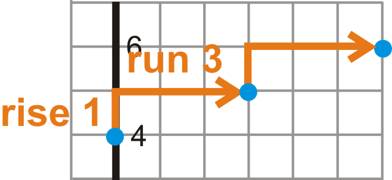

Graph $y = -4x -5$.

**Solution:** Now that the slope is negative, the vertical distance will “fall” instead of rise. Also, because the slope is a whole number, we need to put it over 1. Therefore, for a slope of -4, the line will fall 4 and run 1 OR rise 4 and run backward 1. Start at the $y-$intercept, and then use the slope to find a few more points.

Graph $x = 5$.

**Solution:** Any line in the form $x = a$ is a vertical line. To graph any vertical line, plot the value, in this case 5, on the $x-$axis. Then draw the vertical line.

**Guided Practice**

Graph the following lines.

1. $y = -x + 2$

2. $y = \frac{3}{4}x - 1$

3. $y = -6$

**Answers**

All the answers are on the same grid below.

 and the slope is -1, which means you fall 1 and run 1.")

2. Plot (0, -1) and then rise 3 and run 4 to the next point, (4, 2).

3. Plot -6 on the $y-$axis and draw a horizontal line.

**Problem Set**

Graph the following lines in the Cartesian plane.

1.  $y = -2x -3$
2.  $y = x + 4$
3.  $y = \frac{1}{3}x - 1$
4.  $y = 9$
5.  $y = - \frac{2}{5}x + 7$
6.  $y = \frac{2}{4}x - 5$
7.  $y = -5x -2$
8.  $y = -x$
9.  $y = 4$
10. $x = -3$
11. $y = \frac{3}{2}x + 3$
12. $y = - \frac{1}{6}x - 8$
13. Graph $y = 4$ and $x = -6$ on the same set of axes. Where do they intersect?
14. If you were to make a general rule for the lines $y = b$ and $x = a$, where will they always intersect?
15. The cost per month, $C$ (in dollars), of placing an ad on a website is $C = 0.25x + 50$, where $x$ is the number of times someone clicks on your link. How much would it cost you if 500 people clicked on your link?

Graph a Line in Standard Form
-----------------------------

**Objective**

To graph a line in standard form.

**Guidance**

When a line is in standard form, there are two different ways to graph it. The first is to change the equation to slope-intercept form and then graph as shown in the previous concept. The second is to use standard form to find the $x$ and $y-$intercepts of the line and connect the two. Here are a few examples.

**Example A**

Graph $5x - 2y = -15$.

**Solution:** Let’s use approach #1; change the equation to slope-intercept form.

$$
\begin{align*}
5x -2y &= -15\\
-2y &= -5x - 15\\
y &= \frac{5}{2}x + \frac{15}{2}
\end{align*}
$$

The $y-$intercept is $\left( 0, \frac{15}{2} \right)$. Change the improper fraction to a decimal and approximate it on the graph, (0, 7.5). Then use slope triangles. If you find yourself running out of room “rising 5” and “running 2,” you could also “fall 5” and “run backwards 2” to find a point on the other side of the $y-$intercept.

Graph $4x - 3x = 21$.

**Solution:** Let’s use approach #2; find the $x$ and $y-$intercepts (from _Standard Form of a Line_ concept). Recall that the other coordinate will be zero at these points. Therefore, for the $x-$intercept, plug in zero for $y$ and for the $y-$intercept, plug in zero for $x$.

$$
\begin{align*}
4x - 3(0) &= 21 && 4(0) -3y = 21\\
4x &= 21 && \quad \ \ -3y = 21\\
x &= \frac{21}{4} \ or \ 5.25 && \qquad \quad \ y = -7
\end{align*}
$$

Now, plot each on their respective axes and draw a line.

1. Graph $4x + 6y = 18$ by changing it into slope-intercept form.

2. Graph $5x - 3y = 30$ by plotting the intercepts.

**Answers**

1. Change $4x + 6y = 18$ into slope-intercept form by solving for $y$, then graph.

\begin{align*}
4x +6y &= 18\\
6y &= -4x + 18\\
y &= - \frac{2}{3}x + 3
\end{align*}
$$

2. Substitute in zero for $x$, followed by $y$ and solve each equation.

$$
\begin{align*}
5(0) - 3y &= 30 && 5x -3(0) = 30\\
-3y &= 30 && \qquad \quad 5x = 30\\
y &= -10 && \qquad \quad \ x = 6
\end{align*}
$$

Now, plot each on their respective axes and draw a line.

Graph the following lines by changing the equation to slope-intercept form.

1.  $-2x + y = 5$
2.  $3x + 8y = 16$
3.  $4x -2y = 10$
4.  $6x + 5y = -20$
5.  $9x - 6y = 24$
6.  $x + 4y = -12$

Graph the following lines by finding the intercepts.

7.  $2x + 3y = 12$
8.  $-4x + 5y = 30$
9.  $x - 2y = 8$
10. $7x + y = -7$
11. $6x + 10y = 15$
12. $4x -8y = -28$
13. **Writing** Which method do you think is easier? Why?
14. **Writing** Which method would you use to graph $x = -5$? Why?

</article>

### 2.4 Relations and Functions

<article>

**Objective**

To determine what a relation, function, the domain, and range are for linear equations.

**Review Queue**

1. Plot the points (5, -1), (3, 6), (-4, -4), and (-7, -4) on the same set of axes.

2. What is the equation of the line that passes through (2, 3) and (-10, 9)?

3. What is the equation of the line that is perpendicular to the line from #2 and passes through (-5, -4)?

4. What is the equation of the line that is parallel to the line from #3 and passes through (6, -11)?

5. How do the lines from #2 and #4 relate to each other?

Defining Relations and Functions
--------------------------------

**Objective**

To learn what a relation and a function are and how they pertain to linear equations.

**Watch This**

Watch this video and keep in mind that the **domain** and **range** are the **input** and **output** values.

!?[0](https://www.youtube.com/watch?v=Uz0MtFlLD-k)

[Khan Academy: Relations and Functions](http://www.youtube.com/watch?v=Uz0MtFlLD-k)

**Guidance**

Functions are a very important part of Algebra II. From this point on, we are going to study several different types of functions: linear, quadratic, cubic, polynomial, rational and trigonometric.

First, every set of points is called a **relation.** A relation is a grouped set of points that relate, or have something in common with each other. Here are a few examples of relations.

$$
\begin{align*}
&\{(3, -2), (-4, -5), (7, -2), (9, 1)\} && \{(-4, 1), (0, 3), (0, 0), (6, -7)\} && y = \sqrt {x + 6}\\
& y = -2x + 3 && x^2 + y^2 = 9 && 3y - x^2 + 4x = 15
\end{align*}
$$

Whenever we talk about a set of points, the { }, or brackets are used. In the examples above, there are two sets of points. All 6 of these sets or equations are examples of relations. Relations also have an **input** and an **output.** Typically, all inputs are the $x-$values (and can be called the **domain**), and all outputs are the $y-$values (and can be called the **range**). The input could also be considered the **independent variable** and the output would be the **dependent variable.** Again, the $y-$value depends on the value of $x$. As in the equation of the line, above, if we plug in -1 for $x$, then we can determine what $y$ is.

A more specific type of relation is a function. A **function** is a relation where there is exactly one output for every input. It cannot be a function if at least one input has more than one output. Simply stated, the $x-$values of a function cannot repeat. When an equation is a function, $y$ is sometimes rewritten as $f(x)$ (pronounced "$f$ of $x$"). $f(x)$ is the **function notation.** $f(x)$ will be used more in later chapters.

**Example A**

Compare {(3, -2), (-4, -5), (7, -2), (9, 1)} and {(-4, 1), (0, 3), (0, 0), (6, -7)} from above. One is a function and one is not. Which one is the function?

**Solution:** Look in each set to see if the $x-$values repeat at all. In the second set of points, the $x-$value, 0, is repeated in the second and third points. There is not exactly one output for this value. That means the second set of points is not a function. The first set is.

**Example B**

Below are input/output tables. Determine which table represents a function.

a)  ")

\[Figure 2\]

**Solution:** Think back to the definition of a function, “it cannot be a function if at least one input has more than one output.” a) has one input that has more than one output. Therefore, it is not a function. b) does not have an input with two different outputs. Therefore, it is a function.

Another way to approach these problems is to write out the points that are created and then determine if the $x-$values repeat. For example, in part a, the points would be {(1, 5), (2, -1), (3, 6), (3, 7)}. 3 is repeated, meaning it is not a function.

We can also apply this idea to equations. Every equation is a relation, but not every equation is a function. The easiest way to determine if an equation is a function is to do the **Vertical Line Test.** The Vertical Line Test will help you determine if any $x-$values repeat. First, plot or graph the equation. Then draw several vertical lines. If the graph of the equation touches any vertical line more than once, it is not a function. This works because all vertical lines are in the form $x = a$, so the $x-$value for any vertical line will always be the same. The Vertical Line Test tells us if any $x-$values repeat within a graphed relation.

**Example C**

Determine if the equation above, $x^2 + y^2 = 9$ represents a function.

**Solution:** The graph of $x^2 + y^2 = 9$ is a circle with radius 3.

However, if we solve the equation for $y$, we get $y = \pm\sqrt{-x^2 + 9}$ or $y = \sqrt{-x^2 + 9}$ and $y = -\sqrt{-x^2 + 9}$. These two equations separately are functions. Think of them as the top and bottom halves of the circle.

**Vocabulary**

__Relation__

A set of points either grouped by { } or by an equation.

__Function__

A relation where there is exactly one output for every input. The notation is $f(x)$, said “function of $x$” or “$f$ of $x$.”

__Input__

The values that are plugged in to a relation or function. Typically, the $x-$values.

__Output__

The values that are a result of the input being plugged in to a relation or function. Typically, the $y-$values.

__Independent Variable__

The input of a function.

__Dependent Variable__

The output of a function.

__Vertical Line Test__

A test to determine if a graph of an equation is a function. It involves drawing several vertical lines over the graph. If the graph touches any vertical line more than once, it is not a function.

**Guided Practice**

Determine if the following relations are functions. Briefly explain your answer.

1. {(3, -5), (8, 1), (-3, -3), (5, 1)}

2. {(9, -2), (0, 0), (7, 4), (9, 3)}

3. ")

\[Figure 6\]

**Answers**

1. Yes, the $x-$values do not repeat.

2. No, there are two 9’s in the $x-$values.

3. Yes, all the outputs have different inputs.

4. Yes, this graph passes the Vertical Line Test. Any vertical line touches this graph once.

**Problem Set**

Determine if the following relations are functions. Briefly explain your answer.

1.  {(3, 4), (5, 6), (7, 8), (9, 10)}
2.  {(-9, -10), (4, -5), (6, -5), (4, -10)}
3.  {(-5, -7), (0, 4), (-5, 3), (9, 4)}
4.  {(3, -12), (6, -1), (-10, 5), (-2, 9)}
5.  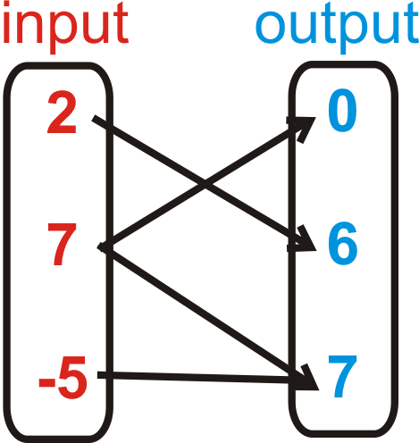\[Figure 7\]
6.  \[Figure 8\]
7.  \[Figure 9\]
8.  \[Figure 10\]
9.  \[Figure 11\]
10. \[Figure 12\]
11. \[Figure 13\]
12. \[Figure 14\]
13. \[Figure 15\]
14. \[Figure 16\]
15. \[Figure 17\]
16. \[Figure 18\]

HINT: Recall that with open circles, the point is not included.

For problems 17-19, determine if the following lines are functions.

17. $y = -3x - 1$
18. $y = \frac{2}{3}x + 6$
19. $y = -2$
20. Is $x = 4$ a function? Why or why not?
21. From problems 17-20, what can you conclude about linear equations?

Finding the Domain and Range of Functions
-----------------------------------------

**Objective**

To find the domain and range of certain functions and sets of points.

**Watch This**

!?[0](https://www.youtube.com/watch?v=nnU1KRvde_M)

[James Sousa: Ex 2: Determine the Domain and Range of the Graph of a Function](http://www.youtube.com/watch?v=nnU1KRvde_M)

**Guidance**

The input and output of a function is also called the domain and range. The **domain** of a function is the set of all input values. The **range** of a function is the set of all output values. Sometimes, a function is a set of points. In this case, the domain is all the $x-$values and the range is all the $y-$values. Functions can also be linear and polynomial equations. In these instances, you need to graph the function to see where it is defined. You may notice that some functions are defined for “all real numbers.” The symbol, $\mathbb{R}$, is used to denote the set of all real numbers.

**Example A**

Determine if {(9, 2), (7, -3), (4, -6), (-10, 4), (-2, -7)} is a function. If so, find the domain and range.

**Solution:** First, this is a function because the $x-$values do not repeat. To find the domain, we need to list all the $x-$values. The range is all the $y-$values. Typically, you would list the values in the order they appear. Notice the notation.

$$
\begin{align*}
& x \in \{9, 7, 4, -10, -2\}\\
& y \in \{2, -3, -6, 4, -7\}
\end{align*}
$$

The $\in$ symbol means “an element of/in.” The braces, { }, around the $x$ and $y-$values, indicate that each is a set. In words, you would say, “$x$ is an element in the set 9, 7, 4, -10, and 2.” Depending on the text, you may see “:” (colon) interchanged with the “$\in$” symbol and sets without { } around them.

**Example B**

Find the domain and range of $y = x - 3$.

**Solution:** Because this is a linear equation we also know that it is a linear function, from the previous concept. All lines continue forever in both directions, as indicated by the arrows.

Domain: $x \in \mathbb{R}$, $x \in (-\infty, \infty)$, $x$ is all reals

In words, $x$ is an element in the set of real numbers.

The second option, $(-\infty, \infty)$, is an interval, not a point. The parenthesis indicate that infinity, $\infty$, and negative infinity, $-\infty$, are not included in the interval, but every number between them is. To include an endpoint in the interval, use \[ or \] brackets. This is called **interval notation.**

The range of this function is also continuous. Therefore, the range is also the set of all real numbers. We can write the range in the same ways we wrote the domain, but with $y$ instead of $x$.

Range: $y \in \mathbb{R}$ or $y \in (-\infty, \infty)$

**Example C**

Find the domain and range of the graphed function below.

To find the domain, look at the possible $x-$values. Notice that when $x$ is between -2 and -1 it is not defined, or there are no $x-$values.

$. The $\cup$ symbol means “union.” In words, the domain is “all real numbers except those between -2 and -1.” Notice that -2 is included in the domain because the dot at -2 is closed. To find the range, we need to look at the possible $y-$values. Changing our viewpoint to look at the $y-$axis, at first glance, it looks like the function is not defined from 1 to -3.")

However, upon further investigation, the branch on the left does pass through the yellow region, where we though the function was not defined. This means that the function is defined between 1 and -3 and thus for all real numbers. However, below -3, there are no $y-$values. The range is $y \in [-3, \infty)$.

__Domain__

The input of a function.

__Range__

The output of a function.

__Continuous Function__

A function without breaks or gaps.

__Interval Notation__

The notation $[a, b)$, where a function is defined between $a$ and $b$. Use ( or ) to indicate that the end value is not included and \[ or \] to indicate that the end value is included. Infinity and negative infinity are never included in interval notation.

__Piecewise Function__

A function that pieces together two or more parts of other functions to create a new function.

$\mathbb{R}:$ The set of all real numbers.

$\cup:$ Union notation. This notation is used to join together to parts of a domain or range.

$\in:$ Element notation. In this text, it is used to state that $x$ or $y$ is an “element” in the given domain or range. It can also mean that $x$ or $y$ is included in the given domain or range.

$\infty$ and $-\infty:$ The symbols for infinity and negative infinity, respectively.

**Guided Practice**

Find the domain and range of the following functions.

1. {(8, 3), (-4, 2), (-6, 1), (5, 7)}

2. $y = -\frac{1}{2}x + 4$

3. ")

\[Figure 24\]

**Answers**

1. Domain: $x \in \{8,-4,-6,5\}$ Range: $y \in \{3,2,1,7\}$

2. Domain: $x \in \mathbb{R}$ Range: $y \in \mathbb{R}$

All lines are continuous functions and will always have the same domain and range.

3. This is a piecewise function. The $x-$values are not defined from -2 to 1. The range looks like it is not defined from 1 to 7, but the lines continue on, filling in that space as $x$ gets larger, both negatively and positively.

Domain: $x \in (-\infty,-2)\cup (1,\infty)$ Range: $y \in \mathbb{R}$

4. This is a parabola, the graph of a quadratic equation. Even though it might not look like it, the ends the graph continue up, infinitely, and $x$ keeps growing. In other words, $x$ is not limited to be between -9 and 5. It is all real numbers. The range, however, seems to start at -6 and is all real numbers above that value.

Domain: $x \in \mathbb{R}$ Range: $y \in [-6,\infty)$

**Problem Set**

Determine if the following sets of points are functions. If so, state the domain and range.

1.  {(5, 6), (-1, 5), (7, -3), (0, 9)}
2.  {(9, 8), (-7, 8), (-7, 9), (8, 8)}
3.  {(6, 2), (-5, 6), (-5, 2)}
4.  {(-1, 2), (-6, 3), (10, 7), (8, 11)}

Find the domain and range of the following functions.

5.  $y = 3x - 7$
6.  $6x -2y = 10$
7.  \[Figure 25\]
8.  \[Figure 26\]
9.  \[Figure 27\]
10. \[Figure 28\]
11. 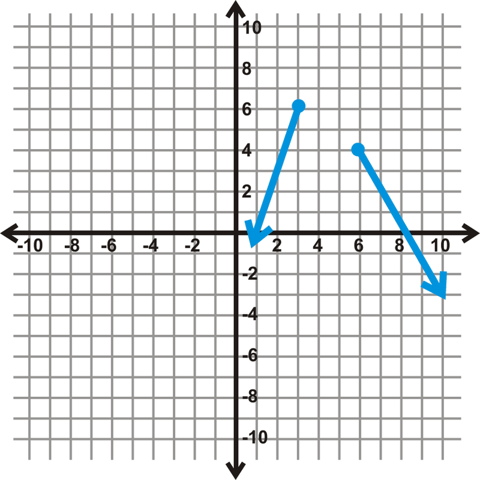\[Figure 29\]
12. **Challenge** \[Figure 30\]

</article>

### 2.5 Graphing Linear Inequalities in Two Variables

<article>

**Objective**

To graph a linear inequality in two variables on the Cartesian plane.

**Review Queue**

Graph the following lines on the same set of axes.

1. $y = \frac{1}{4}x -2$

2. $x - y = -6$

3. $2x + 5y = 15$

Solve the following inequalities. Graph the answer on a number line.

4. $4x - 5 \le 11$

5. $\frac{3}{5}x > - 12$

6. $-6x + 11 \ge - 13$

Testing Solutions for Linear Inequalities in Two Variables
----------------------------------------------------------

**Objective**

To determine if an ordered pair is a solution to a linear inequality in two variables.

**Watch This**

!?[0](https://www.youtube.com/watch?v=-x-zt_yM0RM)

[James Sousa: Ex: Determine if Ordered Pairs Satisfy a Linear Inequality](http://www.youtube.com/watch?v=-x-zt_yM0RM)

**Guidance**

A **linear inequality** is very similar to the equation of a line, but with an inequality sign. They can be written in one of the following ways:

$$
\begin{align*}
Ax + By < C && Ax + By > C && Ax + By \le C && Ax + By \ge C
\end{align*}
$$

Notice that these inequalities are very similar to the standard form of a line. We can also write a linear inequality in slope-intercept form.

$$
\begin{align*}
y < mx + b && y > mx + b && y \le mx + b && y \ge mx + b
\end{align*}
$$

In all of these general forms, the $A, B, C, m$, and $b$ represent the exact same thing they did with lines.

An ordered pair, or point, is a **solution** to a linear inequality if it makes the inequality true when the values are substituted in for $x$ and $y$.

**Example A**

Which ordered pair is a solution to $4x - y > -12$?

a) (6, -5)

b) (-3, 0)

c) (-5, 4)

**Solution:** Plug in each point to see if they make the inequality true.

a) 

$$
\begin{align*}
4(6) - (-5) & >-12\\
24 + 5 & > -12\\
29 & > -12
\end{align*}
$$

b)

$$
\begin{align*}
4(-3)-0 & >-12\\
-12 & \ \cancel{>} - 12
\end{align*}
$$

c)

$$
\begin{align*}
4(-5) - 4 & > -12\\
-20 -4 & > -12\\
-24 & \ \cancel{>} -12
\end{align*}
$$

Of the three points, a) is the only one where the inequality holds true. b) is not true because the inequality sign is only “greater than,” not “greater than or equal to.”

**Vocabulary**

__**Linear Inequality**__

An inequality, usually in two variables, of the form $Ax +By < C, Ax + By > C, Ax +By \le C$, or $Ax + By \ge C$.

__**Solution**__

An ordered pair that satisfies a given inequality.

**Guided Practice**

1. Which inequality is (-7, 1) a solution for?

a) $y < 2x - 1$

b) $4x -3y \ge 9$

c) $y > -4$

2. List three possible solutions for $5x - y \le 3$.

**Answers**

1. Plug (-7, 1) in to each equation. With c), only use the $y-$value.

a) 

$$
\begin{align*}
1 &< 2(-7) -1\\
1 & \ \bcancel{<} - 15
\end{align*}
$$

b) 

$$
\begin{align*}
4(-7) -3(1) &\ge 9\\
-28 -3 &\ge 9\\
-31 & \ \cancel{\ge} \ 9
\end{align*}
$$

c) $1 > -4$

(-7, 1) is only a solution to $y > -4$.

2. To find possible solutions, plug in values to the inequality. There are infinitely many solutions. Here are three: (-1, 0), (-4, 3), and (1, 6).

$$
\begin{align*}
5(-1) -0 & \le 3 && 5(-4) -3 \le 3 && 5(1) -6 \le 3\\
-5 & \le 3 && \qquad -17 \le 3 && \quad \ \ -1 \le 3
\end{align*}
$$

**Problem Set**

Using the four inequalities below, determine which point is a solution for each one. There may be more than one correct answer. If the answer is none, write _none of these_.

A) $y \le \frac{2}{3}x - 5$

B) $5x +4y > 20$

C) $x - y \ge -5$

D) $y > -4x + 1$

1.  (9, -1)
2.  (0, 0)
3.  (-1, 6)
4.  (-3, -10)

Determine which inequality each point is a solution for. There may be more than one correct answer. If the answer is none, write _none of these_.

A) (-5, 1)

B) (4, 2)

C) (-12, -7)

D) (8, -9)

5.  $2x -3y > 8$
6.  $y \le -x -4$
7.  $y \ge 6x + 7$
8.  $8x +3y < -3$
9.  Is (-6, -8) a solution to $y < \frac{1}{2}x -6$?
10. Is (10, 1) a solution to $y \ge -7x + 1$?

For problems 11 and 12, find three solutions for each inequality.

11. $5x -y >12$
12. $y \le -2x + 9$

Graphing Inequalities in Two Variables
--------------------------------------

**Objective**

To graph a linear inequality on the Cartesian plane.

**Watch This**

!?[0](https://www.youtube.com/watch?v=lxTQrsUip9g)

[Khan Academy: Graphing linear inequalities in two variables 2](http://www.youtube.com/watch?v=lxTQrsUip9g)

**Guidance**

Graphing linear inequalities is very similar to graphing lines. First, you need to change the inequality into slope-intercept form. At this point, we will have a couple of differences. If the inequality is in the form $y < mx + b$ or $y > mx + b$, the line will be dotted or dashed because it is not a part of the solution. If the line is in the form $y \le mx + b$ or $y \ge mx + b$, the line will be solid to indicate that it is included in the solution.

The second difference is the shading. Because these are inequalities, not just the line is the solution. Depending on the sign, there will be shading above or below the line. If the inequality is in the form $y < mx + b$ or $y \le mx + b$, the shading will be below the line, in reference to the $y-$axis.

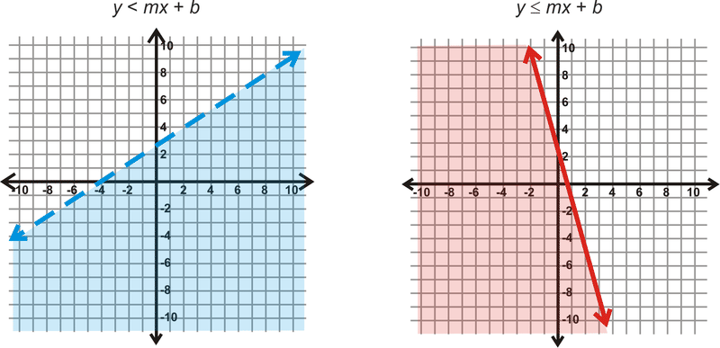

Graph $4x -2y < 10$.

**Solution:** First, change the inequality into slope-intercept form. Remember, that if you have to divide or multiply by a negative number, you must flip the inequality sign.

, the inequality yields $-20 < 10$, which tells us that our shading is correct.")

**Example B**

Graph $y \le - \frac{2}{3}x + 6$.

**Solution:** This inequality is already in slope-intercept form. So, graph the line, which will be solid, and then determine the shading. Looking at the example graphs above, this inequality should look like the red inequality, so shade below the line.

. Plugging this into the inequality, we get $0 \le 6$, which is true.")

**Example C**

Graph $y \ge 4$.

**Solution:** Treat this inequality like you are graphing a horizontal line. We will draw a solid line at $y = 4$ and then shade above because of the “$\ge$” sign.

Determine the linear inequality that is graphed below.

 and (6, 2) (from the points drawn on the graph). This means that the $y-$intercept is (0, 8). Then, using slope triangles we fall 6 and run 6 to get to (6, 2). This means the slope is $\frac{-6}{6}$ or -1. Because we have a dotted line and the shading is above, our sign will be the > sign. Putting it all together, the equation of our linear inequality is $y > -x + 8$.")

$^*$When finding the equation of an inequality, like above, it is easiest to find the equation in slope-intercept form. To determine which inequality sign to use, look at the shading along the $y-$axis. If the shaded $y-$values get larger, the line will be in the form or $y > mx + b$ or $y \ge mx + b$. If they get smaller, the line will be in the form $y < mx + b$ or $y \le mx + b$.

**Guided Practice**

1. Graph $3x - 4y > 20$.

2. Graph $x < -1$.

3. What is the equation of the linear inequality?

1. First, change the inequality into slope-intercept form.

$$
\begin{align*}
3x -4y & > 20\\
-4y & > -3x + 20\\
y & < \frac{3}{4}x -5
\end{align*}
$$

Now, we need to determine the type of line and shading. Because the sign is “<,” the line will be dashed and we will shade below.

 in the original inequality, we get $42 > 20$, which is true.")

2. To graph this line on the $x-y$ plane, recall that all vertical lines have the form $x = a$. Therefore, we will have a vertical _dashed_ line at -1. Then, the shading will be to the left of the dashed line because that is where $x$ will be less than the value of the line.

. Using a slope triangle, to count down to the next point, we would fall 4, and run backward 1. This means that the slope is $\frac{-4}{-1} = 4$. The line is solid and the shading is above, so we will use the $\ge$ sign. Our inequality is $y \ge 4x + 1$.")

**Problem Set**

Graph the following inequalities.

1.  $y > x -5$
2.  $3x -2y \ge 4$
3.  $y < -3x + 8$
4.  $x +4y \le 16$
5.  $y < -2$
6.  $y < - \frac{1}{2}x - 3$
7.  $x \ge 6$
8.  $8x +4y \ge -20$
9.  $-4x + y \le 7$
10. $5x -3y \ge -24$
11. $y > 5x$
12. $y \le 0$

Determine the equation of each linear inequality below.

13. \[Figure 12\]
14. \[Figure 13\]
15. \[Figure 14\]
16. 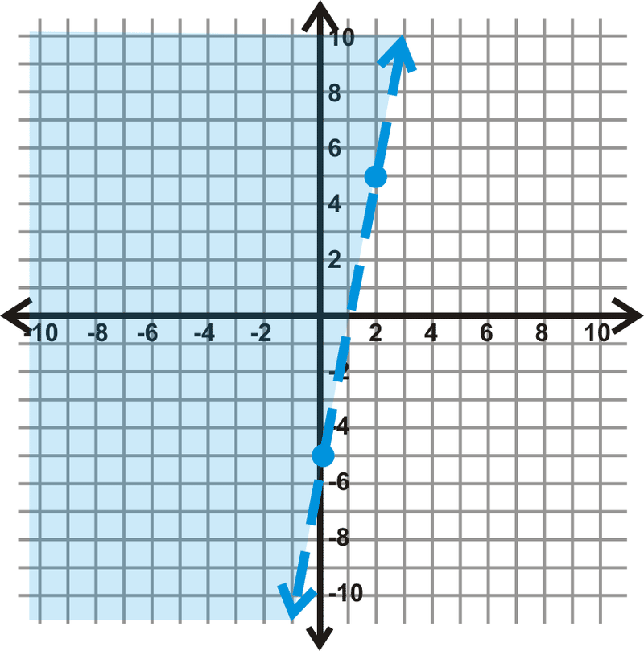\[Figure 15\]

</article>

### 2.6 Graphing Absolute Value Functions

<article>

**Objective**

To understand and graph a basic absolute value function.

**Review Queue**

Solve the following equations.

1. $|x - 1| = 6$

2. $|3x + 5| = 16$

3. $2\bigg | \frac{1}{4}x - 3 \bigg | + 9 = 23$

Graphing Basic Absolute Value Functions
---------------------------------------

**Objective**

To learn about the basic properties of absolute value functions.

**Watch This**

!?[0](https://www.youtube.com/watch?v=PJt5dSj7PN4)

[James Sousa: Ex: Graph an Absolute Value Function Using a Table of Values](http://www.youtube.com/watch?v=PJt5dSj7PN4)

**Guidance**

In the _Solving Absolute Value Equations_ concept, we learned how to solve and define absolute value equations. We will now take this idea one step further and graph absolute value equations.

**Investigation: Graphing the Parent Graph of an Absolute Value Function**

1. We are going to graph $y = |x|$. Draw a table for $x$ and $y$, with the $x-$values ranging from -3 to 3.

| $x$ | $\|x\|$ | $y$ |
| --- | --- | --- |
| $-3$ | $\|-3\|$ | 3   |
| \-2 | $\|-2\|$ | 2   |
| \-1 | $\|-1\|$ | 1   |
| 0   | $\|0\|$ | 0   |
| 1   | $\|1\|$ | 1   |
| 2   | $\|2\|$ | 2   |
| 3   | $\|3\|$ | 3   |

2. Recall that the absolute value of a number is always positive. Now that you have 7 sets of points, plot each one and graph the function.

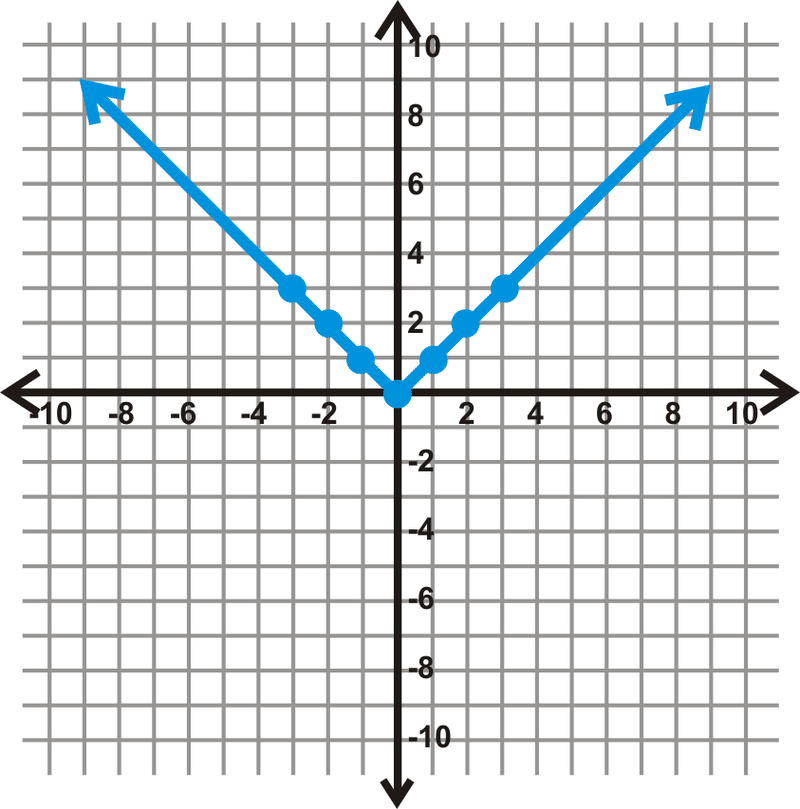

4. Now, fold your graph on the $x-$axis. What do you notice?

In the investigation, you should discover that when you fold your graph on the $x-$axis, the line $y = x$ becomes the absolute value equation, $y = |x|$. That is because the absolute value of a number can never be zero; therefore, the range will always be positive. We call $y = |x|$ the **parent graph** because it is the most basic of all the absolute value functions. We will also compare other absolute value functions to this graph. All linear absolute value functions have this “V” shape.

In general, we can define the graph of $y = |x|$ as 

$$
\begin{align*}
y= \begin{cases} x; & x \ge 0\\-x; & x < 0\end{cases}
\end{align*}
$$

. From this, we see that each side, is the mirror image of the other over a vertical line, through the vertex.

**Example A**

Use a table to graph $y = |x-3|$. Determine the domain and range.

**Solution:** In general, when you use a table to graph a function, pick some positive and negative numbers, as well as zero. Use the equation to help you determine which $x-$values to pick. Setting what is inside the absolute value equal to zero, we get that $x = 3$. Pick three values on either side of $x = 3$ and then graph.

| $x$ | $\|x-3\|$ | $y$ |
| --- | --- | --- |
| 0   | $\|-3\|$ | 3   |
| 1   | $\|-2\|$ | 2   |
| 2   | $\|-1\|$ | 1   |
| 3   | $\|0\|$ | 0   |
| 4   | $\|1\|$ | 1   |
| 5   | $\|2\|$ | 2   |
| 6   | $\|3\|$ | 3   |

$.")

**Example B**

Use a table to graph $y = |x|-5$. Determine the domain and range.

**Solution:** Be careful! Here, the minus 5 is not inside the absolute value. So, first take the absolute value of the $x-$value and then subtract 5. In cases like these, the range can include negative numbers.

| --- | --- | --- |
| $-3$ | $\|-3. - 5$ | \-2 |
| \-2 | $\|-2. - 5$ | \-3 |
| \-1 | $\|-1. - 5$ | \-4 |
| 0   | $\|0. - 5$ | \-5 |
| 1   | $\|1. - 5$ | \-4 |
| 2   | $\|2. - 5$ | \-3 |
| 3   | $\|3. - 5$ | \-2 |

Here, the graph shifts down 5 when compared to the parent graph. The domain will be all real numbers, $x \in \mathbb{R}$, and the range will be all real numbers greater than or equal to -5, $y \in [-5, \infty)$.

In these three absolute value graphs, you may have noticed that there is a **minimum** point. This point is called the **vertex.** For example, in Example B, the vertex is (0, -5). The vertex can also be a **maximum.** See the next example.

**Example C**

Use a table to graph $y = -|x-1|+2$. Determine the vertex, domain, and range.

**Solution:** Determine what makes the inside of the absolute value equation zero, $x =1$. Then, to make your table of values, pick a couple values on either side of $x = 1$.

| --- | --- | --- |
| $-2$ | $-\|-2 - 1. + 2$ | \-1 |
| \-1 | $-\|-1 - 1. + 2$ | 0   |
| 0   | $-\|0 - 1. + 2$ | 1   |
| 1   | $-\|1 - 1. + 2$ | 2   |
| 2   | $-\|2 - 1. + 2$ | 1   |
| 3   | $-\|3 - 1. + 2$ | 0   |
| 4   | $-\|4 - 1. + 2$ | \-1 |

The vertex is (1, 2) and in this case, it is the maximum value. The domain is $x \in \mathbb{R}$, and the range is $y \in (-\infty, 2]$.

**Vocabulary**

__Absolute Value__

The distance away from zero a number is. The absolute value is always positive.

__Parent Graph__

The simplest form of a particular type of function. All other functions of this type are usually compared to the parent graph.

__Vertex__

The highest or lowest point of a graph.

__Minimum__

The lowest point of a graph. The minimum will yield the smallest value of the range.

__Maximum__

The highest point of a graph. The maximum will yield the largest value of the range.

**Guided Practice**

Graph the following functions using a table. Determine the vertex, domain, and range of each function.

1. $y = -|x-5|$

2. $y = |x+4|-2$

**Answers**

1. Determine what makes the inside of the absolute value equation zero, $x =5$. Then, to make your table of values, pick a couple values on either side of $x = 5$.

| --- | --- | --- |
| 2   | $-\|2 - 5\|$ | \-3 |
| 3   | $-\|3 - 5\|$ | \-2 |
| \-4 | $-\|4 - 5\|$ | \-1 |
| 5   | $-\|5 - 5\|$ | 0   |
| 6   | $-\|6 - 5\|$ | \-1 |
| 7   | $-\|7 - 5\|$ | \-2 |
| 8   | $-\|8 - 5\|$ | \-3 |

The vertex is (5, 0) and in this case, it is the maximum value. The domain is $x \in \mathbb{R}$, and the range is $y \in (-\infty, 0]$.

2. Determine what makes the inside of the absolute value equation zero, $x =-4$. Then, to make your table of values, pick a couple values on either side of $x = -4$.

| --- | --- | --- |
| $-1$ | $\|-1 + 4. - 2$ | 1   |
| \-2 | $\|-2 + 4. - 2$ | 0   |
| \-3 | $\|-3 + 4. - 2$ | \-1 |
| \-4 | $\|-4 + 4. - 2$ | \-2 |
| \-5 | $\|-5 + 4. - 2$ | \-1 |
| \-6 | $\|-6 + 4. - 2$ | 0   |
| \-7 | $\|-7 + 4. - 2$ | 1   |

The vertex is (-4, -2) and in this case, it is the minimum value. The domain is $x \in \mathbb{R}$, and the range is $y \in [-2, \infty)$.

**Problem Set**

Graph the following functions using a table. Determine the vertex, domain, and range of each function.

1.  $y = |x+6|$
2.  $y = |x-4|$
3.  $y = -|x|+3$
4.  $y = |x|-2$
5.  $y = -|x+3|+7$
6.  $y = |x-1|-6$
7.  $y = 2|x|$
8.  $y = -3|x|$
9.  $y = \frac{1}{3}|x|$

Use problems 1-9 to answer fill in the blanks.

10. If there is a negative sign in front of the absolute value, the graph is \_\_\_\_\_\_\_\_\_\_\_\_\_\_\_\_ (when compared to the parent graph).
11. If the equation is $y = |x-h|+k$, the vertex will be \_\_\_\_\_\_\_\_\_\_\_\_\_\_\_\_\_\_\_.
12. The domain of an absolute value function is always \_\_\_\_\_\_\_\_\_\_\_\_\_\_\_\_\_\_\_\_\_\_\_\_\_\_\_\_.
13. For $y = a|x|$, if $a > 1$, then the graph will be \_\_\_\_\_\_\_\_\_\_\_\_\_\_\_\_\_\_\_ than the parent graph.
14. For $y = a|x|$, if $0 < a < 1$, then the graph will be \_\_\_\_\_\_\_\_\_\_\_\_\_\_\_\_\_\_\_ than the parent graph.
15. Without making a table, what is the vertex of $y = |x-9|+7$?

Using the General Form and the Graphing Calculator
--------------------------------------------------

**Objective**

To graph more complicated absolute value functions and use the graphing calculator.

**Guidance**

In the problem set of the previous concept, we were introduced to the general equation of an absolute value function. Let’s formally define it here.

**General Form of an Absolute Value Function:** For any absolute value function, the general form is $y = a|x-h|+k$, where $a$ controls the width of the “V” and $(h, k)$ is the vertex.

You probably made these connections during the problem set from the previous concept. Now, we will put it all to use together.

**Example A**

Graph $y = |x|$, $y = \frac{1}{2}|x|$, and $y = 2|x|$ on the same set of axes. Compare the three functions.

**Solution:** You can make a table for all three of these functions. However, now that we have a better understanding of absolute value functions, let’s use some patterns. First, look at the vertex. Nothing is being added or subtracted, so the vertex for all three will be (0, 0). Second, look at “$a$.” For an absolute value function, we can think of a like the slope. Referring back to the definition of the parent graph, each function above can be rewritten as:

$$
y = \begin{cases}x;x \ge 0. -x;x < 0\end{cases} \ \text{(blue)}, \quad y = \begin{cases} \frac{1}{2}x;x \ge 0. - \frac{1}{2}x;x < 0\end{cases} \text{(red), and} \ y = \begin{cases} 2x;x \ge 0. -2x;x < 0\end{cases} \ \text{(green)}
$$

Comparing the three, we see that if the slope is between 1 and 0, the opening is wider than the parent graph. If the slope, or $a$, is greater than 1, then that opening is narrower. The amount of the opening between the two sides of an absolute value function (and other functions) is called the **breadth.**

**Example B**

Without making a table, sketch the graph of $y = -|x-6|-2$.

**Solution:** First, determine the vertex. From the general form, we know that it will be (6, -2). Notice that the $x-$_variable is the opposite sign_ of what is in the equation; the $y-$variable is the same. That is our starting point. Then, we have a negative sign in front of the absolute value. This means our $V$ will open down. Finally, there is no $a$ term, so we can assume it is 1, meaning that the slope of each side of the $V$ will be 1 and -1.

**Example C**

Use a graphing calculator to graph $y = |4x+1|-2$. Find the vertex, domain, and range.

**Solution:** _For the TI-83/84_

1. Press the $Y=$ button.

2. Clear any previous functions (press CLEAR) and turn off any previous plots (arrow up to Plot 1 and press ENTER).

3. Press the MATH button, arrow over to NUM and highlight **1:abs**(. Press ENTER.

4. Type in the remaining portion of the function. The screen:

The graph looks like:

. The $y-$coordinate is -2, but the 4 inside the absolute value affects the $x-$ coordinate. Set what is inside the absolute value equal to zero to solve for the $x-$coordinate of the vertex.")

$$
\begin{align*}
4x+1 &= 0\\
4x &= -1\\
x &= -\frac{1}{4}
\end{align*}
$$

The vertex is $\left( -\frac{1}{4}, -2\right)$. From the previous concept, we know that the domain is all real numbers. The range will be any number greater than and including -2. In this function, the “$a$” term was inside the absolute value. When this happens, it will always affect the $x-$coordinate of the vertex.

**Vocabulary**

__General Form of an Absolute Value Function__

For any absolute value function, the general form is $y = a|x-h|+k$, where $a$ controls the width of the “$V$” and $(h, k)$ is the vertex.

__Breadth__

The wideness or narrowness of a function with two symmetric sides.

**Guided Practice**

1. Graph $y = 3|x+4|-5$ without a graphing calculator or making a table. Find the vertex, domain, and range of the function.

2. Graph $y = -2|x-5|+1$ using a graphing calculator.

**Answers**

1. First, use the general form to find the vertex, (-4, -5). Then, use $a$ to determine the breadth of the function. $a = 3$, so we will move up 3 and over 1 _in both directions_ to find the points on either side of the vertex.

Domain: $x \in \mathbb{R}$

Range: $y \in [-5, \infty)$

2. Using the steps from Example C, the function looks like:

1.  Graph $y = 3|x|$, $y = -3|x|$, and $y = |-3x|$ on the same set of axes. Compare the graphs.
2.  Graph $y = \frac{1}{4}|x+1|$, and $y = \frac{1}{4}|x|+1$ on the same set of axes. Compare the graphs.
3.  Without graphing, do you think that $y = 2|x|,y = |2x|,$ and $y = |-2x|$ will all produce the same graph? Why or why not?
4.  We know that the domain of all absolute value functions is all real numbers. What would be a general rule for the range?

Use the general form and pattern recognition to graph the following functions. Determine the vertex, domain, and range. No graphing calculators!

5.  $y = |x-2|+5$
6.  $y = -2|x+3|$
7.  $y = \frac{1}{3}|x|+4$
8.  $y = 2|x+1|-2$
9.  $y = - \frac{1}{2}|x-7|$
10. $y = -|x-8|+6$

Use a graphing calculator to graph the following functions. Sketch a copy of the graph on your paper. Identify the vertex, domain, and range.

11. $y = -4|2x+1|$
12. $y = \frac{2}{3}|x-4|+ \frac{1}{2}$
13. $y = \frac{4}{3}|2x-3|- \frac{7}{2}$

**Graphing Calculator Extension** Use the graphing calculator to answer questions 14-16.

14. Graph $y = x^2 -4$ on your calculator. Sketch the graph and determine the domain and range.
15. Graph $y = |x^2 -4|$ on your calculator. Sketch graph and determine the domain and range.
16. How do the two graphs compare? How are they different? What could you do to the first graph to get the second?

</article>

### 2.7 Analyzing Scatterplots

<article>

**Objective**

To plot and analyze scatterplots and find the equation of best fit.

**Review Queue**

1. Find the mean, median, and mode of the data set below:

14, 19, 12, 22, 20, 30, 14, 25, 32

2. Graph the lines below. You can put them all on the same set of axes.

a) $y = \frac{1}{2}x+4$

b) $y = \frac{2}{3}x+5$

c) $y = x+2$

3. Using the lines from #2, estimate the points of intersection of:

a) lines $a$ and $b$

b) lines $b$ and $c$

c) lines $a$ and $c$

Plotting a Scatterplot and Finding the Equation of Best Fit
-----------------------------------------------------------

**Objective**

To find a linear equation that best fits a set of data (points).

**Guidance**

A **scatterplot** is a set of points that represent data. We plot these points and try to find equations that best approximate their relationship. Because data is not always perfect, not every point will always fit on the line of best fit. The **line of best fit** is the line that is the closest to all the data points. It can be used to approximate data within the set or beyond the set. Scatterplots almost always represent a real-life situation.

Scatterplots can have **positive correlation** if the $x$ and $y$ values tend to increase together. They can have **negative correlation** if $y$ tends to decrease as $x$ tends to increase. And, if the points have no sort of linear pattern, then the data would have relatively **no correlation.** Think of the type of correlations referring to the slope of the line that would best fit that data.

Describe the type of correlation shown in the scatterplot. Explain your answer.

**Solution:** This is a negative correlation. As the years get larger, the sales go down. This could be because in the boom of online/digital and pirated music.

**Example B**

Find the linear equation of best fit for the data set above.

**Solution:** First, it can be very difficult to determine the “best” equation for a set of points. In general, you can use these steps to help you.

1.  Draw the scatterplot on a graph.
2.  Sketch the line that appears to most closely follow the data. Try to have the same number of points above and below the line.
3.  Choose two points on the line and estimate their coordinates. These points do not have to be part of the original data set.
4.  Find the equation of the line that passes through the two points from Step 3.

Let’s use these steps on the graph above. We already have the scatterplot drawn, so let’s sketch a couple lines to find the one that best fits the data.

Using the purple line, we need to find two points on it. The second point, crosses the grid perfectly at (2000, 14). Be careful! Our graph starts at 1999, so that would be considered zero. Therefore, (2000, 14) is actually (1, 14). The line also crosses perfectly at (2007, 10) or (8, 10). Now, let’s find the slope and $y-$intercept.

$$
m = \frac{14-10}{1-8} = - \frac{4}{7}
$$

$$
\begin{align*}
y &= - \frac{4}{7}x+b\\
14 &= - \frac{4}{7}(1)+b \\
14 &= -0.57+b\\
14.57 &= b
\end{align*}
$$

The equation of best fit is $y = - \frac{4}{7}x+14.57$.

However, the equation above assumes that $x$ starts with zero. In actuality, we started with 1999, so our final equation is $y = - \frac{4}{7}(x-1999)+14.57$.

**Example C**

Using the line of best fit above, what would you expect music sales to be in 2010?

**Solution:** In this example, we are using the line of best fit to predict data. Plug in 2010 for $x$ and solve for $y$.

$$
\begin{align*}
y &=	- \frac{4}{7}(2010-1999)+14.57\\
y &= - \frac{4}{7}(11)+14.57\\
y &=8.3
\end{align*}
$$

It is estimated that music industry will make $8.3 billion in music sales in 2010.

**Vocabulary**

__Scatterplot__

A set of data that is plotted on a graph to see if a relationship exists between the points.

__Line of Best Fit__

The linear equation that best approximates a scatterplot.

**Guided Practice**

Use the table below to answer the following questions.

Sleep Requirements, 0-3 years

| **Age,** $x$ | 1   | 3   | 6   | 9   | 12  | 18  | 24  | 36  |
| --- | --- | --- | --- | --- | --- | --- | --- | --- |
| **Sleep,** $y$ | 16  | 15  | 14.25 | 14  | 13.75 | 13.5 | 13  | 12  |

The age is measured in months and sleep is measured in hours. Source: www.babycenter.com

1. Draw a scatterplot with age across the $x-$axis and sleep along the $y-$axis. Count by 3’s for the $x-$values and by 2’s for the $y-$values.

2. Using the steps from Example B, find the line of best fit.

3. Determine the amount of sleep needed for a $2 \frac{1}{2}$ year old and a 5 year old.

**Answers**

1. Here is the scatterplot.

 and (24, 13).")

\begin{align*}
m &= \frac{15-13}{3-24} = - \frac{2}{21}\\
15 &= - \frac{2}{21}(3)+b\\
15 &= -0.29+b\\
15.29 &= b
\end{align*}
$$

The equation of the line is $y = - \frac{2}{21}x+15.29$.

3. First, you need to change the age to months so that it corresponds with the units used in the graph. For a 2.5 year-old, 30 months, s/he should sleep $y = - \frac{2}{21}(30)+15.29 \approx 12.4$ hours. For a 5-year-old, 60 months, s/he should sleep $y = - \frac{2}{21}(60)+15.29 \approx 9.6$ hours.

**Problem Set**

Determine if the scatterplots below have positive, negative, or no correlation.

1.  \[Figure 6\]
2.  \[Figure 7\]
3.  \[Figure 8\]

Plot each scatterplot and then determine the line of best fit.

4.  .

| $x$ | 1   | 2   | 3   | 5   | 7   | 8   |
| --- | --- | --- | --- | --- | --- | --- |
| $y$ | 1   | 3   | 4   | 3   | 6   | 7   |

5.  .

| $x$ | 10  | 9   | 7   | 6   | 5   | 2   |
| --- | --- | --- | --- | --- | --- | --- |
| $y$ | 5   | 6   | 4   | 3   | 3   | 2   |

Use the data below to answer questions 6-8.

The price of Apple $\textcircled{c}$ stock from Oct 2009 - Sept 2011 source: _Yahoo! Finance_

| **10/09** | **11/09** | **12/09** | **1/10** | **2/10** | **3/10** | **4/10** | **5/10** | **6/10** | **7/10** | **8/10** | **9/10** |
| --- | --- | --- | --- | --- | --- | --- | --- | --- | --- | --- | --- |
| $181 | $189 | $198 | $214 | $195 | $208 | $236 | $249 | $266 | $248 | $261 | $258 |
| **10/10** | **11/10** | **12/10** | **1/11** | **2/11** | **3/11** | **4/11** | **5/11** | **6/11** | **7/11** | **8/11** | **9/11** |
| $282 | $309 | $316 | $331 | $345 | $352 | $344 | $349 | $346 | $349 | $389 | $379 |

6.  Draw the scatterplot for the table above. Make the $x-$axis the month and the $y-$axis the price.
7.  Find the linear equation of best fit.
8.  According to your equation, what would be the predicted price of the stock in January 2012?

Use the data below to answer questions 9-11.

Total Number of Home Runs Hit in Major League Baseball, 2000-2010 source: _www.baseball-almanac.com_

| **2000** | **2001** | **2002** | **2003** | **2004** | **2005** | **2006** | **2007** | **2008** | **2009** | **2010** |
| --- | --- | --- | --- | --- | --- | --- | --- | --- | --- | --- |
| 5693 | 5458 | 5059 | 5207 | 5451 | 5017 | 5386 | 4957 | 4878 | 4655 | 4613 |

9.  Draw the scatterplot for the table above. Make the $x-$axis the year and the $y-$axis the number of home runs.
10. Find the linear equation of best fit.
11. According to your equation, how many total home runs should be hit in 2011?

Finding the Equation of Best Fit Using a Graphing Calculator
------------------------------------------------------------

**Objective**

Using the graphing calculator to find the linear equation of best fit for a scatterplot.

**Watch This**

Watch the first part of this video, until about 3:30.

Also, keep in mind that a **line of best fit** can also be called a **linear regression**.

!?[0](https://www.youtube.com/watch?v=bgd4JNzqTsA)

[James Sousa: Linear Regression on the Graphing Calculator](http://www.youtube.com/watch?v=bgd4JNzqTsA)

**Guidance**

In the previous lesson, we learned how to find the linear equation of best fit by hand. This entire process can also be done by your graphing calculator. It is recommended that you use a graphing calculator for two main reasons: accuracy and consistency. The graphing calculator will be more accurate than a calculation by hand and it will also be more consistent between students, or a greater likelihood that everyone will get the same answer.

**Example A**

Below is a table for the total number of home runs hit from 1990-2000. Make a scatterplot using your graphing calculator.

| **1990** | **1991** | **1992** | **1993** | **1994** | **1995** | **1996** | **1997** | **1998** | **1999** | **2000** |
| --- | --- | --- | --- | --- | --- | --- | --- | --- | --- | --- |
| 3317 | 3383 | 3038 | 4030 | 3306 | 4081 | 4962 | 4640 | 5064 | 5528 | 5693 |

**Solution:** Recall pair is a point; (1990, 3317), for example. In the graphing calculator, we need to enter these as $x-$values and $y-$values. To do this, we need to create lists. The $x-$values will be List1, or L1 and the $y-$values will be List2, or L2. _Instructions below are for the TI 83/84._

To create a list:

1. Press STAT.

2. In EDIT, select **1:Edit….** Press ENTER.

3. The List table appears. If there are any current lists, you will need to clear them. To do this, arrow up to L1 so that it is highlighted (black). Press CLEAR, then ENTER. Repeat with L2, if necessary.

4. Now, enter the data into the lists. Enter all the entries into L1 (years) first and press enter between each entry. Then, repeat with L2 and the total home run numbers. Your screen should look something like this when you are done.

.")

6. Press $Y=$.

7. Clear any equations that are in the $Y=$. To do this, arrow down to the equation and press CLEAR. Press $2^{nd}$ MODE (QUIT).

8. Press $2^{nd} Y=$ (STAT PLOT). Turn Plot1 on by highlighting **On** and pressing ENTER. Then, select the first option for the Type of stat plot. Make sure the $X$list is L1 and the $Y$list is L2. To change these, scroll down to **$X$list** (for example), and press $2^{nd}$ 1 (L1). $2^{nd}$ 2 is L2. **Mark** should also be on the first option.

9. Press GRAPH. Nothing may show up. If this is the case, press ZOOM and scroll down to **9:ZoomStat**. Press ENTER. Your plot should look something like this.

Find the equation of best fit for the data from Example A. Use a graphing calculator.

**Solution:** Here are the directions for finding the equation of best fit. In the TI 83/84, it is also called Linear Regression, or LinReg.

1. After completing steps 1-5 above, press STAT and then arrow over to the CALC menu.

2. Select **4:LinReg$(ax+b)$.** Press ENTER.

3. You will be taken back to the main screen. Type **(L1,L2)** and press ENTER. _L1 is $2^{nd}$ 1, L2 is $2^{nd}$ 2 and the comma is the button above the 7._

 press $Y=$ and enter in the equation from Step 4. Press GRAPH.")

Round all answers to the nearest hundredth.

1. Use the data set from Examples A and B from the previous concept and find the equation of best fit with the graphing calculator. Compare this to the answer we found in Example B. Use both equations to find the sales for 2010.

2. Use the data set from the Guided Practice in the previous concept and find the equation of best fit with the graphing calculator. Compare this to the answer we found.

**Answers**

1. From Examples A and B in the previous concept, we did not have a table. You need to estimate the values from the scatterplot. Here is a sample table for the scatterplot. Remember, this is years vs. money, in billions.

| **1999 (0)** | **2000 (1)** | **2001 (2)** | **2002 (3)** | **2003 (4)** | **2004 (5)** | **2005 (6)** | **2006 (7)** | **2007 (8)** | **2008 (9)** | **2009 (10)** |
| --- | --- | --- | --- | --- | --- | --- | --- | --- | --- | --- |
| 14.8 | 14.1 | 13.8 | 13  | 12  | 12.8 | 13  | 12.3 | 11  | 9   | 6.2 |

Now, using Examples A (Steps 1-5) and B (Steps 1-4) from this concept, determine the equation of best fit. If you used the data set above, you should get $y = -0.66x+15.28$. The equation we got in the previous concept was $y = - \frac{4}{7}x+14.57$ or $y = -0.57x+14.57$. Using the calculator’s equation for 2010 (11), we get $y = -0.66(11)+15.28 = 8.02$ billion. Using the equation from the previous concept, we get $y = -0.57(11)+14.57 = 8.3$ billion. As you can see, the answers are pretty close.

2. Using the calculator, we get $y = -0.096x+15.25$. By hand, we got $y = - \frac{2}{21}x+15.29$ or $y = -0.095x+15.29$. Comparing answers from 2.5, or 30 months, with the calculator, we get 12.37 hours and we got 12.4 when we did it by hand. All in all, the answers were quite close.

**Problem Set**

Round all decimal answers to the nearest hundredth.

1.  Using the Apple $\textcircled{c}$ data from the previous concept (repeated below), find the equation of best fit with your calculator. Set Oct. 2009 as $x = 0$.

The price of Apple $\textcircled{c}$ stock from Oct 2009 - Sept 2011 source: _Yahoo! Finance_

| **10/09** | **11/09** | **12/09** | **1/10** | **2/10** | **3/10** | **4/10** | **5/10** | **6/10** | **7/10** | **8/10** | **9/10** |
| --- | --- | --- | --- | --- | --- | --- | --- | --- | --- | --- | --- |
| $181 | $189 | $198 | $214 | $195 | $208 | $236 | $249 | $266 | $248 | $261 | $258 |
| **10/10** | **11/10** | **12/10** | **1/11** | **2/11** | **3/11** | **4/11** | **5/11** | **6/11** | **7/11** | **8/11** | **9/11** |
| $282 | $309 | $316 | $331 | $345 | $352 | $344 | $349 | $346 | $349 | $389 | $379 |

2.  Using the Home Run data from the previous concept (repeated below), find the equation of best fit with your calculator. Set 2000 as $x = 0$.

Total Number of Home Runs Hit in Major League Baseball, 2000-2010 source: _www.baseball-almanac.com_

| **2000** | **2001** | **2002** | **2003** | **2004** | **2005** | **2006** | **2007** | **2008** | **2009** | **2010** |
| --- | --- | --- | --- | --- | --- | --- | --- | --- | --- | --- |
| 5693 | 5458 | 5059 | 5207 | 5451 | 5017 | 5386 | 4957 | 4878 | 4655 | 4613 |

3.  The table below shows the temperature for various elevations, taken at the same time of day in roughly the same location. Using your calculator, find the equation of best fit.

| **Elevation, ft**. | 0   | 1000 | 5000 | 10,000 | 15,000 | 20,000 | 30,000 |
| --- | --- | --- | --- | --- | --- | --- | --- |
| **Temperature**, $^\circ{F}$ | 60  | 56  | 41  | 27  | 9   | \-8 | \-40 |

4.  Using your answer from #4, what would be the estimated temperature at 50,000 feet?
5.  The table below shows the average life expectancy (in years) of the average male in relation to the year they were born. Using your calculator, find the equation of best fit. Set 1930 as $x = 30$.

| **Year of birth** | 1930 | 1940 | 1950 | 1960 | 1970 | 1980 | 1990 | 2000 | 2007 |
| --- | --- | --- | --- | --- | --- | --- | --- | --- | --- |
| **Life expectancy, Males** | 58.1 | 60.8 | 65.6 | 66.6 | 67.1 | 70  | 71.8 | 74.3 | 75.4 |

Source: _National Center for Health Statistics_

6.  Based on your equation from #6, what would you predict the life expectancy of a male born in 2012 to be?
7.  The table below shows the average life expectancy (in years) of the average female in relation to the year they were born. Using your calculator, find the equation of best fit. Set 1930 as $x = 30$.

| **Year of birth** | 1930 | 1940 | 1950 | 1960 | 1970 | 1980 | 1990 | 2000 | 2007 |
| --- | --- | --- | --- | --- | --- | --- | --- | --- | --- |
| **Life expectancy, Males** | 61.6 | 65.2 | 71.1 | 73.1 | 74.7 | 77.4 | 78.8 | 79.7 | 80.4 |

Source: _National Center for Health Statistics_

8.  Based on your equation from #8, what would you predict the life expectancy of a male born in 2012 to be?
9.  **Science Connection** Why do you think the life expectancy for both men and women has increased over the last 70 years?

</article>

## 3.0 Systems of Linear Equations and Inequalities

<article>

**Systems of Linear Equations and Inequalities**

This chapter of Algebra II is a review of solving linear systems that students learned in Algebra I. This concept is expanded to include solving systems of linear inequalities and solving systems of linear equations in three variables.

</article>

### 3.1 Solving Linear Systems by Graphing

<article>

**Objective**

Review the concept of the solution to a linear system in the context of a graph.

**Review Queue**

1. Graph the equation $y=\frac{1}{2}x+3$.

2. Write the equation $4x-3y=6$ in slope intercept form.

3. Solve for $x$ in $7x-3y=26$, given that $y=3$.

Checking a Solution for a Linear System
---------------------------------------

**Objective**

Determine whether an ordered pair is a solution to a given system of linear equations.

**Watch This**

!?[0](https://www.youtube.com/watch?v=bd6Lm7uJ7VQ)

[James Sousa: Ex: Identify the Solution to a System of Equations Given a Graph, Then Verify](http://www.youtube.com/watch?v=bd6Lm7uJ7VQ)

**Guidance**

A system of linear equations consists of the equations of two lines.The solution to a system of linear equations is the point which lies on both lines. In other words, the solution is the point where the two lines intersect. To verify whether a point is a solution to a system or not, we will either determine whether it is the point of intersection of two lines on a graph (Example A) or we will determine whether or not the point lies on both lines algebraically (Example B.)

**Example A**

Is the point (5, -2) the solution of the system of linear equations shown in the graph below?

 so it is the solution to the system.")

**Example B**

Is the point (-3, 4) the solution to the system given below?

$$
\begin{align*}
2x-3y &= -18\\
x+2y &= 6
\end{align*}
$$

**Solution:** No, (-3, 4) is not the solution. If we replace the $x$ and $y$ in each equation with -3 and 4 respectively, only the first equation is true. The point is not on the second line; therefore it is not the solution to the system.

**Guided Practice**

1.  Is the point (-2, 1) the solution to the system shown below? \[Figure 2\]

2.  Verify algebraically that (6, -1) is the solution to the system shown below. 
    
    $$
    \begin{align*}
    3x-4y &= 22\\
    2x+5y &= 7
    \end{align*}
    $$
    

3.  Explain why the point (3, 7) is the solution to the system: 
    
    $$
    \begin{align*}
    y &= 7\\
    x &= 3
    \end{align*}
    $$
    

**Answers**

1.  No, (-2, 1) is not the solution. The solution is where the two lines intersect which is the point (-3, 1).

2.  By replacing $x$ and $y$ in both equations with 6 and -1 respectively (shown below), we can verify that the point (6, -1) satisfies both equations and thus lies on both lines. 
    
    $$
    \begin{align*}
    3(6)-4(-1) &= 18+4=22\\
    2(6)+5(-1) &= 12-5=7
    \end{align*}
    $$
    

3.  The horizontal line is the line containing all points where the $y$\-coordinate is 7. The vertical line is the line containing all points where the $x-$coordinate is 3. Thus, the point (3, 7) lies on both lines and is the solution to the system.

**Problem Set**

Match the solutions with their systems.

1.  (1, 2)
    1.  \[Figure 3\]
    2.  \[Figure 4\]
    3.  \[Figure 5\]
    4.  \[Figure 6\]
2.  (2, 1)
    1.  \[Figure 7\]
    2.  \[Figure 8\]
    3.  \[Figure 9\]
    4.  \[Figure 10\]
3.  (-1, 2)
    1.  \[Figure 11\]
    2.  \[Figure 12\]
    3.  \[Figure 13\]
    4.  \[Figure 14\]
4.  (-1, -2)
    1.  \[Figure 15\]
    2.  \[Figure 16\]
    3.  \[Figure 17\]
    4.  \[Figure 18\]

Determine whether each ordered pair represents the solution to the given system.

5.  $$
    \begin{align*}
    4x+3y &= 12\\
    5x+2y &= 1; \ (-3, 8)
    \end{align*}
    $$
    

6.  $$
    \begin{align*}
    3x-y &= 17\\
    2x+3y &= 5; \ (5, -2)
    \end{align*}
    $$
    

7.  $$
    \begin{align*}
    7x-9y &= 7\\
    x+y &= 1; \ (1, 0)
    \end{align*}
    $$
    

8.  $$
    \begin{align*}
    x+y &= -4\\
    x-y &= 4; \ (5, -9)
    \end{align*}
    $$
    

9.  $$
    \begin{align*}
    x &= 11\\
    y &= 10; \ (11, 10)
    \end{align*}
    $$
    

10. $$
    \begin{align*}
    x+3y &= 0\\
    y &= -5; \ (15, -5)
    \end{align*}
    $$
    

11. Describe the solution to a system of linear equations.
12. Can you think of why a linear system of two equations would not have a unique solution?

Solving Systems with One Solution Using Graphing
------------------------------------------------

**Objective**

Graph lines to identify the unique solution to a system of linear equations.

**Watch This**

!?[0](https://www.youtube.com/watch?v=uNuIxrHZTQs)

[James Sousa: Ex 1: Solve a System of Equations by Graphing](http://www.youtube.com/watch?v=uNuIxrHZTQs)

**Guidance**

In this lesson we will be using various techniques to graph the pairs of lines in systems of linear equations to identify the point of intersection or the solution to the system. It is important to use graph paper and a straightedge to graph the lines accurately. Also, you are encouraged to check your answer algebraically as described in the previous lesson.

**Example A**

Graph and solve the system:

$$
\begin{align*}
y &= -x+1\\
y &= \frac{1}{2}x-2
\end{align*}
$$

**Solution:**

Since both of these equations are written in slope intercept form, we can graph them easily by plotting the $y-$intercept point and using the slope to locate additional points on each line.

The equation, $y=-x+1$, graphed in ${\color{blue}\mathbf{blue}}$, has $y-$intercept 1 and slope $- \frac{1}{1}$.

The equation, $y=\frac{1}{2}x-2$, graphed in ${\color{red}\mathbf{red}}$, has $y-$intercept -2 and slope $\frac{1}{2}$.

Now that both lines have been graphed, the intersection is observed to be the point (2, -1).

Check this solution algebraically by substituting the point into both equations.

=(-2)+1. \ \boxed{\checkmark}$")

Equation 2: $y=\frac{1}{2}x-2$, making the substitution gives: $-1=\frac{1}{2}(2)-2. \ \boxed{\checkmark}$

(2, -1) is the solution to the system.

**Example B**

Graph and solve the system:

$$
\begin{align*}
3x+2y &= 6\\
y &= -\frac{1}{2}x-1
\end{align*}
$$

**Solution:** This example is very similar to the first example. The only difference is that equation 1 is not in slope intercept form. We can either solve for $y$ to put it in slope intercept form or we can use the intercepts to graph the equation. To review using intercepts to graph lines, we will use the latter method.

Recall that the $x-$intercept can be found by replacing $y$ with zero and solving for $x$:

$$
\begin{align*}
3x+2(0) &= 6\\
3x &= 6\\
x &=2
\end{align*}
$$

Similarly, the $y-$intercept is found by replacing $x$ with zero and solving for $y$:

$$
\begin{align*}
3(0)+2y &= 6\\
2y &= 6\\
y &= 3
\end{align*}
$$

We have two points, (2, 0) and (0, 3) to plot and graph this line. Equation 2 can be graphed using the $y-$intercept and slope as shown in Example A.

Now that both lines are graphed we observe that their intersection is the point (4, -3).

Finally, check this solution by substituting it into each of the two equations.

Equation 1: $3x+2y =6; 3(4)+2(-3)=12-6=6 \ \boxed{\checkmark}$

Equation 2: $y = - \frac{1}{2}x-1; -3= - \frac{1}{2}(4)-1 \ \boxed{\checkmark}$

In this example we will use technology to solve the system:

$$
\begin{align*}
2x-3y &=10\\
y &= - \frac{2}{3}x+4
\end{align*}
$$

This process may vary somewhat based on the technology you use. All directions here can be applied to the TI-83 or 84 (plus, silver, etc) calculators.

**Solution:** The first step is to graph these equations on the calculator. The first equation must be rearranged into slope intercept form to put in the calculator.

$$
\begin{align*}
2x-3y &= 10\\
-3y &= -2x+10\\
y &=\frac{-2x+10}{-3}\\
y &=\frac{2}{3}x-\frac{10}{3}
\end{align*}
$$

The graph obtained using the calculator should look like this:

The solution does not lie on the “grid” and is therefore difficult to observe visually. With technology we can calculate the intersection. If you have a TI-83 or 84, use the CALC menu, select INTERSECT. Then select each line by pressing ENTER on each one. The calculator will give you a “guess.” Press ENTER one more time and the calculator will then calculate the intersection of (5.5, .333...). We can also write this point as $\left(\frac{11}{2},\frac{1}{3}\right)$. Check the solution algebraically.

Equation 1: $2x-3y=10; 2\left(\frac{11}{2}\right)-3\left(\frac{1}{3}\right)=11-1=10 \ \boxed{\checkmark}$

Equation 2: $y=- \frac{2}{3}x+4; - \frac{2}{3}\left(\frac{11}{2}\right)+4=-\frac{11}{3}+\frac{12}{3}=\frac{1}{3} \ \boxed{\checkmark}$

If you do not have a TI-83 or 84, the commands might be different. Check with your teacher.

**Guided Practice**

Solve the following systems by graphing. Use technology for problem 3.

1. 

$$
\begin{align*}
y &= 3x-4\\
y &=2
\end{align*}
$$

2. 

$$
\begin{align*}
2x-y &= -4\\
2x+3y &=-12
\end{align*}
$$

3. 

$$
\begin{align*}
5x+y &= 10\\
y &=\frac{2}{3}x-7
\end{align*}
$$

**Answers**

1. 

The second line is a horizontal line through (0, 2).

The graph of the two equations is shown below. From this graph the solution appears to be (2, 2).

Checking this solution in each equation verifies that it is indeed correct.

Equation 1: $2=3(2)-4 \ \boxed{\checkmark}$

Equation 2: $2=2 \ \boxed{\checkmark}$

2. 

Equation 1: Let $y=0$ to find the $x-$intercept.

$$
\begin{align*}
2x-y &= -4\\
2x-0 &= -4\\
x &= -2
\end{align*}
$$

Now let $x=0$, to find the $y-$intercept.

$$
\begin{align*}
2x-y &= -4\\
2(0)-y &= -4\\
y &= 4
\end{align*}
$$

Now we can use (-2, 0) and (0, 4) to graph the line as shown in the diagram. Using the same process, the intercepts for the second line can be found to be (-6, 0) and (0, -4).

Now the solution to the system can be observed to be (-3, -2). This solution can be verified algebraically as shown in the first problem.

3. 

Using the calculate menu on the calculator the solution is (3, -5).

Remember to verify this solution algebraically as a way to check your work.

**Problem Set**

Match the system of linear equations to its graph and state the solution.

1.  $$
    \begin{align*}
    3x+2y &= -2\\
    x-y &= -4
    \end{align*}
    $$
    
    1.  \[Figure 25\]
    2.  \[Figure 26\]
    3.  \[Figure 27\]
    4.  \[Figure 28\]
2.  $$
    \begin{align*}
    2x-y &= 6\\
    2x+3y &= 6
    \end{align*}
    $$
    
    1.  \[Figure 29\]
    2.  \[Figure 30\]
    3.  \[Figure 31\]
    4.  \[Figure 32\]
3.  $$
    \begin{align*}
    2x-5y &= -5\\
    x+5y &= 5
    \end{align*}
    $$
    
    1.  \[Figure 33\]
    2.  \[Figure 34\]
    3.  \[Figure 35\]
    4.  \[Figure 36\]
4.  $$
    \begin{align*}
    y &= 5x-5\\
    y &=-x+1
    \end{align*}
    $$
    
    1.  \[Figure 37\]
    2.  \[Figure 38\]
    3.  \[Figure 39\]
    4.  \[Figure 40\]

Solve the following linear systems by graphing. Use graph paper and a straightedge to insure accuracy. You are encouraged to verify your answer algebraically.

5.  $$
    \begin{align*}
    y &= - \frac{2}{5}x+1\\
    y &= \frac{3}{5}x-4
    \end{align*}
    $$
    

6.  $$
    \begin{align*}
    y &= - \frac{2}{3}x+4\\
    y &= 3x-7
    \end{align*}
    $$
    

7.  $$
    \begin{align*}
    y &= - 2x+1\\
    x-y &=-4
    \end{align*}
    $$
    

8.  $$
    \begin{align*}
    3x+4y &= 12\\
    x-4y &=4
    \end{align*}
    $$
    

9.  $$
    \begin{align*}
    7x -2y &= -4\\
    y &=-5
    \end{align*}
    $$
    

10. $$
    \begin{align*}
    x-2y &= -8\\
    x &=-3
    \end{align*}
    $$
    

Solve the following linear systems by graphing using technology. Solutions should be rounded to the nearest hundredth as necessary.

11. $$
    \begin{align*}
    y &= \frac{3}{7}x+11\\
    y &= - \frac{13}{2}x-5
    \end{align*}
    $$
    

12. $$
    \begin{align*}
    y &= 0.95x -8.3\\
    2x+9y &= 23
    \end{align*}
    $$
    

13. $$
    \begin{align*}
    15x-y &= 22\\
    3x+8y &= 15
    \end{align*}
    $$
    

Use the following information to complete exercises 14-17.

Clara and her brother, Carl, are at the beach for vacation. They want to rent bikes to ride up and down the boardwalk. One rental shop, Bargain Bikes, advertises rates of $5 plus $1.50 per hour. A second shop, Frugal Wheels, advertises a rate of $6 plus $1.25 an hour.

14. How much does it cost to rent a bike for one hour from each shop? How about 10 hours?
15. Write equations to represent the cost of renting a bike from each shop. Let $x$ represent the number of hours and $y$ represent the total cost.
16. Solve your system to figure out when the cost is the same.
17. Clara and Carl want to rent the bikes for about 3 hours. Which shop should they use?

Solving Systems with No or Infinitely Many Solutions Using Graphing
-------------------------------------------------------------------

**Objective**

Determine whether a system has a unique solution or not based on its graph. If no unique solution exists, determine whether there is no solution or infinitely many solutions.

**Guidance**

So far we have looked at linear systems of equations in which the lines always intersected in one, unique point. What happens if this is not the case? What could the graph of the two lines look like? In Examples A and B below we will explore the two possibilities.

**Example A**

Graph the system:

$$
\begin{align*}
y &= 2x-5\\
y &= 2x+4
\end{align*}
$$

In this example both lines have the same slope but different $y-$intercepts. When graphed, they are **parallel** lines and never intersect. This system has no solution. Another way to say this is to say that it is **inconsistent**.

**Example B**

Graph the system:

$$
\begin{align*}
2x-3y &= 6\\
-4x + 6y &= -12
\end{align*}
$$

In this example both lines have the same slope and $y-$intercept. This is more apparent when the equations are written in slope intercept form:

$$
y = \frac{2}{3}x-2 \ and \ y = \frac{2}{3}x-2
$$

When we graph them, they are one line, **coincident**, meaning they have all points in common. This means that there are an infinite number of solutions to the system. Because this system has at least one solution it is considered to be **consistent**.

Consistent systems are systems which have at least one solution. If the system has exactly one, unique solution then it is **independent**. All of the systems we solved in the last section were independent. If the system has infinite solutions, like the system in Example B, then it is called **dependent**.

**Example C**

Classify the following system:

$$
\begin{align*}
10x-2y &= 10\\
y &= 5x-5
\end{align*}
$$

Rearranging the first equation into slope intercept form we get $y=5x-5$, which is exactly the same as the second equation. This means that they are the same line. Therefore the system is consistent and dependent.

**Guided Practice**

Classify the following systems as consistent, inconsistent, independent or dependent. You may do this with or without graphing them. You do not need to find the unique solution if there is one.

1. 

$$
\begin{align*}
5x-y &= 15\\
x+5y &= 15
\end{align*}
$$

2. 

$$
\begin{align*}
9x-12y &= -24\\
-3x+4y &= 8
\end{align*}
$$

3. 

$$
\begin{align*}
6x+8y &= 12\\
-3x-4y &= 10
\end{align*}
$$

**Answers**

1. The first step is to rearrange both equations into slope intercept form so that we can compare these attributes.

$$
\begin{align*}
5x-y &= 15 \rightarrow y=5x-15\\
x+5y &= 15 \rightarrow y= - \frac{1}{5}x+3
\end{align*}
$$

The slopes are not the same so the lines are neither parallel nor coincident. Therefore, the lines must intersect in one point. The system is consistent and independent.

2. Again, rearrange the equations into slope intercept form:

$$
\begin{align*}
9x-12y = -24 & \rightarrow y=\frac{3}{4}x+2 \\
-3x+4y = 8 & \rightarrow y=\frac{3}{4}x+2
\end{align*}
$$

Now, we can see that both the slope and the $y-$intercept are the same and therefore the lines are coincident. The system is consistent and dependent.

3. The equations can be rewritten as follows:

$$
\begin{align*}
6x+8y &= 12 \rightarrow y= - \frac{3}{4}x+\frac{3}{2} \\
-3x-4y &= 10 \rightarrow y= - \frac{3}{4}x-\frac{5}{2}
\end{align*}
$$

In this system the lines have the same slope but different $y-$intercepts so they are parallel lines. Therefore the system is inconsistent. There is no solution.

**Vocabulary**

__Parallel__

Two or more lines in the same plane that never intersect. They have the same slope and different $y-$intercepts.

__Coincident__

Lines which have all points in common. They are line which “coincide” with one another or are the same line.

__Consistent__

Describes a system with at least one solution.

__Inconsistent__

Describes a system with no solution.

__Dependent__

Describes a consistent system with infinite solutions.

__Independent__

Describes a consistent system with exactly one solution.

**Problem Set**

Describe the systems graphed below both algebraically (consistent, inconsistent, dependent, independent) and geometrically (intersecting lines, parallel lines, coincident lines).

1.  \[Figure 44\]
2.  \[Figure 45\]
3.  \[Figure 46\]

Classify the following systems as consistent, inconsistent, independent or dependent. You may do this with or without graphing them. You do not need to find the unique solution if there is one.

4.  $$
    \begin{align*}
    4x-y &= 8\\
    y &= 4x+3
    \end{align*}
    $$
    

5.  $$
    \begin{align*}
    5x+y &= 10\\
    y &= 5x+10
    \end{align*}
    $$
    

6.  $$
    \begin{align*}
    2x-2y &= 11\\
    y &= x+13
    \end{align*}
    $$
    

7.  $$
    \begin{align*}
    -7x+3y &= -21\\
    14x-6y &= 42
    \end{align*}
    $$
    

8.  $$
    \begin{align*}
    y &= - \frac{3}{5}x+1\\
    3x+5y &= 5
    \end{align*}
    $$
    

9.  $$
    \begin{align*}
    6x-y &= 18\\
    y &= \frac{1}{6}x+3
    \end{align*}
    $$
    

In problems 10-12 you will be writing your own systems. Your equations should be in standard form, $Ax+By=C$. Try to make them _look_ different even if they are the same equation.

10. Write a system which is consistent and independent.
11. Write a system which is consistent and dependent.
12. Write a system which is inconsistent.

</article>

### 3.2 Solving Linear Systems by Substitution

<article>

**Objective**

To solve linear systems in two variables by using substitution to make an equation in one variable that can be solved.

**Review Queue**

1. Substitute $x=3$ into the expression $\frac{3(x-2)+5x}{x}$ and evaluate.

2. Solve for $y$: $5x-3y=15$

3. Solve for $x$: $2x+14y=42$

Solving Systems with One Solution Using Substitution
----------------------------------------------------

**Objective**

Solve consistent, independent systems using the substitution method.

**Watch This**

!?[0](https://www.youtube.com/watch?v=oUC931TcBuw)

[James Sousa: Ex 1: Solve a System of Equations Using Substitution](http://www.youtube.com/watch?v=oUC931TcBuw)

**Guidance**

In the substitution method we will be looking at the two equations and deciding which variable is easiest to solve for so that we can write one of the equations as $x=$ or $y=$. Next we will replace either the $x$ or the $y$ accordingly in the _other_ equation. The result will be an equation with only one variable that we can solve

**Example A**

Solve the system using substitution:

$$
\begin{align*}
2x+y &= 12\\
-3x-5y &= -11
\end{align*}
$$

**Solution:** The first step is to look for a variable that is easy to isolate. In other words, does one of the variables have a coefficient of 1? Yes, that variable is the $y$ in the first equation. So, start by isolating or solving for $y$: $y=-2x+12$

This expression can be used to replace the $y$ in the other equation and solve for $x$:

$$
\begin{align*}
-3x-5(-2x+12) &= -11\\
-3x+10x-60 &= -11\\
7x-60 &= -11\\
7x &= 49\\
x &= 7
\end{align*}
$$

Now that we have found $x$, we can use this value in our expression to find $y$:

$$
\begin{align*}
y &= -2(7)+12\\
y &= -14+12\\
y &= -2
\end{align*}
$$

Recall that the solution to a linear system is a point in the coordinate plane where the two lines intersect. Therefore, our answer should be written as a point: (7, -2). You can check your answer by substituting this point into both equations to make sure that it satisfies them:

$$
\begin{align*}
2(7)+ -2 &= 14-2=12\\
-3(7)-5(-2) &= -21+10 = -11 \quad \boxed{\checkmark}
\end{align*}
$$

**Example B**

Solve the system using substitution:

$$
\begin{align*}
2x+3y &= 13\\
x+5y &= -4
\end{align*}
$$

**Solution:** In the last example, $y$ was the easiest variable to isolate. Is that the case here? No, this time, $x$ is the variable with a coefficient of 1. It is easy to fall into the habit of always isolating $y$ since you have done it so much to write equation in slope-intercept form. Try to avoid this and look at each system to see which variable is easiest to isolate. Doing so will help reduce your work.

Solving the second equation for $x$ gives: $x = -5y-4$.

This expression can be used to replace the $x$ in the other equation and solve for $y$:

$$
\begin{align*}
2(-5y-4)+3y &= 13\\
-10y-8+3y &= 13\\
-7y-8 &= 13\\
-7y &= 21\\
y &= -3
\end{align*}
$$

Now that we have found $y$, we can use this value in our expression to find $x$:

$$
\begin{align*}
x &= -5(-3)-4\\
x &= 15-4\\
x &= 11
\end{align*}
$$

So, the solution to this system is (11, -3). Don’t forget to check your answer:

$$
\begin{align*}
2(11)+3(-3) &= 22-9=13\\
11+5(-3) &= 11-15= -4 \quad \boxed{\checkmark}
\end{align*}
$$

**Example C**

Solve the system using substitution:

$$
\begin{align*}
4x+3y &=4\\
6x-2y &= 19
\end{align*}
$$

**Solution:** In this case, none of the variables have a coefficient of 1. So, we can just pick on to solve for. Let’s solve for the $x$ in equation 1:

$$
\begin{align*}
4x &= -3y +4\\
x &= - \frac{3}{4}y+1
\end{align*}
$$

Now, this expression can be used to replace the $x$ in the other equation and solve for $y$:

$$
\begin{align*}
6 \left(- \frac{3}{4}y+1 \right)-2y &= 19\\
- \frac{18}{4}y+6-2y &= 19\\
- \frac{9}{2}y- \frac{4}{2}y &= 13\\
- \frac{13}{2}y &= 13\\
\left(- \frac{2}{13} \right)\left(- \frac{13}{2} \right)y &= 13\left(- \frac{2}{13} \right)\\
y &= -2
\end{align*}
$$

Now that we have found $y$, we can use this value in our expression find $x$:

$$
\begin{align*}
x &= \left(- \frac{3}{4} \right)(-2)+1\\
x &= \frac{6}{4}+1 \\
x &= \frac{3}{2}+\frac{2}{2}\\
x &= \frac{5}{2}
\end{align*}
$$

So, the solution is $\left( \frac{5}{2}, -2 \right)$. Check your answer:

$$
\begin{align*}
4\left(\frac{5}{2}\right)+3(-2) &= 10-6=4\\
6\left(\frac{5}{2}\right)-2(-2) &= 15+4 =19 \quad \boxed{\checkmark}
\end{align*}
$$

**Example D**

Rex and Carl are making a mixture in science class. They need to have 12 ounces of a 60% saline solution. To make this solution they have a 20% saline solution and an 80% saline solution. How many ounces of each do they need to make the correct mixture?

**Solution:** This type of word problem can be daunting for many students. Let’s try to make it easier by organizing our information into a “picture” equation as shown below:

$$
\begin{align*}
0.2x+0.8y &= 0.6(12)\\
x+y &= 12
\end{align*}
$$

Now we can solve the system using substitution. Solve for $y$ in the second equation to get:$y = 12-x$.

Now, substitute and solve in the first equation:

$$
\begin{align*}
0.2x+0.8(12-x) &= 0.6(12)\\
0.2x+9.6-0.8x &= 7.2\\
-0.6x &= -2.4\\
x &= 4
\end{align*}
$$

Now we can find $y$:

$$
\begin{align*}
y &= 12-x\\
y &= 12-4\\
y &= 8
\end{align*}
$$

Therefore, Rex and Carl need 4 ounces of the 20% saline solution and 8 ounces of the 80% saline solution to make the correct mixture.

**Guided Practice**

Solve the following systems using the substitution method.

1. 

$$
\begin{align*}
3x+4y &= -13\\
x &=-2y-9
\end{align*}
$$

2. 

$$
\begin{align*}
-2x-5y &= -39\\
x+3y &=24
\end{align*}
$$

3. 

$$
\begin{align*}
y &= \frac{1}{2}x-21\\
y &= -2x+9
\end{align*}
$$

**Answers**

1. In this problem, the second equation is already solved for $x$ so we can use that in the first equation to find $y$:

$$
\begin{align*}
3(-2y-9)+4y &= -13\\
-6y-27+4y &= -13\\
-2y-27 &= -13\\
-2y &= 14\\
y &= -7
\end{align*}
$$

Now we can find $x$:

$$
\begin{align*}
x &= -2(-7)-9\\
x &= 14-9\\
x &= 5
\end{align*}
$$

Therefore the solution is (5, -7).

2. This time the $x$ in the second equation is the easiest variable to isolate: $x=-3y+24$. Let’s use this in the first expression to find $y$:

$$
\begin{align*}
-2(-3y+24)-5y &= -39\\
6y-48-5y &= -39\\
y-48 &= -39\\
y &=9
\end{align*}
$$

Now we can find $x$:

$$
\begin{align*}
x &= -3(9)+24\\
x &= -27+24\\
x &= -3
\end{align*}
$$

Therefore the solution is (-3, 9).

3. In this case, both equations are equal to $y$. Since $y=y$, by the Reflexive Property of Equality, we can let the right hand sides of the equations be equal too. This is still a substitution problem; it just looks a little different.

$$
\begin{align*}
\frac{1}{2}x-21 &= -2x+9\\
2 \left( \frac{1}{2}x-21 \right . &= \left . -2x+9 \right )\\
x-42 &= -4x+18\\
5x &= 60\\
x &= 12
\end{align*}
$$

Now we can find $y$:

$$
\begin{align*}
y &= \frac{1}{2}(12)-21 \qquad \quad \quad y = -2(12)+9\\
y &= 6-21 \qquad \quad or \qquad y = -24+9\\
y &= -15 \qquad \qquad \qquad \quad y = -15
\end{align*}
$$

Therefore our solution is (12, -15).

**Problem Set**

Solve the following systems using substitution. Remember to check your answers.

1.  $$
    \begin{align*}
    x+3y &= -1\\
    2x+9y &= 7
    \end{align*}
    $$
    

2.  $$
    \begin{align*}
    7x+y &= 6\\
    x-2y &= -12
    \end{align*}
    $$
    

3.  $$
    \begin{align*}
    5x+2y &= 0\\
    y &= x-7
    \end{align*}
    $$
    

4.  $$
    \begin{align*}
    2x-5y &= 21\\
    x &= -6y +2
    \end{align*}
    $$
    

5.  $$
    \begin{align*}
    y &= x+3\\
    y &= 2x-1
    \end{align*}
    $$
    

6.  $$
    \begin{align*}
    x+6y &= 1\\
    -2x-11y &= -4
    \end{align*}
    $$
    

7.  $$
    \begin{align*}
    2x+y &= 18\\
    -3x+11y &= -27
    \end{align*}
    $$
    

8.  $$
    \begin{align*}
    2x+3y &= 5\\
    5x+7y &= 8
    \end{align*}
    $$
    

9.  $$
    \begin{align*}
    -7x+2y &= 9\\
    5x-3y &= 3
    \end{align*}
    $$
    

10. $$
    \begin{align*}
    2x-6y &= -16\\
    -6x+10y &= 8
    \end{align*}
    $$
    

11. $$
    \begin{align*}
    2x-3y &= -3\\
    8x+6y &= 12
    \end{align*}
    $$
    

12. $$
    \begin{align*}
    5x+y &= -3\\
    y &= 15x+9
    \end{align*}
    $$
    

Set up and solve a system of linear equations to answer each of the following word problems.

13. Alicia and Sarah are at the supermarket. Alicia wants to get peanuts from the bulk food bins and Sarah wants to get almonds. The almonds cost $6.50 per pound and the peanuts cost $3.50 per pound. Together they buy 1.5 pounds of nuts. If the total cost is $6.75, how much did each girl get? Set up a system to solve using substitution.
14. Marcus goes to the department store to buy some new clothes. He sees a sale on t-shirts ($5.25) and shorts ($7.50). Marcus buys seven items and his total, before sales tax, is $43.50. How many of each item did he buy?
15. Jillian is selling tickets for the school play. Student tickets are $3 and adult tickets are $5. If 830 people buy tickets and the total revenue is $3104, how many students attended the play?

Solving Systems with No or Infinitely Many Solutions Using Substitution
-----------------------------------------------------------------------

**Objective**

To understand how a system with no solution and a system with infinitely many solutions are discovered using the substitution method.

**Guidance**

When a system has no solution or an infinite number of solutions and we attempt to find a single, unique solution using an algebraic method, such as substitution, the variables will cancel out and we will have an equation consisting of only constants. If the equation is untrue as seen below in Example A, then the system has no solution. If the equation is always true, as seen in Example B, then there are infinitely many solutions.

**Example A**

Solve the system using substitution:

$$
\begin{align*}
3x-2y &= 7\\
y &= \frac{3}{2}x+5
\end{align*}
$$

**Solution:** Since the second equation is already solved for $y$, we can use this in the first equation to solve for $x$:

$$
\begin{align*}
3x-2 \left(\frac{3}{2}x+5\right) &= 7\\
3x-3x+5 &= 7\\
5 & \ne 7
\end{align*}
$$

Since the substitution above resulted in the elimination of the variable, $x$, and an untrue equation involving only constants, the system has no solution. The lines are parallel and the system is inconsistent.

**Example B**

Solve the system using substitution:

$$
\begin{align*}
-2x+5y &= -2\\
4x-10y &= 4
\end{align*}
$$

**Solution:** We can solve for $x$ in the first equation as follows:

$$
\begin{align*}
-2x &= -5y-2\\
x &= \frac{5}{2}y +1
\end{align*}
$$

Now, substitute this expression into the second equation and solve for $y$:

$$
\begin{align*}
4\left( \frac{5}{2} y+1 \right)-10y &=4\\
10y +4 -10y &= 4\\
4 &=4\\
(0 &= 0)
\end{align*}
$$

In the process of solving for $y$, the variable is cancelled out and we are left with only constants. We can stop at the step where 4 = 4 or continue and subtract 4 on each side to get 0 = 0. Either way, this is a true statement. As a result, we can conclude that this system has an infinite number of solutions. The lines are coincident and the system is consistent and dependent.

**Guided Practice**

Solve the following systems using substitution. If there is no unique solution, state whether there is no solution or infinitely many solutions.

1. 

$$
\begin{align*}
y &= \frac{2}{5}x-3\\
2x-5y &=15
\end{align*}
$$

2. 

$$
\begin{align*}
-x+7y &= 5\\
3x-21y &= -5
\end{align*}
$$

3. 

$$
\begin{align*}
3x-5y &= 0\\
-2x+6y &=0
\end{align*}
$$

**Answers**

1. Substitute the first equation into the second and solve for $x$:

$$
\begin{align*}
2x-5\left(\frac{2}{5}x-3\right) &= 15\\
2x-2x+15 &= 15\\
15 &=15\\
(0 &= 0)
\end{align*}
$$

Since the result is a true equation, the system has infinitely many solutions.

2. Solve the first equation for $x$ to get: $x=7y-5$. Now, substitute this into the second equation to solve for $y$:

$$
\begin{align*}
3(7y-5)-21y &= -5\\
21y-15-21y &= -5\\
-15 &\ne -5
\end{align*}
$$

Since the result is an untrue equation, the system has no solution.

3. Solving the second equation for $x$ we get: $x=3y$. Now, we can substitute this into the first equation to solve for $y$:

$$
\begin{align*}
3(3y)-5y &=0\\
9y -5y &= 0\\
4y &= 0\\
y &= 0
\end{align*}
$$

Now we can use this value of $y$ to find $x$:

$$
\begin{align*}
x &= 3y\\
x &=3(0)\\
x &=0
\end{align*}
$$

Therefore, this system has a solution at (0, 0). After solving systems that result in 0 = 0, it is easy to get confused by a result with zeros for the variables. It is perfectly okay for the intersection of two lines to occur at (0, 0).

**Problem Set**

Solve the following systems using substitution.

1.  $$
    \begin{align*}
    17x - 3y &= 5\\
    y &= 3x+1
    \end{align*}
    $$
    

2.  $$
    \begin{align*}
    4x - 14y &= 21\\
    y &= \frac{2}{7}x+7
    \end{align*}
    $$
    

3.  $$
    \begin{align*}
    -24x + 9y &= 12\\
    8x-3y &= -4
    \end{align*}
    $$
    

4.  $$
    \begin{align*}
    y &= - \frac{3}{4}x+9\\
    6x + 8y &= 72
    \end{align*}
    $$
    

5.  $$
    \begin{align*}
    2x + 7y &= 12\\
    y &= - \frac{2}{3}x+4
    \end{align*}
    $$
    

6.  $$
    \begin{align*}
    2x &= -6y +11\\
    y &= - \frac{1}{3}x+7
    \end{align*}
    $$
    

7.  $$
    \begin{align*}
    \frac{1}{2} x - \frac{4}{5} y &= 8\\
    5x -8y &= 50
    \end{align*}
    $$
    

8.  $$
    \begin{align*}
    -6x + 16 y &= 38\\
    x &= \frac{8}{3}y - \frac{19}{3}
    \end{align*}
    $$
    

9.  $$
    \begin{align*}
    x &= y\\
    5x +3y &= 0
    \end{align*}
    $$
    

10. $$
    \begin{align*}
    \frac{1}{2}x +3y &= -15\\
    y &= x-5
    \end{align*}
    $$
    

11. $$
    \begin{align*}
    \frac{2}{3}x +\frac{1}{6}y &= 2\\
    y &= -4x+12
    \end{align*}
    $$
    

12. $$
    \begin{align*}
    16x -4y &= 3\\
    y &= 4x+7
    \end{align*}
    $$

</article>

### 3.3 Solving Linear Systems by Linear Combinations (Elimination)

<article>

**Objective**

Solve systems by combining the two equations (or multiples of the two equations) to eliminate a variable.

**Review Queue**

1. Solve the system by graphing:

$$
\begin{align*}
y &= \frac{2}{3}x-3\\
y &= - \frac{1}{2} x +4
\end{align*}
$$

2. Solve the system by substitution:

$$
\begin{align*}
x+3y &= 2\\
4x+y &= -25
\end{align*}
$$

3. Find the least common multiple of the following pairs of numbers:

a) 3 and 5

b) 2 and 10

c) 6 and 15

d) 4 and 10

Solving Systems Without Multiplying
-----------------------------------

**Objective**

Solve systems by adding the two equations together to eliminate a variable.

**Watch This**

!?[0](https://www.youtube.com/watch?v=0P0SCQf-hWQ)

[Khan Academy: Addition Elimination Method 1](http://www.youtube.com/watch?v=0P0SCQf-hWQ)

**Guidance**

In this lesson we will be looking at systems in which the two equations contain coefficients of one variable that are **additive inverses (opposites)** of one another.

**Example A**

Solve the system using Linear Combination:

$$
\begin{align*}
2x-3y &= -9\\
5x +3y &= 30
\end{align*}
$$

**Solution:** Notice that the coefficients of the $y$ terms are opposites. When we add the two equations together, these terms will be eliminated because their sum is $0y = 0$.

 

$$
\begin{align*}
& \quad \ \ 2x- \cancel{3y} = -9\\
& \ + \underline{5x + \cancel{3y} = 30}\\
& \qquad \quad \ \ 7x = 21
\end{align*}
$$

Now we can solve for $x$:

$$
\begin{align*}
7x &= 21\\
x &= 3
\end{align*}
$$

Now that we have found $x$, we can plug this value into either equation to find $y$:

$$
\begin{align*}
2(3)-3y &= -9 \qquad \qquad \quad 5(3)+3y =30\\
6-3y &= -9 \qquad \qquad \quad \quad 15+3y =30\\
-3y &= -15 \qquad or \qquad \qquad \ \ 3y = 15\\
y &=5 \qquad \qquad \qquad \qquad \quad \ y = 5
\end{align*}
$$

The solution is therefore: (3, 5).

Remember to check your answer:

$$
\begin{align*}
2(3)-3(5) &= 6-15 = -9\\
5(3)+3(5) &= 15+15= 30 \quad \boxed{\checkmark}
\end{align*}
$$

**Example B**

Solve the system using Linear Combination:

$$
\begin{align*}
x+4y &= 2\\
-x-5y &= -3
\end{align*}
$$

**Solution:** Notice that the coefficients of the $x$ terms are opposites. When we add the two equations together, these terms will be eliminated because their sum is $0x=0$.

 

$$
\begin{align*}
& \quad \ \ \cancel{x}+4y = 2\\
& + \underline{- \cancel{x} - 5y = -3}\\
& \qquad \quad -y = -1
\end{align*}
$$

Now we can solve for $y$:

$$
\begin{align*}
-y &= -1\\
y &= 1
\end{align*}
$$

Now that we have found $y$, we can plug this value into either equation to find $x$:

$$
\begin{align*}
& x+4(1) = 2 \qquad \quad \ \ \ -x-5(1) = -3\\
& \quad \ x+4 = 2 \qquad \qquad \quad \ -x-5 = -3\\
& \quad \quad \quad x = -2 \qquad or \qquad \quad \ -x=2\\
& \qquad \qquad \qquad \qquad \qquad \qquad \quad \ x = -2
\end{align*}
$$

The solution is therefore: (-2, 1).

Remember to check your answer:

$$
\begin{align*}
-2+4(1) &= -2+4 =2\\
-(-2)-5(1) &= 2-5 =-3 \quad \boxed{\checkmark}
\end{align*}
$$

**Example C**

Solve the system using Linear Combination:

$$
\begin{align*}
2x+y &= 2\\
-3x+y &= -18
\end{align*}
$$

**Solution:** In this case the coefficients of the $y$ terms are the same, not opposites. One way to solve this system using linear combination would be to subtract the second equation from the first instead of adding it. Sometimes subtraction results in more errors, however, particularly when negative numbers are involved. Instead of subtracting, multiply the second equation by -1 and then add them together.

$$
\begin{align*}
-1(-3x+y &= - 18)\\
3x-y &= 18
\end{align*}
$$

Essentially, we changed all of the signs of the terms in this equation.

Now we can add the two equations together to eliminate $y$:

$$
\begin{align*}
& \quad \ 2x + \cancel{y} = 2\\
& \ + \underline{3x-\cancel{y} = 18}\\
& \qquad \quad 5x=20
\end{align*}
$$

Now we can solve for $x$:

$$
\begin{align*}
5x &= 20\\
x &= 4
\end{align*}
$$

Now that we have found $x$, plug this value into either equation to find $y$:

$$
\begin{align*}
2(4) + y &= 2 \qquad \quad -3(4)+y = -18\\
8+y &= 2 \quad \ \ or \quad \ -12+y = -18\\
y &= -6 \qquad \qquad \quad \ \quad \ y=-6
\end{align*}
$$

The solution is therefore: (4, -6).

Remember to check your answer:

$$
\begin{align*}
2(4)+(-6) &= 8-6 = 2\\
-3(4) + (-6) &= -12 -6 = -18 \quad \boxed{\checkmark}
\end{align*}
$$

**Guided Practice**

Solve the following systems using Linear Combinations.

1. 

$$
\begin{align*}
4x+5y &= 8\\
-2x-5y &= 6
\end{align*}
$$

2. 

$$
\begin{align*}
2x+3y &= 3\\
2x-y &= 23
\end{align*}
$$

3. 

$$
\begin{align*}
2x+3y &= -6\\
y &= 2x-2
\end{align*}
$$

**Answers**

1. First we can add the two equations together to eliminate $y$ and solve for $x$:

$$
\begin{align*}
& \qquad \qquad 4x+\cancel{5y}= 8\\
& \qquad \ + \underline{-2x-\cancel{5y} = 6}\\
& \qquad \qquad \quad \quad \ 2x= 14\\
& \qquad \qquad \qquad \ \ x=7
\end{align*}
$$

Substitute $x$ into one equation to find $y$:

$$
\begin{align*}
4(7)+5y &= 8\\
28 + 5y &= 8\\
5y &= -20\\
y &= -4
\end{align*}
$$

Solution: (7, -4)

2. This time we need to begin by multiplying the second equation by -1 to get $-2x+y=-23$. Now we can add the two equations together to eliminate $x$ and solve for $y$:

$$
\begin{align*}
& \qquad \ 2x+\cancel{3y}= 3\\
& \quad + \underline{- \cancel{2x}+y = -23}\\
& \qquad \qquad \ \ 4y= -20\\
& \qquad \qquad \quad y=-5
\end{align*}
$$

Substitute $y$ into one equation to find $x$:

$$
\begin{align*}
2x+(3-5) &= 3\\
2x-15 &= 3\\
2x &= 18\\
x &= 9
\end{align*}
$$

Solution: (9, -5)

3. In this example, the second equation is not written in standard form. We must first rewrite this equation in standard form so that the variable will align vertically when we add the equations together. The second equation should be $-2x+y=-2$ after we subtract $2x$ from both sides. Now we can add the two equations together to eliminate $x$ and solve for $y$:

$$
\begin{align*}
& \quad \quad \cancel{2x}+3y = -6 \\
& + \ \ \underline{-\cancel{2x}+y = -2}\\
& \qquad \qquad \ 4y = -8\\
& \qquad \qquad \ \ y= -2
\end{align*}
$$

Substitute $y$ into one equation to find $x$:

$$
\begin{align*}
2x+3(-2) &= -6\\
2x-6 &= -6\\
2x &= 0\\
x &= 0
\end{align*}
$$

Solution: (0, -2)

**Vocabulary**

__Additive Inverse (Opposite)__

The additive inverse of a number is the number multiplied by -1. When a number and it’s additive inverse are added together the result is zero (the identity for addition). Examples of opposites: 2 and -2, -3 and 3, 15 and -15, $\frac{1}{2}$ and $- \frac{1}{2}$.

**Problem Set**

Solve the following systems using linear combinations.

1.  $$
    \begin{align*}
    4x+2y &= -6\\
    -5x-2y &= 4
    \end{align*}
    $$
    

2.  $$
    \begin{align*}
    -3x+5y &= -34\\
    3x-y &= 14
    \end{align*}
    $$
    

3.  $$
    \begin{align*}
    x+y &= -1\\
    x-y &= 21
    \end{align*}
    $$
    

4.  $$
    \begin{align*}
    2x+8y &= -4\\
    -2x+3y &= 15
    \end{align*}
    $$
    

5.  $$
    \begin{align*}
    8x-12y &= 24\\
    -3x+12y &= 21
    \end{align*}
    $$
    

6.  $$
    \begin{align*}
    x+3y &= -2\\
    -x-2y &= 4
    \end{align*}
    $$
    

7.  $$
    \begin{align*}
    5x+7y &= 2\\
    5x+3y &= 38
    \end{align*}
    $$
    

8.  $$
    \begin{align*}
    12x-2y &= 2\\
    5x-2y &= -5
    \end{align*}
    $$
    

9.  $$
    \begin{align*}
    2x+y &= 25\\
    x+y &=5
    \end{align*}
    $$
    

10. $$
    \begin{align*}
    \frac{1}{2}x+3y &= -3\\
    y &= \frac{1}{2}x-5
    \end{align*}
    $$
    

11. $$
    \begin{align*}
    3x+5y &= 10\\
    y &= -3x-10
    \end{align*}
    $$
    

12. $$
    \begin{align*}
    6x+3y &= -3\\
    3y &= -7x+1
    \end{align*}
    $$
    

13. $$
    \begin{align*}
    4x-2y &= 5\\
    -4x+2y &= 11
    \end{align*}
    $$
    

14. $$
    \begin{align*}
    9x+2y &= 0\\
    -9x-3y &= 0
    \end{align*}
    $$
    

15. $$
    \begin{align*}
    11x+7y &= 12\\
    -11x &= 7y -12
    \end{align*}
    $$
    

Set up and solve a linear system of equations to solve the following word problems.

16. The sum of two numbers is 15 and their difference is 3. Find the two numbers.
17. Jessica and Maria got to the supermarket to buy fruit. Jessica buys 5 apples and 6 oranges and her total before tax is $3.05. Maria buys 7 apples and 6 oranges and her total before tax is $3.55. What is the price of each fruit? _Hint: Let $x$ be the price of one apple and $y$ be the price of one orange_.

Solving Systems by Multiplying One Equation to Cancel a Variable
----------------------------------------------------------------

**Objective**

Solve systems using linear combinations by multiplying one equation by a constant to eliminate a variable.

**Watch This**

!?[0](https://www.youtube.com/watch?v=Y6JsEja15Vk)

[Khan Academy: Solving systems by elimination 2](http://www.youtube.com/watch?v=Y6JsEja15Vk)

**Guidance**

It is not always the case that the coefficients of one variable in a system of linear equations are the same or opposites. When this is not the case, we may be able to multiply one of the equations by a constant so that we have opposite coefficients of one variable and can proceed to solve the system as we have previously done.

**Example A**

Solve the system using linear combinations:

$$
\begin{align*}
4x+y &= 0\\
x- 3y &= 26
\end{align*}
$$

**Solution:** Here we have coefficients of $y$ that are opposite signs (one is positive and one is negative). We can get opposite values if we multiply the first equation by 3. Be careful; make sure you multiply the entire equation, including the constant, by 3:

$$
\begin{align*}
3(4x+y &= 0)\\
12x+3y &= 0
\end{align*}
$$

Now we can use this new equation in our system to eliminate $y$ and solve for $x$:

$$
\begin{align*}
& \quad \ 12x+\cancel{3y}=0\\
& + \ \underline{\;\;\; x-\cancel{3y}=26}\\
& \qquad \quad \ 13x = 26\\
& \qquad \quad \quad \ x=2
\end{align*}
$$

Now, find $y$:

$$
\begin{align*}
4(2)+y &= 0\\
8+y &= 0\\
y &= -8
\end{align*}
$$

Solution: (2, -8)

Check your answer:

$$
\begin{align*}
4(2)+(-8) &= 8-8=0\\
(2)-3(-8) &= 2+24=26 \quad \boxed{\checkmark}
\end{align*}
$$

$^*$ Note that we could have used the other equation to find $y$ in the final step.

$^{**}$ From the beginning, we could have multiplied the second equation by -4 instead to cancel out the $x$ variable.

**Example B**

Solve the system using linear combinations:

$$
\begin{align*}
2x+5y &=1\\
y &= -3x+21
\end{align*}
$$

**Solution:** For this system, we must first rewrite the second equation in standard form so that we can see how the coefficients compare. If we add $3x$ to both sides we get:

$$
\begin{align*}
2x+5y &=1\\
3x+y &=21
\end{align*}
$$

Now, we can see that if we multiply the second equation by -5, the coefficients of $y$ will be opposites.

$$
\begin{align*}
& \qquad \qquad 2x+\cancel{5y}=1\\
& \quad + \ \ \underline{-15x-\cancel{5y}=-105}\\
& \qquad \qquad \ -13x = -104\\
& \qquad \qquad \qquad \ x = 8
\end{align*}
$$

Now, find $y$:

$$
\begin{align*}
y &= -3(8)+21\\
y &= -24+21. 
y &= -3
\end{align*}
$$

Solution: (8, -3)

Check your answer:

$$
\begin{align*}
2(8)+5(-3) &= 16-15 = 1\\
-3=-3(8)+21 &= -24+21=-3 \quad \boxed{\checkmark}
\end{align*}
$$

**Example C**

Solve the system using linear combinations:

$$
\begin{align*}
4x-6y &= -12\\
y &= \frac{2}{3}x+2
\end{align*}
$$

**Solution:** Again, we need to rearrange the second equation in this system to get it in standard form. We can do this by subtracting $\frac{2}{3}x$ on both sides to get the following system:

$$
\begin{align*}
4x-6y &= -12\\
- \frac{2}{3}x+y &= 2
\end{align*}
$$

Multiply the second equation by 6 to eliminate $y$:

$$
\begin{align*}
& \quad 6\left(- \frac{2}{3}x+y =2\right)\\
& \quad \ \ -4x+6y = 12
\end{align*}
$$

And add it to the first equation.

$$
\begin{align*}
& \qquad \quad 4x-\cancel{6y}= -12\\
& \ \ + \ \underline{-4x+\cancel{6y}=12\;\;\;}\\
& \qquad \qquad \quad 0x=0\\
& \qquad \qquad \quad \ 0=0
\end{align*}
$$

Here, both variables were eliminated and we wound up with 0 = 0. Recall that this is a true statement and thus this system has infinite solutions.

**Guided Practice**

Solve the following systems using linear combinations.

1. 

$$
\begin{align*}
3x+12y &= -3\\
-x-5y &= 0
\end{align*}
$$

2. 

$$
\begin{align*}
0.75x+5y &= 0\\
0.25x-9y &= 0
\end{align*}
$$

3. 

$$
\begin{align*}
x-3y &= 5\\
y &= \frac{1}{3}x+8
\end{align*}
$$

**Answers**

1. In this problem we can just multiply the second equation by 3 to get coefficients of $x$ which are opposites: $3(-x-5y=0)\Rightarrow -3x-15y =0$

 

$$
\begin{align*}
&\ \ \cancel{3x}+12y=-3\\
&\underline{-\cancel{3x}-15y=0\;\;\;}\\
& \qquad \ -3y=-3\\
& \qquad \qquad y=1
\end{align*}
$$

Now we can find $x$:

$$
\begin{align*}
3x+12(1) &= -3\\
3x+12 &= -3\\
3x &= -15\\
x &= -5
\end{align*}
$$

Solution: (-5, 1)

2. For this system, we need to multiply the second equation by -3 to get coefficients of $x$ which are opposites: $-3(0.25x-9y=0) \Rightarrow -0.75x+27y=0$

$$
\begin{align*}
& \quad \cancel{0.75x}+5y=0\\
& - \underline{\cancel{0.75x}-9y=0}\\
& \qquad \quad \ -4y=0\\
& \qquad \qquad \quad y=0
\end{align*}
$$

Now we can find $x$:

$$
\begin{align*}
0.75x+5(0) &= 0\\
0.75x &= 0\\
x &= 0
\end{align*}
$$

Solution: (0, 0)

3. This time we need to rewrite the second equation in standard form:

$$
\begin{align*}
x-3y &= 5\\
- \frac{1}{3}x+y &= 8.
\end{align*}
$$

Now we can multiply the second equation by 3 to get coefficients of $x$ that are opposites:

$3 \left(-\frac{1}{3}x+y=8\right) \Rightarrow -x+3y=24$, Now our system is:

$$
\begin{align*}
x-3y &= 5\\
-x+3y &= 24
\end{align*}
$$

When we add these equations together, both variables are eliminated and the result is 0 = 29, which is an untrue statement. Therefore, this system has no solution.

**Problem Set**

Solve the following systems using linear combinations.

1.  $$
    \begin{align*}
    x-7y &= 27\\
    2x+y &= 9
    \end{align*}
    $$
    

2.  $$
    \begin{align*}
    x+3y &= 31\\
    3x-5y &= -5
    \end{align*}
    $$
    

3.  $$
    \begin{align*}
    10x+y &= -6\\
    -7x-5y &= -13
    \end{align*}
    $$
    

4.  $$
    \begin{align*}
    2x+4y &= 18\\
    x-5y &= 9
    \end{align*}
    $$
    

5.  $$
    \begin{align*}
    2x+6y &= 8\\
    3x+2y &= -23
    \end{align*}
    $$
    

6.  $$
    \begin{align*}
    12x-y &= 2\\
    2x+5y &= 21
    \end{align*}
    $$
    

7.  $$
    \begin{align*}
    2x+4y &= 24\\
    -3x-2y &= -26
    \end{align*}
    $$
    

8.  $$
    \begin{align*}
    3x+2y &= 19\\
    5x+4y &= 23
    \end{align*}
    $$
    

9.  $$
    \begin{align*}
    3x-9y &= 13\\
    x-3y &= 7
    \end{align*}
    $$
    

10. $$
    \begin{align*}
    8x+2y &= -4\\
    3y &= -16x+2
    \end{align*}
    $$
    

11. $$
    \begin{align*}
    3x+2y &= -3\\
    -6x-5y &= 4
    \end{align*}
    $$
    

12. $$
    \begin{align*}
    10x+6y &= -24\\
    y &= - \frac{5}{3}x-4
    \end{align*}
    $$
    

13. $$
    \begin{align*}
    \frac{1}{3}x-\frac{2}{3}y &= -8\\
    \frac{1}{2}x-\frac{1}{3}y &= 12
    \end{align*}
    $$
    

14. $$
    \begin{align*}
    6x-10y &= -8\\
    y &= - \frac{3}{5}x
    \end{align*}
    $$
    

15. $$
    \begin{align*}
    4x-14y &= -52\\
    y &= \frac{2}{7}x+3
    \end{align*}
    $$
    

Set up and solve a system of linear equations for each of the following word problems.

16. Lia is making a mixture of Chlorine and water in her science class. She needs to make 13 ml of a 60% chlorine solution from a solution that is 35% chlorine and a second solution which is 75% chlorine. How many milliliters of each solution does she need?
17. Chelsea and Roberto each sell baked goods for their club’s fundraiser. Chelsea sells 13 cookies and 7 brownies and collects a total of $11.75. Roberto sells 10 cookies and 14 brownies and collects a total of $15.50. How much did they charge for the cookies and the brownies?
18. Mattie wants to plant some flowers in her yard. She has space for 15 plants. She buys pansies and daisies at her local garden center. The pansies are each $2.75 and the daisies are each $2.00. How many of each does she buy if she spends a total of $35.25?

Solving Systems by Multiplying Both Equations to Cancel a Variable
------------------------------------------------------------------

**Objective**

Solve linear systems using linear combinations in which both equations must be multiplied by a constant to cancel a variable.

**Watch This**

Watch the second portion of this video, starting around 5:00.

!?[0](https://www.youtube.com/watch?v=wYrxKGt_bLg)

[Khan Academy: Solving Systems of Equations by Multiplication](http://www.youtube.com/watch?v=wYrxKGt_bLg)

**Guidance**

In the linear systems in this lesson, we will need to multiply both equations by a constant in order to have opposite coefficients of one of the variables. In order to determine what numbers to multiply by, we will be finding the least common multiple of the given coefficients. Recall that the least common multiple of two numbers is the smallest number which is divisible by both of the given numbers. For example, 12 is the least common multiple of 4 and 6 because it is the smallest number divisible by both 4 and 6.

**Example A**

Solve the system using linear combinations:

$$
\begin{align*}
2x-5y &= 15\\
3x+7y &= 8
\end{align*}
$$

**Solution:** In this problem we cannot simply multiply one equation by a constant to get opposite coefficients for one of the variables. Here we will need to identify the least common multiple of the coefficients of one of the variables and use this value to determine what to multiple each equation by. If we look at the coefficients of $x$, 2 and 3, the least common multiple of these numbers is 6. So, we want to have the coefficients of $x$ be 6 and -6 so that they are opposites and will cancel when we add the two equations together. In order to get coefficients of 6 and -6 we can multiply the first equation by 3 and the second equation by -2 (it doesn’t matter which one we make negative.)

$$
\begin{align*}
&\quad \ 3(2x-5y=15) \quad \Rightarrow \qquad \ \cancel{6x}-15y = 45\\
& -2(3x+7y=8) \qquad \quad \ + \ \underline{- \cancel{6x}-14y = -16 \; \; \; }\\
& \qquad \qquad \qquad \qquad \qquad \qquad \quad \quad -29y=29\\
& \qquad \qquad \qquad \qquad \qquad \qquad \qquad \quad \quad y=-1
\end{align*}
$$

Now find $x$:

$$
\begin{align*}
2(x)-5(-1) &= 15\\
2x+5 &= 15\\
2x &= 10 \\
x &= 5
\end{align*}
$$

Solution: (5, -1)

Check your answer:

$$
\begin{align*}
2(5)-5(-1) &= 10 + 5 =15\\
3(5)+7(-1) &= 15-7=8 \quad \boxed{\checkmark}
\end{align*}
$$

$^*$ This problem could also be solved by eliminating the $y$ variables first. To do this, find the least common multiple of the coefficients of $y$, 5 and 7. The least common multiple is 35, so we would multiply the first equation by 7 and the second equation by 5. Since one of them is already negative, we don’t have to multiply by a negative.

**Example B**

Solve the system using linear combinations:

$$
\begin{align*}
7x+20y &= -9\\
-2x-3y &= 8
\end{align*}
$$

**Solution:** The first step is to decide which variable to eliminate. Either one can be eliminated but sometimes it is helpful to look at what we need to multiply by to eliminate each one and determine which is easier to eliminate. In general, it is easier to work with smaller numbers so in this case it makes sense to eliminate $x$ first. The Least Common Multiple (LCM) of 7 and 2 is 14. To get 14 as the coefficient of each term, we need to multiple the first equation by 2 and the second equation by 7:

$$
\begin{align*}
& 2(7x+20y=-9) \quad \Rightarrow \quad \ \ \cancel{14x}+40y= -18 \\
& 7(-2x-3y=8) \qquad \qquad \ \underline{- \cancel{14x}-21y=56 \; \; \;}\\
& \qquad \qquad \qquad \qquad \qquad \qquad \qquad \ 19y = 38\\
& \qquad \qquad \qquad \qquad \qquad \qquad \qquad \quad \ y=2
\end{align*}
$$

Now find $x$:

$$
\begin{align*}
-2x-3(2) & = 8\\
-2x-6 &= 8\\
-2x &= 14\\
x &= -7
\end{align*}
$$

Solution: (-7, 2)

Check your answer:

$$
\begin{align*}
7(-7)+20(2) &= -49 + 40 = -9\\
-2(-7)-3(2) & =14-6=8 \quad \boxed{\checkmark}
\end{align*}
$$

**Example C**

Solve the system using linear combinations:

$$
\begin{align*}
14x-6y &= -3\\
16x-9y &= -7
\end{align*}
$$

**Solution:** This time, we will eliminate $y$. We need to find the LCM of 6 and 9. The LCM is 18, so we will multiply the first equation by 3 and the second equation by -2. Again, it doesn’t matter which equation we multiply by a negative value.

$$
\begin{align*}
& \quad 3(14x-6y=-3) \quad \Rightarrow \quad \ + 42x - \cancel{18y} = -9\\
& -2(16x-9y=-7) \qquad \quad \ \ \underline{-32x+ \cancel{18y} = 14 \; \; \; \; }\\
& \qquad \qquad \qquad \qquad \qquad \qquad \qquad \quad \ 10x = 5\\
& \qquad \qquad \qquad \qquad \qquad \qquad \qquad \qquad \ x=2
\end{align*}
$$

Now find $y$:

$$
\begin{align*}
14 \left(\frac{1}{2} \right)-6y &= -3\\
7-6y &= -3\\
-6y &= -10\\
y & = \frac{10}{6} = \frac{5}{3}
\end{align*}
$$

Solution: $\left(\frac{1}{2}, \frac{5}{3}\right)$

Check your answer:

$$
\begin{align*}
14 \left(\frac{1}{2}\right) - 6 \left(\frac{5}{3}\right) &= 7-10=-3\\
16 \left(\frac{1}{2}\right) - 9 \left(\frac{5}{3}\right) &= 8-15=-7 \quad \boxed{\checkmark}
\end{align*}
$$

**Example D**

A one pound mix consisting of 30% cashews and 70% pistachios sells for $6.25. A one pound mix consisting of 80% cashews and 20% pistachios sells for $7.50. How would a mix consisting of 50% of each type of nut sell for?

**Solution:** First we need to write a system of linear equations to represent the given information. Let $x=$ the cost of the cashews per pound and let $y=$ the cost of the pistachios per pound. Now we can write two equations to represent the two different mixes of nuts:

$$
\begin{align*}
0.3x+0.7y &= 6.25\\
0.8x+0.2y &= 7.50
\end{align*}
$$

Now we can solve this system to determine the cost of each type of nut per pound. If we eliminate $y$, we will need to multiple the first equation by 2 and the second equation by -7:

$$
\begin{align*}
& \quad 2(0.3x-0.7y=6.25) \quad \Rightarrow \quad +0.6x - \cancel{14y} = 12.5\\
& -7(0.8x+0.2y=7.50) \qquad \quad \ \underline{-5.6x+ \cancel{14y} = -52.5 \; \; \;}\\
& \qquad \qquad \qquad \qquad \qquad \qquad \qquad \qquad \ -5x = -40\\
& \qquad \qquad \qquad \qquad \qquad \qquad \qquad \qquad \qquad x=8
\end{align*}
$$

Now find $y$:

$$
\begin{align*}
0.3(8)+0.7y &= 6.25\\
2.4+0.7y &= 6.25\\
0.7y &= 3.85\\
y &= 5.5
\end{align*}
$$

So, we have determined that the cost of the cashews is $8 per pound and the cost of the pistachios is $5.50 per pound. Now we can determine the cost of the 50% mix as follows:

$0.5(8.00)+0.5(5.50)=4.00+2.25=6.25$ So, the new mix is $6.25 per pound.

**Guided Practice**

Solve the following systems using linear combinations:

1. 

$$
\begin{align*}
6x+5y &= 3\\
-4x-2y &= -14
\end{align*}
$$

2. 

$$
\begin{align*}
9x-7y &= -19\\
5x-3y &= -15
\end{align*}
$$

3. 

$$
\begin{align*}
15x-21y &= -63\\
7y &= 5x+21
\end{align*}
$$

**Answers**

1. We can eliminate either variable here. To eliminate $x$, we can multiple the first equations by 2 and the second equation by 3 to get 12 - the LCM of 6 and 4.

 

$$
\begin{align*}
& \ \ 2(6x+5y=3) \quad \ \Rightarrow \quad \ +\cancel{12x} +10y = 6\\
& 3(-4x-2y=-14) \qquad \quad \quad \underline{ - \cancel{12x}-6y = -42 \; }\\
& \qquad \qquad \qquad \qquad \qquad \qquad \qquad \quad  4y = -36\\
& \qquad \qquad \qquad \qquad \qquad \qquad \qquad \quad \ y=-9
\end{align*}
$$

Now find $x$:

$$
\begin{align*}
6x+5(-9) &= 3\\
6x-45 &= 3\\
6x &= 48\\
x &= 8
\end{align*}
$$

Solution: (8, -9)

2. Again we can eliminate either variable. To eliminate $y$, we can multiply the first equation by 3 and the second equation by -7:

$$
\begin{align*}
& \quad \ 3(9x-7y=-19) \quad \Rightarrow \ \ \quad  +27x - \cancel{21y} = -57\\
& -7(5x-3y=-15) \qquad \quad + \ \underline{-35x+\cancel{21y} = 105 \;}\\
& \qquad \qquad \qquad \qquad \qquad \qquad \qquad \quad \ \ -8x = 48\\
& \qquad \qquad \qquad \qquad \qquad \qquad \qquad \qquad \quad \ x=-6
\end{align*}
$$

Now find $y$:

$$
\begin{align*}
5(-6)-3y &= -15\\
-30-3y &= -15\\
-3y &= 15\\
y &= -5
\end{align*}
$$

Solution: (-6, -5)

3. To start this one we need to get the second equation in standard form. The resulting system will be:

$$
\begin{align*}
15x-21y &= -63\\
-5x+7y &= 21
\end{align*}
$$

This time we just need to multiply the second equation by 3 to eliminate $x$:

 

$$
\begin{align*}
& \ \ 15x-21y=-63 \quad \Rightarrow \quad + \cancel{15x} - 21y = -63\\
& 3(-5x+7y=21) \qquad \ + \ \underline{- \cancel{15x}+21y = -63 \; }\\
& \qquad \qquad \qquad \qquad \qquad \qquad \qquad \quad \ 0y = 0\\
& \qquad \qquad \qquad \qquad \qquad \qquad \qquad \quad \ \ 0=0
\end{align*}
$$

Solution: There are infinite solutions.

**Problem Set**

Solve the systems using linear combinations.

1.  $$
    \begin{align*}
    17x-5y &= 4\\
    2x+7y &= 46
    \end{align*}
    $$
    

2.  $$
    \begin{align*}
    9x+2y &= -13\\
    11x+5y &= 2
    \end{align*}
    $$
    

3.  $$
    \begin{align*}
    3x+4y &= -16\\
    5x+5y &= -5
    \end{align*}
    $$
    

4.  $$
    \begin{align*}
    2x-8y &= -8\\
    3x+7y &= 45
    \end{align*}
    $$
    

5.  $$
    \begin{align*}
    5x-10y &= 60\\
    6x+3y &= -33
    \end{align*}
    $$
    

6.  $$
    \begin{align*}
    3x+10y &= -50\\
    -5x-7y &= 6
    \end{align*}
    $$
    

7.  $$
    \begin{align*}
    11x+6y &= 30\\
    13x-5y &= -25
    \end{align*}
    $$
    

8.  $$
    \begin{align*}
    15x+2y &= 23\\
    18x-9y &= -18
    \end{align*}
    $$
    

9.  $$
    \begin{align*}
    12x+8y &= 64\\
    17x-12y &= 9
    \end{align*}
    $$
    

10. $$
    \begin{align*}
    11x-3y &= 12\\
    33x-36 &= 9y
    \end{align*}
    $$
    

11. $$
    \begin{align*}
    4x+3y &= 0\\
    6x-13y &= 35
    \end{align*}
    $$
    

12. $$
    \begin{align*}
    18x+2y &= -2\\
    -12x-3y &= -7
    \end{align*}
    $$
    

13. $$
    \begin{align*}
    -6x+11y &= -109\\
    8x-15y &= 149
    \end{align*}
    $$
    

14. $$
    \begin{align*}
    8x &= -5y-1\\
    -32x+20y &= 8
    \end{align*}
    $$
    

15. $$
    \begin{align*}
    10x-16y &= -12\\
    -15x+14y &= -27
    \end{align*}
    $$
    

Set up and solve a system of equations to answer the following questions.

16. A mix of 35% almonds and 65% peanuts sells for $5.70. A mix of 75% almonds and 25% peanuts sells for $6.50. How much should a mix of 60% almonds and 40% peanuts sell for?
17. The Robinson family pays $19.75 at the movie theater for 3 medium popcorns and 4 medium drinks. The Jamison family pays $33.50 at the same theater for 5 medium popcorns and 7 medium drinks. How much would it cost for a couple to get 2 medium drinks and 2 medium popcorns?
18. A cell phone company charges extra when users exceed their included call time and text message limits. One user paid $3.24 extra having talked for 240 extra minutes and sending 12 additional texts. A second user talked for 120 extra minutes and sent 150 additional texts and was charged $4.50 above the regular fee. How much extra would a user be charged for talking 140 extra minutes and sending 200 additional texts?

Determining the Best Method (Graphing, Substitution, Linear Combinations)
-------------------------------------------------------------------------

**Objective**

Solve systems of linear equations using the most efficient method.

**Guidance**

Any of the methods (graphing, substitution, linear combination) learned in this unit can be used to solve a linear system of equations. Sometimes, however it is more efficient to use one method over another based on how the equations are presented. For example

* If both equations are presented in slope intercept form $(y=mx+b)$, then either graphing or substitution would be most efficient.
* If one equation is given in slope intercept form or solved for $x$, then substitution might be easiest.
* If both equations are given in standard form $(Ax+By=C)$, then linear combinations is usually most efficient.

**Example A**

Solve the following system:

$$
\begin{align*}
y &= -x+5\\
y &= \frac{1}{2}x+2
\end{align*}
$$

**Solution:** Since both equations are in slope intercept form we could easily graph these lines. The question is whether or not the intersection of the two lines will lie on the “grid” (whole numbers). If not, it is very difficult to determine an answer from a graph. One way to get around this difficulty is to use technology to graph the lines and find their intersection.

The first equation has a $y-$intercept of 5 and slope of -1. It is shown here graphed in ${\color{blue}\mathbf{blue}}$.

The second equation has a $y-$intercept of 2 and a slope of $\frac{1}{2}$. It is shown here graphed in ${\color{red}\mathbf{red}}$.

The two lines clearly intersect at (2, 3).

$$
\begin{align*}
& \quad -x+5 = \frac{1}{2}x+2\\
& \ 2\left(-x+5=\frac{1}{2}x+2\right) \ \leftarrow \text{Multiplying the equation by 2 eliminates the fraction}.\\
& -2x+10=x+4\\
& \qquad \quad \ \ 6=3x\\
& \qquad \quad \ \ x=2
\end{align*}
$$

Now solve for $y$:

$$
\begin{align*}
y &= -(2)+5\\
y &=3
\end{align*}
$$

Solution: (2, 3)

**Example B**

Solve the system:

$$
\begin{align*}
15x+y &=24\\
y &= -4x+2
\end{align*}
$$

**Solution:** This time one of our equations is already solved for $y$. It is easiest here to use this expression to substitute into the other equation and solve:

$$
\begin{align*}
15x+(-4x+2) &=24\\
15x-4x+2 &=24\\
11x &= 22\\
x &= 2
\end{align*}
$$

Now solve for $y$:

$$
\begin{align*}
y &= -4(2)+2\\
y &= -8+2\\
y &= -6
\end{align*}
$$

Solution: (2, -6)

Check your answer:

$$
\begin{align*}
15(2)+(-6) &= 30-6=24\\
-6 =-4(2)+2 & =-8+2=-6 \quad \boxed{\checkmark}
\end{align*}
$$

**Example C**

Solve the system:

$$
\begin{align*}
-6x+11y &= 86\\
9x-13y &= -115
\end{align*}
$$

**Solution:** Both equations in this example are in standard form so the easiest method to use here is linear combinations. Since the LCM of 6 and 9 is 18, we will multiply the first equation by 3 and the second equation by 2 to eliminate $x$ first:

$$
\begin{align*}
& 3(-6x+11y=86) \quad \Rightarrow \quad - \cancel{18x}+33y=258\\
& \ \ 2(9x-13y=-115) \qquad \quad \ \underline{\cancel{18x}-26y=-230 \; \; \;}\\
& \qquad \qquad \qquad \qquad \qquad \qquad \qquad \quad \ 7y=28\\
& \qquad \qquad \qquad \qquad \qquad \qquad \qquad \qquad y=4
\end{align*}
$$

Now solve for $x$:

$$
\begin{align*}
-6x+11(4)&=86\\
-6x+44 &=86\\
-6x &=42\\
x &= -7
\end{align*}
$$

Solution: (-7, 4)

Check your answer:

$$
\begin{align*}
-6(-7)+11(4) &= 42+44=86\\
9(-7)-13(4) &= -63-52=-115 \quad \boxed{\checkmark}
\end{align*}
$$

**Example D**

A rental car company, Affordable Autos, charges $30 per day plus $0.51 per mile driven. A second car rental company, Cheap Cars, charges $25 per day plus $0.57 per mile driven. For a short distance, Cheap Cars offers the better deal. At what point (after how many miles in a single day) does the Affordable Autos rental company offer the better deal? Set up and solve a system of linear equations using technology.

**Solution:** First set up equations to represent the total cost (for one day’s rental) for each company:

Affordable Autos $\Rightarrow y=0.51x+30$

Cheap cars $\Rightarrow y=0.57x+25$

Now graph and solve this system using technology.

You may need to play with the graph window on the calculator to be able to view the intersection. A good window is: $0 \le x \le 125$ and $0 \le y \le 125$. Once we have the intersection in the viewing window we can go to the Calc menu and select Intersect. Now, select each of the lines and press enter to find the intersection: (83.3, 72.5). So, Affordable Autos has a better deal if we want to drive more than 83.3 miles during our one day rental.

**Guided Practice**

Solve the following systems using the most efficient method:

1. 

$$
\begin{align*}
y &= -3x+2\\
y &= 2x-3
\end{align*}
$$

2. 

$$
\begin{align*}
4x + 5y &= -5\\
x &= 2y-11
\end{align*}
$$

3. 

$$
\begin{align*}
4x-5y &= -24\\
-15x+7y &= -4
\end{align*}
$$

**Answers**

1. This one could be solved by graphing, graphing with technology or substitution. This time we will use substitution. Since both equations are solved for $y$, we can set them equal and solve for $x$:

$$
\begin{align*}
-3x+2 &= 2x-3\\
5 &= 5x\\
x &= 1
\end{align*}
$$

Now solve for $y$:

$$
\begin{align*}
y &= -3(1)+2\\
y &= -3+2\\
y &=-1
\end{align*}
$$

Solution: (1, -1)

2. Since the second equation here is solved for $x$, it makes sense to use substitution:

$$
\begin{align*}
4(2y-11)+5y &= -5\\
8y-44+5y &= -5\\
13y &= 39\\
y &= 3
\end{align*}
$$

Now solve for $x$:

$$
\begin{align*}
x &= 2(3)-11\\
x &= 6-11\\
x &= -5
\end{align*}
$$

Solution: (-5, 3)

3. This time, both equations are in standard form so it makes the most sense to use linear combinations. We can eliminate $y$ by multiplying the first equation by 7 and the second equation by 5:

$$
\begin{align*}
& \quad \ 7(4x-5y=-24) \quad \Rightarrow \quad 28x-\cancel{35y}=-168\\
& 5(-15x+7y=-4) \qquad \quad \ \underline{-75x+\cancel{35y}=-20 \; \; \;}\\
& \qquad \qquad \qquad \qquad \qquad \qquad \quad \ \ -47x = -188\\
& \qquad \qquad \qquad \qquad \qquad \qquad \qquad \quad \ \ x=4
\end{align*}
$$

Now find $y$:

$$
\begin{align*}
4(4)-5y &= -24\\
16-5y &= -24\\
-5y &= -40\\
y &= 8
\end{align*}
$$

Solution: (4, 8)

**Problem Set**

Solve the following systems using linear combinations.

1.  $$
    \begin{align*}
    5x-2y &= -1\\
    8x+4y &= 56
    \end{align*}
    $$
    

2.  $$
    \begin{align*}
    3x+y &= -16\\
    -4x-y &= 21
    \end{align*}
    $$
    

3.  $$
    \begin{align*}
    7x+2y &= 4\\
    y &= -4x+1
    \end{align*}
    $$
    

4.  $$
    \begin{align*}
    6x+5y &= 25\\
    x &= 2y+24
    \end{align*}
    $$
    

5.  $$
    \begin{align*}
    -8x+10y &= -1\\
    2x-6y &= 2
    \end{align*}
    $$
    

6.  $$
    \begin{align*}
    3x+y &= 18\\
    -7x+3y &= -10
    \end{align*}
    $$
    

7.  $$
    \begin{align*}
    2x+15y &= -3\\
    -3x-5y &= -6
    \end{align*}
    $$
    

8.  $$
    \begin{align*}
    15x-y &= 19\\
    13x+2y &= 48
    \end{align*}
    $$
    

9.  $$
    \begin{align*}
    x &= -9y-2\\
    -2x-15y &= 6
    \end{align*}
    $$
    

10. $$
    \begin{align*}
    3x-4y &= 1\\
    -2x+3y &= 1
    \end{align*}
    $$
    

11. $$
    \begin{align*}
    x-y &= 2\\
    3x-2y &= -7
    \end{align*}
    $$
    

12. $$
    \begin{align*}
    3x+12y &= -18\\
    y &= -\frac{1}{4}x-\frac{3}{2}
    \end{align*}
    $$
    

13. $$
    \begin{align*}
    -2x-8y &= -2\\
    x &= \frac{1}{2}y+10
    \end{align*}
    $$
    

14. $$
    \begin{align*}
    14x+y &= 3\\
    -21x-3y &= -3
    \end{align*}
    $$
    

15. $$
    \begin{align*}
    y &= \frac{4}{5}x+7\\
    8x-10y &= 2
    \end{align*}
    $$
    

Solve the following word problem by creating and solving a system of linear equations.

16. Jack and James each buy some small fish for their new aquariums. Jack buys 10 clownfish and 7 goldfish for $28.25. James buys 5 clownfish and 6 goldfish for $17.25. How much does each type of fish cost?
17. The sum of two numbers is 35. The larger number is one less than three times the smaller number. What are the two numbers?
18. Rachel offers to go to the coffee shop to buy cappuccinos and lattes for her coworkers. She buys a total of nine drinks for $35.75. If cappuccinos cost $3.75 each and the lattes cost $4.25 each, how many of each drink did she buy?

</article>

### 3.4 Graphing and Solving Linear Inequalities

<article>

**Objective**

Identify solutions to and solve linear inequalities.

**Review Queue**

1. Solve the inequalities:

a) $8-3x \le 7$

b) $\frac{3}{4}x>-9$

c) $|5x-2|<8$

2. Graph the linear inequality: $y \ge 3x-5$

3. Graph the linear inequality: $2x+5y<10$

Checking for Solutions to a System of Linear Inequalities
---------------------------------------------------------

**Objective**

Determine whether or not a given point is a solution to a linear system of inequalities.

**Watch This**

!?[0](https://www.youtube.com/watch?v=XzYNh2wpO0A)

[Khan Academy: Testing Solutions for a System of Inequalities](http://www.youtube.com/watch?v=XzYNh2wpO0A)

**Guidance**

A linear system of inequalities has an infinite number of solutions. Recall that when graphing a linear inequality the solution is a shaded region of the graph which contains all the possible solutions to the inequality. In a system, there are two linear inequalities. The solution to the system is all the points that satisfy both inequalities or the region in which the shading overlaps.

**Example A**

Given the system of linear inequalities shown in the graph, determine which points are solutions to the system.

 (0, -1)")

b) (2, 3)

c) (-2, -1)

d) (3, 5)

**Solution:**

a) The point (0, -1) is not a solution to the system of linear inequalities. It is a solution to $y \le \frac{2}{3}x+3$ (graphed in ${\color{blue}\mathbf{blue}}$), but it lies on the line $y=-\frac{4}{5}x-1$ which is not included in the solution to $y>-\frac{4}{5}x-1$ (shown in ${\color{red}\mathbf{red}}$). The point must satisfy both inequalities to be a solution to the system.

b) The point (2, 3) lies in the overlapping shaded region and therefore is a solution to the system.

c) The point (-2, -1) lies outside the overlapping shaded region and therefore is not a solution the system.

d) The point (3, 5) lies on the line $y=\frac{2}{3}x+3$, which is included in the solution to $y \le \frac{2}{3}x+3$. Since this part of the line is included in the solution to $y>-\frac{4}{5}x-1$, it is a solution to the system.

**Example B**

Determine whether the following points are solutions to the system of linear inequalities:

$$
\begin{align*}
3x+2y & \ge 4\\
x+5y &< 11
\end{align*}
$$

a) (3, 1)

b) (1, 2)

c) (5, 2)

d) (-3, 1)

**Solution:** This time we do not have a graph with which to work. Instead, we will plug the points into the equations to determine whether or not they satisfy the linear inequalities. A point must satisfy both linear inequalities to be a solution to the system.

a) Yes, $3(3)+2(1) \ge 4 \ \boxed{\checkmark}$ and $(3)+5(1)<11 \ \boxed{\checkmark}$. Therefore, (3, 1) is a solution to the system.

b) No, $3(1)+2(2) \ge 4 \ \boxed{\checkmark}$, but $(1)+5(2)=11$, so the point fails the second inequality.

c) No, $3(5)+2(2) \ge 4 \ \boxed{\checkmark}$, but $(5)+5(2)>11$, so the point fails the second inequality.

d) No, $3(-3)+2(1)=-9+2=-7<4$, so the point fails the first inequality. There is no need to check the point in the second inequality since it must satisfy both to be a solution.

**Guided Practice**

1. Determine whether the given points are solutions to the systems shown in the graph:

a) (-3, 3)

b) (4, 2)

c) (3, 2)

d) (-4, 4)

$$
\begin{align*}
y &< 11x-5\\
7x-4y & \ge 1
\end{align*}
$$

a) (4, 0)

b) (0, -5)

c) (7, 12)

d) (-1, -3)

**Answers**

1. a) (-3, 3) is a solution to the system because it lies in the overlapping shaded region.

b) (4, 2) is not a solution to the system. It is a solution to the red inequality only.

c) (3, 2) is not a solution to the system because it lies on the dashed blue line and therefore does not satisfy that inequality.

d) (-4, 4) is a solution to the system since it lies on the solid red line that borders the overlapping shaded region.

2. a) Yes, $0<11(4)-5 \ \boxed{\checkmark}$, and $7(4)-4(0) \ge 1 \ \boxed{\checkmark}$.

b) No, $-5=11(0)-5$ so the first inequality is not satisfied.

c) Yes, $12<11(7)-5 \ \boxed{\checkmark}$, and $7(7)-4(12) \ge 1 \ \boxed{\checkmark}$.

d) No, $-3>11(-1)-5$ so the first inequality is not satisfied.

**Problem Set**

Given the four linear systems graphed below, match the point with the system(s) for which it is a solution.

A. ")

\[Figure 4\]

C. ")

\[Figure 6\]

1.  (0, 3)
2.  (2, -1)
3.  (4, 3)
4.  (2, -1)
5.  (-3, 0)
6.  (4, -1)
7.  (-1, -2)
8.  (2, 1)
9.  (2, 5)
10. (0, 0)

Given the four linear systems below, match the point with the system(s) for which it is a solution.

A. 

$$
\begin{align*}
5x+2y & \le 10\\
3x-4y &> -12
\end{align*}
$$

B. 

$$
\begin{align*}
5x+2y &< 10\\
3x-4y & \le -12
\end{align*}
$$

C. 

$$
\begin{align*}
5x+2y &> 10\\
3x-4y &< -12
\end{align*}
$$

D. 

$$
\begin{align*}
5x+2y & \ge 10\\
3x-4y & \ge -12
\end{align*}
$$

11. (0, 0)
12. (4, 6)
13. (0, 5)
14. (-3, 4)
15. (4, 3)
16. (0, 3)
17. (-8, -3)
18. (1, 6)
19. (4, -5)
20. (4, -2)

Graphing Systems of Linear Inequalities
---------------------------------------

**Objective**

Graph linear systems of inequalities with two or three equations and identify the region representing the solution set.

**Watch This**

!?[0](https://www.youtube.com/watch?v=ACTxJv1h2_c)

[James Sousa: Ex 1: Graph a System of Linear Inequalities](http://www.youtube.com/watch?v=ACTxJv1h2_c)

**Guidance**

In this section we will be graphing two and three linear inequalities on the same grid and identifying where the shaded regions overlap. This overlapping region is the solution to the system. Note: If the shaded regions do not overlap, there is no solution as shown in Example B.

**Example A**

Graph and identify the solution to the system:

$$
\begin{align*}
y &> 2x-3\\
y & \le 4x+1
\end{align*}
$$

**Solution:**

Since both of these inequalities are given in slope intercept form, we can use the $y-$intercept and the slope to graph the lines. Since inequality 1 has “$y>$”, we will make a dashed line to indicate that the line is not included in the solution and shade above the line where $y$ is “greater” (where the $y-$axis is above) the line. Since inequality 2 has “$y \le$” we will make a solid line to indicate that the line is included in the solution set and shade below the line where $y$ is “less than” (where the $y-$axis is below) the line. Inequality 1 is graphed in ${\color{blue}\mathbf{blue}}$ and inequality 2 is graphed in ${\color{red}\mathbf{red}}$. The overlap of the shaded regions (${\color{magenta}\mathbf{purple}}$ shading) represents the solution.

Graph and identify the solution to the system:

$$
\begin{align*}
y & \ge -\frac{2}{3}x+2\\
y & \le -\frac{2}{3}x-5
\end{align*}
$$

**Solution:**

Since inequality 1 has “$y \ge$”, we will make a solid line to indicate that the line is included in the solution and shade above the line where $y$ is “greater” (where the $y-$axis is above) the line. Since inequality 2 has “$y \le$” we will make a dashed line to indicate that the line is not included in the solution set and shade below the line where $y$ is “less than” (where the $y-$axis is below) the line. Inequality 1 is graphed in ${\color{blue}\mathbf{blue}}$ and inequality 2 is graphed in ${\color{red}\mathbf{red}}$. In this case the regions do not overlap. This indicates that there is no solution to the system.

Graph and identify the solution to the system:

$$
\begin{align*}
3x-y & <6\\
8x+5y & \le 40
\end{align*}
$$

**Solution:** This time, let’s use a different graphing technique. We can identify the intercepts for each equation and graph the lines using these points:

For $3x-y<6$, the intercepts are (2, 0) and (0, -6).

For $8x+5y \le 40$, the intercepts are (5, 0) and (0, 8).

 is an easy point to test. $\Rightarrow 3(0)-(0)<6 \ \boxed{\checkmark}$ Since this is a true statement, (0, 0) is a solution to the inequality and we can shade on the side of the line with (0, 0).")

For the second inequality, the symbol is $\le$ so the line is solid. Using the same test point, $(0, 0), \Rightarrow 8(0)+5(0) \le 40 \ \boxed{\checkmark}$ This is a true statement so (0, 0) is a solution to the inequality and we can shade on the side of the line with (0, 0).

Again, Inequality 1 is graphed in ${\color{blue}\mathbf{blue}}$ and inequality 2 is graphed in ${\color{red}\mathbf{red}}$. The overlap of the shaded regions (${\color{magenta}\mathbf{purple}}$ shading) represents the solution.

**Example D**

Graph the system of linear inequalities:

$$
\begin{align*}
y & < -\frac{2}{3}x+3\\
y & \ge 1\\
x & \ge -4
\end{align*}
$$

**Solution:**

$y<-\frac{2}{3}x+3 \Rightarrow$ This inequality has a $y-$intercept of 3 and slope of $-\frac{2}{3}$. Since the inequality is <, we will shade below the dashed ${\color{blue}\mathbf{blue}}$ line.

$y \ge 1 \Rightarrow$ This is a horizontal line through (0, 1). The line will be solid and we shade above the ${\color{red}\mathbf{red}}$ line.

$x \ge -4 \Rightarrow$ This is a vertical line through (-4, 0). The line will be solid and we will shade $({\color{yellow}\mathbf{yellow}})$ to the right of the ${\color{green}\mathbf{green}}$ line.

The solution to this system is the shaded region (triangular) in the center where all three shaded regions overlap. This region can be difficult to see in a graph so it is common practice to erase the shading that is not a part of the solution to make the solution region is more obvious.

Graph and identify the solutions to the systems.

1. 

$$
\begin{align*}
y & \le \frac{1}{3} x+5\\
y & > \frac{5}{4}x-2
\end{align*}
$$

2. 

$$
\begin{align*}
4x+y & > 8\\
3x-5y & \le 15
\end{align*}
$$

3. 

$$
\begin{align*}
7x+2y & \le 14\\
3x-9y & \ge 18
\end{align*}
$$

4. 

$$
\begin{align*}
y & \ge 2x-3\\
2x+y &>-8\\
y &>-3
\end{align*}
$$

**Answers**

In each of the solutions below, the first inequality in the system is shown in ${\color{blue}\mathbf{blue}}$ and the second inequality is shown in ${\color{red}\mathbf{red}}$. The solution set is the overlapping shaded region in ${\color{magenta}\mathbf{purple}}$. When there are three inequalities, only the solution region is shown to eliminate confusion.

1. 

$y \le \frac{1}{3}x+5 \Rightarrow$ solid line and shade below

$y>\frac{5}{4}x-2 \Rightarrow$ dashed line and shade above

2. 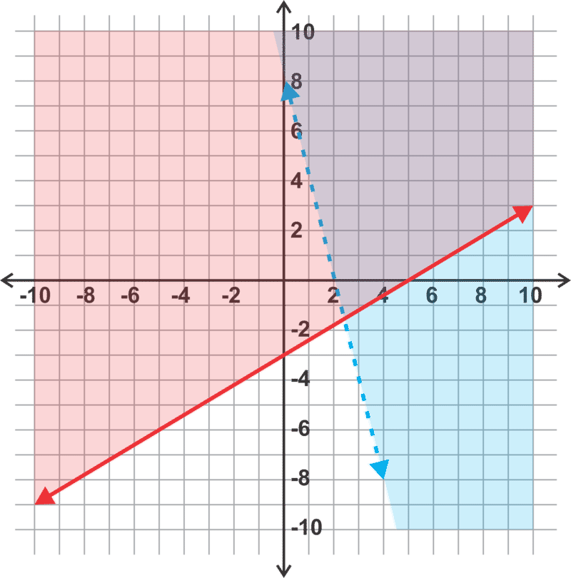

$4x+y>8 \Rightarrow$ The intercepts are (2, 0) and (0, 8) and the line will be dashed. If we test the point (0, 0), the inequality is not true so we shade on the side of the line that does not contain (0, 0).

$3x-5y \le 15 \Rightarrow$ The intercepts are (5, 0) and (0, -3) and the line will be solid. The test point (0, 0) satisfies the inequality so we shade on the side of the line that includes (0, 0).

3. 

$7x+2y \le 14 \Rightarrow$ The intercepts are (2, 0) and (0, 7) and the line will be solid. If we test the point (0, 0), the inequality is true so we shade on the side of the line that contains (0, 0).

$3x-9y \ge 18 \Rightarrow$ The intercepts are (6, 0) and (0, -2) and the line will be solid. The test point (0, 0) does not satisfy the inequality so we shade on the side of the line that does not include (0, 0).

4. 

Inequality 2 can be graphed using intercepts. The line will be dashed and we can use a test point to determine that the shaded region will be above this line.

Inequality 3 is a horizontal line. It will be dashed and the shading is above this line.

The intersection of these three regions is shaded in ${\color{magenta}\mathbf{purple}}$ on the graph.

**Problem Set**

Graph the following systems of linear inequalities.

1.  $$
    \begin{align*}
    y & > \frac{1}{2} x-2\\
    4x+6y & \le 24
    \end{align*}
    $$
    

2.  $$
    \begin{align*}
    y & >-\frac{3}{4}x-1\\
    y & > 3x+5
    \end{align*}
    $$
    

3.  $$
    \begin{align*}
    y & \le -\frac{2}{3}x+2\\
    y & \ge - \frac{5}{3}x-1
    \end{align*}
    $$
    

4.  $$
    \begin{align*}
    y & \ge -x-3\\
    y & < \frac{1}{5}x+1
    \end{align*}
    $$
    

5.  $$
    \begin{align*}
    5x-2y &>-10\\
    y & \le - \frac{1}{3}x+2
    \end{align*}
    $$
    

6.  $$
    \begin{align*}
    y & > - \frac{4}{5}x-3\\
    y & >x
    \end{align*}
    $$
    

7.  $$
    \begin{align*}
    y & \le \frac{1}{2}x+4\\
    x-2y & \le 2
    \end{align*}
    $$
    

8.  $$
    \begin{align*}
    7x-3y &>-21\\
    x-4y &<8
    \end{align*}
    $$
    

9.  $$
    \begin{align*}
    6x+5y &\le 5\\
    2x-3y & \le 12
    \end{align*}
    $$
    

10. $$
    \begin{align*}
    x &<3\\
    y & \ge 2x+1
    \end{align*}
    $$
    

11. $$
    \begin{align*}
    y &<2\\
    y & \ge -2
    \end{align*}
    $$
    

12. $$
    \begin{align*}
    2x-y & \le 4\\
    5x+2y &> 10
    \end{align*}
    $$
    

13. $$
    \begin{align*}
    y & \le -2x+4\\
    y & \ge 5x+4\\
    y &>\frac{1}{2}x-1
    \end{align*}
    $$
    

14. $$
    \begin{align*}
    x+y & \le 3\\
    x & \le 3\\
    y & < 3
    \end{align*}
    $$
    

15. $$
    \begin{align*}
    x & > -2\\
    y & > -3\\
    2x+y & \le 2
    \end{align*}
    $$
    

16. $$
    \begin{align*}
    x & > -2\\
    x & \le 4\\
    3x+5y & > 15
    \end{align*}
    $$
    

17. $$
    \begin{align*}
    2x+3y &>6\\
    5x-2y &<-10\\
    x-3y & >3
    \end{align*}
    $$
    

18. $$
    \begin{align*}
    y & \le x\\
    y & \ge -x\\
    x & < 5
    \end{align*}
    $$

</article>

### 3.5 Solving Linear Systems in Three Variables

<article>

**Objective**

Identify solutions to and solve linear systems in three variables.

**Review Queue**

1. Is the point (-6, 4) the solution to the system:

$$
\begin{align*}
2x+3y &= 0\\
x+y &= -3
\end{align*}
$$

2. Solve the system using linear combinations:

$$
\begin{align*}
2x+8y &= -6\\
x-y &=7
\end{align*}
$$

3. Describe the situation (geometrically) for a linear system with no solution.

Solving a System in Three Variables Using Linear Combinations
-------------------------------------------------------------

**Objective**

Understand the geometric situations that occur when there is one solution, infinite solutions and no solution to a system of equations in three variables. Solve systems in three variables and verify solutions to the system.

**Guidance**

An equation in three variables, such as $2x-3y+4z=10$, is an equation of a plane in three dimensions. In other words, this equation expresses the relationship between the three coordinates of each point on a plane. The solution to a system of three equations in three variables is a point in space which satisfies all three equations. When we add a third dimension we use the variable, $z$, for the third coordinate. For example, the point (3, -2, 5) would be $x = 3, y = -2$ and $z = 5$. A solution can be verified by substituting the $x, y,$ and $z$ values into the equations to see if they are valid.

A system of three equations in three variables consists of three planes in space. These planes could intersect with each other or not as shown in the diagrams below.

* The second diagram illustrates one way that three planes can exist and there is no solution to the system. It is also possible to have three parallel planes or two that are parallel and a third that intersects them. In any of these cases, there is no point that is in all three planes.
* The third diagram shows three planes intersecting in a line. Every point on this line is a solution to the system and thus there are infinite solutions.

To solve a system of three equations in three variables, we will be using the linear combination method. This time we will take two equations at a time to eliminate one variable and using the resulting equations in two variables to eliminate a second variable and solve for the third. This is just an extension of the linear combination procedure used to solve systems with two equations in two variables.

**Example A**

Determine whether the point, (6, -2, 5), is a solution to the system:

$$
\begin{align*}
x-y+z &= 13\\
2x+5y-3z &= -13\\
4x-y-6z &= -4
\end{align*}
$$

**Solution:** In order for the point to be a solution to the system, it must satisfy each of the three equations.

First equation: $(6)-(-2)+(5)=6+2+5=13 \ \boxed{\checkmark}$

Second equation: $2(6)+5(-2)-3(5)=12-10-15=-13 \ \boxed{\checkmark}$

Third equation: $4(6)-(-2)-6(5)=24+2-30=-4 \ \boxed{\checkmark}$

The point, (6, -2, 5), satisfies all three equations. Therefore, it is a solution to the system.

**Example B**

Solve the system using linear combinations:

$$
\begin{align*}
2x+4y-3z &= -7\\
3x-y+z &= 20\\
x+2y-z &= -2
\end{align*}
$$

**Solution:** We can start by taking two equations at a time and eliminating the same variable. We can take the first two equations and eliminate $z$, then take the second and third equations and also eliminate $z$.

$$
\begin{align*}
& 2x+4y-3z=-7 \qquad \Rightarrow \quad 2x+4y-\cancel{3z}=-7\\
& 3(3x-y+z=20) \qquad \qquad \ \underline{9x-3y+\cancel{3z}=60}\\
& \qquad \qquad \qquad \qquad \qquad \qquad \qquad 11x+y=53
\end{align*}
$$

Result from equations 1 and 2: $11x+y=53$

$$
\begin{align*}
& 3x-y+\cancel{z} = 20\\
& \underline{x+2y-\cancel{z} = -2}\\
& \quad \ \ 4x+y=18
\end{align*}
$$

Result from equations 2 and 3: $4x+y=18$

Now we have reduced our system to two equations in two variables. We can eliminate $y$ most easily next and solve for $x$.

$$
\begin{align*}
& \quad \ 11x+y=53 \quad \Rightarrow \quad \ 11x+\cancel{y}=53\\
& -1(4x+y=18) \qquad \quad \ \underline{-4x-\cancel{y}=-18}\\
& \qquad \qquad \qquad \qquad \qquad \qquad \quad 7x=35\\
& \qquad \qquad \qquad \qquad \qquad \qquad \quad \ x=5
\end{align*}
$$

Now use this value to find $y$:

$$
\begin{align*}
4(5)+y &= 18\\
20+y &= 18\\
y &= -2
\end{align*}
$$

Finally, we can go back to one of the original three equations and use our $x$ and $y$ values to find $z$.

$$
\begin{align*}
2(5)+4(-2)-3z &= -7\\
10-8-3z &= -7\\
2-3z &= -7\\
-3z &= -9\\
z &= 3
\end{align*}
$$

Therefore the solution is (5, -2, 3).

Don’t forget to check your answer by substituting the point into each equation.

Equation 1: $2(5)+4(-2)-3(3)=10-8-9=-7 \ \boxed{\checkmark}$

Equation 2: $3(5)-(-2)+(3)=15+2+3=20 \ \boxed{\checkmark}$

Equation 3: $(5)+2(-2)-(3)=5-4-3=-2 \ \boxed{\checkmark}$

**Example C**

Solve the system using linear combinations:

$$
\begin{align*}
x-3y+4z & = 14\\
-x+2y-5z & = -13\\
2x+5y-3z & =-5
\end{align*}
$$

**Solution:** In this case, it is easiest to eliminate $x$ first by combining the first two equations and then combining the second and third equations.

$$
\begin{align*}
& \quad \cancel{x}-3y+4z=14\\
& \ \underline{-\cancel{x}+2y-5z=-13}\\
& \qquad \ \ -y-z = 1
\end{align*}
$$

Result from equations 1 and 2: $-y-z=1$

$$
\begin{align*}
& 2(-x+2y-5z=-13) \quad \Rightarrow \quad -\cancel{2x}+4y-10z=-26\\
& \quad 2x+5y-3z=-5 \qquad \qquad \ \underline{\;\;\;\; \cancel{2x}+5y-3z=-5\;\;}\\
& \qquad \qquad \qquad \qquad \qquad \qquad \qquad \qquad 9y-13z=-31
\end{align*}
$$

Result from equations 2 and 3: $9y-13z=-31$

Now we have reduced our system to two equations in two variables. We can eliminate $y$ most easily next and solve for $z$.

$$
\begin{align*}
& 9(-y-z=1) \quad \Rightarrow \quad -\cancel{9y}-9z=9\\
& 9y-13z=-31 \quad \qquad \underline{\cancel{9y}-13z=-31}\\
& \qquad \qquad \qquad \qquad \qquad \ -22z=-22\\
& \qquad \qquad \qquad \qquad \qquad \qquad \ z=1
\end{align*}
$$

Now use this value to find $y$:

$$
\begin{align*}
-y-(1) &= 1\\
-y-1 &= 1\\
-y &= 2\\
y &= -2
\end{align*}
$$

Finally, we can go back to one of the original three equations and use our $y$ and $z$ values to find $x$.

$$
\begin{align*}
x-3(-2)+4(1) &= 14\\
x+6+4 &= 14\\
x+10 &= 14\\
x &= 4
\end{align*}
$$

Therefore the solution is (4, -2, 1).

Don’t forget to check your answer by substituting the point into each equation.

Equation 1: $(4)-3(-2)+4(1)=4+6+4=14 \ \boxed{\checkmark}$

Equation 2: $-(4)+2(-2)-5(1)=-4-4-5=-13 \ \boxed{\checkmark}$

Equation 3: $2(4)+5(-2)-3(1)=8-10-3=-5 \ \boxed{\checkmark}$

**Example D**

Solve the system using linear combinations:

$$
\begin{align*}
x+y+z &= 5\\
5x+5y+5z &= 20\\
2x+3y-z &= 8
\end{align*}
$$

**Solution:** We can start by combining equations 1 and 2 together by multiplying the first equation by -5.

$$
\begin{align*}
& -5(x+y+z=5) \quad \Rightarrow \quad -5x-5y-5z=-25\\
& \ \ 5x+5y+5z =20 \qquad \quad \underline{\;\; 5x+5y+5z=20 \;\;}\\
& \qquad \qquad \qquad \qquad \qquad \qquad \qquad \qquad \ \ 0=-5
\end{align*}
$$

Since the result is a false equation, there is no solution to the system.

**Example E**

Solve the system using linear combinations:

$$
\begin{align*}
x+y+z &= 3\\
x+y-z &= 3\\
2x+2y+z &= 6
\end{align*}
$$

**Solution:** We can start by combining the first two equations and then combine equations 2 and 3.

$$
\begin{align*}
& x+y+\cancel{z}=3\\
& \underline{x+y-\cancel{z}=3\;}\\
& \ 2x+2y=6
\end{align*}
$$

Result from equations 1 and 2: $2x+2y=6$

$$
\begin{align*}
& \quad x+y-\cancel{z}=3\\
& \underline{2x+2y+\cancel{z}=6}\\
& \quad \ \ 3x+3y=9
\end{align*}
$$

Result from equations 2 and 3: $3x+3y=9$

Now we can combine these two equations and attempt to eliminate $x$ or $y$.

$$
\begin{align*}
& \ \quad 3(2x+2y=6) \quad \Rightarrow \quad 6x+6y=18\\
& -2(3x+3y=9) \quad \qquad \ \underline{-6x-6y=-18}\\
& \qquad \qquad \qquad \qquad \qquad \qquad \qquad 0=0
\end{align*}
$$

This is a true statement. Therefore, there are infinite solutions to this system.

**Guided Practice**

1. Is the point, (-3, 2, 1), a solution to the system:

$$
\begin{align*}
x+y+z &= 0\\
4x+5y+z &= -1?\\
3x+2y-4z &=-8
\end{align*}
$$

2. Solve the following system using linear combinations:

$$
\begin{align*}
5x-3y+z &= -1\\
x+6y-4z &=-17\\
8x-y+5z &= 12
\end{align*}
$$

3. Solve the following system using linear combinations:

$$
\begin{align*}
2x+y-z &= 3\\
x-2y+z &= 5\\
6x+3y-3z &= 6
\end{align*}
$$

**Answers**

1. Check to see if the point satisfies all three equations.

Equation 1: $(-3)+(2)+(1)=-3+2+1=0 \ \boxed{\checkmark}$

Equation 2: $4(-3)+5(2)+(1)=-12+10+1=-1 \ \boxed{\checkmark}$

Equation 3: $3(-3)+2(2)-4(1)=-9+4-4=-9 \neq -8 \ \boxed{\checkmark}$

Since the third equation is not satisfied by the point, the point is not a solution to the system.

2. Combine the first and second equations to eliminate $z$. Then combine the first and third equations to eliminate $z$.

$$
\begin{align*}
& 4(5x-3y+z=-1) \quad \Rightarrow \quad 20x-12y+\cancel{4z}=-4\\
& \quad x+6y-4z=-17 \qquad \quad \ \ \underline{\;\;\;\; x+6y-\cancel{4z}=-17}\\
& \qquad \qquad \qquad \qquad \qquad \qquad \qquad \ \ 21x-6y=-21
\end{align*}
$$

Result from equations 1 and 2: $21x-6y=-21$

$$
\begin{align*}
& -5(5x-3y+z=-1) \quad \Rightarrow \quad \ -25x+15y-\cancel{5z}=5\\
& \quad \quad 8x-y+5z=12 \qquad \qquad \ \ \underline{\qquad 8x-y+\cancel{5z}=12}\\
& \qquad \qquad \qquad \qquad \qquad \qquad \qquad \quad -17x+14y=17
\end{align*}
$$

Result from equations 1 and 3: $-17x+14y=17$

Now we have reduced our system to two equations in two variables. We can eliminate $y$ most easily next and solve for $x$.

$$
\begin{align*}
& \quad \ 7(21x-6y=-21) \quad \Rightarrow \quad \ \ 147x-\cancel{42y}=-147\\
& 3(-17x+14y=17) \qquad \qquad \ \ \underline{ -51x+\cancel{42y}=51 \;\;\;}\\
& \qquad \qquad \qquad \qquad \qquad \qquad \qquad \qquad \ 96x=-96\\
& \qquad \qquad \qquad \qquad \qquad \qquad \qquad \qquad \quad \ x=-1
\end{align*}
$$

Now find $y$:

$$
\begin{align*}
21(-1)-6y &= -21\\
-21-6y &= -21\\
-6y &= 0\\
y &= 0
\end{align*}
$$

Finally, we can go back to one of the original three equations and use our $y$ and $z$ values to find $x$.

$$
\begin{align*}
5(-1)-3(0) + z & = -1\\
-5 + z & = -1\\
z & = 4
\end{align*}
$$

Therefore the solution is (-1, 0, 4).

Don’t forget to check your answer by substituting the point into each equation.

Equation 1: $5(-1)-3(0)+(4)=-5+4=-1 \ \boxed{\checkmark}$

Equation 2: $(-1)+6(0)-4(4)=-1-16=-17 \ \boxed{\checkmark}$

Equation 3: $8(-1)-(0)+5(4)=-8+20=12 \ \boxed{\checkmark}$

3. Combine equations 1 and two to eliminate $z$. Then combine equations 2 and 3 to eliminate $z$.

$$
\begin{align*}
& 2x+y-\cancel{z}=3\\
& \underline{x-2y+\cancel{z}=5}\\
& \quad \ \ 3x-y=8
\end{align*}
$$

Result from equations 1 and 2: $3x-y=8$

$$
\begin{align*}
& 3(x-2y+z=5) \quad \Rightarrow \quad 3x-6y+\cancel{3z}=15\\
& 6x+3y-3z=6 \qquad \qquad \underline{6x+3y-\cancel{3z}=6\;}\\
& \qquad \qquad \qquad \qquad \qquad \qquad \quad 9x-3y=21
\end{align*}
$$

Result from equations 2 and 3: $9x-3y=21$

Now we have reduced our system to two equations in two variables. Now we can combine these two equations and attempt to eliminate another variable.

$$
\begin{align*}
& -3(3x-y=8) \quad \Rightarrow \ \quad -9x+3y=-24\\
& \quad \ 9x-3y=21 \qquad \qquad \underline{\;\;\; 9x-2y=21 \;\;}\\
& \qquad \qquad \qquad \qquad \qquad \qquad \quad \ \ 0= -3
\end{align*}
$$

Since the result is a false equation, there is no solution to the system.

**Problem Set**

1.  Is the point, (2, -3, 5), the solution to the system:

$$
\begin{align*}
2x+5y-z &= -16\\
5x-y-3z &= -2?\\
3x+2y+4z &= 20
\end{align*}
$$

2.  Is the point, (-1, 3, 8), the solution to the system:

$$
\begin{align*}
8x+10y-z &= 14\\
11x+4y-3z &=-23?\\
2x+3y+z &= 10
\end{align*}
$$

3.  Is the point, (0, 3, 5), the solution to the system:

$$
\begin{align*}
5x-3y+2z &= 1\\
7x+2y-z &= 1?\\
x+4y-3z &= -3
\end{align*}
$$

Solve the following systems in three variables using linear combinations.

4.  $$
    \begin{align*}
    3x-2y+z &= 0\\
    4x+y-3z &= -9\\
    9x-2y+2z &= 20
    \end{align*}
    $$
    

5.  $$
    \begin{align*}
    11x+15y+5z &= 1\\
    3x+4y+z &= -2\\
    7x+13y+3z &= 3
    \end{align*}
    $$
    

6.  $$
    \begin{align*}
    2x+y+7z &= 5\\
    3x-2y-z &= -1\\
    4x-y+3z &= 5
    \end{align*}
    $$
    

7.  $$
    \begin{align*}
    x+3y-4z &= -3\\
    2x+5y-3z &= 3\\
    -x-3y+z &= -3
    \end{align*}
    $$
    

8.  $$
    \begin{align*}
    3x+2y-5z &= -8\\
    3x+2y+5z &= -8\\
    6x+4y-10z &= -16
    \end{align*}
    $$
    

9.  $$
    \begin{align*}
    x+2y-z &= -1\\
    2x+4y+z &= 10\\
    3x-y+8z &= 6
    \end{align*}
    $$
    

10. $$
    \begin{align*}
    x+y+z &= -3\\
    2x-y-z &= 6\\
    4x+y+z &= 0
    \end{align*}
    $$
    

11. $$
    \begin{align*}
    4x+y+3z &= 8\\
    8x+2y+6z &= 15\\
    3x-3y-z &= 5
    \end{align*}
    $$
    

12. $$
    \begin{align*}
    2x+3y-z &= -1\\
    x-2y+3z &= -4\\
    -x+y-2z &= 3
    \end{align*}
    $$

</article>

## 4.0 Matrices

<article>

**Matrices**

This chapter of Algebra II explores the concept of organizing data into matrices and operations involving matrices. Matrices and their operations will be used in this chapter to solve matrix equations and systems of linear equations with and without a calculator.

</article>

### 4.1 Operations on Matrices

<article>

**Objective**

Understand the concept of a matrix and perform basic operations on a matrix including addition, subtraction and scalar multiplication.

**Review Queue**

1. Simplify the expression using order of operations: $\frac{3^2 + (7 - 2)}{2}$

2. Solve the system using substitution:

$$
\begin{align*}
x & = 3y + 12\\
2x - y & = 14
\end{align*}
$$

3. Solve the system using linear combinations:

$$
\begin{align*}
3x + 5y & = 22\\
4x - 10y & = -54
\end{align*}
$$

Defining and Comparing Matrices
-------------------------------

**Objective**

Recognize that some data is most clearly organized and presented in a matrix, understand how to define a matrix and be able to compare matrices.

**Watch This**

Watch the first part of this video, until about 4:45.

!?[0](https://www.youtube.com/watch?v=xyAuNHPsq-g)

[Khan Academy: Introduction to matrices](http://www.youtube.com/watch?v=xyAuNHPsq-g=VQ15ECqYDGs)

**Guidance**

A **matrix** consists of data that is organized into rows and columns to form a rectangle. For example, we could organize the data collected at a movie theater concession stand during a matinee show into the follow matrix:

$$
\begin{align*}
& \quad S \quad M \quad L\\
\begin{matrix}
\text{popcorn \ }\\
\text{ \quad soda \ }\end{matrix} & \begin{bmatrix}
20 & 46 & 32\\
15 & 53 & 29\end{bmatrix}
\end{align*}
$$

Now we can easily compare the quantities of each size sold. These values in the matrix are called **elements.**

This particular matrix has two rows and three columns. Matrices are often described in terms of its **dimensions** (rows by columns). This matrix is a $2 \times 3$ (read as 2 by 3) matrix.

The variables $m$ (rows) and $n$ (columns) are most often used to represent unknown dimensions. Matrices in which the number of rows equals the number of columns $(m=n)$ are called **square matrices**.

Matrices which have the same dimensions and all corresponding elements equal are said to be **equal matrices**.

**Example A**

Using the matrix above, what is the value of the element in the second row, second column?

**Solution:**

$$
\begin{align*}
& \qquad \qquad \qquad \qquad {\color{red}{\text{Column 2}}}\\
& \qquad \qquad \quad \qquad \qquad \ \ \downarrow\\
& \quad \qquad \qquad \qquad \quad S \quad M \quad L\\
& \begin{matrix}
\text{\qquad \ \ popcorn \ }\\
{\color{red}{\text{Row 2}}} \rightarrow \text{soda \ }\end{matrix}
\begin{bmatrix}
20 & 46 & 32\\
15 & \boxed{53} & 29 \end{bmatrix}
\end{align*}
$$

We must see where the second row and second column overlap and identify the element in that location. In this case. it is 53.

**Example B**

Determine the dimensions $(m \times n)$ of the matrices below.

a) 

$$
\begin{align*}
\begin{bmatrix}
3 & 2\\
-1 & 0
\end{bmatrix}
\end{align*}
$$

b) 

$$
\begin{align*}
\begin{bmatrix}
4 & -3 & 2 & 7\\
3 & 5 & -4 & 6\\
9 & 1 & 0 & -2
\end{bmatrix}
\end{align*}
$$

c) 

$$
\begin{bmatrix}
2\\
-3\\
1
\end{bmatrix}
$$

**Solution:**

a) This matrix has 2 rows and 2 columns. Therefore it is a $2 \times 2$ matrix.

b) This matrix has 3 rows and 4 columns. Therefore it is a $3 \times 4$ matrix.

c) This matrix has 3 rows and 1 column. Therefore it is a $3 \times 1$ matrix.

**Example C**

Which two matrices are equal? Explain your answer.

$$
\begin{align*}
A = \begin{bmatrix}
1 & -5\\
-2 & 4\\
8 & 3
\end{bmatrix} \qquad B = \begin{bmatrix}
-5 & 4 & 3\\
1 & -2 & 8
\end{bmatrix} \qquad C = \begin{bmatrix}
1 & -5\\
-2 & 4\\
8 & 3
\end{bmatrix}
\end{align*}
$$

**Solution:**

Matrices $A$ and $C$ are equal matrices. They are both $3 \times 2$ matrices and have all of the same elements. Matrix $B$ is a $2 \times 3$ matrix so even though it contains the same elements, they are arranged differently preventing it from being equal to the other two.

**Guided Practice**

1. What are the dimensions of the matrix: $[ 3 \quad -5 \quad 1 \quad 0]$?

2. In the matrix, 

$$
\begin{align*}
\begin{bmatrix}
8 & -5 & 4\\
-2 & 6 & -3\\
3 & 0 & -7\\
1 & 3 & 9
\end{bmatrix},
\end{align*}
$$

 what is the element in the second row, third column?

3. Are the matrices $A = [-1 \quad 4 \quad 9]$ and 

$$
B = \begin{bmatrix}
-1\\
4\\
9
\end{bmatrix}
$$

 equal matrices?

**Answers**

1. The dimensions are $1 \times 4$.

2. The element in the second row, third column is -3 as shown below:

$$
\begin{align*}
& \qquad \qquad \qquad \qquad {\color{red}{\text{Column \ 3}}}\\
& \qquad \quad \qquad \qquad \qquad \ \downarrow\\
& \begin{matrix}
{\color{red}{\text{Row 2 }}} \rightarrow
\end{matrix}
\begin{bmatrix}
\\
8 & -5 & 4\\
-2 & 6 & \boxed{-3}\\
3 & 0 & -7\\
1 & 3 & 9\end{bmatrix}
\end{align*}
$$

3. No, $A$ and $B$ are not equal matrices. They have the same elements, but the dimensions are not the same.

**Vocabulary**

__Matrix__

A rectangular arrangement of data elements presented in rows and columns.

__Elements__

The values (numbers) in a matrix.

__Dimensions__

The number of rows, $m$, and columns, $n$, in a matrix.

__Square matrices__

Matrices in which the number of rows equals the number of columns, or $m=n$.

__Equal matrices__

Matrices which have the same dimensions and elements.

**Problem Set**

Use the matrices below to answer questions 1-7 that follow:

$$
\begin{align*}
A = \begin{bmatrix}
2 & 3 & 1\\
-5 & -8 & 4
\end{bmatrix} \qquad B = \begin{bmatrix}
2 & 1\\
-3 & 5
\end{bmatrix} \qquad C = \begin{bmatrix}
-5 & 1 & 3\\
8 & -2 & 6\\
4 & 9 & 7
\end{bmatrix}
\end{align*}
$$

$$
\begin{align*}
D = \begin{bmatrix}
2 & 1\\
-3 & 5
\end{bmatrix} \qquad E = \begin{bmatrix}
-5 & 2\\
-8 & 3\\
4 & 1
\end{bmatrix} \qquad F = \begin{bmatrix}
5 & -1 & 8\\
-2 & 6 & -3\\
\end{bmatrix}
\end{align*}
$$

1.  What are the dimensions of
    1.  Matrix $B$?
    2.  Matrix $E$?
    3.  Matrix $F$?
2.  Which matrices have the same dimensions?
3.  Which matrices are square matrices?
4.  Which matrices are equal?
5.  What is the element in row 1, column 2 of Matrix $C$?
6.  What is the element in row 3, column 1 of Matrix $E$?
7.  What is the element in row 1, column 1 of Matrix $D$?
8.  Write a matrix with dimensions $3 \times 4$.
9.  Write a matrix with dimensions $7 \times 2$.
10. Organize the data into a matrix: A math teacher gave her class three tests during the semester. On the first test there were 10 A’s, 8 B’s, 12 C’s, 4 D’s and 1 F. On the second test there were 8 A’s, 11 B’s, 14 C’s, 2 D’s and 0 F’s. On the third test there were 13 A’s, 7 B’s, 8 C’s, 4 D’s and 3 F’s.

Adding and Subtracting Matrices
-------------------------------

**Objective**

Add or subtract matrices with the same dimensions.

**Watch This**

Watch the middle portion of this video, from about 4:00 to 6:25.

!?[0](https://www.youtube.com/watch?v=iNty4CSFIpU)

[James Sousa: Matrix Addition, Subtraction, and Scalar Multiplication](http://www.youtube.com/watch?v=iNty4CSFIpU)

**Guidance**

If two matrices have the same dimensions, then they can be added or subtracted by adding or subtracting corresponding elements as shown below.

**Addition:**

$$
\begin{align*}
\begin{bmatrix}
a & b\\
c & d\end{bmatrix}+\begin{bmatrix}
e & f\\
g & h\end{bmatrix}=\begin{bmatrix}
a+e & b+f\\
c+g & d+h\end{bmatrix}
\end{align*}
$$

**Subtraction:**

$$
\begin{align*}
\begin{bmatrix}
a & b\\
c & d\end{bmatrix}-\begin{bmatrix}
e & f\\
g & h\end{bmatrix}=\begin{bmatrix}
a-e & b-f\\
c-g & d-h\end{bmatrix}
\end{align*}
$$

It is important to note that the two matrices are not required to be square matrices. The requirement is that they are the same dimensions. In other words, you can add two matrices that are both $2 \times 3$, but you cannot add a $2 \times 2$ matrix with a $3 \times 2$ matrix. Before attempting to add two matrices, check to make sure that they have the same dimensions.

**Investigation: Commutative and Associative Properties of Addition**

The Commutative Property of Addition states that $a + b = b + a$ for real numbers, $a$ and $b$. Does this property hold for matrices? The Associative Property of Addition states that $a + (b + c) = (a + b) + c$ for real numbers, $a, b$ and $c$. Does this property hold for matrices? Consider the matrices below:

$$
\begin{align*}
A = \begin{bmatrix}
-3 & 7\\
4 & -1 \end{bmatrix} \qquad B = \begin{bmatrix}
5 & 1\\
-8 & -2 \end{bmatrix} \qquad C = \begin{bmatrix}
-6 & -10\\
5 & 3 \end{bmatrix}
\end{align*}
$$

1. Find 

$$
\begin{align*}
A + B \Rightarrow \begin{bmatrix}
-3 & 7\\
4 & -1 \end{bmatrix} + \begin{bmatrix}
5 & 1\\
-8 & -2 \end{bmatrix} = \begin{bmatrix}
2 & 8\\
-4 & -3 \end{bmatrix}
\end{align*}
$$

2. Find 

$$
\begin{align*}
B + A \Rightarrow \begin{bmatrix}
5 & 1\\
-8 & -2 \end{bmatrix} + \begin{bmatrix}
-3 & 7\\
4 & -1 \end{bmatrix} = \begin{bmatrix}
2 & 8\\
-4 & -3 \end{bmatrix}
\end{align*}
$$

Since $A + B = B + A$, we can conjecture that matrix addition is commutative.

3. Find 

$$
\begin{align*}
(A + B) + C \Rightarrow \left( \begin{bmatrix}
-3 & 7\\
4 & -1 \end{bmatrix} + \begin{bmatrix}
5 & 1\\
-8 & -2 \end{bmatrix} \right) + \begin{bmatrix}
-6 & -10\\
5 & 3 \end{bmatrix} = \begin{bmatrix}
2 & 8\\
-4 & -3 \end{bmatrix} + \begin{bmatrix}
-6 & -10\\
5 & 3 \end{bmatrix} = \begin{bmatrix}
-4 & -2\\
1 & 0 \end{bmatrix}
\end{align*}
$$

4. Find 

$$
\begin{align*}
A + (B + C) \Rightarrow \begin{bmatrix}
-3 & 7\\
4 & -1 \end{bmatrix} + \left( \begin{bmatrix}
5 & 1\\
-8 & -2 \end{bmatrix} + \begin{bmatrix}
-6 & -10\\
5 & 3 \end{bmatrix} \right) = \begin{bmatrix}
-3 & 7\\
4 & -1 \end{bmatrix} + \begin{bmatrix}
-1 & -9\\
-3 & 1 \end{bmatrix} = \begin{bmatrix}
-4 & -2\\
1 & 0 \end{bmatrix}
\end{align*}
$$

Since $(A + B) + C = A + (B + C)$, we can conjecture that the associative property is true for matrix addition as well.

**Properties of Matrix Addition**

**Commutative Property:** $A + B = B + A$

**Associative Property:** $(A + B) + C = A + (B + C)$

$^*$Note that these properties do not work with subtraction with real numbers. For example: $7 -5 \ne 5 - 7$. Because they do not hold for subtraction of real numbers, they also do not work with matrix subtraction.

**Example A**

Find the sum: 

$$
\begin{align*}
\begin{bmatrix}
4 & -5 & 6\\
-3 & 7 & 9 \end{bmatrix} + \begin{bmatrix}
-1 & 4 & 8\\
0 & -3 & 12 \end{bmatrix} =
\end{align*}
$$

**Solution:**

By adding the elements in corresponding positions we get:

$$
\begin{align*}
\begin{bmatrix}
4 & -5 & 6\\
-3 & 7 & 9 \end{bmatrix} + \begin{bmatrix}
-1 & 4 & 8\\
0 & -3 & 12 \end{bmatrix} = \begin{bmatrix}
4+-1 & -5+4 & 6+8\\
-3+0 & 7+-3 & 9+12 \end{bmatrix} = \begin{bmatrix}
3 & -1 & 14\\
-3 & 4 & 21 \end{bmatrix}
\end{align*}
$$

**Example B**

Find the difference: 

$$
\begin{bmatrix}
-7\\
6\\
-9\\
10 \end{bmatrix} - \begin{bmatrix}
-3\\
-2\\
8\\
15 \end{bmatrix} =
$$

**Solution:**

By subtracting the elements in corresponding positions we get:

$$
\begin{bmatrix}
-7\\
6\\
-9\\
10 \end{bmatrix} - \begin{bmatrix}
-3\\
-2\\
8\\
15 \end{bmatrix} = \begin{bmatrix}
-7-(-3)\\
6-(-2)\\
-9-8\\
10-15 \end{bmatrix} = \begin{bmatrix}
-4\\
8\\
-17\\
-5 \end{bmatrix}
$$

**Example C**

Perform the indicated operation: 

$$
\begin{align*}
\begin{bmatrix}
-4 & 2\\
5 & -3\\
13 & 8 \end{bmatrix} + \begin{bmatrix}
7 & -1 & 0\\
-5 & 2 & 6 \end{bmatrix}
\end{align*}
$$

**Solution:**

In this case the first matrix is $3 \times 2$ and the second matrix is $2 \times 3$. Because they have different dimensions they cannot be added.

**Guided Practice**

Perform the indicated operation.

1. 

$$
\begin{align*}
\begin{bmatrix}3 & -7\end{bmatrix} + \begin{bmatrix}-1 & 8\end{bmatrix}
\end{align*}
$$

2. 

$$
\begin{align*}
\begin{bmatrix}
1\\
-5 \end{bmatrix} - \begin{bmatrix}
3 & -3\\
4 & 1 \end{bmatrix}
\end{align*}
$$

3. 

$$
\begin{align*}
\begin{bmatrix}
6 & -7\\
-11 & 5 \end{bmatrix} - \begin{bmatrix}
-2 & 4\\
-3 & 9 \end{bmatrix}
\end{align*}
$$

**Answers**

1. 

$$
\begin{align*}
\begin{bmatrix}
3 & -7 \end{bmatrix} + \begin{bmatrix}
-1 & 8 \end{bmatrix} = \begin{bmatrix}
3+(-1) & -7+8 \end{bmatrix} = \begin{bmatrix}
2 & 1 \end{bmatrix}
\end{align*}
$$

2. These matrices cannot be subtracted because they have different dimensions.

3. 

$$
\begin{align*}
\begin{bmatrix}
6 & -7\\
-11 & 5 \end{bmatrix} - \begin{bmatrix}
-2 & 4\\
-3 & 9 \end{bmatrix} = \begin{bmatrix}
6-(-2) & -7-4\\
-11-(-3) & 5-9 \end{bmatrix} = \begin{bmatrix}
8 & -11\\
-8 & -4 \end{bmatrix}
\end{align*}
$$

**Problem Set**

Perform the indicated operation (if possible).

1.  $$
    \begin{align*}
    \begin{bmatrix}
    2 & -1\\
    5 & 0 \end{bmatrix} + \begin{bmatrix}
    -6 & 0\\
    3 & -4 \end{bmatrix}
    \end{align*}
    $$
    

2.  $$
    \begin{align*}
    \begin{bmatrix}
    3 & -2\\
    -5 & 1\\
    10 & 9 \end{bmatrix} - \begin{bmatrix}
    -2 & 7\\
    10 & -8\\
    7 & 5 \end{bmatrix}
    \end{align*}
    $$
    

3.  $$
    \begin{align*}
    \begin{bmatrix}
    3 & 5 \end{bmatrix} + \begin{bmatrix}-2 & -1 \end{bmatrix}
    \end{align*}
    $$
    

4.  $$
    \begin{align*}
    \begin{bmatrix}
    2\\
    7 \end{bmatrix} + \begin{bmatrix}
    -3 & 5 \end{bmatrix}
    \end{align*}
    $$
    

5.  $$
    \begin{align*}
    \begin{bmatrix}
    11 & 7 & -3\\
    9 & 15 & 8 \end{bmatrix} + \begin{bmatrix}
    20 & -4 & 7\\
    1 & 11 & -13 \end{bmatrix}
    \end{align*}
    $$
    

6.  $$
    \begin{bmatrix}
    25\\
    19\\
    -5 \end{bmatrix} - \begin{bmatrix}
    11\\
    20\\
    -3 \end{bmatrix}
    $$
    

7.  $$
    \begin{align*}
    \begin{bmatrix}
    2 & -5 & 3\\
    9 & 15 & 8\\
    -1 & -4 & 6 \end{bmatrix} + \begin{bmatrix}
    -3 & 8 & -3\\
    11 & -6 & -7\\
    0 & 8 & 5 \end{bmatrix}
    \end{align*}
    $$
    

8.  $$
    \begin{align*}
    \begin{bmatrix}
    -3 & 2\\
    4 & -1 \end{bmatrix} - \begin{bmatrix}
    6 & -11 & 13\\
    17 & 8 & 10 \end{bmatrix}
    \end{align*}
    $$
    

9.  $$
    \begin{align*}
    \begin{bmatrix}
    -5 & 2\\
    9 & -3 \end{bmatrix} + \begin{bmatrix}
    -3 & -5\\
    8 & 12 \end{bmatrix}
    \end{align*}
    $$
    

10. $$
    \begin{align*}
    \left( \begin{bmatrix}
    5 & -2\\
    -3 & 1 \end{bmatrix} + \begin{bmatrix}
    -8 & 5\\
    6 & 13 \end{bmatrix} \right) - \begin{bmatrix}
    -10 & 8\\
    9 & 1 \end{bmatrix}
    \end{align*}
    $$
    

11. $$
    \begin{align*}
    \begin{bmatrix}
    -5 & 2\\
    11 & 3 \end{bmatrix} - \left( \begin{bmatrix}
    8 & -2\\
    3 & 5 \end{bmatrix} + \begin{bmatrix}
    -12 & 3\\
    -6 & 15 \end{bmatrix} \right)
    \end{align*}
    $$
    

12. $$
    \begin{align*}
    \left( \begin{bmatrix}
    22 & -7\\
    5 & 3\\
    11 & -8 \end{bmatrix} - \begin{bmatrix}
    -8 & 9\\
    15 & 12\\
    10 & -1 \end{bmatrix} \right) + \begin{bmatrix}
    5 & 11\\
    17 & -3\\
    -9 & 4 \end{bmatrix}
    \end{align*}
    $$
    

Multiplying Matrices by a Scalar
--------------------------------

**Objective**

Multiply a matrix by a scalar.

**Guidance**

A matrix can be multiplied by a scalar. A scalar is a real number in matrix algebra-not a matrix. To multiply a matrix by a scalar, each element in the matrix is multiplied by the scalar as shown below:

$$
\begin{align*}
\ k \begin{bmatrix}
a & b\\
c & d \end{bmatrix} = \begin{bmatrix}
ka & kb\\
kc & kd \end{bmatrix}, \ \text{where} \ k \ \text{is a scalar}.
\end{align*}
$$

**Investigation: Distributive Property of Scalar Multiplication**

Let’s investigate what happens if we distribute the multiplication of a scalar of the addition of two matrices. Consider the matrix expression: 

$$
3 \left( \begin{bmatrix}
2\\
-5 \end{bmatrix} + \begin{bmatrix}
-3\\
6 \end{bmatrix} \right)
$$

Method 1: Perform the addition inside the parenthesis first and then multiply by the scalar:

$$
3\left( \begin{bmatrix}
2\\
-5 \end{bmatrix} + \begin{bmatrix}
-3\\
6 \end{bmatrix} \right) = 3\begin{bmatrix}
-1\\
1 \end{bmatrix} = \begin{bmatrix}
-3\\
3 \end{bmatrix}
$$

Method 2: Distribute the scalar into both matrices and then add:

$$
3 \left( \begin{bmatrix}
2\\
-5 \end{bmatrix} + \begin{bmatrix}
-3\\
6 \end{bmatrix} \right) = \begin{bmatrix}
6\\
-15 \end{bmatrix} + \begin{bmatrix}
-9\\
18 \end{bmatrix} = \begin{bmatrix}
-3\\
3 \end{bmatrix}
$$

The results are equivalent. We can conjecture that the Distributive Property of Multiplication over Addition is true for scalar multiplication of matrices. This property can be extended to include distribution of scalar multiplication over subtraction as well.

**Properties of Scalar Multiplication**

**Distributive Property of Addition:** $k(A+B) = kA+kB$

**Distributive Property of Subtraction:** $k(A-B) = kA-KB$

**Example A**

Perform the scalar multiplication: 

$$
\begin{align*}
2\begin{bmatrix}
-4 & \frac{1}{2}\\
-1 & 3 \end{bmatrix}
\end{align*}
$$

**Solution:** In this case we just need to multiply each element of the matrix by 2.

$$
\begin{align*}
\begin{bmatrix}
2(-4) & 2\left( \frac{1}{2} \right)\\
2(-1) & 2(3) \end{bmatrix} = \begin{bmatrix}
-8 & 1\\
-2 & 6 \end{bmatrix}
\end{align*}
$$

**Example B**

Perform the indicated operation: 

$$
3\left( \begin{bmatrix}
2\\
-1 \end{bmatrix} + \begin{bmatrix}
\frac{2}{3}\\
4 \end{bmatrix} \right)
$$

**Solution:** This time we need to decide whether to distribute the 3 inside the parenthesis or add first and then multiply by 3. It is possible to complete this problem either way. However, careful observation allows us to observe that there is a fraction inside the second matrix. By distributing the 3 first, we can eliminate this fraction and make the addition easier as shown below.

$$
\left( 3\begin{bmatrix}
2\\
-1 \end{bmatrix} + 3\begin{bmatrix}
\frac{2}{3}\\
4 \end{bmatrix} \right) = \left( \begin{bmatrix}
6\\
-3 \end{bmatrix} + \begin{bmatrix}
2\\
12 \end{bmatrix} \right) = \begin{bmatrix}
8\\
9 \end{bmatrix}
$$

**Example C**

Perform the indicated operation: 

$$
\begin{align*}
\frac{1}{2} \left( \begin{bmatrix}
7 & -1\\
2 & 8 \end{bmatrix} + \begin{bmatrix}
-3 & 5\\
2 & 0 \end{bmatrix} \right)
\end{align*}
$$

**Solution:** Again, we need to decide whether to do the multiplication or addition first. Here, it turns out to be easier to add first and then multiply as shown below.

$$
\begin{align*}
\frac{1}{2} \begin{bmatrix}
7+-3 & -1+5\\
2+2 & 8+0 \end{bmatrix} = \frac{1}{2}\begin{bmatrix}
4 & 4\\
4 & 8 \end{bmatrix} = \begin{bmatrix}
2 & 2\\
2 & 4 \end{bmatrix}
\end{align*}
$$

Not that this problem could have been solved in the other order, but we would have had to deal with fractions.

**Guided Practice**

Perform the indicated operations in the following problems.

1. 

$$
\frac{2}{3} \begin{bmatrix}
0\\
6\\
9 \end{bmatrix}
$$

2. 

$$
\begin{align*}
-\frac{2}{3} \left( \begin{bmatrix}
2 & -3 & 5 \end{bmatrix} - \begin{bmatrix}
-1 & 0 & 2 \end{bmatrix} \right)
\end{align*}
$$

3. 

$$
\begin{align*}
12\left( \begin{bmatrix}
\frac{3}{4} & -\frac{2}{3}\\
\frac{1}{6} & 2 \end{bmatrix} + \begin{bmatrix}
1 & \frac{5}{6}\\
\frac{2}{3} & \frac{5}{4} \end{bmatrix} \right)
\end{align*}
$$

**Answers**

1. Multiply each element inside the matrix by $\frac{2}{3}$:

$$
\begin{bmatrix}
\frac{2}{3}(0)\\
\frac{2}{3}(6)\\
\frac{2}{3}(9) \end{bmatrix} = \begin{bmatrix}
0\\
4\\
6 \end{bmatrix}
$$

2. If we subtract what is inside the parenthesis first, we can avoid fractions:

$$
\begin{align*}
- \frac{2}{3} \left( \begin{bmatrix}
2-(-1) & -3-0 & 5-2 \end{bmatrix} \right) = - \frac{2}{3} \begin{bmatrix}
3 & -3 & 3 \end{bmatrix} = \begin{bmatrix}
-2 & 2 & -2 \end{bmatrix}
\end{align*}
$$

3. If we distribute first this time, we can avoid fractions:

$$
\begin{align*}
\left( 12\begin{bmatrix}
\frac{3}{4} & -\frac{2}{3}\\
\frac{1}{6} & 2 \end{bmatrix} + 12\begin{bmatrix}
1 & \frac{5}{6}\\
\frac{2}{3} & \frac{5}{4} \end{bmatrix} \right) = \begin{bmatrix}
9 & -8\\
2 & 24 \end{bmatrix} + \begin{bmatrix}
12 & 10\\
8 & 15 \end{bmatrix} = \begin{bmatrix}
21 & 2\\
10 & 39 \end{bmatrix}
\end{align*}
$$

**Problem Set**

Perform the indicated operations.

1.  $$
    \begin{align*}
    3\begin{bmatrix}
    2 & -1\\
    8 & 0 \end{bmatrix}
    \end{align*}
    $$
    

2.  $$
    \begin{align*}
    -2\begin{bmatrix}
    -6 & 8\\
    5 & -2 \end{bmatrix}
    \end{align*}
    $$
    

3.  $$
    \frac{2}{3}\begin{bmatrix}
    12\\
    6 \end{bmatrix}
    $$
    

4.  $$
    \begin{align*}
    -\frac{3}{2}\begin{bmatrix}
    8 & 0 & -4\\
    -6 & 2 & 10 \end{bmatrix}
    \end{align*}
    $$
    

5.  $$
    \begin{align*}
    5\begin{bmatrix}
    -3 & 1 & 2 \end{bmatrix}
    \end{align*}
    $$
    

6.  $$
    \begin{align*}
    -1 \begin{bmatrix}
    2 & -3\\
    5 & 1\\
    -8 & -10 \end{bmatrix}
    \end{align*}
    $$
    

7.  $$
    \begin{align*}
    -2 \left( \begin{bmatrix}
    \frac{1}{2} & \frac{5}{2} \end{bmatrix} - \begin{bmatrix}
    3 & -1 \end{bmatrix} \right)
    \end{align*}
    $$
    

8.  $$
    -\frac{1}{3} \left( \begin{bmatrix}
    5\\
    -2 \end{bmatrix} - \begin{bmatrix}
    2\\
    4 \end{bmatrix} \right)
    $$
    

9.  $$
    \begin{align*}
    3\begin{bmatrix}
    8 & -2\\
    \frac{1}{3} & 5 \end{bmatrix} + \begin{bmatrix}
    2 & 4\\
    -6 & -1 \end{bmatrix}
    \end{align*}
    $$
    

10. $$
    2\begin{bmatrix}
    \frac{3}{7}\\
    \frac{3}{4} \end{bmatrix}
    $$
    

11. $$
    \begin{align*}
    -6\left( \begin{bmatrix}
    \frac{1}{3} & 0\\
    2 & - \frac{2}{3} \end{bmatrix} + \begin{bmatrix}
    5 & 1\\
    - \frac{1}{6} & 2 \end{bmatrix} \right)
    \end{align*}
    $$
    

12. $$
    \begin{bmatrix}
    -2\\
    3\\
    8 \end{bmatrix} -5\left( \begin{bmatrix}
    \frac{1}{5}\\
    - \frac{2}{5}\\
    \frac{11}{5} \end{bmatrix} + \begin{bmatrix}
    -2\\
    \frac{1}{5}\\
    - \frac{3}{5} \end{bmatrix} \right)
    $$

</article>

### 4.2 Multiplying Matrices

<article>

**Objective**

Multiply matrices together when possible. Identify cases where matrices can and cannot be multiplied. Perform matrix operations on the graphing calculator.

**Review Queue**

1. Perform the operation: 

$$
\begin{align*}
\begin{bmatrix}
2 & -5 \end{bmatrix} + \begin{bmatrix}
-3\\
\frac{1}{7} \end{bmatrix}
\end{align*}
$$

2. Perform the scalar multiplication: 

$$
\begin{align*}
\frac{2}{3} \begin{bmatrix}
6 & 4\\
-3 & 12 \end{bmatrix}
\end{align*}
$$

3. Perform the operation: 

$$
\begin{align*}
\begin{bmatrix}
3 & -1 & \frac{4}{3} & 7 \end{bmatrix} - \begin{bmatrix}
-2 & 0 & \frac{1}{3} & -5 \end{bmatrix}
\end{align*}
$$

Multiplying Two Matrices
------------------------

**Objective**

Multiply matrices together.

**Guidance**

To multiply matrices together we will be multiplying each element in each row of the first matrix by each element in each column in the second matrix. Each of these products will be added together to get the result for a particular row and column as shown below.

$$
\begin{align*}
\begin{bmatrix}
\color{red}{a} & \color{red}{b}\\
c & d \end{bmatrix} \cdot \begin{bmatrix}
\color{red}{e} & f\\
\color{red}{g} & h \end{bmatrix} = \begin{bmatrix}
\color{red}{ae}+\color{red}{bg} & af+bh\\
ce+dg & cf+dh \end{bmatrix}
\end{align*}
$$

**Example A**

Multiply the matrices: 

$$
\begin{align*}
\begin{bmatrix}
2 & 3\\
-1 & 5 \end{bmatrix}\cdot\begin{bmatrix}
-6 & 0\\
4 & 1 \end{bmatrix}
\end{align*}
$$

**Solution:**

By following the rule given above, we get:

$$
\begin{align*}
\begin{bmatrix}
2(-6)+3(4) & 2(0)+3(1)\\
-1(-6)+5(4) & -1(0)+5(1) \end{bmatrix} = \begin{bmatrix}
-12+12 & 0+3\\
6+20 & 0+5 \end{bmatrix} = \begin{bmatrix}
0 & 3\\
26 & 5 \end{bmatrix}
\end{align*}
$$

**Example B**

Multiply the matrices: 

$$
\begin{align*}
\begin{bmatrix}
-1 & 3\\
7 & 0\\
4 & -2 \end{bmatrix}\cdot\begin{bmatrix}
5 & 8\\
-1 & 2 \end{bmatrix}
\end{align*}
$$

**Solution:**

In order to multiply these two matrices we need to extend the pattern given in the guidance to apply to a $3\times2$ matrix and a $2\times2$ matrix. It is important to note that matrices do not need to have the same dimensions in order to multiply them together. However, there are limitations that will be explored in the next topic. All matrix multiplication problems in this topic are possible.

Now, let’s multiply each of the rows in the first matrix by each of the columns in the second matrix to get:

$$
\begin{align*}
\begin{bmatrix}
-1 & 3\\
7 & 0\\
4 & -2 \end{bmatrix}\cdot\begin{bmatrix}
5 & 8\\
-1 & 2 \end{bmatrix} = \begin{bmatrix}
-1(5)+3(-1) & -1(8)+3(2)\\
7(5)+0(-1) & 7(8)+0(2)\\
4(5)+-2(-1) & 4(8)+-2(2) \end{bmatrix} = \begin{bmatrix}
-5-3 & -8+6\\
35+0 & 56+0\\
20+2 & 32-4 \end{bmatrix} = \begin{bmatrix}
-8 & -2\\
35 & 56\\
22 & 28 \end{bmatrix}
\end{align*}
$$

**Example C**

Multiply the matrices: 

$$
\begin{align*}
\begin{bmatrix}
3 & -7 & 1\\
2 & 8 & -5 \end{bmatrix}\cdot\begin{bmatrix}
2\\
0\\
9 \end{bmatrix}
\end{align*}
$$

**Solution:**

Sometimes, not only are the matrices different dimensions, but the result has dimensions other than either of the original matrices as is the case in this example. Multiply the matrices row by column to get:

$$
\begin{align*}
\begin{bmatrix}
3 & -7 & 1\\
2 & 8 & -5\end{bmatrix}\cdot\begin{bmatrix}
2\\
0\\
9\end{bmatrix} = \begin{bmatrix}
3(2)+-7(0)+1(9) & 2(2)+8(0)+-5(9)\end{bmatrix} = \begin{bmatrix}
6+0+9 & 4+0-45\end{bmatrix} = \begin{bmatrix}
15 & -41\end{bmatrix}
\end{align*}
$$

**Guided Practice**

Multiply the matrices together.

1. 

$$
\begin{align*}
\begin{bmatrix}
-4 & 1\\
5 & -3 \end{bmatrix}\cdot\begin{bmatrix}
2\\
-1 \end{bmatrix}
\end{align*}
$$

2. 

$$
\begin{align*}
\begin{bmatrix}
-3\\
2\\
5 \end{bmatrix}\cdot\begin{bmatrix}
-2 & -1 & 4 \end{bmatrix}
\end{align*}
$$

3. 

$$
\begin{align*}
\begin{bmatrix}
5 & -2 \end{bmatrix} \cdot \begin{bmatrix}
1 & 4\\
-3 & -7 \end{bmatrix}
\end{align*}
$$

**Answers**

1. 

$$
\begin{align*}
\begin{bmatrix}
-4 & 1\\
5 & -3 \end{bmatrix}\cdot\begin{bmatrix}
2\\
-1 \end{bmatrix} = \begin{bmatrix}
-4(2)+1(-1)\\
5(2)+-3(-1) \end{bmatrix} = \begin{bmatrix}
-8-1\\
10+3 \end{bmatrix} = \begin{bmatrix}
-9\\
13 \end{bmatrix}
\end{align*}
$$

2. 

$$
\begin{align*}
\begin{bmatrix}
-3\\
2\\
5 \end{bmatrix}\cdot\begin{bmatrix}-2 & -1 & 4 \end{bmatrix} = \begin{bmatrix}
-3(-2) & -3(-1) & -3(4)\\
2(-2) & 2(-1) & 2(4)\\
5(-2) & 5(-1) & 5(4) \end{bmatrix} = \begin{bmatrix}
6 & 3 & -12\\
-4 & -2 & 8\\
-10 & -5 & 20 \end{bmatrix}
\end{align*}
$$

3. 

$$
\begin{align*}
\begin{bmatrix}
5 & -2 \end{bmatrix}\cdot\begin{bmatrix}
1 & 4\\
-3 & -7 \end{bmatrix} = \begin{bmatrix}
5(1)+-2(-3) & 5(4)+-2(-7) \end{bmatrix} = \begin{bmatrix}
5+6 & 20+14 \end{bmatrix} = \begin{bmatrix}
11 & 34 \end{bmatrix}
\end{align*}
$$

**Problem Set**

Multiply the matrices together.

1.  $$
    \begin{align*}
    \begin{bmatrix}
    2 & -1\\
    0 & 3 \end{bmatrix}\cdot\begin{bmatrix}
    -4 & 3\\
    2 & 5 \end{bmatrix}
    \end{align*}
    $$
    

2.  $$
    \begin{align*}
    \begin{bmatrix}
    -2 & 7 \end{bmatrix}\cdot\begin{bmatrix}
    1 & -4\\
    5 & 3 \end{bmatrix}
    \end{align*}
    $$
    

3.  $$
    \begin{align*}
    \begin{bmatrix}
    -3 & 2\\
    5 & -4\\
    -1 & 6 \end{bmatrix}\cdot\begin{bmatrix}
    -1 & 3\\
    4 & -2 \end{bmatrix}
    \end{align*}
    $$
    

4.  $$
    \begin{align*}
    \begin{bmatrix}
    -8 & 1\\
    3 & 5 \end{bmatrix}\cdot\begin{bmatrix}
    -4\\
    7 \end{bmatrix}
    \end{align*}
    $$
    

5.  $$
    \begin{align*}
    \begin{bmatrix}
    -1\\
    4\\
    8 \end{bmatrix}\cdot\begin{bmatrix}
    2 & -3 & 6 \end{bmatrix}
    \end{align*}
    $$
    

6.  $$
    \begin{align*}
    \begin{bmatrix}
    -5 & 1 \end{bmatrix}\cdot\begin{bmatrix}
    -9 & 3 & 0\\
    2 & -1 & 6 \end{bmatrix}
    \end{align*}
    $$
    

7.  $$
    \begin{align*}
    \begin{bmatrix}
    4 & -1\\
    5 & 3 \end{bmatrix}\cdot\begin{bmatrix}
    2\\
    6 \end{bmatrix}
    \end{align*}
    $$
    

8.  $$
    \begin{align*}
    \begin{bmatrix}
    -2 & 4 & 7 \end{bmatrix}\cdot\begin{bmatrix}
    3\\
    -1\\
    5 \end{bmatrix}
    \end{align*}
    $$
    

9.  $$
    \begin{align*}
    \begin{bmatrix}
    -1 & 2 & -4\\
    5 & 3 & 1\\
    -5 & 2 & -1 \end{bmatrix}\cdot\begin{bmatrix}
    2 & -3 & 5\\
    6 & 2 & 1\\
    -4 & 1 & 0 \end{bmatrix}
    \end{align*}
    $$
    

10. $$
    \begin{align*}
    \begin{bmatrix}
    1 & -2 & 4 \end{bmatrix}\cdot\begin{bmatrix}
    -3 & 1 & 2\\
    5 & -1 & 6\\
    1 & 2 & -7 \end{bmatrix}
    \end{align*}
    $$
    

11. $$
    \begin{align*}
    \begin{bmatrix}
    6 & 11\\
    1 & 2 \end{bmatrix}\cdot\begin{bmatrix}
    2 & -11\\
    -1 & 6 \end{bmatrix}
    \end{align*}
    $$
    

12. $$
    \begin{align*}
    \begin{bmatrix}
    -4 & 5 & 7\\
    1 & 2 & -3\\
    9 & -6 & 8 \end{bmatrix}\cdot\begin{bmatrix}
    1\\
    2\\
    -1 \end{bmatrix}
    \end{align*}
    $$
    

Limitations of Matrix Multiplication
------------------------------------

**Objective**

Discover and apply the limitations of matrix multiplication:

* the number of rows in the first matrix must equal the number of columns in the second matrix
* no commutative property for matrix multiplication.

**Guidance**

Matrix multiplication has some limitations which you will discover in the following investigation.

**Investigation: Limitations to Matrix Multiplication**

**Part 1:**

Note the dimensions of the following matrices. Attempt to multiply the matrices together. What do you notice?

1. 

$$
\begin{align*}
\begin{bmatrix}
-2 & 3\\
1 & -5 \end{bmatrix}\cdot\begin{bmatrix}
1 & -4\end{bmatrix}
\end{align*}
$$

2. 

$$
\begin{bmatrix}
-2\\
3\\
5\end{bmatrix}\cdot\begin{bmatrix}
4\\
-1\\
0\end{bmatrix}
$$

3. 

$$
\begin{align*}
\begin{bmatrix}
5\\
-1\end{bmatrix}\cdot\begin{bmatrix}
-3 & 1\\
4 & 3\end{bmatrix}
\end{align*}
$$

1. These matrices are $2 \times 2$ and $1 \times 2$. When we try to multiply them together, there is no element to multiply the values in the second column by as shown below:

$$
\begin{align*}
\begin{bmatrix}
-2 & 3\\
1 & -5\end{bmatrix}\cdot\begin{bmatrix}
1 & -4\end{bmatrix} = \begin{bmatrix}
-2(1)+3(?) & -2(-4)+3(?)\\
1(1)+-5(?) & 1(-4)+-5(?)\end{bmatrix}
\end{align*}
$$

2. These matrices are both $3 \times 1$. Look what happens when we attempt to multiply:

$$
\begin{align*}
\begin{bmatrix}
-2\\
3\\
5\end{bmatrix}\cdot\begin{bmatrix}
4\\
-1\\
0\end{bmatrix} = \begin{bmatrix}
-2(4)+?(-1)+?(0) & \ \\
\\
\\
\end{bmatrix}
\end{align*}
$$

We can see right away that we have a problem.

3. In this case we have a $2 \times 1$ and a $2 \times 2$ matrix. Again we have trouble multiplying:

$$
\begin{align*}
\begin{bmatrix}
5\\
-1\end{bmatrix}\cdot\begin{bmatrix}
-3 & 1\\
4 & 2\end{bmatrix} = \begin{bmatrix}
5(-3)+?(4) & \\
\\
\end{bmatrix}
\end{align*}
$$

**Requirement: In order to multiply two matrices, $A$ and $B$, the number of columns in matrix $A$ must be equal to the number of rows in column B.**

Now, look back at some of the problems in the last concept, _Multiplying Matrices_. What do you notice about the dimensions of the two matrices when multiplication _is_ possible? Can you make a conjecture about the requirements of the dimensions of the matrices?

Look at this example: 

$$
\begin{align*}
\begin{bmatrix}
-2 & 3\\
1 & 5\end{bmatrix}\cdot\begin{bmatrix}
4\\
-1\end{bmatrix}.
\end{align*}
$$

 In this case we have $2 \times {\color{red}2} \cdot {\color{red}2} \times 1$. The two two’s in the middle are the same (i.e., the number of columns in the first matrix matches the number of rows in the second matrix). Now what is left is the 2 on the left and the 1 on the right. The resulting matrix will have these dimensions: $2 \times 1$.

**Dimensions of the Product: The product of two matrices, $A$ and $B$, will have the following dimensions – the rows in matrix $A$ by the columns in matrix $B$.**

**Part 2:**

Use the following matrices for this exercise:

$$
\begin{align*}
A = \begin{bmatrix}
-2 & 5\\
1 & 3\end{bmatrix}, \ B = \begin{bmatrix}
1 & 3\\
0 & -5\end{bmatrix}
\end{align*}
$$

1. Find $AB$: 

$$
\begin{align*}
\begin{bmatrix}
-2 & 5\\
1 & 3\end{bmatrix}\cdot\begin{bmatrix}
1 & 3\\
0 & -5\end{bmatrix} = \begin{bmatrix}
-2+0 & -6-25\\
1+0 & 3-15\end{bmatrix} = \begin{bmatrix}
-2 & -31\\
1 & -12\end{bmatrix}
\end{align*}
$$

2. Find $BA$: 

$$
\begin{align*}
\begin{bmatrix}
1 & 3\\
0 & -5\end{bmatrix}\cdot\begin{bmatrix}
-2 & 5\\
1 & 3\end{bmatrix} = \begin{bmatrix}
-2+3 & 5+9\\
0-5 & 0-15\end{bmatrix} = \begin{bmatrix}
1 & 14\\
-5 & -15\end{bmatrix}
\end{align*}
$$

From this exercise we can see that $AB \ne BA$. We only need one example to show that the commutative property does not hold for matrix multiplication.

**Matrix multiplication is NOT commutative.**

**Example A**

Which of the following matrix multiplication problems are possible? What are the dimensions of the product?

(a) 

$$
\begin{align*}
\begin{bmatrix}
1 & -3\end{bmatrix}\cdot\begin{bmatrix}
4\\
-1\end{bmatrix}
\end{align*}
$$

(b) 

$$
\begin{align*}
\begin{bmatrix}
2 & -5\end{bmatrix}\cdot\begin{bmatrix}
-3 & 1\end{bmatrix}
\end{align*}
$$

(c) 

$$
\begin{align*}
\begin{bmatrix}
5\\
-2\\
1\end{bmatrix}\cdot\begin{bmatrix}
0 & -7 & 3\end{bmatrix}
\end{align*}
$$

(d) 

$$
\begin{align*}
\begin{bmatrix}
4 & -1\\
2 & 3\end{bmatrix}\cdot\begin{bmatrix}
-8\\
0\end{bmatrix}
\end{align*}
$$

**Solution:**

(a) Yes, the matrices can be multiplied. The dimensions of the matrices are $1 \times {\color{red}2} \ {\color{red}\text{and}} \ {\color{red}2}\times 1$, so the result is going to be a $1 \times 1$ matrix.

(b) No, the matrices cannot be multiplied. The dimensions of the matrices are $1 \times {\color{red}2} \ {\color{red}\text{and}} \ {\color{red}1} \times 2$, the number of columns in the first matrix does not match the number of rows in the second matrix.

(c) Yes, the matrices can be multiplied. The dimensions of the matrices are $3 \times {\color{red}1} \ {\color{red}\text{and}} \ {\color{red}1} \times 3$, so the result is going to be a $3 \times 3$ matrix.

(d) Yes, the matrices can be multiplied. The dimensions of the matrices are $2 \times {\color{red}2} \ {\color{red}\text{and}} \ {\color{red}2} \times 1$, so the result is going to be a $2 \times 1$ matrix.

**Example B**

Given the matrices: 

$$
\begin{align*}
A = \begin{bmatrix}
2 & -1 & 8\\
3 & 0 & -5\end{bmatrix}
\end{align*}
$$

 and 

$$
\begin{align*}
B = \begin{bmatrix}
-1 & 0\\
2 & 4\\
5 & 6\end{bmatrix},
\end{align*}
$$

 find $AB$ and $BA$. What do you notice?

**Solution:**

$$
\begin{align*}
AB = \begin{bmatrix}
2 & -1 & 8\\
3 & 0 & -5\end{bmatrix}\cdot\begin{bmatrix}
-1 & 0\\
2 & 4\\
5 & 6\end{bmatrix} &= \begin{bmatrix}
2(-1)+(-1)(2)+8(5) & 2(0)+(-1)(4)+8(6)\\
3(-1)+(0)(2)+(-5)(5) & 3(0)+(0)(4)+(-5)(6)\end{bmatrix}\\
&= \begin{bmatrix}
-2-2+40 & 0-4+48\\
-3+0-25 & 0+0-30\end{bmatrix}
= \begin{bmatrix}
36 & 44\\
-28 & -30\end{bmatrix}
\end{align*}
$$

$$
\begin{align*}
BA = \begin{bmatrix}
-1 & 0\\
2 & 4\\
5 & 6\end{bmatrix}\cdot\begin{bmatrix}
2 & -1 & 8\\
3 & 0 & -5\end{bmatrix} &= \begin{bmatrix}
-1(2)+0(3) & -1(-1)+0(0) & -1(8)+0(-5)\\
2(2)+4(3) & 2(-1)+4(0) & 2(8)+4(-5)\\
5(2)+6(3) & 5(-1)+6(0) & 5(8)+6(-5)\end{bmatrix}\\
&= \begin{bmatrix}
-2+0 & 1+0 & -8-0\\
4+12 & -2+0 & 16-20\\
10+18 & -5+0 & 40-30\end{bmatrix} = \begin{bmatrix}
-2 & 1 & -8\\
16 & -2 & -4\\
28 & -5 & 10\end{bmatrix}
\end{align*}
$$

The dimensions of the products are different based on the order in which we multiply them. Clearly, the results are different and the commutative property does not hold for matrix multiplication.

**Guided Practice**

Given: 

$$
\begin{align*}
A = \begin{bmatrix}
1 & -3\\
5 & -14\end{bmatrix}, \qquad B = \begin{bmatrix}
-2\\
1\end{bmatrix}, \qquad C = \begin{bmatrix}
-14 & 3\\
-5 & 1\end{bmatrix},
\end{align*}
$$

 find the products, if possible.

1. $AB$

2. $BA$

3. $AC$

4. $CA$

**Answers**

1. 

$$
\begin{align*}
AB = \begin{bmatrix}
1 & -3\\
5 & -14\end{bmatrix}\cdot\begin{bmatrix}
-2\\
1\end{bmatrix} = \begin{bmatrix}
1(-2)+-3(1)\\
5(-2)+-14(1)\end{bmatrix} = \begin{bmatrix}
-2-3\\
-10-14\end{bmatrix} = \begin{bmatrix}
-5\\
-24\end{bmatrix}
\end{align*}
$$

2. 

$$
\begin{align*}
BA = \begin{bmatrix}
-2\\
1\end{bmatrix}\cdot\begin{bmatrix}
1 & -3\\
5 & -14\end{bmatrix}
\end{align*}
$$

 is not possible.

3. 

$$
\begin{align*}
AC = \begin{bmatrix}
1 & -3\\
5 & -14\end{bmatrix}\cdot\begin{bmatrix}
-14 & 3\\
-5 & 1\end{bmatrix} = \begin{bmatrix}
1(-14)+(-3)(-5) & 1(3)+(-3)(1)\\
5(-14)+(-14)(-5) & 5(3)+(-14)(1)\end{bmatrix} = \begin{bmatrix}
-14+15 & 3-3\\
-70+70 & 15-14\end{bmatrix} = \begin{bmatrix}
1 & 0\\
0 & 1\end{bmatrix}
\end{align*}
$$

4. 

$$
\begin{align*}
CA = \begin{bmatrix}
-14 & 3\\
-5 & 1\end{bmatrix}\cdot\begin{bmatrix}
1 & -3\\
5 & -14\end{bmatrix} = \begin{bmatrix}
-14(1)+3(5) & -14(-3)+3(-14)\\
-5(1)+1(5) & -5(-3)+1(-14)\end{bmatrix} = \begin{bmatrix}
-14+15 & 52-52\\
-5+5 & 15-14\end{bmatrix} = \begin{bmatrix}
1 & 0\\
0 & 1\end{bmatrix}
\end{align*}
$$

$^{**}$Note: When the product is 

$$
\begin{align*}
\begin{bmatrix}
1 & 0\\
0 & 1\end{bmatrix},
\end{align*}
$$

 the identity matrix for a $2 \times 2$ matrix, the product can be found by multiplying the matrices in either order as illustrated here in questions 3 and 4. If the product of two matrices is the inverse matrix, then the matrices are multiplicative inverses of one another. This idea will be further explored later in the chapter.

**Problem Set**

Use the following matrices to answer questions 1-10.

$$
\begin{align*}
A = \begin{bmatrix}
2 & -1 & 4\end{bmatrix} \qquad B = \begin{bmatrix}
-3\\
5\\
0\end{bmatrix} \qquad C = \begin{bmatrix}
4 & -1\\
2 & 5\end{bmatrix} \qquad D = \begin{bmatrix}
3 & -2\end{bmatrix}
\end{align*}
$$

$$
\begin{align*}
E = \begin{bmatrix}
8 & -1 & 0\\
2 & 5 & 1\\
3 & 4 & -3\end{bmatrix} \qquad F = \begin{bmatrix}
5 & 0 & -11\\
-1 & 8 & 9\end{bmatrix}
\end{align*}
$$

For each product, determine the dimensions of the resulting matrix or write “cannot be determined”. Do not multiply the matrices together.

1.  $AB$
2.  $BA$
3.  $CD$
4.  $DC$
5.  $EA$
6.  $EB$
7.  $CF$
8.  $FC$
9.  $DF$
10. $BD$

Perform the multiplication if possible. If not possible, write “cannot be determined”.

11. $$
    \begin{align*}
    \begin{bmatrix}
    2 & -1\\
    -4 & 8\end{bmatrix}\cdot\begin{bmatrix}
    5\\
    -3\end{bmatrix}
    \end{align*}
    $$
    

12. $$
    \begin{align*}
    \begin{bmatrix}
    5 & -2\\
    3 & 7\\
    -4 & 1\end{bmatrix}\cdot\begin{bmatrix}
    5 & -2 & 3\\
    7 & -4 & 1\end{bmatrix}
    \end{align*}
    $$
    

13. $$
    \begin{align*}
    \begin{bmatrix}
    5 & -3\end{bmatrix}\cdot\begin{bmatrix}
    -4 & 2\end{bmatrix}
    \end{align*}
    $$
    

14. $$
    \begin{align*}
    \begin{bmatrix}
    5 & -1 & 3\end{bmatrix}\cdot\begin{bmatrix}
    -4\\
    7\\
    11\end{bmatrix}
    \end{align*}
    $$
    

15. $$
    \begin{align*}
    \begin{bmatrix}
    5 & 2\\
    -3 & 1\end{bmatrix}\cdot\begin{bmatrix}
    4 & -7\end{bmatrix}
    \end{align*}
    $$
    

16. $$
    \begin{align*}
    \begin{bmatrix}
    2 & -5\end{bmatrix}\cdot\begin{bmatrix}
    1 & 0\\
    -3 & 4\end{bmatrix}
    \end{align*}
    $$
    

17. **_Challenge Problem_**
    1.  Find 
        
        $$
        \begin{align*}
        \begin{bmatrix}
        5 & 3\\
        8 & 5\end{bmatrix}\cdot\begin{bmatrix}
        5 & -3\\
        -8 & 5\end{bmatrix}
        \end{align*}
        $$
        
    2.  What is the name of the product matrix?
    3.  Can you find 
        
        $$
        \begin{align*}
        \begin{bmatrix}
        5 & -3\\
        -8 & 5\end{bmatrix}\cdot\begin{bmatrix}
        5 & 3\\
        8 & 5\end{bmatrix}
        \end{align*}
        $$
        
         without actually multiplying?
    4.  What can you conclude about the two matrices in part a?

Using All Matrix Operations
---------------------------

**Objective**

Perform all previously learned matrix operations with and without a calculator.

**Guidance**

To use the calculator to perform matrix operations, students must first learn how to put matrices into their calculator. If you are using a TI-83 or TI-84, access the Matrix menu by either pressing MATRIX or ($2^{nd} \ x^{-1}$ MATRIX). Now you can choose to EDIT matrix $A$. Change the dimensions as needed and enter the data values. You can enter values for a second matrix by selecting matrix $B$ in the EDIT menu and repeating the process. Once the matrices have been entered, they can be called up to put in an equation on the calculator by choosing the matrix in the NAME menu. These directions will be referenced in the Examples and Guided Practice problems. If you do not have a TI-83 or 84, the commands might be different. Check with your teacher.

**Example A**

Multiply: 

$$
\begin{align*}
\frac{2}{3}\begin{bmatrix}
5 & 6\\
-9 & 2\end{bmatrix}
\end{align*}
$$

**Solution:** This is an example of scalar multiplication. Here we can multiply each of the elements of the matrix by $\frac{2}{3}$ by hand or we can use the calculator. To use the calculator, we must first enter the matrix.

Access the MATRIX menu (press $2^{nd} \ x^{-1}$ ), select EDIT and matrix $A$. Make the dimensions of the matrix $2 \times 2$ and then enter the values. Now, exit ($2^{nd}$ QUIT) to return to the home screen. We can now type in our expression by typing $\frac{2}{3}[A]$ (you can call up matrix $A$ in the matrix menu by selecting NAME $[A]$ and ENTER) and press ENTER to get the result. The result can then be put into fraction form by pressing MATH and selecting FRAC. The final reduced fraction form is

$$
\begin{align*}
\begin{bmatrix}
\frac{10}{3} & 4\\-6 & \frac{4}{3}\end{bmatrix}.
\end{align*}
$$

**Example B**

Multiply the matrices together: 

$$
\begin{align*}
\begin{bmatrix}
2 & -3 & 5 & 1\\
0 & -4 & 3 & -2\\
7 & 1 & 0 & -5\end{bmatrix}\cdot\begin{bmatrix}
8 & 2 & -1\\
-3 & 0 & 7\\
5 & -1 & 3\\
1 & 4 & 6\end{bmatrix}
\end{align*}
$$

**Solution:** This multiplication problem would be very tedious to perform by hand. We can use the calculator to make the process much more efficient and avoid making careless arithmetic errors as well.

Go to the MATRIX menu on your calculator and EDIT matrix $A$. Note that the dimensions should be $3 \times 4$. Now, enter the elements of the matrix. When you are finished, exit ($2^{nd}$ QUIT) to return to the home screen. Return to the MATRIX menu and EDIT matrix $B$. Note that the dimensions of matrix $B$ are $4 \times 3$. Enter the data elements and return to the home screen. Now we can multiply the matrices together by calling them up from the MATRIX menu. Return to the MATRIX menu and select NAME $[A]$. You will be automatically returned to the home where $[A]$ should be showing. Now, return to the MATRIX menu and select NAME $[B]$. Your home screen should now have $[A][B]$ . It is not necessary to put a multiplication symbol between the two matrices since the brackets act like parenthesis and already indicate multiplication. Press ENTER and the result will appear:

$$
\begin{align*}
\begin{bmatrix}
51 & 3 & -2\\
25 & -11 & -31\\
48 & -6 & -30\end{bmatrix}.
\end{align*}
$$

**Example C**

Evaluate the expression: 

$$
\begin{align*}
\frac{1}{2}\begin{bmatrix}
8 & -3\\
5 & 1\end{bmatrix}\cdot\begin{bmatrix}
-4 & 1\\
6 & 7\end{bmatrix} + \begin{bmatrix}
-2 & -1\\
9 & 0\end{bmatrix}
\end{align*}
$$

**Solution:** This time we will need to enter three matrices into the calculator. Let’s let

$$
\begin{align*}
[A] = \begin{bmatrix}
8 & -3\\
5 & 1\end{bmatrix}, [B] = \begin{bmatrix}
-4 & 1\\
6 & 7\end{bmatrix}, [C] = \begin{bmatrix}
-2 & -1\\
9 & 0\end{bmatrix}.
\end{align*}
$$

 Once you have entered these matrices, go to the home screen and type in the expression: $\frac{1}{2}[A][B]+[C]$ by calling up the matrices from the MATRIX menu as needed. Now press ENTER and MATH FRAC to get the final result: 

$$
\begin{align*}
\begin{bmatrix}
-27 & -\frac{15}{2}\\
2 & 6\end{bmatrix}.
\end{align*}
$$

**Guided Practice**

Use your calculator to evaluate the following matrix expressions.

1. 

$$
\begin{align*}
\frac{1}{2}\begin{bmatrix}4 & -3\end{bmatrix}\begin{bmatrix}
8 & 4\\
-6 & -2\end{bmatrix}
\end{align*}
$$

2. 

$$
\begin{align*}
\begin{bmatrix}
1 & -2\\
3 & -4\end{bmatrix}\left( \begin{bmatrix}
2\\
-5\end{bmatrix}+\begin{bmatrix}
-4\\
8\end{bmatrix} \right)
\end{align*}
$$

3. 

$$
\begin{align*}
\begin{bmatrix}
2 & 5 & -3\\
8 & -4 & 2\\
-7 & 0 & 6\end{bmatrix}\begin{bmatrix}
7\\
-3\\
1\end{bmatrix}+5\begin{bmatrix}
4\\
-8\\
2\end{bmatrix}
\end{align*}
$$

**Answers**

1. Let $[A] = [4 \quad -3]$ and 

$$
\begin{align*}
[B] = \begin{bmatrix}
8 & 4\\
-6 & -2\end{bmatrix}.
\end{align*}
$$

 Now we can go to the home screen and type in the expression: $\frac{1}{2}[A][B]$ and press ENTER to get: $[25 \quad 11]$.

2. Let 

$$
\begin{align*}
[A] = \begin{bmatrix}
1 & -2\\
3 & -4\end{bmatrix}, [B] = \begin{bmatrix}
2\\
-5\end{bmatrix}
\end{align*}
$$

 and 

$$
[C] = \begin{bmatrix}
-4\\
8\end{bmatrix}.
$$

 Return to the home screen and type in the expression: $[A]([B]+[C])$ and press ENTER to get: ERR: INVALID DIM. We know that it is, in fact, possible to add matrix $B$ and matrix $C$ and multiply the result by matrix $A$ on the left.

$^{*}$We need to make sure that we multiply $[A]$ on the left of $[B]+[C]$ because multiplication of matrices is not commutative (and because the dimensions would not work for multiplication the other way around because we would have a $2 \times 1$ multiplied by a $2 \times 2$.)

Let’s try breaking this one down into these two steps on the calculator:

Step 1: Add $[B]+[C]$

Step 2: Now, call up matrix $A$ and multiply by the answer from step 1: $[A]$ Ans (to get Ans, press $2^{nd}$ and (-) button.) for the result: 

$$
\begin{bmatrix}
-8\\
-18\end{bmatrix}.
$$

Reason for the initial error: The calculator must be trying to multiply the sum of matrices $B$ and $C$ by matrix $A$ on the _right_ and this product is not possible due to the mismatched dimensions.

3. Let 

$$
\begin{align*}
[A] = \begin{bmatrix}
2 & 5 & -3\\
8 & -4 & 2\\
-7 & 0 & 6\end{bmatrix}, [B] = \begin{bmatrix}
7\\
-3\\
1\end{bmatrix}
\end{align*}
$$

 and 

$$
[C] = \begin{bmatrix}
4\\
-8\\
2\end{bmatrix}.
$$

 Now we can return to the home screen and type in the expression: $[A][B]+5[C]$. Now press ENTER to get: 

$$
\begin{bmatrix}
16\\
30\\
-33\end{bmatrix}.
$$

**Problem Set**

Use a calculator to evaluate the following expressions.

1.  $$
    \begin{align*}
    \begin{bmatrix}
    2\\
    -5\end{bmatrix}\cdot\begin{bmatrix}
    3 & 1\end{bmatrix}
    \end{align*}
    $$
    

2.  $$
    \begin{align*}
    \begin{bmatrix}
    4 & -1 & 2\\
    -7 & 9 & 0\\
    5 & -6 & 1\end{bmatrix}\cdot\begin{bmatrix}
    -2 & 5 & 1 & -3\\
    -3 & 9 & 10 & -1\\
    0 & 8 & 11 & 1\end{bmatrix}
    \end{align*}
    $$
    

3.  $$
    \begin{align*}
    \frac{1}{3}\begin{bmatrix}
    3 & -1 & 8\\
    2 & 0 & 5\end{bmatrix}\cdot\begin{bmatrix}
    2\\
    -1\\
    7\end{bmatrix}
    \end{align*}
    $$
    

4.  $$
    \begin{align*}
    \left(\begin{bmatrix}2 & -3 & 7\end{bmatrix}+\begin{bmatrix}
    -3 & 5 & 1\end{bmatrix}\right)\cdot\begin{bmatrix}
    -4\\
    8\\
    11\end{bmatrix}
    \end{align*}
    $$
    

5.  $$
    \begin{align*}
    \begin{bmatrix}
    4\\
    -3\end{bmatrix}-\begin{bmatrix}
    5 & -2\\
    7 & 11\end{bmatrix}\cdot\begin{bmatrix}
    -6\\
    8\end{bmatrix}
    \end{align*}
    $$
    

6.  $$
    \begin{align*}
    \begin{bmatrix}
    2 & -6 & 5 & 7\\
    8 & 11 & -1 & -3\\
    -4 & 9 & 10 & 12\end{bmatrix}\cdot\begin{bmatrix}
    -11 & -6 & 1\\
    7 & 10 & 3\\
    8 & 4 & 5\\
    5 & 2 & 6\end{bmatrix}
    \end{align*}
    $$
    

7.  $$
    \begin{align*}
    \frac{1}{5}\begin{bmatrix}
    1\\
    3\\
    7\end{bmatrix}\cdot\begin{bmatrix}-2 & 8 & 4\end{bmatrix}
    \end{align*}
    $$
    

8.  $$
    \begin{align*}
    \begin{bmatrix}
    -2 & 1 & 6 & 3\\
    3 & 0 & 12 & 4\\
    7 & -5 & -8 & -12\\
    -4 & 11 & 1 & 0\end{bmatrix}\cdot\begin{bmatrix}
    5 & -3 & 1 & 6\\
    -4 & 2 & 13 & 11\\
    6 & 7 & 5 & 3\\
    10 & -8 & -6 & 4\end{bmatrix}
    \end{align*}
    $$
    

9.  $$
    \begin{align*}
    \begin{bmatrix}
    2 & -8\\
    12 & 5\\
    -3 & 11\end{bmatrix}\cdot\begin{bmatrix}
    4 & -6 & 10\\
    -2 & 8 & 7\end{bmatrix}
    \end{align*}
    $$
    

10. $$
    \begin{align*}
    \frac{1}{3}\begin{bmatrix}
    8\\
    -7\end{bmatrix}+\frac{1}{2}\begin{bmatrix}
    -6 & 3 & -5\\
    2 & 11 & 8\end{bmatrix}\cdot\begin{bmatrix}
    2\\
    -1\\
    7\end{bmatrix}
    \end{align*}
    $$
    

For problems 11 and 12, the calculator will give you an error. Can you explain why? Is it an error you can work around or is the problem just not possible? If you can work around the issue, complete the problem.

11. $$
    \begin{align*}
    \begin{bmatrix}2 & -3\end{bmatrix} \left( \begin{bmatrix}
    -1 & 11\\
    3 & -7\end{bmatrix}+\begin{bmatrix}
    4 & -2\\
    0 & 9\end{bmatrix} \right)
    \end{align*}
    $$
    

12. $$
    \begin{align*}
    \left( \begin{bmatrix}
    2\\
    -5\end{bmatrix}+\begin{bmatrix}
    -3\\
    7\end{bmatrix} \right)\begin{bmatrix}
    -6 & 1\\
    4 & 8\end{bmatrix}
    \end{align*}
    $$
    

13. **Real world application:** A movie theater tracks the sales of popcorn in three different sizes. The data collected over a weekend (Friday, Saturday and Sunday nights) is shown in the matrix below. The price of each size is shown in a second matrix. How much revenue did the theater take in each night for popcorn? How much did the theater take in for popcorn in total?
14. $$
    \begin{align*}
    & \quad S \quad M \quad \ L \qquad \quad \quad \ \text{Price}\\
    \begin{matrix}
    \text{Friday \ }\\
    \text{Saturday \ }\\
    \text{Sunday \ }\end{matrix}
    & \begin{bmatrix}
    36 & 85 & 40\\
    41 & 112 & 51\\
    28 & 72 & 35\end{bmatrix} \qquad \begin{matrix}
    S\\
    M\\
    L\end{matrix} \ \begin{bmatrix}
    5.50\\
    6.25\\
    7.25\end{bmatrix}
    \end{align*}
    $$

</article>

### 4.3 Determinants and Cramer’s Rule

<article>

**Objective**

Determine the determinants of $2 \times 2$ and $3 \times 3$ matrices by hand and the determinants of larger square matrices using the graphing calculator. Solve systems of linear equations in two and three variables using Cramer’s Rule.

**Review Queue**

1. Multiply 

$$
\begin{align*}
\begin{bmatrix}
2 & -5\\
3 & 1\end{bmatrix} \begin{bmatrix}
2\\
-3\end{bmatrix}
\end{align*}
$$

 by hand and check your answer using your calculator.

2. Use a graphing calculator to multiply: 

$$
\begin{align*}
\begin{bmatrix}
2 & -1 & 5\\
11 & 3 & 8\end{bmatrix}\begin{bmatrix}
-6 & -2\\
3 & -5\\
10 & 0\end{bmatrix}.
\end{align*}
$$

3. Use a graphing calculator to evaluate the expression:

$$
\begin{align*}
\begin{bmatrix}
3\\
-5\\
-2\end{bmatrix}+\begin{bmatrix}
8 & -3 & 1\\
2 & 6 & -2\\
5 & 4 & 0\end{bmatrix}\begin{bmatrix}
-3\\
4\\
5\end{bmatrix}.
\end{align*}
$$

Finding Determinants of $2 \times 2$ and $3 \times 3$ Matrices
--------------------------------------------------------------

**Objective**

Find determinants of $2 \times 2$ and $3 \times 3$ matrices by hand and using a graphing calculator.

**Watch This**

Watch the first part of this video, until about 4:00.

!?[0](https://www.youtube.com/watch?v=OI07C1HsOuc)

[James Sousa: Evaluating Determinants of a 2x2 and 3x3 Matrix](http://www.youtube.com/watch?v=OI07C1HsOuc)

**Guidance**

Each square matrix has a real number value associated with it called its **determinant.** This value is denoted by $det \ A$ or $|A|$.

Finding the **Determinant of a $2 \times 2$ matrix:**

$$
\begin{align*}
det\begin{bmatrix}
a & b\\
c & d\end{bmatrix} = \begin{vmatrix}
{\color{red}a} & {\color{blue}b}\\
{\color{blue}c} & {\color{red}d}\end{vmatrix} = {\color{red}ad}- {\color{blue}bc}
\end{align*}
$$

Finding the **Determinant of a $3 \times 3$ matrix:** To begin, we will repeat the first two columns after matrix. Next, calculate the products and sums as shown below and find the difference. The result is the determinant of the $3 \times 3$ matrix.

We can find the area of a triangle with vertices $(x_1,y_1), (x_2,y_2)$ and $(x_3,y_3)$ using the formula below

$$
\begin{align*}
A = \pm\frac{1}{2}\begin{vmatrix}
x_1 & y_1 & 1\\
x_2 & y_2 & 1\\
x_3 & y_3 & 1\end{vmatrix},
\end{align*}
$$

 where the $\pm$ accounts for the possibility that the determinant could be negative but area should always be positive.

Using the **calculator to find the determinant of a matrix:** If you are using a TI-83 or TI-84, access the Matrix menu by either pressing MATRIX or ($2^{nd} \ x^{-1}$ MATRIX). Now you can choose to EDIT matrix $A$. Change the dimensions as needed and enter the data values. Now return to the home screen ($2^{nd}$ MODE QUIT) and return to the MATRIX menu. Arrow over to MATH and select 1:det( by pressing ENTER. Go into the MATRIX menu once more to select 1:$[A]$ under the NAMES column. Press ENTER. Your screen should show $det([A]$ at this time. Press ENTER once more and the result will be your determinant. These directions work for square matrices of any size.

**Example A**

Find the 

$$
\begin{align*}
det\begin{bmatrix}
3 & -4\\
1 & 5\end{bmatrix}.
\end{align*}
$$

**Solution:** Using the rule above for a $2 \times 2$ matrix, the determinant can be found as shown:

$$
\begin{align*}
det\begin{bmatrix}
3 & -4\\
1 & 5\end{bmatrix} = \begin{vmatrix}
{\color{red}3} & {\color{blue}-4}\\
{\color{blue}1} & {\color{red}5}\end{vmatrix} = {\color{red}(3)(5)}-{\color{blue}(-4)(1)} = {\color{red}15}-{\color{blue}(-4)} = 19
\end{align*}
$$

**Example B**

Find the 

$$
\begin{align*}
det\begin{bmatrix}2 & -3 & 5\\
-4 & 7 & 1\\
3 & 8 & 6\end{bmatrix}.
\end{align*}
$$

**Solution:**

First, we need to repeat the first two columns. Then we can find the diagonal products as shown:

$$
\begin{align*}
\begin{bmatrix}
2 & -3 & 5\\
-4 & 7 & 1\\
3 & 8 & 6\end{bmatrix}\begin{matrix}
2 & -3\\
-4 & 7\\
3 & 8\end{matrix}\\
{\color{red}(2 \cdot 7 \cdot 6)+(-3 \cdot 1 \cdot 3)+(5\cdot-4\cdot8)} & \ {\color{red}= 84+-9+-160 = -85}\\
= \ {\color{blue}(3\cdot7\cdot5)+(8\cdot 1\cdot 2)+(6\cdot-4\cdot-3)} & \ {\color{blue}= 105+16+72 = 193}\\
{\color{red}-85}-{\color{blue}193} &= -278
\end{align*}
$$

**Example C**

Find the area of the triangle with vertices (2, -1), (4, 5) and (8, 1)

**Solution:**

The first step is to set up our matrix and find the determinant as shown:

$$
\begin{align*}
\begin{bmatrix}
2 & -1 & 1\\
4 & 5 & 1\\
8 & 1 & 1\end{bmatrix}\begin{matrix}
2 & -1\\
4 & 5\\
8 & 1\end{matrix}\\
{\color{red}(2\cdot5\cdot1)+(-1\cdot1\cdot8)+(1\cdot4\cdot1)} & \ {\color{red}=10+-8+4=6}\\
= \ {\color{blue}(8\cdot5\cdot1)+(1\cdot1\cdot2)+(1\cdot4\cdot-1)} & \ {\color{blue}= 40+2-4=38}\\
{\color{red}6}-{\color{blue}38} &= -32
\end{align*}
$$

Now we can multiply this determinant, -32, by $-\frac{1}{2}$ (we will multiply by the negative in order to have a positive result) to get 16. So the area of the triangle is 16 $u^{2}$.

**Guided Practice**

Find the determinants of the matrices below.

1. 

$$
\begin{align*}
\begin{bmatrix}
-1 & 8\\
2 & -9\end{bmatrix}
\end{align*}
$$

2. 

$$
\begin{align*}
\begin{bmatrix}
-2 & 4 & -3\\
5 & -6 & 1\\
-4 & 1 & -2\end{bmatrix}
\end{align*}
$$

3. Find the area of the triangle with vertices (-5, 2), (8, -1) and (3, 9)

**Answers**

1. 

$$
\begin{align*}
\begin{vmatrix}
{\color{red}-1} & {\color{blue}8}\\
{\color{blue}2} & {\color{red}-9}\end{vmatrix} = {\color{red}(-1)(-9)}-{\color{blue}(8)(2)} = {\color{red}9}-{\color{blue}16} = -7
\end{align*}
$$

2. 

$$
\begin{align*}
\begin{vmatrix}
-2 & 4 & -3\\
5 & -6 & 1\\
-4 & 1 & -2\end{vmatrix}\begin{matrix}-2 & 4\\
5 & -6\\
-4 & 1\end{matrix}\\
{\color{red}(-2\cdot-6\cdot-2)+(4\cdot-1\cdot-4)+(-3\cdot5\cdot1)} & \ {\color{red}= -24+16-15=-23}\\
= \ {\color{blue}(-4\cdot-6\cdot-3)+(1\cdot1\cdot-2)+(-2\cdot5\cdot4)} & \ {\color{blue}= -72-2-40=-114}\\
{\color{red}-23}-{\color{blue}(-114)} &= 91
\end{align*}
$$

3. 

$$
\begin{align*}
\begin{vmatrix}
-5 & 2 & 1\\
8 & -1 & 1\\
3 & 9 & 1\end{vmatrix}\begin{matrix}
-5 & 2\\
8 & -1\\
3 & 9\end{matrix}\\= \ {\color{red}(5+6+72)}-{\color{blue}(-3 + -45 + 16)} = {\color{red}83}-{\color{blue}(-32)} = 115
\end{align*}
$$

So the area is $\frac{1}{2}(115) = 57.5 \ u^{2}$.

**Problem Set**

Find the determinants of the matrices. Use your calculator to check your answers.

1.  $$
    \begin{align*}
    \begin{bmatrix}
    2 & -1\\
    3 & 5\end{bmatrix}
    \end{align*}
    $$
    

2.  $$
    \begin{align*}
    \begin{bmatrix}
    -3 & -2\\
    6 & 4\end{bmatrix}
    \end{align*}
    $$
    

3.  $$
    \begin{align*}
    \begin{bmatrix}
    5 & 10\\
    -3 & -7\end{bmatrix}
    \end{align*}
    $$
    

4.  $$
    \begin{align*}
    \begin{bmatrix}
    -4 & 8\\
    3 & 5\end{bmatrix}
    \end{align*}
    $$
    

5.  $$
    \begin{align*}
    \begin{bmatrix}
    11 & 3\\
    7 & 2\end{bmatrix}
    \end{align*}
    $$
    

6.  $$
    \begin{align*}
    \begin{bmatrix}
    9 & 3\\
    2 & -1\end{bmatrix}
    \end{align*}
    $$
    

7.  $$
    \begin{align*}
    \begin{bmatrix}
    1 & -1 & 3\\
    5 & 0 & 6\\
    -4 & 8 & 2\end{bmatrix}
    \end{align*}
    $$
    

8.  $$
    \begin{align*}
    \begin{bmatrix}
    5 & -2 & 1\\
    6 & 1 & 0\\
    -3 & 2 & 4\end{bmatrix}
    \end{align*}
    $$
    

9.  $$
    \begin{align*}
    \begin{bmatrix}
    4 & -1 & 2\\
    3 & 0 & 1\\
    -2 & 5 & 6\end{bmatrix}
    \end{align*}
    $$
    

Find the area of each triangle with vertices given below.

10. (2, -1), (-5, 2) and (0, 6)
11. (-8, 12), (10, 5) and (1, -4)
12. (-7, 2), (8, 0) and (3, -4)

Find the value of $a$ in the matrices below.

13. $$
    \begin{align*}
    \begin{vmatrix}
    a & 3\\
    8 & 2\end{vmatrix} = -10
    \end{align*}
    $$
    

14. $$
    \begin{align*}
    \begin{vmatrix}
    2 & -1 & 3\\
    4 & 5 & 2\\
    -3 & 0 & a\end{vmatrix} = 23
    \end{align*}
    $$
    

Cramer’s Rule for $2 \times 2$ and $3 \times 3$ Matrices
--------------------------------------------------------

**Objective**

Use Cramer’s Rule to solve systems of linear equations in two and three variables.

**Guidance**

In Chapter 3 we learned how to systems of linear equations using graphing, substitution and linear combinations. In this topic, we will explore one way to use matrices and determinants to solve linear systems.

**Cramer’s Rule in Two Variables:**

Given the system: 

$$
\begin{align*}
ax+by &= e\\
cx+dy &= f,
\end{align*}
$$

 we can set up the matrix $A$ and solve for $x$ and $y$ as shown below:

$$
\begin{align*}
A = \begin{bmatrix}
a & b\\
c & d\end{bmatrix}, \ x=\frac{\begin{vmatrix}{\color{red}e} & d\\
{\color{red}f} & b\end{vmatrix}}{det \ A}
\end{align*}
$$

 and 

$$
\begin{align*}
y = \frac{\begin{vmatrix}a & {\color{red}e}\\c & {\color{red}f}\end{vmatrix}}{det \ A},
\end{align*}
$$

 provided $|A| \ne 0$.

Note: When $|A| = 0$, there is no unique solution. We have to investigate further to determine if there are infinite solutions or no solutions to the system. Notice that there is a pattern here. The coefficients of the variable we are trying to find are replaced with the constants.

**Cramer’s Rule in Three Variables:**

Given the system: 

$$
\begin{align*}
ax+by+cz &= j\\
dx+ey+fz &= k\\
gx+hy+iz &= l,
\end{align*}
$$

 we can set up the matrix $A$ and solve for $x$ and $y$ as shown below:

$$
\begin{align*}
A = \begin{bmatrix}
a & b & c\\
d & e & f\\
g & h & i\end{bmatrix}, \qquad
\end{align*}
$$

$$
\begin{align*}
x = \frac{\begin{vmatrix}{\color{red}j} & b & c\\{\color{red}k} & e & f\\{\color{red}l} & h & i\end{vmatrix}}{det \ A}, \qquad 
y = \frac{\begin{vmatrix}a & {\color{red}j} & c\\d & {\color{red}k} & f\\g & {\color{red}l} & i\end{vmatrix}}{det \ A}, \text{and} 
z = \frac{\begin{vmatrix}a & b & {\color{red}j}\\d & e & {\color{red}k}\\g & h & {\color{red}l}\end{vmatrix}}{det \ A}
\end{align*}
$$

provided $|A| \ne 0$. Once again, if the $|A| = 0$, then there is no unique solution to the system. Once again there is a pattern here. The coefficients of the variable for which we are trying to solve are replaced with the constants.

**Example A**

Use Cramer’s Rule to solve the system: 

$$
\begin{align*}
3x-7y &=13\\
-5x+9y &=-19
\end{align*}
$$

**Solution:**

Matrix $A$ is the matrix made up of the coefficients of $x$ and $y$:

$$
\begin{align*}
A = \begin{bmatrix}
3 & -7\\
-5 & 9\end{bmatrix}
\end{align*}
$$

Now we can find the $det \ A = (3\cdot9)-(-7\cdot-5) = 27-35=-8$

So, using the formulas above:

$$
\begin{align*}
x = \frac{\begin{vmatrix}{\color{red}13} & -7\\{\color{red}-19} & 9\end{vmatrix}}{-8}=\frac{(13\cdot9)-(-7\cdot-19)}{-8}=\frac{-16}{-8}=2
\end{align*}
$$

$$
\begin{align*}
y = \frac{\begin{vmatrix}3 & {\color{red}13}\\-5 & {\color{red}-19}\end{vmatrix}}{-8}=\frac{(3\cdot-19)-(13\cdot-5)}{-8}=\frac{-57-(-65)}{-8}=\frac{8}{-8}=-1
\end{align*}
$$

Therefore, the solution is (2, -1).

**Example B**

Use Cramer’s Rule to solve the system: 

$$
\begin{align*}
2x+2y-z &=-7\\
5x+y-2z &=-3\\
x-3y+2z &=21
\end{align*}
$$

**Solution:**

Matrix $A$ is the matrix made up of the coefficients of $x, y$ and $z$:

$$
\begin{align*}
\begin{bmatrix}
2 & 2 & -1\\
5 & 1 & -2\\
1 & -3 & 2\end{bmatrix}
\end{align*}
$$

Now we can find the determinant of matrix $A$:

$$
\begin{align*}
det \ A &=\begin{vmatrix}2 & 2 & -1\\
5 & 1 & -2\\
1 & -3 & 2\end{vmatrix}\begin{matrix}
2 & 2\\
5 & 1\\
1 & -3\end{matrix}\\
&= [(2)(1)(2)+(2)(-2)(1)+(-1)(5)(-3)]-[(1)(1)(-1)+(-3)(-2)(2)+(2)(5)(2)]\\
&= [4-4+15]-[-1+12+20]\\
&=15-31\\
&=-16
\end{align*}
$$

Now using the formulas above, we can find $x, y$ and $z$ as follows:

$$
\begin{align*}
x = \frac{\begin{vmatrix}{\color{red}-7} & 2 & -1\\{\color{red}-3} & 1 & -2\\{\color{red}21} & -3 & 2\end{vmatrix}}{-16}=\frac{-32}{-16}=2 \qquad y = \frac{\begin{vmatrix}2 & {\color{red}-7} & -1\\5 & {\color{red}-3} & -2\\1 & {\color{red}21} & 2\end{vmatrix}}{-16}=\frac{48}{-16}=-3 \qquad z = \frac{\begin{vmatrix}2 & 2 & {\color{red}-7}\\5 & 1 & {\color{red}-3}\\1 & -3 & {\color{red}21}\end{vmatrix}}{-16}=\frac{-80}{-16}=5
\end{align*}
$$

So the solution is (2, -3, 5).

**Guided Practice**

Use Cramer’s Rule to solve the systems below.

1. 

$$
\begin{align*}
2x+5y &=7\\
x+3y &=2
\end{align*}
$$

2. 

$$
\begin{align*}
4x-y &=6\\
-8x+2y &=10
\end{align*}
$$

3. 

$$
\begin{align*}
x+2y+3z &=8\\
2x-y+4z &=3\\
-x-4y+3z &=14
\end{align*}
$$

**Answers**

1. Find the 

$$
\begin{align*}
det \ A = \begin{vmatrix}
2 & 5\\
1 & 3\end{vmatrix} = 1.
\end{align*}
$$

 Now find $x$ and $y$ as follows:

$$
\begin{align*}
x= \frac{\begin{vmatrix}
7 & 5\\
2 & 3 \end{vmatrix}}{1} = \frac{11}{1}=11 \qquad y= \frac{\begin{vmatrix}
2 & 7\\
1 & 2 \end{vmatrix}}{1} = \frac{-3}{1}=-3, \quad \text{solution:} \ (11,-3)
\end{align*}
$$

2. Find the

$$
\begin{align*}
det \ A= \begin{vmatrix}
4 & -1 \\
-8 & 2 \end{vmatrix} = 8-8 = 0.
\end{align*}
$$

Therefore, there is no unique solution. We must use linear combination or the substitution method to determine whether there are an infinite number of solutions or no solutions. Using linear combinations we can multiply the first equation by 2 and get the following:

$$
\begin{align*}
& \quad 8x-2y=12 \\
& \ \underline{-8x+2y=10 \; \;} \ \Rightarrow \quad \text{Therefore, there is no solution}.\\
& \qquad \quad \ \ 0=22
\end{align*}
$$

3. Find the

$$
\begin{align*}
det \ A=\begin{vmatrix} 1 & 2 & 3\\
2 & -1 & 4\\
-1 & -4 & 3 \end{vmatrix}=-34.
\end{align*}
$$

Now find $x, y$ and $z$ as follows:

$$
\begin{align*}
x= \frac{\begin{vmatrix}
8 & 2 & 3\\
3 & -1 & 4\\
14 & -4 & 3
\end{vmatrix}}{-34} = \frac{204}{-34}=-6 \qquad y= \frac{\begin{vmatrix}
1 & 8 & 3\\
2 & 3 & 4 \\
-1 & 14 & 3
\end{vmatrix}}{-34} = \frac{-34}{-34}=1 \qquad z= \frac{\begin{vmatrix}
1 & 2 & 8\\
2 & -1 & 3\\
-1 & -4 & 14
\end{vmatrix}}{-34}=\frac{-136}{-34}=4
\end{align*}
$$

Therefore, the solution is (-6, 1, 4).

**Problem Set**

Solve the systems below using Cramer’s Rule. If there is no unique solution, use an alternate method to determine whether the system has infinite solutions or no solution.

1.  $$
    \begin{align*}
    5x-y &= 22\\
    -x+6y &= -16
    \end{align*}
    $$
    

2.  $$
    \begin{align*}
    2x+5y &= -1\\
    -3x-8y &= 1
    \end{align*}
    $$
    

3.  $$
    \begin{align*}
    4x-3y &= 0\\
    -6x+9y &= 3
    \end{align*}
    $$
    

4.  $$
    \begin{align*}
    4x-9y &= -20\\
    -5x+15y &= 25
    \end{align*}
    $$
    

5.  $$
    \begin{align*}
    2x-3y &= -4\\
    8x+12y &= -24
    \end{align*}
    $$
    

6.  $$
    \begin{align*}
    3x-7y &= 12\\
    -6x+14y &= -24
    \end{align*}
    $$
    

7.  $$
    \begin{align*}
    x+5y &= 8\\
    -2x-10y &= 16
    \end{align*}
    $$
    

8.  $$
    \begin{align*}
    2x-y &= -5\\
    -3x+2y &= 13
    \end{align*}
    $$
    

9.  $$
    \begin{align*}
    x+y &= -1\\
    -3x-2y &= 6
    \end{align*}
    $$
    

Solve the systems below using Cramer’s Rule. You may wish to use your calculator to evaluate the determinants.

10. $$
    \begin{align*}
    3x-y+2z &= 11\\
    -2x+4y+13z &= -3\\
    x+2y+9z &=5
    \end{align*}
    $$
    

11. $$
    \begin{align*}
    3x+2y-7z &= 1\\
    -4x-3y+11z &= -2\\
    x+4y-z &=7
    \end{align*}
    $$
    

12. $$
    \begin{align*}
    6x-9y+z &= -6\\
    4x+3y-2z &= 10\\
    -2x+6y+z &=0
    \end{align*}
    $$
    

13. The Smith and Jamison families go to the county fair. The Smiths purchase 6 corndogs and 3 cotton candies for $21.75. The Jamisons purchase 3 corndogs and 4 cotton candies for $15.25. Write a system of linear equations and solve it using Cramer’s Rule to find the price of each food.

</article>

### 4.4 Identity and Inverse Matrices

<article>

**Objective**

Find the inverse matrix of a non singular $2 \times 2$ matrix by hand and using the calculator. Inverses of larger square matrices will be found using the calculator. Use the inverses of $2 \times 2$ and $3 \times 3$ matrices to solve matrix equations.

**Review Queue**

1. Evaluate:

$$
\begin{align*}
\begin{bmatrix} 2 & 3 \\
-1 & 8 \end{bmatrix}\begin{bmatrix} -1 & -4 \\
7 & 0 \end{bmatrix}
\end{align*}
$$

2. Evaluate:

$$
\begin{align*}
det \begin{bmatrix} 2 & -3 & 1 \\
5 & 0 & -4\\
6 & 8 & -2 \end{bmatrix}
\end{align*}
$$

3. Solve the system using Cramer’s Rule: 

$$
\begin{align*}
2x+y &= 1\\
-5x-4y &= -7
\end{align*}
$$

Finding the Inverse of a $2 \times 2$ Matrix
--------------------------------------------

**Objective**

Understand the concept of an inverse matrix and find inverses of $2 \times 2$ matrices by hand.

**Guidance**

Recall that the **multiplicative inverse** of a real number is the reciprocal of the number and that the product of a number and its multiplicative inverse is the **multiplicative identity**, or 1. For example: $\frac{3}{7} \times \frac{7}{3}=1$. Now we need to define a multiplicative identity and a multiplicative inverse for a square matrix. For real numbers, 1 is considered the identity because we can multiply any number, $a$, by 1 and the result is $a$. In other words, the value of the number does not change. For matrices, the multiplicative inverse of a square matrix will be a square matrix in which the values of the main diagonal are 1 and the remaining values are all zero. The following are examples of identity matrices.

$$
\begin{align*}
I= \begin{bmatrix}
1 & 0\\
0 & 1 \end{bmatrix} \qquad I= \begin{bmatrix}
1 & 0 & 0\\
0 & 1 & 0\\
0 & 0 & 1 \end{bmatrix} \qquad I= \begin{bmatrix}
1 & 0 & 0 & 0\\
0 & 1 & 0 & 0 \\
0 & 0 & 1 & 0\\
0 & 0 & 0 & 1 \end{bmatrix}
\end{align*}
$$

The products below illustrate how we can multiply a matrix by the identity and the result will be the original matrix.

Given:

$$
\begin{align*}
A= \begin{bmatrix} 2 & -1\\
-3 & 5 \end{bmatrix}, \ AI=\begin{bmatrix} 2 & -1\\
-3 & 5 \end{bmatrix} \begin{bmatrix} 1 & 0\\
0 & 1 \end{bmatrix}= \begin{bmatrix} 2(1)+(-1)(0) & 2(0)+(-1)(1)\\ (-3)(1)+5(0) & (-3)(0)+5(1) \end{bmatrix} = \begin{bmatrix} 2 & -1\\
-3 & 5 \end{bmatrix}
\end{align*}
$$

In fact, it does not matter which order we multiply by the identity matrix. In other words, $AI=IA=A$.

Now that we have defined an identity matrix, we can determine an inverse matrix such that $A(A^{-1})=(A^{-1})A=I$.

The formula for finding the **Inverse of a $2 \times 2$ matrix** is:

Given:

$$
\begin{align*}
A=\begin{bmatrix}
a & b\\
c & d \end{bmatrix}, \ A^{-1}= \frac{1}{det[A]}\begin{bmatrix}
d & -b\\
-c & a \end{bmatrix}=\frac{1}{ad-bc}\begin{bmatrix}
d & -b\\
-c & a \end{bmatrix},
\end{align*}
$$

where $ad-bc \ne 0$

$^*$Note: If $ad-bc = 0$ or $det[A]=0$, the matrix $A$ is called **singular**. The inverse of a singular matrix cannot be determined.

**Vocabulary**

__Multiplicative Inverse for Real Numbers__

The reciprocal of a number. The product of a number and its multiplicative inverse will always be the multiplicative identity.

__Multiplicative Identity for Real Numbers__

The number 1. Any number can be multiplied by 1 without changing the value.

__Multiplicative Identity for Matrices__

The square matrix that can be multiplied by any square matrix of the same size without changing the values of the original matrix. This matrix will contain all 1’s in the main diagonal and zeros elsewhere.

__Multiplicative Inverse for Matrices__

The square matrix, $A^{-1}$, such that $A^{-1}A=AA^{-1}=I$.

**Example A**

Find the inverse of the matrix 

$$
\begin{align*}
\begin{bmatrix} 1 & 2\\
-3 & 7 \end{bmatrix}
\end{align*}
$$

 and verify that your result is the inverse.

**Solution:** First, use the formula above to find the inverse.

$$
\begin{align*}
\begin{bmatrix} 1 & 2\\
-3 & 7 \end{bmatrix}^{-1} = \frac{1}{(1)(7)-(2)(-3)}
\begin{bmatrix} 7 & -2\\
3 & 1 \end{bmatrix} = \frac{1}{13}\begin{bmatrix} 7 & -2\\
3 & 1 \end{bmatrix} = \begin{bmatrix} \frac{7}{13} & -\frac{2}{13}\\ \frac{3}{13} & \frac{1}{13} \end{bmatrix}
\end{align*}
$$

Now, To verify that this is indeed the inverse we must show that the product of the inverse and the original matrix is the identity matrix for a $2 \times 2$ matrix. It will be easier to find this product using the form of the inverse where the reciprocal of the determinant has not been distributed inside the matrix as shown below:

$$
\begin{align*}
\frac{1}{13} \begin{bmatrix}
7 & 2\\
-3 & 1
\end{bmatrix} \begin{bmatrix}
1 & -2\\
3 & 7
\end{bmatrix} = \frac{1}{13}\begin{bmatrix}
(7)(1)+(-2)(-3) & (7)(-2)+(2)(7)\\
(-3)(1)+(1)(3) & (-3)(-2)+(1)(7)
\end{bmatrix} = \frac{1}{13}\begin{bmatrix}
13 & 0\\
0 & 13
\end{bmatrix} = \begin{bmatrix}
1 & 0\\
0 & 1
\end{bmatrix}
\end{align*}
$$

**Example B**

Are 

$$
\begin{align*}
\begin{bmatrix} 4 & -3\\
-3 & 2 \end{bmatrix}
\end{align*}
$$

 and 

$$
\begin{align*}
\begin{bmatrix} -2 & -3\\
-3 & -4 \end{bmatrix}
\end{align*}
$$

 inverses?

**Solution:** If the matrices are inverses then their product will be the identity matrix.

$$
\begin{align*}
\begin{bmatrix} 4 & -3\\
-3 & 2 \end{bmatrix} \begin{bmatrix} -2 & -3\\
-3 & -4 \end{bmatrix}= \begin{bmatrix}
(4)(-2)+(-3)(-3) & (4)(-3)+(-3)(-4)\\
(-3)(-2)+(2)(-3) & (-3)(-3)+(2)(-4) \end{bmatrix} = \begin{bmatrix} 1 & 0\\
0 & 1 \end{bmatrix}
\end{align*}
$$

Since the product is the identity matrix, the matrices are inverses of one another.

**Example C**

Find the inverse of the matrix

$$
\begin{align*}
\begin{bmatrix} 4 & 6\\
-2 & -3 \end{bmatrix}.
\end{align*}
$$

**Solution:** Use the formula above to find the inverse.

$$
\begin{align*}
\begin{bmatrix} 4 & 6\\
-2 & -3 \end{bmatrix}^{-1} = \frac{1}{(4)(-3)-(6)(-2)}
\begin{bmatrix} -3 & -6\\
2 & 4 \end{bmatrix} = \frac{1}{0}
\begin{bmatrix} -3 & -6\\
2 & 4 \end{bmatrix} \Rightarrow \ & \text{the inverse does not exist.}\\
& \text{This matrix is singular.}
\end{align*}
$$

**Guided Practice**

1. Are matrices 

$$
\begin{align*}
\begin{bmatrix} -\frac{1}{3} & 1\\
-\frac{1}{2} & 2 \end{bmatrix}
\end{align*}
$$

 and 

$$
\begin{align*}
\begin{bmatrix} -12 & 6\\
-3 & 2 \end{bmatrix}
\end{align*}
$$

 inverses of each other?

2. Find the inverse of

$$
\begin{align*}
\begin{bmatrix} 4 & 2\\
10 & 5 \end{bmatrix}.
\end{align*}
$$

3. Find the inverse of

$$
\begin{align*}
\begin{bmatrix} 3 & -4\\
6 & -7 \end{bmatrix}.
\end{align*}
$$

**Answers**

1. 

$$
\begin{align*}
\begin{bmatrix} -\frac{1}{3} & 1\\
-\frac{1}{2} & 2 \end{bmatrix}
\begin{bmatrix} -12 & 6\\
-3 & 2 \end{bmatrix} = \begin{bmatrix} \left(-\frac{1}{3}\right)(-12)+(1)(-3) & \left(-\frac{1}{3}\right)(6)+(1)(2) \\
\left(-\frac{1}{2}\right)(-12)+(2)(-3) & \left(-\frac{1}{2}\right)(6)+(2)(2) \end{bmatrix} = \begin{bmatrix} 1 & 0 \\
0 & 1 \end{bmatrix}.
\end{align*}
$$

Yes, they are inverses.

2. 

$$
\begin{align*}
\begin{bmatrix} 4 & 2\\
10 & 5 \end{bmatrix}^{-1} = \frac{1}{(4)(5)-(2)(10)}
\begin{bmatrix} 5 & -2\\
-10 & 4 \end{bmatrix} = \frac{1}{0} \begin{bmatrix} 5 & -2\\
-10 & 4 \end{bmatrix} \Rightarrow & \ \text{inverse does not exist.}\\
& \text{This matrix is singular.}
\end{align*}
$$

3. 

$$
\begin{align*}
\begin{bmatrix} 3 & -4\\
6 & -7 \end{bmatrix}^{-1} = \frac{1}{(3)(-7)-(-4)(6)}
\begin{bmatrix} -7 & 4\\
-6 & 3 \end{bmatrix} = \frac{1}{3} \begin{bmatrix} -7 & 4\\
-6 & 3 \end{bmatrix} = \begin{bmatrix} -\frac{7}{3} & \frac{4}{3}\\
-2 & 1 \end{bmatrix}
\end{align*}
$$

**Problem Set**

Determine whether the following pairs of matrices are inverses of one another.

1.  $$
    \begin{align*}
    \begin{bmatrix} 5 & -15\\
    3 & -10 \end{bmatrix}
    \end{align*}
    $$
    
     and 
    
    $$
    \begin{align*}
    \begin{bmatrix} 2 & -3\\
    \frac{3}{5} & -1 \end{bmatrix}
    \end{align*}
    $$
    

2.  $$
    \begin{align*}
    \begin{bmatrix} 3 & 7\\
    1 & 2 \end{bmatrix}
    \end{align*}
    $$
    
     and 
    
    $$
    \begin{align*}
    \begin{bmatrix} -2 & 7\\
    1 & -3 \end{bmatrix}
    \end{align*}
    $$
    

3.  $$
    \begin{align*}
    \begin{bmatrix} -5 & 8\\
    1 & 3 \end{bmatrix}
    \end{align*}
    $$
    
     and 
    
    $$
    \begin{align*}
    \begin{bmatrix} 3 & -8\\
    -1 & -5 \end{bmatrix}
    \end{align*}
    $$
    

4.  $$
    \begin{align*}
    \begin{bmatrix} -5 & 4\\
    -9 & 7 \end{bmatrix}
    \end{align*}
    $$
    
     and 
    
    $$
    \begin{align*}
    \begin{bmatrix} 7 & -4\\
    9 & -5 \end{bmatrix}
    \end{align*}
    $$
    

Find the inverse of each matrix below, if it exists.

5.  $$
    \begin{align*}
    \begin{bmatrix} -11 & 7\\
    -3 & 2 \end{bmatrix}
    \end{align*}
    $$
    

6.  $$
    \begin{align*}
    \begin{bmatrix} 6 & -3\\
    8 & -5 \end{bmatrix}
    \end{align*}
    $$
    

7.  $$
    \begin{align*}
    \begin{bmatrix} 1 & 2\\
    4 & 9 \end{bmatrix}
    \end{align*}
    $$
    

8.  $$
    \begin{align*}
    \begin{bmatrix} -2 & -3\\
    6 & 9 \end{bmatrix}
    \end{align*}
    $$
    

9.  $$
    \begin{align*}
    \begin{bmatrix} -2 & 4\\
    5 & 3 \end{bmatrix}
    \end{align*}
    $$
    

10. $$
    \begin{align*}
    \begin{bmatrix} 0 & 1\\
    3 & 2 \end{bmatrix}
    \end{align*}
    $$
    

11. $$
    \begin{align*}
    \begin{bmatrix} -4 & 7\\
    0 & 2 \end{bmatrix}
    \end{align*}
    $$
    

12. $$
    \begin{align*}
    \begin{bmatrix} 2 & -6\\
    -6 & 18 \end{bmatrix}
    \end{align*}
    $$
    

Solving a Matrix Equation
-------------------------

**Objective**

Solve for unknown matrices in matrix equations.

**Guidance**

Solving equations with matrices is very similar to solving an equation with real numbers. Just like real numbers, we can add or subtract the same matrix on both sides of an equation to isolate the variable matrix. The big change is that we cannot divide by a matrix - division by a matrix is not defined. We can, however, multiply by the inverse of a matrix to isolate the variable matrix. Just be careful - matrix multiplication is not commutative so you must “right multiply” or “left multiply” on both sides of the equation. To illustrate, let’s look at the variable matrix, $x$, and constant matrices, $A$ and $B$.

If $AX=B$, then to solve we must multiply on the left as shown:

$$
\begin{align*}
AX &= B\\
A^{-1} AX &= A^{-1} B\\
IX &= A^{-1} B\\
X &= A^{-1} B
\end{align*}
$$

If $XA=B$, then to solve we must multiply on the right as shown:

$$
\begin{align*}
XA &= B\\
XAA^{-1} &= BA^{-1} \\
XI &= BA^{-1}\\
X &= BA^{-1}
\end{align*}
$$

**Example A**

Solve the equation: 

$$
\begin{align*}
\begin{bmatrix} 2 & -4\\
5 & 1 \end{bmatrix}X = \begin{bmatrix} -14 & -14\\
-13 & 9 \end{bmatrix}
\end{align*}
$$

**Solution:** To isolate the variable matrix, denoted by $X$, we need to get rid of the matrix being multiplied by $X$ on the left. Find the inverse of 

$$
\begin{align*}
\begin{bmatrix} 2 & -4\\
5 & 1 \end{bmatrix}
\end{align*}
$$

 and multiply by it on the left of both sides of the equation as shown below.

$$
\begin{align*}
\begin{bmatrix} 2 & -4\\
5 & 1 \end{bmatrix}^{-1} = \frac{1}{2-(-20)} \begin{bmatrix} 1 & 4\\
-5 & 2 \end{bmatrix} = \frac{1}{22} \begin{bmatrix} 1 & 4\\
-5 & 2 \end{bmatrix}
\end{align*}
$$

Now, multiply by this inverse on the left on both sides of the equation:

$$
\begin{align*}
\frac{1}{22} \begin{bmatrix} 1 & 4\\
-5 & 2 \end{bmatrix} \begin{bmatrix} 2 & -4\\
5 & 1 \end{bmatrix} X &= \frac{1}{22} \begin{bmatrix} 1 & 4\\
-5 & 2 \end{bmatrix} \begin{bmatrix} -14 & -14\\
-13 & 9 \end{bmatrix}\\
\frac{1}{22} \begin{bmatrix} 22 & 0\\
0 & 22 \end{bmatrix} X &= \frac{1}{22} \begin{bmatrix} -66 & 22\\
44 & 88 \end{bmatrix}\\
\begin{bmatrix} 1 & 0\\
0 & 1 \end{bmatrix} X &= \begin{bmatrix} -3 & 1\\
2 & 4 \end{bmatrix}\\
X &= \begin{bmatrix} -3 & 1\\
2 & 4 \end{bmatrix}
\end{align*}
$$

**Example B**

Solve the equation: 

$$
\begin{align*}
X \begin{bmatrix} -8 & 0\\
7 & 13 \end{bmatrix} = \begin{bmatrix} 96 & 104\\
-60 & 52 \end{bmatrix}
\end{align*}
$$

**Solution:** This time the variable matrix, $X$, is being multiplied by another matrix on the right. This time we will need to find the inverse of 

$$
\begin{align*}
\begin{bmatrix} -8 & 0\\
7 & 13 \end{bmatrix}
\end{align*}
$$

 and multiply by it on the right side as shown below.

$$
\begin{align*}
\begin{bmatrix} -8 & 0\\
7 & 13 \end{bmatrix}^{-1} = \frac{1}{-104} \begin{bmatrix} 13 & 0\\
-7 & -8 \end{bmatrix}
\end{align*}
$$

Now, multiply by this inverse on the right on both sides of the equation:

$$
\begin{align*}
X \begin{bmatrix} -8 & 0\\
7 & 13 \end{bmatrix} \frac{1}{-104} \begin{bmatrix} 13 & 0. -7 & -8 \end{bmatrix} = \begin{bmatrix} 96 & 104\\
-60 & 52 \end{bmatrix} \frac{1}{-104} \begin{bmatrix} 13 & 0. -7 & -8 \end{bmatrix}
\end{align*}
$$

Because scalar multiplication is commutative, we can move this factor to the end and do the matrix multiplication first to avoid fractions.

$$
\begin{align*}
X \begin{bmatrix} -8 & 0\\
7 & 13 \end{bmatrix} \begin{bmatrix} 13 & 0. -7 & -8 \end{bmatrix} \frac{1}{-104} &= \begin{bmatrix} 96 & 104\\
-60 & 52 \end{bmatrix} \begin{bmatrix} 13 & 0. -7 & -8 \end{bmatrix} \frac{1}{-104}\\
X \begin{bmatrix} -104 & 0\\
0 & -104 \end{bmatrix} \frac{1}{-104} &= \begin{bmatrix} 520 & -832\\
-1144 & -416 \end{bmatrix} \frac{1}{-104}\\
X \begin{bmatrix} 1 & 0\\
0 & 1 \end{bmatrix} &= \begin{bmatrix} -5 & 8\\
11 & 4 \end{bmatrix}\\
X &= \begin{bmatrix} -5 & 8\\
11 & 4 \end{bmatrix}
\end{align*}
$$

Solve the matrix equation: 

$$
\begin{align*}
\begin{bmatrix} 11 & 2\\
-5 & 7 \end{bmatrix} X + \begin{bmatrix} 15 \\
-13 \end{bmatrix} = \begin{bmatrix} 10 \\
13 \end{bmatrix}
\end{align*}
$$

**Example C**

**Solution:** This equation is a little different. First, we have a matrix that we must subtract on both sides before we can multiply by the inverse of 

$$
\begin{align*}
\begin{bmatrix} 11 & 2\\
-5 & 7 \end{bmatrix}.
\end{align*}
$$

$$
\begin{align*}
\begin{bmatrix} 11 & 2\\
-5 & 7 \end{bmatrix}X + \begin{bmatrix} 15 \\
-13 \end{bmatrix} - \begin{bmatrix} 15 \\
-13 \end{bmatrix} &= \begin{bmatrix} 10 \\
13 \end{bmatrix} - \begin{bmatrix} 15 \\
-13 \end{bmatrix} \\
\begin{bmatrix} 11 & 2\\
-5 & 7 \end{bmatrix}X &= \begin{bmatrix} -5 \\
26\end{bmatrix}
\end{align*}
$$

Second, $X$, is not a $2 \times 2$ matrix. What are the dimensions of $X$? If we multiply a $2 \times 2$ matrix by a $2 \times 1$ matrix then we will get a $2 \times 1$ matrix, so $X$ is a $2 \times 1$ matrix. Let’s find the inverse of

$$
\begin{align*}
\begin{bmatrix} 11 & 2\\
-5 & 7 \end{bmatrix}.
\end{align*}
$$

$$
\begin{align*}
\begin{bmatrix} 11 & 2\\
-5 & 7 \end{bmatrix}^{-1} = \frac{1}{87} \begin{bmatrix} 7 & -2\\
5 & 11 \end{bmatrix}
\end{align*}
$$

Now we can “left multiply” on both sides of the equation and solve for $X$.

$$
\begin{align*}
\frac{1}{87}\begin{bmatrix} 7 & -2\\
5 & 11 \end{bmatrix} \begin{bmatrix} 11 & 2\\
-5 & 7 \end{bmatrix} &= \frac{1}{87} \begin{bmatrix} 7 & -2\\
5 & 11 \end{bmatrix} \begin{bmatrix} -5 \\
26 \end{bmatrix} \\
\frac{1}{87}\begin{bmatrix} 87 & 0\\
0 & 87 \end{bmatrix} X &= \frac{1}{87} \begin{bmatrix} -87 \\
261 \end{bmatrix}\\
\begin{bmatrix} 1 & 0\\
0 & 1 \end{bmatrix}X &= \begin{bmatrix} -1\\
3 \end{bmatrix}\\
X &= \begin{bmatrix} -1 \\
3 \end{bmatrix}
\end{align*}
$$

**Guided Practice**

Solve the following matrix equations.

1. 

$$
\begin{align*}
\begin{bmatrix} 2 & -5\\
6 & 1 \end{bmatrix} X = \begin{bmatrix} 39\\
37 \end{bmatrix}
\end{align*}
$$

2. 

$$
\begin{align*}
X \begin{bmatrix} -3 & 8\\
-2 & 15 \end{bmatrix} = \begin{bmatrix} 0 & 87\\
33 & -88 \end{bmatrix}
\end{align*}
$$

3. 

$$
\begin{align*}
\begin{bmatrix} -1 & 3\\
0 & 5 \end{bmatrix}X - \begin{bmatrix} 11 & 7\\
13 & 21 \end{bmatrix} = \begin{bmatrix} -7 & 15 \\
7 & 14 \end{bmatrix}
\end{align*}
$$

**Answers**

1. “Left multiply” by the inverse on both sides.

$$
\begin{align*}
\frac{1}{32} \begin{bmatrix} 1 & 5\\
-6 & 2 \end{bmatrix} \begin{bmatrix} 2 & -5\\
6 & 1 \end{bmatrix} X &= \frac{1}{32} \begin{bmatrix} 1 & 5\\
-6 & 2 \end{bmatrix} \begin{bmatrix} 39\\
37 \end{bmatrix}\\
\begin{bmatrix} 1 & 0\\
0 & 1 \end{bmatrix} X &= \frac{1}{32} \begin{bmatrix} 224\\
-160 \end{bmatrix}\\
X &= \begin{bmatrix} 7\\
-5 \end{bmatrix}
\end{align*}
$$

2. “Right multiply” by the inverse on both sides.

$$
\begin{align*}
X \begin{bmatrix} -3 & 8\\
-2 & 15 \end{bmatrix} \frac{1}{-29} \begin{bmatrix} 15 & -8\\
2 & -3 \end{bmatrix} &= \begin{bmatrix} 0 & 87\\
33 & -88 \end{bmatrix} \frac{1}{-29} \begin{bmatrix} 15 & -8\\
2 & -3 \end{bmatrix}\\
X \begin{bmatrix} 1 & 0\\
0 & 1 \end{bmatrix} &= \frac{1}{-29} \begin{bmatrix} 174 & -261\\
319 & 0 \end{bmatrix}\\
X &= \begin{bmatrix} -6 & 9\\
-11 & 0 \end{bmatrix}
\end{align*}
$$

3. Add the matrix 

$$
\begin{align*}
\begin{bmatrix} 11 & 7\\
13 & 21 \end{bmatrix}
\end{align*}
$$

 to both sides and then “left multiply” by the inverse on both sides.

$$
\begin{align*}
\begin{bmatrix} -1 & 3\\
0 & 5 \end{bmatrix} X - \begin{bmatrix} 11 & 7\\
13 & 21 \end{bmatrix} + \begin{bmatrix} 11 & 7\\
13 & 21 \end{bmatrix} &= \begin{bmatrix} -7 & 15\\
7 & 14 \end{bmatrix} + \begin{bmatrix} 11 & 7\\
13 & 21 \end{bmatrix}\\
\begin{bmatrix} -1 & 3\\
0 & 5 \end{bmatrix} X &= \begin{bmatrix} 4 & 22\\
20 & 35 \end{bmatrix}\\
\frac{1}{-5} \begin{bmatrix} 5 & -3\\
0 & -1 \end{bmatrix} \begin{bmatrix} -1 & 3\\
0 & 5 \end{bmatrix} X &= \frac{1}{-5} \begin{bmatrix} 5 & -3\\
0 & -1 \end{bmatrix} \begin{bmatrix} 4 & 22\\
20 & 35 \end{bmatrix}\\
\begin{bmatrix} 1 & 0\\
0 & 1 \end{bmatrix}X &= \frac{1}{-5} \begin{bmatrix} -40 & 5 \\
-20 & -35 \end{bmatrix}\\
X &= \begin{bmatrix} 8 & -1\\
4 & 7 \end{bmatrix}
\end{align*}
$$

**Problem Set**

Solve for the unknown matrix in each equation below.

1.  $$
    \begin{align*}
    \begin{bmatrix} 2 & -1\\
    3 & 5 \end{bmatrix} X = \begin{bmatrix} -10 & 4\\
    11 & 6 \end{bmatrix}
    \end{align*}
    $$
    

2.  $$
    \begin{align*}
    X \begin{bmatrix} 6 & 7\\
    11 & -3 \end{bmatrix} = \begin{bmatrix} 47 & -56\\
    81 & 47 \end{bmatrix}
    \end{align*}
    $$
    

3.  $$
    \begin{align*}
    \begin{bmatrix} 5 & -10\\
    1 & 9 \end{bmatrix} X = \begin{bmatrix} 50\\
    -23 \end{bmatrix}
    \end{align*}
    $$
    

4.  $$
    \begin{align*}
    \begin{bmatrix} 2 & 8\\
    12 & -7 \end{bmatrix} X = \begin{bmatrix} -2 & -76\\
    -67 & 204 \end{bmatrix}
    \end{align*}
    $$
    

5.  $$
    \begin{align*}
    X \begin{bmatrix} 2 & 9\\
    5 & -1 \end{bmatrix} = \begin{bmatrix} 10 & -2\\
    22 & -42 \end{bmatrix}
    \end{align*}
    $$
    

6.  $$
    \begin{align*}
    \begin{bmatrix} -9 \\
    -77 \end{bmatrix} = \begin{bmatrix} 3 & 2\\
    -1 & -6 \end{bmatrix} X
    \end{align*}
    $$
    

7.  $$
    \begin{align*}
    \begin{bmatrix} -1 & 0\\
    7 & 2 \end{bmatrix} X + \begin{bmatrix} 2 & 6\\
    18 & -12 \end{bmatrix} = \begin{bmatrix} 5 & 5\\
    5 & 5 \end{bmatrix}
    \end{align*}
    $$
    

8.  $$
    \begin{align*}
    \begin{bmatrix} 2 & -8\\
    11 & -5 \end{bmatrix} X - \begin{bmatrix} -14\\
    0 \end{bmatrix} = \begin{bmatrix} -30\\
    31 \end{bmatrix}
    \end{align*}
    $$
    

9.  $$
    \begin{align*}
    \begin{bmatrix} -3 & -10\\
    0 & 1 \end{bmatrix} + X \begin{bmatrix} 2 & -3\\
    1 & 0 \end{bmatrix} = \begin{bmatrix} 1 & 2\\
    3 & 4 \end{bmatrix}
    \end{align*}
    $$
    

10. $$
    \begin{align*}
    \begin{bmatrix} -2 \\
    10 \end{bmatrix} = \begin{bmatrix} -6 & 7\\
    1 & -2 \end{bmatrix} X - \begin{bmatrix} 12\\
    -15 \end{bmatrix}
    \end{align*}
    $$
    

11. $$
    \begin{align*}
    \left(\begin{bmatrix} 2 & -3\\
    7 & 5 \end{bmatrix} + \begin{bmatrix} 3 & 1\\
    -3 & -2 \end{bmatrix}\right) X + \begin{bmatrix} 3 & -1\\
    2 & 5 \end{bmatrix} = \begin{bmatrix} -66 & 43\\
    -21 & 54 \end{bmatrix}
    \end{align*}
    $$
    

12. $$
    \begin{align*}
    X \left(\begin{bmatrix} 5 & -1\\
    2 & 4 \end{bmatrix} - \begin{bmatrix} 3 & -1\\
    2 & 2 \end{bmatrix}\right) + \begin{bmatrix} 5 & -2\\
    9 & 7 \end{bmatrix} = \begin{bmatrix} 9 & -16\\
    11 & 13 \end{bmatrix}
    \end{align*}
    $$

</article>

### 4.5 Solving Linear Systems Using Inverse Matrices

<article>

**Objective**

Solve systems of linear equations in two variables using inverse matrices.

**Review Queue**

1. Multiply the matrices: 

$$
\begin{align*}
\begin{bmatrix} 3 & -5\\
7 & -1 \end{bmatrix} \begin{bmatrix} x\\
y \end{bmatrix}
\end{align*}
$$

2. Solve the matrix equation: 

$$
\begin{align*}
\begin{bmatrix} -9 & 11\\
2 & -5 \end{bmatrix} X = \begin{bmatrix} 194\\
-61 \end{bmatrix}
\end{align*}
$$

3. Solve the matrix equation: 

$$
\begin{align*}
\begin{bmatrix} 3 & 6\\
-1 & -2 \end{bmatrix} X = \begin{bmatrix} 5\\
11 \end{bmatrix}
\end{align*}
$$

Writing and Solving a Matrix Equation for a Linear System
---------------------------------------------------------

**Objective**

Translate systems of linear equations into matrix equations and solve using inverse matrices.

**Watch This**

Watch the first half of this video, until about 4:30.

!?[0](https://www.youtube.com/watch?v=ieFpNMrd9kU)

[James Sousa: Using a Matrix Equation to Solve a System of Equations](http://www.youtube.com/watch?v=ieFpNMrd9kU)

**Guidance**

In problem 1 in the Review Queue you multiplied

$$
\begin{align*}
\begin{bmatrix} 3 & -5\\
7 & -1 \end{bmatrix} \begin{bmatrix} x\\
y \end{bmatrix}
\end{align*}
$$

 and got 

$$
\begin{bmatrix} 3x-5y\\
7x-y \end{bmatrix}.
$$

Now, let’s look at the system:

$$
\begin{align*}
3x-5y &= 11\\
7x-y &= 15.
\end{align*}
$$

Working backwards, this system can be written as the matrix equation:

$$
\begin{align*}
\begin{bmatrix} 3 & -5\\
7 & -1 \end{bmatrix} \begin{bmatrix} x\\
y \end{bmatrix} = \begin{bmatrix} 11 \\ 15 \end{bmatrix}
\end{align*}
$$

 where the variables, $x$ and $y$ are the components of a variable matrix for which we can solve using an inverse as shown:

$$
\begin{align*}
\frac{1}{32} \begin{bmatrix} -1 & 5\\
-7 & 3 \end{bmatrix}
\begin{bmatrix} 3 & -5 \\
7 & -1 \end{bmatrix}
\begin{bmatrix} x \\
y \end{bmatrix} &= \frac{1}{32} \begin{bmatrix} -1 & 5\\
-7 & 3 \end{bmatrix}
\begin{bmatrix} 11\\
15 \end{bmatrix}\\
\begin{bmatrix} 1 & 0\\
0 & 1 \end{bmatrix} \begin{bmatrix} x\\
y \end{bmatrix} &= \frac{1}{32}\begin{bmatrix} 64\\
-32 \end{bmatrix}\\
\begin{bmatrix} x \\
y \end{bmatrix} &= \begin{bmatrix} 2\\
-1 \end{bmatrix}
\end{align*}
$$

In general, any system of linear equations in two variables can be written as a matrix equation that can then be solved using inverses. The coefficients of $x$ and $y$ form a $2 \times 2$ matrix and the constants form a $2 \times 1$ matrix as shown below.

$$
\begin{align*}
ax+by &= e \quad \Rightarrow \quad \begin{bmatrix} a & b\\
c & d \end{bmatrix} \begin{bmatrix} x \\
y \end{bmatrix} = \begin{bmatrix} e \\
f \end{bmatrix}\\
cx+dy &= f
\end{align*}
$$

If we let 

$$
\begin{align*}
A = \begin{bmatrix} a & b \\
c & d \end{bmatrix}, \ X= \begin{bmatrix} x \\
y \end{bmatrix}
\end{align*}
$$

 and 

$$
B=\begin{bmatrix} e \\
f \end{bmatrix},
$$

 then we could write the equation as $AX=B$. Now we can see what happens when we multiply both sides by $A^{-1}$:

$$
\begin{align*}
A^{-1} AX &= A^{-1} B\\
IX &= A^{-1} B\\
X &= A^{-1} B
\end{align*}
$$

So, we can find the matrix, $X$, by “left multiplying” the matrix, $B$, by $A^{-1}$.

**Example A**

Solve the system using matrices: 

$$
\begin{align*}
3x+4y &= -14\\
-2x + y &= -9
\end{align*}
$$

**Solution:** First, let’s translate the system into a matrix equation:

$$
\begin{align*}
\begin{bmatrix} 3 & 4 \\
-2 & 1 \end{bmatrix} \begin{bmatrix} x \\
y \end{bmatrix} = \begin{bmatrix} -14\\
-9 \end{bmatrix}
\end{align*}
$$

Now we can “left multiply” both sides by the inverse of the coefficient matrix and solve:

$$
\begin{align*}
\begin{bmatrix} x \\
y \end{bmatrix} &= \frac{1}{11} \begin{bmatrix} 1 & -4 \\
2 & 3 \end{bmatrix} \begin{bmatrix} -14\\
-9 \end{bmatrix}\\
\begin{bmatrix} x \\
y \end{bmatrix} &= \frac{1}{11} \begin{bmatrix} 22\\
-55 \end{bmatrix}\\
\begin{bmatrix} x \\
y \end{bmatrix} &= \begin{bmatrix} 2 \\
-5 \end{bmatrix}\\
\end{align*}
$$

Therefore, the solution is (2, -5).

**Example B**

Solve the system using matrices: 

$$
\begin{align*}
-5x-2y &= 1\\
3x+y &= -2
\end{align*}
$$

**Solution:** First, let’s translate the system into a matrix equation:

$$
\begin{align*}
\begin{bmatrix} -5 & -2 \\
3 & 1 \end{bmatrix} \begin{bmatrix} x \\
y \end{bmatrix} = \begin{bmatrix} 1 \\
-2 \end{bmatrix}
\end{align*}
$$

Now we can “left multiply” both sides by the inverse of the coefficient matrix and solve:

$$
\begin{align*}
\begin{bmatrix} x \\
y \end{bmatrix} &= \frac{1}{1} \begin{bmatrix} 1 & 2\\
-3 & -5 \end{bmatrix} \begin{bmatrix} 1\\
-2 \end{bmatrix}\\
\begin{bmatrix} x\\
y \end{bmatrix} &= 1 \begin{bmatrix} -3 \\
7 \end{bmatrix}\\
\begin{bmatrix} x \\ y \end{bmatrix} &= \begin{bmatrix} -3 \\ 7 \end{bmatrix}
\end{align*}
$$

Therefore, the solution is (-3, 7).

**Example C**

Solve the system using matrices: 

$$
\begin{align*}
3x-2y &= 3\\
-6x+4y &= 5
\end{align*}
$$

**Solution:** First, let’s translate the system into a matrix equation:

$$
\begin{align*}
\begin{bmatrix} 3 & -2 \\
-6 & 4 \end{bmatrix} \begin{bmatrix} x \\
y \end{bmatrix} = \begin{bmatrix} 3 \\
5 \end{bmatrix}
\end{align*}
$$

What happens this time when we try to find the inverse of the coefficient matrix?

$$
\begin{align*}
\frac{1}{0} \begin{bmatrix} 4 & 2 \\
6 & 3 \end{bmatrix}
\end{align*}
$$

The inverse does not exist so there is no unique solution to the system. Now we must use an alternative method to determine whether there are infinite solutions or no solution. Let’s use linear combination:

$$
\begin{align*}
& \ 2(3x-2y=3) \quad \Rightarrow \ \ \cancel{6x} - 4y = 6\\
& -6x+4y = 5 \qquad \quad \underline{- \cancel{6x} +4y = 5 \; \;}\\
& \qquad \qquad \qquad \qquad \qquad \qquad \ 0=11
\end{align*}
$$

The statement that 0 = 11 is false.

Therefore, there is no solution.

**Guided Practice**

Solve the systems using matrices.

1. 

$$
\begin{align*}
2x+y &= -5\\
-3x-2y &= 2
\end{align*}
$$

2. 

$$
\begin{align*}
7x-y &= 8\\
3y &= 21x-24
\end{align*}
$$

3. 

$$
\begin{align*}
4x+5y &= 5\\
-8x+15y &= 5
\end{align*}
$$

**Answers**

1. Translate to a matrix equation and solve.

$$
\begin{align*}
\begin{bmatrix} 2 & 1 \\ -3 & -2 \end{bmatrix} \begin{bmatrix} x \\ y \end{bmatrix} &= \begin{bmatrix} -5 \\
2\end{bmatrix}\\
\begin{bmatrix} x \\
y \end{bmatrix} &= \frac{1}{-1} \begin{bmatrix} -2 & -1 \\ 3 & 2 \end{bmatrix} \begin{bmatrix} -5 \\
2\end{bmatrix}\\
\begin{bmatrix} x \\
y \end{bmatrix} &= -1 \begin{bmatrix} 8\\
-11 \end{bmatrix} \\
\begin{bmatrix} x \\
y \end{bmatrix} &= \begin{bmatrix} -8 \\
11 \end{bmatrix}
\end{align*}
$$

Therefore, the solution is (-8, 11).

2. First, rewrite the second equation as $-21x+3y=-24$ so the coefficient matrix can be identified.

$$
\begin{align*}
\begin{bmatrix} 7 & -1 \\
-21 & 3 \end{bmatrix} \begin{bmatrix} x \\
y \end{bmatrix} = \begin{bmatrix} 8 \\
-24 \end{bmatrix},
\end{align*}
$$

However 

$$
\begin{align*}
\begin{bmatrix} 7 & -1 \\ -21 & 3 \end{bmatrix}^{-1}
\end{align*}
$$

 does not exist. Using linear combinations:

$$
\begin{align*}
& \quad \ 3(7x-y=8) \quad \Rightarrow \quad \ \cancel{21x} -3y =24\\
& -21x +3y =-24 \qquad \ \underline{- \cancel{21x} +3y =-24 \;}\\
& \qquad \qquad \qquad \qquad \qquad \qquad \qquad 0=0
\end{align*}
$$

Therefore, there are infinite solutions.

3. Translate to a matrix equation and solve.

$$
\begin{align*}
\begin{bmatrix} 4 & 5\\
-8 & 15 \end{bmatrix} \begin{bmatrix} x\\
y \end{bmatrix} &= \begin{bmatrix} 5\\
5 \end{bmatrix}\\
\begin{bmatrix} x\\
y \end{bmatrix} &= \frac{1}{100} \begin{bmatrix} 15 & -5\\
8 & 4 \end{bmatrix} \begin{bmatrix} 5 \\
5 \end{bmatrix}\\
\begin{bmatrix} x\\
y \end{bmatrix} &= \frac{1}{100} \begin{bmatrix} 50\\
60 \end{bmatrix}\\
\begin{bmatrix} x\\
y \end{bmatrix} &= \begin{bmatrix} \frac{1}{2}\\
\frac{3}{5} \end{bmatrix}
\end{align*}
$$

Therefore, the solution is $\left( \frac{1}{2} , \frac{3}{5} \right)$ .

**Problem Set**

Solve the systems of linear equations using matrices.

1.  $$
    \begin{align*}
    2x+13y &= -29\\
    4x-3y &= 29
    \end{align*}
    $$
    

2.  $$
    \begin{align*}
    3x-7y &= 98\\
    -2x+5y &= -69
    \end{align*}
    $$
    

3.  $$
    \begin{align*}
    7x-9y &= 31\\
    10x+5y &= -45
    \end{align*}
    $$
    

4.  $$
    \begin{align*}
    3x-2y &= 1\\
    7x-5y &= -2
    \end{align*}
    $$
    

5.  $$
    \begin{align*}
    3x-5y &= 2\\
    -9x+15y &= 4
    \end{align*}
    $$
    

6.  $$
    \begin{align*}
    4x-3y &= -5\\
    12x+9y &= -3
    \end{align*}
    $$
    

7.  $$
    \begin{align*}
    6x+9y &= -3\\
    -5x-7y &= -1
    \end{align*}
    $$
    

8.  $$
    \begin{align*}
    x+4y &= 7\\
    -2x &= 8y -14
    \end{align*}
    $$
    

9.  $$
    \begin{align*}
    x+y &= 45\\
    -3x+2y &= -10
    \end{align*}
    $$
    

10. $$
    \begin{align*}
    4x+6y &= 8\\
    -9y &= 2x-2
    \end{align*}
    $$
    

11. $$
    \begin{align*}
    2x-y &= -30\\
    x+2y &= 10
    \end{align*}
    $$
    

12. $$
    \begin{align*}
    14x-7y &= -1\\
    7x+21y &= 10
    \end{align*}
    $$
    

13. Tommy and Max start a lawn care business. They both charge by the hour for mowing and raking leaves. One week Tommy mowed lawns for 10 hours and raked leaves for 6 hours and earned a total of $114. In the same week, Max mowed lawns for 8 hours and raked leaves for 9 hours and earned a total of $118.50. Assuming they both charge the same rates for each of their services, how much do they charge per hour for mowing? For raking leaves?

Using a Graphing Calculator and Matrices to Solve Linear Systems in Two and Three Variables
-------------------------------------------------------------------------------------------

**Objective**

Use a graphing calculator to solve systems of linear equations in two and three variables.

**Guidance**

In this concept we will be using the calculator to find the inverse matrix and do matrix multiplication. We have already entered matrices into the calculator and multiplied matrices together on the calculator. To find the inverse of a matrix using the calculator we can call up the matrix by name and use the $x^{-1}$ key on the calculator to get the inverse of the matrix. See Example A below for practice with this.

Now that we know how to get an inverse using the calculator, let’s look at solving the system. When we translate our system into a matrix equation we have the expression $AX=B$. From the last concept, we know that $X=A^{-1}B$. We can enter the coefficient matrix into matrix $A$ and the constants into matrix $B$ and have the calculator find $A^{-1}B$ for us.

**Example A**

Use the calculator to find the inverse of the matrix:

$$
\begin{align*}
\begin{bmatrix} -3 & -5 \\
1 & 2 \end{bmatrix}
\end{align*}
$$

**Solution:** First, enter the matrix into the calculator in matrix $[A]$. Now, $2^{nd}$ QUIT to return to the home screen. From here, go back into the MATRIX menu and select $[A]$ under NAMES and press ENTER. You should see $[A]$ in the home screen. Now press the $x^{-1}$ button to get $[A]^{-1}$ and press ENTER. The result is the inverse matrix

$$
\begin{align*}
\begin{bmatrix} -2 & -5 \\ 1 & 3 \end{bmatrix}.
\end{align*}
$$

$^*$Note that the calculator can find the inverse of any square matrix.

**Example B**

Solve the system using matrices on the calculator:

$$
\begin{align*}
10x+6y &= 11\\
-6x+9y &= -15
\end{align*}
$$

**Solution:** Let 

$$
\begin{align*}
A = \begin{bmatrix} 10 & 6\\
-6 & 9 \end{bmatrix}
\end{align*}
$$

 and 

$$
B = \begin{bmatrix} 11\\
-15 \end{bmatrix}.
$$

 Enter these matrices into the calculator. Now, from the home screen, we can call up matrix $A$ (from NAMES in the matrix menu) and use the $x^{-1}$ button to get $[A]^{-1}$ on the home screen. Finally we can call up matrix $B$ from the matrix menu to get $[A]^{-1}[B]$ and press ENTER. The result is

$$
\begin{bmatrix} \frac{3}{2}\\
\frac{-2}{3} \end{bmatrix}.
$$

 The solution to the system is $\left(\frac{3}{2},- \frac{2}{3} \right)$.

**Example C**

Solve the system using matrices on the calculator:

$$
\begin{align*}
3x+11y &= 2\\
-9x-33y &= -6
\end{align*}
$$

**Solution:** Let 

$$
\begin{align*}
A = \begin{bmatrix} 3 & 11 \\
-9 & -33 \end{bmatrix}
\end{align*}
$$

 and 

$$
B = \begin{bmatrix} 2 \\
-6 \end{bmatrix}.
$$

 Enter these matrices into the calculator. Now, from the home screen, we can call up matrix $A$(from NAMES in the matrix menu) and use the $x^{-1}$ button to get $[A]^{-1}$ on the home screen. Finally we can call up matrix $B$ from the matrix menu to get $[A]^{-1}[B]$ and press ENTER. The result is ERR: SINGULAR MATRIX. Recall that a singular matrix is a matrix for which the inverse does not exist. This message tells us that there is no unique solution to this system. We must now use an alternative method to determine whether there are infinite solutions or no solution to the system. Using linear combination as shown below we can see that there are infinite solutions to this system.

$$
\begin{align*}
& 3(3x+11y=2) \quad \Rightarrow \quad \ 9x+33y=6\\
& -9x-33y=-6 \qquad \quad \underline{-9x-33y=-6 \; \; }\\
& \qquad \qquad \qquad \qquad \qquad \qquad \quad \ \ 0=0
\end{align*}
$$

**Example D**

Solve the system using matrices on the calculator:

$$
\begin{align*}
x+2y-5z &= -7\\
2x-3y+6z &= 23\\
5x+4y-3z &= 5
\end{align*}
$$

**Solution:** This time we need to make matrix 

$$
\begin{align*}
A=\begin{bmatrix} 1 & 2 & -5 \\
2 & -3 & 6 \\
5 & 4 & -3 \end{bmatrix}
\end{align*}
$$

 and 

$$
B=\begin{bmatrix} -7 \\ 23 \\
5 \end{bmatrix}.
$$

 Now we can proceed in the same manner to find 

$$
[A]^{-1}[B]=\begin{bmatrix} 4 \\
-3 \\ 1 \end{bmatrix}.
$$

 Therefore the solution to the system is (4, -3, 1). The process for finding the inverse of a $3 \times 3$ matrix by hand is tedious and beyond the scope of this course. We can use the calculator to easily solve systems of equations with multiple variables as long as we have the same number of equations as we have unknown variable. In other words, if we have four unknown variables, we need four equations to make a square matrix and use the calculator to solve the system.

**Guided Practice**

1. Find the inverse of 

$$
\begin{align*}
\begin{bmatrix} -2 & 4 & -5 \\
3 & -1 & 4 \\
7 & 2 & 1 \end{bmatrix}
\end{align*}
$$

 using your calculator.

Solve the following systems using matrices on the calculator.

2. 

$$
\begin{align*}
2x+3y &= 13\\
-6x-7y &= -21
\end{align*}
$$

3. 

$$
\begin{align*}
3x-5y+z &= -24\\
-4x+3y-2z &= 9\\
7x+y-3z &= -30
\end{align*}
$$

**Answers**

1. 

$$
\begin{align*}
\begin{bmatrix} -2 & 4 & -5 \\ 3 & -1 & 4 \\ 7 & 2 & 1 \end{bmatrix}^{-1}= \begin{bmatrix} -\frac{9}{53} & -\frac{14}{53} & \frac{11}{53} \\ \frac{25}{53} & \frac{33}{53} & -\frac{7}{53} \\ \frac{13}{53} & \frac{32}{53} & -\frac{10}{53} \end{bmatrix}
\end{align*}
$$

The calculator will convert all the values in the matrix to fractions. Press MATH and ENTER to choose $1: >FRAC$.

2. Let 

$$
\begin{align*}
A=\begin{bmatrix} 2 & 3 \\
-6 & -7 \end{bmatrix}
\end{align*}
$$

 and 

$$
B=\begin{bmatrix} 13 \\
-21 \end{bmatrix}.
$$

 Using the calculator 

$$
A^{-1}B=\begin{bmatrix} -7 \\
9 \end{bmatrix}.
$$

 The solution is (-7, 9).

3. Let 

$$
\begin{align*}
A=\begin{bmatrix} 3 & -5 & 1 \\
-4 & 3 & -2 \\
7 & 1 & -3 \end{bmatrix}
\end{align*}
$$

 and 

$$
B=\begin{bmatrix} -24 \\
9 \\ -30 \end{bmatrix}.
$$

 Using the calculator 

$$
A^{-1}B=\begin{bmatrix} -2 \\
5 \\ 7 \end{bmatrix}.
$$

 The solution is (-2, 5, 7).

**Problem Set**

Use a calculator to find the inverse of each matrix below.

1.  $$
    \begin{align*}
    \begin{bmatrix} 2 & -3 \\ 8 & 2 \end{bmatrix}
    \end{align*}
    $$
    

2.  $$
    \begin{align*}
    \begin{bmatrix} -6 & 8 \\ -3 & 2 \end{bmatrix}
    \end{align*}
    $$
    

3.  $$
    \begin{align*}
    \begin{bmatrix} 5 & 2 & -1 \\ 3 & 5 & 0 \\ -4 & 1 & 6 \end{bmatrix}
    \end{align*}
    $$
    

Solve the systems using matrices and a calculator.

4.  $$
    \begin{align*}
    2x+y &= -1\\
    -3x-2y &= -3
    \end{align*}
    $$
    

5.  $$
    \begin{align*}
    2x+10y &= 6\\
    x+11y &= -3
    \end{align*}
    $$
    

6.  $$
    \begin{align*}
    -3x+y &= 17\\
    2x-3y &= -23
    \end{align*}
    $$
    

7.  $$
    \begin{align*}
    10x-5y &= 9\\
    2.5y &= 5x +4
    \end{align*}
    $$
    

8.  $$
    \begin{align*}
    4x-3y &= -12\\
    7x &= 2y+5
    \end{align*}
    $$
    

9.  $$
    \begin{align*}
    2x+5y &= 0\\
    -4x+10y &= -12
    \end{align*}
    $$
    

10. $$
    \begin{align*}
    7x+2y+3z &= -12\\
    -8x-y + 4z &= -6\\
    -10x+3y+5z &= 1
    \end{align*}
    $$
    

11. $$
    \begin{align*}
    2x-4y+11z &= 18\\
    -3x+5y-13z &= -25\\
    5x+10y+10z &= 5
    \end{align*}
    $$
    

12. $$
    \begin{align*}
    8x+y-4z &= 4\\
    -2z-3y+4z &= -7\\
    4 x+5y-8z &= 11
    \end{align*}
    $$
    

For the following word problems, set up a system of linear equations to solve using matrices.

13. A mix of 1 lb almonds and 1.5 lbs cashews sells for $15.00. A mix of 2 lbs almonds and 1 lb cashews sells for $17.00. How much does each nut cost per pound?
14. Maria, Rebecca and Sally are selling baked goods for their math club. Maria sold 15 cookies, 20 brownies and 12 cupcakes and raised $23.50. Rebecca sold 22 cookies, 10 brownies and 11 cupcakes and raised $19.85. Sally sold 16 cookies, 5 brownies and 8 cupcakes and raised $13.30. How much did they charge for each type of baked good?
15. Justin, Mark and George go to the farmer’s market to buy fruit. Justin buys 2 lbs apples, 3 lbs pears and 1 lb of peaches for $13.24. Mark buys 1 lb apples, 2 lbs pears and 3 lbs peaches for $13.34. George buys 3 lbs apples, 1 lb pears and 2 lbs peaches for $14.04. How much does each fruit cost per pound?

</article>

## 5.0 Quadratic Functions

<article>

**Quadratic Functions**

In this chapter we explore functions that are no longer linear. We will introduce a quadratic equation or an equation where the largest $x-$value is squared. In addition, we will learn how to solve a quadratic equation: by factoring, using square roots, completing the square, and the Quadratic Formula. We will also introduce complex, or imaginary, numbers. Lastly, we will analyze the graph of a quadratic and use it to approximate data.

</article>

### 5.1 Solving Quadratics by Factoring

<article>

**Objective**

To factor and solve any quadratic equation that is considered “factorable.”

**Review Queue**

Solve the following equations.

1. $5x-12=2x+9$

2. $\frac{1}{3}x+\frac{5}{2} = - \frac{1}{3}x-\frac{7}{2}$

3. Solve the system of equations using any method:

$$
\begin{align*}
2x-y &= 12\\
-3x+2y &= -19
\end{align*}
$$

4. Find two numbers whose sum is 10 and product is 16.

Factoring When the First Coefficient Equals 1
---------------------------------------------

**Objective**

To factor a quadratic equation in the form $x^2+bx+c$.

**Watch This**

Watch the first few examples in this video, until about 12:40.

[Khan Academy: Factoring Quadratic Expressions](http://www.youtube.com/watch?v=eF6zYNzlZKQ)

**Guidance**

In this chapter we will be discussing quadratic equations. A **quadratic equation** has the form $ax^2+bx+c$, where $a \ne 0$ (If $a = 0$, then the equation would be linear). For all quadratic equations, the 2 is the largest and only exponent. A quadratic equation can also be called a **trinomial** when all three terms are present.

There are four ways to solve a quadratic equation. The easiest is **factoring**. In this concept, we are going to focus on factoring when $a = 1$ or when there is no number in front of $x^2$. First, let’s start with a review of multiplying two factors together.

**Example A**

Multiply $(x+4)(x-5)$.

**Solution:** Even though this is not a quadratic, the product of the two **factors** will be. Remember from previous math classes that a factor is a number that goes evenly into a larger number. For example, 4 and 5 are factors of 20. So, to determine the larger number that $(x + 4)$ and $(x-5)$ go into, we need to multiply them together. One method for multiplying two polynomial factors together is called FOIL. To do this, you need to multiply the FIRST terms, OUTSIDE terms, INSIDE terms, and the LAST terms together and then combine like terms.

(x-5)=x^2-x-20$. We can also say that $(x+4)$ and $(x-5)$ are factors of $x^2-x-20$.")

**More Guidance**

Now, we will “undo” the multiplication of two factors by factoring. In this concept, we will only address quadratic equations in the form $x^2+bx+c$, or when $a = 1$.

**Investigation: Factoring** $x^2+bx+c$

1. From the previous example, we know that $(x+m)(x+n)=x^2+bx+c$. FOIL $(x+m)(x+n)$.

$$
(x+m)(x+n) \Rightarrow x^2+\underbrace{nx+mx}_{bx}+\underbrace{mn}_{c}
$$

2. This shows us that the **constant** term, or $c$, is equal to the product of the constant numbers inside each factor. It also shows us that the **coefficient** in front of $x$, or $b$, is equal to the sum of these numbers.

3. Group together the first two terms and the last two terms. Find the Greatest Common Factor, or GCF, for each pair.

$$
\begin{align*}
& (x^2+nx)+(mx+mn)\\
& x(x+n)+m(x+n)
\end{align*}
$$

4. Notice that what is inside both sets of parenthesis in Step 3 is the same. This number, $(x + n)$, is the GCF of $x(x + n)$ and $m(x + n)$. You can pull it out in front of the two terms and leave the $x + m$.

$$
\begin{align*}
& x(x+n)+m(x+n)\\
& (x+n)(x+m)
\end{align*}
$$

We have now shown how to go from FOIL-ing to factoring and back. Let’s apply this idea to an example.

**Example B**

Factor $x^2+6x+8$.

**Solution:** Let’s use the investigation to help us.

$$
x^2+6x+8=(x+m)(x+n)
$$

So, from Step 2, $b$ will be equal to the sum of $m$ and $n$ and $c$ will be equal to their product. Applying this to our problem, $6 = m + n$ and $8 = mn$. To organize this, use an “$X$”. Place the sum in the top and the product in the bottom.

$$
\begin{align*}
& \quad \ x^2+{\color{blue}6x}+8\\
& \qquad \quad {\color{blue} \swarrow}{\color{blue} \searrow}\\
& x^2+{\color{blue}4x+2x}+8\\
& (x^2+4x)+(2x+8)\\
& x(x+4)+2(x+4)
\end{align*}
$$

Moving on to Step 4, we notice that the $(x + 4)$ term is the same. Pull this out and we are done.

(x+2)$. You can FOIL this to check your answer.")

**Example C**

Factor $x^2+12x-28$.

**Solution:** We can approach this problem in exactly the same way we did Example B. This time, we will not use the “$X$.” What are the factors of -28 that also add up to 12? Let’s list them out to see:

$$
-4 \cdot 7, 4 \cdot -7, 2 \cdot -14, {\color{red}-2 \cdot 14}, 1 \cdot -28, -1 \cdot 28
$$

The ${\color{red}\mathbf{red}}$ pair above is the one that works. Notice that we only listed the factors of _negative_ 28.

 

$$
\begin{align*}
& \ \  x^2+{\color{blue}12x}-28\\
& \qquad \ \ {\color{blue} \swarrow}{\color{blue} \searrow}\\
& x^2{\color{blue}-2x+14x}-28\\
& (x^2-2x)+(14x-28)\\
& x(x-2)+14(x-2)\\
& (x-2)(x+14)
\end{align*}
$$

By now, you might have a couple questions:

1.  Does it matter which $x-$term you put first? NO, order does not matter. In the previous example, we could have put $14x$ followed by $-2x$. We would still end up with the same answer.
2.  Can I skip the “expanded” part (Steps 3 and 4 in the investigation)? YES and NO. Yes, if $a = 1$ No, if $a \ne 1$ (the next concept). If $a = 1$, then $x^2+bx+c=(x+m)(x+n)$ such that $m + n = b$ and $mn = c$. Consider this a shortcut.

**Example D**

Factor $x^2-4x$.

**Solution:** This is an example of a quadratic that is not a trinomial because it only has two terms, also called a **binomial**. There is no $c$, or constant term. To factor this, we need to look for the GCF. In this case, the largest number that can be taken out of both terms is an $x$.

$$
x^2-4x=x(x-4)
$$

Therefore, the factors are $x$ and $x-4$.

**Guided Practice**

1. Multiply $(x-3)(x + 8)$.

Factor the following quadratics, if possible.

2. $x^2-9x+20$

3. $x^2+7x-30$

4. $x^2+x+6$

5. $x^2+10x$

**Answers**

1. FOIL-ing our factors together, we get:

$$
(x-3)(x+8)= x^2+8x-3x-24 = x^2+5x-24
$$

2. Using the “$X$,” we have:

$$
x^2-9x+20=(x-4)(x-5)
$$

3. Let’s list out all the factors of -30 and their sums. The sums are in red.

$$
-10 \cdot 3 \ {\color{red}(-7)}, -3 \cdot 10 \ {\color{red}(7)}, -2 \cdot 15 \ {\color{red}(13)}, -15 \cdot 2 \ {\color{red}(-13)}, -1 \cdot 30 \ {\color{red}(29)}, -30 \cdot 1 \ {\color{red}(-29)}
$$

From this, the factors of -30 that add up to 7 are -3 and 10. $x^2+7x-30 = (x-3)(x+10)$

4. There are no factors of 6 that add up to 1. If we had -6, then the trinomial would be factorable. But, as is, this is not a factorable trinomial.

5. The only thing we can do here is to take out the GCF. $x^2+10x=x(x+10)$

**Vocabulary**

__Quadratic Equation__

An equation where the largest exponent is a 2 and has the form $ax^2+bx+c$, $a \ne 0$.

__Trinomial__

A quadratic equation with three terms.

__Binomial__

A quadratic equation with two terms.

__Factoring__

A way to break down a quadratic equation into smaller factors.

__Factor__

A number that goes evenly into a larger number.

__FOIL__

A method used to multiply together two factors. You multiply the FIRST terms, OUTSIDE terms, INSIDE terms, and LAST terms and then combine any like terms.

__Coefficient__

The number in front of a variable.

__Constant__

A number that is added or subtracted within an equation.

**Problem Set**

Multiply the following factors together.

1.  $(x+2)(x-8)$
2.  $(x-9)(x-1)$
3.  $(x+7)(x+3)$

Factor the following quadratic equations. If it cannot be factored, write _not factorable_. You can use either method presented in the examples.

4.  $x^2-x-2$
5.  $x^2+2x-24$
6.  $x^2-6x$
7.  $x^2+6x+9$
8.  $x^2+8x-10$
9.  $x^2-11x+30$
10. $x^2+13x-30$
11. $x^2+11x+28$
12. $x^2-8x+12$
13. $x^2-7x-44$
14. $x^2-8x-20$
15. $x^2+4x+3$
16. $x^2-5x+36$
17. $x^2-5x-36$
18. $x^2+x$

**Challenge** Fill in the $X$’s below with the correct numbers.

19. \[Figure 5\]
20. \[Figure 6\]

Factoring When the First Coefficient Doesn’t Equal 1
----------------------------------------------------

**Objective**

To multiply factors and factor quadratic equations in the form $ax^2 + bx+ c$ by expanding the $x-$term.

**Watch This**

!?[0](https://www.youtube.com/watch?v=KW05tQdgDTk)

[James Sousa: Ex: Factor Trinomials When A is NOT Equal to 1 - Grouping Method](http://www.youtube.com/watch?v=KW05tQdgDTk)

**Guidance**

When we add a number in front of the $x^2$ term, it makes factoring a little trickier. We still follow the investigation from the previous section, but _cannot_ use the shortcut. First, let’s try FOIL-ing when the coefficients in front of the $x-$terms are not 1.

**Example A**

Multiply $(3x-5)(2x + 1)$

**Solution:** We can still use FOIL.

FIRST $3x \cdot 2x = 6x^2$

OUTSIDE $3x \cdot 1 = 3x$

INSIDE $-5 \cdot 2x = -10x$

LAST $-5 \cdot 1 = -5$

Combining all the terms together, we get: $6x^2+3x-10x-5 = 6x^2-7x-5$.

Now, let’s work backwards and factor a trinomial to get two factors. Remember, you can always check your work by multiplying the final factors together.

**Example B**

Factor $6x^2-x-2$.

**Solution:** This is a factorable trinomial. When there is a coefficient, or number in front of $x^2$, you must follow all the steps from the investigation in the previous concept; no shortcuts. Also, $m$ and $n$ no longer have a product of $c$ and a sum of $b$. This would not take the coefficient of $x^2$ into account. What we need to do is multiply together $a$ and $c$ (from $ax^2+bx+c$) and then find the two numbers whose product is $ac$ and sum is $b$. Let’s use the $X$ to help us organize this.

Now, we can see, we need the two factors of -12 that also add up to -1.

| --- | --- |
| $-1, 12$ | 11  |
| 1, -12 | \-11 |
| 2, -6 | \-4 |
| \-2, 6 | 4   |
| ${\color{red}3, -4}$ | ${\color{red}-1}$ |
| \-3, 4 | 1   |

The factors that work are 3 and -4. Now, take these factors and rewrite the $x-$term expanded using 3 and -4 (Step 3 from the investigation in the previous concept).

$$
\begin{align*}
& \quad \ 6x^2 {\color{red}-x}-2\\
& \qquad \ \ {\color{red} \swarrow}{\color{red} \searrow}\\
& 6x^2{\color{red}-4x+3x}-2
\end{align*}
$$

Next, group the first two terms together and the last two terms together and pull out any common factors.

$$
\begin{align*}
& (6x^2-4x)+(3x-2)\\
& 2x(3x-2)+1(3x-2)
\end{align*}
$$

Just like in the investigation, what is in the parenthesis is _the same_. We now have two terms that both have $(3x-2)$ as factor. Pull this factor out.

(2x + 1)$. You can FOIL these to check your answer.")

**Example C**

Factor $4x^2+8x-5$.

**Solution:** Let’s make the steps from Example B a little more concise.

1. Find $ac$ and the factors of this number that add up to $b$.

$4 \cdot -5=-20$ The factors of -20 that add up to 8 are 10 and -2.

2. Rewrite the trinomial with the $x-$term expanded, using the two factors from Step 1.

$$
\begin{align*}
& \quad \ 4x^2+{\color{red}8x}-5\\
& \qquad \quad \ {\color{red} \swarrow}{\color{red} \searrow}\\
& 4x^2+{\color{red}10x-2x}-5
\end{align*}
$$

3. Group the first two and second two terms together, find the GCF and factor again.

$$
\begin{align*}
& (4x^2+10x)+(-2x-5)\\
& 2x(2x+5)-1(2x+5)\\
& (2x+5)(2x-1)
\end{align*}
$$

Alternate Method: What happens if we list $-2x$ before $10x$ in Step 2?

$$
\begin{align*}
& 4x^2-2x+10x-5\\
& (4x^2-2x)(10x-5)\\
& 2x(2x-1)+5(2x-1)\\
& (2x-1)(2x+5)
\end{align*}
$$

This tells us it does not matter which $x-$term we list first in Step 2 above.

**Example D**

Factor $12x^2-22x-20$.

**Solution:** Let’s use the steps from Example C, but we are going to add an additional step at the beginning.

1. Look for any common factors. Pull out the GCF of all three terms, if there is one.

$$
12x^2-22x-20 = 2(6x^2-11x-10)
$$

This will make it much easier for you to factor what is inside the parenthesis.

2. Using what is inside the parenthesis, find $ac$ and determine the factors that add up to $b$.

$$
6 \cdot -10 = -60 \ {\color{red}\rightarrow} -15 \cdot 4 = -60, \ -15+4=-11
$$

The factors of -60 that add up to -11 are -15 and 4.

3. Rewrite the trinomial with the $x-$term expanded, using the two factors from Step 2.

$$
\begin{align*}
& 2(6x^2{\color{red}-11x}-10)\\
& 2(6x^2 {\color{red}-15x+4x}-10)
\end{align*}
$$

4. Group the first two and second two terms together, find the GCF and factor again.

$$
\begin{align*}
& 2(6x^2-15x+4x-10)\\
& 2 \left[(6x^2-15x)+(4x-10)\right]\\
& 2 \left[ 3x(2x-5)+2(2x-5)\right]\\
& 2(2x-5)(3x+2)
\end{align*}
$$

**Guided Practice**

1. Multiply $(4x-3)(3x + 5)$.

Factor the following quadratics, if possible.

2. $15x^2-4x-3$

3. $3x^2+6x-12$

4. $24x^2-30x-9$

5. $4x^2+4x-48$

**Answers**

1. FOIL: $(4x-3)(3x + 5) = 12x^2 +20x-9x-15 = 12x^2+11x-15$

2. Use the steps from the examples above. There is no GCF, so we can find the factors of $ac$ that add up to $b$.

$15 \cdot -3 = -45$ The factors of -45 that add up to -4 are -9 and 5.

$$
\begin{align*}
& 15x^2 {\color{red}-4x}-3\\
& (15x^2 {\color{red}-9x)}+({\color{red}5x}-3)\\
& 3x(5x-3)+1(5x-3)\\
& (5x-3)(3x+1)
\end{align*}
$$

3. $3x^2+6x-12$ has a GCF of 3. Pulling this out, we have $3(x^2+2x-6)$. There is no number in front of $x^2$, so we see if there are any factors of -6 that add up to 2. There are not, so this trinomial is not factorable.

4. $24x^2-30x-9$ also has a GCF of 3. Pulling this out, we have $3(8x^2-10x-3)$. $ac = -24$. The factors of -24 than add up to -10 are -12 and 2.

$$
\begin{align*}
& 3(8x^2{\color{red}-10x}-3)\\
& 3 \left[(8x^2{\color{red}-12x})+({\color{red}2x}-3)\right]\\
& 3 \left[ 4x(2x-3)+1(2x-3)\right]\\
& 3(2x-3)(4x+1)
\end{align*}
$$

5. $4x^2+4x-48$ has a GCF of 4. Pulling this out, we have $4(x^2+x-12)$. This trinomial does not have a number in front of $x^2$, so we can use the shortcut from the previous concept. What are the factors of -12 that add up to 1?

$$
\begin{align*}
& 4(x^2+x-12)\\
& 4(x+4)(x-3)
\end{align*}
$$

**Problem Set**

Multiply the following expressions.

1.  $(2x-1)(x + 5)$
2.  $(3x + 2)(2x-3)$
3.  $(4x + 1)(4x-1)$

Factor the following quadratic equations, if possible. If they cannot be factored, write _not factorable_. Don’t forget to look for any GCFs first.

4.  $5x^2+18x+9$
5.  $6x^2-21x$
6.  $10x^2-x-3$
7.  $3x^2+2x-8$
8.  $4x^2+8x+3$
9.  $12x^2-12x-18$
10. $16x^2-6x-1$
11. $5x^2-35x+60$
12. $2x^2+7x+3$
13. $3x^2+3x+27$
14. $8x^2-14x-4$
15. $10x^2+27x-9$
16. $4x^2+12x+9$
17. $15x^2+35x$
18. $6x^2-19x+15$
19. Factor $x^2-25$. What is $b$?
20. Factor $9x^2-16$. What is $b$? What types of numbers are $a$ and $c$?

Factoring Special Quadratics
----------------------------

**Objective**

To factor perfect square trinomials and the difference of squares.

**Watch This**

First, watch this video.

!?[0](https://www.youtube.com/watch?v=XuwldEyWjH0)

[Khan Academy: U09\_L2\_TI\_we1 Factoring Special Products 1](http://www.youtube.com/watch?v=XuwldEyWjH0)

Then, watch the first part of this video, until about 3:10

!?[0](https://www.youtube.com/watch?v=0yBDsZvfT0g)

[James Sousa: Factoring a Difference of Squares](http://www.youtube.com/watch?v=0yBDsZvfT0g)

**Guidance**

There are a couple of special quadratics that, when factored, have a pattern.

**Investigation: Multiplying** $(a+b)^2$

1. Rewrite $(a+b)^2$ as the product of two factors. Expand $(a+b)^2$. $(a+b)^2=(a+b)(a+b)$

2. FOIL your answer from Step 1. This is a **perfect square trinomial.** $a^2+2ab+b^2$

3. $(a-b)^2$ also produces a perfect square trinomial. $(a-b)^2 = a^2-2ab+b^2$

4. Apply the formula above to factoring $9x^2-12x+4$. First, find $a$ and $b$.

$$
\begin{align*}
a^2 &=9x^2, \ b^2=4\\
a &=3x, \quad b=2
\end{align*}
$$

5. Now, plug $a$ and $b$ into the appropriate formula.

$$
\begin{align*}
(3x-2)^2 & = (3x)^2 - 2(3x)(2)+2^2\\
& = 9x^2-12x+4
\end{align*}
$$

**Investigation: Multiplying** $(a-b)(a+b)$

1. FOIL $(a-b)(a+b)$.

$$
\begin{align*}
(a-b)(a+b) &= a^2+ab-ab-b^2\\
&= a^2-b^2
\end{align*}
$$

2. This is a **difference of squares.** The difference of squares will always factor to be $(a + b)(a-b)$.

3. Apply the formula above to factoring $25x^2-16$. First, find $a$ and $b$.

$$
\begin{align*}
a^2 &=25x^2, \ b^2=16\\
a &=5x, \quad \ \ b=4
\end{align*}
$$

4. Now, plug $a$ and $b$ into the appropriate formula. $(5x-4)(5x+4)=(5x)^2-4^2$

$^{**}$It is important to note that if you forget these formulas or do not want to use them, you can still factor all of these quadratics the same way you did in the previous two concepts.

**Example A**

Factor $x^2-81$.

**Solution:** Using the formula from the investigation above, we need to first find the values of $a$ and $b$.

$$
\begin{align*}
& x^2-81 = a^2-b^2\\
& a^2=x^2, \ b^2=81\\
& \ a=x, \quad \ b=9
\end{align*}
$$

Now, plugging $x$ and 9 into the formula, we have $x^2-81 = (x-9)(x+9)$. To solve for $a$ and $b$, we found the **square root** of each number. Recall that the square root is a number that, when multiplied by itself, produces another number. This other number is called a **perfect square**.

Alternate Method

Rewrite $x^2-81$ so that the middle term is present. $x^2+0x-81$

Using the method from the previous two concepts, what are the two factors of -81 that add up to 0? 9 and -9

Therefore, the factors are $(x-9)(x + 9)$.

**Example B**

Factor $36x^2+120x+100$.

**Solution:** First, check for a GCF.

$$
4(9x^2+30x+25)
$$

Now, double-check that the quadratic equation above fits into the perfect square trinomial formula.

$$
\begin{align*}
a^2 &= 9x^2 \qquad \quad \quad b^2 = 25 \\
\sqrt{a^2} &= \sqrt{9x^2} \qquad \ \sqrt{b^2} = \sqrt{25} \qquad \quad \quad 2ab=30x\\
a &=3x \qquad \qquad \quad b=5 \qquad \quad \ 2(3x)(5)=30x
\end{align*}
$$

Using $a$ and $b$ above, the equation factors to be $4(3x + 5)^2$. If you did not factor out the 4 in the beginning, the formula will still work. $a$ would equal $6x$ and $b$ would equal 10, so the factors would be $(6x + 10)^2$. If you expand and find the GCF, you would have $(6x+10)^2=(6x+10)(6x+10)=2(3x+5)2(3x+5)=4(3x+5)^2$.

Alternate Method

First, find the GCF. $4(9x^2+30x+25)$

Then, find $ac$ and expand $b$ accordingly. $9 \cdot 25 = 225$, the factors of 225 that add up to 30 are 15 and 15.

$$
\begin{align*}
& 4(9x^2+{\color{blue}30x}+25)\\
& 4(9x^2+{\color{blue}15x+15x}+25)\\
& 4 \left[(9x^2+15x)+(15x+25) \right]\\
& 4 \left[3x(3x+5)+5(3x+5) \right]\\
& 4(3x+5)(3x+5) \ or \ 4(3x^2+5)
\end{align*}
$$

Again, notice that if you do not use the formula discovered in this concept, you can still factor and get the correct answer.

**Example C**

Factor $48x^2-147$.

**Solution:** At first glance, this does not look like a difference of squares. 48 nor 147 are square numbers. But, if we take a 3 out of both, we have $3(16x^2-49)$. 16 and 49 are both square numbers, so now we can use the formula.

$$
\begin{align*}
16x^2 &=a^2 \qquad 49=b^2\\
4x &=a \qquad \quad 7=b
\end{align*}
$$

The factors are $(4x-7)(4x+7)$.

**Guided Practice**

Factor the following quadratic equations.

1. $x^2-4$

2. $2x^2-20x+50$

3. $81x^2+144+64$

**Answers**

1. $a = x$ and $b = 2$. Therefore, $x^2-4=(x-2)(x+2)$.

2. Factor out the GCF, 2. $2(x^2-10x+25)$. This is now a perfect square trinomial with $a = x$ and $b = 5$.

$$
2(x^2-10x+25)=2(x-5)^2.
$$

3. This is a perfect square trinomial and no common factors. Solve for $a$ and $b$.

$$
\begin{align*}
81x^2 &=a^2 \qquad 64=b^2\\
9x &=a \qquad \quad 8=b
\end{align*}
$$

The factors are $(9x + 8)^2$.

**Vocabulary**

__Perfect Square Trinomial__

A quadratic equation in the form $a^2+2ab+b^2$ or $a^2-2ab+b^2$.

__Difference of Squares__

A quadratic equation in the form $a^2-b^2$.

__Square Root__

A number, that when multiplied by itself produces another number. 3 is the square root of 9.

__Perfect Square__

A number that has a square root that is an integer. 25 is a perfect square.

**Problem Set**

1.  List the perfect squares that are less than 200.
2.  Why do you think there is no _sum of squares_ formula?

Factor the following quadratics, if possible.

3.  $x^2-1$
4.  $x^2+4x+4$
5.  $16x^2-24x+9$
6.  $-3x^2+36x-108$
7.  $144x^2-49$
8.  $196x^2+140x+25$
9.  $100x^2+1$
10. $162x^2+72x+8$
11. $225-x^2$
12. $121-132x+36x^2$
13. $5x^2+100x-500$
14. $256x^2-676$
15. **Error Analysis** Spencer is given the following problem: Multiply $(2x-5)^2$. Here is his work:

$$
(2x-5)^2=(2x)^2-5^2=4x^2-25
$$

His teacher tells him the answer is $4x^2-20x+25$. What did Spencer do wrong? Describe his error and correct the problem.

Solving Quadratics by Factoring
-------------------------------

**Objective**

To solve factorable quadratic equations for $x$.

**Watch This**

Watch the first part of this video, until about 4:40.

!?[0](https://www.youtube.com/watch?v=2ZzuZvz33X0)

[Khan Academy: Solving Quadratic Equations by Factoring.avi](http://www.youtube.com/watch?v=2ZzuZvz33X0)

**Guidance**

In this lesson we have not actually solved for $x$. Now, we will apply factoring to solving a quadratic equation. It adds one additional step to the end of what you have already been doing. Let’s go through an example.

**Example A**

Solve $x^2-9x+18=0$ by factoring.

**Solution:** The only difference between this problem and previous ones from the concepts before is the addition of the $=$ sign. Now that this is present, we need to solve for $x$. We can still factor the way we always have. Because $a = 1$, determine the two factors of 18 that add up to -9.

$$
\begin{align*}
x^2-9x+18 &= 0\\
(x-6)(x-3) &= 0
\end{align*}
$$

Now, we have two factors that, when multiplied, equal zero. Recall that when two numbers are multiplied together and one of them is zero, the product is always zero.

**Zero-Product Property:** If $ab = 0$, then $a = 0$ or $b = 0$.

This means that $x-6 = 0$ OR $x-3 = 0$. Therefore, $x = 6$ or $x = 3$. There will always be the same number of solutions as factors.

Check your answer:

$$
\begin{align*}
6^2-9(6)+18 &=0 \quad or \quad 3^2-9(3)+18=0\\
36-54+18 &=0 \qquad \quad \quad 9-27+18=0 \ \boxed{\checkmark}
\end{align*}
$$

**Example B**

Solve $6x^2+x-4=11$ by factoring.

**Solution:** At first glance, this might not look factorable to you. However, before we factor, we must combine like terms. Also, the Zero-Product Property tells us that in order to solve for the factors, one side of the equation must be zero.

$$
\begin{align*}
& \ 6x^2+x-4 = \bcancel{11}\\
& \underline{\; \; \; \; \; \; \; \; \; \; \; \; \; -11 = - \bcancel{11} \; \;}\\
& 6x^2+x-15=0
\end{align*}
$$

Now, factor. The product of $ac$ is -90. What are the two factors of -90 that add up to 1? 10 and -9. Expand the $x-$term and factor.

$$
\begin{align*}
6x^2+x-15 &= 0\\
6x^2-9x+10x-15 &= 0\\
3x(2x-3)+5(2x-3) &= 0\\
(2x-3)(3x+5) &= 0
\end{align*}
$$

Lastly, set each factor equal to zero and solve.

$$
\begin{align*}
2x-3 &=0 \qquad \ 3x+5 = 0\\
2x &=3 \quad or \quad \quad 3x=-5\\
x &=\frac{3}{2} \qquad \qquad x=-\frac{5}{3}
\end{align*}
$$

Check your work:

$$
\begin{align*}
6 \left(\frac{3}{2}\right)^2 +\frac{3}{2}-4 &= 11 \qquad \ \ 6 \left(- \frac{5}{3}\right)^2 -\frac{5}{3}-4 = 11 \\
6 \cdot \frac{9}{4}+\frac{3}{2}-4 &=11 \quad or \quad \ \ 6 \cdot \frac{25}{9}-\frac{5}{3}-4 =11 \ \boxed{\checkmark}\\
\frac{27}{2}+\frac{3}{2}-4 &=11 \qquad \qquad \quad \frac{50}{3}-\frac{5}{3}-4=11\\
15-4 &=11 \qquad \qquad \qquad \quad 15-4=11
\end{align*}
$$

**Example C**

Solve $10x^2-25x=0$ by factoring.

**Solution:** Here is an example of a quadratic equation without a constant term. The only thing we can do is take out the GCF.

$$
\begin{align*}
10x^2-25x &= 0\\
5x(2x-5) &= 0
\end{align*}
$$

Set the two factors equal to zero and solve.

$$
\begin{align*}
5x &=0 \qquad 2x-5=0\\
x &=0 \quad or \quad \ \ 2x=5\\
& \qquad \qquad \qquad x=\frac{5}{2}
\end{align*}
$$

Check:

$$
\begin{align*}
& 10(0)^2-25(0) = 0 \qquad \qquad 10\left(\frac{5}{2}\right)^2- 25 \left(\frac{5}{2}\right)=0\\
& \qquad \qquad \quad \ \ 0 = 0 \qquad or \quad \quad 10 \cdot \frac{25}{4}-\frac{125}{2}=0 \ \boxed{\checkmark}\\
& \qquad \qquad \qquad \qquad \qquad \qquad \qquad \frac{125}{2} - \frac{125}{2} =0
\end{align*}
$$

**Guided Practice**

Solve the following equations by factoring.

1. $4x^2-12x+9=0$

2. $x^2-5x=6$

3. $8x-20x^2=0$

4. $12x^2+13x+7=12-4x$

**Answers**

1. $ac = 36$. The factors of 36 that also add up to -12 are -6 and -6. Expand the $x-$term and factor.

$$
\begin{align*}
4x^2-12x+9 &= 0\\
4x^2-6x-6x+9 &= 0\\
2x(2x-3)-3(2x-3) &= 0\\
(2x-3)(2x-3) &=0
\end{align*}
$$

The factors are the same. When factoring a perfect square trinomial, the factors will always be the same. In this instance, the solutions for $x$ will also be the same. Solve for $x$.

$$
\begin{align*}
2x-3 &= 0\\
2x &= 3\\
x &= \frac{3}{2}
\end{align*}
$$

When the two factors are the same, we call the solution for $x$ a **double root** because it is the solution twice.

2. Here, we need to get everything on the same side of the equals sign in order to factor.

$$
\begin{align*}
x^2-5x &= 6\\
x^2-5x-6 &= 0
\end{align*}
$$

Because there is no number in front of $x^2$, we need to find the factors of -6 that add up to -5.

$$
(x-6)(x+1)=0
$$

Solving each factor for $x$, we get that $x = 6$ or $x = -1$.

3. Here there is no constant term. Find the GCF to factor.

$$
\begin{align*}
8x-20x^2 &= 0\\
4x(2-5x) &= 0
\end{align*}
$$

Solve each factor for $x$.

$$
\begin{align*}
4x &=0 \qquad 2-5x=0\\
x &=0 \quad or \qquad \ 2=5x\\
& \qquad \qquad \qquad \frac{2}{5}=x
\end{align*}
$$

4. This problem is slightly more complicated than #2. Combine all like terms onto the same side of the equals sign so that one side is zero.

$$
\begin{align*}
12x^2+13x+7 &= 12-4x\\
12x^2+17x-5 &= 0
\end{align*}
$$

$ac = -60$. The factors of -60 that add up to 17 are 20 and -3. Expand the $x-$term and factor.

$$
\begin{align*}
12x^2+17x-5 &= 0\\
12 x^2+20x-3x-5 &= 0\\
4x(3x+5)-1(3x+5) &=0\\
(3x+5)(4x-1) &= 0
\end{align*}
$$

Solve each factor for $x$.

$$
\begin{align*}
3x+5 &=0 \qquad 4x-1 = 0 \\
3x &= -5 \quad or \quad 4x=1\\
x &= -\frac{5}{3} \qquad \quad x = \frac{1}{4}
\end{align*}
$$

**Vocabulary**

__Solution__

The answer to an equation. With quadratic equations, solutions can also be called _zeros_ or _roots_.

__Double Root__

A solution that is repeated twice.

**Problem Set**

Solve the following quadratic equations by factoring, if possible.

1.  $x^2+8x-9=0$
2.  $x^2+6x=0$
3.  $2x^2-5x=12$
4.  $12x^2+7x-10=0$
5.  $x^2=9$
6.  $30x+25=-9x^2$
7.  $2x^2+x-5=0$
8.  $16x=32x^2$
9.  $3x^2+28x=-32$
10. $36x^2-48=1$
11. $6x^2+x=4$
12. $5x^2+12x+4=0$

**Challenge** Solve these quadratic equations by factoring. They are all factorable.

13. $8x^2+8x-5=10-6x$
14. $-18x^2=48x+14$
15. $36x^2-24=96x-39$
16. **Real Life Application** George is helping his dad build a fence for the backyard. The total area of their backyard is 1600 square feet. The width of the house is half the length of the yard, plus 7 feet. How much fencing does George’s dad need to buy?

</article>

### 5.2 Solving Quadratics by Using Square Roots

<article>

 

**Objective**

Reviewing simplifying square roots and to solve a quadratic equation by using square roots.

**Review Queue**

1. What is $\sqrt{64}$? Can there be more than one answer?

2. What two numbers should $\sqrt{18}$ be between? How do you know?

3. Find $\sqrt{18}$ on your calculator.

4. Solve $x^2-25=0$ by factoring.

Simplifying Square Roots
------------------------

**Objective**

Simplifying, adding, subtracting and multiplying square roots.

**Guidance**

Before we can solve a quadratic equation using square roots, we need to review how to simplify, add, subtract, and multiply them. Recall that the **square root** is a number that, when multiplied by itself, produces another number. 4 is the square root of 16, for example. -4 is also the square root of 16 because $(-4)^2 = 16$. The symbol for square root is the **radical** sign, or $\sqrt{}$. The number under the radical is called the **radicand**.

If the square root of an integer is not another integer, it is an irrational number.

**Example A**

Find $\sqrt{50}$ using:

a) A calculator.

b) By simplifying the square root.

**Solution:**

a) To plug the square root into your graphing calculator, typically there is a $\sqrt{}$ or SQRT button. Depending on your model, you may have to enter 50 before or after the square root button. Either way, your answer should be $\sqrt{50}=7.071067811865 \ldots$ In general, we will round to the hundredths place, so 7.07 is sufficient.

b) To simplify the square root, the square numbers must be “pulled out.” Look for factors of 50 that are square numbers: 4, 9, 16, 25... 25 is a factor of 50, so break the factors apart.

$\sqrt{50}=\sqrt{25 \cdot 2} = \sqrt{25} \cdot \sqrt{2} = 5 \sqrt{2}$. _This is the most accurate answer_.

**Radical Rules**

1. $\sqrt{ab} = \sqrt{a \cdot b} = \sqrt{a} \cdot \sqrt{b}$ Any two radicals can be multiplied together.

2. $x\sqrt{a} \pm y \sqrt{a} = x \pm y \sqrt{a}$ The radicands must be the same in order to add or subtract.

3. $\left(\sqrt{a}\right)^2 = \sqrt{a}^2 = a$ The square and square root cancel each other out.

**Example B**

Simplify $\sqrt{45}+\sqrt{80}-2\sqrt{5}$.

**Solution:** At first glance, it does not look like we can simplify this. But, we can simplify each radical by pulling out the perfect squares.

$$
\begin{align*}
\sqrt{45} &= \sqrt{9 \cdot 5} = 3 \sqrt{5}\\
\sqrt{80} &= \sqrt{16 \cdot 5} = 4 \sqrt{5}
\end{align*}
$$

Rewriting our expression, we have: $3\sqrt{5}+4\sqrt{5}-2\sqrt{5}$ and all the radicands are the same. Using the Order of Operations, our answer is $5 \sqrt{5}$.

**Example C**

Simplify $2\sqrt{35} \cdot 4 \sqrt{7}$.

**Solution:** Multiply across.

$$
2\sqrt{35} \cdot 4 \sqrt{7} = 2 \cdot 4 \sqrt{35 \cdot 7} = 8 \sqrt{245}
$$

Now, simplify the radical. $8\sqrt{245} = 8 \sqrt{49 \cdot 5} = 8 \cdot 7 \sqrt{5} = 56\sqrt{5}$

**Guided Practice**

Simplify the following radicals.

1. $\sqrt{150}$

2. $2\sqrt{3}-\sqrt{6}+\sqrt{96}$

3. $\sqrt{8} \cdot \sqrt{20}$

**Answers**

1. Pull out all the square numbers.

$$
\sqrt{150}=\sqrt{25 \cdot 6}= 5 \sqrt{6}
$$

Alternate Method: Write out the prime factorization of 150.

$$
\sqrt{150} = \sqrt{2 \cdot 3 \cdot 5 \cdot 5}
$$

Now, pull out any number that has a pair. Write it _once_ in front of the radical and multiply together what is left over under the radical.

$$
\sqrt{150} = \sqrt{2 \cdot 3 \cdot {\color{red}5 \cdot 5}}={\color{red}5}\sqrt{6}
$$

2. Simplify $\sqrt{96}$ to see if anything can be combined. We will use the alternate method above.

$$
\sqrt{96}= \sqrt{{\color{red}2 \cdot 2} \cdot {\color{blue}2 \cdot 2} \cdot 2 \cdot 3} = {\color{red}2} \cdot {\color{blue}2} \sqrt{6} = 4 \sqrt{6}
$$

Rewrite the expression: $2 \sqrt{3} - \sqrt{6} + 4\sqrt{6} = 2\sqrt{3}+3\sqrt{6}$. This is fully simplified. $\sqrt{3}$ and $\sqrt{6}$ cannot be combined because they do not have the same value under the radical.

3. This problem can be done two different ways.

$\underline{1^{st} \text{Method}}$: Multiply radicals, then simplify the answer.

$$
\sqrt{8} \cdot \sqrt{20} = \sqrt{160} = \sqrt{16 \cdot 10} = 4\sqrt{10}
$$

$\underline{2^{nd} \text{Method}}$: Simplify radicals, then multiply.

$$
\sqrt{8} \cdot \sqrt{20} = \left(\sqrt{4 \cdot 2}\right) \cdot \left(\sqrt{4 \cdot 5}\right)= 2 \sqrt{2} \cdot 2 \sqrt{5}=2 \cdot 2 \sqrt{2 \cdot 5} = 4 \sqrt{10}
$$

Depending on the complexity of the problem, either method will work. Pick whichever method you prefer.

**Vocabulary**

__Square Root__

A number, that when multiplied by itself, produces another number.

__Perfect Square__

A number that has an integer for a square root.

__Radical__

The $\sqrt{}$, or square root, sign.

__Radicand__

The number under the radical.

**Problem Set**

Find the square root of each number by using the calculator. Round your answer to the nearest hundredth.

1.  56
2.  12
3.  92

Simplify the following radicals. If it cannot be simplified further, write _cannot be simplified_.

4.  $\sqrt{18}$
5.  $\sqrt{75}$
6.  $\sqrt{605}$
7.  $\sqrt{48}$
8.  $\sqrt{50} \cdot \sqrt{2}$
9.  $4\sqrt{3} \cdot \sqrt{21}$
10. $\sqrt{6} \cdot \sqrt{20}$
11. $\left(4\sqrt{5}\right)^2$
12. $\sqrt{24} \cdot \sqrt{27}$
13. $\sqrt{16} + 2\sqrt{8}$
14. $\sqrt{28} + \sqrt{7}$
15. $-8 \sqrt{3} - \sqrt{12}$
16. $\sqrt{72} - \sqrt{50}$
17. $\sqrt{6} +7 \sqrt{6} - \sqrt{54}$
18. $8 \sqrt{10} - \sqrt{90}+7\sqrt{5}$

Dividing Square Roots
---------------------

**Objective**

To divide radicals and rationalize the denominator.

**Watch This**

Watch the first part of this video, until about 3:15.

[Khan Academy: How to Rationalize a Denominator](http://www.youtube.com/watch?v=gY5TvlHg4Vk)

**Guidance**

Dividing radicals can be a bit more difficult that the other operations. The main complication is that you cannot leave any radicals in the denominator of a fraction. For this reason we have to do something called **rationalizing the denominator**, where you multiply the top and bottom of a fraction by the same radical that is in the denominator. This will cancel out the radicals and leave a whole number.

**Radical Rules**

4. $\sqrt{\frac{a}{b}} = \frac{\sqrt{a}}{\sqrt{b}}$

5. $\frac{\sqrt{a}}{\sqrt{b}} \cdot \frac{\sqrt{b}}{\sqrt{b}} = \frac{\sqrt{ab}}{b}$

**Example A**

Simplify $\sqrt{\frac{1}{4}}$.

**Solution:** Break apart the radical by using Rule #4.

$$
\sqrt{\frac{1}{4}}=\frac{\sqrt{1}}{\sqrt{4}}=\frac{1}{2}
$$

**Example B**

Simplify $\frac{2}{\sqrt{3}}$.

**Solution:** This might look simplified, but radicals cannot be in the denominator of a fraction. This means we need to apply Rule #5 to get rid of the radical in the denominator, or rationalize the denominator. Multiply the top and bottom of the fraction by $\sqrt{3}$.

$$
\frac{2}{\sqrt{3}} \cdot \frac{\sqrt{3}}{\sqrt{3}} = \frac{2\sqrt{3}}{3}
$$

**Example C**

Simplify $\sqrt{\frac{32}{40}}$.

**Solution:** Reduce the fraction, and then apply the rules above.

$$
\sqrt{\frac{32}{40}}= \sqrt{\frac{4}{5}}= \frac{\sqrt{4}}{\sqrt{5}}= \frac{2}{\sqrt{5}} \cdot \frac{\sqrt{5}}{\sqrt{5}}=\frac{2\sqrt{5}}{5}
$$

**Guided Practice**

Simplify the following expressions using the Radical Rules learned in this concept and the previous concept.

1. $\sqrt{\frac{1}{2}}$

2. $\sqrt{\frac{64}{50}}$

3. $\frac{4\sqrt{3}}{\sqrt{6}}$

**Answers**

1. $\sqrt{\frac{1}{2}}=\frac{\sqrt{1}}{\sqrt{2}}=\frac{1}{\sqrt{2}} \cdot \frac{\sqrt{2}}{\sqrt{2}}= \frac{\sqrt{2}}{2}$

2. $\sqrt{\frac{64}{50}}=\sqrt{\frac{32}{25}}=\frac{\sqrt{16 \cdot 2}}{5}= \frac{4\sqrt{2}}{5}$

3. The only thing we can do is rationalize the denominator by multiplying the numerator and denominator by $\sqrt{6}$ and then simplify the fraction.

$$
\frac{4\sqrt{3}}{\sqrt{6}} \cdot \frac{\sqrt{6}}{\sqrt{6}}= \frac{4\sqrt{18}}{6}=\frac{4\sqrt{9 \cdot 2}}{6}= \frac{12\sqrt{2}}{6}=2\sqrt{2}
$$

**Vocabulary**

__Rationalize the denominator__

The process used to get a radical out of the denominator of a fraction.

**Problem Set**

Simplify the following fractions.

1.  $\sqrt{\frac{4}{25}}$
2.  $\sqrt{\frac{96}{121}}$
3.  $\frac{5\sqrt{2}}{\sqrt{10}}$
4.  $\frac{6}{\sqrt{15}}$
5.  $\sqrt{\frac{60}{35}}$
6.  $8\frac{\sqrt{18}}{\sqrt{30}}$
7.  $\frac{12}{\sqrt{6}}$
8.  $\sqrt{\frac{208}{143}}$
9.  $\frac{21\sqrt{3}}{2\sqrt{14}}$

**Challenge** Use all the Radical Rules you have learned in the last two concepts to simplify the expressions.

10. $\sqrt{\frac{8}{12}} \cdot \sqrt{15}$
11. $\sqrt{\frac{32}{45}} \cdot \frac{6\sqrt{20}}{\sqrt{5}}$
12. $\frac{\sqrt{24}}{\sqrt{2}}+\frac{8\sqrt{26}}{\sqrt{8}}$

Solving Quadratics Using Square Roots
-------------------------------------

**Objective**

To use the properties of square roots to solve certain types of quadratic equations.

**Watch This**

[Khan Academy: Solving Quadratics by Square Roots](http://www.youtube.com/watch?v=55G8037gsKY)

**Guidance**

Now that you are familiar with square roots, we will use them to solve quadratic equations. Keep in mind, that square roots cannot be used to solve every type of quadratic. In order to solve a quadratic equation by using square roots, an $x-$term _cannot_ be present. Solving a quadratic equation by using square roots is very similar to solving a linear equation. In the end, you must isolate the $x^2$ or whatever is being squared.

**Example A**

Solve $2x^2-3=15$.

**Solution:** Start by isolating the $x^2$.

$$
\begin{align*}
2x^2-3 &= 15\\
2x^2 &= 18\\
x^2 &= 9
\end{align*}
$$

At this point, you can take the square root of both sides.

$$
\begin{align*}
\sqrt{x^2} &= \pm \sqrt{9}\\
x &= \pm 3
\end{align*}
$$

Notice that $x$ has two solutions; 3 or -3. When taking the square root, always put the $\pm$ (plus or minus sign) in front of the square root. This indicates that the positive or negative answer will be the solution.

Check:

$$
\begin{align*}
& 2(3)^2-3 = 15 \qquad 2(-3)^2-3 = 15 \\
& \ 2 \cdot 9 -3 = 15 \quad or \quad \ 2 \cdot 9 -3 = 15 \ \boxed{\checkmark}\\
& \quad 18-3 = 15 \qquad \qquad 18-3 = 15
\end{align*}
$$

**Example B**

Solve $\frac{x^2}{16}+3=27$.

**Solution:** Isolate $x^2$ and then take the square root.

$$
\begin{align*}
\frac{x^2}{16}+3 &= 27\\
\frac{x^2}{16} &= 24\\
x^2 &= 384\\
x &= \pm \sqrt{384}= \pm 8\sqrt{6}
\end{align*}
$$

**Example C**

Solve $3(x-5)^2+7=43$.

**Solution:** In this example, $x$ is not the only thing that is squared. Isolate the $(x-5)^2$ and then take the square root.

$$
\begin{align*}
3(x-5)^2+7 &= 43\\
3(x-5)^2 &= 36\\
(x-5)^2 &= 12\\
x-5 &= \pm \sqrt{12} \ or \ \pm 2\sqrt{3}
\end{align*}
$$

Now that the square root is gone, add 5 to both sides.

$$
\begin{align*}
x-5 &= \pm 2\sqrt{3}\\
x &= 5 \pm 2\sqrt{3}
\end{align*}
$$

$x=5+2\sqrt{3}$ or $5-2\sqrt{3}$. We can estimate these solutions as decimals; 8.46 or 1.54. Remember, that the most accurate answer includes the radical numbers.

**Guided Practice**

Solve the following quadratic equations.

1. $\frac{2}{3}x^2-14=38$

2. $11+x^2=4x^2+5$

3. $(2x+1)^2-6=19$

**Answers**

1. Isolate $x^2$ and take the square root.

$$
\begin{align*}
\frac{2}{3}x^2-14 &= 38\\
\frac{2}{3}x^2 &= 52\\
x^2 &= 78\\
x &= \pm \sqrt{78}
\end{align*}
$$

2. Combine all like terms, then isolate $x^2$.

$$
\begin{align*}
11+x^2 &= 4x^2+5\\
-3x^2 &= -6\\
x^2 &= 2\\
x &= \pm \sqrt{2}
\end{align*}
$$

3. Isolate what is being squared, take the square root, and then isolate $x$.

$$
\begin{align*}
(2x+1)^2-6 &= 19\\
(2x+1)^2 &= 25\\
2x+1 &= \pm 5\\
2x &= -1 \pm 5\\
x &= \frac{-1 \pm 5}{2} \rightarrow x = \frac{-1+5}{2}=2 \ or \ x = \frac{-1-5}{2}=-3
\end{align*}
$$

**Problem Set**

Solve the following quadratic equations. Reduce answers as much as possible. No decimals.

1.  $x^2=144$
2.  $5x^2-4=16$
3.  $8-10x^2=-22$
4.  $(x+2)^2=49$
5.  $6(x-5)^2+1=19$
6.  $\frac{3}{4}x^2-19=26$
7.  $x^2-12=36-2x^2$
8.  $9-\frac{x^2}{3}=-33$
9.  $-4(x+7)^2=-52$
10. $2(3x+4)^2-5=45$
11. $\frac{1}{3}(x-10)^2-8=16$
12. $\frac{(x-1)^2}{6}-\frac{8}{3}=\frac{7}{2}$

Use either factoring or solving by square roots to solve the following quadratic equations.

13. $x^2-16x+55=0$
14. $2x^2-9=27$
15. $6x^2+23x=-20$
16. **Writing** Write a set of hints that will help you remember when you should solve an equation by factoring and by square roots. Are there any quadratics that can be solved using either method?
17. Solve $x^2-9=0$ by factoring and by using square roots. Which do you think is easier? Why?
18. Solve $(3x-2)^2+1=17$ by using square roots. Then, solve $3x^2-4x-4=0$ by factoring. What do you notice? What can you conclude?
19. **Real Life Application** The _aspect ratio_ of a TV screen is the ratio of the screen’s width to its height. For HDTVs, the aspect ratio is 16:9. What is the width and height of a 42 inch screen TV? (42 inches refers to the length of the screen’s diagonal.) HINT: Use the Pythagorean Theorem. Round your answers to the nearest hundredth.
20. **Real Life Application** When an object is dropped, its speed continually increases until it reaches the ground. This scenario can be modeled by the equation $h=-16t^2+h_0$, where $h$ is the height, $t$ is the time (in seconds), and $h_0$is the initial height of the object. Round your answers to the nearest hundredth.
    1.  If you drop a ball from 200 feet, what is the height after 2 seconds?
    2.  After how many seconds will the ball hit the ground?

</article>

### 5.3 Complex Numbers

<article>

**Objective**

To define and use complex and imaginary numbers. Then, solve quadratic equations with imaginary solutions.

**Review Queue**

1. Can you find $\sqrt{-25}$? Why or why not?

2. Simplify $\sqrt{192} \cdot \sqrt{27}$

3. Simplify $\sqrt{\frac{12}{15}}$

4. Solve $4(x-6)^2-7=61$

Defining Complex Numbers
------------------------

**Objective**

To define, discover the “powers of $i$,” and add and subtract complex and imaginary numbers.

**Watch This**

First, watch this video.

!?[0](https://www.youtube.com/watch?v=ysVcAYo7UPI)

[Khan Academy: Introduction to i and Imaginary Numbers](http://www.youtube.com/watch?v=ysVcAYo7UPI)

Then, watch this video.

!?[0](https://www.youtube.com/watch?v=MEuPzvh0roM)

[Khan Academy: Complex Numbers](http://www.youtube.com/watch?v=MEuPzvh0roM)

**Guidance**

Before this concept, all numbers have been real numbers. 2, -5, $\sqrt{11}$ , and $\frac{1}{3}$ are all examples of real numbers. Look at #1 from the Review Queue. With what we have previously learned, we cannot find $\sqrt{-25}$ because you cannot take the square root of a negative number. There is no real number that, when multiplied by itself, equals -25. Let’s simplify $\sqrt{-25}$.

$$
\sqrt{-25}= \sqrt{25 \cdot -1}=5 \sqrt{-1}
$$

In order to take the square root of a negative number we are going to assign $\sqrt{-1}$ a variable, $i$. $i$ represents an **imaginary number**. Now, we can use $i$ to take the square root of a negative number.

$$
\sqrt{-25}= \sqrt{25 \cdot -1}=5 \sqrt{-1}=5i
$$

All **complex numbers** have the form $a + bi$, where $a$ and $b$ are real numbers. $a$ is the **real part** of the complex number and $b$ is the **imaginary part**. If $b = 0$, then $a$ is left and the number is a **real number.** If $a = 0$, then the number is only $bi$ and called a **pure imaginary number**. If $b \ne 0$ and $a \ne 0$, the number will be an imaginary number.

Find $\sqrt{-162}$ .

**Solution:** First pull out the $i$. Then, simplify $\sqrt{162}$ .

$$
\sqrt{-162}=\sqrt{-1} \cdot \sqrt{162}=i\sqrt{162}=i\sqrt{81 \cdot 2}=9i\sqrt{2}
$$

**Investigation: Powers of** $i$

In addition to now being able to take the square root of a negative number, $i$ also has some interesting properties. Try to find $i^2,i^3,$ and $i^4$.

1. Write out $i^2$ and simplify. $i^2=i \cdot i = \sqrt{-1} \cdot \sqrt{-1} = \sqrt{-1}^2=-1$

2. Write out $i^3$ and simplify. $i^3=i^2 \cdot i = -1 \cdot i = -i$

3. Write out $i^4$ and simplify. $i^4=i^2 \cdot i^2 = -1 \cdot -1 = 1$

4. Write out $i^5$ and simplify. $i^5=i^4 \cdot i = 1 \cdot i = i$

5. Write out $i^6$ and simplify. $i^6=i^4 \cdot i^2 = 1 \cdot -1 = -1$

6. Do you see a pattern? Describe it and try to find $i^{19}$.

You should see that the powers of $i$ repeat every 4 powers. So, all the powers that are divisible by 4 will be equal to 1. To find $i^{19}$, divide 19 by 4 and determine the remainder. That will tell you what power it is the same as.

$$
i^{19}=i^{16} \cdot i^3 = 1 \cdot i^3=-i
$$

**Example B**

Find:

a) $i^{32}$

b) $i^{50}$

c) $i^7$

**Solution:**

a) 32 is divisible by 4, so $i^{32}=1$.

b) $50 \div 4=12$, with a remainder of 2. Therefore, $i^{50}=i^2=-1$.

c) $7 \div 4=1$, with a remainder of 3. Therefore, $i^7=i^3=-i$

**Example C**

Simplify the complex expressions.

a) $(6-4i)+(5+8i)$

b) $9-(4+i)+(2-7i)$

**Solution:** To add or subtract complex numbers, you need to combine like terms. Be careful with negatives and properly distributing them. Your answer should always be in **standard form**, which is $a + bi$.

a) $(6-4i)+(5+8i)={\color{red}6}{\color{blue}-4i}+{\color{red}5}+{\color{blue}8i}={\color{red}11}+{\color{blue}4i}$

b) $9-(4+i)+(2-7i)={\color{red}9-4}{\color{blue}-i}+{\color{red}2}{\color{blue}-7i}={\color{red}7}{\color{blue}-8i}$

**Guided Practice**

Simplify.

1. $\sqrt{-49}$

2. $\sqrt{-125}$

3. $i^{210}$

4. $(8-3i)-(12-i)$

**Answers**

1. Rewrite $\sqrt{-49}$ in terms of $i$ and simplify the radical.

$$
\sqrt{-49}=i\sqrt{49}=7i
$$

2. Rewrite $\sqrt{-125}$ in terms of $i$ and simplify the radical.

$$
\sqrt{-125}=i\sqrt{125}=i\sqrt{25 \cdot 5}=5i\sqrt{5}
$$

3. $210 \div 4=52$, with a remainder of 2. Therefore, $i^{210}=i^2=-1$.

4. Distribute the negative and combine like terms.

$$
(8-3i)-(12-i)=8-3i-12+i=-4-2i
$$

**Vocabulary**

__Imaginary Numbers__

Any number with an $i$ associated with it. Imaginary numbers have the form $a + bi$ or $bi$.

__Complex Numbers__

All real and imaginary numbers. Complex numbers have the **standard form** $a + bi$, where $a$ or $b$ can be zero. $a$ is the **real part** and $bi$ is the **imaginary part**.

__Pure Imaginary Numbers__

An imaginary number without a real part, only $bi$.

**Problem Set**

Simplify each expression and write in standard form.

1.  $\sqrt{-9}$
2.  $\sqrt{-242}$
3.  $6\sqrt{-45}$
4.  $-12i\sqrt{98}$
5.  $\sqrt{-32} \cdot \sqrt{-27}$
6.  $7i\sqrt{-126}$
7.  $i^8$
8.  $16i^{22}$
9.  $-9i^{65}$
10. $i^{365}$
11. $2i^{91}$
12. $\sqrt{-\frac{16}{80}}$
13. $(11-5i)+(6-7i)$
14. $(14+2i)-(20+9i)$
15. $(8-i)-(3+4i)+15i$
16. $-10i-(1-4i)$
17. $(0.2+1.5i)-(-0.6+i)$
18. $6+(18-i)-(2+12i)$
19. $-i+(19+22i)-(8-14i)$
20. $18-(4+6i)+(17-9i)+24i$

Multiplying and Dividing Complex Numbers
----------------------------------------

**Objective**

To multiply and divide complex numbers.

**Watch This**

First watch this video.

!?[0](https://www.youtube.com/watch?v=cWn6g8Qqvs4)

[Khan Academy: Multiplying Complex Numbers](http://www.youtube.com/watch?v=cWn6g8Qqvs4)

Then watch this video.

!?[0](https://www.youtube.com/watch?v=Z8j5RDOibV4)

[Khan Academy: Dividing Complex Numbers](http://www.youtube.com/watch?v=Z8j5RDOibV4)

**Guidance**

When multiplying complex numbers, FOIL the two numbers together (see _Factoring when_ $a = 1$ concept) and then combine like terms. At the end, there will be an $i^2$ term. Recall that $i^2=-1$ and continue to simplify.

**Example A**

Simplify:

a) $6i(1-4i)$

b) $(5-2i)(3+8i)$

**Solution:**

a) Distribute the $6i$ to both parts inside the parenthesis.

$$
6i(1-4i)=6i-24i^2
$$

Substitute $i^2 = -1$ and simplify further.

$$
\begin{align*}
&=6i-24(-1)\\
&=24+6i
\end{align*}
$$

Remember to always put the real part first.

b) FOIL the two terms together.

$$
\begin{align*}
(5-2i)(3+8i) &= 15+40i-6i-16i^2\\
&= 15+34i-16i^2
\end{align*}
$$

Substitute $i^2 = -1$ and simplify further.

$$
\begin{align*}
&= 15+34i-16(-1)\\
&= 15+34i+16\\
&= 31+34i
\end{align*}
$$

**More Guidance**

Dividing complex numbers is a bit more complicated. Similar to irrational numbers, complex numbers cannot be in the denominator of a fraction. To get rid of the complex number in the denominator, we need to multiply by the **complex conjugate**. If a complex number has the form $a + bi$, then its complex conjugate is $a-bi$. For example, the complex conjugate of $-6 + 5i$ would be $-6-5i$. Therefore, rather than dividing complex numbers, we multiply by the complex conjugate.

**Example B**

Simplify $\frac{8-3i}{6i}$.

**Solution:** In the case of dividing by a pure imaginary number, you only need to multiply the top and bottom by that number. Then, use multiplication to simplify.

$$
\begin{align*}
\frac{8-3i}{6i}\cdot \frac{6i}{6i} &= \frac{48i-18i^2}{36i^2}\\
&= \frac{18+48i}{-36}\\
&= \frac{18}{-36}+\frac{48}{-36}i\\
&= -\frac{1}{2}-\frac{4}{3}i
\end{align*}
$$

_When the complex number contains fractions, write the number in standard form, keeping the real and imaginary parts separate. Reduce both fractions separately._

**Example C**

Simplify $\frac{3-5i}{2+9i}$.

**Solution:** Now we are dividing by $2 + 9i$, so we will need to multiply the top and bottom by the complex conjugate, $2-9i$.

$$
\begin{align*}
\frac{3-5i}{2+9i}\cdot \frac{2-9i}{2-9i} &= \frac{6-27i-10i+45i^2}{4-18i+18i-81i^2}\\
&= \frac{6-37i-45}{4+81}\\
&= \frac{-39-37i}{85}\\
&= - \frac{39}{85}-\frac{37}{85}i
\end{align*}
$$

Notice, by multiplying by the complex conjugate, the denominator becomes a real number and you can split the fraction into its real and imaginary parts.

In both Examples B and C, substitute $i^2 = -1$ to simplify the fraction further. **_Your final answer should never have any power of_** $i$ **_greater than 1._**

**Guided Practice**

1. What is the complex conjugate of $7-5i$?

Simplify the following complex expressions.

2. $(7-4i)(6+2i)$

3. $\frac{10-i}{5i}$

4. $\frac{8+i}{6-4i}$

**Answers**

1. $7 + 5i$

2. FOIL the two expressions.

$$
\begin{align*}
(7-4i)(6+2i) &= 42+14i-24i-8i^2\\
&= 42-10i+8\\
&= 50-10i
\end{align*}
$$

3. Multiply the numerator and denominator by $5i$.

$$
\begin{align*}
\frac{10-i}{5i} \cdot \frac{5i}{5i} &= \frac{50i-5i^2}{25i^2}\\
&= \frac{5+50i}{-25}\\
&= \frac{5}{-25}+\frac{50}{-25}i\\
&= -\frac{1}{5}-2i
\end{align*}
$$

4. Multiply the numerator and denominator by the complex conjugate, $6 + 4i$.

$$
\begin{align*}
\frac{8+i}{6-4i} \cdot \frac{6+4i}{6+4i} &= \frac{48+32i+6i+4i^2}{36+24i-24i-16i^2}\\
&= \frac{48+38i-4}{36+16}\\
&= \frac{44+38i}{52}\\
&= \frac{44}{52} + \frac{38}{52}i\\
&= \frac{11}{13}+\frac{19}{26}i
\end{align*}
$$

**Vocabulary**

__Complex Conjugate__

Complex Conjugate

The “opposite” of a complex number. If a complex number has the form $a+bi$, its complex conjugate is $a-bi$. When multiplied, these two complex numbers will produce a real number.

**Problem Set**

Simplify the following expressions. Write your answers in standard form.

1.  $i(2-7i)$
2.  $8i(6+3i)$
3.  $-2i(11-4i)$
4.  $(9+i)(8-12i)$
5.  $(4+5i)(3+16i)$
6.  $(1-i)(2-4i)$
7.  $4i(2-3i)(7+3i)$
8.  $(8-5i)(8+5i)$
9.  $\frac{4+9i}{3i}$
10. $\frac{6-i}{12i}$
11. $\frac{7+12i}{-5i}$
12. $\frac{4-2i}{6-6i}$
13. $\frac{2-i}{2+i}$
14. $\frac{10+8i}{2+4i}$
15. $\frac{14+9i}{7-20i}$

Solving Quadratic Equations with Complex Number Solutions
---------------------------------------------------------

**Objective**

To apply what we have learned about complex numbers and solve quadratic equations with complex number solutions.

**Guidance**

When you solve a quadratic equation, there will always be two answers. Until now, we thought the answers were always real numbers. In actuality, there are quadratic equations that have imaginary solutions as well. The possible solutions for a quadratic are:

2 real solutions

$$
\begin{align*}
x^2-4 &= 0\\
x &= -2,2
\end{align*}
$$

Double root

$$
\begin{align*}
x^2+4x+4 &= 0\\
x &= -2,-2
\end{align*}
$$

2 imaginary solutions

$$
\begin{align*}
x^2+4 &= 0\\
x &= -2i,2i
\end{align*}
$$

**Example A**

Solve $3x^2+27=0$.

**Solution:** First, factor out the GCF.

$$
3(x^2+9)=0
$$

Now, try to factor $x^2 + 9$. Rewrite the quadratic as $x^2 + 0x + 9$ to help. There are no factors of 9 that add up to 0. Therefore, this is not a factorable quadratic. Let’s solve it using square roots.

$$
\begin{align*}
3x^2+27 &= 0\\
3x^2 &= -27\\
x^2 &= -9\\
x &= \pm \sqrt{-9}= \pm 3i
\end{align*}
$$

_Quadratic equations with imaginary solutions are never factorable._

**Example B**

Solve $(x-8)^2=-25$

**Solution:** Solve using square roots.

$$
\begin{align*}
(x-8)^2 &= -25\\
x-8 &= \pm 5i\\
x &= 8 \pm 5i
\end{align*}
$$

**Example C**

Solve $2(3x-5)+10=-30$.

**Solution:** Solve using square roots.

$$
\begin{align*}
2(3x-5)^2+10 &=-30\\
2(3x-5)^2 &=-40\\
(3x-5)^2 &=-20\\
3x-5 &=\pm2i\sqrt{5}\\
3x &=5\pm2i\sqrt{5}\\
x &=\frac{5}{3}\pm\frac{2\sqrt{5}}{3}i
\end{align*}
$$

**Guided Practice**

1. Solve $4(x-5)^2+49=0$.

2. Solve $-\frac{1}{2}(3x+8)^2-16=2$.

**Answers**

Both of these quadratic equations can be solved by using square roots.

1. 

$$
\begin{align*}
4(x-5)^2+49 &=0\\
4(x-5)^2 &=-49\\
(x-5)^2 &=-\frac{49}{4}\\
x-5 &=\pm\frac{7}{2}i\\
x &=5\pm\frac{7}{2}i
\end{align*}
$$

2. 

$$
\begin{align*}
-\frac{1}{2}(3x+8)^2-16 &=2\\
-\frac{1}{2}(3x+8)^2 &=18\\
(3x+8)^2 &=-36\\
3x+8 &=\pm6i\\
3x &=-8\pm6i\\
x &=-\frac{8}{3}\pm2i
\end{align*}
$$

**Problem Set**

Solve the following quadratic equations.

1.  $(x+1)^2=-121$
2.  $5x^2+16=-29$
3.  $14-4x^2=38$
4.  $(x-9)^2-2=-82$
5.  $-3(x+6)^2+1=37$
6.  $4(x-5)^2-3=-59$
7.  $(2x-1)^2+5=-23$
8.  $-(6x+5)^2=72$
9.  $7(4x-3)^2-15=-68$
10. If a quadratic equation has $4 - i$ as a solution, what must the other solution be?
11. If a quadratic equation has $6 + 2i$ as a solution, what must the other solution be?
12. **Challenge** Recall that the factor of a quadratic equation has the form $(x\pm m)$ where $m$ is any number. Find the quadratic equation that has the solution $3 + 2i$.

</article>

### 5.4 Completing the Square

<article>

**Objective**

We will introduce another technique to solve quadratic equations, called completing the square.

**Review Queue**

Solve the following equations. Use the appropriate method.

1. $x^2-18x+32=0$

2. $2(x-4)^2=-54$

3. $4x^2-5x-6=0$

4. $x^2-162=0$

Completing the Square When the First Coefficient Equals 1
---------------------------------------------------------

**Objective**

Learning how to complete the square for quadratic equations in the form $x^2+bx+c=0$.

**Watch This**

Watch the first part of this video, until about 5:25.

[Khan Academy: Solving Quadratic Equations by Completing the Square](http://www.youtube.com/watch?v=bNQY0z76M5A)

**Guidance**

Completing the square is another technique used to solve quadratic equations. When completing the square, the goal is to make a perfect square trinomial and factor it.

**Example A**

Solve $x^2-8x-1=10$.

**Solution:**

1. Write the polynomial so that $x^2$ and $x$ are on the left side of the equation and the constants on the right. This is only for organizational purposes, but it really helps. Leave a little space after the $x-$term.

$$
x^2-8x=11
$$

2. Now, “complete the square.” Determine what number would make a perfect square trinomial with $x^2-8x+c$. To do this, divide the $x-$term by 2 and square that number, or $\left(\frac{b}{2}\right)^2$.

$$
\left(\frac{b}{2}\right)^2=\left(\frac{8}{2}\right)^2=4^2=16
$$

3. Add this number to _both sides_ in order to keep the equation balanced.

$$
x^2-8x {\color{red}+16}=11 {\color{red}+16}
$$

4. Factor the left side to the **square of a binomial** and simplify the right.

$$
(x-4)^2=27
$$

5. Solve by using square roots.

$$
\begin{align*}
x-4 &=\pm3\sqrt{3}\\
x &=4 \pm 3 \sqrt{3}
\end{align*}
$$

Completing the square enables you to solve any quadratic equation using square roots. Through this process, we can make an unfactorable quadratic equation solvable, like the one above. It can also be used with quadratic equations that have imaginary solutions.

**Example B**

Solve $x^2+12x+37=0$

**Solution:** First, this is not a factorable quadratic equation. Therefore, the only way we know to solve this equation is to complete the square. Follow the steps from Example A.

1. Organize the polynomial, $x$’s on the left, constant on the right.

$$
x^2+12x=-37
$$

2. Find $\left(\frac{b}{2}\right)^2$ and add it to both sides.

$$
\begin{align*}
\left(\frac{b}{2}\right)^2 = \left(\frac{12}{2}\right)^2 &=6^2={\color{red}36}\\
x^2+12x+{\color{red}36} &=-37+{\color{red}36}
\end{align*}
$$

3. Factor the left side and solve. 

$$
\begin{align*}
(x+6)^2 &=-1\\
x+6 &=\pm i\\
x &=-6\pm i
\end{align*}
$$

**Example C**

Solve $x^2-11x-15=0$.

**Solution:** This is not a factorable equation. Use completing the square.

1. Organize the polynomial, $x$’s on the left, constant on the right.

$$
x^2-11x=15
$$

2. Find $\left(\frac{b}{2}\right)^2$ and add it to both sides.

$$
\begin{align*}
\left(\frac{b}{2}\right)^2 &=\left(\frac{11}{2}\right)^2 = {\color{red}\frac{121}{4}}\\
x^2-11x+{\color{red}\frac{121}{4}} &=15+{\color{red}\frac{121}{4}}
\end{align*}
$$

3. Factor the left side and solve.

$$
\begin{align*}
\left(x-\frac{11}{2}\right)^2 &=\frac{60}{4}+{\color{red}\frac{121}{4}}\\
\left(x-\frac{11}{2}\right)^2 &=\frac{181}{4}\\
x-\frac{11}{2} &=\pm \frac{\sqrt{181}}{2}\\
x &=\frac{11}{2}\pm \frac{\sqrt{181}}{2}
\end{align*}
$$

**Guided Practice**

1. Find the value of $c$ that would make  $(x^2-2x+c)$  a perfect square trinomial. Then, factor the trinomial.

Solve the following quadratic equations by completing the square.

2. $x^2+10x+21=0$

3. $x-5x=12$

**Answers**

1. $c=\left(\frac{b}{2}\right)^2=\left(\frac{2}{2}\right)^2=1^2=1$. The factors of $x^2-2x+1$ are $(x - 1)(x - 1)$ or $(x - 1)^2$.

2. Use the steps from the examples above.

$$
\begin{align*}
x^2+10x+21 &=0\\
x^2+10x &=-21\\
x^2+10x+\left(\frac{10}{2}\right)^2 &=-21+\left(\frac{10}{2}\right)^2\\
x^2+10x+25 &=-21+25\\
(x+5)^2 &=4\\
x+5 &=\pm 2\\
x &=-5\pm 2\\
x &=-7,-3
\end{align*}
$$

3. Use the steps from the examples above.

$$
\begin{align*}
x^2-5x &=12\\
x^2-5x+\left(\frac{5}{2}\right)^2 &=12+\left(\frac{5}{2}\right)^2\\
x^2-5x+\frac{25}{4} &=\frac{48}{4}+\frac{25}{4}\\
\left(x-\frac{5}{2}\right)^2 &=\frac{73}{4}\\
x-\frac{5}{2} &=\pm \frac{\sqrt{73}}{2}\\
x &=\frac{5}{2}\pm \frac{\sqrt{73}}{2}
\end{align*}
$$

**Vocabulary**

__Binomial__

A mathematical expression with two terms.

__Square of a Binomial__

A binomial that is squared.

__Complete the Square__

The process used to solve unfactorable quadratic equations.

**Problem Set**

Determine the value of $c$ that would complete the perfect square trinomial.

1.  $x^2+4x+c$
2.  $x^2-2x+c$
3.  $x^2+16x+c$

Rewrite the perfect square trinomial as a square of a binomial.

4.  $x^2+6x+9$
5.  $x^2-7x+\frac{49}{4}$
6.  $x^2-\frac{1}{2}x+\frac{1}{16}$

Solve the following quadratic equations by completing the square.

7.  $x^2+6x-15=0$
8.  $x^2+10x+29=0$
9.  $x^2-14x+9=-60$
10. $x^2+3x+18=-2$
11. $x^2-9x-5=23$
12. $x^2-20x=60$

Solve the following quadratic equations by factoring, square roots, or completing the square.

13. $x^2+x-30=0$
14. $x^2-18x+90=0$
15. $x^2+15x+56=0$
16. $x^2+3x-24=12$
17. $(x-2)^2-20=-45$
18. $x^2+24x+44=-19$
19. Solve $x^2+7x-44=0$ by factoring and completing the square. Which method do you prefer?
20. **Challenge** Solve $x^2+\frac{17}{8}x-2=-9$.

Completing the Square When the First Coefficient Doesn’t Equal 1
----------------------------------------------------------------

**Objective**

Learning how to complete the square for quadratic equations in the form $ax^2+bx+c=0$.

**Guidance**

When there is a number in front of $x^2$, it will make completing the square a little more complicated. See how the steps change in Example A.

**Example A**

Solve $3x^2-9x+11=0$

**Solution:**

1. Write the polynomial so that $x^2$ and $x$ are on the left side of the equation and the constants on the right.

$$
3x^2-9x=-11
$$

2. Pull out $a$ from everything on the left side. Even if $b$ is not divisible by $a$, the coefficient of $x^2$ needs to be 1 in order to complete the square.

$$
3(x^2-3x+\underline{\;\;\;\;\;\;})=-11
$$

3. Now, complete the square. Determine what number would make a perfect square trinomial.

To do this, divide the $x-$term by 2 and square that number, or $\left(\frac{b}{2}\right)^2$.

$$
\left(\frac{b}{2}\right)^2=\left(\frac{3}{2}\right)^2=\frac{9}{4}
$$

4. Add this number to the interior of the parenthesis on the left side. On the right side, you will need to add ${\color{red}a\cdot\left(\frac{b}{2}\right)^2}$ to keep the equation balanced.

$$
3\left(x^2-3x {\color{red}+\frac{9}{4}}\right)=-11 {\color{red}+\frac{27}{4}}
$$

5. Factor the left side and simplify the right.

$$
3\left(x-\frac{3}{2}\right)^2=-\frac{17}{4}
$$

6. Solve by using square roots.

$$
\begin{align*}
\left(x-\frac{3}{2}\right)^2 &=-\frac{17}{12}\\
x-\frac{3}{2} &=\pm \frac{i\sqrt{17}}{2\sqrt{3}}\cdot\frac{\sqrt{3}}{\sqrt{3}}\\
x &=\frac{3}{2}\pm \frac{\sqrt{51}}{6}i
\end{align*}
$$

Be careful with the addition of step 2 and the changes made to step 4. A very common mistake is to add $\left(\frac{b}{2}\right)^2$ to both sides, without multiplying by $a$ for the right side.

**Example B**

Solve $4x^2+7x-18=0$.

**Solution:** Let’s follow the steps from Example A.

1. Write the polynomial so that $x^2$ and $x$ are on the left side of the equation and the constants on the right.

$$
4x^2-7x=18
$$

2. Pull out $a$ from everything on the left side.

$$
4\left(x^2+\frac{7}{4}x+\underline{\;\;\;\;\;\;}\right)=18
$$

3. Now, complete the square. Find $\left(\frac{b}{2}\right)^2$.

$$
\left(\frac{b}{2}\right)^2=\left(\frac{7}{8}\right)^2=\frac{49}{64}
$$

4. Add this number to the interior of the parenthesis on the left side. On the right side, you will need to add ${\color{red}a\cdot\left(\frac{b}{2}\right)^2}$ to keep the equation balanced.

$$
4\left(x^2+\frac{7}{4}x{\color{red}+\frac{49}{64}}\right)=18{\color{red}+\frac{49}{16}}
$$

5. Factor the left side and simplify the right.

$$
4\left(x+\frac{7}{8}\right)^2=\frac{337}{16}
$$

6. Solve by using square roots.

$$
\begin{align*}
\left(x+\frac{7}{8}\right)^2 &=\frac{337}{64}\\
x+\frac{7}{8} &=\pm \frac{\sqrt{337}}{8}\\
x &=-\frac{7}{8} \pm \frac{\sqrt{337}}{8}
\end{align*}
$$

**Guided Practice**

Solve the following quadratic equations by completing the square.

1. $5x^2+29x-6=0$

2. $8x^2-32x+4=0$

**Answers**

Use the steps from the examples above to solve for $x$.

1.

$$
\begin{align*}
5x^2+29x-6 &=0\\
5\left(x^2+\frac{29}{5}x\right) &=6\\
5\left(x^2+\frac{29}{5}x+\frac{841}{100}\right) &=6+\frac{841}{20}\\
5\left(x+\frac{29}{10}\right)^2 &=\frac{961}{20}\\
\left(x+\frac{29}{10}\right)^2 &=\frac{961}{100}\\
x+\frac{29}{10} &=\pm \frac{31}{10}\\
x &=-\frac{29}{10} \pm \frac{31}{10}\\
x &=-6, \frac{1}{5}
\end{align*}
$$

2.

$$
\begin{align*}
8x^2-32x+4 &=0\\
8(x^2-4x) &=-4\\
8(x^2-4x+4) &=-4+32\\
8(x-2)^2 &=28\\
(x-2)^2 &=\frac{7}{2}\\
x-2 &=\pm \frac{\sqrt{7}}{\sqrt{2}}\cdot\frac{\sqrt{2}}{\sqrt{2}}\\
x &=2\pm \frac{\sqrt{14}}{2}
\end{align*}
$$

**Problem Set**

Solve the quadratic equations by completing the square.

1.  $6x^2-12x-7=0$
2.  $-4x^2+24x-100=0$
3.  $5x^2-30x+55=0$
4.  $2x^2-x-6=0$
5.  $\frac{1}{2}x^2+7x+8=0$
6.  $-3x^2+4x+15=0$

Solve the following equations by factoring, using square roots, or completing the square.

7.  $4x^2-4x-8=0$
8.  $2x^2+9x+7=0$
9.  $-5(x+4)^2-19=26$
10. $3x^2+30x-5=0$
11. $9x^2-15x-6=0$
12. $10x^2+40x+88=0$

Problems 13-15 build off of each other.

13. **Challenge** Complete the square for $ax^2+bx+c=0$. Follow the steps from Examples A and B. Your final answer should be in terms of $a, b,$ and $c$.
14. For the equation $8x^2+6x-5=0$, use the formula you found in #13 to solve for $x$.
15. Is the equation in #14 factorable? If so, factor and solve it.
16. **Error Analysis** Examine the worked out problem below.

$$
\begin{align*}
4x^2-48x+11&=0\\
4(x^2-12x+\underline{\;\;\;\;\;\;}) &=-11\\
4(x^2-12x+36) &=-11+36\\
4(x-6)^2 &=25\\
(x-6)^2 &=\frac{25}{4}\\
x-6 &=\pm \frac{5}{2}\\
x &=6\pm \frac{5}{2} \rightarrow \frac{17}{2},\frac{7}{2}
\end{align*}
$$

Plug the answers into the original equation to see if they work. If not, find the error and correct it.

</article>

### 5.5 The Quadratic Formula

<article>

**Objective**

To derive and use the Quadratic Formula to solve quadratic equations and determine how many solutions an equation has.

**Review Queue**

Solve each equation by completing the square.

1. $x^2-4x+20=0$

2. $4x^2-12x-33=0$

Solve each equation by factoring.

3. $12x^2+31x+20=0$

4. $5x^2-30x-23=x^2-77$

Deriving and Using the Quadratic Formula
----------------------------------------

**Objective**

Deriving the Quadratic Formula and using it to solve any quadratic equation.

**Watch This**

!?[0](https://www.youtube.com/watch?v=iulx0z1lz8M)

[Khan Academy: Quadratic Formula 1](http://www.youtube.com/watch?v=iulx0z1lz8M)

**Guidance**

The last way to solve a quadratic equation is the **Quadratic Formula.** This formula is derived from completing the square for the equation $ax^2+bx+c=0$ (see #13 from the Problem Set in the previous concept). We will derive the formula here.

**Investigation: Deriving the Quadratic Formula**

Walk through each step of completing the square of $ax^2+bx+c=0$.

1. Move the constant to the right side of the equation. $ax^2+bx=-c$

2. “Take out” $a$ from everything on the left side of the equation. $a\left(x^2+\frac{b}{a}x\right)=-c$

3. Complete the square using $\frac{b}{a}$. $\left(\frac{b}{2}\right)^2=\left(\frac{b}{2a}\right)^2=\frac{b^2}{4a^2}$

4. Add this number to both sides. Don’t forget on the right side, you need to multiply it by $a$ (to account for the $a$ outside the parenthesis). $a\left(x^2+\frac{b}{a}x+\frac{b^2}{4a^2}\right)=-c+\frac{b^2}{4a}$

5. Factor the quadratic equation inside the parenthesis and give the right hand side a common denominator. $a\left(x+\frac{b}{2a}\right)^2=\frac{b^2-4ac}{4a}$

6. Divide both sides by $a$. $\left(x+\frac{b}{2a}\right)^2=\frac{b^2-4ac}{4a^2}$

7. Take the square root of both sides. $x+\frac{b}{2a}=\pm \frac{\sqrt{b^2-4ac}}{2a}$

8. Subtract $\frac{b}{2a}$ from both sides to get $x$ by itself. $x=\frac{-b \pm \sqrt{b^2-4ac}}{2a}$

This formula will enable you to solve any quadratic equation as long as you know $a, b$, and $c$ (from $ax^2+bx+c=0$).

**Example A**

Solve $9x^2-30x+26=0$ using the Quadratic Formula.

**Solution:** First, make sure one side of the equation is zero. Then, find $a, b,$ and $c$. $a = 9, b = -30, c = 26$. Now, plug in the values into the formula and solve for $x$.

$$
\begin{align*}
x &=\frac{-(-30)\pm \sqrt{(-30)^2-4(9)(26)}}{2(9)}\\
&=\frac{30\pm \sqrt{900-936}}{18}\\
&=\frac{30\pm \sqrt{-36}}{18}\\
&=\frac{30\pm 6i}{18}\\
&=\frac{5}{3} \pm \frac{1}{3}i
\end{align*}
$$

**Example B**

Solve $2x^2+5x-15=-x^2+7x+2$ using the Quadratic Formula.

**Solution:** Let’s get everything onto the left side of the equation.

$$
\begin{align*}
2x^2+5x-15 &=-x^2+7x+2\\
3x^2-2x-13 &=0
\end{align*}
$$

Now, use $a = 3, b = -2,$ and $c = -13$ and plug them into the Quadratic Formula.

$$
\begin{align*}
x &=\frac{-(-2) \pm \sqrt{(-2)^2-4(3)(-13)}}{2(3)}\\
&=\frac{2 \pm \sqrt{4+156}}{6}\\
&=\frac{2 \pm \sqrt{160}}{6}\\
&=\frac{2 \pm 4\sqrt{10}}{3}
\end{align*}
$$

**Example C**

Solve $x^2+20x+51=0$ by factoring, completing the square, and the Quadratic Formula.

**Solution:** While it might not look like it, 51 is not a prime number. Its factors are 17 and 3, which add up to 20.

$$
\begin{align*}
x^2+20x+51 &=0\\
(x+17)(x+13) &=0\\
x &=-17, -3
\end{align*}
$$

Now, solve by completing the square.

$$
\begin{align*}
x^2+20x+51 &=0\\
x^2+20x &=-51\\
x^2+20x+100 &=-51+100\\
(x+10)^2 &=49\\
x+10 &=\pm 7\\
x &=-10 \pm 7 \rightarrow -17, -3
\end{align*}
$$

Lastly, let’s use the Quadratic Formula. $a = 1, b = 20, c = 51$.

$$
\begin{align*}
x &=\frac{-20 \pm \sqrt{20^2-4
(1)(51)}}{2(1)}\\
&=\frac{-20 \pm \sqrt{400-204}}{2}\\
&=\frac{-20 \pm \sqrt{196}}{2}\\
&=\frac{-20 \pm 14}{2}\\
&=-17, -3
\end{align*}
$$

Notice that no matter how you solve this, or any, quadratic equation, the answer will always be the same.

**Guided Practice**

1. Solve $-6x^2+15x-22=0$ using the Quadratic Formula.

2. Solve $2x^2-x-15=0$ using all three methods.

**Answers**

1. $a = -6, b = 15,$ and $c = -22$

$$
\begin{align*}
x &=\frac{-15 \pm \sqrt{15^2-4(-6)(-22)}}{2(-6)}\\
&=\frac{-15 \pm \sqrt{225-528}}{-12}\\
&=\frac{-15 \pm i \sqrt{303}}{-12}\\
&=\frac{5}{4} \pm \frac{\sqrt{303}}{12}i
\end{align*}
$$

2. Factoring: $ac = -30$. The factors of -30 that add up to -1 are -6 and 5. Expand the $x-$term.

$$
\begin{align*}
2x^2-6x+5x-15 &=0\\
2x(x-3)+5(x-3) &=0\\
(x-3)(2x+5) &=0\\
x &=3, -\frac{5}{2}
\end{align*}
$$

Complete the square

$$
\begin{align*}
2x^2-x-15 &=0\\
2x^2-x &=15\\
2\left(x^2-\frac{1}{2}x\right) &=15\\
2\left(x^2-\frac{1}{2}x+\frac{1}{16}\right) &=15+\frac{1}{8}\\
2\left(x-\frac{1}{4}\right)^2 &=\frac{121}{8}\\
\left(x-\frac{1}{4}\right)^2 &=\frac{121}{16}\\
x-\frac{1}{4} &= \pm \frac{11}{4}\\
x &=\frac{1}{4} \pm \frac{11}{4} \rightarrow 3, -\frac{5}{2}
\end{align*}
$$

Quadratic Formula

$$
\begin{align*}
x &=\frac{1 \pm \sqrt{1^2-4(2)(-15)}}{2(2)}\\
&=\frac{1 \pm \sqrt{1+120}}{4}\\
&=\frac{1 \pm \sqrt{121}}{4}\\
&=\frac{1 \pm 11}{4}\\
&=\frac{12}{4}, -\frac{10}{4} \rightarrow3, -\frac{5}{2}
\end{align*}
$$

**Vocabulary**

**Quadratic Formula:** For any quadratic equation in the form $ax^2+bx+c=0$, $x=\frac{-b \pm \sqrt{b^2-4ac}}{2a}$.

**Problem Set**

Solve the following equations using the Quadratic Formula.

1.  $x^2+8x+9=0$
2.  $4x^2-13x-12=0$
3.  $-2x^2+x+5=0$
4.  $7x^2-11x+12=0$
5.  $3x^2+4x+5=0$
6.  $x^2-14x+49=0$

Choose any method to solve the equations below.

7.  $x^2+5x-150=0$
8.  $8x^2-2x-3=0$
9.  $-5x^2+18x-24=0$
10. $10x^2+x-2=0$
11. $x^2-16x+4=0$
12. $9x^2-196=0$

Solve the following equations using all three methods.

13. $4x^2+20x+25=0$
14. $x^2-18x-63=0$
15. **Writing** Explain when you would use the different methods to solve different types of equations. Would the type of answer (real or imaginary) help you decide which method to use? Which method do you think is the easiest?

Using the Discriminant
----------------------

**Objective**

Using the discriminant of the Quadratic Formula to determine how many real solutions an equation has.

**Watch This**

!?[0](https://www.youtube.com/watch?v=1213qW5k55I)

[Khan Academy: Discriminant for Types of Solutions for a Quadratic](http://www.youtube.com/watch?v=1213qW5k55I)

**Guidance**

From the previous concept, the Quadratic Formula is $x=\frac{-b \pm \sqrt{b^2-4ac}}{2a}$. The expression under the radical, $b^2-4ac$, is called the **discriminant.** You can use the discriminant to determine the number and type of solutions an equation has.

**Investigation: Solving Equations with Different Types of Solutions**

1. Solve $x^2-8x-20=0$ using the Quadratic Formula. What is the value of the discriminant?

$$
\begin{align*}
x &=\frac{8 \pm \sqrt{{\color{red}144}}}{2}\\
&=\frac{8 \pm 12}{2} \rightarrow 10, -2
\end{align*}
$$

2. Solve $x^2-8x+6=0$ using the Quadratic Formula. What is the value of the discriminant?

$$
\begin{align*}
x &=\frac{8 \pm \sqrt{{\color{red}0}}}{2}\\
&=\frac{8 \pm 0}{2} \rightarrow 4
\end{align*}
$$

3. Solve $x^2-8x+20=0$ using the Quadratic Formula. What is the value of the discriminant?

$$
\begin{align*}
x &=\frac{8 \pm \sqrt{{\color{red}-16}}}{2}\\
&=\frac{8 \pm 4i}{2} \rightarrow 4 \pm 2i
\end{align*}
$$

4. Look at the values of the discriminants from Steps 1-3. How do they differ? How does that affect the final answer?

From this investigation, we can conclude:

* If $b^2-4ac > 0$, then the equation has two real solutions.
* If $b^2-4ac = 0$, then the equation has one real solution; a double root.
* If $b^2-4ac < 0$, then the equation has two imaginary solutions.

**Example A**

Determine the type of solutions $4x^2-5x+17=0$ has.

**Solution:** Find the discriminant.

$$
\begin{align*}
b^2-4ac &=(-5)^2-4(4)(17)\\
&=25-272
\end{align*}
$$

At this point, we know the answer is going to be negative, so there is no need to continue (unless we were solving the problem). This equation has two imaginary solutions.

**Example B**

Solve the equation from Example A to prove that it does have two imaginary solutions.

**Solution:** Use the Quadratic Formula.

$$
x = \frac{5 \pm \sqrt{25-272}}{8}=\frac{5 \pm \sqrt{-247}}{8}= \frac{5}{8} \pm \frac{\sqrt{247}}{8}i
$$

**Guided Practice**

1. Use the discriminant to determine the type of solutions $-3x^2-8x+16=0$ has.

2. Use the discriminant to determine the type of solutions $25x^2-80x+64=0$ has.

3. Solve the equation from #1.

**Answers**

1. 

$$
\begin{align*}
b^2-4ac &=(-8)^2-4(-3)(16)\\
&=64+192\\
&=256
\end{align*}
$$

This equation has two real solutions.

2. 

$$
\begin{align*}
b^2-4ac &=(-80)^2-4(25)(64)\\
&=6400-6400\\
&=0
\end{align*}
$$

This equation has one real solution.

3. $x = \frac{8 \pm \sqrt{256}}{-6}=\frac{8 \pm 16}{-6}=-4, \frac{4}{3}$

**Vocabulary**

__Discriminant__

The value under the radical in the Quadratic Formula, $b^2-4ac$. The discriminant tells us number and type of solution(s) a quadratic equation has.

**Problem Set**

Determine the number and type of solutions each equation has.

1.  $x^2-12x+36=0$
2.  $5x^2-9=0$
3.  $2x^2+6x+15=0$
4.  $-6x^2+8x+21=0$
5.  $x^2+15x+26=0$
6.  $4x^2+x+1=0$

Solve the following equations using the Quadratic Formula.

7.  $x^2-17x-60=0$
8.  $6x^2-20=0$
9.  $2x^2+5x+11=0$

**Challenge** Determine the values for $c$ that make the equation have a) two real solutions, b) one real solution, and c) two imaginary solutions.

10. $x^2+2x+c=0$
11. $x^2-6x+c=0$
12. $x^2+12x+c=0$
13. What is the discriminant of $x^2+2kx+4=0$? Write your answer in terms of $k$.
14. For what values of $k$ will the equation have a) two real solutions, b) one real solution, and c) two imaginary solutions?

</article>

### 5.6 Analyzing the Graph of a Quadratic Function

<article>

**Objective**

Graphing, finding the vertex and $x-$intercepts, and using all the forms of a quadratic equation.

**Review Queue**

Solve the following equations using the method of your choice.

1. $x^2+6x-27=0$

2. $x^2-10x+29=0$

3. $x^2-8x+16=0$

4. In this lesson, we are going to be analyzing the graph of a quadratic function. Using what you know about the solutions of a quadratic equation, what do you think the shape of the function will look like? Draw it on your paper.

Finding the Parts of a Parabola
-------------------------------

**Objective**

Finding the $x-$intercepts, vertex, axis of symmetry, and $y-$intercept of a parabola.

**Watch This**

!?[0](https://www.youtube.com/watch?v=JFgA1lPBDQQ)

[James Sousa: Ex 4: Graph a Quadratic Function in General Form by Finding Key Components](http://www.youtube.com/watch?v=JFgA1lPBDQQ)

**Guidance**

Now that we have found the solutions of a quadratic equation we will graph the function. First, we need to introduce $y$ or $f(x)$. A quadratic function is written $y=ax^2+bx+c$ or $f(x)=ax^2+bx+c$ (see _Finding the Domain and Range of Functions_ concept). All quadratic equations are also functions.

Recall that the solutions of a quadratic equation are found when the equation is set equal to zero. This is also the same as when $y = 0$. Therefore, the solutions of a quadratic equation are also the ${\color{red}x-\mathbf{intercepts}}$ of that function, when graphed.

, is the ${\color{magenta}y-\mathbf{intercept}}$.")

If you are given (or can find) the $x-$intercepts and the vertex, you can always graph a parabola.

**Investigation: Finding the Vertex of a Parabola**

1. The equation of the parabola above is $y=x^2-2x-3$. Find $a, b,$ and $c$. $a=1,b=-2,c=-3$

2. What are the coordinates of the vertex? (1, -4)

3. Create an expression using $a$ and $b$ (from Step 1) that would be equal to the $x-$coordinate of the vertex. $1=\frac{-b}{2a}$

4. Plug in $x = 1$ to the equation of the parabola. What do you get for $y$? $y = -4$

From this investigation, we have introduced how to find the vertex of a parabola. The $x-$coordinate of the vertex is $x=\frac{-b}{2a}$. To find $y$, plug in this value to the equation, also written $f\left(\frac{-b}{2a}\right)$. $x=\frac{-b}{2a}$ is also the equation of the axis of symmetry.

**Example A**

Find the vertex, axis of symmetry, $x-$intercepts, and $y-$intercept of $y=-\frac{1}{2}x^2-2x+6$.

**Solution:** First, let’s find the $x-$intercepts. This equation is factorable and $ac = -3$. The factors of -3 that add up to -2 are -3 and 1. Expand the $x-$term and factor.

$$
\begin{align*}
-\frac{1}{2}x^2-2x+6 &=0\\
-\frac{1}{2}x^2-3x+x+6 &=0\\
-x\left(\frac{1}{2}x+3\right)+2\left(\frac{1}{2}x+3\right) &=0\\
\left(\frac{1}{2}x+3\right)(-x+2) &=0
\end{align*}
$$

Solving for $x$, the intercepts are (-6, 0) and (2, 0).

To find the vertex, use $x=\frac{-b}{2a}$.

$x=\frac{-(-2)}{2 \cdot -\frac{1}{2}}=\frac{2}{-1}=-2$ Plug this into the equation: $y=-\frac{1}{2}(-2)^2-2(-2)+6=-2+4+6=8$.

Therefore, the vertex is (-2, 8) and the axis of symmetry is $x = -2$.

To find the $y-$intercept, $x = 0$. $y=-\frac{1}{2}(0)^2-2(0)+6=6$. Therefore, the $y-$intercept is (0, 6).

**Example B**

Sketch a graph of the parabola from Example A.

**Solution:** Plot the vertex and two $x-$intercepts (red points). Plot the $y-$intercept. Because all parabolas are symmetric, the corresponding point on the other side would be (-4, 6). Connect the five points to form the parabola.

**Example C**

Find the vertex and $x-$intercepts of $y=2x^2-5x-25$. Then, sketch a graph.

**Solution:** First, this is a factorable function. $ac = -50$. The factors of -50 that add up to -5 are -10 and 5.

$$
\begin{align*}
2x^2-5x-25 &=0\\
2x^2-10x+5x-25 &=0\\
2x(x-5)+5(x-5) &=0\\
(2x+5)(x-5) &=0
\end{align*}
$$

Setting each factor equal to zero, we get $x = 5$ and $-\frac{5}{2}$.

From this, we get that the $x-$intercepts are (5, 0) and $\left(-\frac{5}{2},0\right)$. To find the vertex, use $x=\frac{-b}{2a}$.

$x = \frac{5}{2 \cdot 2}=\frac{5}{4}$ Now, find $y$. $y=2\left(\frac{5}{4}\right)^2-5\left(\frac{5}{4}\right)-25=\frac{25}{8}-\frac{25}{4}-25=-\frac{225}{8}=-28\frac{1}{8}$

The vertex is $\left(\frac{5}{4}, -28\frac{1}{8}\right)$. To graph this, we will need to estimate the vertex and draw an appropriate scale for the grid. As a decimal, the vertex is (1.25, -28.125).

1. Find the $x-$intercepts, $y-$intercept, vertex, and axis of symmetry of $y=-x^2+7x-12$.

2. Sketch a graph of the parabola from #1.

3. Find the vertex of $y=-4x^2+16x-17$. Does the parabola open up or down?

**Answers**

1. This is a factorable quadratic equation.

$$
\begin{align*}
-(x^2-7x+12) &=0\\
-(x^2-3x-4x+12) &=0\\
-[x(x-3)-4(x-3)] &=0\\
-(x-3)(x-4) &=0
\end{align*}
$$

The $x-$intercepts are (3, 0) and (4, 0).

$$
\begin{align*}
y &=-0^2+7(0)-12\\
y &=-12
\end{align*}
$$

The $y-$intercept is (0, -12).

The $x-$coordinate of the vertex is $x=\frac{-7}{2(-1)}=\frac{7}{2}$. The $y-$coordinate is $y=-\left(\frac{7}{2}\right)^2+7\left(\frac{7}{2}\right)-12=\frac{1}{4}$.

Therefore, the vertex is $\left(\frac{7}{2}, \frac{1}{4}\right)$ and the parabola opens down because $a<0$. The axis of symmetry is $x=\frac{7}{2}$.

2. Plot all the points you found in #1. Then, connect the points to create the parabola.

}=\frac{-16}{-8}=2$. The $y-$coordinate is $y=-4(2)^2+16(2)-17=-16+32-17=-1$. This makes the vertex (2, -1).")

Even though the problem does not ask, we can infer that this parabola does not cross the $x-$axis because it points down and the vertex is below the $x-$axis. This means that the solutions would be imaginary.

**Vocabulary**

__Parabola__

The “U” shaped graph of a quadratic equation.

__Vertex__

The highest or lowest point of a parabola. The $x-$coordinate of the vertex is $\frac{-b}{2a}$.

__Maximum/Minimum__

The highest/lowest point of a function.

__$x-$intercept(s)__

The point(s) where a function crosses the $x-$axis. $x-$intercepts are also called solutions, roots or zeros.

__$y-$intercept__

The point where a function crosses the $y-$axis. A function will only cross the $y-$axis once.

__Axis of Symmetry__

The line that a parabola is symmetric about. The vertex always lies on this line.

**Problem Set**

Find the vertex of each parabola and determine if it is a maximum or minimum.

1.  $y=x^2-12x+11$
2.  $y=x^2+10x-18$
3.  $y=-3x^2+4x+17$
4.  $y=2x^2-9x-11$
5.  $y=-x^2+6x-9$
6.  $y=-\frac{1}{4}x^2+8x-33$

Find the vertex, $x-$intercepts, $y-$intercept, and axis of symmetry of each _factorable_ quadratic equation below. Then, sketch a graph of each one.

7.  $y=x^2-12x+11$
8.  $y=-2x^2-5x+12$
9.  $y=\frac{1}{3}x^2+4x-15$
10. $y=3x^2+26x-9$
11. $y=-x^2+10x-25$
12. $y=-\frac{1}{2}x^2+5x+28$
13. If a function is not factorable, how would you find the $x-$intercepts?

Find the vertex and $x-$intercepts of the following quadratic equations. Then, sketch the graph. These equations are not factorable.

14. $y=-x^2+8x-9$
15. $y=2x^2-x-8$

Complete the table of values for the quadratic equations below. Then, plot the points and graph.

16. $y=x^2-2x+2$

| $x$ | $y$ |
| --- | --- |
| 5   |     |
| 3   |     |
| 1   |     |
| \-1 |     |
| \-3 |     |

17. $y=x^2+4x+13$

| $x$ | $y$ |
| --- | --- |
| 4   |     |
| 0   |     |
| \-2 |     |
| \-4 |     |
| \-8 |     |

18. **Writing** What do you notice about the two parabolas from 16 and 17? What type of solutions do these functions have? Solve #16.
19. **Writing** How many different ways can a parabola intersect the $x-$axis? Draw parabolas on an $x-y$ plane to represent the different solution possibilities.
20. **Challenge** If the $x-$coordinate of the vertex is $\frac{-b}{2a}$ for $y=ax^2+bx+c$, find the $y-$coordinate in terms of $a, b,$ and $c$.

Vertex, Intercept, and Standard Form
------------------------------------

**Objective**

To explore the different forms of the quadratic equation.

**Guidance**

So far, we have only used the **standard form** of a quadratic equation, $y=ax^2+bx+c$ to graph a parabola. From standard form, we can find the vertex and either factor or use the Quadratic Formula to find the $x-$intercepts. The **intercept form** of a quadratic equation is $y=a(x-p)(x-q)$, where $a$ is the same value as in standard form, and $p$ and $q$ are the $x-$intercepts. This form looks very similar to a factored quadratic equation.

**Example A**

Change $y=2x^2+9x+10$ to intercept form and find the vertex. Graph the parabola.

**Solution:** First, let’s change this equation into intercept form by factoring. $ac = 20$ and the factors of 20 that add up to 9 are 4 and 5. Expand the $x-$term.

$$
\begin{align*}
y &=2x^2+9x+10\\
y &=2x^2+4x+5x+10\\
y &=2x(x+2)+5(x+2)\\
y &=(2x+5)(x+2)
\end{align*}
$$

Notice, this does not exactly look like the definition. The factors cannot have a number in front of $x$. Pull out the 2 from the first factor to get $y=2\left(x+\frac{5}{2}\right)(x+2)$. Now, find the vertex. Recall that all parabolas are symmetrical. This means that the axis of symmetry is _halfway_ between the $x-$intercepts or their average.

$$
\text{axis of symmetry} = \frac{p+q}{2}= \frac{-\frac{5}{2}-2}{2}= -\frac{9}{2} \div 2 = -\frac{9}{2}\cdot\frac{1}{2}=-\frac{9}{4}
$$

This is also the $x-$coordinate of the vertex. To find the $y-$coordinate, plug the $x-$value into either form of the quadratic equation. We will use Intercept form.

$$
\begin{align*}
y &=2\left(-\frac{9}{4}+\frac{5}{2}\right)\left(-\frac{9}{4}+2\right)\\
y &=2\cdot\frac{1}{4}\cdot-\frac{1}{4}\\
y &=-\frac{1}{8}
\end{align*}
$$

The vertex is $\left(-2\frac{1}{4}, -\frac{1}{8}\right)$. Plot the $x-$intercepts and the vertex to graph.

^2+k$, where $(h, k)$ is the vertex and $a$ is the same is in the other two forms. Notice that $h$ is negative in the equation, but positive when written in coordinates of the vertex.")

**Example B**

Find the vertex of $y=\frac{1}{2}(x-1)^2+3$ and graph the parabola.

**Solution:** The vertex is going to be (1, 3). To graph this parabola, use the symmetric properties of the function. Pick a value on the left side of the vertex. If $x = -3$, then $y=\frac{1}{2}(-3-1)^2+3=11$. -3 is 4 units away from 1 (the $x-$coordinate of the vertex). 4 units on the _other_ side of 1 is 5. Therefore, the $y-$coordinate will be 11. Plot (1, 3), (-3, 11), and (5, 11) to graph the parabola.

Change $y=x^2-10x+16$ into vertex form.

**Solution:** To change an equation from standard form into vertex form, you must complete the square. Review the _Completing the Square_ Lesson if needed. The major difference is that you will not need to solve this equation.

$$
\begin{align*}
y &=x^2-10x+16\\
y-16+{\color{red}25} &=x^2-10x+{\color{red}25} \quad \text{Move 16 to the other side and add} \ \left(\frac{b}{2}\right)^2 \text{to both sides}.\\
y+9 &=(x-5)^2 \qquad \quad \ \ \text{Simplify left side and factor the right side}\\
y &=(x-5)^2-9 \qquad \text{Subtract 9 from both sides to get} \ y \ \text{by itself}.
\end{align*}
$$

To solve an equation in vertex form, set $y = 0$ and solve for $x$.

$$
\begin{align*}
(x-5)^2-9 &=0\\
(x-5)^2 &=9\\
x-5 &=\pm 3\\
x &=5 \pm 3 \ or \ 8 \ and \ 2
\end{align*}
$$

**Guided Practice**

1. Find the intercepts of $y=2(x-7)(x+2)$ and change it to standard form.

2. Find the vertex of $y = -\frac{1}{2}(x+4)^2-5$ and change it to standard form.

3. Change $y=x^2+18x+45$ to intercept form and graph.

4. Change $y=x^2-6x-7$ to vertex form and graph.

**Answers**

1. The intercepts are the opposite sign from the factors; (7, 0) and (-2, 0). To change the equation into standard form, FOIL the factors and distribute $a$.

$$
\begin{align*}
y &=2(x-7)(x+2)\\
y &=2(x^2-5x-14)\\
y &=2x^2-10x-28
\end{align*}
$$

2. The vertex is (-4, -5). To change the equation into standard form, FOIL $(x+4)^2$, distribute $a$, and then subtract 5.

$$
\begin{align*}
y &=-\frac{1}{2}(x+4)(x+4)-5\\
y &=-\frac{1}{2}(x^2+8x+16)-5\\
y &=-\frac{1}{2}x^2-4x-21
\end{align*}
$$

3. To change $y=x^2+18x+45$ into intercept form, factor the equation. The factors of 45 that add up to 18 are 15 and 3. Intercept form would be $y = (x+15)(x+3)$. The intercepts are (-15, 0) and (-3, 0). The $x-$coordinate of the vertex is halfway between -15 and -3, or -9. The $y-$coordinate of the vertex is $y=(-9)^2+18(-9)+45=-36$. Here is the graph:

$$
\begin{align*}
y+7+9 &=x^2-6x+9\\
y+16 &=(x-3)^2 \\
y &=(x-3)^2-16
\end{align*}
$$

The vertex is (3, -16).

For vertex form, we could solve the equation by using square roots or we could factor the standard form. Either way, we will get that the $x-$intercepts are (7, 0) and (-1, 0).

__Standard form__

$y=ax^2+bx+c$

__Intercept form__

$y=a(x-p)(x-q)$, where $p$ and $q$ are the $x-$intercepts.

__Vertex form__

$y=a(x-h)^2+k$, where $(h, k)$ is the vertex.

**Problem Set**

1.  Fill in the table below.

|     | **Equation** | **Vertex** | **Intercepts** (or how to find the intercepts) |
| --- | --- | --- | --- |
| **Standard form** |     |     |     |
| **Intercept form** |     |     |     |
| **Vertex form** |     |     |     |

Find the vertex and $x-$intercepts of each function below. Then, graph the function. If a function does not have any $x-$intercepts, use the symmetry property of parabolas to find points on the graph.

2.  $y=(x-4)^2-9$
3.  $y=(x+6)(x-8)$
4.  $y=x^2+2x-8$
5.  $y=-(x-5)(x+7)$
6.  $y=2(x+1)^2-3$
7.  $y=3(x-2)^2+4$
8.  $y=\frac{1}{3}(x-9)(x+3)$
9.  $y=-(x+2)^2+7$
10. $y=4x^2-13x-12$

Change the following equations to intercept form.

11. $y=x^2-3x+2$
12. $y=-x^2-10x+24$
13. $y=4x^2+18x+8$

Change the following equations to vertex form.

14. $y=x^2+12x-28$
15. $y=-x^2-10x+24$
16. $y=2x^2-8x+15$

Change the following equations to standard form.

17. $y=(x-3)^2+8$
18. $y=2\left(x-\frac{3}{2}\right)(x-4)$
19. $y=-\frac{1}{2}(x+6)^2-11$

Using the Graphing Calculator to Graph Quadratic Equations
----------------------------------------------------------

**Objective**

To use the graphing calculator to graph parabolas, find their intercepts, and the vertex.

**Guidance**

A graphing calculator can be a very helpful tool when graphing parabolas. This concept outlines how to use the TI-83/84 to graph and find certain points on a parabola.

**Example A**

Graph $y=-3x^2+14x-8$ using a graphing calculator.

**Solution:** Using a TI-83/84, press the $Y=$ button. Enter in the equation. Be careful not to confuse the negative sign and the subtraction sign. The equation should look like $y=-3x^2+14x-8$ or $y=-3x^2+14x-8$. Press GRAPH.

**Example B**

Using your graphing calculator, find the vertex of the parabola from Example A.

**Solution:** To find the vertex, press $2^{nd}$ TRACE (CALC). The Calculate menu will appear. In this case, the vertex is a maximum, so select **4:maximum,** ENTER. The screen will return to your graph. Now, you need to tell the calculator the Left Bound. Using the arrows, arrow over to the left side of the vertex, press ENTER. Repeat this for the Right Bound. The calculator then takes a guess, press ENTER again. It should give you that the maximum is $X=2.3333333$ and $Y=8.3333333$. As fractions, the coordinates of the vertex are $\left(2\frac{1}{3}, 8\frac{1}{3}\right)$. Make sure to write the coordinates of the vertex as a point.

**Example C**

Using your graphing calculator, find the $x-$intercepts of the parabola from Example A.

**Solution:** To find the $x-$intercepts, press $2^{nd}$ TRACE (CALC). The Calculate menu will appear. Select **2:Zero,** ENTER. The screen will return to your graph. Let’s focus on the left-most intercept. Now, you need to tell the calculator the Left Bound. Using the arrows, arrow over to the left side of the vertex, press ENTER. Repeat this for the Right Bound (keep the bounds close to the intercept). The calculator then takes a guess, press ENTER again. This intercept is $X=.666667$, or $\left(\frac{2}{3}, 0\right)$. Repeat this process for the second intercept. You should get (4, 0).

NOTE: When graphing parabolas and the vertex does not show up on the screen, you will need to zoom out. The calculator will not find the value(s) of any $x-$intercepts or the vertex that do not appear on screen. To zoom out, press ZOOM, **3:Zoom Out**, ENTER, ENTER.

**Guided Practice**

1. Graph $y=6x^2+11x-35$ using a graphing calculator. Find the vertex and $x-$intercepts. Round your answers to the nearest hundredth.

**Answers**

1. Using the steps above, the vertex is (-0.917, -40.04) and is $a$ _minimum_. The $x-$intercepts are (1.67, 0) and (-3.5, 0).

Graph the quadratic equations using a graphing calculator. Find the vertex and $x-$intercepts, if there are any. If there are no $x-$intercepts, use algebra to find the imaginary solutions. Round all real answers to the nearest hundredth.

1.  $y=x^2-x-6$
2.  $y=-x^2+3x+28$
3.  $y=2x^2+11x-40$
4.  $y=x^2-6x+7$
5.  $y=x^2+8x+13$
6.  $y=x^2+6x+34$
7.  $y=10x^2-13x-3$
8.  $y=-4x^2+12x-3$
9.  $y=\frac{1}{3}(x-4)^2+12$
10. **Calculator Investigation** The _parent graph_ of a quadratic equation is $y=x^2$.
    1.  Graph $y=x^2, y=3x^2$, and $y=\frac{1}{2}x^2$ on the same set of axes in the calculator. Describe how $a$ effects the shape of the parabola.
    2.  Graph $y=x^2, y=-x^2$, and $y=-2x^2$ on the same set of axes in the calculator. Describe how $a$ effects the shape of the parabola.
    3.  Graph $y=x^2, y=(x-1)^2$, and $y=(x+4)^2$ on the same set of axes in the calculator. Describe how $h$ effects the location of the parabola.
    4.  Graph $y=x^2, y=x^2+2$, and $y=x^2-5$ on the same set of axes in the calculator. Describe how $k$ effects the location of the parabola.
11. The path of a baseball hit by a bat follows a parabola. A batter hits a home run into the stands that can be modeled by the equation $y=-0.003x^2+1.3x+4$, where $x$ is the horizontal distance and $y$ is the height (in feet) of the ball. Find the maximum height of the ball and its total distance travelled.

Modeling with Quadratic Functions
---------------------------------

**Objective**

To find the quadratic equation that fits to a data set.

**Watch This**

!?[0](https://www.youtube.com/watch?v=ZZW0o6JhY3M)

[James Sousa: Ex: Quadratic Regression on the TI84 - Stopping Distance](http://www.youtube.com/watch?v=ZZW0o6JhY3M)

**Guidance**

When finding the equation of a parabola, you can use any of the three forms. If you are given the vertex and any other point, you only need two points to find the equation. However, if you are not given the vertex you must have at least three points to find the equation of a parabola.

**Example A**

Find the equation of the parabola with vertex (-1, -4) and passes through (2, 8).

**Solution:** Use vertex form and substitute -1 for $h$ and -4 for $k$.

$$
\begin{align*}
y &=a(x-(-1))^2-4\\
y &=a(x+1)^2-4
\end{align*}
$$

Now, take the second point and plug it for $x$ and $y$ and solve for $a$.

$$
\begin{align*}
8 &=a(2+4)^2-4\\
12 &=36a\\
\frac{1}{3} &=a
\end{align*}
$$

The equation is $y=\frac{1}{3}(x+1)^2-4$.

Like in the _Analyzing Scatterplots_ lesson, we can also fit a set of data to a quadratic equation. In this concept, we will be using **quadratic regression** and a TI-83/84.

**Example B**

Determine the quadratic equation of best fit for the data set below.

| $x$ | 0   | 4   | 7   | 12  | 17  |
| --- | --- | --- | --- | --- | --- |
| $y$ | 7   | 9   | 10  | 8   | 3   |

**Solution:** We need to enter the $x-$coordinates as a list of data and the $y-$coordinates as another list.

1. Press STAT.

2. In EDIT, select **1:Edit….** Press ENTER.

3. The List table appears. If there are any current lists, you will need to clear them. To do this, arrow up to L1 so that it is highlighted (black). Press CLEAR, then ENTER. Repeat with L2, if necessary.

4. Now, enter the data into the lists. Enter all the entries into L1 $(x)$ first and press enter between each entry. Then, repeat with L2 and $y$.

5. Press $2^{nd}$ MODE (QUIT).

Now that we have everything in the lists, we can use _quadratic_ regression to determine the equation of best fit.

6. press STAT and then arrow over to the CALC menu.

7. Select **5:QuadReg.** Press ENTER.

** and press ENTER. L1 is $2^{nd}$ 1, L2 is $2^{nd}$ 2.")

9. The following screen appears. The equation of best fit is $y=-0.64x^2+0.86x+6.90$.

**Example C**

Find the equation of the parabola that passes through (1, 11), (2, 20), (-3, 75).

**Solution:** You can use the same steps from Example B to find the equation of the parabola. Doing this, you should get the equation is $y=5x^2-6x+12$.

This problem can also be done by solving three equations, with three unknowns. If we plug in $(x, y)$ to $y=ax^2+bx+c$, we would get:

$$
\begin{align*}
11 &=a+b+c\\
20 &=4a+2b+c\\
75 &=9a-3b+c
\end{align*}
$$

Use linear combinations to solve this system of equations (see _Solving a System in Three Variables Using Linear Combinations_ concept). This problem will be finished in the Problem Set.

**Guided Practice**

1. Find the equation of the parabola with $x-$intercepts (4, 0) and (-5, 0) that passes through (-3, 8).

2. A study compared the speed, $x$ (in miles per hour), and the average fuel economy, $y$ (in miles per gallon) of a sports car. Here are the results.

| **speed** | 30  | 40  | 50  | 55  | 60  | 65  | 70  | 80  |
| --- | --- | --- | --- | --- | --- | --- | --- | --- |
| **fuel economy** | 11.9 | 16.1 | 21.1 | 22.2 | 25.0 | 26.1 | 25.5 | 23.2 |

Plot the scatterplot and use your calculator to find the equation of best fit.

**Answers**

1. Because we are given the intercepts, use intercept form to find the equation.

$y =a(x-4)(x+5)$ Plug in (-3,8) and solve for $a$

$$
\begin{align*}
8 &=a(-3-4)(-3+5)\\
8 &=-14a\\
-\frac{4}{7} &=a
\end{align*}
$$

The equation of the parabola is $y=- \frac{4}{7}(x-4)(x+5)$.

2. Plotting the points, we have: 

**Vocabulary**

__Quadratic Regression__

The process through which the equation of best fit is a quadratic equation.

**Problem Set**

Find the equation of the parabola given the following points. No decimal answers.

1.  vertex: (-1, 1) point: (1, -7)
2.  $x-$intercepts: -2, 2 point: (4, 3)
3.  vertex: (9, -4) point: (5, 12)
4.  $x-$intercepts: 8, -5 point: (3, 20)
5.  $x-$intercepts: -9, -7 point: (-3, 36)
6.  vertex: (6, 10) point: (2, -38)
7.  vertex: (-4, -15) point: (-10, 1)
8.  vertex: (0, 2) point: (-4, -12)
9.  $x-$intercepts: 3, 16 point: (7, 24)

Use a graphing calculator to find the quadratic equation (in standard form) that passes through the given three points. No decimal answers.

10. (-4, -51), (-1, -18), (4, -43)
11. (-5, 131), (-1, -5), (3, 51)
12. (-2, 9), (2, 13), (6, 41)
13. **Challenge** Finish computing Example C using linear combinations.

For the quadratic modeling questions below, use a graphing calculator. Round any decimal answers to the nearest hundredth.

14. The surface of a speed bump is shaped like a parabola. Write a quadratic model for the surface of the speed bump shown. \[Figure 15\]
15. **Physics and Photography Connection** Your physics teacher gives you a project to analyze parabolic motion. You know that when a person throws a football, the path is a parabola. Using your camera, you take an long exposure picture of a friend throwing a football. A sketch of the picture is below. \[Figure 16\]You put the path of the football over a grid, with the $x-$axis as the horizontal distance and the $y-$axis as the height, both in 3 feet increments. The release point, or shoulder height, of your friend is 5 ft, 3 in and you estimate that the maximum height is 23 feet. Find the equation of the parabola.
16. An independent study was done linking advertising to the purchase of an object. 400 households were used in the survey and the commercial exposure was over a one week period. See the data set below.

| **\# of times commercial was shown,** $x$ | 1   | 7   | 14  | 21  | 28  | 35  | 42  | 49  |
| --- | --- | --- | --- | --- | --- | --- | --- | --- |
| **\# of households bought item,** $y$ | 2   | 25  | 96  | 138 | 88  | 37  | 8   | 6   |

a) Find the quadratic equation of best fit.

b) Why do you think the amount of homes that purchased the item went down after more exposure to the commercial?

</article>

## 6.0 Polynomial Functions

<article>

**Polynomial Functions**

In this chapter we will continue to explore non-linear functions. This chapter covers any polynomial function, or a function whose greatest exponent is larger than 2. We will add, subtract, multiply, divide and solve these types of functions. Towards the end of the chapter, we will analyze the graph of a polynomial function and find the inverse and composition.

</article>

### 6.1 Properties of Exponents

<article>

**Objective**

Using the properties of exponents to simplify numeric and algebraic expressions.

**Review Queue**

Simplify the following expressions.

1. $5^2$

2. $3^3$

3. $2^3 \cdot 2^2$

For questions 4-6, $x = -3, y = 2$, and $z = -4$. Evaluate the following.

4. $xy^2$

5. $(xy)^2$

6. $\frac{x^2 z}{y^2}$

Product and Quotient Properties
-------------------------------

**Objective**

To use and understand the multiplication and quotient properties of exponents.

**Watch This**

Watch the first part of this video, until about 3:30.

!?[0](https://www.youtube.com/watch?v=0GAMbuPJGOY)

[James Sousa: Properties of Exponents](http://www.youtube.com/watch?v=0GAMbuPJGOY)

**Guidance**

To review, the power (or exponent) of a number is the little number in the superscript. The number that is being raised to the power is called the **base**. The **exponent** indicates how many times the base is multiplied by itself.

**Example A**

Expand and solve $5^6$.

**Solution:** $5^6$ means 5 times itself six times.

$$
5^6 = 5 \cdot 5 \cdot 5 \cdot 5 \cdot 5 \cdot 5 = 15,625
$$

**Investigation: Product Property**

1. Expand $3^4 \cdot 3^5$.

$\underbrace{3 \cdot 3 \cdot 3 \cdot 3}_{3^4} \cdot \underbrace{3 \cdot 3 \cdot 3 \cdot 3 \cdot 3}_{3^5}$

2. Rewrite this expansion as one power of three.

$3^9$

3. What is the sum of the exponents?

$4 + 5 = 9$

4. Fill in the blank: $a^m \cdot a^n = a^{-^+-}$

$a^m \cdot a^n = a^{m+n}$

Rather than expand the exponents every time or find the powers separately, we can use this property to simplify the product of two exponents with the same base.

**Example B**

Simplify:

(a) $x^3 \cdot x^8$

(b) $xy^2 x^2 y^9$

**Solution:** Use the Product Property above.

(a) $x^3 \cdot x^8 = x^{3+8} = x^{11}$

(b) If a number does not have an exponent, you may assume the exponent is 1. Reorganize this expression so the $x$’s are together and $y$’s are together.

$$
xy^2 x^2 y^9 = x^1 \cdot x^2 \cdot y^2 \cdot y^9 = x^{1+2} \cdot y^{2+9} = x^3 y^{11}
$$

**Investigation: Quotient Property**

1. Expand $2^8 \div 2^3$. Also, rewrite this as a fraction.

$\frac{2 \cdot 2 \cdot 2 \cdot 2 \cdot 2 \cdot 2 \cdot 2 \cdot 2}{2 \cdot 2 \cdot 2}$

2. Cancel out the common factors and write the answer one power of 2.

$\frac{\cancel{2} \cdot \cancel{2} \cdot \cancel{2} \cdot 2 \cdot 2 \cdot 2 \cdot 2 \cdot 2}{\cancel{2} \cdot \cancel{2} \cdot \cancel{2}} = 2^5$

3. What is the difference of the exponents?

$8 - 3 = 5$

4. Fill in the blank: $\frac{a^m}{a^n} = a^{-^--}$

$\frac{a^m}{a^n} = a^{m-n}$

**Example C**

Simplify:

(a) $\frac{5^9}{5^7}$

(b) $\frac{x^4}{x^2}$

(c) $\frac{xy^5}{x^6 y^2}$

**Solution:** Use the Quotient Property from above.

(a) $\frac{5^9}{5^7} = 5^{9-7} = 5^2 = 25$

(b) $\frac{x^4}{x^2} = x^{4-2} = x^2$

(c) $\frac{x^{10} y^5}{x^6 y^2} = x^{10-6} y^{5-2} = x^4 y^3$

**Guided Practice**

Simplify the following expressions. Evaluate any numerical answers.

1. $7 \cdot 7^2$

2. $\frac{3^7}{3^3}$

3. $\frac{16x^4 y^5}{4x^2 y^2}$

**Answers**

1. $7 \cdot 7^2 = 7^{1+2} = 7^3 = 343$

2. $\frac{3^7}{3^3} = 3^{7-3} = 3^4 = 81$

3. $\frac{16x^4 y^5}{4x^2 y^2} = 4x^{4-2} y^{5-3} = 4x^2 y^2$

**Vocabulary**

__Product of Powers Property__

$a^m \cdot a^n = a^{m+n}$

__Quotients of Powers Property__

$\frac{a^m}{a^n} = a^{m-n}; a \ne 0$

**Problem Set**

Expand the following numbers and evaluate.

1.  $2^6$
2.  $10^3$
3.  $(-3)^5$
4.  $(0.25)^4$

Simplify the following expressions. Evaluate any numerical answers.

5.  $4^2 \cdot 4^7$
6.  $6 \cdot 6^3 \cdot 6^2$
7.  $\frac{8^3}{8}$
8.  $\frac{2^4 \cdot 3^5}{2 \cdot 3^2}$
9.  $b^6 \cdot b^3$
10. $5^2 x^4 \cdot x^9$
11. $\frac{y^{12}}{y^5}$
12. $\frac{a^8 \cdot b^6}{b \cdot a^4}$
13. $\frac{3^7 x^6}{3^3 x^3}$
14. $d^5 f^3 d^9 f^7$
15. $\frac{2^8 m^{18} n^{14}}{2^5 m^{11} n^4}$
16. $\frac{9^4 p^5 q^8}{9^2 pq^2}$

**Investigation** Evaluate the powers of negative numbers.

17. Find:
    1.  $(-2)^1$
    2.  $(-2)^2$
    3.  $(-2)^3$
    4.  $(-2)^4$
    5.  $(-2)^5$
    6.  $(-2)^6$
18. Make a conjecture about even vs. odd powers with negative numbers.
19. Is $(-2)^4$ different from $-2^4$? Why or why not?

Negative and Zero Exponent Properties
-------------------------------------

**Objective**

To evaluate and use negative and zero exponents.

**Guidance**

In this concept, we will introduce negative and zero exponents. First, let’s address a zero in the exponent through an investigation.

**Investigation: Zero Exponents**

1. Evaluate $\frac{5^6}{5^6}$ by using the Quotient of Powers property.

$\frac{5^6}{5^6} = 5^{6-6} = 5^0$

2. What is a number divided by itself? Apply this to #1.

$\frac{5^6}{5^6} = 1$

3. Fill in the blanks. $\frac{a^m}{a^m} = a^{m-m} = a^- = _-$

$a^0 = 1$

**Investigation: Negative Exponents**

1. Expand $\frac{3^2}{3^7}$ and cancel out the common 3’s and write your answer with positive exponents.

$\frac{3^2}{3^7} = \frac{\bcancel{3} \cdot \bcancel{3}}{\bcancel{3} \cdot \bcancel{3} \cdot 3 \cdot 3 \cdot 3 \cdot 3 \cdot 3} = \frac{1}{3^5}$

2. Evaluate $\frac{3^2}{3^7}$ by using the Quotient of Powers property.

$\frac{3^2}{3^7} = 3^{2-7} = 3^{-5}$

3. Are the answers from #1 and #2 equal? Write them as a single statement.

$\frac{1}{3^5} = 3^{-5}$

4. Fill in the blanks. $\frac{1}{a^m} = a-$ and $\frac{1}{a^{-m}} = a-$

$\frac{1}{a^m} = a^{-m}$ and $\frac{1}{a^{-m}} = a^m$

From the two investigations above, we have learned two very important properties of exponents. First, anything to the zero power is one. Second, negative exponents indicate placement. If an exponent is negative, it needs to be moved from where it is to the numerator or denominator. We will investigate this property further in the Problem Set.

**Example A**

Simplify the following expressions. Your answer should only have positive exponents.

(a) $\frac{5^2}{5^5}$

(b) $\frac{x^7 yz^{12}}{x^{12} yz^7}$

(c) $\frac{a^4 b^0}{a^8 b}$

**Solution:** Use the two properties from above. An easy way to think about where the “leftover” exponents should go, is to look at the fraction and determine which exponent is greater. For example, in $b$, there are more $x$’s in the denominator, so the leftover should go there.

(a) $\frac{5^2}{5^5} = 5^{-3} = \frac{1}{5^3} = \frac{1}{125}$

(b) $\frac{x^7 yz^{12}}{x^{12} yz^7} = \frac{y^{1-1} z^{12-7}}{x^{12-7}} = \frac{y^0 z^5}{x^5} = \frac{z^5}{x^5}$

(c) $\frac{a^4 b^0}{a^8 b} = a^{4-8} b^{0-1} = a^{-4} b^{-1} = \frac{1}{a^4 b}$

Alternate Method: Part c

$\frac{a^4 b^0}{a^8 b} = \frac{1}{a^{8-4} b} = \frac{1}{a^4 b}$

**Example B**

Simplify the expressions. Your answer should only have positive exponents.

(a) $\frac{xy^5}{8y^{-3}}$

(b) $\frac{27 g^{-7} h^0}{18 g}$

**Solution:** In these expressions, you will need to move the negative exponent to the numerator or denominator and then change it to a positive exponent to evaluate. Also, simplify any numerical fractions.

(a) $\frac{xy^5}{8y^{-3}} = \frac{xy^5 y^3}{8} = \frac{xy^{5+3}}{8} = \frac{xy^8}{8}$

(b) $\frac{27 g^{-7} h^0}{18 g} = \frac{3}{2g^1 g^7} = \frac{3}{2g^{1+7}} = \frac{3}{2g^8}$

**Example C**

Multiply the two fractions together and simplify. Your answer should only have positive exponents.

$$
\frac{4x^{-2} y^5}{20x^8} \cdot \frac{-5x^6 y}{15y^{-9}}
$$

**Solution:** The easiest way to approach this problem is to multiply the two fractions together first and then simplify.

$$
\frac{4x^{-2} y^5}{20x^8} \cdot \frac{-5x^6 y}{15y^{-9}} = -\frac{20x^{-2+6} y^{5+1}}{300x^8 y^{-9}} = -\frac{x^{-2+6-8}y^{5+1+9}}{15} = -\frac{x^{-4} y^{15}}{15} = -\frac{y^{15}}{15x^4}
$$

**Guided Practice**

Simplify the expressions.

1. $\frac{8^6}{8^9}$

2. $\frac{3x^{10} y^2}{21x^7 y^{-4}}$

3. $\frac{2a^8 b^{-4}}{16a^{-5}} \cdot \frac{4^3 a^{-3} b^0}{a^4 b^7}$

**Answers**

1. $\frac{8^6}{8^9} = 8^{6-9} = \frac{1}{8^3} = \frac{1}{512}$

2. $\frac{3x^{10} y^2}{21x^7 y^{-4}} = \frac{x^{10-7} y^{2-(-4)}}{7} = \frac{x^3 y^6}{7}$

3. $\frac{2a^8 b^{-4}}{16a^{-5}} \cdot \frac{4^3 a^{-3} b^0}{a^4 b^7} = \frac{128a^{8-3} b^{-4}}{16a^{-5+4} b^7} = \frac{8a^{5+1}}{b^{7+4}} = \frac{8a^6}{b^{11}}$

**Vocabulary**

__Zero Exponent Property__

$a^0 = 1, a \neq 0$

__Negative Exponent Property__

$\frac{1}{a^m} = a^{-m}$ and $\frac{1}{a^{-m}} = a^m, a \neq 0$

**Problem Set**

Simplify the following expressions. Answers cannot have negative exponents.

1.  $\frac{8^2}{8^4}$
2.  $\frac{x^6}{x^{15}}$
3.  $\frac{7^{-3}}{7^{-2}}$
4.  $\frac{y^{-9}}{y^{10}}$
5.  $\frac{x^0 y^5}{xy^7}$
6.  $\frac{a^{-1} b^8}{a^5 b^7}$
7.  $\frac{14c^{10} d^{-4}}{21c^6 d^{-3}}$
8.  $\frac{8g^0 h}{30g^{-9} h^2}$
9.  $\frac{5x^4}{10y^{-2}} \cdot \frac{y^7 x}{x^{-1} y}$
10. $\frac{g^9 h^5}{6gh^{12}} \cdot \frac{18h^3}{g^8}$
11. $\frac{4a^{10} b^7}{12a^{-6}} \cdot \frac{9a^{-5} b^4}{20a^{11} b^{-8}}$
12. $\frac{-g^8 h}{6g^{-8}} \cdot \frac{9g^{15} h^9}{-h^{11}}$
13. Rewrite the following exponential pattern with positive exponents: $5^{-4}, 5^{-3}, 5^{-2}, 5^{-1}, 5^0, 5^1, 5^2, 5^3, 5^4$.
14. Evaluate each term in the pattern from #13.
15. Fill in the blanks.

As the numbers increase, you \_\_\_\_\_\_\_\_\_\_\_\_\_\_ the previous term by 5.

As the numbers decrease, you \_\_\_\_\_\_\_\_\_\_\_\_\_ the previous term by 5.

Power Properties
----------------

**Objective**

To discover and use the power properties of exponents.

**Watch This**

Watch the second part of this video, starting around 3:30.

!?[0](https://www.youtube.com/watch?v=0GAMbuPJGOY)

[James Sousa: Properties of Exponents](http://www.youtube.com/watch?v=0GAMbuPJGOY)

**Guidance**

The last set of properties to explore are the power properties. Let’s investigate what happens when a power is raised to another power.

**Investigation: Power of a Power Property**

1. Rewrite $(2^3)^5$ as $2^3$ five times.

$(2^3)^5 = 2^3 \cdot 2^3 \cdot 2^3 \cdot 2^3 \cdot 2^3$

2. Expand each $2^3$. How many 2’s are there?

$(2^3)^5 = \underbrace{2 \cdot 2 \cdot 2}_{2^3} \cdot \underbrace{2 \cdot 2 \cdot 2}_{2^3} \cdot \underbrace{2 \cdot 2 \cdot 2}_{2^3} \cdot \underbrace{2 \cdot 2 \cdot 2}_{2^3} \cdot \underbrace{2 \cdot 2 \cdot 2}_{2^3} = 2^{15}$

3. What is the _product_ of the powers?

$3 \cdot 5 = 15$

4. Fill in the blank. $(a^m)^n = a^{-^\cdot-}$

$(a^m)^n = a^{mn}$

The other two exponent properties are a form of the distributive property.

**Power of a Product Property:** $(ab)^m = a^m b^m$

**Power of a Quotient Property:** $\left( \frac{a}{b} \right)^m = \frac{a^m}{b^m}$

**Example A**

Simplify the following.

(a) $(3^4)^2$

(b) $(x^2 y)^5$

**Solution:** Use the new properties from above.

(a) $(3^4)^2 = 3^{4 \cdot 2} = 3^8 = 6561$

(b) $(x^2 y)^5 = x^{2 \cdot 5} y^5 = x^{10} y^5$

**Example B**

Simplify $\left( \frac{3a^{-6}}{2^2 a^2} \right)^4$ without negative exponents.

**Solution:** This example uses the Negative Exponent Property from the previous concept. Distribute the $4^{th}$ power first and then move the negative power of $a$ from the numerator to the denominator.

$$
\left( \frac{3a^{-6}}{2^2 a^2} \right)^4 = \frac{3^4 a^{-6 \cdot 4}}{2^{2 \cdot 4} a^{2 \cdot 4}} = \frac{81a^{-24}}{2^8 a^8} = \frac{81}{256a^{8+24}} = \frac{81}{256a^{32}}
$$

**Example C**

Simplify $\frac{4x^{-3} y^4 z^6}{12x^2 y} \div \left( \frac{5xy^{-1}}{15x^3 z^{-2}} \right)^2$ without negative exponents.

**Solution:** This example is definitely as complicated as these types of problems get. Here, all the properties of exponents will be used. Remember that dividing by a fraction is the same as multiplying by its reciprocal.

$$
\begin{align*}
\frac{4x^{-3} y^4 z^6}{12x^2 y} \div \left( \frac{5xy^{-1}}{15x^3 z^{-2}} \right)^2 &= \frac{4x^{-3} y^4 z^6}{12x^2 y} \cdot \frac{225x^6 z^{-4}}{25x^2 y^{-2}}\\
&= \frac{y^3 z^6}{3x^5} \cdot \frac{9x^4 y^2}{z^4}\\
&= \frac{3x^4 y^5 z^6}{x^5 z^4}\\
&= \frac{3y^5 z^2}{x}
\end{align*}
$$

**Guided Practice**

Simplify the following expressions without negative exponents.

1. $\left( \frac{5a^3}{b^4} \right)^7$

2. $(2x^5)^{-3} (3x^9)^2$

3. $\frac{(5x^2 y^{-1})^3}{10y^6} \cdot \left( \frac{16x^8 y^5}{4x^7} \right)^{-1}$

**Answers**

1. Distribute the 7 to every power within the parenthesis.

$$
\left( \frac{5a^3}{b^4} \right)^7 = \frac{5^7 a^{21}}{b^{28}} = \frac{78,125a^{21}}{b^{28}}
$$

2. Distribute the -3 and 2 to their respective parenthesis and then use the properties of negative exponents, quotient and product properties to simplify.

$$
(2x^5)^{-3} (3x^9)^2 = 2^{-3} x^{-15} 3^2 x^{18} = \frac{9x^3}{8}
$$

3. Distribute the exponents that are outside the parenthesis and use the other properties of exponents to simplify. Anytime a fraction is raised to the -1 power, it is equal to the reciprocal of that fraction to the first power.

$$
\begin{align*}
\frac{\left(5x^2 y^{-1}\right)^3}{10y^6} \cdot \left( \frac{16x^8 y^5}{4x^7} \right)^{-1} &= \frac{5^3 x^{-6} y^{-3}}{10y^6} \cdot \frac{4x^7}{16x^8 y^5}\\
&= \frac{500xy^{-3}}{160x^8 y^{11}}\\
&= \frac{25}{8x^7 y^{14}}
\end{align*}
$$

**Vocabulary**

__Power of Power Property__

$(a^m)^n = a^{mn}$

__Power of a Product Property__

$(ab)^m = a^m b^m$

__Power of a Quotient Property__

$\left( \frac{a}{b} \right)^m = \frac{a^m}{b^m}$

**Problem Set**

Simplify the following expressions without negative exponents.

1.  $(2^5)^3$
2.  $(3x)^4$
3.  $\left( \frac{4}{5} \right)^2$
4.  $(6x^3)^3$
5.  $\left( \frac{2a^3}{b^5} \right)^7$
6.  $(4x^8)^{-2}$
7.  $\left( \frac{1}{7^2 h^9} \right)^{-1}$
8.  $\left( \frac{2x^4 y^2}{5x^{-3} y^5} \right)^3$
9.  $\left( \frac{9m^5 n^{-7}}{27 m^6 n^5} \right)^{-4}$
10. $\frac{(4x)^2 (5y)^{-3}}{(2x^3 y^5)^2}$
11. $(5r^6)^4 \left( \frac{1}{3} r^{-2} \right)^5$
12. $(4t^{-1} s)^3 (2^{-1} ts^{-2})^{-3}$
13. $\frac{6a^2 b^4}{18a^{-3} b^4} \cdot \left( \frac{8b^{12}}{40a^{-8} b^5} \right)^2$
14. $\frac{2(x^4 y^4)^0}{2^4 x^3 y^5 z} \div \frac{8z^{10}}{32x^{-2} y^5}$
15. $\frac{5g^6}{15g^0 h^{-1}} \cdot \left( \frac{h}{9g^{15} j^7} \right)^{-3}$
16. **Challenge** $\frac{a^7 b^{10}}{4a^{-5} b^{-2}} \cdot \left[ \frac{(6ab^{12})^2}{12a^9 b^{-3}} \right]^2 \div (3a^5 b^{-4})^3$
17. Rewrite $4^3$ as a power of 2.
18. Rewrite $9^2$ as a power of 3.
19. Solve the equation for $x$. $3^2 \cdot 3^x = 3^8$
20. Solve the equation for $x$. $(2^x)^4 = 4^8$

</article>

### 6.2 Adding, Subtracting and Multiplying Polynomials

<article>

**Objective**

To add, subtract, and multiply polynomials.

**Review Queue**

1. Multiply $(3x - 1)(x + 4)$.

2. Factor $x^2 -6x + 9$.

3. Multiply $(2x + 5)(2x - 11)$.

4. Combine like terms: $3x + 15 + 2x - 8 - x$

Adding and Subtracting Polynomials
----------------------------------

**Objective**

Adding and subtracting polynomials, as well as learning about the different parts of a polynomial.

**Watch This**

!?[0](https://www.youtube.com/watch?v=3u16B2PN9zk)

[James Sousa: Ex: Intro to Polynomials in One Variable](http://www.youtube.com/watch?v=3u16B2PN9zk)

**Guidance**

A **polynomial** is an expression with multiple variable terms, such that the exponents are greater than or equal to zero. All quadratic and linear equations are polynomials. Equations with negative exponents, square roots, or variables in the denominator are not polynomials.

**Example A**

Rewrite $x^3 -5x^2 + 12x^4 + 15 -8x$ in standard form and find the degree and leading coefficient.

**Solution:** To rewrite in standard form, put each term in order, from greatest to least, according to the exponent. Always write the constant last.

$$
x^3 -5x^2 + 12x^4 + 15 -8x \rightarrow 12x^4 + x^3 -5x^2 -8x + 15
$$

Now, it is easy to see the leading coefficient, 12, and the degree, 4.

**Example B**

Simplify $(4x^3 -2x^2 + 4x + 15) + (x^4 -8x^3 -9x-6)$

**Solution:** To add or subtract two polynomials, combine like terms. **Like terms** are any terms where the exponents of the variable are the same. We will regroup the polynomial to show the like terms.

$$
\begin{align*}
& (4x^3 -2x^2 + 4x + 15) + (x^4 -8x^3 -9x -6)\\
& x^4 + (4x^3 -8x^3) -2x^2 + (4x -9x) + (15-6)\\
& x^4 -4x^3 -2x^2 -5x + 9
\end{align*}
$$

**Example C**

Simplify $(2x^3 + x^2 -6x -7)-(5x^3 -3x^2 + 10x -12)$

**Solution:** When subtracting, distribute the negative sign to every term in the second polynomial, then combine like terms.

$$
\begin{align*}
& (2x^3 + x^2 -6x -7)-(5x^3 -3x^2 +10x -12)\\
& 2x^3 + x^2 -6x -7 -5x^3 + 3x^2 -10x + 12\\
& (2x^3 -5x^3) + (x^2 + 3x^2) + (-6x -10x) + (-7 + 12)\\
& -3x^3 + 4x^2 -16x + 5
\end{align*}
$$

**Guided Practice**

1. Is $\sqrt{2x^3 -5x} + 6$ a polynomial? Why or why not?

2. Find the leading coefficient and degree of $6x^2 -3x^5 + 16x^4 + 10x -24$.

Add or subtract.

3. $(9x^2 + 4x^3 -15x + 22)+(6x^3 -4x^2 + 8x -14)$

4. $(7x^3 + 20x -3)-(x^3 -2x^2 + 14x -18)$

**Answers**

1. No, this is not a polynomial because $x$ is under a square root in the equation.

2. In standard form, this polynomial is $-3x^5 + 16x^4 + 6x^2 + 10x -24$. Therefore, the degree is 5 and the leading coefficient is -3.

3. $(9x^2 + 4x^3 -15x + 22)+(6x^3 -4x^2 + 8x -14) = 10x^3 + 5x^2 -7x + 8$

4. $(7x^3 + 20x -3)-(x^3 -2x^2 + 14x -18) = 6x^3 + 2x^2 + 6x + 15$

**Vocabulary**

__Polynomial__

An expression with multiple variable terms, such that the exponents are greater than or equal to zero.

__Constant__

A number without a variable in a mathematical expression.

__Degree(of a polynomial)__

The largest exponent in a polynomial.

__Leading coefficient__

The coefficient in front of the variable with the degree.

__Standard form__

Lists all the variables in order, from greatest to least.

__Like terms__

Any terms where the exponents of the variable are the same.

**Problem Set**

Determine if the following expressions are polynomials. If not, state why. If so, write in standard form and find the degree and leading coefficient.

1.  $\frac{1}{x^2} + x + 5$
2.  $x^3 + 8x^4 -15x + 14x^2 -20$
3.  $x^3 + 8$
4.  $5x^{-2} + 9x^{-1} + 16$
5.  $x^2 \sqrt{2} - x\sqrt{6} + 10$
6.  $\frac{x^4 + 8x^2 +12}{3}$
7.  $\frac{x^2-4}{x}$
8.  $-6x^3 + 7x^5 -10x^6 + 19x^2 -3x +41$

Add or subtract the following polynomials.

9.  $(x^3 + 8x^2 -15x + 11) + (3x^3 -5x^2 -4x + 9)$
10. $(-2x^4 + x^3 + 12x^2 + 6x -18)-(4x^4 -7x^3 + 14x^2 + 18x -25)$
11. $(10x^3 -x^2 + 6x + 3) + (x^4 -3x^3 + 8x^2 -9x + 16)$
12. $(7x^3 -2x^2 + 4x -5)-(6x^4 + 10x^3 + x^2 + 4x -1)$
13. $(15x^2 + x -27) + (3x^3 -12x + 16)$
14. $(2x^5 -3x^4 + 21x^2 + 11x -32)-(x^4 -3x^3 -9x^2 + 14x -15)$
15. $(8x^3 -13x^2 + 24)-(x^3 + 4x^2 -2x + 17) + (5x^2 + 18x -19)$

Multiplying Polynomials
-----------------------

**Objective**

To multiply together several different types of polynomials.

**Watch This**

!?[0](https://www.youtube.com/watch?v=bBKbldmlbqI)

[James Sousa: Ex: Polynomial Multiplication Involving Binomials and Trinomials](http://www.youtube.com/watch?v=bBKbldmlbqI)

**Guidance**

Multiplying together polynomials is very similar to multiplying together factors. You can FOIL or we will also present an alternative method. When multiplying together polynomials, you will need to use the properties of exponents, primarily the Product Property $(a^m \cdot a^n = a^{m+n})$ and combine like terms.

**Example A**

Find the product of $(x^2-5)(x^3 + 2x-9)$.

**Solution:** Using the FOIL method, you need be careful. First, take the $x^2$ in the first polynomial and multiply it by every term in the second polynomial.

Multiply $(x^2+4x-7)(x^3-8x^2+6x-11)$.

**Solution:** In this example, we will use the “box” method. Align the two polynomials along the top and left side of a rectangle and make a row or column for each term. Write the polynomial with more terms along the top of the rectangle.

**Example C**

Find the product of $(x-5)(2x + 3)(x^2 + 4)$.

**Solution:** In this example we have three binomials. When multiplying three polynomials, start by multiplying the first two binomials together.

$$
\begin{align*}
(x-5)(2x+3) &= 2x^2+3x-10x-15\\
&= {\color{red}2x^2-7x-15}
\end{align*}
$$

Now, multiply the answer by the last binomial.

$$
\begin{align*}
({\color{red}2x^2-7x-15})(x^2+4) &= 2x^4+8x^2-7x^3-28x-15x^2-60\\
&= 2x^4-7x^3-7x^2-28x-60
\end{align*}
$$

**Guided Practice**

Find the product of the polynomials.

1. $-2x^2(3x^3-4x^2+12x-9)$

2. $(4x^2-6x+11)(-3x^3+x^2+8x-10)$

3. $(x^2-1)(3x-4)(3x+4)$

4. $(2x-7)^2$

**Answers**

1. Use the distributive property to multiply $-2x^2$ by the polynomial.

$$
-2x^2(3x^3-4x^2+12x-9) = -6x^5+8x^4-24x^3+18x^2
$$

2. Multiply each term in the first polynomial by each one in the second polynomial.

$$
\begin{align*}
(4x^2-6x+11)(-3x^3+x^2+8x-10) &= -12x^5+4x^4+32x^3-40x^2\\
& \qquad \qquad \ +18x^4-6x^3-48x^2+60x\\
& \qquad \qquad \qquad \quad \ -33x^3+11x^2+88x-110\\
&= -12x^5+22x^4-7x^3-77x^2+148x-110
\end{align*}
$$

3. Multiply the first two binomials together.

$$
(x^2-1)(3x-4) = 3x^3-4x^2-3x+4
$$

Multiply this product by the last binomial.

$$
\begin{align*}
(3x^3-4x^2-3x+4)(3x+4) &= 9x^4+12x^3-12x^3-16x^2-9x^2-12x+12x-16\\
&= 9x^4-25x^2-16
\end{align*}
$$

4. The square indicates that there are two binomials. Expand this and multiply.

$$
\begin{align*}
(2x-7)^2 &= (2x-7)(2x-7)\\
&= 4x^2-14x-14x+49\\
&= 4x^2-28x+49
\end{align*}
$$

**Problem Set**

Find the product.

1.  $5x(x^2-6x+8)$
2.  $-x^2(8x^3-11x+20)$
3.  $7x^3(3x^3-x^2+16x+10)$
4.  $(x^2+4)(x-5)$
5.  $(3x^2-4)(2x-7)$
6.  $(9-x^2)(x+2)$
7.  $(x^2+1)(x^2-2x-1)$
8.  $(5x-1)(x^3+8x-12)$
9.  $(x^2-6x-7)(3x^2-7x+15)$
10. $(x-1)(2x-5)(x+8)$
11. $(2x^2+5)(x^2-2)(x+4)$
12. $(5x-12)^2$
13. $-x^4(2x+11)(3x^2-1)$
14. $(4x+9)^2$
15. $(4x^3-x^2-3)(2x^2-x+6)$
16. $(2x^3-6x^2+x+7)(5x^2+2x-4)$
17. $(x^3+x^2-4x+15)(x^2-5x-6)$

</article>

### 6.3 Factoring and Solving Polynomial Equations

<article>

**Objective**

To solve and factor polynomials using several different methods.

**Review Queue**

Factor the following quadratics.

1. $x^2-9x-22$

2. $4x^2-25$

3. $6x^2+7x-5$

4. Set #3 equal to zero and solve.

Sum and Difference of Cubes
---------------------------

**Objective**

To learn the sum and difference of cubes formulas for factoring certain types of polynomials.

**Watch This**

First watch this video.

!?[0](https://www.youtube.com/watch?v=Touv2APcBRw)

[Khan Academy: Factoring Sum of Cubes](http://www.youtube.com/watch?v=Touv2APcBRw)

**Guidance**

In the previous chapter, you learned how to factor several different types of quadratic equations. Here, we will expand this knowledge to certain types of polynomials. The first is the sum of cubes. The sum of cubes is what it sounds like, the sum of two cube numbers or $a^3+b^3$. We will use an investigation involving volume to find the factorization of this polynomial.

**Investigation: Sum of Cubes Formula**

1. Pictorially, the sum of cubes looks like this:

$V = a^3+b^3$

3. Now, we will find the volume in a different way. Using the second picture above, will add in imaginary lines so that these two cubes look like one large prism. Find the volume of this prism.

$$
\begin{align*}
V &= a \times a \times(a+b)\\
&= a^2(a+b)
\end{align*}
$$

$$
V = a^2(a+b) - \left[\underbrace{ab(a-b)}_{{\color{red}Prism \ 1}} + \underbrace{b^2(a-b)}_{{\color{red}Prism \ 2}}\right]
$$

$V = a^2(a+b)-b(a-b)[a+b]$

6. Notice that both terms have a common factor of $(a + b)$. Pull this out, put it in front, and get rid of the brackets.

$V = (a+b)(a^2-b(a-b))$

7. Simplify what is inside the second set of parenthesis.

$V = (a+b)(a^2-ab+b^2)$

In the last step, we found that $a^3+b^3$ factors to $(a+b)(a^2-ab+b^2)$. This is the **Sum of Cubes Formula**.

**Example A**

Factor $8x^3+27$.

**Solution:** First, determine if these are “cube” numbers. A cube number has a cube root. For example, the cube root of 8 is 2 because $2^3 = 8$. $3^3 = 27, 4^3 = 64, 5^3 = 125$, and so on.

$$
\begin{align*}
a^3 &= 8x^3 = (2x)^3 \qquad b^3 = 27 = 3^3\\
a &= 2x \qquad \qquad \qquad \ b = 3
\end{align*}
$$

In the formula, we have:

$$
\begin{align*}
(a+b)(a^2-ab+b^2) &= (2x+3)((2x)^2-(2x)(3)+3^2)\\
&= (2x+3)(4x^2-6x+9)
\end{align*}
$$

Therefore, $8x^3+27 = (2x+3)(4x^2-6x+9)$. The second factored polynomial does not factor any further.

**Investigation: Difference of Cubes**

1. Pictorially, the difference of cubes looks like this:

Imagine the smaller cube is taken out of the larger cube.

$V = a^3-b^3$

3. Now, we will find the volume in a different way. Using the picture here, will add in imaginary lines so that the shape is split into three prisms. Find the volume of prism 1, prism 2, and prism 3.

$$
\begin{align*}
& \text{Prism} \ 1: a \cdot a \cdot (a-b)\\
& \text{Prism} \ 2: a \cdot b \cdot (a-b)\\
& \text{Prism} \ 3: b \cdot b \cdot (a-b)
\end{align*}
$$

$V = a^2(a-b)+ab(a-b)+b^2(a-b)$

5. Pull out any common factors and simplify.

$V = (a-b)(a^2+ab+b^2)$

In the last step, we found that $a^3-b^3$ factors to $(a-b)(a^2+ab+b^2)$. This is the **Difference of Cubes Formula**.

**Example B**

Factor $x^5-125x^2$.

**Solution:** First, take out any common factors.

$$
x^5-125x^2 = x^2(x^3-125)
$$

What is inside the parenthesis is a difference of cubes. Use the formula.

$$
\begin{align*}
x^5-125x^2 &= x^2(x^3-125)\\
&= x^2(x^3-5^3)\\
&= x^2(x-5)(x^2+5x+25)
\end{align*}
$$

**Example C**

Find the real-number solutions of $x^3-8 = 0$.

**Solution:** Factor using the difference of cubes.

$$
\begin{align*}
x^3-8 &= 0\\
(x-2)(x^2+2x+4) &= 0\\
x& = 2
\end{align*}
$$

In the last step, we set the first factor equal to zero. The second factor, $x^2+2x+4$, will give imaginary solutions. For both the sum and difference of cubes, this will always happen.

**Guided Practice**

Factor using the sum or difference of cubes.

1. $x^3-1$

2. $3x^3+192$

3. $125-216x^3$

4. Find the real-number solution to $27x^3+8=0$.

**Answers**

1. Factor using the difference of cubes.

$$
\begin{align*}
x^3-1 &= x^3-1^3\\
&= (x-1)(x^2+x+1)
\end{align*}
$$

2. Pull out the 3, then factor using the sum of cubes.

$$
\begin{align*}
3x^3+192 &= 3(x^3+64)\\
&= 3(x^3+4^3)\\
&= 3(x+4)(x^2-4x+16)
\end{align*}
$$

3. Factor using the difference of cubes.

$$
\begin{align*}
125-216x^3 &= 5^3-(6x)^3\\
&= (5-6x)(5^2+(5)(6x)+(6x)^2)\\
&= (5-6x)(25+30x+36x^2)
\end{align*}
$$

4. Factor using the sum of cubes and then solve.

$$
\begin{align*}
27x^3+8 &= 0\\
(3x)^3+2^3 &=0\\
(3x+2)(9x^2-6x+4) &= 0\\
x &= -\frac{2}{3}
\end{align*}
$$

**Vocabulary**

__Sum of Cubes Formula__

$a^3+b^3 = (a+b)(a^2-ab+b^2)$

__Difference of Cubes Formula__

$a^3-b^3 = (a-b)(a^2+ab+b^2)$

**Problem Set**

Factor each polynomial by using the sum or difference of cubes.

1.  $x^3-27$
2.  $64+x^3$
3.  $32x^3-4$
4.  $64x^3+343$
5.  $512-729x^3$
6.  $125x^4+8x$
7.  $648x^3+81$
8.  $5x^6-135x^3$
9.  $686x^7-1024x^4$

Find the real-number solutions for each equation.

10. $125x^3+1=0$
11. $64-729x^3 = 0$
12. $8x^4-343x = 0$
13. **Challenge** Find ALL solutions (real and imaginary) for $5x^5+625x^2 = 0$.
14. **Challenge** Find ALL solutions (real and imaginary) for $686x^3+2000 = 0$.
15. **Real Life Application** You have a piece of cardboard that you would like to fold up and make an open (no top) box out of. The dimensions of the cardboard are $36^{\prime\prime} \times 42^{\prime\prime}$. Write a factored equation for the volume of this box. Find the volume of the box when $x = 1, 3,$ and 5.

Factoring by Grouping
---------------------

**Objective**

To factor and solve certain polynomials by grouping.

**Watch This**

!?[0](https://www.youtube.com/watch?v=15suKxAV1ow)

[James Sousa: Factor By Grouping](http://www.youtube.com/watch?v=15suKxAV1ow)

**Guidance**

In the _Factoring when_ $a \neq 1$ concept (in the previous chapter), we introduced factoring by grouping. We will expand this idea to other polynomials here.

**Example A**

Factor $x^4+7x^3-8x-56$ by grouping.

**Solution:** First, group the first two and last two terms together. Pull out any common factors.

$$
\underbrace{x^4+7x^3}_{x^3{\color{red}(x+7)}}\underbrace{-8x-56}_{-8{\color{red}(x+7)}}
$$

Notice what is inside the parenthesis is _the same_. This should always happen when factoring by grouping. Pull out this common factor.

$$
\begin{align*}
& x^3(x+7)-8(x+7)\\
& (x+7)(x^3-8)
\end{align*}
$$

Look at the factors. Can they be factored any further? Yes. The second factor is a difference of cubes. Use the formula.

$$
\begin{align*}
& (x+7)(x^3-8)\\
& (x+7)(x-2)(x^2+2x+4)
\end{align*}
$$

**Example B**

Factor $x^3+5x^2-x-5$ by grouping.

**Solution:** Follow the steps from above.

$$
\begin{align*}
& x^3+5x^2-x-5\\
& x^2(x+5)-1(x+5)\\
& (x+5)(x^2-1)
\end{align*}
$$

Look to see if we can factor either factor further. Yes, the second factor is a difference of squares.

$$
\begin{align*}
& (x+5)(x^2-1)\\
&(x+5)(x-1)(x+1)
\end{align*}
$$

**Example C**

Find all real-number solutions of $2x^3-3x^2+8x-12 = 0$.

**Solution:** Follow the steps from Example A.

$$
\begin{align*}
2x^3-3x^2+8x-12 &= 0\\
x^2(2x-3)+4(2x-3) &= 0\\
(2x-3)(x^2+4) &= 0
\end{align*}
$$

Now, determine if you can factor further. No, $x^2+4$ is a sum of squares and not factorable. Setting the first factor equal to zero, we get $x = \frac{3}{2}$.

**Guided Practice**

Factor the following polynomials by grouping.

1. $x^3+7x^2-2x-14$

2. $2x^4-5x^3+2x-5$

3. Find all the real-number solutions of $4x^3-8x^2-x+2 = 0$.

**Answers**

Each of these problems is done in the same way: Group the first two and last two terms together, pull out any common factors, what is inside the parenthesis is the same, factor it out, then determine if either factor can be factored further.

1. 

$$
\begin{align*}
& x^3+7x^2-2x-14\\
& x^2(x+7)-2(x+7)\\
& (x+7)(x^2-2)
\end{align*}
$$

$x^2-2$ is not a difference of squares because 2 is not a square number. Therefore, this cannot be factored further.

2. 

$$
\begin{align*}
& 2x^4-5x^3+2x-5\\
& x^3(2x-5)+1(2x-5)\\
& (2x-5)(x^3+1) \quad \ \ \text{Sum of cubes, factor further}.\\
& (2x-5)(x+1)(x^2+x+1)
\end{align*}
$$

3. Factor by grouping.

$$
\begin{align*}
4x^3-8x^2-x+2 &= 0\\
4x^2(x-2)-1(x-2) &= 0\\
(x-2)(4x^2-1) &= 0\\
(x-2)(2x-1)(2x+1) &= 0\\
x & = 2, \frac{1}{2}, -\frac{1}{2}
\end{align*}
$$

**Problem Set**

Factor the following polynomials using factoring by grouping. Factor each polynomial completely.

1.  $x^3-4x^2+3x-12$
2.  $x^3+6x^2-9x-54$
3.  $3x^3-4x^2+15x-20$
4.  $2x^4-3x^3-16x+24$
5.  $4x^3+4x^2-25x-25$
6.  $4x^3+18x^2-10x-45$
7.  $24x^4-40x^3+81x-135$
8.  $15x^3+6x^2-10x-4$
9.  $4x^3+5x^2-100x-125$

Find all the real-number solutions of the polynomials below.

10. $9x^3-54x^2-4x+24 = 0$
11. $x^4+3x^3-27x-81 = 0$
12. $x^3-2x^2-4x+8 = 0$
13. **Challenge** Find ALL the solutions of $x^6-9x^4-x^2+9 = 0$.
14. **Challenge** Find ALL the solutions of $x^3+3x^2+16x+48 = 0$.

Factoring Polynomials in Quadratic Form
---------------------------------------

**Objective**

To factor and solve polynomials that are in “quadratic form.”

**Guidance**

The last type of factorable polynomial are those that are in quadratic form. **Quadratic form** is when a polynomial looks like a trinomial or binomial and can be factored like a quadratic. One example is when a polynomial is in the form $ax^4+bx^2+c$. Another possibility is something similar to the difference of squares, $a^4-b^4$. This can be factored to $(a^2-b^2)(a^2+b^2)$ or $(a-b)(a+b)(a^2+b^2)$. Always keep in mind that the greatest common factors should be factored out first.

**Example A**

Factor $2x^4-x^2-15$.

**Solution:** This particular polynomial is factorable. Let’s use the method we learned in the _Factoring when_ $a \neq 1$ concept. First, $ac = -30$. The factors of -30 that add up to -1 are -6 and 5. Expand the middle term and then use factoring by grouping.

$$
\begin{align*}
& 2x^4-x^2-15\\
& 2x^4-6x^2+5x^2-15\\
& 2x^2(x^2-3)+5(x^2-3)\\
& (x^2-3)(2x^2+5)
\end{align*}
$$

Both of the factors are not factorable, so we are done.

**Example B**

Factor $81x^4-16$.

**Solution:** Treat this polynomial equation like a difference of squares.

$$
\begin{align*}
& 81x^4-16\\
& (9x^2-4)(9x^2+4)
\end{align*}
$$

Now, we can factor $9x^2-4$ using the difference of squares a second time.

$$
(3x-2)(3x+2)(9x^2+4)
$$

$9x^2+4$ cannot be factored because it is a sum of squares. This will have imaginary solutions.

**Example C**

Find all the real-number solutions of $6x^5-51x^3-27x = 0$.

**Solution:** First, pull out the GCF among the three terms.

$$
\begin{align*}
6x^5-51x^3-27x &= 0\\
3x(2x^4-17x^2-9) &= 0
\end{align*}
$$

Factor what is inside the parenthesis like a quadratic equation. $ac = -18$ and the factors of -18 that add up to -17 are -18 and 1. Expand the middle term and then use factoring by grouping.

$$
\begin{align*}
6x^5-51x^3-27x &= 0\\
3x(2x^4-17x^2-9) &= 0\\
3x(2x^4-18x^2+x^2-9) &= 0\\
3x[2x^2(x^2-9)+1(x^2-9)] &= 0\\
3x(x^2-9)(2x^2+1) &= 0
\end{align*}
$$

Factor $x^2-9$ further and solve for $x$ where possible. $2x^2+1$ is not factorable.

$$
\begin{align*}
3x(x^2-9)(2x^2+1) &= 0\\
3x(x-3)(x+3)(2x^2+1) &= 0\\
x &= -3, 0, 3
\end{align*}
$$

**Guided Practice**

Factor the following polynomials.

1. $3x^4+14x^2+8$

2. $36x^4-25$

3. Find all the real-number solutions of $8x^5+26x^3-24x = 0$.

**Answers**

1. $ac = 24$ and the factors of 24 that add up to 14 are 12 and 2.

$$
\begin{align*}
& 3x^4+14x^2+8\\
& 3x^4+12x^2+2x^2+8\\
& 3x^2(x^2+4)+2(x^4+4)\\
& (x^2+4)(3x^2+2)
\end{align*}
$$

2. Factor this polynomial like a difference of squares.

$$
\begin{align*}
& 36x^4-25\\
& (6x^2-5)(6x^2+5)
\end{align*}
$$

6 and 5 are not square numbers, so this cannot be factored further.

3. Pull out a $2x$ from each term.

$$
\begin{align*}
8x^5+26x^3-24x &= 0\\
2x(4x^4+13x-12) &= 0\\
2x(4x^4+16x^2-3x^2-12) &= 0\\
2x[4x^2(x^2+4)-3(x^2+4)] &= 0\\
2x(x^2+4)(4x^2-3) &= 0
\end{align*}
$$

Set each factor equal to zero.

 

$$
\begin{align*}
& \qquad \qquad \qquad \qquad \qquad \qquad \ \ 4x^2-3 = 0\\
& 2x = 0 \quad x^2+4 = 0\\
& \qquad \quad \ \ \ \ \quad \qquad \qquad \ \ and \qquad \quad x^2 = \frac{3}{4}\\
& \ x = 0 \qquad \quad x^2 = -4\\
& \qquad \qquad \qquad \qquad \qquad \qquad \qquad \quad \ x = \pm \frac{\sqrt{3}}{2}
\end{align*}
$$

Notice the second factor will give imaginary solutions.

**Vocabulary**

__Quadratic form__

When a polynomial looks a trinomial or binomial and can be factored like a quadratic equation.

**Problem Set**

Factor the following quadratics completely.

1.  $x^4-6x^2+8$
2.  $x^4-4x^2-45$
3.  $4x^4-11x^2-3$
4.  $6x^4+19x^2+8$
5.  $x^4-81$
6.  $16x^4-1$
7.  $6x^5+26x^3-20x$
8.  $4x^6-36x^2$
9.  $625-81x^4$

Find all the real-number solutions to the polynomials below.

10. $2x^4-5x^2-12 = 0$
11. $16x^4-49 = 0$
12. $12x^6+69x^4+45x^2 = 0$

</article>

### 6.4 Dividing Polynomials

<article>

**Objective**

To divide one polynomial by another using long or synthetic division.

**Review Queue**

Divide the following numbers by hand.

1. $60 \div 4$

2. $\sqrt[18]{1512}$

3. $825 \div 5$

4. $\sqrt[7.6]{3214.8}$

Long Division
-------------

**Objective**

To use long division to divide polynomials.

**Watch This**

!?[0](https://www.youtube.com/watch?v=FXgV9ySNusc)

[Khan Academy: Polynomial Division](http://www.youtube.com/watch?v=FXgV9ySNusc)

**Guidance**

Even though it does not seem like it, factoring is a form of division. Each factor goes into the larger polynomial evenly, without a remainder. For example, take the polynomial $2x^3-3x^2-8x+12$. If we use factoring by grouping, we find that the factors are $(2x - 3)(x - 2)(x + 2)$. If we multiply these three factors together, we will get the original polynomial. So, if we divide by $2x - 3$, we should get $x^2 - 4$.

$$
\begin{align*}
\renewcommand{\arraycolsep}{0pt}
\begin{array}{clrrrr}
      &         &          &          &      &       \\ \cline{2-6} \rule{0pt}{2.3ex}
2x-3~ & \Huge)~ &   2x^3   &\,-3 x^2  &\,-8x &\, +12 \\
\end{array}
\end{align*}
$$

How many times does $2x$ go into $2x^3$? $x^2$ times.

$$
\begin{align*}
\renewcommand{\arraycolsep}{0pt}
\begin{array}{clrrr}
                   &         &\, {\color{blue}x^2} &          &   \\ \cline{2-5} \rule{0pt}{2.3ex}
{\color{red}2x}-3~ & \Huge)~ & {\color{red}2x^3}   &\,-3 x^2  &\,-8x + 12 \\
                   &         &   2x^3 &\,-3 x^2    &   \\ \cline{3-5} \rule{0pt}{2.5ex}
                   &         &        &\, ~~0      & 
\end{array}
\end{align*}
$$

Place $x^2$ above the $x^2$ term in the polynomial.

_Multiply_ $x^2$ by both terms in the **divisor** ($2x$ and -3) and place them until their like terms. _Subtract_ from the **dividend** $(2x^3-3x^2-8x+12)$. Pull down the next two terms and repeat.

$$
\begin{align*}
\renewcommand{\arraycolsep}{0pt}
\begin{array}{clrrrr}
                   &         &\, x^2 &         &   -4  &       \\ \cline{2-6} \rule{0pt}{2.3ex}
{\color{red}2x}-3~ & \Huge)~ &  2x^3 &\,-3 x^2 &\, -8x &\, +12 \\
                   &         &  2x^3 &\,-3 x^2 &               \\ \cline{3-6} \rule{0pt}{2.5ex}
                   &         &       &  &\,{\color{red}-8x} &\, +12 \\ 
                   &         &       &         &\, -8x &\, +12 \\ \cline{5-6}
\end{array}
\end{align*}
$$

$-8x$ divided by $2x = - 4$

After multiplying both terms in the divisor by -4, place that under the terms you brought down. When subtracting we notice that everything cancels out. Therefore, just like we thought, $x^2 - 4$ is a factor.

When dividing polynomials, not every divisor will go in evenly to the dividend. If there is a remainder, write it as a fraction over the divisor.

**Example A**

$(2x^3-6x^2+5x-20) \div (x^2-5)$

**Solution:** Set up the problem using a long division bar.

$$
\begin{align*}
\renewcommand{\arraycolsep}{0pt}
\begin{array}{clrrrr}
       &         &       &         &       &       \\ \cline{2-6} \rule{0pt}{2.3ex}
x^2-5~ & \Huge)~ &  2x^3 &\, -6x^2 &\, +5x &\, -20 \\
\end{array}
\end{align*}
$$

How many times does $x^2$ go into $2x^3$? $2x$ times.

$$
\begin{align*}
\renewcommand{\arraycolsep}{0pt}
\begin{array}{clrrrr}
                    &         &\, {\color{red}2x}  &         &       &       \\ \cline{2-6} \rule{0pt}{2.3ex}
{\color{red}x^2}-5~ & \Huge)~ &  {\color{red}2x^3} &\, -6x^2 &\, +5x &\, -20 \\
                    &         &             2x^3   &\,-10x^2 &       &       \\ \cline{3-6} \rule{0pt}{2.5ex}
                    &         &                    &\,  4x^2 &\, +5x &\, -20
\end{array}
\end{align*}
$$

_Multiply_ $2x$ by the divisor. _Subtract_ that from the dividend.

Repeat the previous steps. Now, how many times does $x^2$ go into $4x^2$? 4 times.

$$
\begin{align*}
\renewcommand{\arraycolsep}{0pt}
\begin{array}{clrrrr}
                    &         &   2x &\, {\color{red}+4} &   &   \\ \cline{2-6} \rule{0pt}{2.3ex}
{\color{red}x^2}-5~ & \Huge)~ & 2x^3 &\, -6x^2       &\, +5x &\, -20 \\
                    &         & 2x^3 &\,-10x^2       &       &       \\ \cline{3-6} \rule{0pt}{2.5ex}
                    &         &   &\, {\color{red}4x^2} &\, +5x &\, -20 \\
                    &         &      &\,  4x^2       &\,     &\, -20 \\ \cline{4-6} \rule{0pt}{2.5ex}
                    &         &      &               &\,  5x &\,   \\
\end{array}
\end{align*}
$$

At this point, we are done. $x^2$ cannot go into $5x$ because it has a higher degree. Therefore, $5x$ is a remainder. The complete answer would be $2x+4+\frac{5x}{x^2-5}$.

**Example B**

$(3x^4+x^3-17x^2+19x-6) \div (x^2-2x+1)$. Determine if $x^2-2x+1$ goes evenly into $3x^4+x^3-17x^2+19x-6$. If so, try to factor the divisor and quotient further.

**Solution:** First, do the long division. If $x^2-2x+1$ goes in evenly, then the remainder will be zero.

$$
\begin{align*}
\renewcommand{\arraycolsep}{0pt}
\begin{array}{clrrrrr}
          &         & 3x^2 &\,  +7x  &\,  -6   &        &      \\ \cline{2-7} \rule{0pt}{2.3ex}
x^2-2x+1~ & \Huge)~ & 3x^4 &\, +x^3  &\,-17x^2 &\, +19x &\, -6 \\
          &         & 3x^4 &\, -6x^3 &\,  3x^2 &        &      \\ \cline{3-7} \rule{0pt}{2.5ex}
          &         &      &\,  7x^3 &\,-20x^2 &\, +19x &\,    \\
          &         &      &\,  7x^3 &\,-14x^2 &\,  +7x &\,    \\ \cline{4-7} \rule{0pt}{2.5ex}
          &         &      &\,       &\, -6x^2 &\, +12x &\, -6 \\
          &         &      &\,       &\, -6x^2 &\, +12x &\, -6 \\ \cline{5-7} \rule{0pt}{2.5ex}
          &         &      &\,       &         &       &\,  0  \\
\end{array}
\end{align*}
$$

This means that $x^2-2x+1$ and $3x^2+7x-6$ both go evenly into $3x^4+x^3-17x^2+19x-6$. Let’s see if we can factor either $x^2-2x+1$ or $3x^2+7x-6$ further.

$x^2-2x+1=(x-1)(x-1)$ and $3x^2+7x-6=(3x-2)(x+3)$.

Therefore, $3x^4+x^3-17x^2+19x-6=(x-1)(x-1)(x+3)(3x-2)$. You can multiply these to check the work. A binomial with a degree of one is a **factor** of a larger polynomial, $f(x)$, if it goes evenly into it. In this example, $(x-1)(x-1)(x+3)$ and $(3x-2)$ are all factors of $3x^4+x^3-17x^2+19x-6$. We can also say that 1, 1, -3, and $\frac{2}{3}$ are all solutions of $3x^4+x^3-17x^2+19x-6$.

**Factor Theorem:** A polynomial, $f(x)$, has a factor, $(x - k)$, if and only if $f(k) = 0$.

In other words, if $k$ is a **solution** or a **zero**, then the factor, $(x - k)$ divides evenly into $f(x)$.

**Example C**

Determine if 5 is a solution of $x^3+6x^2-8x+15$.

**Solution:** To see if 5 is a solution, we need to divide the factor into $x^3+6x^2-8x+15$. The factor that corresponds with 5 is $(x - 5)$.

$$
\begin{align*}
\renewcommand{\arraycolsep}{0pt}
\begin{array}{clrrrr}
     &         &\, x^2 &\, +11x  &\,  +5  &       \\ \cline{2-6} \rule{0pt}{2.3ex}
x-5~ & \Huge)~ &\, x^3 &\, +6x^2 &\, -50x &\, +15 \\
     &         &\, x^3 &\, -5x^2 &        &       \\ \cline{3-6} \rule{0pt}{2.5ex}
     &         &       &\, 11x^2 &\, -50x &\,     \\
     &         &       &\, 11x^2 &\, -55x &\,     \\ \cline{4-6} \rule{0pt}{2.5ex}
     &         &       &         &\,   5x &\, +15 \\
     &         &       &         &\,   5x &\, -25 \\ \cline{5-6} \rule{0pt}{2.5ex}
     &         &       &         &\,      &\,  40 \\
\end{array}
\end{align*}
$$

Since there is a remainder, 5 is not a solution.

**Guided Practice**

1. $(5x^4+6x^3-12x^2-3) \div (x^2+3)$

2. Is $(x+4)$ a factor of $x^3-2x^2-51x-108$? If so, find any other factors.

3. What are the real-number solutions to #2?

4. Determine if 6 is a solution to $2x^3-9x^2-12x-24$.

**Answers**

1. Make sure to put a placeholder in for the $x-$term.

$$
\begin{align*}
\renewcommand{\arraycolsep}{0pt}
\begin{array}{clrrrrr}
       &         &\, 5x^2 &\,  +6x  &\,  -27   &                 &      \\ \cline{2-7} \rule{0pt}{2.3ex}
x^2+3~ & \Huge)~ &\, 5x^4 &\, +6x^3 &\, -12x^2 &\,{\color{red}+0x} &\, -3 \\
       &         &\, 5x^4 &\,       &\, +15x^2 &                 &      \\ \cline{3-7} \rule{0pt}{2.5ex}
       &         &        &\,  6x^3 &\, -27x^2 &\,{\color{red}+0x} &      \\
       &         &        &\,  6x^3 &\,        &\,   +18x        &      \\ \cline{4-7} \rule{0pt}{2.5ex}
       &         &        &         &\, -27x^2 &\,   -18x        &\, -3   \\
       &         &        &         &\, -27x^2 &\,               &\, -81  \\ \cline{5-7} \rule{0pt}{2.5ex}
       &         &        &         &          &\,   -18x        &\, +78  \\
\end{array}
\end{align*}
$$

The final answer is $5x^2+6x-27-\frac{18x-78}{x^2+3}$.

2. Divide $(x + 4)$ into $x^3-2x^2-51x-108$ and if the remainder is zero, it is a factor.

$$
\begin{align*}
\renewcommand{\arraycolsep}{0pt}
\begin{array}{clrrrr}
     &         &\, x^2 &\,  -6x  &\, -27  &        \\ \cline{2-6} \rule{0pt}{2.3ex}
x+4~ & \Huge)~ &\, x^3 &\, -2x^2 &\, -51x &\, -108 \\
     &         &\, x^3 &\, +4x^2 &        &        \\ \cline{3-6} \rule{0pt}{2.5ex}
     &         &       &\, -6x^2 &\, -51x &        \\
     &         &       &\, -6x^2 &\, -24x &        \\ \cline{4-6} \rule{0pt}{2.5ex}
     &         &       &         &\, -27x &\, -108 \\
     &         &       &         &\, -27x &\, -108 \\ \cline{5-6} \rule{0pt}{2.5ex}
     &         &       &         &        &      0 \\
\end{array}
\end{align*}
$$

$x + 4$ is a factor. Let’s see if $x^2 - 6x -27$ factors further. Yes, the factors of -27 that add up to -6 are -9 and 3. Therefore, the factors of $x^3-2x^2-51x-108$ are $(x + 4), (x - 9)$, and $(x + 3)$.

3. The solutions would be -4, 9, and 3; the opposite sign of each factor.

4. To see if 6 is a solution, we need to divide $(x - 6)$ into $2x^3-9x^2-12x-24$.

$$
\begin{align*}
\renewcommand{\arraycolsep}{0pt}
\begin{array}{clrrrr}
     &         &\, 2x^2 &\,   +3x  &\,  +6  &       \\ \cline{2-6} \rule{0pt}{2.3ex}
x-6~ & \Huge)~ &\, 2x^3 &\,  -9x^2 &\, -12x &\, -24 \\
     &         &\, 2x^3 &\, -12x^2 &        &       \\ \cline{3-6} \rule{0pt}{2.5ex}
     &         &        &\,   3x^2 &\, -12x &       \\
     &         &        &\,   3x^2 &\, -18x &       \\ \cline{4-6} \rule{0pt}{2.5ex}
     &         &        &          &\,   6x &\, -24 \\
     &         &        &          &\,   6x &\, -36 \\ \cline{5-6} \rule{0pt}{2.5ex}
     &         &        &          &        &    12 \\
\end{array}
\end{align*}
$$

Because the remainder is not zero, 6 is not a solution.

**Vocabulary**

__Long division (of polynomial)__

The process of dividing polynomials where the divisor has two or more terms.

__Divisor__

The polynomial that divides into another polynomial.

__Dividend__

The polynomial that the divisor goes into. The polynomial under the division bar.

__Quotient__

The answer to a division problem.

**Problem Set**

Divide the following polynomials using long division.

1.  $(2x^3+5x^2-7x-6) \div (x+1)$
2.  $(x^4-10x^3+15x-30) \div (x-5)$
3.  $(2x^4-8x^3+4x^2-11x-1) \div (x^2-1)$
4.  $(3x^3-4x^2+5x-2) \div (3x+2)$
5.  $(3x^4-5x^3-21x^2-30x+8) \div (x-4)$
6.  $(2x^5-5x^3+6x^2-15x+20) \div (2x^2+3)$

Determine all the real-number solutions to the following polynomials, given one zero.

7.  $x^3-9x^2+27x-15; -5$
8.  $6x^3-37x^2+5x+6; 6$
9.  Find a polynomial with the zeros 4, -2, and $\frac{3}{2}$.
10. **Challenge** Find _two_ polynomials with the zeros 8, 5, 1, and -1.

Synthetic Division
------------------

**Objective**

Use synthetic division as a short-cut and alternative to long division (in certain cases) and to find zeros.

**Watch This**

!?[0](https://www.youtube.com/watch?v=5dBAdzl2Mns)

[James Sousa: Polynomial Division: Synthetic Division](http://www.youtube.com/watch?v=5dBAdzl2Mns)

**Guidance**

Synthetic division is an alternative to long division from the previous concept. It can also be used to divide a polynomial by a possible factor, $x - k$. However, synthetic division cannot be used to divide larger polynomials, like quadratics, into another polynomial.

**Example A**

Divide $2x^4-5x^3-14x^2-37x-30$ by $x - 2$.

**Solution:** Using synthetic division, the setup is as follows:

")

\[Figure 2\]

")

\[Figure 4\]

(2x^3-x^2-16x+15)=2x^4-5x^3-14x^2+47x-30$.")

**Example B**

Determine if 4 is a solution to $f(x)=5x^3+6x^2-24x-16$.

Using synthetic division, we have:

$, we would have $f(4)=5(4)^3+6(4)^2-24(4)-16=304$. This leads us to the Remainder Theorem.")

**Remainder Theorem:** If $f(k) = r$, then $r$ is also the remainder when dividing by $(x - k)$.

This means that if you substitute in $x = k$ or divide by $k$, what comes out of $f(x)$ is the same. $r$ is the remainder, but also is the corresponding $y-$value. Therefore, the point $(k, r)$ would be on the graph of $f(x)$.

**Example C**

Determine if $(2x - 5)$ is a factor of $4x^4-9x^2-100$.

**Solution:** If you use synthetic division, the factor is not in the form $(x - k)$. We need to solve the possible factor for zero to see what the possible solution would be. Therefore, we need to put $\frac{5}{2}$ up in the left-hand corner box. Also, not every term is represented in this polynomial. When this happens, you must put in zero placeholders. In this example, we need zeros for the $x^3-$term and the $x-$term.

$, is a factor.")

**Guided Practice**

1. Divide $x^3+9x^2+12x-27$ by $(x + 3)$. Write the resulting polynomial with the remainder (if there is one).

2. Divide $2x^4-11x^3+12x^2+9x-2$ by $(2x + 1)$. Write the resulting polynomial with the remainder (if there is one).

3. Is 6 a solution for $f(x)=x^3-8x^2+72$? If so, find the real-number zeros (solutions) of the resulting polynomial.

**Answers**

1. Using synthetic division, divide by -3.

2. Using synthetic division, divide by $-\frac{1}{2}$.

3. Put a zero placeholder for the $x-$term. Divide by 6.

$$
x=\frac{2 \pm \sqrt{2^2-4(1)(-12)}}{2}=\frac{2 \pm \sqrt{4+48}}{2}=\frac{2 \pm 2 \sqrt{13}}{2}=1 \pm \sqrt{13}
$$

The solutions to this polynomial are 6, $1+\sqrt{13} \approx 4.61$ and $1-\sqrt{13} \approx -2.61$.

**Vocabulary**

__Synthetic Division__

An alternative to long division for dividing $f(x)$ by $k$ where only the coefficients of $f(x)$ are used.

__Remainder Theorem__

If $f(k) = r$, then $r$ is also the remainder when dividing by $(x - k)$.

**Problem Set**

Use synthetic division to divide the following polynomials. Write out the remaining polynomial.

1.  $(x^3+6x^2+7x+10) \div (x+2)$
2.  $(4x^3-15x^2-120x-128) \div (x-8)$
3.  $(4x^2-5) \div (2x+1)$
4.  $(2x^4-15x^3-30x^2-20x+42) \div (x+9)$
5.  $(x^3-3x^2-11x+5) \div (x-5)$
6.  $(3x^5+4x^3-x-2) \div (x-1)$
7.  Which of the division problems above generate no remainder? What does that mean?
8.  What is the difference between a zero and a factor?
9.  Find $f(-2)$ if $f(x)=2x^4-5x^3-10x^2+21x-4$.
10. Now, divide $2x^4-5x^3-10x^2+21x-4$ by $(x + 2)$ synthetically. What do you notice?

Find all real zeros of the following polynomials, given one zero.

11. $12x^3+76x^2+107x-20; -4$
12. $x^3-5x^2-2x+10$

</article>

### 6.5 Finding all Solutions of Polynomial Functions

<article>

**Objective**

To find all the solutions to higher-degree polynomials using synthetic division, factoring, and the Quadratic Formula.

**Review Queue**

Factor the following polynomials completely.

1. $8x^3-27$

2. $3x^2-20x-7$

3. $6x^4+17x^2+7$

4. $x^3-9x^2-4x+36$

5. $x^4+2x^3+x+2$

6. $162x^5-512x$

Finding Rational and Real Zeros
-------------------------------

**Objective**

To find all the rational and real-number zeros of a higher-degree polynomial.

**Watch This**

!?[0](https://www.youtube.com/watch?v=D_I11k2DfCg)

[James Sousa: Ex 2: Find the Zeros of a Polynomial Function - Real Rational Zeros](http://www.youtube.com/watch?v=D_I11k2DfCg)

**Guidance**

Recall from the Quadratic Functions chapter, that every quadratic equation has two solutions. The degree of a quadratic equation is 2, thus leading us towards the notion that it has 2 solutions. _The degree will always tell us the maximum number of solutions a polynomial has._ Quadratic equations also have a few different possibilities for solutions; two real-number solutions (parabola passes through the $x-$axis twice), one real-number solution (where the solution is the vertex, called a repeated root), or two imaginary solutions (where the graph does not touch the $x-$axis at all).

When it comes to solutions for polynomials, all these options are possibilities. There can be rational, irrational and imaginary solutions. _Irrational and imaginary solutions will always come in pairs._ This is due to the fact that to find these types of solutions, you must use the Quadratic Formula and the $\pm$ sign will give two solutions. In this concept we will only address real-number solutions.

Now, you might be wondering, how do we find all these solutions? One way is to use the Rational Root Theorem.

**Rational Root Theorem:** For a polynomial, $f(x)=a_nx^n+a_{n-1}x^{n-1}+ \cdots + a_1 x+a_0$, where $a_n, a_{n - 1}, \cdots a_0$ are integers, the rational roots can be determined from the factors of $a_n$ and $a_0$. More specifically, if $p$ is a factor of $a_0$ and $q$ is a factor of $a_n$, then all the rational factors will have the form $\pm \frac{p}{q}$.

In other words, the factors of the constant divided by the factors of the leading coefficient will yield all the possible rational solutions to $f(x)$.

**Example A**

Find all the possible rational solutions to $f(x)=6x^4-43x^3+66x^2-3x-10$.

**Solution:** All the possible factors of 10 are 1, 2, 5, and 10. All the possible factors of 6 are 1, 2, 3, and 6. The possible combinations are $\frac{\pm 1. \pm 2, \pm 5, \pm 10}{\pm 1, \pm 2, \pm 3, \pm 6}=\pm 1, \pm \frac{1}{2}, \pm \frac{1}{3}, \pm \frac{1}{6}, \pm 2, \pm \frac{2}{3}, \pm 5, \pm \frac{5}{2}, \pm \frac{5}{3}, \pm \frac{5}{6}, \pm 10, \pm \frac{10}{3}$. Therefore, there are 24 possibilities.

**Example B**

Find the rational solutions to $f(x)=6x^4-43x^3+66x^2-3x-10$.

**Solution:** Before the days of graphing calculators, you would have to test all 24 possible solutions to find the correct solutions. Now, we can graph the function and eliminate any possibilities that seem unreasonable. Because the degree of the function is 4, there will be 4 solutions. Here is the graph:

Now, rather than starting over with the division by 2, _continue_ with the leftover polynomial.

To find the last two zeros, we can test all the fractions above using synthetic division. OR, we can factor this leftover polynomial. Because we started with a polynomial of degree 4, this leftover polynomial is a quadratic. It is $6x^2-x-1. \ ac = -6$ and the factors of -1 that add up to -6 are -3 and 2. Expand the $x-$term and factor by grouping.

$$
\begin{align*}
& \underbrace{6x^2-3x}+\underbrace{2x-1}\\
& 3x(2x-1)+1(2x-1)\\
& (2x-1)(3x+1)
\end{align*}
$$

Setting these two factors equal to zero, we have $x=\frac{1}{2}$ and $-\frac{1}{3}$. Therefore, the solutions to this polynomial are 5, 2, $\frac{1}{2}$ and $-\frac{1}{3}$.

Check your answer: To check your work, you can multiply the factors together to see if you get the original polynomial.

$$
\begin{align*}
& \underbrace{(2x-1)(3x+1)} \underbrace{(x-5)(x-2)}\\
& (6x^2-x-1)(x^2-7x+10)\\
& 6x^4-43x^3+66x^2-3x-10
\end{align*}
$$

**Example C**

Find all the real solutions to $f(x)=x^4+6x^3-2x^2-48x-32$.

**Solution:** First, sketch a graph.

$$
\frac{\text{factors of -32}}{\text{factors of 1}}=\frac{\pm 32, \pm 16, \pm 8, \pm 4, \pm 2, \pm 1}{\pm 1}
$$

Using the graph, it looks like -4 is the only possible rational solution. Also, notice that the graph touches at -4 and _does not pass through the $x-$axis._ That means that this solution is a repeated root. Let’s do synthetic division.

$$
\begin{align*}
x &= \frac{2 \pm \sqrt{(-2)^2-4(1)(-2)}}{2(1)}\\
&= \frac{2 \pm \sqrt{4+8}}{2}=\frac{2 \pm \sqrt{12}}{2}=\frac{2 \pm 2\sqrt{3}}{2}=1 \pm \sqrt{3} \approx 2.73, -0.73
\end{align*}
$$

The roots, or zeros, of $f(x)=x^4+6x^3-2x^2-48x-32$ are -4 (twice), 2.73, and -0.73. Looking back at the graph, we see that this is where the function crosses the $x-$axis. The graph is always a good way to double-check your work.

**Guided Practice**

Find all the real solutions of the following functions.

1. $f(x)=x^3-2x^2-15x+30$

2. $f(x)=6x^3+19x^2+11x-6$

3. $f(x)=x^5-4x^4-18x^3+38x^2-11x-6$

**Answers**

1. Using the Rational Root Theorem, the possible rational roots are: $\pm 30, \pm 15, \pm 10, \pm 6, \pm 5, \pm 3, \pm 2, \pm 1$. Now, graph the function.

$$
\begin{align*}
x^2-15 &= 0\\
x^2 &= 15\\
x &= \pm \sqrt{15} \approx \pm 3.87
\end{align*}
$$

$^*$Instead of using the Rational Root Theorem and synthetic division, this problem could have also been solved using factoring by grouping.

2. Using the Rational Root Theorem, the possible rational roots are: $\pm 6, \pm 3, \pm 2, \pm \frac{3}{2}, \pm 1, \pm \frac{1}{2}, \pm \frac{1}{3}, \pm \frac{1}{6}$.

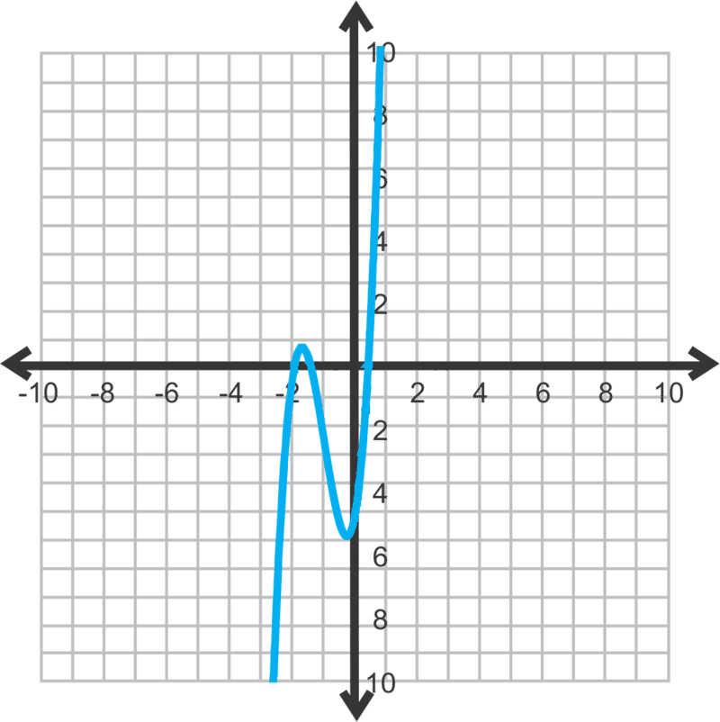

$$
\begin{align*}
& 6x^2+7x-3\\
& 6x^2+9x-2x-3\\
& 3x(2x+3)-1(2x+3)\\
& (3x-1)(2x+3)
\end{align*}
$$

From these factors, the rational solutions are $\frac{1}{3}$ and $-\frac{3}{2}$.

3. Using the Rational Root Theorem, the possible rational roots are: $\pm 6, \pm 3, \pm 2, \pm 1$.

$$
x=\frac{-4 \pm \sqrt{4^2-4(1)(1)}}{2(1)}=\frac{-4 \pm \sqrt{12}}{2}=\frac{-4 \pm 2\sqrt{3}}{2}=-2 \pm \sqrt{3} \approx -0.27, -3.73
$$

**Vocabulary**

**Rational Root Theorem:** For a polynomial, $f(x)=a_nx^n+a_{n-1}x^{n-1}+\cdots+a_1x+a_0$, where $a_n, a_{n-1}, \cdots a_0$ are integers, the rational roots can be determined from the factors of $a_n$ and $a_0$. More specifically, if $p$ is a factor of $a_0$ and $q$ is a factor of $a_n$, then all the rational factors will have the form $\pm \frac{p}{q}$.

**Problem Set**

Find all the possible rational solutions for the following polynomials. Use the Rational Root Theorem.

1.  $f(x)=x^3+6x^2-18x+20$
2.  $f(x)=4x^4+x^2-15$
3.  $f(x)=-2x^3+7x^2-x+8$
4.  $f(x)=x^4-3x^3-4x^2+15x+9$

Find all the real-number solutions for each function below. Use any method you like.

5.  $f(x)=6x^3-17x^2+11x-2$
6.  $f(x)=x^4+7x^3+6x^2-32x-32$
7.  $f(x)=16x^3+40x^2-25x-3$
8.  $f(x)=2x^3-9x^2+21x-18$
9.  $f(x)=4x^3-16x^2+39x-295$
10. $f(x)=18x^4+3x^3-17x^2+17x-55$
11. $f(x)=x^5+7x^4-3x^3-65x^2-8x-156$
12. Solve $f(x)=3x^4-x^2-14$ by factoring. How many real solutions does this function have? What type of solution(s) could the others be?

Finding Imaginary Solutions
---------------------------

**Objective**

To find all the solutions to any polynomial, including imaginary solutions.

**Watch This**

!?[0](https://www.youtube.com/watch?v=-lLwyRE3cps)

[James Sousa: Ex 4: Find the Zeros of a Polynomial Function with Imaginary Zeros](http://www.youtube.com/watch?v=-lLwyRE3cps)

**Guidance**

In #12 from the previous problem set, there are two imaginary solutions. _Imaginary solutions always come in pairs._ To find the imaginary solutions to a function, use the Quadratic Formula. If you need a little review on imaginary numbers and how to solve a quadratic equation with complex solutions see the _Quadratic Equations_ chapter.

**Example A**

Solve $f(x)=3x^4-x^2-14$. (#12 from the previous problem set.)

**Solution:** First, this quartic function can be factored just like a quadratic equation. See the _Factoring Polynomials in Quadratic Form_ concept from this chapter for review.

$$
\begin{align*}
f(x) &= 3x^4-x^2-14\\
0 &= 3x^4-7x^2+6x^2-14\\
0 &= x^2(3x^2-7)+2(3x^2-7)\\
0 &= (x^2+2)(3x^2-7)
\end{align*}
$$

Now, because neither factor can be factored further and there is no $x-$term, we can set each equal to zero and solve.

$$
\begin{align*}
& && 3x^2-7=0\\
& x^2+2=0 && 3x^2=7\\
& x^2=-2 \qquad \qquad \qquad \quad and && x^2=\frac{7}{3}\\
& x=\pm \sqrt{-2} \ or \ \pm i \sqrt{2} && x=\pm \sqrt{\frac{7}{3}} \ or \ \pm \frac{\sqrt{21}}{3}
\end{align*}
$$

Including the imaginary solutions, there are four, which is what we would expect because the degree of this function is four.

**Example B**

Find all the solutions of the function $g(x)=x^4+21x^2+90$.

**Solution:** When graphed, this function does not touch the $x-$axis. Therefore, all the solutions are imaginary. To solve, this function can be factored like a quadratic equation. The factors of 90 that add up to 21 are 6 and 15.

$$
\begin{align*}
g(x) &= x^4+21x^2+90\\
0 &= (x^2+6)(x^2+15)
\end{align*}
$$

Now, set each factor equal to zero and solve.

$$
\begin{align*}
& x^2+6=0 && x^2+15=0\\
& x^2=-6 \qquad \qquad \qquad and && x^2=-15\\
& x=\pm i \sqrt{6} && x=\pm i \sqrt{15}
\end{align*}
$$

**Example C**

Find the function that has the solution 3, -2, and $4 + i$.

**Solution:** Notice that one of the given solutions is imaginary. Imaginary solutions always come in pairs, so $4 - i$ is also a factor, they are **complex conjugates.** Now, translate each solution into a factor and multiply them all together.

**Guided Practice**

Find all the solutions to the following functions.

1. $f(x)=25x^3-120x^2+81x-4$

2. $f(x)=4x^4+35x^2-9$

3. Find the equation of a function with roots 4, $\sqrt{2}$ and $1-i$.

**Answers**

1. First, graph the function.

$$
\begin{align*}
x &= \frac{20 \pm \sqrt{20^2-4(25)(1)}}{2(25)}\\
&= \frac{20 \pm \sqrt{400-100}}{50}\\
& =\frac{20 \pm 10 \sqrt{3}}{50} \ or \ \frac{2 \pm \sqrt{3}}{5} \approx 0.746 \ and \ 0.054
\end{align*}
$$

$^*$**Helpful Hint:** Always find the decimal values of each zero to make sure they match up with the graph.

2. $f(x)=4x^4+35x^2-9$ is factorable. $ac = -36$.

$$
\begin{align*}
& 4x^4+35x^2-9\\
& 4x^4+36x^2-x^2-9\\
& 4x^2(x^2+9)-1(x^2+9)\\
& (x^2+9)(4x^2-1)
\end{align*}
$$

Setting each factor equal to zero, we have:

$$
\begin{align*}
& && 4x^2-1=0\\
& x^2+9=0 && 4x^2=1\\
& x^2=-9 \quad \qquad \qquad or && x^2=\frac{1}{4}\\
& x=\pm 3i && x=\pm \frac{1}{2}
\end{align*}
$$

$^*$This problem could have also been by using the same method from #1.

3. Recall that irrational and imaginary roots come in pairs. Therefore, all the roots are 4, $\sqrt{2}, {\color{red}-\sqrt{2}},1+i,{\color{red}1-i}$. Multiply all 5 roots together.

$$
\begin{align*}
& (x-4)(x-\sqrt{2})(x+\sqrt{2})(x-(1+i))(x-(1-i))\\
& (x-4)(x^2-2)(x^2-2x+2)\\
& (x^3-4x^2-2x+8)(x^2-2x+2)\\
& x^5-6x^4+8x^3-4x^2-20x+16
\end{align*}
$$

**Problem Set**

Find all solutions to the following functions. Use any method.

1.  $f(x)=x^4+x^3-12x^2-10x+20$
2.  $f(x)=4x^3-20x^2-3x+15$
3.  $f(x)=2x^4-7x^2-30$
4.  $f(x)=x^3+5x^2+12x+18$
5.  $f(x)=4x^4+4x^3-22x^2-8x+40$
6.  $f(x)=3x^4+4x^2-15$
7.  $f(x)=2x^3-6x^2+9x-27$
8.  $f(x)=6x^4-7x^3-280x^2-419x+280$
9.  $f(x)=9x^4+6x^3-28x^2+2x+11$
10. $f(x)=2x^5-19x^4+30x^3+97x^2-20x+150$

Find a function with the following roots.

11. $4, i$
12. $-3, -2i$
13. $\sqrt{5}, -1 + i$
14. $2, \frac{1}{3}, 4-\sqrt{2}$
15. **Writing** Write down the steps you use to find all the zeros of a polynomial function.
16. **Writing** Why do imaginary and irrational roots always come in pairs?
17. **Challenge** Find all the solutions to $f(x)=x^5+x^3+8x^2+8$.

</article>

### 6.6 Analyzing the Graph of Polynomial Functions

<article>

**Objective**

To learn about the parts of a polynomial function and how to graph them. The graphing calculator will be used to aid in graphing.

**Review Queue**

1. Graph $4x-5y=25$. Find the slope, $x-$ and $y-$intercepts.

2. Graph $y=x^2-2x-8$. Find the $x-$intercepts, $y-$intercept, and vertex.

3. Find the vertex of $y=-4x^2+24x+5$. Is the vertex a maximum or minimum?

Finding and Defining Parts of a Polynomial Function Graph
---------------------------------------------------------

**Objective**

Learning about the different parts of graphs for higher-degree polynomials.

**Watch This**

First watch this video.

!?[0](https://www.youtube.com/watch?v=wjC3RBnrtqU)

[James Sousa: Ex: Increasing/ Decreasing/ Relative Extrema from Analyzing a Graph](http://www.youtube.com/watch?v=wjC3RBnrtqU)

Then watch this video.

!?[0](https://www.youtube.com/watch?v=y78Dpr9LLN0)

[James Sousa: Summary of End Behavior or Long Run Behavior of Polynomial Functions](http://www.youtube.com/watch?v=y78Dpr9LLN0)

**Guidance**

By now, you should be familiar with the general idea of what a polynomial function graph does. It should cross the $x-$axis as many times as the degree, unless there are imaginary solutions. It will curve up and down and can have a maximum and a minimum. Let’s define the parts of a polynomial function graph here.

")

\[Figure 2\]

Notice that in both the cubic (third degree, on the left) and the quartic (fourth degree, on the right) functions, there is no vertex. We now have minimums and maximums. If there are more than one minimum or maximum, there will be an **absolute maximum/minimum**, which is the lowest/highest point of the graph. A **local maximum/minimum** is a maximum/minimum relative to the points around it. The places where the function crosses the $x-$axis are still the **solutions** (also called $x-$intercepts, roots or zeros). In the quartic function, there is a repeated root at $x = 4$. A repeated root will touch the $x-$axis without passing through or it can also have a “jump” in the curve at that point (see Example A). All of these points together (maximums, minimums, $x-$intercepts, and $y-$intercept) are called **critical values.**

Another important thing to note is **end behavior.** It is exactly what it sounds like; how the “ends” of the graph behaves or points. The cubic function above has ends that point in the opposite direction. We say that from left to right, this function is _mostly increasing._ The quartic function’s ends point in the same direction, both positive, just like a quadratic function. When considering end behavior, look at the leading coefficient and the degree of the polynomial.

**Example A**

Use a table to graph $y=x^3$.

**Solution:** Draw a table and pick at least 5 values for $x$.

| $x$ | $x^3$ | $y$ |
| --- | --- | --- |
| \-2 | $(-2)^3$ | \-8 |
| \-1 | $(-1)^3$ | \-1 |
| 0   | $0^3$ | 0   |
| 1   | $1^3$ | 1   |
| 2   | $2^3$ | 8   |

**Example B**

Analyze the graph below. Find the critical values, end behavior, and find the domain and range.

, (1, 0), and (2, 0). Therefore, this function has a minimum degree of 3. However, look at the $y-$intercept. The graph slightly bends between the maximum and minimum. This movement in the graph tells us that there are two imaginary solutions (recall that imaginary solutions always come in pairs). Therefore, the function has a degree of 5. Approximate the other critical values:")

maximum: (-1.1, 10)

minimum: (1.5, -1.3)

$y-$intercept: (0, 5)

In general, this function is mostly increasing and the ends go in opposite directions. The domain and range are both all real numbers.

When describing critical values, you may approximate their location. In the next concept, we will use the graphing calculator to find these values exactly.

Sometime it can be tricky to see if a function has imaginary solutions from the graph. Compare the graph in Example B to the cubic function above. Notice that it is smooth between the maximum and minimum. As was pointed out earlier, the graph from Example B bends. Any function with imaginary solutions will have a slightly irregular shape or bend like this one does.

**Example C**

Sketch a graph of a function with roots $-4, -3, \frac{1}{2}$, and 3, has an absolute maximum at (2, 5), and has negative end behavior. This function does not have any imaginary roots.

**Solution:** There are several possible answers for this graph because we are only asking for a sketch. You would need more information to get an exact answer. Because this function has negative end behavior and four roots, we know that it will pass through the $x-$axis four times and face down. The absolute maximum is located between the roots $\frac{1}{2}$ and 3. Plot these five points and connect to form a graph.

1. Use a table to graph $f(x)=-(x+2)^2(x-3)$.

2. Analyze the graph. Find all the critical values, domain, range and describe the end behavior.

**Answers**

1. This function is in intercept form. Because the factor, $(x + 2)$ is squared, we know it is a repeated root. Therefore, the function should just touch at -2 and not pass through the $x-$axis. There is also a zero at 3. Because the function is negative, it will be generally decreasing. Think of the slope of the line between the two endpoints. It would be negative. Select several points around the zeros to see the behavior of the graph.

| --- | --- |
| \-4 | 14  |
| \-2 | 0   |
| 0   | 12  |
| 2   | 16  |
| 3   | 0   |
| 4   | \-36 |

2. There are three real zeros at approximately -3.5, 1, and 7. Notice the curve between the zeros 1 and 7. This indicated there are two imaginary zeros, making this at least a fifth-degree polynomial. Think about an imaginary horizontal line at $y = 3$. This line would touch the graph five times, so there should be five solutions. Next, there is an absolute minimum at (-0.5, -7.5), a local maximum at (2.25, 5), a local minimum at (2.25, 2.25) and an absolute maximum at (5, 6). The $y-$intercept is at (0, -6). The domain and range are both all real numbers and the end behavior is mostly decreasing.

3. To say the function is “mostly increasing” means that the slope of the line that connects the two ends (arrows) is positive. Then, the function must pass through (-6, 0) and touch, but not pass through (1, 0). From this information, the maximum must occur between the two zeros and the minimum will be the double root.

__Absolute Maximum/Minimum__

The highest/lowest point relative to the points around it. A function can have multiple local maximums or minimums.

**Solutions:**

The $x-$intercepts. Also called roots or zeros.

**Critical Values:** The $x-$intercepts, maximums, minimums, and $y-$intercept.

**End Behavior:** How the ends of a graph look. End behavior depends on the degree of the function and the leading coefficient.

**Parent Graph:** The most basic function of a particular type. It has a leading coefficient of 1, no additional $x-$terms, and no constant.

**Problem Set**

Use the given $x-$values to make a table and graph the functions below.

1.  $$
    \begin{align*}
    f(x) &= x^3-7x^2+15x-2\\
    x &= -2, -1, 0, 1, 2, 3, 4
    \end{align*}
    $$
    
2.  $$
    \begin{align*}
    g(x) &= -2x^4 - 11x^3 - 3x^2+37x+35\\
    x &= -5, -4, -3, -2, -1, 0, 1, 2
    \end{align*}
    $$
    
3.  $$
    \begin{align*}
    y &=2x^3+25x^2+100x+125\\
    x &= -7,-6,-5,-4,-3,-2,-1,0
    \end{align*}
    $$
    

Make your own table and graph the following functions.

4.  $f(x)=(x+5)(x+2)(x-1)$
5.  $y=x^4$
6.  $y=x^5$
7.  Analyze the graphs of $y=x^2, y=x^3, y=x^4$, and $y=x^5$. These are all parent functions. What do you think the graph of $y=x^6$ and $y=x^7$ will look like? What can you say about the end behavior of all even functions? Odd functions? What are the solutions to these functions?
8.  **Writing** How many repeated roots can one function have? Why?

Analyze the graphs of the following functions. Find all critical values, the domain, range, and end behavior.

9.  \[Figure 9\]
10. \[Figure 10\]
11. \[Figure 11\]
12. \[Figure 12\]

For questions 13-15, make a sketch of the following real-solution functions.

13. Draw **two** different graphs of a cubic function with zeros of -1, 1, and 4.5 and a minimum of -4.
14. A fourth-degree polynomial with roots of -3.2, -0.9, 1.2, and 8.7, positive end behavior, and a local minimum of -1.7.
15. A fourth-degree function with solutions of -7, -4, 1, and 2, negative end behavior, and an absolute maximum at $\left(-\frac{11}{2}, \frac{1755}{128}\right)$.
16. **Challenge** Find the equation of the function from #15.

Graphing Polynomial Functions with a Graphing Calculator
--------------------------------------------------------

**Objective**

To graph polynomial functions and find critical values using a graphing calculator.

**Watch This**

!?[0](https://www.youtube.com/watch?v=CJ-bVSwEhqw)

[James Sousa: Ex: Solve a Polynomial Equation Using a Graphing Calculator (Approximate Solutions)](http://www.youtube.com/watch?v=CJ-bVSwEhqw)

**Guidance**

In the Quadratic Functions chapter, you used the graphing calculator to graph parabolas. Now, we will expand upon that knowledge and graph higher-degree polynomials. Then, we will use the graphing calculator to find the zeros, maximums and minimums.

**Example A**

Graph $f(x)=x^3+x^2-8x-8$ using a graphing calculator.

**Solution:** _These instructions are for a TI-83 or 84_. First, press $Y=$. If there are any functions in this window, clear them out by highlighting the = sign and pressing **ENTER.** Now, in $Y1$, enter in the polynomial. It should look like: $x^\land 3+x^\land 2-8x-8$. Press **GRAPH**.

, press **6:ZStandard.** To zoom out, press **ZOOM, 3:ZoomOut, ENTER, ENTER.** For this particular function, the window needs to go from -15 to 15 for both $x$ and $y$. To manually input the window, press WINDOW and change the $Xmin, Xmax, Ymin,$ and $Ymax$ so that you can see the zeros, minimum and maximum. Your graph should look like the one to the right.")

**Example B**

Find the zeros, maximum, and minimum of the function from Example A.

**Solution:** To find the zeros, press $2^{nd}$ **TRACE** to get the **CALC** menu. Select **2:Zero** and you will be asked “Left Bound?” by the calculator. Move the cursor (by pressing the $\uparrow$ or $\downarrow$) so that it is just to the left of one zero. Press **ENTER.** Then, it will ask “Right Bound?” Move the cursor just to the right of that zero. Press **ENTER.** The calculator will then ask “Guess?” At this point, you can enter in what you think the zero is and press **ENTER** again. Then the calculator will give you the exact zero. For the graph from Example A, you will need to repeat this three times. The zeros are -2.83, -1, and 2.83.

To find the minimum and maximum, the process is almost identical to finding zeros. Instead of selecting **2:Zero**, select **3:min** or **4:max**. The minimum is (1.33, -14.52) and the maximum is (-2, 4).

**Example C**

Find the $y-$intercept of the graph from Example A.

**Solution:** If you decide not to use the calculator, plug in zero for $x$ and solve for $y$.

$$
\begin{align*}
f(0) &= 0^3+0^2 - 8 \cdot 0 - 8\\
&= -8
\end{align*}
$$

Using the graphing calculator, press $2^{nd}$ **TRACE** to get the **CALC** menu. Select **1:value.** $X=$ shows up at the bottom of the screen. If there is a value there, press **CLEAR** to remove it. Then press **0** and **ENTER.** The calculator should then say “$Y=-8$.”

**Guided Practice**

Graph and find the critical values of the following functions.

1. $f(x)=-\frac{1}{3}x^4-x^3+10x^2+25x-4$

2. $g(x)=2x^5-x^4+6x^3+18x^2-3x-8$

3. Find the domain and range of the previous two functions.

4. Describe the types of solutions, as specifically as possible, for question 2.

**Answers**

Use the steps given in Examples $A, B$, and $C$.

1. zeros: -5.874, -2.56, 0.151, 5.283

$y-$intercept: (0, -4)

minimum: (-1.15, -18.59)

local maximum: (-4.62, 40.69)

absolute maximum: (3.52, 113.12)

$y-$intercept: (0, -8)

minimum: (-1.11, 4.41)

maximum: (0.08, -8.12)

4. There are three irrational solutions and two imaginary solutions.

**Problem Set**

Graph questions 1-6 on your graphing calculator. Sketch the graph in an appropriate window. Then, find all the critical values, domain, range, and describe the end behavior.

1.  $f(x)=2x^3+5x^2-4x-12$
2.  $h(x)=-\frac{1}{4}x^4-2x^3-\frac{13}{4} x^2-8x-9$
3.  $y=x^3-8$
4.  $g(x)=-x^3-11x^2-14x+10$
5.  $f(x)=2x^4+3x^3-26x^2-3x+54$
6.  $y=x^4+2x^3-5x^2-12x-6$
7.  What are the types of solutions in #2?
8.  Find the two imaginary solutions in #3.
9.  Find the exact values of the irrational roots in #5.

Determine if the following statements are SOMETIMES, ALWAYS, or NEVER true. Explain your reasoning.

10. The range of an even function is $(-\infty, max]$, where _max_ is the maximum of the function.
11. The domain and range of all odd functions are all real numbers.
12. A function can have exactly three imaginary solutions.
13. An $n^{th}$ degree polynomial has $n$ real zeros.
14. **Challenge** The exact value for one of the zeros in #2 is $-4+\sqrt{7}$. What is the exact value of the other root? Use this information to find the imaginary roots.

</article>

## 7.0 Roots, Radicals and Function Operations

<article>

This chapter extends what we have learned about polynomials and exponents and applies those ideas to square root and cubed root functions. First, we will introduce rational exponents and simplify these expressions. We will also solve equations with radicals and rational exponents. Then, we switch gears a little and learn how to find the inverse of a function as well as how to add, subtract, multiply, divide, and compose them. The last lesson is an introduction to statistics.

</article>

### 7.1 Using Rational Exponents and nth Roots

<article>

**Objective**

To introduce rational exponents and nth roots. Then, we will apply the properties of exponents to rational functions and nth roots.

**Review Queue**

Evaluate each expression.

1.  $\left(5x\right)^2$
2.  $\frac{4x^5y^7}{12xy^9}$
3.  $\sqrt{81x^2y^5}$
4.  $\sqrt{\frac{75}{96}}$

Defining nth Roots
------------------

**Objective**

To define and use $n^{th}$ roots.

**Guidance**

So far, we have seen exponents with integers and the square root. In this concept, we will link roots and exponents. First, let’s define additional roots. Just like the square and the square root are inverses of each other, the inverse of a cube is the cubed root. The inverse of the fourth power is the fourth root.

$$
\sqrt[3]{27}=\sqrt[3]{3^3}=3, \sqrt[5]{32}=\sqrt[5]{2^5}=2
$$

The $n^{th}$ **root** of a number, $x^n$, is $x, \sqrt[n]{x^n}=x$. And, just like simplifying square roots, we can simplify $n^{th}$ roots.

**Example A**

Find $\sqrt [6]{729}$.

**Solution:** To simplify a number to the sixth root, there must be 6 of the same factor to pull out of the root.

$729=3 \cdot 3 \cdot 3 \cdot 3 \cdot 3 \cdot 3=3^6$

Therefore, $\sqrt[6]{729}=\sqrt[6]{3^6}=3$. The sixth root and the sixth power cancel each other out. We say that 3 is the sixth root of 729.

From this example, we can see that it does not matter where the exponent is placed, it will always cancel out with the root.

$$
\begin{align*}
\sqrt[6]{3^6}&=\sqrt[6]{3}^6 \ or \ \left(\sqrt[6]{3} \right)^6\\
\sqrt[6]{729}&=\left(1.2009 \ldots\right)^6\\
3&=3
\end{align*}
$$

So, it does not matter if you evaluate the root first or the exponent.

**The $n^{th}$ Root Theorem:** For any real number $a$, root $n$, and exponent $m$, the following is always true: $\sqrt[n]{a^m}=\sqrt[n]{a}^m=\left(\sqrt[n]{a}\right)^m$.

**Example B**

Evaluate without a calculator:

a) $\sqrt[5]{32^3}$

b) $\sqrt{16}^3$

**Solution:**

a) If you solve this problem as written, you would first find $32^3$ and then apply the $5^{th}$ root.

$\sqrt[5]{32^3}=\sqrt[5]{38768}=8$

However, this would be very difficult to do without a calculator. This is an example where it would be easier to apply the root and then the exponent. Let’s rewrite the expression and solve.

$\sqrt[5]{32}^3=2^3=8$

b) This problem does not need to be rewritten. $\sqrt{16}=4$ and then $4^3 = 64$.

**Example C**

Simplify:

a) $\sqrt[4]{64}$

b) $\sqrt[3]{\frac{54x^3}{125y^5}}$

**Solution:**

a) To simplify the fourth root of a number, there must be 4 of the same factor to pull it out of the root. Let’s write the prime factorization of 64 and simplify.

$\sqrt[4]{64}=\sqrt[{\color{red}4}]{{\color{red}2 \cdot 2\cdot 2\cdot 2}\cdot 2\cdot 2}=2\sqrt[4]{4}$

Notice that there are 6 2’s in 64. We can pull out 4 of them and 2 2’s are left under the radical.

b) Just like simplifying fractions with square roots, we can separate the numerator and denominator.

$\sqrt[3]{\frac{{54x^3}}{{125y^5}}}= \frac{\sqrt[3]{54x^3}}{\sqrt[3]{125y^5}}=\frac{\sqrt[{\color{red}3}]{2 \cdot{\color{red}3\cdot 3\cdot 3}\cdot {\color{red}x^3}}}{\sqrt[{\color{blue}3}]{{\color{blue}5\cdot 5\cdot 5\cdot y^3}\cdot y^2}}=\frac{3x\sqrt[3]{2}}{5y\sqrt[3]{y^2}}$

Notice that because the $x$ is cubed, the cube and cubed root cancel each other out. With the $y$\-term, there were five, so three cancel out with the root, but two are still left under radical.

**Guided Practice**

Simplify each expression below, without a calculator.

1. $\sqrt[4]{625z^8}$

2. $\sqrt[7]{32x^5y}$

3. $\sqrt[5]{9216}$

4. $\sqrt[3]{\frac{40}{175}}$

**Answers**

1. First, you can separate this number into two different roots, $\sqrt[4]{625} \cdot \sqrt[4]{z^8}$. Now, simplify each root.

$\sqrt[4]{625}\cdot \sqrt[4]{z^8} = \sqrt[4]{5^4}\cdot \sqrt[4]{z^4\cdot z^4}= 5z^2$

When looking at the $z^8$, think about how many $z^4$ you can even pull out of the fourth root. The answer is 2, or a $z^2$, outside of the radical.

2. $32 = 2^5$, which means there are not 7 2's that can be pulled out of the radical. Same with the $x^5$ and the $y$. Therefore, you cannot simplify the expression any further.

3. Write out 9216 in the prime factorization and place factors into groups of 5.

$$
\begin{align*}
\sqrt[5]{9216}&=\sqrt[5]{\boxed{2 \cdot 2\cdot 2\cdot 2\cdot 2}\cdot \boxed{2\cdot 2 \cdot 2\cdot 2\cdot 2} \cdot 3\cdot 3}\\
&=\sqrt[5]{2^5\cdot 2^5 \cdot 3^2}\\
&=2\cdot 2 \sqrt[5]{3^2}\\
&=4\sqrt[5]{9}
\end{align*}
$$

4. Reduce the fraction, separate the numerator and denominator and simplify.

$\sqrt[3]{\frac{40}{175}}=\sqrt[3]{\frac{8}{35}}=\frac{\sqrt[3]{2^3}}{\sqrt[3]{35}}={\color{red}{\frac{2}{\sqrt[3]{35}}}\cdot} {\color{red}{\frac{\sqrt[3]{35^2}}{\sqrt[3]{35^2}}}}=\frac{2\sqrt[3]{1225}}{35}$

In the red step, we rationalized the denominator by multiplying the top and bottom by $\sqrt[3]{35^2}$, so that the denominator would be $\sqrt[3]{35^3}$ or just 35. Be careful when rationalizing the denominator with higher roots!

**Vocabulary**

__$n^{th}$ root__

The $n^{th}$ root of a number, $x^n$, is $x, \sqrt[n]{x^n}=x$.

**Problem Set**

Reduce the following radical expressions.

1.  $\sqrt[3]{81}$
2.  $\sqrt[5]{128}$
3.  $\sqrt{\frac{25}{8}}^4$
4.  $\sqrt[6]{64}^5$
5.  $\sqrt[3]{\frac{8}{81}}^2$
6.  $\sqrt[4]{\frac{243}{16}}$
7.  $\sqrt[3]{24x^5}$
8.  $\sqrt[4]{48x^7y^{13}}$
9.  $\sqrt[5]{\frac{160x^8}{y^7}}$
10. $\sqrt[3]{1000x^6}^2$
11. $\sqrt[4]{\frac{162x^5}{y^3z^{10}}}$
12. $\sqrt{40x^3y^4}^3$

Rational Exponents and Roots
----------------------------

**Objective**

To introduce rational exponents and relate them to $n^{th}$ roots.

**Guidance**

Now that you are familiar with nth roots, we will convert them into exponents. Let’s look at the square root and see if we can use the properties of exponents to determine what exponential number it is equivalent to.

**Investigation: Writing the Square Root as an Exponent**

|     |     |
| --- | --- |
| 1. Evaluate $\left(\sqrt{x}\right)^2$. What happens? | The $\sqrt{\;\;}$ and the $^2$ cancel each other out, $\left(\sqrt{x}^2\right)=x$. |
| 2. Recall that when a power is raised to another power, we multiply the exponents. Therefore, we can rewrite the exponents and root as an equation, $n\cdot 2=1$. Solve for $n$. | $\frac{n \cdot \cancel{2}}{\cancel{2}}=\frac{1}{2}$  $n=\frac{1}{2}$ |
| 3. From #2, we can conclude that $\sqrt{\;\;}=\frac{1}{2}$. | $\left(\sqrt{x}\right)^2=\left(x^{\frac{1}{2}}\right)^2$ $=x^{\left(\frac{1}{2}\right)\cdot 2}$ $=x^1=x$ |

From this investigation, we see that $\sqrt{x}=x^{\frac{1}{2}}$. We can extend this idea to the other roots as well; $\sqrt[3]{x}=x^{\frac{1}{3}}=\sqrt[4]{x}=x^{\frac{1}{4}},\ldots \sqrt[n]{x}=x^{\frac{1}{n}}$.

**Example A**

Find $256^{\frac{1}{4}}$.

**Solution:** Rewrite this expression in terms of roots. A number to the one-fourth power is the same as the fourth root.

$256^{\frac{1}{4}}=\sqrt[4]{256}=\sqrt[4]{4^4}=4$

Therefore, $256^{\frac{1}{4}}=4$.

**Example B**

Find $49^{\frac{3}{2}}$.

**Solution:** This problem is the same as the ones in the previous concept. However, now, the root is written in the exponent. Rewrite the problem.

$49^{\frac{3}{2}}=\left(49^3\right)^{\frac{1}{2}}=\sqrt{49^3}$ or $\left(\sqrt{49}\right)^3$

From the previous concept, we know that it is easier to evaluate the second option above. $\left(\sqrt{49}\right)^3=7^3=343$.

**The Rational Exponent Theorem:** For any real number $a$, root $n$, and exponent $m$, the following is always true: $a^{\frac{m}{n}}=\sqrt[n]{a^m}=\left(\sqrt[n]{a}\right)^m$.

**Example C**

Find $5^{\frac{2}{3}}$ using a calculator. Round your answer to the nearest hundredth.

**Solution:** To type this into a calculator, the keystrokes would probably look like: $5^{\frac{2}{3}}$. The “^” symbol is used to indicate a power. Anything in parenthesis after the “^” would be in the exponent. Evaluating this, we have 2.924017738..., or just 2.92.

Other calculators might have a $x^y$ button. This button has the same purpose as the ^ and would be used in the exact same way.

**Guided Practice**

1. Rewrite $\sqrt[7]{12}$ using rational exponents. Then, use a calculator to find the answer.

2. Rewrite $845^{\frac{4}{9}}$ using roots. Then, use a calculator to find the answer.

Evaluate without a calculator.

3. $125^{\frac{4}{3}}$

4. $256^{\frac{5}{8}}$

5. $\sqrt{81^{\frac{1}{2}}}$

**Answers**

1. Using rational exponents, the $7^{th}$ root becomes the $\frac{1}{7}$ power;$12^{\frac{1}{7}}=1.426$.

2. Using roots, the 9 in the denominator of the exponent is the root;$\sqrt[9]{845^4}=19.99$. To enter this into a calculator, you can use the rational exponents. If you have a TI-83 or 84, press **MATH** and select **5**: $\sqrt[x]{\;\;}$. On the screen, you should type $9\sqrt[x]{\;\;} \ 845^\land 4$ to get the correct answer. You can also enter $845^\land {\left(\frac{4}{9}\right)}$ and get the exact same answer

3. $125^{\frac{4}{3}}=\left(\sqrt[3]{125}\right)^4=5^4=625$

4. $256^{\frac{5}{8}}=\left(\sqrt[8]{256}\right)^5=2^5=32$

5. $\sqrt{81^{\frac{1}{2}}}=\sqrt{\sqrt{81}}=\sqrt{9}=3$

**Vocabulary**

__Rational Exponent__

An exponent that can be written as a fraction. For any $n^{th}$ root, the $n$ of the root can be written in the denominator of a rational exponent. $\sqrt[{\color{red}n}]{x}=x^{\frac{1}{{\color{red}n}}}$.

**Problem Set**

Write the following expressions using rational exponents and then evaluate using a calculator. Answers should be rounded to the nearest hundredth.

1.  $\sqrt[5]{45}$
2.  $\sqrt[9]{140}$
3.  $\sqrt[8]{50}^3$

Write the following expressions using roots and then evaluate using a calculator. Answers should be rounded to the nearest hundredth.

4.  $72^{\frac{5}{3}}$
5.  $95^{\frac{2}{3}}$
6.  $125^{\frac{3}{4}}$

Evaluate the following without a calculator.

7.  $64^{\frac{2}{3}}$
8.  $27^{\frac{4}{3}}$
9.  $16^{\frac{5}{4}}$
10. $\sqrt{25^3}$
11. $\sqrt[2]{9}^5$
12. $\sqrt[5]{32^2}$

For the following problems, rewrite the expressions with rational exponents and then simplify the exponent and evaluate without a calculator.

13. $\sqrt[4]{\left(\frac{2}{3}\right)^8}$
14. $\sqrt[3]{\frac{7}{2}}^6$
15. $\sqrt{\left(16\right)^{\frac{1}{2}}}^6$

Applying the Laws of Exponents to Rational Exponents
----------------------------------------------------

**Objective**

To use the laws of exponents with rational exponents.

**Guidance**

When simplifying expressions with rational exponents, all the laws of exponents that were learned in the _Polynomial Functions_ chapter are still valid. On top of that, all the rules of fractions still apply.

**Example A**

Simplify $x^{\frac{1}{2}} \cdot x^{\frac{3}{4}}$.

**Solution:** Recall from the Product Property of Exponents, that when two numbers with the same base are multiplied we _add_ the exponents. Here, the exponents do not have the same base, so we need to find a common denominator and then add the numerators.

$x^{\frac{1}{2}}\cdot x^{\frac{3}{4}}=x^{\frac{2}{4}}\cdot x^{\frac{3}{4}}=x^{\frac{5}{4}}$

This rational exponent does not reduce, so we are done.

**Example B**

Simplify $\frac{4x^{\frac{2}{3}}y^4}{16x^3y^{\frac{5}{6}}}$

**Solution:** This problem utilizes the Quotient Property of Exponents. Subtract the exponents with the same base and reduce $\frac{4}{16}$.

$\frac{4x^{\frac{2}{3}}y^4}{16x^3y^{\frac{5}{6}}}=\frac{1}{4}x^{{\left(\frac{2}{3}\right)}-3}y^{\frac{4-5}{6}}=\frac{1}{4}x^{\frac{-7}{3}}y^{\frac{19}{6}}$

If you are writing your answer in terms of positive exponents, your answer would be $\frac{y^{\frac{19}{6}}}{4x^{\frac{7}{3}}}$. Notice, that when a rational exponent is improper we do not change it to a mixed number.

If we were to write the answer using roots, then we would take out the whole numbers. For example, $y= \frac{19}{6}$ can be written as $y^{\frac{19}{6}}=y^3y^{\frac{1}{6}}=y^3\sqrt[6]{y}$ because 6 goes into 19, 3 times with a remainder of 1.

**Example C**

Simplify $\left(9x^{\frac{6}{10}}\right)^{\frac{5}{2}}$.

**Solution:** This example uses the Powers Property of Exponents. When a power is raised to another power, we multiply the exponents.

$\left(9x^{\frac{6}{15}}\right)^{\frac{5}{2}}=9^{\frac{5}{2}}\cdot x^{\left(\frac{6}{10}\right) \cdot \left(\frac{5}{2}\right)}=\sqrt{9}^5x^{\frac{30}{20}}=243x^{\frac{3}{2}}$

**Example D**

Simplify $\frac{\left(2x^{\frac{1}{2}}y^6\right)^{\frac{2}{3}}}{4x^{\frac{5}{4}}y^{\frac{9}{4}}}$.

**Solution:** On the numerator, the entire expression is raised to the $\frac{2}{3}$ power. Distribute this power to everything inside the parenthesis. Then, use the Powers Property of Exponents and rewrite 4 as $2^2$.

$\frac{\left(2x^{\frac{1}{2}}y^6\right)^{\frac{2}{3}}}{4x^{\frac{5}{4}}y^{\frac{9}{4}}}=\frac{2^{\frac{2}{3}}x^{\frac{1}{3}}y^4}{2^2x^{\frac{5}{4}}y^{\frac{9}{4}}}$

Combine like terms by subtracting the exponents.

$\frac{2^{\frac{2}{3}}x^{\frac{1}{3}}y^4}{2^2x^{\frac{5}{4}}y^{\frac{9}{4}}} = 2^{\left(\frac{2}{3}\right)-2}x^{\left(\frac{1}{3}\right)-\left(\frac{5}{4}\right)}y^{4-\left(\frac{9}{4}\right)}=2^{\frac{-4}{3}}x^{\frac{-11}{12}}y^{\frac{7}{4}}$

Finally, rewrite the answer with positive exponents by moving the 2 and $x$ into the denominator. $\frac{y^{\frac{7}{4}}}{2^{\frac{4}{3}}x^{\frac{11}{12}}}$

**Guided Practice**

Simplify each expression. Reduce all rational exponents and write final answers using positive exponents.

1. $4d^{\frac{3}{5}} \cdot 8^{\frac{1}{3}}d^{\frac{2}{5}}$

2. $\frac{w^{\frac{7}{4}}}{w^{\frac{1}{2}}}$

3. $\left(3^{\frac{3}{2}}x^4 y^{\frac{6}{5}}\right)^{\frac{4}{3}}$

**Answers**

1. Change 4 and 8 so that they are powers of 2 and then add exponents with the same base.

$4d^{\frac{3}{5}} \cdot 8^{\frac{1}{3}}d^{\frac{2}{5}}=2^2 d^{\frac{3}{5}} \cdot \left(2^3\right)^{\frac{1}{3}}d^{\frac{2}{5}}=2^3 d^{\frac{5}{5}}=8d$

2. Subtract the exponents. Change the $\frac{1}{2}$ power to $\frac{2}{4}$.

$\frac{w^{\frac{7}{4}}}{w^\frac{1}{2}}= \frac{w^{\frac{7}{4}}}{w^{\frac{2}{4}}}=w^{\frac{5}{4}}$

3. Distribute the $\frac{4}{3}$ power to everything inside the parenthesis and reduce.

$\left(3^{\frac{3}{2}}x^4 y^{\frac{6}{5}}\right)^{\frac{4}{3}}=3^{\frac{12}{6}}x^{\frac{16}{3}}y^{\frac{24}{15}}=3^2 x^{\frac{16}{3}}y^{\frac{8}{5}}=9x^{\frac{16}{3}}y^{\frac{8}{5}}$

**Problem Set**

Simplify each expression. Reduce all rational exponents and write final answer using positive exponents.

1.  $\frac{1}{5}a^{\frac{4}{5}}25^{\frac{3}{2}}a^{\frac{3}{5}}$
2.  $7b^{\frac{4}{3}}49^{\frac{1}{2}}b^{-\frac{2}{3}}$
3.  $\frac{m^{\frac{8}{9}}}{m^{\frac{2}{3}}}$
4.  $\frac{x^{\frac{4}{7}}y^{\frac{11}{6}}}{x^{\frac{1}{14}}y^{\frac{5}{3}}}$
5.  $\frac{8^{\frac{5}{3}}r^5 s^{\frac{3}{4}}t^{\frac{1}{3}}}{2^4 r^{\frac{21}{5}}s^2 t^{\frac{7}{9}}}$
6.  $\left(a^{\frac{3}{2}}b^{\frac{4}{5}}\right)^{\frac{10}{3}}$
7.  $\left(5x^{\frac{5}{7}}y^4\right)^{\frac{3}{2}}$
8.  $\left(\frac{4x^{\frac{2}{5}}}{9y^{\frac{4}{5}}}\right)^{\frac{5}{2}}$
9.  $\left(\frac{75d^{\frac{18}{5}}}{3d^{\frac{3}{5}}}\right)^{\frac{5}{2}}$
10. $\left(\frac{81^{\frac{3}{2}}a^3}{8a^{\frac{9}{2}}}\right)^{\frac{1}{3}}$
11. $27^{\frac{2}{3}}m^{\frac{4}{5}}n^{-\frac{3}{2}}4^{\frac{1}{2}}m^{-\frac{2}{3}}n^{\frac{8}{5}}$
12. $\left(\frac{3x^{\frac{3}{8}}y^{\frac{2}{5}}}{5x^{\frac{1}{4}}y^{-\frac{3}{10}}}\right)^2$

</article>

### 7.2 Graphing Square Root and Cubed Root Functions

<article>

**Objective**

To graph square root and cubed root functions by hand and using a graphing calculator.

**Review Queue**

Graph the following functions without using a graphing calculator.

1.  $y=-2x+5$
2.  $y=x^2+4x-5$
3.  $y=-(x-1)(x+7)$
4.  Using a graphing calculator, graph $f(x)=x^3-6x^2-9x+54$. Find any minimums or maximum and all solutions.

Graphing Square Root Functions
------------------------------

**Objective**

To graph a square root function with and without a calculator.

**Guidance**

A square root function has the form $y=a \sqrt{x-h}+k$, where $y=\sqrt{x}$ is the parent graph. Graphing the parent graph, we have:

| **$x$** | **$y$** |
| --- | --- |
| 16  | 4   |
| 9   | 3   |
| 4   | 2   |
| 1   | 1   |
| 0   | 0   |
| \-1 | not a real number |

**Example A**

Graph $y= \sqrt{x-2}+5$ without a calculator.

**Solution:** To graph this function, draw a table. $x=2$ is a critical value because it makes the radical zero.

| **$x$** | **$y$** |
| --- | --- |
| 2   | 5   |
| 3   | 6   |
| 6   | 7   |
| 11  | 8   |

The domain is all real numbers such that $x \ge 2$ and the range is all real numbers such that $y \ge 5$.

**Example B**

Graph $y=3 \sqrt{x+1}$. Find the domain and range.

**Solution:** From the previous example, we already know that there is going to be a horizontal shift to the left one unit. The 3 in front of the radical changes the width of the function. Let’s make a table.

| **$x$** | **$y$** |
| --- | --- |
| $-1$ | 0   |
| 0   | 3   |
| 3   | 6   |
| 8   | 9   |
| 15  | 12  |

$ from the equation, the starting point is $(-1, 0)$ and then rather than increase at a “slope” of 1, it is three times larger than that.")

**Example C**

Graph $f(x)=- \sqrt{x-2}+3$.

**Solution:** Extracting $(h, k)$ from the equation, we find that the starting point is $(2, 3)$. The negative sign in front of the radical indicates a reflection. Let’s make a table. Because the starting point is $(2, 3)$, we should only pick $x$\-values after $x=2$.

| **$x$** | **$y$** |
| --- | --- |
| 2   | 3   |
| 3   | 2   |
| 6   | 1   |
| 11  | 0   |
| 18  | \-1 |

**Using the graphing calculator:** If you wanted to graph this function using the TI-83 or 84, press $Y=$ and clear out any functions. Then, press the negative sign, (-) and **2nd** $x^2$, which is $\sqrt{\;\;}$. Then, type in the rest of the function, so that $Y=- \sqrt{\;\;}(X-2)+3$. Press **GRAPH** and adjust the window.

**Guided Practice**

1. Evaluate $y=-2 \sqrt{x-5}+8$ when $x=9$.

Graph the following square root functions. Describe the relationship to the parent graph and find the domain and range. Use a graphing calculator for #3.

2. $y=\sqrt{-x}$

3. $f(x)= \frac{1}{2} \sqrt{x+3}$

4. $f(x)=-4 \sqrt{x-5}+1$

**Answers**

1. Plug in $x=9$ into the equation and solve for $y$.

$y=-2 \sqrt{9-5}+8=-2 \sqrt{4}+8=-2(2)+8=-4+8=-4$

2. Here, the negative is under the radical. This graph is a reflection of the parent graph over the $y$\-axis.

The domain is all real numbers less than or equal to zero. The range is all real numbers greater than or equal to zero.

$ and it is going to “grow” half as fast as the parent graph.")

The domain is all real numbers greater than or equal to -3. The range is all real numbers greater than or equal to zero.

 + 1$. It will be a reflection over the $x$\-axis, have a starting point of $(5, 1)$ and grow four times as fast as the parent graph.")

__General Equation for a Square Root Function__

$f(x)=a \sqrt{x-h}+k$ where $h$ is the horizontal shift and $k$ is the vertical shift.

__Starting point__

The initial point of a square root function, $(h, k)$.

**Problem Set**

Graph the following square root functions. Use your calculator to check your answers.

1.  $\sqrt{x+2}$
2.  $\sqrt{x-5}-2$
3.  $-2 \sqrt{x+1}$
4.  $1+ \sqrt{x-3}$
5.  $\frac{1}{2} \sqrt{x+8}$
6.  $3 \sqrt{x+6}$
7.  $2 \sqrt{1-x}$
8.  $\sqrt{x+3}-5$
9.  $4 \sqrt{x+9}-8$
10. $- \frac{3}{2} \sqrt{x-3}+6$
11. $-3 \sqrt{5-x}+7$
12. $2 \sqrt{3-x}-9$

Graphing Cubed Root Functions
-----------------------------

**Objective**

To graph a cubed root function with and without a calculator.

**Guidance**

A cubed root function is different from that of a square root. Their general forms look very similar, $y=a \sqrt[3]{x-h}+k$ and the parent graph is $y= \sqrt[3]{x}$. However, we can take the cubed root of a negative number, therefore, it will be defined for all values of $x$. Graphing the parent graph, we have:

| --- | --- |
| $-27$ | \-3 |
| \-8 | \-2 |
| \-1 | \-1 |
| 0   | 0   |
| 1   | 1   |
| 8   | 2   |
| 27  | 3   |

For $y= \sqrt[3]{x}$, the output is the same as the input of $y=x^3$. The domain and range of $y= \sqrt[3]{x}$ are all real numbers. Notice there is no “starting point” like the square root functions, the $(h, k)$ now refers to the point where the function bends.

**Example A**

Describe how to obtain the graph of $y= \sqrt[3]{x}+5$ from $y= \sqrt[3]{x}$.

**Example B**

Graph $y=- \sqrt[3]{x+2}-3$. Find the domain and range.

**Alternate Method:** If you want to use a table (like in the previous concept), that will also work. Here is a table, then plot the points. $(h, k)$ should always be the middle point in your table.

| **$x$** | **$y$** |
| --- | --- |
| 6   | \-5 |
| \-1 | \-4 |
| \-2 | \-3 |
| \-3 | \-2 |
| \-10 | \-1 |

**Example C**

Graph $f(x)= \frac{1}{2} \sqrt[3]{x-4}$.

**Solution:** The -4 tells us that, from the parent graph, the function will shift to the right four units. The $\frac{1}{2}$ effects how quickly the function will “grow”. Because it is less than one, it will grow slower than the parent graph.

$, **MATH** and scroll down to **4**: $\sqrt[3]{\;\;}$ and press **ENTER**. Then, type in the rest of the function, so that $Y= \left(\frac{1}{2}\right) \sqrt[3]{\;\;}(X-4)$. Press **GRAPH** and adjust the window.")

**Important Note:** The domain and range of all cubed root functions are both all real numbers.

**Guided Practice**

1. Evaluate $y= \sqrt[3]{x+4}-11$ when $x=-12$.

2. Describe how to obtain the graph of $y= \sqrt[3]{x+4}-11$ from $y= \sqrt[3]{x}$.

Graph the following cubed root functions. Check your graphs on the graphing calculator.

3. $y= \sqrt[3]{x-2}-4$

4. $f(x)=-3 \sqrt{x}-1$

**Answers**

1. Plug in $x=-12$ and solve for $y$.

$y= \sqrt[3]{-12+4}-11= \sqrt[3]{-8}+4=-2+4=2$

2. Starting with $y= \sqrt[3]{x}$, you would obtain $y= \sqrt[3]{x+4}-11$ by shifting the function to the left four units and down 11 units.

3. This function is a horizontal shift to the right two units and down four units.

__General Equation for a Cubed Root Function__

$f(x)=a \sqrt[3]{x-h}+k$, where $h$ is the horizontal shift and $k$ is the vertical shift.

**Problem Set**

Graph the following cubed root functions. Use your calculator to check your answers.

1.  $\sqrt[3]{x}+4$
2.  $\sqrt[3]{x-3}$
3.  $\sqrt[3]{x+2}-1$
4.  $- \sqrt[3]{x}-6$
5.  $2 \sqrt[3]{x+1}$
6.  $-3 \sqrt[3]{x}+5$
7.  $\frac{1}{2} \sqrt[3]{1-x}$
8.  $2 \sqrt[3]{x+4}-3$
9.  $- \frac{1}{3} \sqrt[3]{x-5}+2$
10. $\sqrt[3]{6-x}+7$
11. $-5 \sqrt[3]{x-1}+3$
12. $4 \sqrt[3]{7-x}-8$

Extracting the Equation from a Graph
------------------------------------

**Objective**

To look at the graph of a square root or cubed root function and determine the equation.

**Guidance**

This concept is the opposite of the previous two. Instead of graphing from the equation, we will now find the equation, given the graph.

**Example A**

Determine the equation of the graph below.

$. Plugging this in for $h$ and $k$, we have $y=a \sqrt{x+6}+1$. Now, find $a$, using the given point, $(-2, 5)$. Let’s substitute it in for $x$ and $y$ and solve for $a$.")

$$
\begin{align*}
5&=a \sqrt{-2+6}+1 \\
4&=a \sqrt{4} \\
4&=2a \\
2&=a
\end{align*}
$$

The equation is $y=2 \sqrt{x+6}+1$.

**Example B**

Find the equation of the cubed root function where $h=-1$ and $k=-4$ and passes through $(-28, -3)$.

**Solution:** First, plug in what we know to the general equation; $y= \sqrt[3]{x-h}+k \Rightarrow y=a \sqrt[3]{x+1}-4$. Now, substitute $x=-28$ and $y=-3$ and solve for $a$.

$$
\begin{align*}
-3&=a \sqrt[3]{-28+1}-4 \\
1&=-3a \\
- \frac{1}{3}&=a
\end{align*}
$$

The equation of the function is $y=- \frac{1}{3} \sqrt[3]{x+1}-4$.

**Example C**

Find the equation of the function below.

$ is $(h, k)$. Plug this in for $h$ and $k$ and then use the second point to find $a$.")

$$
\begin{align*}
-6&=a \sqrt[3]{1-0}-4 \\
-2&=a \sqrt[3]{1} \\
-2&=a
\end{align*}
$$

The equation of this function is $y=-2 \sqrt[3]{x}-4$.

When finding the equation of a cubed root function, you may assume that one of the given points is $(h, k)$. Whichever point is on the “bend” is $(h, k)$ for the purposes of this text.

**Guided Practice**

Find the equation of the functions below.

1. ")

\[Figure 17\]

3. Find the equation of a square root equation with a starting point of $(-5, -3)$ and passes through $(4, -6)$.

**Answers**

1. Substitute what you know into the general equation to solve for $a$. From Example C, you may assume that $(5, 8)$ is $(h, k)$ and $(-3, 7)$ is $(x, y)$.

$$
\begin{align*}
y&=a \sqrt[3]{x-5}+8 \\
7&=a \sqrt[3]{-3-5}+8 \\
-1&=-2a \\
\frac{1}{2}&=a
\end{align*}
$$

The equation of this function is $y= \frac{1}{2} \sqrt[3]{x-5}+8$.

2. Substitute what you know into the general equation to solve for $a$. From the graph, the starting point, or $(h, k)$ is $(4, -11)$ and $(13, 1)$ are a point on the graph.

$$
\begin{align*}
y&=a \sqrt{x-4}-11 \\
1&=a \sqrt{13-4}-11 \\
12&=3a \\
4&=a
\end{align*}
$$

The equation of this function is $y=4 \sqrt{x-4}-11$.

3. Substitute what you know into the general equation to solve for $a$. From the graph, the starting point, or $(h, k)$ is $(-5, -3)$ and $(4, -6)$ are a point on the graph.

$$
\begin{align*}
y&=a \sqrt{x+5}-3 \\
-6&=a \sqrt{4+5}-3 \\
-3&=3a \\
-1&=a
\end{align*}
$$

The equation of this function is $y=- \sqrt{x+5}-3$.

**Problem Set**

Write the equation for each function graphed below.

1.  \[Figure 18\]
2.  \[Figure 19\]
3.  \[Figure 20\]
4.  \[Figure 21\]
5.  \[Figure 22\]
6.  \[Figure 23\]
7.  \[Figure 24\]
8.  \[Figure 25\]
9.  \[Figure 26\]
10. Write the equation of a square root function with starting point $(-1, 6)$ passing through $(3, 16)$.
11. Write the equation of a square root function with starting point $(-6, -3)$ passing through $(10, -15)$.
12. Write the equation of a cube root function with $(h, k) = (2, 7)$ passing through $(10, 11)$.

</article>

### 7.3 Solving Radical Equations

<article>

**Objective**

To solve radical equations.

**Review Queue**

Solve for $x$.

1.  $x^2-9x+14=0$
2.  $3x^2-11x-20=0$
3.  $\sqrt{x}=4$

Solving Simple Radical Equations
--------------------------------

**Objective**

To solve basic radical equations.

**Guidance**

Solving radical equations are very similar to solving other types of equations. The objective is to get $x$ by itself. However, now there are radicals within the equations. Recall that the opposite of the square root of something is to square it.

**Example A**

Is $x = 5$ the solution to $\sqrt{2x+15}=8$?

**Solution:** Plug in 5 for $x$ to see if the equation holds true. If it does, then 5 is the solution.

$$
\begin{align*}
\sqrt{2 \left(5\right)+15}&=8 \\
\sqrt{10+15}&=9 \\
\sqrt{25} &\neq 8
\end{align*}
$$

We know that $\sqrt{25}=5$, so $x = 5$ is not the solution.

**Example B**

Solve $\sqrt{2x-5}+7=16$.

**Solution:** To solve for $x$, we need to isolate the radical. Subtract 7 from both sides.

$$
\begin{align*}
\sqrt{2x-5}+7&=16 \\
\sqrt{2x-5}&=9
\end{align*}
$$

Now, we can square both sides to eliminate the radical. Only square both sides when the radical is alone on one side of the equals sign.

$$
\begin{align*}
\sqrt{2x-5}^2&=9^2 \\
2x-5&=81 \\
2x&=86 \\
x&=43
\end{align*}
$$

Check: $\sqrt{2 \left(43\right)-5}+7=\sqrt{86-5}+7=\sqrt{81}+7=9+7=16 \ \boxed{\checkmark}$

ALWAYS check your answers when solving radical equations. Sometimes, you will solve an equation, get a solution, and then plug it back in and it will not work. These types of solutions are called **extraneous solutions** and are not actually considered solutions to the equation.

**Example C**

Solve $3\sqrt[3]{x-8}-2=-14$.

**Solution:** Again, isolate the radical first. Add 2 to both sides and divide by 3.

$$
\begin{align*}
3\sqrt[3]{x-8}-2&=-14\\
3\sqrt[3]{x-8}&=-12\\
\sqrt[3]{x-8}&=-4
\end{align*}
$$

Now, cube both sides to eliminate the radical.

$$
\begin{align*}
\sqrt[3]{x-8}^3&=(-4)^3\\
x-8&=-64\\
x&=-56
\end{align*}
$$

Check: $3\sqrt[3]{-56-8}-2=3 \sqrt[3]{-64}-2=3 \cdot -4-2=-12-2=-14 \ \boxed{\checkmark}$

**Guided Practice**

Solve the equations and check your answers.

1. $\sqrt{x+5}=6$

2. $5\sqrt{2x-1}+1=26$

3. $\sqrt[4]{3x+11}-2=3$

**Answers**

1. The radical is already isolated here. Square both sides and solve for $x$.

$$
\begin{align*}
\sqrt{x+5}^2&=6^2 \\
x+5&=36 \\
x&=31
\end{align*}
$$

Check: $\sqrt{31+5}=\sqrt{36}=6 \ \boxed{\checkmark}$

2. Isolate the radical by subtracting 1 and then dividing by 5.

$$
\begin{align*}
5\sqrt{2x-1}+1&=26 \\
5\sqrt{2x-1}&=25 \\
\sqrt{2x-1}&=5
\end{align*}
$$

Square both sides and continue to solve for $x$.

$$
\begin{align*}
\sqrt{2x-1}^2&=5^2 \\
2x-1&=25 \\
2x&=26 \\
x&=13
\end{align*}
$$

Check: $5\sqrt{2 \left(13\right)-1}+1=5\sqrt{26-1}=5\sqrt{25}+1=5 \cdot 5+1=25+1=26 \ \boxed{\checkmark}$

3. In this problem, we have a fourth root. That means, once we isolate the radical, we must raise both sides to the fourth power to eliminate it.

$$
\begin{align*}
\sqrt[4]{3x+11}-2&=3\\
\sqrt[4]{3x-11}^4&=5^4\\
3x-11&=625\\
3x&=636\\
x&=212
\end{align*}
$$

Check: $\sqrt[4]{3 \left(212\right)+11}-2=\sqrt[4]{636-11}-2=\sqrt[4]{625}-2=5-2=3 \ \boxed{\checkmark}$

**Vocabulary**

__**Extraneous Solution**__

A solved-for value of $x$, that when checked, is not actually a solution.

**Problem Set**

Solve the equations and check your answers.

1.  $\sqrt{x+5}=6$
2.  $2- \sqrt{x+1}=0$
3.  $4 \sqrt{5-x}=12$
4.  $\sqrt{x+9}+7=11$
5.  $\frac{1}{2}\sqrt[3]{x-2}=1$
6.  $\sqrt[3]{x+3}+5=9$
7.  $5\sqrt{15-x}+2=17$
8.  $-5=\sqrt[5]{x-5}-7$
9.  $\sqrt[4]{x-6}+10=13$
10. $\frac{8}{5}\sqrt[3]{x+5}=8$
11. $3 \sqrt{x+7}-2=25$
12. $\sqrt[4]{235+x}+9=14$

Solving Radical Equations with Variables on Both Sides
------------------------------------------------------

**Objective**

To solve more complicated radical equations.

**Guidance**

In this concept, we will continue solving radical equations. Here, we will address variables and radicals on both sides of the equation.

**Example A**

Solve $\sqrt{4x+1}-x=-1$

**Solution:** Now we have an $x$ that is not under the radical. We will still isolate the radical.

$$
\begin{align*}
\sqrt{4x+1}-x&=-1\\
\sqrt{4x-1}&=x-1
\end{align*}
$$

Now, we can square both sides. Be careful when squaring $x-1$, the answer is not $x^2-1$.

$$
\begin{align*}
\sqrt{4x+1}^2&=(x-1)^2\\
4x+1&=x^2-2x+1
\end{align*}
$$

This problem is now a quadratic. To solve quadratic equations, we must either factor, when possible or use the Quadratic Formula. Combine like terms and set one side equal to zero.

$$
\begin{align*}
4x+1&=x^2-2x+1\\
0&=x^2-6x\\
0&=x(x-6)\\
x&=0 \ or \ 6
\end{align*}
$$

Check both solutions: $\sqrt{4 \left(0\right)+1}-1=\sqrt{0+1}-1=1-1=0 \neq -1$. 0 is an extraneous solution. $\sqrt{4 \left(6 \right)+1}-6=\sqrt{24+1}-6=5-6=-1 \ \boxed{\checkmark}$ Therefore, 6 is the only solution.

**Example B**

Solve $\sqrt{8x-11}-\sqrt{3x+19}=0$.

**Solution:** In this example, you need to isolate both radicals. To do this, subtract the second radical from both sides. Then, square both sides to eliminate the variable.

$$
\begin{align*}
\sqrt{8x-11}-\sqrt{3x+19}&=0 \\
\sqrt{8x-11}^2&=\sqrt{3x+19}^2 \\
8x-11&=3x+19 \\
5x&=30 \\
x&=6
\end{align*}
$$

Check: $\sqrt{8 \left(6 \right)-11}-\sqrt{3 \left(6 \right)+19}=\sqrt{48-11}-\sqrt{18+19}=\sqrt{37}-\sqrt{37}=0 \ \boxed{\checkmark}$

**Example C**

Solve $\sqrt[4]{4x+1}=x$

**Solution:** The radical is isolated. To eliminate it, we must raise both sides to the fourth power.

$$
\begin{align*}
\sqrt[4]{2x^2-1}^4&=x^4 \\
2x^2-1&=x^4 \\
0&=x^4-2x^2+1 \\
0&=(x^2-1)(x^2-1)\\
0&=(x-1)(x+1)(x-1)(x+1)\\
x&=1 \ or \ -1
\end{align*}
$$

Check: $\sqrt[4]{2(1)^2-1}=\sqrt[4]{2-1}=\sqrt[4]{1}=1 \ \boxed{\checkmark}$ and $\sqrt[4]{2(-1)^2-1}=\sqrt[4]{2-1}=\sqrt[4]{1}=1 \ \boxed{\checkmark}$

**Guided Practice**

Solve the following radical equations. Check for extraneous solutions.

1. $\sqrt[3]{4x^3-24}=x$

2. $\sqrt{5x-3}=\sqrt{3x+19}$

3. $\sqrt{6x-5}-x=-10$

**Answers**

1. The radical is isolated. Cube both sides to eliminate the cubed root.

$$
\begin{align*}
\sqrt[3]{4x^3-24}^3&=x^3\\
4x^3-24&=x^3\\
-24&=-3x^3\\
8&=x^3\\
2&=x
\end{align*}
$$

Check: $\sqrt[3]{4 \left(2 \right)^3-24}=\sqrt[3]{32-24}=\sqrt[3]{8}=2 \ \boxed{\checkmark}$

2. Square both sides to solve for $x$.

$$
\begin{align*}
\sqrt{5x-3}^2&=\sqrt{3x+19}^2\\
5x-3&=3x+19\\
2x&=22\\
x&=11
\end{align*}
$$

Check: 

$$
\begin{align*}
\sqrt{5 \left(11 \right)-3}&=\sqrt{3 \left(11 \right)+19} \\
\sqrt{55-3}&=\sqrt{33+19} \quad \boxed{\checkmark}\\
\sqrt{52}&=\sqrt{52}
\end{align*}
$$

3. Add $x$ to both sides and square to eliminate the radical.

$$
\begin{align*}
\sqrt{6x-5}^2&=(x-10)^2\\
6x-5&=x^2-20x+100\\
0&=x^2-26x+105\\
0&=(x-21)(x-5)\\
x&=21 \ or \ 5
\end{align*}
$$

Check both solutions: 

$$
\begin{align*}
x&= 21: \sqrt{6 \left(21 \right)-5}-21=\sqrt{126-5}-21=\sqrt{121}-21=11-21=-10 \ \boxed{\checkmark} \\
x&= 5: \sqrt{6 \left(5 \right)-5}-21=\sqrt{30-5}-21=\sqrt{25}-21=5-21 \neq -10
\end{align*}
$$

5 is an extraneous solution.

**Problem Set**

Solve the following radical equations. Be sure to check for extraneous solutions.

1.  $\sqrt{x-3}=x-5$
2.  $\sqrt{x+3}+15=x-12$
3.  $\sqrt[4]{3x^2+54}=x$
4.  $\sqrt{x^2+60}=4\sqrt{x}$
5.  $\sqrt{x^4+5x^3}=2\sqrt{2x+10}$
6.  $x=\sqrt{5x-6}$
7.  $\sqrt{3x+4}=x-2$
8.  $\sqrt{x^3+8x}-\sqrt{9x^2-60}=0$
9.  $x=\sqrt[3]{4x+4-x^2}$
10. $\sqrt[4]{x^3+3}=2\sqrt[4]{x+3}$
11. $x^2-\sqrt{42x^2+343}=0$
12. $x\sqrt{x^2-21}=2\sqrt{x^3-25x+25}$

For questions 13 and 14, you will need to use the method illustrated in the example below.

$$
\begin{align*}
\sqrt{x-15}&=\sqrt{x}-3\\
\left(\sqrt{x-15}\right)^2&=\left(\sqrt{x}-3 \right)^2\\
x-15&=x-6 \sqrt{x}+9\\
-24&=-6 \sqrt{x}\\
(4)^2&=\left(\sqrt{x}\right)^2\\
16&=x
\end{align*}
$$

1.  Square both sides
2.  Combine like terms to isolate the remaining radical
3.  Square both sides again to solve

Check: 

$$
\begin{align*}
\sqrt{16-15}&=\sqrt{16}-3 \\
\sqrt{1}&=4-3 \\
1&=1
\end{align*}
$$

13. $\sqrt{x+11}-2=\sqrt{x-21}$
14. $\sqrt{x-6}=\sqrt{7x}-22$

Solving Rational Exponent Equations
-----------------------------------

**Objective**

To solve equations where the variable has a rational exponent.

**Guidance**

This concept is very similar to the previous two. When solving a rational exponent equation, isolate the variable. Then, to eliminate the exponent, you will need to raise everything to the reciprocal power.

**Example A**

Solve $3x^{\frac{5}{2}}=96$.

**Solution:** First, divide both sides by 3 to isolate $x$.

$$
\begin{align*}
3x^{\frac{5}{2}}&=96\\
x^{\frac{5}{2}}&=32
\end{align*}
$$

$x$ is raised to the five-halves power. To cancel out this exponent, we need to raise everything to the two-fifths power.

$$
\begin{align*}
\left(x^{\frac{5}{2}}\right)^{\frac{2}{5}}&=32^{\frac{2}{5}}\\
x&=32^{\frac{2}{5}}\\
x&=\sqrt[5]{32}^2=2^2=4
\end{align*}
$$

Check: $3(4)^{\frac{5}{2}}=3 \cdot 2^5=3 \cdot 32=96 \ \boxed{\checkmark}$

**Example B**

Solve $-2(x-5)^{\frac{3}{4}}+48=-202$.

**Solution:** Isolate $(x-5)^{\frac{3}{4}}$ by subtracting 48 and dividing by -2.

$$
\begin{align*}
-2(x-5)^{\frac{3}{4}}+48&=-202\\
-2(x-5)^{\frac{3}{4}}&=-250\\
(x-5)^{\frac{3}{4}}&=-125
\end{align*}
$$

To undo the three-fourths power, raise everything to the four-thirds power.

$$
\begin{align*}
\left[ \left(x-5 \right)^{\frac{3}{4}}\right]^{\frac{4}{3}}&=\left(-125 \right)^{\frac{4}{3}}\\
x-5&=625\\
x&=630
\end{align*}
$$

Check: $-2(630-5)^{\frac{3}{4}}+48=-2 \cdot 625^{\frac{3}{4}}+48=-2 \cdot 125+48=-250+48=-202 \ \boxed{\checkmark}$

**Guided Practice**

Solve the following rational exponent equations and check for extraneous solutions.

1. $8(3x-1)^{\frac{2}{3}}=200$

2. $6x^{\frac{3}{2}}-141=1917$

**Answers**

1. Divide both sides by 8 and raise everything to the three-halves power.

$$
\begin{align*}
8(3x-1)^{\frac{2}{3}}&=200\\
\left[ \left(3x-1 \right)^{\frac{2}{3}}\right]^{\frac{3}{2}}&=(25)^{\frac{3}{2}}\\
3x-1&=125\\
3x&=126\\
x&=42
\end{align*}
$$

Check: $8(3(42)-1)^{\frac{2}{3}}=8(126-1)^{\frac{2}{3}}=8(125)^{\frac{2}{3}}=8 \cdot 25=200 \ \boxed{\checkmark}$

2. Here, only the $x$ is raised to the three-halves power. Subtract 141 from both sides and divide by 6. Then, eliminate the exponent by raising both sides to the two-thirds power.

$$
\begin{align*}
6x^{\frac{3}{2}}-141&=1917 \\
6x^{\frac{3}{2}}&=2058 \\
x^{\frac{3}{2}}&=343 \\
x&=343^{\frac{2}{3}}=7^2=49
\end{align*}
$$

Check: $6(49)^{\frac{3}{2}}-141=6 \cdot 343-141=2058-141=1917 \ \boxed{\checkmark}$

**Problem Set**

1.  $2x^{\frac{3}{2}}=54$
2.  $3x^{\frac{1}{3}}+5=17$
3.  $(7x-3)^{\frac{2}{5}}=4$
4.  $(4x+5)^{\frac{1}{2}}=x-4$
5.  $x^{\frac{5}{2}}=16x^{\frac{1}{2}}$
6.  $(5x+7)^{\frac{3}{5}}=8$
7.  $5x^{\frac{2}{3}}=45$
8.  $(7x-8)^{\frac{2}{3}}=4(x-5)^{\frac{2}{3}}$
9.  $7x^{\frac{3}{7}}+9=65$
10. $4997=5x^{\frac{3}{2}}-3$
11. $2x^{\frac{3}{4}}=686$
12. $x^3=(4x-3)^{\frac{3}{2}}$

</article>

### 7.4 Function Operations and the Inverse of a Function

<article>

**Objective**

To manipulate functions by taking the inverse and composing them with other functions.

**Review Queue**

$f(x)=x+5$ and $g(x)=x^2-4x+8$. Find:

1.  $f(x)+g(x)$
2.  $f(x)-g(x)$
3.  $g(x)-f(x)$
4.  $f(x) \cdot g(x)$

Function Operations
-------------------

**Objective**

To add, subtract, multiply, divide and compose two or more functions.

**Guidance**

As you saw in the Review Queue, we have already dealt with adding, subtracting, and multiplying functions. To add and subtract, you combine like terms (see the _Adding and Subtracting Polynomials_ concept). When multiplying, you either FOIL or use the “box” method (see the _Multiplying Polynomials_ concept). When you add, subtract, or multiply functions, it is exactly the same as what you would do with polynomials, except for the notation. Notice, in the Review Queue, we didn’t write out the entire function, just $f(x)-g(x)$, for example. Let’s continue:

$$
\begin{align*}
f(x)-g(x)&=(x+5)-(x^2-4x+8)\\
&=x+5-x^2+4x-8 \\
&=-x^2+5x-3
\end{align*}
$$

Distribute the negative sign to the second function and combine like terms. Be careful! $f(x)-g(x) \ne g(x)-f(x)$. Also, this new function, $f(x)-g(x)$ has a different domain and range that either $f(x)$ or $g(x)$.

**Example A**

If $f(x)= \sqrt{x-8}$ and $g(x)= \frac{1}{2} x^2$, find $fg$ and $\frac{f}{g}$. Determine any restrictions for $\frac{f}{g}$.

**Solution:** First, even though the $x$ is not written along with the $f(x)$ and $g(x)$, it can be implied that $f$ and $g$ represent $f(x)$ and $g(x)$.

$fg= \sqrt{x-8} \cdot \frac{1}{2} x^2= \frac{1}{2} x^2 \sqrt{x-8}$

To divide the two functions, we will place $f$ over $g$ in a fraction.

$\frac{f}{g}= \frac{\sqrt{x-8}}{\frac{1}{2} x^2}= \frac{2 \sqrt{x-8}}{x^2}$

To find the **restriction(s)** on this function, we need to determine what value(s) of $x$ make the denominator zero because we cannot divide by zero. In this case $x \ne 0$. Also, the domain of $f(x)$ is only $x \ge 8$, because we cannot take the square root of a negative number. The portion of the domain where $f(x)$ is not defined is also considered part of the restriction. Whenever there is a restriction on a function, list it next to the function, separated by a semi-colon. We will not write $x \ne 0$ separately because it is included in $x \ \bcancel{<} \ 8$.

$\frac{f}{g}=\frac{2 \sqrt{x-8}}{x^2}; \ x \bcancel{<} \ 8$

Now we will introduce a new way to manipulate functions; composing them. When you **compose** two functions, we put one function into the other, where ever there is an $x$. The notation can look like $f(g(x))$ or $f \circ g$, and is read “$f$ of $g$ of $x$”. Let’s do an example.

**Example B**

Using $f(x)$ and $g(x)$ from Example A find $f(g(x))$ and $g(f(x))$ and any restrictions on the domains.

**Solution:** For $f(g(x))$, we are going to put $g(x)$ into $f(x)$ everywhere there is an $x$\-value.

$f(g(x))= \sqrt{g \left(x \right)-8}$

Now, substitute in the actual function for $g(x)$.

$$
\begin{align*}
f(g(x))&= \sqrt{g \left(x \right)-8} \\
&= \sqrt{\frac{1}{2}x^2-8}
\end{align*}
$$

To find the domain of $f(g(x))$, let’s determine where $x$ is defined. The radicand is equal to zero when $x=4$ or $x=-4$. Between 4 and -4, the function is not defined because the square root would be negative. Therefore, the domain is all real numbers; $-4 \ \bcancel{<} \ x \ \bcancel{<} \ 4$.

Now, to find $g(f(x))$, we would put $f(x)$ into $g(x)$ everywhere there is an $x$\-value.

$$
\begin{align*}
g(f(x))&= \frac{1}{2} \left[f(x) \right]^2 \\
&= \frac{1}{2} \Big [ \sqrt{x-8} \Big ]^2 \\
&= \frac{1}{2}(x-8) \\
&= \frac{1}{2}x-4
\end{align*}
$$

Notice that $f(g(x)) \ne g(f(x))$. It is possible that $f \circ g=g \circ f$ and is a special case, addressed in the next concept. To find the domain of $g(f(x))$, we will determine where $x$ is defined. $g(f(x))$ is a line, so we would think that the domain is all real numbers. However, while simplifying the composition, the square and square root canceled out. Therefore, any restriction on $f(x)$ or $g(x)$ would still exist. The domain would be all real numbers such that $x \ge 8$ from the domain of $f(x)$. _Whenever operations cancel, the original restrictions from the inner function still exist_. As with the case of $f(g(x))$, no simplifying occurred, so the domain was unique to that function.

**Example C**

If $f(x)=x^4-1$ and $g(x)=2 \sqrt[4]{x+1}$, find $g \circ f$ and the restrictions on the domain.

**Solution:** Recall that $g \circ f$ is another way of writing $g(f(x))$. Let’s plug $f$ into $g$.

$$
\begin{align*}
g \circ f&=2 \sqrt[4]{f \left(x \right)+1} \\
&=2 \sqrt[4]{\left(x^4-1 \right)+1} \\
&=2 \sqrt[4]{x^4} \\
&=2 \left | x \right |
\end{align*}
$$

The final function, $g \circ f \ne 2x$ because $x$ is being raised to the $4^{th}$ power, which will always yield a positive answer. Therefore, even when $x$ is negative, the answer will be positive. For example, if $x=-2$, then $g \circ f=2 \sqrt[4]{\left(-2 \right)^4}=2 \cdot 2=4.$. An absolute value function has no restrictions on the domain. _This will always happen when even roots and powers cancel._ The range of this function is going to be all positive real numbers because the absolute value is never negative.

Recall, the previous example, however. The restrictions, if there are any, from the inner function, $f(x)$, still exist. Because there are no restrictions on $f(x)$, the domain of $g \circ f$ remains all real numbers.

**Guided Practice**

$f(x)=5x^{-1}$ and $g(x)=4x+7$. Find:

1. $fg$

2. $g-f$

3. $\frac{f}{g}$

4. $g(f(x))$ and the domain

5. $f \circ f$

**Answers**

1. $fg$ is the product of $f(x)$ and $g(x)$.

$$
\begin{align*}
fg&=5x^{-1}(4x+7) \\
&=20x^0+35x^{-1} \\
&=20+35x^{-1} \ or \ \frac{20x+35}{x}
\end{align*}
$$

Both representations are correct. Discuss with your teacher how s/he would like you to leave your answer.

2. Subtract $f(x)$ from $g(x)$ and simplify, if possible.

$$
\begin{align*}
g-f&=(4x+7)-5x^{-1} \\
&=4x+7-5x^{-1} \ or \ \frac{4x^2+7x-5}{x}
\end{align*}
$$

3. Divide $f(x)$ by $g(x)$. Don’t forget to include the restriction(s).

$$
\begin{align*}
\frac{f}{g}&= \frac{5x^{-1}}{4x+7} \\
&= \frac{5}{x(4x+7)}; \ x \ne 0, - \frac{7}{4}
\end{align*}
$$

Recall the properties of exponents. Anytime there is a negative exponent, it should be moved into the denominator. We set each factor in the denominator equal to zero to find the restrictions.

4. $g(f(x))$ is a composition function. Let’s plug $f(x)$ into $g(x)$ everywhere there is an $x$.

$$
\begin{align*}
g(f(x))&=4f(x)+7 \\
&=4(5x^{-1})+7 \\
&=20x^{-1}+7 \ or \ \frac{20+7x}{x}
\end{align*}
$$

The domain of $f(x)$ is all real numbers except $x \ne 0$, because we cannot divide by zero. Therefore, the domain of $g(f(x))$ is all real numbers except $x \ne 0$.

5. $f \circ f$ is a composite function on itself. We will plug $f(x)$ into $f(x)$ everywhere there is an $x$.

$$
\begin{align*}
f(f(x))&=5(f(x))^{-1} \\
&=5(5x^{-1})^{-1} \\
&=5 \cdot 5^{-1}x^1 \\
&=x
\end{align*}
$$

**Vocabulary**

__**Restriction**__

A value of the domain where $x$ cannot be defined.

__**Composite Function**__

A function, $h(x)$, such that $h(x)=f(g(x))$, also written $h=f \circ g$. When $f(x)$ and $g(x)$ are composed, we plug $g(x)$ into $f(x)$ everywhere there is an $x$\-value, resulting in a new function, $h(x)$. The domain of $h(x)$ is the set of all $x$\-values that are in the domain of $f(x)$ and $g(x)$.

**Problem Set**

For problems 1-8, use the following functions to form the indicated compositions and clearly indicate any restrictions to the domain of the composite function.

$$
f(x)=x^2+5 \qquad g(x)=3 \sqrt{x-5} \qquad h(x)=5x+1
$$

1.  $f+h$
2.  $h-g$
3.  $\frac{f}{g}$
4.  $fh$
5.  $f \circ g$
6.  $h(f(x))$
7.  $g \circ f$
8.  $f \circ g \circ h$

For problems 9-16, use the following functions to form the indicated compositions and clearly indicate any restrictions to the domain of the composite function.

$$
p(x)= \frac{5}{x} \qquad q(x)=5 \sqrt{x} \qquad r(x)= \frac{\sqrt{x}}{5} \qquad s(x)= \frac{1}{5}x^2
$$

9.  $ps$
10. $\frac{q}{r}$
11. $q+r$
12. $p(q(x))$
13. $s(q(x))$
14. $q \circ s$
15. $q \circ p \circ s$
16. $p \circ r$

Inverse Functions
-----------------

**Objective**

To find the inverse of a relation and function.

**Guidance**

By now, you are probably familiar with the term “inverse”. Multiplication and division are inverses of each other. More examples are addition and subtraction and the square and square root. We are going to extend this idea to functions. An **inverse relation** maps the output values to the input values to create another relation. In other words, we switch the $x$ and $y$ values. The domain of the original relation becomes the range of the inverse relation and the range of the original relation becomes the domain of the inverse relation.

**Example A**

Find the inverse mapping of $S=\left \{(6, -1), (-2, -5), (-3, 4), (0, 3), (2, 2)\right \}$.

**Solution:** Here, we will find the inverse of this relation by mapping it over the line $y=x$. As was stated above in the definition, the inverse relation switched the domain and range of the original function. So, the inverse of this relation, $S$, is $S^{-1}$ (said “$s$ inverse”) and will flip all the $x$ and $y$ values.

$S^{-1}=\left \{(-1, 6), (-5, -2), (4, -3), (3, 0), (2, 2)\right \}$

If we plot the two relations on the $x-y$ plane, we have:

If we were to fold the graph on $y=x$, each inverse point $S^{-1}$ should lie on the original point from $S$. The point $(2, 2)$ lies on this line, so it has no reflection. Any value on this line will remain the same.

Domain of $S$: $x \in \left \{6, -2, -3, 0, 2\right \}$

Range of $S$: $y \in \left \{-1, -5, 4, 3, 2\right \}$

Domain of $S^\prime$: $x \in \left \{-1, -5, 4, 3, 2\right \}$

Range of $S^\prime$: $y \in \left \{6, -2, -3, 0, 2\right \}$

By looking at the domains and ranges of $S$ and $S^{-1}$, we see that they are both functions (no $x$\-values repeat). When the inverse of a function is also a function, we say that the original function is a **one-to-one function**. Each value maps one unique value onto another unique value.

**Example B**

Find the inverse of $f(x)= \frac{2}{3}x-1$.

**Solution:** This is a linear function. Let’s solve by doing a little investigation. First, draw the line along with $y=x$ on the same set of axes.

. Map these points over $y=x$ by switching their $x$ and $y$ values. You could also fold the graph along $y=x$ and trace the reflection.")

= \frac{2}{3}x-1$. Using slope triangles between (-1, 0) and (1, 3), we see that the slope is $\frac{3}{2}$. Use (-1, 0) to find the $y$\-intercept.")

$$
\begin{align*}
f^{-1}(x)&= \frac{3}{2}x+b \\
0&= \frac{3}{2}(-1)+b \\
\frac{3}{2}&=b
\end{align*}
$$

The equation of the inverse, read “$f$ inverse”, is $f^{-1}(x)= \frac{3}{2}x+ \frac{3}{2}$.

You may have noticed that the slopes of $f$ and $f^{-1}$ are reciprocals of each other. This will always be the case for linear functions. Also, the $x$\-intercept of $f$ becomes the $y$\-intercept of $f^{-1}$ and vise versa.

**Alternate Method:** There is also an algebraic approach to finding the inverse of any function. Let’s repeat this example using algebra.

1. Change $f(x)$ to $y$.

$y= \frac{2}{3}x-1$

2. Switch the $x$ and $y$. Change $y$ to $y^{-1}$ for the inverse.

$x= \frac{2}{3}y^{-1}-1$

3. Solve for $y^\prime$.

$$
\begin{align*}
x&= \frac{2}{3}y^{-1}-1 \\
\frac{3}{2}(x+1)&= \frac{3}{2} \cdot \left(\frac{2}{3}y^{-1} \right) \\
\frac{3}{2}x+ \frac{3}{2}&=y^{-1}
\end{align*}
$$

The algebraic method will work for any type of function.

**Example C**

Determine if $g(x)=\sqrt{x-2}$ and $f(x)=x^2+2$ are inverses of each other.

**Solution:** There are two different ways to determine if two functions are inverses of each other. The first, is to find $f^{-1}$ and $g^{-1}$ and see if $f^{-1}=g$ and $g^{-1}= f$.

$$
\begin{align*}
x&= \sqrt{y^{-1}-2}&& && \qquad \quad \ \ x=(y^{-1})^2+2 \\
x^2&=y^{-1}-2 && and && \qquad x-2=(y^{-1})^2 \\
x^2+2&=y^{-1}=g^{-1}(x)&& && \pm \sqrt{x-2}=y^{-1}=f^{-1}(x)
\end{align*}
$$

Notice the $\pm$ sign in front of the square root for $f^{-1}$. That means that $g^{-1}$ is $\sqrt{x-2}$ and $- \sqrt{x-2}$.

Therefore, $f^{-1}$ is not really a function because it fails the vertical line test. However, if you were to take each part separately, individually, they are functions. You can also think about reflecting $f(x)$ over $y=x$. It would be a parabola on its side, which is not a function.

$$
\begin{align*}
f \circ g&= \sqrt{\left(x^2+2\right)-2} && && g \circ f= \sqrt{x-2}^2+2 \\
&= \sqrt{x^2} && and && \qquad=x-2+2 \\
&=x && && \qquad=x
\end{align*}
$$

Because $f \circ g=g \circ f=x$, $f$ and $g$ are inverses of each other. Both $f \circ g=x$ and $g \circ f=x$ in order for $f$ and $g$ to be inverses of each other.

**Guided Practice**

1. Find the inverse of $g(x)=- \frac{3}{4}x+12$ algebraically.

2. Find the inverse of $f(x)=2x^3+5$ algebraically. Is the inverse a function?

3. Determine if $h(x)=4x^4-7$ and $j(x)= \frac{1}{4} \sqrt[4]{x-7}$ are inverses of each other using compositions.

**Answers**

1. Use the steps given in the Alternate Method for Example B.

$$
\begin{align*}
y&=- \frac{3}{4}x+12 \\
x&=- \frac{3}{4}y^{-1}+12 \\
x-12&=- \frac{3}{4}y^{-1} \\
- \frac{4}{3}(x-12)&=y^{-1} \\
g^{-1}(x)&=- \frac{4}{3}x+16
\end{align*}
$$

2. Again, use the steps from Example B.

$$
\begin{align*}
y&=2x^3+5 \\
x&=2(y^{-1})^3+5 \\
x-5&=2(y^{-1})^3 \\
\frac{x-5}{2}&=(y^{-1})^3 \\
f^{-1}(x)&= \sqrt[3]{\frac{x-5}{2}}
\end{align*}
$$

Yes, $f^{-1}$ is a function. Plot in your graphing calculator if you are unsure and see if it passes the vertical line test.

3. First, find $h(j(x))$.

$$
\begin{align*}
h(j(x))&=4 \left(\frac{1}{4} \sqrt[4]{x+7}\right)^4-7 \\
&=4 \cdot \left(\frac{1}{4}\right)^4 x+7-7 \\
&= \frac{1}{64}x
\end{align*}
$$

Because $h(j(x)) \ne x$, we know that $h$ and $j$ are not inverses of each other. Therefore, there is no point to find $j(h(x))$.

**Vocabulary**

__Inverse Relation/Function__

When a relation or function’s output values are mapped to create input values for a new relation (or function). The input values of the original function would become the output values for the new relation (or function).

__One-to-one Function__

When the inverse of a function is also a function.

**Problem Set**

Write the inverses of the following functions. State whether or not the inverse is a function.

1.  $(2, 3), (-4, 8), (-5, 9), (1, 1)$
2.  $(9, -6), (8, -5), (7, 3), (4, 3)$

Find the inverses of the following functions algebraically. Note any restrictions to the domain of the inverse functions.

3.  $f(x)=6x-9$
4.  $f(x)= \frac{1}{4x+3}$
5.  $f(x)= \sqrt{x+7}$
6.  $f(x)=x^2+5$
7.  $f(x)=x^3-11$
8.  $f(x)= \sqrt[5]{x+16}$

Determine whether $f$ and $g$ are inverses of each other by checking to see whether finding $f \circ g=x$ or $g \circ f=x$. You do not need to show both.

9.  $f(x)= \frac{2}{3}x-14$ and $g(x)= \frac{3}{2}x+21$
10. $f(x)= \frac{x+5}{8}$ and $g(x)=8x+5$
11. $f(x)= \sqrt[3]{3x-7}$ and $g(x)= \frac{x^3}{3}-7$
12. $f(x)= \frac{x}{x-9},x \ne 9$ and $g(x)= \frac{9x}{x-1}$

Find the inverses of the following functions algebraically. Note any restrictions to the domain of the inverse functions. These problems are a little trickier as you will need to factor out the $y$ variable to solve. Use the example below as a guide.

$f(x)=\frac{3x+13}{2x-11}$

Example:

1.  $=\frac{3y+13}{2y-11}$ First, switch $x$ and $y$
2.  $2xy-11x=3y+13$ Multiply both sides by $2y-11$ to eliminate the fraction
3.  $2xy-3y=11x+13$ Now rearrange the terms to get both terms with $y$ in them on one side and everything else on the other side
4.  $y(2x-3)=11x+13$ Factor out the $y$
5.  $y= \frac{11x+13}{2x-3}$ Finally, Divide both sides by $2x-3$ to isolate $y$.

So, the inverse of $f(x)= \frac{3x+13}{2x-11},x \ne \frac{11}{2}$ is $f^{-1}(x)= \frac{11x+13}{2x-3},x \ne \frac{3}{2}$.

13. $f(x)= \frac{x+7}{x},x \ne 0$
14. $f(x)= \frac{x}{x-8},x \ne 8$

Multi-step problem.

15. In many countries, the temperature is measured in degrees Celsius. In the US we typically use degrees Fahrenheit. For travelers, it is helpful to be able to convert from one unit of measure to another. The following problem will help you learn to do this using an inverse function.
    1.  The temperature at which water freezes will give us one point on a line in which $x$ represents the degrees in Celsius and $y$ represents the degrees in Fahrenheit. Water freezes at 0 degrees Celsius and 32 degrees Fahrenheit so the first point is (0, 32). The temperature at which water boils gives us the second point (100, 212), because water boils at 100 degrees Celsius or 212 degrees Fahrenheit. Use this information to show that the equation to convert from Celsius to Fahrenheit is $y= \frac{9}{5}x+32$ or $F= \frac{9}{5}C+32$.
    2.  Find the inverse of the equation above by solving for $C$ to derive a formula that will allow us to convert from Fahrenheit to Celsius.
    3.  Show that your inverse is correct by showing that the composition of the two functions simplifies to either $F$ or $C$ (depending on which one you put into the other.)

</article>

## 8.0 Exponential and Logarithmic Functions

<article>

In this chapter, we will analyze two new types of functions, exponents and logarithms. Up until now, the variable has been the base, with numbers in the exponent; linear, quadratic, cubic, etc. Exponential functions have the variable in the exponent. Logarithmic functions are the inverse of exponential functions. We will graph these functions, solve equations, and use them for modeling real-life situations.

</article>

### 8.1 Exponential Growth and Decay

<article>

**Objective**

To analyze and use exponential growth and decay functions.

**Review Queue**

Simplify the following expressions. Your final answer should have only positive exponents.

1. $2x^2 \cdot 6x^4$

2. $\frac{5xy^{-1}}{15x^3y^3}$

3. $(3x^2y^5)^3$

4. Solve for $x$: $2^x=32$

Exponential Growth Function
---------------------------

**Objective**

To analyze an exponential growth function and its graph.

**Guidance**

An **exponential function** has the variable in the exponent of the expression. All exponential functions have the form: $f(x)=a \cdot b^{x-h}+k$, where $h$ and $k$ move the function in the $x$ and $y$ directions respectively, much like the other functions we have seen in this text. $b$ is the base and $a$ changes how quickly or slowly the function grows. Let’s take a look at the parent graph, $y=2^x$.

**Example A**

Graph $y=2^x$. Find the $y$\-intercept.

**Solution:** Let’s start by making a table. Include some positive and negative values for $x$ and zero.

| $x$ | $2^x$ | $y$ |
| --- | --- | --- |
| 3   | $2^3$ | 8   |
| 2   | $2^2$ | 4   |
| 1   | $2^1$ | 2   |
| 0   | $2^0$ | 1   |
| \-1 | $2^{-1}$ | $\frac{1}{2}$ |
| \-2 | $2^{-2}$ | $\frac{1}{4}$ |
| \-3 | $2^{-3}$ | $\frac{1}{8}$ |

\[Figure 1\]

This is the typical shape of an **exponential growth function**. The function grows “exponentially fast”. Meaning, in this case, the function grows in powers of 2. For an exponential function to be a growth function, $a > 0$ and $b > 1$ and $h$ and $k$ are both zero $(y=ab^x)$. From the table, we see that the $y$\-intercept is (0, 1).

Notice that the function gets very, very close to the $x$\-axis, but never touches or passes through it. Even if we chose $x=-50, \ y$ would be $2^{-50}=\frac{1}{2^{50}}$, which is still not zero, but very close. In fact, the function will never reach zero, even though it will get smaller and smaller. Therefore, this function approaches the line $y=0$, but will never touch or pass through it. This type of boundary line is called an **asymptote**. In the case with all exponential functions, there will be a horizontal asymptote. If $k=0$, then the asymptote will be $y=0$.

**Example B**

Graph $y=3^{x-2}+1$. Find the $y$\-intercept, asymptote, domain and range.

**Solution:** This is not considered a growth function because $h$ and $k$ are not zero. To graph something like this (without a calculator), start by graphing $y=3^x$ and then shift it $h$ units in the $x$\-direction and $k$ units in the $y$\-direction.

\[Figure 2\]

Notice that the point (0, 1) from $y=3^x$ gets shifted to the right 2 units and up one unit and is (2, 2) in the translated function, $y=3^{x-2}+1$. Therefore, the asymptote is $y=1$. To find the $y$\-intercept, plug in $x=0$.

$$
y=3^{0-2}+1=3^{-2}+1=1 \frac{1}{9} = 1. \overline{1}
$$

The domain of all exponential functions is all real numbers. The range will be everything greater than the asymptote. In this example, the range is $y > 1$.

**Example C**

Graph the function $y= -\frac{1}{2} \cdot 4^x$. Determine if it is an exponential growth function.

**Solution:** In this example, we will outline how to use the graphing calculator to graph an exponential function. First, clear out anything in $Y=$. Next, input the function into $Y1, - \left(\frac{1}{2}\right)4^\land X$ and press GRAPH. Adjust your window accordingly.

\[Figure 3\]

This is not an exponential growth function, because it does not grow in a positive direction. By looking at the definition of a growth function, $a>0$, and it is not here.

**Guided Practice**

Graph the following exponential functions. Determine if they are growth functions. Then, find the $y$\-intercept, asymptote, domain and range. Use an appropriate window.

1. $y=3^{x-4}-2$

2. $f(x)=(-2)^{x+5}$

3. $f(x)=5^x$

4. Abigail is in a singles tennis tournament. She finds out that there are eight rounds until the final match. If the tournament is single elimination, how many games will be played? How many competitors are in the tournament?

**Answers**

1. This is not a growth function because $h$ and $k$ are not zero. The $y$\-intercept is $y=3^{0-4}-2=\frac{1}{81}-2=-1\frac{80}{81}$, the asymptote is at $y=-2$, the domain is all real numbers and the range is $y>-2$.

\[Figure 4\]

2. This is not a growth function because $h$ is not zero. The $y$\-intercept is $y=(-2)^{0+5}=(-2)^5=-32$, the asymptote is at $y=0$, the domain is all real numbers and the range is $y>0$.

\[Figure 5\]

3. This is a growth function. The $y$\-intercept is $y=5^\circ =1$, the asymptote is at $y=0$, the domain is all real numbers and the range is $y>0$.

\[Figure 6\]

4. If there are eight rounds to single’s games, there are will be $2^8=256$ competitors. In the first round, there will be 128 matches, then 64 matches, followed by 32 matches, then 16 matches, 8, 4, 2, and finally the championship game. Adding all these all together, there will be $128+64+32+16+8+4+2+1$ or 255 total matches.

**Vocabulary**

__Exponential Function__

A function whose variable is in the exponent. The general form is $y=a \cdot b^{x-h}+k$.

__Exponential Growth Function__

A specific type of exponential function where $h=k=0, a>0,$ and $b>1$. The general form is $y=ab^x$.

__Asymptote__

A boundary line that restricts the domain or range. This line is not part of the graph.

**Problem Set**

Graph the following exponential functions. Give the $y$\-intercept, the equation of the asymptote and the domain and range for each function.

1.  $y=4^x$
2.  $y=(-1)(5)^x$
3.  $y=3^x-2$
4.  $y=2^x+1$
5.  $y=6^{x+3}$
6.  $y= -\frac{1}{4}(2)^x+3$
7.  $y=7^{x+3}-5$
8.  $y=-(3)^{x-4}+2$
9.  $y=3(2)^{x+1}-5$
10. An investment grows according the function $A=P(1.05)^t$ where $P$ represents the initial investment, $A$ represents the value of the investment and $t$ represents the number of years of investment. If $10,000 was the initial investment, how much would the value of the investment be after 10 years to the nearest dollar?

Exponential Decay Function
--------------------------

**Objective**

To graph and analyze an exponential decay function.

**Guidance**

In the last concept, we only addressed functions where $|b|>1$. So, what happens when $b$ is less than 1? Let’s analyze $y=\left(\frac{1}{2}\right)^x$.

**Example A**

Graph $y=\left(\frac{1}{2}\right)^x$ and compare it to $y=2^x$.

**Solution:** Let’s make a table of both functions and then graph.

\[Figure 7\]

| $x$ | $\left(\frac{1}{2}\right)^x$ | $2^x$ |
| --- | --- | --- |
| 3   | $\left(\frac{1}{2}\right)^3 = \frac{1}{8}$ | $2^3=8$ |
| 2   | $\left(\frac{1}{2}\right)^2 = \frac{1}{4}$ | $2^2=4$ |
| 1   | $\left(\frac{1}{2}\right)^1 = \frac{1}{2}$ | $2^1=2$ |
| 0   | $\left(\frac{1}{2}\right)^0 = 1$ | $2^0=1$ |
| \-1 | $\left(\frac{1}{2}\right)^{-1} = 2$ | $2^{-1}=\frac{1}{2}$ |
| \-2 | $\left(\frac{1}{2}\right)^{-2} = 4$ | $2^{-2}=\frac{1}{4}$ |
| \-3 | $\left(\frac{1}{2}\right)^3 = 8$ | $2^{-3}=\frac{1}{8}$ |

Notice that $y=\left(\frac{1}{2}\right)^x$ is a reflection over the $y$\-axis of $y=2^x$. Therefore, instead of exponential growth, the function $y=\left(\frac{1}{2}\right)^x$ _decreases exponentially,_ or _exponentially decays_. Anytime $b$ is a fraction or decimal between zero and one, the exponential function will decay. And, just like an exponential growth function, and **exponential decay function** has the form $y=ab^x$ and $a>0$. However, to be a decay function, $0 < b < 1$. The exponential decay function also has an asymptote at $y=0$.

**Example B**

Determine which of the following functions are exponential decay functions, exponential growth functions, or neither. Briefly explain your answer.

a) $y=4(1.3)^x$

b) $f(x)=3 \left(\frac{6}{5}\right)^x$

c) $y = \left(\frac{3}{10}\right)^x$

d) $g(x)= -2(0.65)^x$

**Solution:** a) and b) are exponential growth functions because $b>1$. c) is an exponential decay function because $b$ is between zero and one. d) is neither growth or decay because $a$ is negative.

**Example C**

Graph $g(x)=-2 \left(\frac{2}{3}\right)^{x-1}+1$. Find the $y$\-intercept, asymptote, domain, and range.

**Solution:** To graph this function, you can either plug it into your calculator (entered $Y= -2 \left ( \frac{2}{3} \right )^\land {X-1}+1$) or graph $y=-2 \left(\frac{2}{3}\right)^x$ and shift it to the right one unit and up one unit. We will use the second method; final answer is the blue function below.

\[Figure 8\]

The $y$\-intercept is:

$y=-2 \left(\frac{2}{3}\right)^{0-1}+1=-2 \cdot \frac{3}{2}+1=-3+1=-2$

The horizontal asymptote is $y=1$, the domain is all real numbers and the range is $y < 1$.

**Guided Practice**

Graph the following exponential functions. Find the $y$\-intercept, asymptote, domain, and range.

1. $f(x)=4 \left(\frac{1}{3}\right)^x$

2. $y=-2 \left(\frac{2}{3}\right)^{x+3}$

3. $g(x)= \left(\frac{3}{5}\right)^x-6$

4. Determine if the following functions are exponential growth, exponential decay, or neither.

a) $y=2.3^x$

b) $y=2 \left(\frac{4}{3}\right)^{-x}$

c) $y=3\cdot 0.9^x$

d) $y=\frac{1}{2} \left(\frac{4}{5}\right)^{x}$

**Answers**

1.

\[Figure 9\]

$y$\-intercept: $(4, 0)$

asymptote: $y=0$

domain: all reals

range: $y < 0$

2.

\[Figure 10\]

$y$\-intercept: $\left(0, -\frac{16}{27}\right)$

asymptote: $y=0$

domain: all reals

range: $y<0$

3.

\[Figure 11\]

$y$\-intercept: $(-5, 0)$

asymptote: $y=-6$

domain: all reals

range: $y>-6$

4. a) exponential growth

b) exponential decay; recall that a negative exponent flips whatever is in the base. $y=2 \left(\frac{4}{3}\right)^{-x}$ is the same as $y=2 \left(\frac{3}{4} \right)^{x}$, which looks like our definition of a decay function.

c) exponential decay

d) neither; $a < 0$

**Vocabulary**

__Exponential Decay Function__

An exponential function that has the form $y=ab^x$ where $a>0$ and $0 < b < 1$.

**Problem Set**

Determine which of the following functions are exponential growth, exponential decay or neither.

1.  $y= -\left(\frac{2}{3}\right)^x+5$
2.  $y= \left(\frac{4}{3}\right)^{x-4}$
3.  $y=5^x-2$

Graph the following exponential functions. Give the $y$\-intercept, the equation of the asymptote and the domain and range for each function.

4.  $y= \left(\frac{1}{2}\right)^x$
5.  $y=(0.8)^{x+2}$
6.  $y=4 \left(\frac{2}{3}\right)^{x-1}-5$
7.  $y= -\left(\frac{5}{7}\right)^x +3$
8.  $y= \left(\frac{8}{9}\right)^{x+5} -2$
9.  $y=(0.75)^{x-2}+4$
10. A discount retailer advertises that items will be marked down at a rate of 10% per week until sold. The initial price of one item is $50.
    1.  Write an exponential decay function to model the price of the item $x$ weeks after it is first put on the rack.
    2.  What will the price be after the item has been on display for 5 weeks?
    3.  After how many weeks will the item be half its original price?

Using Exponential Growth and Decay Models
-----------------------------------------

**Objective**

To use different exponential functions in real-life situations.

**Guidance**

When a real-life quantity increases by a percentage over a period of time, the final amount can be modeled by the equation: $A=P(1+r)^t$, where $A$ is the final amount, $P$ is the initial amount, $r$ is the rate (or percentage), and $t$ is the time (in years). $1+r$ is known as the **growth factor**.

Conversely, a real-life quantity can decrease by a percentage over a period of time. The final amount can be modeled by the equation: $A=P(1-r)^t$, where $1-r$ is the **decay factor**.

**Example A**

The population of Coleman, Texas grows at a 2% rate annually. If the population in 2000 was 5981, what was the population is 2010? Round up to the nearest person.

**Solution:** First, set up an equation using the growth factor. $r=0.02, t=10,$ and $P=5981$.

$$
\begin{align*}
A & =5981(1+0.02)^{10} \\
& =5981(1.02)^{10} \\
& =7291 \ \text{people}
\end{align*}
$$

**Example B**

You deposit $1000 into a savings account that pays 2.5% annual interest. Find the balance after 3 years if the interest rate is compounded a) annually, b) monthly, c) daily.

**Solution:** For part a, we will use $A=1000(1.025)^3=1008.18$, as we would expect from Example A.

But, to determine the amount if it is compounded in amounts other than yearly, we need to alter the equation. For compound interest, the equation is $A=P \left(1+ \frac{r}{n}\right)^{nt}$, where $n$ is the number of times the interest is compounded within a year. For part b, $n=12$.

$$
\begin{align*}
A & =1000 \left(1+ \frac{0.025}{12}\right)^{12 \cdot 3} \\
& =1000(1.002)^{36} \\
& =1077.80
\end{align*}
$$

In part c, $n=365$.

$$
\begin{align*}
A & =1000 \left(1+ \frac{0.025}{365}\right)^{365 \cdot 3} \\
& =1000(1.000068)^{1095} \\
& =1077.88
\end{align*}
$$

**Example C**

You buy a new car for $35,000. If the value of the car decreases by 12% each year, what will the value of the car be in 5 years?

**Solution:** This is a decay function because the value _decreases_.

$$
\begin{align*}
A & =35000 (1-0.12)^5 \\
& =35000(0.88)^{5} \\
& =18470.62
\end{align*}
$$

The car would be worth $18,470.62 after five years.

**Guided Practice**

1. Tommy bought a truck 7 years ago that is now worth $12,348. If the value of his truck decreased 14% each year, how much did he buy it for? Round to the nearest dollar.

2. The Wetakayomoola credit card company charges an Annual Percentage Rate (APR) of 21.99%, compounded monthly. If you have a balance of $2000 on the card, what would the balance be after 4 years (assuming you do not make any payments)? If you pay $200 a month to the card, how long would it take you to pay it off? You may need to make a table to help you with the second question.

3. As the altitude increases, the atmospheric pressure (the pressure of the air around you) decreases. For every 1000 feet up, the atmospheric pressure decreases about 4%. The atmospheric pressure at sea level is 101.3. If you are on top of Hevenly Mountain at Lake Tahoe (elevation about 10,000 feet) what is the atmospheric pressure?

**Answers**

1. Tommy needs to use the formula $A = P(1-r)^t$ and solve for $P$.

$$
\begin{align*}
12348 &= P(1-0.14)^7 \\
12348 &= P(0.86)^7 \qquad \qquad \text{Tommy's truck was originally} \ \$35,490. \\
\frac{12348}{(0.86)^7} &= P \approx 35490
\end{align*}
$$

2. you need to use the formula $A=P \left(1+ \frac{r}{n}\right)^{nt}$, where $n=12$ because the interest is compounded monthly.

$$
\begin{align*}
A & =2000 \left(1+ \frac{0.2199}{12}\right)^{12 \cdot 4} \\
& =2000(1018325)^{48} \\
& =4781.65
\end{align*}
$$

To determine how long it will take you to pay off the balance, you need to find how much interest is compounded in one month, subtract $200, and repeat. A table might be helpful. For each month after the first, we will use the equation, $B=R \left(1+ \frac{0.2199}{12}\right)^{12 \cdot (\frac{1}{12})} = R(1.018325)$, where $B$ is the current balance and $R$ is the remaining balance from the previous month. For example, in month 2, the balance (including interest) would be $B=1800 \left(1+ \frac{0.2199}{12}\right)^{12 \cdot \left(\frac{1}{12}\right)}= 1800 \cdot 1.08325=1832.99$.

| **Month** | **1** | **2** | **3** | **4** | **5** | **6** |
| --- | --- | --- | --- | --- | --- | --- |
| Balance | 2000 | 1832.99 | 1662.91 | 1489.72 | 1313.35 | 1133.75 |
| Payment | 200.00 | 200.00 | 200.00 | 200.00 | 200.00 | 200.00 |
| Remainder | $1800 | 1632.99 | 1462.91 | 1289.72 | 1113.35 | 933.75 |

| **Month** | **7** | **8** | **9** | **10** |     |
| --- | --- | --- | --- | --- | --- |
| Balance | 950.86 | 764.62 | 574.97 | 381.84 | 185.17 |
| Payment | 200.00 | 200.00 | 200.00 | 200.00 | 185.17 |
| Remainder | 750.86 | 564.62 | 374.97 | 181.84 | 0   |

It is going to take you 11 months to pay off the balance and you are going to pay $185.17 in interest, making your total of payments $2185.17.

3. The equation will be $A=101,325(1-0.04)^{100}=1709.39$. The decay factor is only raised to the power of 100 because for every 1000 feet the pressure decreased. Therefore, $10,000 \div 1000=100$. Atmospheric pressure is what you don’t feel when you are at a higher altitude and can make you feel light-headed. The picture below demonstrates the atmospheric pressure on a plastic bottle. The bottle was sealed at 14,000 feet elevation (1), and then the resulting pressure at 9,000 feet (2) and 1,000 feet (3). The lower the elevation, the higher the atmospheric pressure, thus the bottle was crushed at 1,000 feet.

\[Figure 12\]

**Vocabulary**

__Growth Factor__

The amount, $1+r$, an exponential function grows by. Populations and interest commonly use growth factors.

__Decay Factor__

The amount, $1-r$, an exponential function decreases by. Populations, depreciated values, and radioactivity commonly use decay factors.

__Compounded Interest__

When an amount of money is charged a particular interest rate and that rate is collected yearly, monthly, quarterly, or even daily. It is called _compounded interest_ because after the first “collection,” interest is calculated on interest as well as on principal.

**Problem Set**

Use an exponential growth or exponential decay function to model the following scenarios and answer the questions.

1.  Sonya’s salary increases at a rate of 4% per year. Her starting salary is $45,000. What is her annual salary, to the nearest $100, after 8 years of service?
2.  The value of Sam’s car depreciates at a rate of 8% per year. The initial value was $22,000. What will his car be worth after 12 years to the nearest dollar?
3.  Rebecca is training for a marathon. Her weekly long run is currently 5 miles. If she increases her mileage each week by 10%, will she complete a 20-mile training run within 15 weeks?
4.  An investment grows at a rate of 6% per year. How much, to the nearest $100, should Noel invest if he wants to have $100,000 at the end of 20 years?
5.  Charlie purchases a 7-year-old used RV for $54,000. If the rate of depreciation was 13% per year during those 7 years, how much was the RV worth when it was new? Give your answer to the nearest one thousand dollars.
6.  The value of homes in a neighborhood increase in value an average of 3% per year. What will a home purchased for $180,000 be worth in 25 years to the nearest one thousand dollars?
7.  The population of school-age children in a community is decreasing at a rate of 2% per year. The current population is $152,000. How many children were there 5 years ago?
8.  The value of a particular piece of land worth $40,000 is increasing at a rate of 1.5% per year. Assuming the rate of appreciation continues, how long will the owner need to wait to sell the land if he hopes to get $50,000 for it? Give your answer to the nearest year.

For problems 9-12, use the formula for compound interest: $A=P \left(1+ \frac{r}{n}\right)^{nt}$.

9.  If $12,000 is invested at 4% annual interest compounded monthly, how much will the investment be worth in 10 years? Give your answer to the nearest dollar.
10. If $8,000 is invested at 5% annual interest compounded semiannually, how much will the investment be worth in 6 years? Give your answer to the nearest dollar.
11. If $20,000 is invested at 6% annual interest, compounded quarterly, how much will the investment be worth in 12 years? Give your answer to the nearest dollar.
12. How much of an initial investment is required to ensure an accumulated amount of at least $25,000 at the end of 8 years at an annual interest rate of 3.75% (compounded monthly)? Give your answer to the nearest one hundred dollars.

The Number e
------------

**Objective**

To use the natural number, $e$, in exponential functions and real-life situations.

**Guidance**

There are many special numbers in mathematics: $\pi$, zero, $\sqrt{2}$, among others. In this concept, we will introduce another special number that is known only by a letter, $e$. It is called the **natural number** (or base), or the **Euler number**, named after the Swiss mathematician Leonhard Euler who popularized the use of the letter $e$ for the constant. Credit for discovery of the constant itself goes to another important Swiss mathematician, Jacob Bernoulli, and his study of sequences in compound interest.

From the previous concept, we learned that the formula for compound interest is $A=P \left(1+ \frac{r}{n}\right)^{nt}$. Let’s set $P, r$ and $t$ equal to one and see what happens, $A= \left(1+ \frac{1}{n}\right)^n$.

**Investigation: Finding the values of $\left(1+ \frac{1}{n}\right)^n$ as $n$ gets larger**

1. Copy the table below and fill in the blanks. Round each entry to the nearest 4 decimal places.

| **$n$** | **1** | **2** | **3** | **4** | **5** | **6** | **7** | **8** |
| --- | --- | --- | --- | --- | --- | --- | --- | --- |
| $\left(1+ \frac{1}{n}\right)^n$ | $\left(1+ \frac{1}{1}\right)^1 = 2$ | $\left(1+ \frac{1}{2}\right)^2=2.25$ |     |     |     |     |     |     |

2. Does it seem like the numbers in the table are approaching a certain value? What do you think the number is?

3. Find $\left(1+ \frac{1}{100}\right)^{100}$ and $\left(1+ \frac{1}{1000}\right)^{1000}$. Does this change your answer from #2?

4. Fill in the blanks: As $n$ approaches \_\_\_\_\_\_\_\_\_\_\_, \_\_\_\_\_\_\_\_\_\_\_ approaches $e \approx 2.718281828459 \ldots$

We define $e$ as the number that $\left(1+ \frac{1}{n}\right)^n$ approaches as $n \rightarrow \infty$ ($n$ approaches infinity). $e$ is an irrational number with the first 12 decimal places above.

**Example A**

Graph $y=e^x$. Identify the asymptote, $y$\-intercept, domain and range.

**Solution:** As you would expect, the graph of $e^x$ will curve between $2^x$ and $3^x$.

\[Figure 13\]

The asymptote is $y=0$ and the $y$\-intercept is (0, 1) because anything to the zero power is one. The domain is all real numbers and the range is all positive real numbers; $y>0$.

**Example B**

Simplify $e^2 \cdot e^4$.

**Solution:** The bases are the same, so you can just add the exponents. The answer is $e^6$.

**Example C**

Gianna opens a savings account with $1000 and it accrues interest _continuously_ at a rate of 5%. What is the balance in the account after 6 years?

**Solution:** In the previous concept, the word problems dealt with interest that compounded monthly, quarterly, annually, etc. In this example, the interest compounds continuously. The equation changes slightly, from $A=P \left(1+ \frac{r}{n}\right)^{nt}$ to $A=Pe^{rt}$, without $n$, because there is no longer any interval. Therefore, the equation for this problem is $A=1000e^{0.05(6)}$ and the account will have $1349.86 in it. Compare this to daily accrued interest, which would be $A=1000 \left(1+ \frac{0.05}{365}\right)^{365(6)}=1349.83$.

**Guided Practice**

1. Determine if the following functions are exponential growth, decay, or neither.

a) $y=\frac{1}{2}e^x$

b) $y=-4e^x$

c) $y=e^{-x}$

d) $y=2 \left(\frac{1}{e}\right)^{-x}$

2. Simplify the following expressions with $e$.

a) $2e^{-3} \cdot e^2$

b) $\frac{4e^6}{16e^2}$

3. The rate of radioactive decay of radium is modeled by $R=Pe^{-0.00043t}$, where $R$ is the amount (in grams) of radium present after $t$ years and $P$ is the initial amount (also in grams). If there is 698.9 grams of radium present after 5,000 years, what was the initial amount?

**Answers**

1. Recall to be exponential growth, the base must be greater than one. To be exponential decay, the base must be between zero and one.

a) Exponential growth; $e>1$

b) Neither; $a<0$

c) Exponential decay; $e^{-x}= \left(\frac{1}{e}\right)^x$ and $0< \frac{1}{e}<1$

d) Exponential growth; $\left(\frac{1}{e}\right)^{-x}=e^x$

2. a) $2e^{-3} \cdot e^2 = 2e^{-1}$ or $\frac{2}{e}$

b) $\frac{4e^6}{16e^2} = \frac{e^4}{4}$

3. Use the formula given in the problem and solve for what you don’t know.

$$
\begin{align*}
R &= Pe^{-0.00043t} \\
698.9 &= Pe^{-0.00043(5000)} \\
698.9 &= P(0.11648) \\
6000 &= P
\end{align*}
$$

There were about 6000 grams of radium to start with.

**Vocabulary**

__Natural Number (Euler Number)__

The number $e$, such that as $n \rightarrow \infty, \left(1+ \frac{1}{n}\right)^n \rightarrow e$. $e \approx 2.71828$.

**Problem Set**

Determine if the following functions are exponential growth, decay, or neither. Give a reason for your answer.

1.  $y=\frac{4}{3} e^x$
2.  $y=-e^{-x}+3$
3.  $y= \left(\frac{1}{e}\right)^x +2$
4.  $y= \left(\frac{3}{e}\right)^{-x} -5$

Simplify the following expressions with $e$.

5.  $\frac{5e^{-4}}{e^3}$
6.  $6e^5e^{-4}$
7.  $\left(\frac{4e^4}{3e^{-2}e^3}\right)^{-2}$

Solve the following word problems.

8.  The population of Springfield is growing exponentially. The growth can be modeled by the function $P=Ie^{0.055t}$, where $P$ represents the projected population, $I$ represents the current population of 100,000 in 2012 and$t$represents the number of years after 2012.
    1.  To the nearest person, what will the population be in 2022?
    2.  In what year will the population double in size if this growth rate continues?
9.  The value of Steve’s car decreases in value according to the exponential decay function: $V=Pe^{-0.12t}$, where $V$ is the current value of the vehicle, $t$ is the number of years Steve has owned the car, and $P$is the purchase price of the car, $25,000.
    1.  To the nearest dollar, what will the value of Steve’s car be in 2 years?
    2.  To the nearest dollar, what will the value be in 10 years?
10. Naya invests $7500 in an account which accrues interest continuously at a rate of 4.5%.
    1.  Write an exponential growth function to model the value of her investment after $t$ years.
    2.  How much interest does Naya earn in the first six months to the nearest dollar?
    3.  How much money, to the nearest dollar, is in the account after 8 years?

</article>

### 8.2 Logarithmic Functions

<article>

**Objective**

To learn about the inverse of an exponential function, the logarithm.

**Review Queue**

Find the inverse of the following functions.

1. $f(x)= \frac{1}{2}x-5$

2. $g(x)= \sqrt{x+5}$

3. $h(x)= 6x^2-1$

Solve the equations below.

4. $3^x=27$

5. $2^x= \frac{1}{8}$

6. $5^x=1$

Defining Logarithms
-------------------

**Objective**

To define and use logarithms.

**Guidance**

You can probably guess that $x=3$ in $2^x=8$ and $x=4$ in $2^x=16$. But, what is $x$ if $2^x=12$? Until now, we did not have an inverse to an exponential function. But, because we have variables in the exponent, we need a way to get them out of the exponent. Introduce the logarithm. A **logarithm** is defined as the inverse of an exponential function. It is written $\log_b a=x$ such that $b^x=a$. Therefore, if $5^2=25$ (**exponential form**), then $\log_5 25=2$ (**logarithmic form**).

There are two special logarithms, or logs. One has base 10, and rather that writing $\log_{10}$, we just write log. The other is the **natural log**, the inverse of the natural number. The natural log has base $e$ and is written $\ln$ This is the only log that is not written using $\log$.

**Example A**

Rewrite $\log_3 27=3$ in exponential form.

**Solution:** Use the definition above, also called the “key”.

$$
\begin{align*}
\log_b a &= x \leftrightarrow b^x=a \\
\log_3 27 &= 3 \leftrightarrow 3^3=27
\end{align*}
$$

**Example B**

Find:

a) $\log 1000$

b) $\log_7 \frac{1}{49}$

c) $\log_{\frac{1}{2}}(-8)$

**Solution:** Using the key, we can rearrange all of these in terms of exponents.

a) $\log 1000=x \Rightarrow 10^x=1000, x=3$.

b) $\log_7 \frac{1}{49}=x \Rightarrow 7^x=\frac{1}{49}, x=-2$.

c) $\log_{\frac{1}{2}}(-8)=x \Rightarrow \left(\frac{1}{2}\right)^x =-8$. There is no solution. A positive number when raised to any power will never be negative.

There are two special logarithms that you may encounter while writing them into exponential form.

The first is $\log_b 1=0$, because $b^0=1$. The second is $\log_b b=1$ because $b^1=b \cdot b$ can be any number except 1.

**Example C**

Use your calculator to find the following logarithms. Round your answer to the nearest hundredth.

a) $\ln7$

b) $\log 35$

c) $\log_5 226$

**Solution:**

a) Locate the LN button on your calculator. Depending on the brand, you may have to input the number first. For a TI-83 or 84, press the LN, followed by the 7 and ENTER. The answer is 1.95.

b) The LOG button on the calculator is base 10. Press LOG, 35, ENTER. The answer is 1.54.

c) To use the calculator for a base other than 10 or the natural log, you need to use the change of base formula.

**Change of Base Formula:** $\log_a x=\frac{\log_b x}{\log_b a}$, such that $x, a,$ and $b>0$ and $a$ and $b \ne 1$.

So, to use this for a calculator, you can use either LN or LOG.

$\log_5 226=\frac{\log 226}{\log 5}$ or $\frac{\ln 226}{\ln 5} \approx 3.37$

In the TI-83 or 84, the keystrokes would be $\frac{\text{LOG}(226)}{\text{LOG}(5)}$, ENTER.

**Guided Practice**

1. Write $6^2=36$ in logarithmic form.

2. Evaluate the following expressions without a calculator.

a) $\log_{\frac{1}{2}} 16$

b) $\log 100$

c) $\log_{64} \frac{1}{8}$

3. Use a calculator to evaluate each expression. Round your answers to the hundredths place.

a) $\ln 32$

b) $\log_7 94$

c) $\log 65$

4. Use the change of base formula to evaluate $\log_8 \frac{7}{9}$ in a calculator.

**Answers**

1. Using the key, we have: $6^2=36 \rightarrow \log_6 36=2$.

2. Change each logarithm into exponential form and solve for $x$.

a) $\log_{\frac{1}{2}} 16 \rightarrow \left(\frac{1}{2}\right)^x=16$. $x$ must be negative because the answer is not a fraction, like the base.

$2^4=16$, so $\left(\frac{1}{2}\right)^{-4}=16$. Therefore, $\log_{\frac{1}{2}}16=-4$.

b) $\log100 \rightarrow 10^x=100$. $x=2$, therefore, $\log100=2$.

c) $\log_{64} \frac{1}{8} \rightarrow 64^x = \frac{1}{8}$. First, $\sqrt{64}=8$, so $64^{\frac{1}{2}}=8$. To make this a fraction, we need to make the power negative. $64^{-\frac{1}{2}}=\frac{1}{8}$, therefore $\log_{64} \frac{1}{8}=-\frac{1}{2}$.

3. Using a calculator, we have:

a) 3.47

b) 2.33

c) 1.81

4. Rewriting $\log_8 \frac{7}{9}$ using the change of base formula, we have: $\frac{\log \frac{7}{9}}{\log 8}$. Plugging it into a calculator, we get $\frac{\log \left(\frac{7}{9}\right)}{\log 8} \approx -0.12$.

**Vocabulary**

__Logarithm__

The inverse of an exponential function and is written $\log_b a=x$ such that $b^x=a$.

__Exponential Form__

$b^x=a$, such that $b$ is the base and $x$ is the exponent.

__Logarithmic Form__

$\log_b a=x$, such that $b$ is the base.

__Natural Log__

The inverse of the natural number, $e$, written $\ln$.

__Change of Base Formula__

Let $b, x,$ and $y$ be positive numbers, $b \ne 1$ and $y \ne 1$. Then, $\log_y x=\frac{\log_b x}{\log_b y}$. More specifically, $\log_y x=\frac{\log x}{\log y}$ and $\log_y x=\frac{\ln x}{\ln y}$, so that expressions can be evaluated using a calculator.

**Problem Set**

Convert the following exponential equations to logarithmic equations.

1.  $3^x=5$
2.  $a^x=b$
3.  $4(5^x)=10$

Convert the following logarithmic equations to exponential equations.

4.  $\log_2 32=x$
5.  $\log_{\frac{1}{3}}x=-2$
6.  $\log_a y=b$

convert the following logarithmic expressions without a calculator.

7.  $\log_5 25$
8.  $\log_{\frac{1}{3}} 27$
9.  $\log \frac{1}{10}$
10. $\log_2 64$

Evaluate the following logarithmic expressions using a calculator. You may need to use the Change of Base Formula for some problems.

11. $\log 72$
12. $\ln 8$
13. $\log_2 12$
14. $\log_3 9$

Inverse Properties of Logarithmic Functions
-------------------------------------------

**Objective**

To understand the inverse properties of a logarithmic function.

**Guidance**

By the definition of a logarithm, it is the inverse of an exponent. Therefore, a logarithmic function is the inverse of an exponential function. Recall what it means to be an inverse of a function. When two inverses are composed (see the _Inverse of a Function_ concept), they equal $x$. Therefore, if $f(x)=b^x$ and $g(x)=\log_b x$, then:

$f \circ g=b^{\log_b x}=x$ and $g \circ f =\log_b b^x=x$

These are called the Inverse Properties of Logarithms.

**Example A**

Find:

a) $10^{\log 56}$

b) $e^{\ln6} \cdot e^{\ln2}$

**Solution:** For each of these examples, we will use the Inverse Properties.

a) Using the first property, we see that the bases cancel each other out. $10^{\log 56}=56$

b) Here, $e$ and the natural log cancel out and we are left with $6 \cdot 2=12$.

**Example B**

Find $\log_4 16^x$

**Solution:** We will use the second property here. Also, rewrite 16 as $4^2$.

$\log_4 16^x=\log_4 (4^2)^x=\log_4 4^{2x}=2x$

**Example C**

Find the inverse of $f(x)=2e^{x-1}$.

**Solution:** See the _Finding the Inverse_ concept for the steps on how to find the inverse.

Change $f(x)$ to $y$. Then, switch $x$ and $y$.

$$
\begin{align*}
& y=2e^{x-1} \\
& x=2e^{y-1}
\end{align*}
$$

Now, we need to isolate the exponent and take the logarithm of both sides. First divide by 2.

$$
\begin{align*}
& \frac{x}{2}=e^{y-1} \\
& \ln \left(\frac{x}{2}\right)= \ln e^{y-1}
\end{align*}
$$

Recall the Inverse Properties from earlier in this concept. $\log_b b^x=x$; applying this to the right side of our equation, we have $\ln e^{y-1}=y-1$. Solve for $y$.

$$
\begin{align*}
& \ln \left(\frac{x}{2}\right)=y-1 \\
& \ln \left(\frac{x}{2}\right)+1=y
\end{align*}
$$

Therefore, $\ln \left(\frac{x}{2}\right)+1$ is the inverse of $2e^{y-1}$.

**Guided Practice**

1. Simplify $5^{\log_5 6x}$.

2. Simplify $\log_9 81^{x+2}$.

3. Find the inverse of $f(x)=4^{x+2}-5$.

**Answers**

1. Using the first inverse property, the log and the base cancel out, leaving $6x$ as the answer.

$$
5^{\log_5 6x}=6x
$$

2. Using the second inverse property and changing 81 into $9^2$ we have:

$$
\begin{align*}
\log_9 81^{x+2} &= \log_9 9^{2(x+2)} \\
&= 2(x+2) \\
&= 2x+4
\end{align*}
$$

3. Follow the steps from Example C to find the inverse.

$$
\begin{align*}
f(x) &= 4^{x+2}-5 \\
y &= 4^{x+2}-5 \\
x &= 4^{y+2}-5 \\
x+5 &= 4^{y+2} \\
\log_4 (x+5) &= y+2 \\
\log_4 (x+5)-2 &= y
\end{align*}
$$

**Vocabulary**

__Inverse Properties of Logarithms__

$\log_b b^x=x$ and $b^{\log_b x}=x, b \ne 1$

**Problem Set**

Use the Inverse Properties of Logarithms to simplify the following expressions.

1.  $\log_3 27^x$
2.  $\log_5 \left(\frac{1}{5}\right)^x$
3.  $\log_2 \left(\frac{1}{32}\right)^x$
4.  $10^{\log(x+3)}$
5.  $\log_6 36^{(x-1)}$
6.  $9^{\log_9(3x)}$
7.  $e^{\ln(x-7)}$
8.  $\log \left(\frac{1}{100}\right)^{3x}$
9.  $\ln e^{(5x-3)}$

Find the inverse of each of the following exponential functions.

10. $y=3e^{x+2}$
11. $f(x)=\frac{1}{5}e^\frac{x}{7}$
12. $y=2+e^{2x-3}$
13. $f(x)=7^{\frac{3}{x}+1-5}$
14. $y=2(6)^\frac{x-5}{2}$
15. $f(x)=\frac{1}{3}(8)^{\frac{x}{2}-5}$

Graphing Logarithmic Functions
------------------------------

**Objective**

To graph a logarithmic function by hand and using a calculator.

**Guidance**

Now that we are more comfortable with using these functions as inverses, let’s use this idea to graph a logarithmic function. Recall that functions are inverses of each other when they are mirror images over the line $y=x$. Therefore, if we reflect $y=b^x$ over $y=x$, then we will get the graph of $y=\log_b x$.

")

\[Figure 2\]

Recall that an exponential function has a horizontal asymptote. Because the logarithm is its inverse, it will have a _vertical_ asymptote. The general form of a logarithmic function is $f(x)=\log_b(x-h)+k$ and the vertical asymptote is $x=h$. The domain is $x>h$ and the range is all real numbers. Lastly, if $b>1$, the graph moves _up_ to the right. If $0 < b < 1$, the graph moves _down_ to the right.

**Example A**

Graph $y=\log_3(x-4)$. State the domain and range.

**Solution:**

, (7, 1), and (13, 2) and connect.")

The domain is $x>4$ and the range is all real numbers.

**Example B**

Is (16, 1) on $y=\log (x-6)$?

**Solution:** Plug in the point to the equation to see if it holds true.

$$
\begin{align*}
1 &= \log(16-6) \\
1 &= \log 10 \\
1 &= 1
\end{align*}
$$

Yes, this is true, so (16, 1) is on the graph.

**Example C**

Graph $f(x)=2 \ln(x+1)$.

**Solution:** To graph a natural log, we need to use a graphing calculator. Press $Y=$ and enter in the function, $Y=2 \ln(x+1)$, GRAPH.

1. Graph $y=\log_{\frac{1}{4}} x+2$ in an appropriate window.

2. Graph $y=-\log x$ using a graphing calculator. Find the domain and range.

3. Is (-2, 1) on the graph of $f(x)=\log_{\frac{1}{2}} (x+4)$?

**Answers**

1. First, there is a vertical asymptote at $x=0$. Now, determine a few easy points, points where the log is easy to find; such as (1, 2), (4, 1), (8, 0.5), and (16, 0).

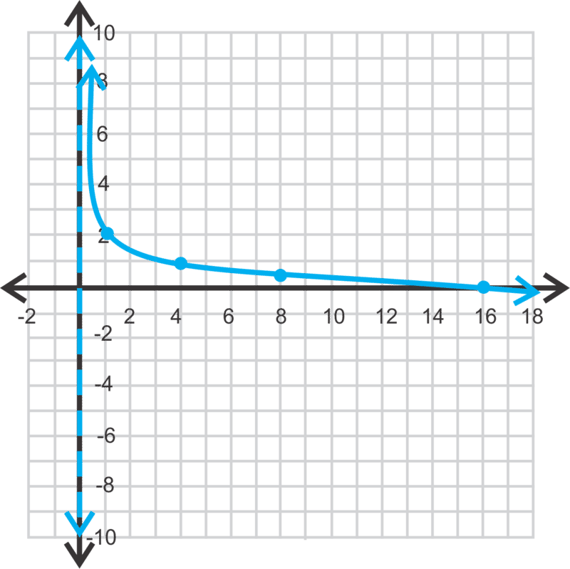

$Y= \frac{\log(x)}{\log \left ( \frac{1}{4} \right )}+2$, GRAPH

To see a table of values, press $2^{nd} \rightarrow$ GRAPH.

2. The keystrokes are $Y=-\log(x)$, GRAPH.

3. Plug (-2, 1) into $f(x)=\log_{\frac{1}{2}} (x+4)$ to see if the equation holds true.

$$
\begin{align*}
1 &= \log_{\frac{1}{2}} (-2+4) \\
1 &= \log_{\frac{1}{2}} 2 \rightarrow \frac{1}{2}^x=2 \\
1 & \ne -1
\end{align*}
$$

Therefore, (-2, 1) is not on the graph. However, (-2, -1) is.

**Problem Set**

Graph the following logarithmic functions without using a calculator. State the equation of the asymptote, the domain and the range of each function.

1.  $y=\log_5 x$
2.  $y=\log_2(x+1)$
3.  $y=\log(x)-4$
4.  $y=\log_{\frac{1}{3}}(x-1)+3$
5.  $y=-\log_{\frac{1}{2}}(x+3)-5$
6.  $y=\log_4(2-x)+2$

Graph the following logarithmic functions using your graphing calculator.

7.  $y=\ln (x+6)-1$
8.  $y=-\ln (x-1)+2$
9.  $y=\ln(1-x)+3$
10. Is (3, 8) on the graph of $y=\log_3 (2x-3)+7$?
11. Is (9, -2) on the graph of $y=\log_{\frac{1}{4}} (x-5)$ ?
12. Is (4, 5) on the graph of $y=5 \log_2 (8-x)$?

</article>

### 8.3 Properties of Logarithms

<article>

**Objective**

To simplify expressions involving logarithms.

**Review Queue**

Simplify the following exponential expressions.

1. $(3x^{\frac{1}{2}})^4$

2. $5x^2y \cdot 8x^{-1} y^6$

3. $\left(\frac{2x^{-1}y^2z^8}{5x^0y^{12}z}\right)^{-1}$

Product and Quotient Properties
-------------------------------

**Objective**

To use and apply the product and quotient properties of logarithms.

**Guidance**

Just like exponents, logarithms have special properties, or shortcuts, that can be applied when simplifying expressions. In this lesson, we will address two of these properties.

**Example A**

Simplify $\log_b x + \log_b y$.

**Solution:** First, notice that these logs have the same base. If they do not, then the properties do not apply.

$\log_b x=m$ and $\log_b y=n$, then $b^m=x$ and $b^n=y$.

Now, multiply the latter two equations together.

$$
\begin{align*}
b^m \cdot b^n &= xy \\
b^{m+n} &= xy
\end{align*}
$$

Recall, that when two exponents with the same base are multiplied, we can add the exponents. Now, reapply the logarithm to this equation.

$b^{m+n}=xy \rightarrow \log_b xy=m+n$

Recall that $m=\log_b x$ and $n=\log_b y$, therefore $\log_b xy=\log_b x + \log_b y$.

This is the **Product Property of Logarithms**.

**Example B**

Expand $\log_{12} 4y$.

**Solution:** Applying the Product Property from Example A, we have:

$\log_{12} 4y = \log_{12} 4 + \log_{12} y$

**Example C**

Simplify $\log_3 15 - \log_3 5$.

**Solution:** As you might expect, the **Quotient Property of Logarithms** is $\log_b \frac{x}{y}=\log_b x - \log_b y$ (proof in the Problem Set). Therefore, the answer is:

$$
\begin{align*}
\log_3 15 - \log_3 5 &= \log_3 \frac{15}{5} \\
&= \log_3 3 \\
&= 1
\end{align*}
$$

**Guided Practice**

Simplify the following expressions.

1. $\log_7 8 + \log_7 x^2 + \log_7 3y$

2. $\log y - \log 20 + \log 8x$

3. $\log_2 32 - \log_2 z$

4. $\log_8 \frac{16x}{y^2}$

**Answers**

1. Combine all the logs together using the Product Property.

$$
\begin{align*}
\log_7 8 + \log_7 x^2 + \log_7 3y &= \log_7 8x^2 3y \\
&= \log_7 24x^2 y
\end{align*}
$$

2. Use both the Product and Quotient Property to condense.

$$
\begin{align*}
\log y - \log 20 + \log 8x &= \log \frac{y}{20} \cdot 8x \\
&= \log \frac{2xy}{5}
\end{align*}
$$

3. Be careful; you do not have to use either rule here, just the definition of a logarithm.

$$
\log_2 32 - \log_2 z=5 - \log_2 z
$$

4. When expanding a log, do the division first and then break the numerator apart further.

$$
\begin{align*}
\log_8 \frac{16x}{y^2} &= \log_8 16x - \log_8 y^2 \\
&= \log_8 16 + \log_8 x-\log_8 y^2 \\
&= \frac{4}{3} + \log_8 x - \log_8 y^2
\end{align*}
$$

To determine $\log_8 16$, use the definition and powers of 2: $8^n=16 \rightarrow 2^{3n}=2^4 \rightarrow 3n = 4 \rightarrow n=\frac{4}{3}$.

**Vocabulary**

__Product Property of Logarithms__

As long as $b \ne 1$, then $\log_b xy=\log_b x + \log_b y$

__Quotient Property of Logarithms__

As long as $b \ne 1$, then $\log_b \frac{x}{y}=\log_b x - \log_b y$

**Problem Set**

Simplify the following logarithmic expressions.

1.  $\log_3 6 + \log_3 y - \log_3 4$
2.  $\log 12 - \log x + \log y^2$
3.  $\log_6 x^2 - \log_6 x - \log_6 y$
4.  $\ln 8 + \ln 6 - \ln 12$
5.  $\ln 7 - \ln 14 + \ln 10$
6.  $\log_{11} 22 + \log_{11} 5 - \log_{11} 55$

Expand the following logarithmic functions.

7.  $\log_3 (abc)$
8.  $\log \left(\frac{a^2}{b}\right)$
9.  $\log_9 \left(\frac{xy}{5}\right)$
10. $\log \left(\frac{2x}{y}\right)$
11. $\log \left(\frac{8x^2}{15}\right)$
12. $\log_4 \left(\frac{5}{9y}\right)$
13. Write an algebraic proof of the quotient property. Start with the expression $\log_a x - \log_a y$ and the equations $\log_a x=m$ and $\log_a y=n$ in your proof. Refer to the proof of the product property in Example A as a guide for your proof.

Power Property of Logarithms
----------------------------

**Objective**

To use the Power Property of logarithms.

**Guidance**

The last property of logs is the **Power Property**.

$\log_b x=y$

Using the definition of a log, we have $b^y=x$. Now, raise both sides to the $n$ power.

$$
\begin{align*}
(b^y)^n &= x^n \\
b^{ny} &= x^n
\end{align*}
$$

Let’s convert this back to a log with base $b$, $\log_b x^n=ny$. Substituting for $y$, we have $\log_b x^n=n \log_b x$.

Therefore, the Power Property says that if there is an exponent within a logarithm, we can pull it out in front of the logarithm.

**Example A**

Expand $\log_6 17x^5$.

**Solution:** To expand this log, we need to use the Product Property and the Power Property.

$$
\begin{align*}
\log_6 17x^5 &= \log_6 17 + \log_6 x^5 \\
&= \log_6 17 + 5\log_6 x
\end{align*}
$$

**Example B**

Expand $\ln \left(\frac{2x}{y^3}\right)^4$.

**Solution:** We will need to use all three properties to expand this example. Because the expression within the natural log is in parenthesis, start with moving the $4^{th}$ power to the front of the log.

$$
\begin{align*}
\ln \left(\frac{2x}{y^3}\right)^4 &= 4 \ln \frac{2x}{y^3} \\
&= 4(\ln 2x - \ln y^3)\\
&= 4(\ln 2 + \ln x - 3 \ln y) \\
&= 4 \ln2 + 4 \ln x - 12 \ln y
\end{align*}
$$

Depending on how your teacher would like your answer, you can evaluate $4\ln2 \approx 2.77$, making the final answer $2.77 + 4\ln x - 12\ln y$.

**Example C**

Condense $\log 9 - 4\log 5 - 4\log x + 2\log 7 + 2\log y$.

**Solution:** This is the opposite of the previous two examples. Start with the Power Property.

$$
\begin{align*}
&\log 9 - 4\log 5 - 4\log x + 2\log7 + 2\log y \\
&\log 9 - \log 5^4 - \log x^4 + \log 7^2 + \log y^2
\end{align*}
$$

Now, start changing things to division and multiplication within one log.

$\log \frac{9 \cdot 7^2 y^2}{5^4 x^4}$

Lastly, combine like terms.

$\log \frac{441 y^2}{625 x^4}$

**Guided Practice**

Expand the following logarithmic expressions.

1. $\ln x^3$

2. $\log_{16} \frac{x^2 y}{32 z^5}$

3. $\log (5c^4)^2$

4. Condense into one log: $\ln 5 - 7 \ln x^4 + 2 \ln y$.

**Answers**

1. The only thing to do here is apply the Power Property: $3 \ln x$.

2. Let’s start with using the Quotient Property.

$$
\log_{16} \frac{x^2 y}{32 z^5} = \log_{16} x^2y - \log_{16} 32z^5
$$

Now, apply the Product Property, followed by the Power Property.

$$
\begin{align*}
&= \log_{16}x^2 + \log_{16} y - \left(\log_{16} 32 + \log_{16} z^5 \right) \\
&= 2 \log_{16} x + \log_{16} y - \frac{5}{4} -5 \log_{16}z
\end{align*}
$$

Simplify $\log_{16} 32 \rightarrow 16^n = 32 \rightarrow 2^{4n} = 2^5$ and solve for $n$. Also, notice that we put parenthesis around the second log once it was expanded to ensure that the $z^5$ would also be subtracted (because it was in the denominator of the original expression).

3. For this problem, you will need to apply the Power Property twice.

$$
\begin{align*}
\log (5c^4)^2 &= 2 \log 5c^4 \\
&= 2(\log 5 + \log c^4) \\
&= 2(\log 5 + 4 \log c) \\
&= 2 \log 5 + 8 \log c
\end{align*}
$$

**Important Note:** You can write this particular log several different ways. Equivalent logs are: $\log 25 + 8 \log c, \log 25 + \log c^8$ and $\log 25c^8$. Because of these properties, there are several different ways to write one logarithm.

4. To condense this expression into one log, you will need to use all three properties.

$$
\begin{align*}
\ln 5 - 7 \ln x^4 + 2 \ln y &= \ln 5 - \ln x^{28} + \ln y^2 \\
&= \ln \frac{5 y^2}{x^{28}}
\end{align*}
$$

**Important Note:** If the problem was $\ln 5 - (7 \ln x^4 + 2 \ln y)$, then the answer would have been $\ln \frac{5}{x^{28}y^2}$. But, because there are no parentheses, the $y^2$ is in the numerator.

**Vocabulary**

__Power Property__

As long as $b \ne 1$, then $\log_b x^n = n \log_b x$.

**Problem Set**

Expand the following logarithmic expressions.

1.  $\log_4 (9x)^3$
2.  $\log \left(\frac{3x}{y}\right)^2$
3.  $\log_8 \frac{x^3 y^2}{z^4}$
4.  $\log_5 \left(\frac{25x^4}{y}\right)^2$
5.  $\ln \left(\frac{6x}{y^3}\right)^{-2}$
6.  $\ln \left(\frac{e^5 x^{-2}}{y^3}\right)^6$

Condense the following logarithmic expressions.

7.  $2 \log_6 x + 5 \log_6 y$
8.  $3(\log x - \log y)$
9.  $\frac{1}{2} \log(x+1) - 3 \log y$
10. $4 \log_2 y + \frac{1}{3} \log_2 x^3$
11. $\frac{1}{5} \left[10 \log_2 (x-3) + \log_2 32 - \log_2 y \right]$
12. $4 \left[\frac{1}{2} \log_3 y - \frac{1}{3} \log_3 x - \log_3 z \right]$

</article>

### 8.4 Solving Exponential and Logarithmic Equations

<article>

**Objective**

To solve exponential and logarithmic equations.

**Review Queue**

Solve the following equations.

1. $2^x=32$

2. $x^2-9x+20=0$

3. $\sqrt{x-5}+3=11$

4. $8^x=128$

Solving Exponential Equations
-----------------------------

**Objective**

To learn how to solve exponential equations.

**Guidance**

Until now, we have only solved pretty basic exponential equations, like #1 in the Review Queue above. We know that $x=5$, because $2^5=32$. Ones like #4 are a little more challenging, but if we put everything into a power of 2, we can set the exponents equal to each other and solve.

$$
\begin{align*}
8^x &= 128 \\
2^{3x} &= 2^7 \\
3x &= 7 \qquad \quad \text{So }, 8^{\frac{7}{3}} = 128. \\
x &= \frac{7}{3}
\end{align*}
$$

But, what happens when the power is not easily found? We must use logarithms, followed by the Power Property to solve for the exponent.

**Example A**

Solve $6^x=49$. Round your answer to the nearest three decimal places.

**Solution:** To solve this exponential equation, let’s take the logarithm of both sides. The easiest logs to use are either $\ln$ (the natural log), or log (log, base 10). We will use the natural log.

$$
\begin{align*}
6^x &= 49 \\
\ln 6^x &= \ln 49 \\
x \ln 6 &= \ln 49 \\
x &= \frac{\ln 49}{\ln 6} \approx 2.172
\end{align*}
$$

**Example B**

Solve $10^{x-3}=100^{3x+11}$.

**Solution:** Change 100 into a power of 10.

$$
\begin{align*}
10^{x-3} &= 10^{2(3x+11)} \\
x-3 &= 6x+22 \\
-25 &= 5x \\
-5 &= x
\end{align*}
$$

**Example C**

Solve $8^{2x-3}-4=5$.

**Solution:** Add 4 to both sides and then take the log of both sides.

$$
\begin{align*}
8^{2x-3}-4 &= 5 \\
8^{2x-3} &= 9 \\
\log 8^{2x-3} &= \log 9 \\
(2x-3)\log 8 &= \log 9 \\
2x-3 &= \frac{\log 9}{\log 8} \\
2x &= 3 + \frac{\log 9}{\log 8} \\
x &= \frac{3}{2}+\frac{\log 9}{2 \log 8} \approx 2.56
\end{align*}
$$

Notice that we did not find the numeric value of $\log9$ or $\log8$ until the very end. This will ensure that we have the most accurate answer.

**Guided Practice**

Solve the following exponential equations.

1. $4^{x-8}=16$

2. $2(7)^{3x+1} =48$

3. $\frac{2}{3} \cdot 5^{x+2}+9=21$

**Answers**

1. Change 16 to $4^2$ and set the exponents equal to each other.

$$
\begin{align*}
4^{x-8} &= 16 \\
4^{x-8} &= 4^2 \\
x-8 &= 2 \\
x &=10
\end{align*}
$$

2. Divide both sides by 2 and then take the log of both sides.

$$
\begin{align*}
2(7)^{3x+1} &= 48 \\
7^{3x+1} &= 24 \\
\ln 7^{3x+1} &= \ln 24 \\
(3x+1)\ln 7 &= \ln 24 \\
3x+1 &= \frac{\ln 24}{\ln 7} \\
3x &= -1 + \frac{\ln 24}{\ln 7} \\
x &= -\frac{1}{3} + \frac{\ln 24}{3 \ln 7} \approx 0.211
\end{align*}
$$

3. Subtract 9 from both sides and multiply both sides by $\frac{3}{2}$. Then, take the log of both sides.

$$
\begin{align*}
\frac{2}{3} \cdot 5^{x+2}+9 &= 21 \\
\frac{2}{3} \cdot 5^{x+2} &= 12 \\
5^{x+2} &= 18 \\
(x+2)\log 5 &= \log 18 \\
x &= \frac{\log 18}{\log 5}-2 \approx -0.204
\end{align*}
$$

**Problem Set**

Use logarithms and a calculator to solve the following equations for $x$. Round answers to three decimal places.

1.  $5^x = 65$
2.  $2^x = 90$
3.  $6^{x+1}+3=13$
4.  $6(11^{3x-2})=216$
5.  $8+13^{2x-5}=35$
6.  $\frac{1}{2} \cdot 7^{x-3}-5=14$

Solve the following exponential equations without a calculator.

7.  $4^x=8$
8.  $5^{2x+1}=125$
9.  $9^3=3^{4x-6}$
10. $7(2^{x-3})=56$
11. $16^x \cdot 4^{x+1}=32^{x+1}$
12. $3^{3x+5}=3 \cdot 9^{x+3}$

Solving Logarithmic Equations
-----------------------------

**Objective**

To solve a logarithmic equation with any base.

**Guidance**

A logarithmic equation has the variable within the log. To solve a logarithmic equation, you will need to use the inverse property, $b^{\log_b x}=x$, to cancel out the log.

**Example A**

Solve $\log_2(x+5)=9$.

**Solution:** There are two different ways to solve this equation. The first is to use the definition of a logarithm.

$$
\begin{align*}
\log_2(x+5) &= 9 \\
2^9 &= x+5 \\
512 &= x+5 \\
507 &= x
\end{align*}
$$

The second way to solve this equation is to put everything into the exponent of a 2, and then use the inverse property.

$$
\begin{align*}
2^{\log_2(x+5)} &= 2^9 \\
x+5 &= 512 \\
x &= 507
\end{align*}
$$

Make sure to check your answers for logarithmic equations. There can be times when you get an extraneous solution. $\log_2(507+5)=9 \rightarrow \log_2 512=9 \ \boxed{\checkmark}$

**Example B**

Solve $3 \ln(-x)-5=10$.

**Solution:** First, add 5 to both sides and then divide by 3 to isolate the natural log.

$$
\begin{align*}
3 \ln(-x)-5 &= 10 \\
3 \ln(-x) &= 15 \\
\ln(-x)&= 5
\end{align*}
$$

Recall that the inverse of the natural log is the natural number. Therefore, everything needs to be put into the exponent of $e$ in order to get rid of the log.

$$
\begin{align*}
e^{\ln(-x)} &= e^5 \\
-x &= e^5 \\
x &= -e^5 \approx -148.41
\end{align*}
$$

Checking the answer, we have $3 \ln(-(-e^5))-5=10 \rightarrow 3\ln e^5 -5 =10 \rightarrow 3 \cdot 5-5=10 \ \boxed{\checkmark}$

**Example C**

Solve $\log 5x + \log(x-1)=2$

**Solution:** Condense the left-hand side using the Product Property.

$$
\log 5x + \log (x-1)=2 \\
\log [5x(x-1)]=2 \\
\log (5x^2-5x)=2
$$

Now, put everything in the exponent of 10 and solve for $x$.

$$
\begin{align*}
10^{\log(5x^2-5x)} &= 10^2 \\
5x^2 - 5x &= 100 \\
x^2-x-20 &= 0 \\
(x-5)(x+4) &= 0 \\
x &=5, -4
\end{align*}
$$

Now, check both answers.

$$
\begin{align*}
\log 5(5) + \log(5-1) &= 2 \qquad \qquad \log5(-4) + \log((-4)-1)= 2 \\
\log 25 + \log 4 &= 2 \ \boxed{\checkmark} \qquad \qquad \quad \ \log(-20) + \log(-5) = 2 \ \boxed{\times} \\
\log 100 &= 2
\end{align*}
$$

\-4 is an extraneous solution. In the step $\log(-20) + \log(-5)=2$, we cannot take the log of a negative number, therefore -4 is not a solution. 5 is the only solution.

**Guided Practice**

Solve the following logarithmic equations.

1. $9 + 2 \log_3 x=23$

2. $\ln (x-1)-\ln(x+1)=8$

3. $\frac{1}{2}\log_5(2x+5)=5$

**Answers**

1. Isolate the log and put everything in the exponent of 3.

$$
\begin{align*}
9 + 2 \log_3 x &= 23 && 9 + 2 \log_3 2187 = 23 \\
2 \log_3 x &= 14 && 9 + 2 \cdot 7 = 23 \ \boxed{\checkmark} \\
\log_3 x &= 7 && 9+14=23 \\
x &= 3^7=2187
\end{align*}
$$

2. Condense the left-hand side using the Quotient Rule and put everything in the exponent of $e$.

$$
\begin{align*}
\ln(x-1) - \ln(x+1) &=8 \\
\ln \left(\frac{x-1}{x+1}\right) &= 8 \\
\frac{x-1}{x+1} &= \ln 8 \\
x-1 &=(x+1) \ln 8 \\
x-1 &= x \ln 8 + \ln 8 \\
x-x \ln 8 &= 1 + \ln 8 \\
x(1- \ln 8) &= 1 + \ln 8 \\
x &= \frac{1+ \ln 8}{1- \ln 8} \approx -2.85
\end{align*}
$$

Checking our answer, we get $\ln (-2.85-1) - \ln (2.85+1)=8$, which does not work because the first natural log is of a negative number. Therefore, there is no solution for this equation.

3. Multiply both sides by 2 and put everything in the exponent of a 5.

$$
\begin{align*}
\frac{1}{2} \log_5(2x+5)&= 2 \\
\log_5(2x+5)&=4 \qquad \qquad \qquad \qquad \ \frac{1}{2}\log_5(2 \cdot 310+5)=2 \\
2x+5 &= 625 \qquad \qquad \text{Check}: \qquad \quad \ \frac{1}{2}\log_5 625=2 \ \boxed{\checkmark} \\
2x &=620 \qquad \qquad \qquad \qquad \qquad \qquad \quad \frac{1}{2} \cdot 4 =2 \\
x &= 310
\end{align*}
$$

**Problem Set**

Use properties of logarithms and a calculator to solve the following equations for $x$. Round answers to three decimal places and check for extraneous solutions.

1.  $\log_7(2x+3)=3$
2.  $8 \ln(3-x)=5$
3.  $4 \log_3 3x-\log_3 x=5$
4.  $\log(x+5) + \log x = \log 14$
5.  $2 \ln x - \ln x =0$
6.  $3 \log_3(x-5) = 3$
7.  $\frac{2}{3} \log_3 x=2$
8.  $5 \log \frac{x}{2} -3 \log \frac{1}{x} = \log 8$
9.  $2 \ln x^{e+2} - \ln x=10$
10. $2 \log_6 x+1 = \log_6(5x+4)$
11. $2 \log_{\frac{1}{2}}x+2=\log_{\frac{1}{2}}(x+10)$
12. $3 \log_{\frac{2}{3}} x-\log_{\frac{2}{3}} 27 = \log_{\frac{2}{3}}8$

</article>

## 9.0 Rational Functions

<article>

This chapter deals with functions that have the variable in the denominator of a fraction. First, we will discuss the concept of variation and how that relates to a rational function. Next, we will graph several different types of rational functions followed by multiplying, dividing, adding, and subtracting rational expressions. Lastly, we will solve rational equations.

</article>

### 9.1 Direct, Inverse, and Joint Variation

<article>

**Objective**

To determine if a set of data is related directly, indirectly, or jointly.

**Review Queue**

1. Find the equation of the line that passes through the origin and $(-4, -2)$.

2. Find the equation of the line that passes through the origin and $(-1, 3)$.

3. Find the equation of the line that passes through $(-3, 5)$ and $(3, 1)$.

Direct Variation
----------------

**Objective**

To determine if a set of data is related directly.

**Guidance**

We say that a set of data is related **directly** if the independent and dependent variables both grow large or small together. For example, the equation of the line $y=2x$ would represent a direct variation relationship. As $x$ gets bigger, so would $y$. In fact, direct variation equation is $y=kx, k \neq 0,$ which looks just like the equation of a line without a $y$\-intercept. We call $k$ the **constant of variation** and $y$ is said to vary directly with $x$. $k$ can also be written $k=\frac{y}{x}$.

**Example A**

The variables $x$ and $y$ vary directly, and $y = 10$ when $x = 2$. Write an equation that relates $x$ and $y$ and find $y$ when $x = 9$.

**Solution:** Using the direct variation equation, we can substitute in $x$ and $y$ and solve for $k$.

$$
\begin{align*}
y &= kx \\
10 &= k(2) \\
5 &= k
\end{align*}
$$

Therefore, the equation is $y=5x$. To find $y$ when $x$ is 9, we have $y=5 \cdot 9=45$.

**Example B**

Determine if the set of data varies directly. If so, find the direct variation equation.

| $x$ | 4   | 8   | 16  | 20  |
| --- | --- | --- | --- | --- |
| $y$ | 1   | 2   | 4   | 5   |

**Solution:** Looking at the set of data, the $x$ values increase. For the data to vary directly, the $y$ values would also have to increase, and they do. To find the equation, use the first point and find $k$.

$$
\begin{align*}
y &= kx\\
1 &= k(4)\\
\frac{1}{4} &= k
\end{align*}
$$

So, the equation for the first point is $y=\frac{1}{4}x$. Plug each point into the equation to make sure it works.

$2= \frac{1}{4}(8)\ \boxed{\checkmark} \qquad 4= \frac{1}{4}(16) \ \boxed{\checkmark} \qquad 5= \frac{1}{4}(20) \ \boxed{\checkmark}$

**Example C**

The number of calories, $C$, a person burns working out varies directly with length of time it was done, $t$ (in minutes). A 150 pound person can burn 207 calories swimming laps for 30 minutes. Write a variation model for $C$ as a function of $t$. Then, determine how long it will take that person to burn 520 calories.

**Solution:** Plug in what you know to the direct variation model and solve for $k$.

$$
\begin{align*}
C&=kt \\
207&=k(30) && \text{The model for a} \ 150\text{-pound person is} \ C=6.9 t. \\
6.9&=k
\end{align*}
$$

To find how long it will take to this person to burn 520 calories, solve for $t$.

$$
\begin{align*}
520&=6.9 t && \text{It will take} \ 75.4 \ \text{minutes to burn} \ 520 \ \text{calories}.\\
75.4&=t
\end{align*}
$$

**Guided Practice**

1. $x$ and $y$ vary directly. When $x=-8, y=-6$. Find the equation and determine $x$ when $y=12$.

2. Determine if the set below varies directly.

| $x$ | 1   | 2   | 3   | 4   | 5   |
| --- | --- | --- | --- | --- | --- |
| $y$ | 2   | 4   | 8   | 16  | 20  |

3. Taylor’s income varies directly with the number of hours he works. If he worked 60 hours last week and made $900, how much does he make per hour? Set up a direct variation equation.

**Answers**

1. First, solve for $k$.

$k=\frac{y}{x}=\frac{-6}{-8}=\frac{3}{4} \rightarrow y=\frac{3}{4}x$

Now, substitute in 12 for $y$ and solve for $x$.

$$
\begin{align*}
12&=\frac{3}{4}x \\
\frac{4}{3} \cdot 12&=x \\
16&=x \\
\end{align*}
$$

2. At first glance, it looks like both values increase together. Let’s check to see if $k$ is the same for each set of points.

$k=\frac{y}{x}=\frac{2}{1}=\frac{4}{2} \ne \frac{8}{3}$

At this point, we can stop because the point $(3, 8)$ does not have the same ratio as the first two points. Therefore, this set of data does not vary directly.

3. We want to find Taylor’s hourly wage, which is the constant of variation.

$k=\frac{900}{60}=15$, he makes $15/hour. The equation would be $y=15x$.

**Vocabulary**

__Direct Variation__

When the dependent variable grows large or small as the independent variable does.

__Constant of Variation__

The rate of which the dependent variable grows, $k$, in $y=kx$.

**Problem Set**

For problems 1-3, use the given $x$ and $y$ values to write a direct variation equation and find $y$ given that $x =12$.

1.  $x=3,y=15$
2.  $x=9,y=-3$
3.  $x=\frac{1}{2},y=\frac{1}{3}$

For problems 4-6, use the given $x$ and $y$ values to write a direct variation equation and find $x$ given that $y=2$.

4.  $x=5,y=4$
5.  $x=18,y=3$
6.  $x=7,y=-28$

Determine if the following data sets vary directly.

7.  .

| $x$ | 12  | 16  | 5   | 20  |
| --- | --- | --- | --- | --- |
| $y$ | 3   | 4   | 1   | 5   |

8.  .

| $x$ | 2   | 10  | 5   | 6   |
| --- | --- | --- | --- | --- |
| $y$ | 14  | 70  | 35  | 42  |

Solve the following word problems using a direct variation equation.

9.  Based on her weight and pace, Kate burns 586 calories when she runs 5 miles. How many calories will she burn if she runs only 3 miles? How many miles (to the nearest mile) does she need to run each week if she wants to burn one pound (3500 calories) of body fat each week?
10. One a road trip, Mark and Bill cover 450 miles in 8 hours, including stops. If they maintain the same pace, how far (to the nearest mile) will they be from their starting point after 15 hours of driving?
11. About three hours into a fundraising car wash, the Mathletes Club earned $240 washing 48 cars. How much was charged for each carwash? How many more cars will they have to wash to reach their goal of earning $400?
12. Dorothy earned $900 last week for working 36 hours. What is her hourly wage? If she works full time (40 hours) in a week how much will she make?

Inverse Variation
-----------------

**Objective**

To determine if a set of data is related indirectly.

**Guidance**

We say that a set of data is related **inversely** if the independent increases and dependent variables decreases or vice versa. For example, the further away from an object that you are, the smaller it appears. In inverse variation, the variables are related inversely. As $x$ gets bigger, $y$ would get smaller. The inverse variation equation is $y=\frac{k}{x};k,x \ne 0$. We still call $k$ the **constant of variation** and $y$ is said to vary inversely with $x$. $k$ can also be written $k=xy$.

**Example A**

The variables $x$ and $y$ vary inversely, and $y=7$ when $x=2$. Write an equation that relates $x$ and $y$ and find $y$ when $x=-6$.

**Solution:** Using the inverse variation equation, we can substitute in $x$ and $y$ and solve for $k$.

$$
\begin{align*}
k&=yx \\
k&=7 \cdot 2 \\
k&=14
\end{align*}
$$

Therefore, the equation is $y=\frac{14}{x}$. To find $y$ when $x$ is -6, we have $y=\frac{14}{-6}=- \frac{7}{3}$.

**Example B**

Determine if the set of data varies directly, inversely, or neither. Find the equation if possible.

| $x$ | 1   | 2   | 3   | 4   |
| --- | --- | --- | --- | --- |
| $y$ | 12  | 6   | 4   | 3   |

**Solution:** Looking at the set of data, the $x$ values increase. For the data to vary directly, the $y$ values would also have to increase, and they do not. So, it could be an inverse relationship. Let’s see if $k$ is the same for every set of points.

$$
\begin{align*}
k&=1 \cdot 12=12 \\
k&=2 \cdot 6 \ =12 \\
k&=3 \cdot 4 \ =12 \\
k&=4 \cdot 3 \ =12
\end{align*}
$$

So, for each set of points, $k = 12$. Therefore, the equation is $y=\frac{12}{x}$. If $k$ is not the same, then the answer would have been neither.

**Example C**

Sherry is driving from San Francisco to Los Angeles (380 miles). How long does it take her if she drives 65 miles per hour (the speed limit)? How fast does she have to drive to get to LA in five and a half hours?

**Solution:** The faster Sherry drives, the less time it will take her to get to LA. Therefore, this is an inverse relationship. $y$ is the time driving, $k$ is the 380 miles between LA and San Francisco and $x$ is the speed.

$y=\frac{380}{x}$

So, it is going to take her $y=\frac{380}{65} \approx 5.85 \ hours$, which is 5 hours and 51 minutes. For her to get there in 5.5 hours, she would have to drive $5.5=\frac{380}{x} \rightarrow 5.5x=380 \rightarrow x=69.1 \ miles \ per \ hour$.

**Guided Practice**

1. $x$ and $y$ vary inversely. When $x = 3, y = -5$. Find the equation and determine $x$ when $y = 12$.

2. Determine if the set below varies directly or inversely.

| $x$ | 1   | 2   | 3   | 4   | 5   |
| --- | --- | --- | --- | --- | --- |
| $y$ | 2   | 6   | 12  | 24  | 36  |

3. It takes one worker 12 hours to complete a specific job. If two workers do the same job, it takes them 6 hours to finish the job. What type of relationship is this? How long would it take 6 workers to do the same job?

**Answers**

1. First, solve for $k$.

$$
\begin{align*}
k=xy \rightarrow 3 \cdot -5&=-15 \\
y&=- \frac{15}{x}
\end{align*}
$$

Now, substitute in 12 for $y$ and solve for $x$.

$$
\begin{align*}
12&=- \frac{15}{x} \\
12x&=-15 \\
x&=- \frac{5}{4}
\end{align*}
$$

2. At first glance, it looks like both values increase together, so we know the set does not vary inversely. Let’s check for direct variation by determining if $k$ is the same for each set of points.

$k=xy=2 \ne 3 \ne 4 \ldots$

None of these points have the same ratio; therefore the data set does not vary inversely or directly.

3. This is an inverse relationship because as the number of workers goes up, the number of hours it takes to complete the job goes down. $k=12 \cdot 1=2 \cdot 6=12$ and the inverse variation equation is $y=\frac{12}{x}$. For 6 workers to complete the job, it would take $y=\frac{12}{6}=2 \ hours$.

**Vocabulary**

__Inverse Variation__

When the dependent variable grows large or small and the independent variable does the opposite.

**Problem Set**

For problems 1-3, the variable $x$ and $y$ vary inversely. Use the given $x$ and $y$ values to write an inverse variation equation and find $y$ given that $x =15$.

1.  $x=4,y=3$
2.  $x=\frac{1}{5},y=10$
3.  $x=8,y=\frac{3}{4}$

For problems 4-6, the variable $x$ and $y$ vary inversely. Use the given $x$ and $y$ values to write an inverse variation equation and find $x$ given that $y = 2$.

4.  $x=6,y=\frac{2}{3}$
5.  $x=16,y=\frac{3}{8}$
6.  $x=\frac{4}{5},y=9$

Determine if the following data sets vary inversely.

7.  .

| $x$ | 12  | 6   | 9   | 2   |
| --- | --- | --- | --- | --- |
| $y$ | 3   | 6   | 4   | 18  |

8.  .

| $x$ | 4   | 7   | 2   | 8   |
| --- | --- | --- | --- | --- |
| $y$ | 10  | 6   | 20  | 5   |

Solve the following word problems using an inverse variation equation.

9.  At a party there are 3 pizzas to share. If each pizza has 8 slices, determine how many pieces each child will receive if 12 kids attend the party. What if 8 children attend? Write an inverse variation equation to determine how many slices each child receives if there are $x$ kids at the party.
10. When Lionel drives from Barcelona to Madrid, 390 miles, it takes him about 6.5 hours. How fast will he have to drive in order to make the trip in 5 hours?
11. Alena and Estella can complete a job in 18 hours when they work together. If they invite Tommy to help, how long will the job take? How many friends need to work together on the job to complete it in 4 hours?
12. The temperature of the Pacific Ocean varies inversely with the depth. If the temperature at 2000 m is 2.2 degrees Celsius, what is the temperature at a depth of 4000 m?

Joint Variation
---------------

**Objective**

To define and use joint variation.

**Guidance**

The last type of variation is called **joint variation**. This type of variation involves three variables, usually $x, y$ and $z$. For example, in geometry, the volume of a cylinder varies jointly with the square of the radius and the height. In this equation the constant of variation is $\pi$, so we have $V= \pi r^2h$. In general, the joint variation equation is $z=kxy$. Solving for $k$, we also have $k=\frac{z}{xy}$.

**Example A**

Write an equation for the given relationships.

a) $y$ varies inversely with the square of $x$.

b) $z$ varies jointly with $x$ and the square root of $y$.

c) $z$ varies directly with $x$ and inversely with $y$.

**Solution:**

a) $y=\frac{k}{x^2}$

b) $z=kx \sqrt{y}$

c) $z=\frac{kx}{y}$

**Example B**

$z$ varies jointly with $x$ and $y$. If $x = 3, y = 8,$ and $z = 6$, find the variation equation. Then, find $z$ when $x = -2$ and $y = 10$.

**Solution:** Using the equation when it is solved for $k$, we have:

$k=\frac{z}{xy}=\frac{6}{3 \cdot 8}=\frac{1}{4}$, so the equation is $z=\frac{1}{4}xy$.

When $x = -2$ and $y = 10$, then $z=\frac{1}{4} \cdot -2 \cdot 10=-5$.

**Example C**

**Geometry Connection** The volume of a pyramid varies jointly with the area of the base and the height with a constant of variation of $\frac{1}{3}$. If the volume is $162 \ units^3$ and the area of the base is $81 \ units^2$, find the height.

**Solution:** Find the joint variation equation first.

$V=\frac{1}{3} \ Bh$

Now, substitute in what you know to solve for the height.

$$
\begin{align*}
162&=\frac{1}{3} \cdot 81 \cdot h \\
162&=27 \ h \\
6&=h
\end{align*}
$$

**Guided Practice**

1. Write the equation for $z$, that varies jointly with $x$ and the cube of $y$ and inversely with the square root of $w$.

2. $z$ varies jointly with $y$ and $x$. If $x = 25, z = 10,$ and $k=\frac{1}{5}$. Find $y$.

3. Kinetic energy $P$ (the energy something possesses due to being in motion) varies jointly with the mass $m$ (in kilograms) of that object and the square of the velocity $v$ (in meters per seconds). The constant of variation is $\frac{1}{2}$.

a) Write the equation for kinetic energy.

b) If a car is travelling 104 km/hr and weighs 8800 kg, what is its kinetic energy?

**Answers**

1. $z=\frac{kxy^3}{\sqrt{w}}$

2. The equation would be $z=\frac{1}{5}xy$. Solving for $y$, we have:

$$
\begin{align*}
10&=\frac{1}{5} \cdot 25 \cdot y \\
10&=5y \\
2&=y
\end{align*}
$$

3. a) $P=\frac{1}{2} \ mv^2$

b) The second portion of this problem isn’t so easy because we have to convert the km/hr into meters per second.

$\frac{104 \ \bcancel{km}}{\cancel{hr}} \cdot \frac{\cancel{hr}}{3600 \ s} \cdot \frac{1000 \ m}{\bcancel{km}}=0.44 \ \frac{m}{s}$

Now, plug this into the equation from part a.

$$
\begin{align*}
P&=\frac{1}{2} \cdot 8800 \ kg \cdot \left(0.44 \ \frac{m}{s}\right)^2 \\
&=1955.56 \ \frac{kg \cdot m^2}{s^2}
\end{align*}
$$

Typically, the unit of measurement of kinetic energy is called a joule. A joule is $\frac{kg \cdot m^2}{s^2}$.

**Vocabulary**

__Joint Variation__

Variation where one variable depends upon two independent variables.

**Problem Set**

For questions 1-4, write an equation that represents relationship between the variables.

1.  $w$ varies inversely with respect to $x$ and $y$.
2.  $r$ varies inversely with the square of $q$.
3.  $z$ varies jointly with $x$ and $y$ and inversely with $w$.
4.  $a$ varies directly with $b$ and inversely with $c$ and the square root of $d$.

Write the variation equation and answer the questions in problems 5-10.

5.  $z$ varies jointly with $x$ and $y$. If $x=2,y=3$ and $z=4$, write the variation equation and find $z$ when $x=-6$ and $y=2$.
6.  $z$ varies jointly with $x$ and $y$. If $x=5,y=-1$ and $z=10$, write the variation equation and find $z$ when $x=- \frac{1}{2}$ and $y=7$.
7.  $z$ varies jointly with $x$ and $y$. If $x=7,y=3$ and $z=-14$, write the variation equation and find $y$ when $z=-8$ and $x=3$.
8.  $z$ varies jointly with $x$ and $y$. If $x=8,y=-3$ and $z=-6$, write the variation equation and find $x$ when $z=12$ and $y=-16$.

Solve the following word problems using a variation equation.

9.  If 20 volunteers can wash 100 cars in 2.5 hours, find the constant of variation and find out how many cars 30 volunteers can wash in 3 hours.
10. If 10 students from the environmental club can clean up trash on a 2 mile stretch of road in 1 hour, find the constant of variation and determine how low it will take to clean the same stretch of road if only 8 students show up to help.
11. The work $W$ (in joules) done when lifting an object varies jointly with the mass $m$ (in kilograms) of the object and the height $h$ (in meters) that the object is lifted. The work done when a 100 kilogram object is lifted 1.5 meters is 1470 joules. Write an equation that relates $W, m,$ and $h$. How much work is done when lifting a 150 kilogram object 2 meters?
12. The intensity $I$ of a sound (in watts per square meter) varies inversely with the square of the distance $d$ (in meters) from the sound’s source. At a distance of 1.5 meters from the stage, the intensity of the sound at a rock concert is about 9 watts per square meter. Write an equation relating $I$ and $d$. If you are sitting 10 meters back from the stage, what is the intensity of the sound you hear?

</article>

### 9.2 Graphing Rational Functions

<article>

**Objective**

To graph several different types of rational functions and identify the critical values.

**Review Queue**

Graph the following functions.

1. $y=2x-3$

2. $y=x^2-2x-15$

3. $y=-2x^2-x+15$

Graphing $f(x)=\frac{1}{x-h}+k$
-------------------------------

**Objective**

To graph basic rational functions.

**Guidance**

A **rational function** is in the form $\frac{p \left(x\right)}{q \left(x\right)}$ where $p(x)$ and $q(x)$ are polynomials and $q(x) \ne 0$. The parent graph for rational functions is $y=\frac{1}{x}$, and the shape is called a **hyperbola**.

| --- | --- |
| $-4$ | $- \frac{1}{4}$ |
| $-2$ | $- \frac{1}{2}$ |
| $-1$ | $-1$ |
| $- \frac{1}{2}$ | $-2$ |

| **$x$** | **$y$** |
| --- | --- |
| 4   | $\frac{1}{4}$ |
| 2   | $\frac{1}{2}$ |
| 1   | 1   |
| $\frac{1}{2}$ | 2   |

Notice the following properties of this hyperbola: the $x$\-axis is a horizontal asymptote, the $y$\-axis is a vertical asymptote, and the domain and range are all real numbers except where the asymptotes are. Recall that the vertical asymptote is the value that makes the denominator zero because we cannot divide by zero. For the horizontal asymptote, it is the value where the range is not defined.

The two parts of the graph are called **branches**. In the case with a hyperbola, the branches are always symmetrical about the point where the asymptotes intersect. In this example, they are symmetrical about the origin.

In this lesson, all the rational functions will have the form $f(x)=\frac{a}{x-h}+k$.

**Example A**

Graph $f(x)=\frac{-2}{x}$. Find any asymptotes, the domain, range, and any zeros.

**Solution:** Let’s make a table of values.

| **$x$** | **$y$** |
| --- | --- |
| 1   | $-2$ |
| 2   | $-1$ |
| 4   | $- \frac{1}{2}$ |

Notice that these branches are in the second and fourth quadrants. This is because of the negative sign in front of the 2, or $a$. The horizontal and vertical asymptotes are still the $x$ and $y$\-axes. There are no zeros, or $x$\-intercepts, because the $x$\-axis is an asymptote. The domain and range are all non-zero real numbers (all real numbers except zero).

Graph $y=\frac{1}{x-5}+2$. Find all asymptotes, zeros, the domain and range.

**Solution:** For $y=\frac{1}{x-5}+2$, the vertical asymptote is $x = 5$ because that would make the denominator zero and we cannot divide by zero. When $x = 5$, the value of the function would be $y=\frac{1}{0}+2$, making the range undefined at $y = 2$. The shape and location of the branches are the same as the parent graph, just shifted to the right 5 units and up 2 units.

The domain is all real numbers; $x \ne 5$ and the range is all real numbers; $y \ne 2$. To find the zero, set the function equal to zero and solve for $x$.

$$
\begin{align*}
0&=\frac{1}{x-5}+2 \\
-2&=\frac{1}{x-5} \\
-2x+10&=1 \\
-2x&=-9 \\
x&=\frac{9}{2}=4.5
\end{align*}
$$

To find the $y$\-intercept, set $x = 0$, and solve for $y$. $y=\frac{1}{0-5}+2=- \frac{1}{5}+2=1 \frac{4}{5}$.

**Example C**

Find the equation of the hyperbola below.

**Solution:** We know that the numerator will be negative because the branches of this hyperbola are in the second and fourth quadrants. The asymptotes are $x = -3$ and $y = -4$. So far, we know $y=\frac{a}{x+3}-4$. In order to determine $a$, we can use the given $x$\-intercept.

\begin{align*}
0&=\frac{a}{-3.75+3}-4 \\
4&=\frac{a}{-0.75} && \text{The equation is} \ y=\frac{-3}{x+3}-4 \\
-3&=a
\end{align*}
$$

**Guided Practice**

1. What are the asymptotes for $f(x)=\frac{-1}{x+6}+9$? Is $(-5, -8)$ on the graph?

Graph the following rational functions. Find the zero, $y$\-intercept, asymptotes, domain and range.

2. $y=\frac{4}{x}-2$

3. $y=\frac{2}{x-1}+3$

4. Determine the equation of the hyperbola.

1. The asymptotes are $x = -6$ and $y = 9$. To see if the point $(-5, -8)$ is on the graph, substitute it in for $x$ and $y$.

$$
\begin{align*}
-8&=\frac{-1}{-5+6}+9 && -8 \ne 8, \ \text{therefore, the point} \ (-5, -8) \ \text{is not on the graph}. \\
-8&=-1+9
\end{align*}
$$

2. There is no $y$\-intercept because the $y$\-axis is an asymptote. The other asymptote is $y = -2$. The domain is all real numbers; $x \ne 0$. The range is all real numbers; $y \ne -2$. The zero is:

\begin{align*}
0&=\frac{4}{x}-2 \\
2&=\frac{4}{x} \\
2x&=4 \\
x&=2
\end{align*}
$$

3. The asymptotes are $x = 1$ and $y = 3$. Therefore, the domain is all real numbers except 1 and the range is all real numbers except 3. The $y$\-intercept is $y=\frac{2}{0-1}+3=-2+3=1$ and the zero is:

\begin{align*}
0&=\frac{2}{x-1}+3 \\
-3&=\frac{2}{x-1} \\
-3x+3&=2 \\
-3x&=-1 \rightarrow x=\frac{1}{3}
\end{align*}
$$

4. The asymptotes are $x = -1, y = 3,$ making the equation $y=\frac{a}{x+1}+3$. Taking the $y$\-intercept, we can solve for $a$.

$$
\begin{align*}
4&=\frac{a}{0+1}+3 && \text{The equation is} \ y=\frac{1}{x+1}+3. \\
1&=a
\end{align*}
$$

**Vocabulary**

__Rational Function__

A function in the form $\frac{p \left(x\right)}{q \left(x\right)}$, where $p$ and $q$ are both functions and $q \ne 0$.

__Hyperbola__

The shape of a rational function.

__Branches__

The two pieces of a hyperbola.

**Problem Set**

1.  What are the asymptotes for $y=\frac{2}{x+8}-3$? Is $(-6, -2)$ a point on the graph?
2.  What are the asymptotes for $y=6- \frac{1}{x-4}$? Is $(5, 4)$ a point on the graph?

For problems 3-8, graph each rational function, state the equations of the asymptotes, the domain and range and the intercepts.

3.  $y=\frac{3}{x}$
4.  $y=\frac{2}{x+5}$
5.  $y=\frac{1}{x-3}-4$
6.  $y=\frac{2}{x+4}-3$
7.  $y=\frac{5}{x}+2$
8.  $y=3- \frac{1}{x+2}$

Write the equations of the hyperbolas.

9.  \[Figure 8\]
10. \[Figure 9\]

Graphing $f(x)=\frac{p \left(x\right)}{q \left(x\right)}$ when the Degrees are the Same
---------------------------------------------------------------------------------------

**Objective**

To graph rational functions when the numerator and denominator have the same degree.

**Guidance**

In the previous concept, we graphed functions in the form $y=\frac{1}{x-h}+k$, where $x = h$ and $y = k$ are the asymptotes. In this concept, we will extend graphing rational functions when both the denominator and numerator are linear or both quadratic. So, there will be no “$k$” term in this concept. Let’s go through an example to determine any patterns in graphing this type of rational function.

**Example A**

Graph $f(x)=\frac{2x-1}{x+4}$. Find asymptotes, $x$ and $y$ intercepts, domain and range.

**Solution:** To find the vertical asymptote, it is the same as before, the value that makes the denominator zero. In this case, $x = -4$. Also the same is how to find the $x$ and $y$ intercepts.

$y$\-intercept (when $x = 0$): $y=\frac{2 \cdot 0-1}{0+4}=- \frac{1}{4}$

$x$\-intercept (when $y = 0$): 

$$
\begin{align*}
0&=\frac{2x-1}{x+4} \\
0&=2x-1 \\
1&=2x \\
\frac{1}{2}&=x
\end{align*}
$$

When solving for the $x$\-intercept, to get the denominator out, we multiplied both sides by $x + 4$. But, when we multiply anything by 0, it remains 0. Therefore, to find the $x$\-intercept, we only need to set the numerator equal to zero and solve for $x$.

The last thing to find is the horizontal asymptote. We know that the function is positive, so the branches will be in the first and third quadrants. Let’s make a table.

| **$x$** | **$y$** |
| --- | --- |
| $-13$ | 3   |
| $-7$ | 5   |
| $-5$ | 11  |
| $-3$ | $-7$ |
| $-1$ | $-1$ |
| 0   | $-0.25$ |
| 2   | 0.5 |
| 5   | 1   |
| 14  | 1.5 |

It looks like the horizontal asymptote is $y = 2$ because both branches seem to approach 2 as $x$ gets larger, both positive and negative. If we plug in $x = 86, y = 1.9$ and when $x = -94, y = 2.1$. As you can see, even when $x$ is very large, the function is still approaching 2.

= \frac{2x-1}{x+4}$, extract the leading coefficients and leave them numerator over denominator, $\frac{2}{1}$. This is the horizontal asymptote. We can generalize this pattern for all rational functions. _When the degree of the numerator is equal to the degree of the denominator, the horizontal asymptote is the ratio of the leading coefficients._")

Finally, the domain is all real numbers; $x \ne -4$ and the range is all real numbers; $y \ne 2$.

**Example B**

Graph $y=\frac{3x^2+10}{x^2-1}$. Find the asymptotes, intercepts, domain, and range.

**Solution:** From the previous example, we can conclude that the horizontal asymptote is at $y = 3$. Because the denominator is squared, there will be two vertical asymptotes because $x^2-1$ factors to $(x - 1)(x + 1)$. Therefore, the vertical asymptotes are $x = 1$ and $x = -1$. As for the intercepts, there are no $x$\-intercepts because there is no real solution for $3x^2+10=0$. Solving for the $y$\-intercept, we have $y=\frac{10}{-1}=-10$.

At this point, put the equation in your calculator to see the general shape. To graph this function using a TI-83 or 84, enter the function into $Y=$ like this: $\frac{\left(3x^\land2+10\right)}{\left(x^\land2-1\right)}$ and press GRAPH. You will need to expand the window to include the bottom portion of the graph. The final graph is to the left.

The domain is still all real numbers except the vertical asymptotes. For this function, that would be all real numbers; $x \ne -1,x \ne 1$.

The range is a bit harder to find. Notice the gap in the range from the horizontal asymptote and the $y$\-intercept. Therefore, the range is $(- \infty, -10] \cup (3,\infty)$.

In general, rational functions with quadratics in the denominator are split into six regions and have branches in three of them, like the example above. However, there are cases when there are no zeros or vertical asymptotes and those look very different. You should always graph the function in a graphing calculator after you find the critical values and make as accurate a sketch as you can.

**Example C**

Graph $y=\frac{x^2-9}{x^2+6x+8}$ in your graphing calculator. Find all asymptotes, intercepts, the domain and range.

**Solution:** The $y$\-intercept is $y=- \frac{9}{8}$ and the $x$\-intercepts are $0=x^2-9 \rightarrow x=3,-3$. The horizontal asymptote is $y=1$ and when we factor and solve the denominator we get the vertical asymptotes; $x^2+6x+8=0 \rightarrow x=-4,-2$.

Notice that the middle section passes through the horizontal asymptote. Let’s see what happens at $y = 1$.

$$
\begin{align*}
1&=\frac{x^2-9}{x^2+6x+8} \\
x^2+6x+8&=x^2-9 \\
6x&=-17 \\
x&=- \frac{17}{6} \approx -2.83
\end{align*}
$$

Because we found a value for $x$, this means the range is all real numbers. The domain is $x \in \mathbb{R};x \ne 3,-3$.

**Example D**

Graph $f(x)=\frac{x^2-8x+12}{x^2-x-6}$. Find the intercepts, asymptotes, domain and range.

**Solution:** Let’s factor the numerator and denominator to find the intercepts and vertical asymptotes.

$f(x)=\frac{x^2-8x+12}{x^2+x-6}=\frac{\left(x-6\right) \left(x-2\right)}{\left(x+3\right) \left(x-2\right)}$

Notice that the numerator and denominator both have a factor of $(x - 2)$. When this happens, a **hole** is created because $x = 2$ is both a zero and an asymptote. Therefore, $x = 2$ is a hole and neither a zero nor an asymptote.

=\frac{x^2-8x+12}{x^2-x-6}$ will look like the graph of $f(x)=\frac{x-6}{x+3}$, but with a hole at $x = 2$. A hole is not part of the domain. And, the output value that corresponds with the hole is not part of the range. In this example, $f(2)=\frac{2-6}{2+3}=\frac{-4}{6}=- \frac{2}{3}$ is not part of the range.")

The domain is $x \in \mathbb{R};x \ne 2,-3$ and the range is $y \in \mathbb{R};y \ne 1,- \frac{2}{3}$.

**Guided Practice**

Graph the following functions. Find all intercepts, asymptotes, the domain and range. Double-check your answers with a graphing calculator.

1. $y=\frac{4x-5}{2x+7}$

2. $f(x)=\frac{x^2-9}{x^2+1}$

3. $y=\frac{2x^2+7x+3}{x^2+3x+2}$

4. $y=\frac{x^2-4}{2x^2-5x+2}$

**Answers**

1. $y$\-intercept: $y=\frac{-5}{7}=- \frac{5}{7}$, $x$\-intercept: $0=4x-5 \rightarrow x=\frac{5}{4}$, horizontal asymptote: $y=\frac{4}{2}=2$, vertical asymptote: $2x+7=0 \rightarrow x=- \frac{7}{2}$, domain: $\mathbb{R};x \ne - \frac{7}{2}$, range: $\mathbb{R};y \ne 2$

$^\ast$ Special Note: When there are no vertical asymptotes and the numerator and denominator are both quadratics, this is the general shape. It could also be reflected over the horizontal asymptote.

$, $x$\-intercepts: $(-3,0)$ and $\left(- \frac{1}{2},0\right)$, horizontal asymptote: $y = 2$, vertical asymptotes: $x = -2, x = -1$.")

domain: $\mathbb{R};x \ne -1,-2$

range: $y \in (- \infty,2.1] \cup [12, \infty)$

$")

vertical asymptotes: $x=\frac{1}{2}$, $x$\-intercept: $(-2,0)$

hole: $x = 2, f(2)=\frac{4}{3}$

domain: $\mathbb{R};x \ne \frac{1}{2},2$

range: $\mathbb{R};y \ne \frac{1}{2}, \frac{4}{3}$

__Degree__

The largest exponent in a polynomial.

__Interval Notation__

One way to write the domain or range of a function. \[ and \] include the endpoint(s) of the interval and ( and ) do not. The $\cup$ symbol is used to join two intervals of a domain or range.

__Hole__

An input value that is a vertical asymptote and a zero. It is not considered part of the domain. An important note, the graphing calculator will not show a hole in the picture.

**Problem Set**

Graph the following rational functions. Write down the equations of the asymptotes, the domain and range, $x$ and $y$ intercepts and identify any holes.

1.  $y=\frac{x+3}{x-5}$
2.  $y=\frac{5x+2}{x-4}$
3.  $y=\frac{3-x}{2x+10}$
4.  $y=\frac{x^2+5x+6}{x^2-8x+12}$
5.  $y=\frac{x^2+4}{2x^2+x-3}$
6.  $y=\frac{2x^2-x-10}{3x^2+10x+8}$
7.  $y=\frac{x^2-4}{x^2+3x-10}$
8.  $y=\frac{6x^2-7x-3}{4x^2-1}$
9.  $y=\frac{x^3-8}{x^3+x^2-4x-4}$
10. Graph $y=\frac{1}{x-2}+3$ and $y=\frac{3x-5}{x-2}$ on the same set of axes. Compare the two. What do you notice? Explain your results.

Graphing $f(x)=\frac{p \left(x\right)}{q \left(x\right)}$ when the Degrees are Different
----------------------------------------------------------------------------------------

**Objective**

To learn how to graph rational functions where the degrees of the numerator and denominator are not the same.

**Guidance**

In this concept we will touch on the different possibilities for the remaining types of rational functions. You will need to use your graphing calculator throughout this concept to ensure your sketches are correct.

**Example A**

Graph $y=\frac{x+3}{2x^2+11x-6}$. Find all asymptotes, intercepts, the domain and range.

**Solution:** In this example _the degree of the numerator is less than the degree of the denominator._ Whenever this happens the horizontal asymptote will be $y = 0$, or the $x$\-axis. Now, even though the $x$\-axis is the horizontal asymptote, there will still be a zero at $x = -3$ (solving the numerator for $x$ and setting it equal to zero). The vertical asymptotes will be the solutions to $2x^2+11x-6=0$. Factoring this quadratic, we have $(2x-1)(x+6)=0$ and the solutions are $x=\frac{1}{2}$ and $-6$. The $y$\-intercept is $\left(0,- \frac{1}{2}\right)$. At this point, we can plug our function into the graphing calculator to get the general shape.

Be careful when graphing any rational function. This function does not look like the graph to the left in a TI-83/84. This is because the calculator does not have the ability to draw the asymptotes separately and wants to make the function continuous. Make sure to double-check the table ($2^{\text{nd}} \rightarrow$ GRAPH) to find where the function is undefined.

**Example B**

Graph $f(x)=\frac{x^2+7x-30}{x+5}$. Find all asymptotes, intercepts, the domain and range.

**Solution:** In this example _the degree of the numerator is greater than the degree of the denominator_. When this happens, there is no horizontal asymptote. Instead there is a **slant asymptote**. Recall that this function represents division. If we were to divide $x^2+7x-30$ by $x+5$, the answer would be $x+2-\frac{20}{x+5}$. The slant asymptote would be the answer, minus the remainder. Therefore,for this problem the slant asymptote is $y=x+2$. Everything else is the same. The $y$\-intercept is $\frac{-30}{5} \rightarrow (0,-6)$ and the $x$\-intercepts are the solutions to the numerator, $x^2+7x-30=0 \rightarrow (x+10)(x-3) \rightarrow x=-10,3$. There is a vertical asymptote at $x = -5$. At this point, you can either test a few points to see where the branches are or use your graphing calculator.

**Example C**

Graph $y=\frac{x-6}{3x^2-16x-12}$. Find the asymptotes and intercepts.

**Solution:** Because the degree of the numerator is less than the degree of the denominator, there will be a horizontal asymptote along the $x$\-axis. Next, let’s find the vertical asymptotes by factoring the denominator; $(x-6)(3x+2)$. Notice that the denominator has a factor of $(x-6)$, which is the entirety of the numerator. That means there will be a _hole_ at $x=6$.

$.")

**Recap**

For a rational function; $f(x)=\frac{p\left(x\right)}{q\left(x\right)}=\frac{a_mx^m+ \ldots +a_0}{b_nx^n+ \ldots +b_0}$

1.  If $m<n$, then there is a horizontal asymptote at $y = 0$.
2.  If $m=n$, then there is a horizontal asymptote at $y=\frac{a_m}{b_n}$ (ratio of the leading coefficients).
3.  If $m>n$, then there is a slant asymptote at $y=(a_mx^m+\ldots+a_0) \div (b_nx^n+\ldots+b_0)$ without the remainder. In this concept, we will only have functions where $m$ is one greater than $n$.

**Guided Practice**

Graph the following functions. Find any intercepts and asymptotes.

1. $y=\frac{3x+5}{2x^2+9x+20}$

2. $f(x)=\frac{x^2+4x+4}{x^2-3x-4}$

3. $g(x)=\frac{x^2-16}{x+3}$

4. $y=\frac{2x+3}{6x^2-x-15}$

**Answers**

1. $x$\-intercept: $\left(- \frac{5}{3},0\right)$, $y$\-intercept: $\left(0,\frac{1}{4}\right)$

horizontal asymptote: $y=0$

vertical asymptotes: none

$, $y$\-intercept: $(0,-1)$")

horizontal asymptote: $y=1$

vertical asymptotes: $x=4$ and $x=-1$

$ and $(4,0)$")

$y$\-intercept: $\left(0,- \frac{16}{3}\right)$

slant asymptote: $y=x-3$

vertical asymptotes: $x=-3$

$y$\-intercept: $\left(0,- \frac{1}{5}\right)$

horizontal asymptote: $y=0$

vertical asymptote: $x=\frac{5}{3}$

__Slant Asymptote__

In a rational function, when the degree of the numerator is greater than the degree of the denominator a slant asymptote is produced instead of a horizontal one. It is the result of long division of the function, without the remainder.

**Problem Set**

Graph the following functions. Find any intercepts, asymptote and holes.

1.  $y=\frac{x+1}{x^2-x-12}$
2.  $f(x)=\frac{x^2+3x-10}{x-3}$
3.  $y=\frac{x-7}{2x^2-11x-21}$
4.  $g(x)=\frac{2x^2-2}{3x+5}$
5.  $y=\frac{x^2+x-30}{x+6}$
6.  $f(x)=\frac{x^2+x-30}{2x^3-5x^2-4x+3}$
7.  $y=\frac{x^3-2x^2-3x}{x^2-5x+6}$
8.  $f(x)=\frac{2x+5}{x^2+5x-6}$
9.  $g(x)=\frac{-x^2+3x+4}{2x-6}$
10. Determine the slant asymptote of $y=\frac{3x^2-x-10}{3x+5}$. Now, graph this function. Is there really a slant asymptote? Can you explain your results?

</article>

### 9.3 Simplifying, Multiplying, and Dividing Rational Expressions

<article>

**Objective**

To simplify, multiply, and divide rational expressions.

**Review Queue**

Simplify the following fractions.

1. $\frac{8}{20}$

2. $\frac{6x^3y^2}{9xy^5}$

3. $\frac{7a^5bc^2}{35ab^4c^9}$

Multiply or divide the following fractions.

4. $\frac{4}{5} \cdot \frac{10}{18}$

5. $\frac{2}{3} \div \frac{1}{4}$

6. $\frac{12}{5} \div \frac{3}{10}$

Simplifying Rational Expressions
--------------------------------

**Objective**

To simplify rational expressions involving factorable polynomials.

**Guidance**

Recall that a rational function is a function, $f(x)$, such that $f(x)=\frac{p(x)}{q(x)}$, where $p(x)$ and $q(x)$ are both polynomials. A **rational expression**, is just $\frac{p(x)}{q(x)}$. Like any fraction, a rational expression can be simplified. To simplify a rational expression, you will need to factor the polynomials, determine if any factors are the same, and then cancel out any like factors.

Fraction: $\frac{9}{15} = \frac{\bcancel{3} \cdot 3}{\bcancel{3} \cdot 5} = \frac{3}{5}$

Rational Expression: $\frac{x^2+6x+9}{x^2+8x+15} = \frac{\cancel{(x+3)}(x+3)}{\cancel{(x+3)}(x+5)} = \frac{x+3}{x+5}$

With both fractions, we broke apart the numerator and denominator into the prime factorization. Then, we canceled the common factors.

**Important Note:** $\frac{x+3}{x+5}$ is completely factored. **_Do not_** cancel out the $x$’s! $\frac{3x}{5x}$ reduces to $\frac{3}{5}$, but $\frac{x+3}{x+5}$ does not because of the addition sign. To prove this, we will plug in a number for $x$ to and show that the fraction does not reduce to $\frac{3}{5}$. If $x=2$, then $\frac{2+3}{2+5} = \frac{5}{7} \ne \frac{3}{5}$.

**Example A**

Simplify $\frac{2x^3}{4x^2-6x}$.

**Solution:** The numerator factors to be $2x^3=2 \cdot x \cdot x \cdot x$ and the denominator is $4x^2-6x=2x(2x-3)$.

$\frac{2x^3}{4x^2-6x} = \frac{\cancel{2} \cdot \cancel{x} \cdot x \cdot x}{\cancel{2} \cdot \cancel{x} \cdot(2x-3)} = \frac{x^2}{2x-3}$

**Example B**

Simplify $\frac{6x^2-7x-3}{2x^3-3x^2}$.

**Solution:** If you need to review factoring, see the _Factoring Quadratics when the Leading Coefficient is 1_ concept and the _Factoring Quadratics when the Leading Coefficient is not 1_ concept. Otherwise, factor the numerator and find the GCF of the denominator and cancel out the like terms.

$\frac{6x^2-7x-3}{2x^3-3x^2} = \frac{\cancel{(2x-3)}(3x+1)}{x^2\cancel{(2x-3)}} = \frac{3x+1}{x^2}$

**Example C**

Simplify $\frac{x^2-6x+27}{2x^2-19x+9}$.

**Solution:** Factor both the top and bottom and see if there are any common factors.

$\frac{x^2-6x+27}{2x^2-19x+9} = \frac{\cancel{(x-9)}(x+3)}{\cancel{(x-9)}(2x-1)} = \frac{x+3}{2x-1}$

**Special Note:** Not every polynomial in a rational function will be factorable. Sometimes there are no common factors. When this happens, write “not factorable.”

**Guided Practice**

If possible, simplify the following rational functions.

1. $\frac{3x^2-x}{3x^2}$

2. $\frac{x^2+6x+8}{x^2+6x+9}$

3. $\frac{2x^2+x-10}{6x^2+17x+5}$

4. $\frac{x^3-4x}{x^5+4x^3-32x}$

**Answers**

1. $\frac{3x^2-x}{3x^2} = \frac{\cancel{x}(3x-1)}{3 \cdot \cancel{x} \cdot x} = \frac{3x-1}{3x}$

2. $\frac{x^2+6x+8}{x^2+6x+9} = \frac{(x+4)(x+2)}{(x+3)(x+3)}$ There are no common factors, so this is reduced.

3. $\frac{2x^2+x-10}{6x^2+17x+5} = \frac{\cancel{(2x+5)}(x-2)}{\cancel{(2x+5)}(3x+1)} = \frac{x-2}{3x+1}$

4. In this problem, the denominator will factor like a quadratic once an $x$ is pulled out of each term.

$$
\begin{align*}
\frac{x^3-4x}{x^5+4x^3-32x} &= \frac{x(x^2-4)}{x(x^4+4x^2-32)} \\
\\
&= \frac{x(x-2)(x+2)}{x(x^2-4)(x^2+8)} \\
&= \frac{\cancel{x (x-2)(x+2)}}{\cancel{x (x-2)(x+2)}(x^2+8)} \\
&= \frac{1}{x^2+8}\\
\end{align*}
$$

**Vocabulary**

__Rational Expression__

A fraction with polynomials in the numerator and denominator.

**Problem Set**

Simplify the following Rational Expressions.

1.  $\frac{4x^3}{2x^2+3x}$
2.  $\frac{x^3+x^2-2x}{x^4+4x^3-5x^2}$
3.  $\frac{2x^2-5x-3}{2x^2-7x-4}$
4.  $\frac{5x^2+37x+14}{5x^3-33x^2-14x}$
5.  $\frac{8x^2-60x-32}{-4x^2+26x+48}$
6.  $\frac{6x^3-24x^2+30x-120}{9x^4+36x^2-45}$
7.  $\frac{6x^2+5x-4}{6x^2-x-1}$
8.  $\frac{x^4+8x}{x^4-2x^3+4x^2}$
9.  $\frac{6x^4-3x^3-63x^2}{12x^2-84x}$
10. $\frac{x^5-3x^3-4x}{x^4+2x^3+x^2+2x}$
11. $\frac{-3x^2+25x-8}{x^3-8x^2+x-8}$
12. $\frac{-x^3+3x^2+13x-15}{-2x^3+7x^2+20x-25}$

Multiplying Rational Expressions
--------------------------------

**Objective**

To multiply together two or more rational expressions and simplify.

**Guidance**

We take the previous concept one step further in this one and multiply two rational expressions together. When multiplying rational expressions, it is just like multiplying fractions. However, it is much, much easier to factor the rational expressions before multiplying because factors could cancel out.

**Example A**

Multiply $\frac{x^2-4x}{x^3-9x} \cdot \frac{x^2+8x+15}{x^2-2x-8}$

**Solution:** Rather than multiply together each numerator and denominator to get very complicated polynomials, it is much easier to first factor and then cancel out any common factors.

$\frac{x^2-4x}{x^3-9x} \cdot \frac{x^2+8x+15}{x^2-2x-8} = \frac{x(x-4)}{x(x-3)(x+3)} \cdot \frac{(x+3)(x+5)}{(x+2)(x-4)}$

At this point, we see there are common factors between the fractions.

$\frac{\cancel{x} \cancel{(x-4)}}{\cancel{x}(x-3) \cancel{(x+3)}} \cdot \frac{\cancel{(x+3)}(x+5)}{(x+2)\cancel{(x-4)}} = \frac{x+5}{(x-3)(x+2)}$

At this point, the answer is in **factored form** and simplified. You do not need to multiply out the base.

**Example B**

Multiply $\frac{4x^2y^5z}{6xyz^6} \cdot \frac{15y^4}{35x^4}$

**Solution:** These rational expressions are monomials with more than one variable. Here, we need to remember the laws of exponents from earlier concepts. Remember to add the exponents when multiplying and subtract the exponents when dividing. The easiest way to solve this type of problem is to multiply the two fractions together first and then subtract common exponents.

$\frac{4x^2y^5z}{6xyz^6} \cdot \frac{15y^4}{35x^4} = \frac{60x^2y^9z}{210x^5yz^6} = \frac{2y^8}{7x^3z^5}$

You can reverse the order and cancel any common exponents first and then multiply, but sometimes that can get confusing.

**Example C**

Multiply $\frac{4x^2+4x+1}{2x^2-9x-5} \cdot (3x-2) \cdot \frac{x^2-25}{6x^2-x-2}$

**Solution:** Because the middle term is a linear expression, rewrite it over 1 to make it a fraction.

$$
\begin{align*}
&\frac{4x^2+4x+1}{2x^2-9x-5} \cdot (3x-2) \cdot \frac{x^2-25}{6x^2-x-2} = \\
\\
&=\frac{\cancel{(2x+1)} \cancel{(2x+1)}}{\cancel{(2x+1)} \cancel{(x-5)}} \cdot \frac{\cancel{3x-2}}{1} \cdot \frac{\cancel{(x-5)}(x+5)}{\cancel{(3x-2)} \cancel{(2x+1)}} \\
\\
&= x+5
\end{align*}
$$

**Guided Practice**

Multiply the following expressions.

1. $\frac{4x^2-8x}{10x^3} \cdot \frac{15x^2-5x}{x-2}$

2. $\frac{x^2+6x-7}{x^2-36} \cdot \frac{x^2-2x-24}{2x^2+8x-42}$

3. $\frac{4x^2y^7}{32x^4y^3} \cdot \frac{16x^2}{8y^6}$

**Answers**

1. 

$$
\begin{align*}
&\frac{4x^2-8x}{10x^3} \cdot \frac{15x^2-5x}{x-2} = \\
\\
&=\frac{\cancel{2} \cdot 2 \cancel{x}\cancel{(x-2)}}{\cancel{2} \cdot \cancel{5x} \cdot \cancel{x} \cdot x} \cdot \frac{\cancel{5x}(3x-1)}{\cancel{x-2}} \\
\\
&= \frac{2(3x-1)}{x}
\end{align*}
$$

2. 

$$
\begin{align*}
&\frac{x^2+6x-7}{x^2-36} \cdot \frac{x^2-2x-24}{2x^2+8x-42} = \\
\\
&=\frac{\cancel{(x+7)}(x-1)}{\cancel{(x-6)}(x+6)} \cdot \frac{\cancel{(x-6)}(x+4)}{2 \cancel{(x+7)}(x-3)}\\ 
\\
&= \frac{(x-1)(x+4)}{2(x-3)(x+6)}
\end{align*}
$$

3. $\frac{4x^2y^7}{32x^4y^3} \cdot \frac{16x^2}{8y^6} = \frac{64x^4y^7}{256x^4y^9} = \frac{1}{4y^2}$

**Problem Set**

Multiply the following expressions. Simplify your answers.

1.  $\frac{8x^2y^3}{5x^3y} \cdot \frac{15xy^8}{2x^3y^5}$
2.  $\frac{11x^3y^9}{2x^4} \cdot \frac{6x^7y^2}{33xy^3}$
3.  $\frac{18x^3y^6}{13x^8y^2} \cdot \frac{39x^{12}y^5}{9x^2y^9}$
4.  $\frac{3x+3}{y-3} \cdot \frac{y^2-y-6}{2x+2}$
5.  $\frac{6}{2x+3} \cdot \frac{4x^2+4x-3}{3x+3}$
6.  $\frac{6+x}{2x-1} \cdot \frac{x^2+5x-3}{x^2+5x-6}$
7.  $\frac{3x-21}{x-3} \cdot \frac{-x^2+x+6}{x^2-5x-14}$
8.  $\frac{6x^2+5x+1}{8x^2-2x-3} \cdot \frac{4x^2+28x-30}{6x^2-7x-3}$
9.  $\frac{x^2+9x-36}{x^2-9} \cdot \frac{x^2+8x+15}{-x^2+11x+12}$
10. $\frac{2x^2+x-21}{x^2+2x-48} \cdot (4-x) \cdot \frac{2x^2-9x-18}{2x^2-x-28}$
11. $\frac{8x^2-10x-3}{4x^3+x^2-36x-9} \cdot \frac{5x+3}{x-1} \cdot \frac{x^3+3x^2-x-3}{5x^2+8x+3}$

Dividing Rational Expressions
-----------------------------

**Objective**

To divide two or more rational expressions.

**Guidance**

Dividing rational expressions has one additional step than multiply them. Recall that when you divide fractions, you need to flip the second fraction and change the problem to multiplication. The same rule applies to dividing rational expressions.

**Example A**

Divide $\frac{5a^3b^4}{12ab^8} \div \frac{15b^6}{8a^6}$.

**Solution:** Flip the second fraction, change the $\div$ sign to multiplication and solve.

$\frac{5a^3b^4}{12ab^8} \div \frac{15b^6}{8a^6} = \frac{5a^3b^4}{12ab^8} \cdot \frac{8a^6}{15b^6} = \frac{40a^9b^4}{180ab^{14}} = \frac{2a^8}{9b^{10}}$

**Example B**

Divide $\frac{x^4-3x^2-4}{2x^2+x-10} \div \frac{x^3-3x^2+x-3}{x-2}$

**Solution:** Flip the second fraction, change the $\div$ sign to multiplication and solve.

$$
\begin{align*}
&\frac{x^4-3x^2-4}{2x^2+x-10} \div \frac{x^3-3x^2+x-3}{x-2} \\
\\
&= \frac{{\color{red}x^4-3x^2-4}}{2x^2+x-10} \cdot \frac{x-2}{{\color{blue}x^3-3x^2+x-3}} \\
\\
&= \frac{(x^2-4)(x^2+1)}{(2x-5)(x+2)} \cdot \frac{x-2}{(x^2+1)(x-3)} \\
\\
&= \frac{(x-2)\cancel{(x+2)} \cancel{(x^2+1)}}{(2x-5)\cancel{(x+2)}} \cdot \frac{x-2}{\cancel{(x^2+1)}(x-3)} \\
\\
&= \frac{(x-2)^2}{(2x-5)(x-3)}
\end{align*}
$$

Review the _Factoring by Grouping_ concept to factor the blue polynomial and the _Factoring in Quadratic Form_ concept to factor the red polynomial.

**Example C**

Perform the indicated operations: $\frac{{\color{blue}x^3-8}}{x^2-6x+9} \div (x^2+3x-10) \cdot \frac{x^2+2x-15}{x^2+11x+30}$

**Solution:** Flip the second term, factor, and cancel. The blue polynomial is a difference of cubes. Review the _Sum and Difference of Cubes_ concept for how to factor this polynomial.

$$
\begin{align*}
&\frac{x^3-8}{x^2-6x+9} \div (x^2+3x-10) \cdot \frac{x^2+2x-15}{x^2+11x+30} =\\
\\
&= \frac{x^3-8}{x^2-6x+9} \cdot \frac{1}{x^2+3x-10} \cdot \frac{x^2+2x-15}{x^2+11x+30} \\
\\
&= \frac{\cancel{(x-2)}(x^2+2x+4)}{\cancel{(x-3)}(x-3)} \cdot \frac{1}{\cancel{(x-2)} \cancel{(x+5)}} \cdot \frac{\cancel{(x+5)} \cancel{(x-3)}}{(x+5)(x+6)} \\
\\
&= \frac{x^2+2x+4}{(x-3)(x+5)(x+6)}
\end{align*}
$$

**Guided Practice**

Perform the indicated operations.

1. $\frac{a^5b^3c}{6a^2c^9} \div \frac{2a^7b^{11}}{24c^2}$

2. $\frac{x^2+12x-45}{x^2-5x+6} \div \frac{x^2+17x+30}{x^4-16}$

3. $(x^3+2x^2-9x-18) \div \frac{x^2+11x+24}{x^2-11x-24} \div \frac{x^2-6x-16}{x^2+5x-24}$

**Answers**

1. $\frac{a^5b^3c}{6a^2c^9} \div \frac{2a^7b^{11}}{24c^2} = \frac{a^5b^3c}{6a^2c^9} \cdot \frac{24c^2}{2a^7b^{11}} = \frac{24a^5b^3c^3}{12a^9b^{11}c^9} = \frac{2}{a^4b^8c^6}$

2. 

$$
\begin{align*}
&\frac{x^2+12x-45}{x^2-5x+6} \div \frac{x^2+17x+30}{x^4-16} =\\
\\
&= \frac{x^2+12x-45}{x^2-5x+6} \cdot \frac{x^4-16}{x^2+17x+30} \\
\\
&= \frac{\cancel{(x+15)}\cancel{(x-3)}}{\cancel{(x-3)} \cancel{(x-2)}} \cdot \frac{(x^2+4)\cancel{(x-2)} \cancel{(x+2)}}{\cancel{(x+15)} \cancel{(x+2)}} \\
\\
&= x^2+4
\end{align*}
$$

3. 

$$
\begin{align*}
&(x^3+2x^2-9x-18) \div \frac{x^2+11x+24}{x^2-11x+24} \div \frac{x^2-6x-16}{x^2+5x-24}=\\
\\
 &= \frac{x^3+2x^2-9x-18}{1} \cdot \frac{x^2-11x+24}{x^2+11x+24} \cdot \frac{x^2+5x-24}{x^2-6x-16} \\
\\
&= \frac{(x-3) \cancel{(x+3)} \cancel{(x+2)}}{1} \cdot \frac{\cancel{(x-8)}(x-3)}{\cancel{(x+8)}\cancel{(x+3)}} \cdot \frac{\cancel{(x+8)}(x-3)}{\cancel{(x-8)} \cancel{(x+2)}} \\
\\
&=(x-3)^2
\end{align*}
$$

**Problem Set**

Divide the following expressions. Simplify your answer.

1.  $\frac{6a^4b^3}{8a^3b^6} \div \frac{3a^5}{4a^3b^4}$
2.  $\frac{12x^5y}{xy^4} \div \frac{18x^3y^6}{3x^2y^3}$
3.  $\frac{16x^3y^9z^3}{15x^5y^2z} \div \frac{42xy^7z^2}{45x^2yz^5}$
4.  $\frac{x^2+2x-3}{x^2-3x+2} \div \frac{x^2+3x}{4x-8}$
5.  $\frac{x^2-2x-3}{x^2+6x+5} \div \frac{4x-12}{x^2+8x+15}$
6.  $\frac{x^2+6x+2}{12-3x} \div \frac{6x^2-13x-5}{x^2-4x}$
7.  $\frac{x^2-5x}{x^2+x-6} \div \frac{x^2-2x-15}{x^3+3x^2-4x-12}$
8.  $\frac{3x^3-3x^2-6x}{2x^2+15x-8} \div \frac{6x^2+18x-60}{2x^2+9x-5}$
9.  $\frac{x^3+27}{x^2+5x-14} \div \frac{x^2-x-12}{2x^2+2x-40} \div \frac{1}{x-2}$
10. $\frac{x^2+2x-15}{2x^3+7x^2-4x} \div (5x+3) \div \frac{21-10x+x^2}{5x^3+23x^2+12x}$

</article>

### 9.4 Adding & Subtracting Rational Expressions and Complex Fractions

<article>

**Objective**

To add and subtract two or more rational expressions.

**Review Queue**

Add or subtract the following fractions.

1. $\frac{1}{2} + \frac{3}{4}$

2. $\frac{7}{8} - \frac{1}{3}$

3. $\frac{4}{5} - \frac{4}{15}$

4. $\frac{7}{18} + \frac{11}{24}$

Adding and Subtracting Rational Expressions with Like Denominators
------------------------------------------------------------------

**Objective**

To add and subtract rational expressions with like denominators.

**Guidance**

Recall, that when you add or subtract fractions, the denominators must be the same. The same is true of adding and subtracting rational expressions. The denominators must be the same expression and then you can add or subtract the numerators.

**Example A**

Add $\frac{x}{x-6} + \frac{7}{x-6}$.

**Solution:** In this concept, the denominators will always be the same. Therefore, all you will need to do is add the numerators and simplify if needed.

$\frac{x}{x-6} + \frac{7}{x-6} = \frac{x+7}{x-6}$

**Example B**

Subtract $\frac{x^2-4}{x-3} - \frac{2x-1}{x-3}$.

**Solution:** You need to be a little more careful with subtraction. The entire expression in the second numerator is being subtracted. Think of the minus sign like distributing -1 to that numerator.

$$
\begin{align*}
\frac{x^2-4}{x-3} - \frac{2x-1}{x-3} &= \frac{x^2-4-(2x+1)}{x-3} \\
&= \frac{x^2-4-2x-1}{x-3} \\
&= \frac{x^2-2x-3}{x-3}
\end{align*}
$$

At this point, factor the numerator if possible.

$\frac{x^2-2x-3}{x-3} = \frac{\cancel{(x-3)}(x+1)}{\cancel{x-3}} = x+1$

**Example C**

Add $\frac{x+7}{2x^2+14x+20} + \frac{x+1}{2x^2+14x+20}$.

**Solution:** Add the numerators and simplify the denominator.

$$
\begin{align*}
\frac{x+7}{2x^2+14x+20} + \frac{x+1}{2x^2+14x+20} &= \frac{2x+8}{2x^2+14x+20} \\
&= \frac{\cancel{2}(x+4)}{\cancel{2}(x+5)(x+2)} \\
&= \frac{(x+4)}{(x+5)(x+2)}
\end{align*}
$$

**Guided Practice**

Add or subtract the following rational expressions.

1. $\frac{3}{x^2-9} - \frac{x+7}{x^2-9}$

2. $\frac{5x-6}{2x+3} + \frac{x-12}{2x+3}$

3. $\frac{x^2+2}{4x^2-4x-3} - \frac{x^2-2x+1}{4x^2-4x-3}$

**Answers**

1. $\frac{3}{x^2-9} - \frac{x+7}{x^2-9} = \frac{3-(x+7)}{x^2-9} = \frac{3-x-7}{x^2-9} = \frac{-x-4}{x^2-9}$

We did not bother to factor the denominator because we know that the factors of -9 are 3 and -3 and will not cancel with $-x-4,$.

2. $\frac{5x-6}{2x+3} + \frac{x-12}{2x+3} = \frac{6x-18}{2x+3} = \frac{6(x-3)}{2x+3}$

3. 

$$
\begin{align*}
\frac{x^2+2}{4x^2-4x-3} - \frac{x^2-2x+1}{4x^2-4x-3} &= \frac{x^2+2-(x^2-2x+1)}{4x^214x-3} \\
&= \frac{x^2+2-x^2+2x-1}{4x^2-4x-3} \\
&= \frac{2x+1}{4x^2-4x-3}
\end{align*}
$$

At this point, we will factor the denominator to see if any factors cancel with the numerator.

$\frac{2x+1}{4x^2-4x-3} = \frac{\cancel{2x+1}}{\cancel{(2x+1)}(2x-3)} = \frac{1}{2x-3}$

**Problem Set**

Add or subtract the following rational expressions.

1.  $\frac{3}{x} + \frac{x+1}{x}$
2.  $\frac{5}{x+1} + \frac{x-4}{x+1}$
3.  $\frac{x+15}{x-2} - \frac{10}{x-2}$
4.  $\frac{4x-3}{x+3} + \frac{15}{x+3}$
5.  $\frac{3x+8}{x^2-4x-5} + \frac{2x+3}{x^2-4x-5}$
6.  $\frac{5x+3}{x^2-4} - \frac{2x+9}{x^2-4}$
7.  $\frac{3x^2+x}{x^3-8} + \frac{4}{x^3-8} - \frac{2x^2-x}{x^3-8}$
8.  $\frac{4x+3}{x^2+1} - \frac{x+2}{x^2+1} + \frac{1-x}{x^2+1}$
9.  $\frac{18x^2-7x+2}{8x^3+4x^2-18x-9} - \frac{3x^2+13x-4}{8x^3+4x^2-18x-9} + \frac{5x^2-13}{8x^3+4x^2-18x-9}$
10. $\frac{2x^2+3x}{x^3+2x^2-16x-32} + \frac{5x^2-13}{x^3+2x^2-16x-32} - \frac{4x^2+9x+11}{x^3+2x^2-16x-32}$

Adding and Subtracting Rational Expressions where One Denominator is the LCD
----------------------------------------------------------------------------

**Objective**

To add and subtract rational expressions where one denominator is the Lowest Common Denominator (LCD).

**Guidance**

Recall when two fractions do not have the same denominator. You have to multiply one or both fractions by a number to create equivalent fractions in order to combine them.

$\frac{1}{2} + \frac{3}{4}$

Here, 2 goes into 4 twice. So, we will multiply the first fraction by ${\color{red}\frac{2}{2}}$ to get a denominator of 4. Then, the two fractions can be added.

${\color{red}\frac{2}{2} \cdot} \frac{1}{2} + \frac{3}{4} = \frac{2}{4} + \frac{3}{4} = \frac{5}{4}$

Once the denominators are the same, the fractions can be combined. We will apply this idea to rational expressions in order to add or subtract ones without like denominators.

**Example A**

Subtract $\frac{3x-5}{2x+8} - \frac{x^2-6}{x+4}$.

**Solution:** Factoring the denominator of the first fraction, we have $2(x+4)$. The second fraction needs to be multiplied by ${\color{red}\frac{2}{2}}$ in order to make the denominators the same.

$$
\begin{align*}
\frac{3x-5}{2x+8} - \frac{x^2-6}{x+4} &= \frac{3x-5}{2(x+4)} - \frac{x^2-6}{x+4} \cdot {\color{red}\frac{2}{2}} \\
&= \frac{3x-5}{2(x+4)} - \frac{2x^2-12}{2(x+4)}
\end{align*}
$$

Now that the denominators are the same, subtract the second rational expression just like in the previous concept.

$$
\begin{align*}
&= \frac{3x-5-(2x^2-12)}{2(x+4)} \\
&= \frac{3x-5-2x^2+12}{2(x+4)} \\
&= \frac{-2x^2+3x+7}{2(x+4)}
\end{align*}
$$

The numerator is not factorable, so we are done.

**Example B**

Add $\frac{2x-3}{x+5} + \frac{x^2+1}{x^2-2x-35}$

**Solution:** Factoring the second denominator, we have $x^2-2x-35=(x+5)(x-7)$. So, we need to multiply the first fraction by ${\color{red}\frac{x-7}{x-7}}$.

$$
\begin{align*}
\overbrace{{\color{red}\frac{(x-7)}{(x-7)}} \cdot \frac{(2x-3)}{(x+5)}}^{FOIL} + \frac{x^2+1}{(x-7)(x+5)} &= \frac{2x^2-17x+21}{(x-7)(x+5)} + \frac{x^2+1}{(x-7)(x+5)} \\
&= \frac{3x^2-17x+22}{(x-7)(x+5)}
\end{align*}
$$

**Example C**

Subtract $\frac{7x+2}{2x^2+18x+40} - \frac{6}{x+5}$.

**Solution:** Factoring the first denominator, we have $2x^2+18x+40=2(x^2+9x+20)=2(x+4)(x+5)$. This is the Lowest Common Denominator, or LCD. The second fraction needs the 2 and the $(x+4)$.

$$
\begin{align*}
\frac{7x+2}{2x^2+18x+40} - \frac{6-x}{x+5} &= \frac{7x+2}{2(x+5)(x+4)} - \frac{6-x}{x+5}{\color{red}\cdot \frac{2(x+4)}{2(x+4)}} \\
&= \frac{7x+2}{2(x+5)(x+4)} - \frac{2(6-x)(x+4)}{2(x+5)(x+4)} \\
&= \frac{7x+2}{2(x+5)(x+4)} - \frac{48+4x-2x^2}{2(x+5)(x+4)} \\
&= \frac{7x+2-(48+4x-2x^2)}{2(x+5)(x+4)} \\
&= \frac{7x+2-48-4x+2x^2}{2(x+5)(x+4)} \\
&= \frac{2x^2+3x-46}{2(x+5)(x+4)}
\end{align*}
$$

**Guided Practice**

Perform the indicated operation.

1. $\frac{2}{x+1} - \frac{x}{3x+3}$

2. $\frac{x-10}{x^2+4x-24} + \frac{x+3}{x+6}$

3. $\frac{3x^2-5}{3x^2-12} + \frac{x+8}{3x+6}$

**Answers**

1. The LCD is $3x+3$ or $3(x+1)$. Multiply the first fraction by $\frac{3}{3}$.

$$
\begin{align*}
\frac{2}{x+1} - \frac{x}{3x+3} &= \frac{3}{3} \cdot \frac{2}{x+1} - \frac{x}{3(x+1)} \\
&= \frac{6}{3(x+1)} - \frac{x}{3(x+1)} \\
&= \frac{6-x}{3(x+1)}
\end{align*}
$$

2. Here, the LCD $x^2+4x-24$ or $(x+6)(x-4)$. Multiply the second fraction by $\frac{x-4}{x-4}$.

$$
\begin{align*}
\frac{x-10}{x^2+4x-24} + \frac{x+3}{x+6} &= \frac{x-10}{(x+6)(x-4)} + \frac{x+3}{x+6} \cdot \frac{x-4}{x-4} \\
&= \frac{x-10}{(x+6)(x-4)} + \frac{x^2-x-12}{(x+6)(x-4)} \\
&= \frac{x-10+x^2-x-12}{(x+6)(x-4)} \\
&= \frac{x^2-22}{(x+6)(x-4)}
\end{align*}
$$

3. The LCD is $3x^2-12=3(x-2)(x+2)$. The second fraction’s denominator factors to be $3x+6=3(x+2)$, so it needs to be multiplied by $\frac{x-2}{x-2}$.

$$
\begin{align*}
\frac{3x^2-5}{3x^2-12} + \frac{x+8}{3x+6} &= \frac{3x^2-5}{3(x-2)(x+2)} + \frac{x+8}{3(x+2)} \cdot \frac{x-2}{x-2} \\
&= \frac{3x^2-5}{3(x-2)(x+2)} + \frac{x^2+6x-16}{3(x-2)(x+2)} \\
&= \frac{3x^2-5+x^2+6x-16}{3(x-2)(x+2)} \\
&= \frac{4x^2+6x-21}{3(x-2)(x+2)}
\end{align*}
$$

**Problem Set**

Perform the indicated operations.

1.  $\frac{3}{x} - \frac{5}{4x}$
2.  $\frac{x+2}{x+3} + \frac{x-1}{x^2+3x}$
3.  $\frac{x}{x-7} - \frac{2x+7}{3x-21}$
4.  $\frac{x^2+3x-10}{x^2-4} - \frac{x}{x+2}$
5.  $\frac{5x+14}{2x^2-7x-15} - \frac{3}{x-5}$
6.  $\frac{x-3}{3x^2+x-10} + \frac{3}{x+2}$
7.  $\frac{x+1}{6x+2} + \frac{x^2-7x}{12x^2-14x-6}$
8.  $\frac{-3x^2-10x+15}{10x^2-x-3} + \frac{x+4}{2x+1}$
9.  $\frac{8}{2x-5} - \frac{x+5}{2x^2+x-15}$
10. $\frac{2}{x+2} + \frac{3x+16}{x^2-x-6} - \frac{2}{x-3}$
11. $\frac{6x^2+4x+8}{x^3+3x^2-x-3} + \frac{x-4}{x^2-1} - \frac{3x}{x^2+2x-3}$

Adding and Subtracting Rational Expressions with Unlike Denominators
--------------------------------------------------------------------

**Objective**

To add and subtract rational expressions with unlike denominators.

**Guidance**

In the previous two concepts we have eased our way up to this one. Now we will add two rational expressions where were you will have to multiply both fractions by a constant in order to get the Lowest Common Denominator or LCD. Recall how to add fractions where the denominators are not the same.

$\frac{4}{15} + \frac{5}{18}$

Find the LCD. $15=3 \cdot 5$ and $18=3 \cdot 6$. So, they have a common factor of 3. Anytime two denominators have a common factor, it only needs to be listed once in the LCD. The LCD is therefore $3 \cdot 5 \cdot 6=90$.

$$
\begin{align*}
\frac{4}{15} + \frac{5}{18} &= \frac{4}{3 \cdot 5} + \frac{5}{3 \cdot 6} \\
&= {\color{red}\frac{6}{6}} \cdot \frac{4}{3 \cdot 5} + \frac{5}{3 \cdot 6} \cdot {\color{blue}\frac{5}{5}} \\
&= \frac{24}{90} + \frac{25}{90}\\
&= \frac{49}{90}
\end{align*}
$$

We multiplied the first fraction by $\frac{6}{6}$ to obtain 90 in the denominator. Recall that a number over itself is $6 \div 6=1$. Therefore, we haven’t changed the value of the fraction. We multiplied the second fraction by $\frac{5}{5}$. We will now apply this idea to rational expressions.

**Example A**

Add $\frac{x+5}{x^2-3x} + \frac{3}{x^2+2x}$.

**Solution:** First factor each denominator to find the LCD. The first denominator, factored, is $x^2-3x=x(x-3)$. The second denominator is $x^2+2x=x(x+2)$. Both denominators have and $x$, so we only need to list it once. The LCD is $x(x-3)(x+2)$.

$\frac{x+5}{x^2-3x} + \frac{3}{x^2+2x} = \frac{x+5}{x(x-3)} + \frac{3}{x(x+2)}$

Looking at the two denominators factored, we see that the first fraction needs to be multiplied by $\frac{x+2}{x+2}$ and the second fraction needs to be multiplied by $\frac{x+3}{x+3}$.

$$
\begin{align*}
&= {\color{red}\frac{x+2}{x+2}} \cdot \frac{x+5}{x{\color{blue}(x-3)}} + \frac{3}{x{\color{red}(x+2)}} \cdot {\color{blue}\frac{x-3}{x-3}} \\
&= \frac{(x+2)(x+5)+3(x-3)}{x{\color{red}(x+2)} {\color{blue}(x-3)}}
\end{align*}
$$

At this point, we need to FOIL the first expression and distribute the 3 to the second. Lastly we need to combine like terms.

$$
\begin{align*}
&= \frac{x^2+7x+10+3x-9}{x(x+2)(x-3)} \\
&= \frac{x^2+10x+1}{x(x+2)(x-3)}
\end{align*}
$$

The quadratic in the numerator is not factorable, so we are done.

**Example B**

Add $\frac{4}{x+6} + \frac{x-2}{3x+1}$.

**Solution:** The denominators have no common factors, so the LCD will be $(x+6)(3x+1)$.

$$
\begin{align*}
\frac{4}{x+6} + \frac{x-2}{3x+1} &= {\color{red}\frac{3x+1}{3x+1}} \cdot \frac{4}{{\color{blue}x+6}} + \frac{x-2}{{\color{red}3x+1}} \cdot {\color{blue}\frac{x+6}{x+6}} \\
&= \frac{4(3x+1)}{{\color{red}(3x+1)}{\color{blue}(x+6)}} + \frac{(x-2)(x+6)}{{\color{red}(3x+1)} {\color{blue}(x+6)}} \\
&= \frac{12x+4+x^2+4x-12}{{\color{red}(3x+1)} {\color{blue}(x+6)}} \\
&= \frac{x^2+16x-8}{(3x+1)(x+6)}
\end{align*}
$$

**Example C**

Subtract $\frac{x-1}{x^2+5x+4} - \frac{x+2}{2x^2+13x+20}$.

**Solution:** To find the LCD, we need to factor the denominators.

$$
\begin{align*}
x^2+5x+4 &= {\color{red}(x+1)} {\color{green}(x+4)} \\
2x^2+13x+20 &= {\color{blue}(2x+5)} {\color{green}(x+4)} \\
LCD &= {\color{red}(x+1)} {\color{blue}(2x+5)} {\color{green}(x+4)}
\end{align*}
$$

$$
\begin{align*}
\frac{x-1}{x^2+5x+4} - \frac{x+2}{2x^2+13x+20} &= \frac{x-1}{{\color{red}(x+1)} {\color{green}(x+4)}} - \frac{x+2}{{\color{blue}(2x+5)}(x+4)} \\
&= {\color{blue}\frac{2x+5}{2x+5}} \cdot \frac{x-1}{{\color{red}(x+1)}{\color{green}(x+4)}} - \frac{x+2}{{\color{blue}(2x+5)}{\color{green}(x+4)}} \cdot {\color{red}\frac{x+1}{x+1}} \\
&= \frac{(2x+5)(x-1)-(x+2)(x+1)}{{\color{red}(x+1)}{\color{blue}(2x+5)}{\color{green}(x+4)}} \\
&= \frac{2x^2+3x-5-(x^2+3x+2)}{(x+1)(2x+5)(x+4)} \\
&= \frac{2x^2+3x-5-x^2-3x-2}{(x+1)(2x+5)(x+4)} \\
&= \frac{x^2-7}{(x+1)(2x+5)(x+4)}
\end{align*}
$$

**Guided Practice**

Perform the indicated operation.

1. $\frac{3}{x^2-6x} + \frac{5-x}{2x-12}$

2. $\frac{x}{x^2+4x+4} - \frac{x-5}{x^2+5x+6}$

3. $\frac{2x}{x^2-x-20} + \frac{x^2-9}{x^2-1}$

**Answers**

1. The LCD is $3x(x-6)$.

$$
\begin{align*}
\frac{3}{x^2-6x} + \frac{5-x}{2x-12} &= \frac{2}{2} \cdot \frac{3}{x(x-6)} + \frac{5-x}{2(x-6)} \cdot \frac{x}{x} \\
&= \frac{6+x(5-x)}{2x(x-6)} \\
&= \frac{6+5x-x^2}{2x(x-6)} \\
&= \frac{-1(x^2-5x-6)}{2x(x-6)}
\end{align*}
$$

We pulled a -1 out of the numerator so we can factor it.

$$
\begin{align*}
&= \frac{-1 \bcancel{(x-6)}(x+1)}{2x \bcancel{(x-6)}} \\
&= \frac{-x-1}{2x}
\end{align*}
$$

2. The LCD is $(x+2)(x+2)(x+3)$.

$$
\begin{align*}
\frac{x}{x^2+4x+4} - \frac{x-5}{x^2+5x+6} &= \frac{x+3}{x+3} \cdot \frac{x}{(x+2)(x+2)} - \frac{x-5}{(x+2)(x+3)} \cdot \frac{x+2}{x+2} \\
&= \frac{x(x+3)-(x-5)(x+2)}{(x+2)(x+2)(x+3)} \\
&= \frac{x^2+3x-(x^2-3x-10)}{(x+2)^2(x+3)} \\
&= \frac{x^2+3x-x^2+3x+10}{(x+2)^2(x+3)} \\
&= \frac{6x+10}{(x+2)^2(x+3)} \\
&= \frac{2(3x+5)}{(x+2)^2(x+3)}
\end{align*}
$$

3. The LCD is $(x-5)(x+4)(x+1)(x-1)$.

$$
\begin{align*}
\frac{2x}{x^2-x-20} + \frac{x^2-9}{x^2-1} &= \frac{(x+1)(x-1)}{(x+1)(x-1)} \cdot \frac{2x}{(x-5)(x+4)} + \frac{x^2-9}{(x+1)(x-1)} \cdot \frac{(x-5)(x+4)}{(x-5)(x+4)} \\
&= \frac{2x(x+1)(x-1)+(x^2-9)(x-5)(x+4)}{(x-5)(x+4)(x+1)(x-1)} \\
&= \frac{2x^3-2x+x^4-x^3-29x^2+9x+180}{(x-5)(x+4)(x+1)(x-1)} \\
&= \frac{x^4+x^3-29x^2+7x+180}{(x-5)(x+4)(x+1)(x-1)}
\end{align*}
$$

**Problem Set**

Perform the indicated operation.

1.  $\frac{5}{3x} + \frac{x}{2}$
2.  $\frac{x+1}{x^2} - \frac{5}{7x}$
3.  $\frac{x-5}{4x} + \frac{3}{x+2}$
4.  $\frac{5}{2x+6} + \frac{x-2}{x^2+2x-3}$
5.  $\frac{4x+3}{2x^2+11x-6} - \frac{3x-1}{2x^2-x}$
6.  $\frac{x}{3x^2+x-2} - \frac{2}{15x-10}$
7.  $\frac{3x}{x^2-3x-10} + \frac{x+1}{x^2-2x-15} - \frac{2}{x^2+5x+6}$
8.  $\frac{7+x}{x^2-2x} - \frac{x-6}{3x^2+5x} - \frac{x+4}{3x^2-x-10}$
9.  $\frac{3x+2}{x^2-1} - \frac{10x-7}{5x^2+5x} + \frac{3}{x-1}$
10. $\frac{x+6}{2x-1} + \frac{2x}{3x+2} - \frac{5}{x}$

Complex Fractions
-----------------

**Objective**

To simplify complex fractions.

**Guidance**

A **complex fraction** is a fraction that has fractions in the numerator and/or denominator. To simplify a complex fraction, you will need to combine all that you have learned in the previous five concepts.

**Example A**

Simplify $\frac{\frac{9x}{x+2}}{\frac{3}{x^2-4}}$.

**Solution:** This complex fraction is a fraction divided by another fraction. Rewrite the complex fraction as a division problem.

$$
\frac{\frac{9x}{x+2}}{\frac{3}{x^2-4}} = \frac{9x}{x+2} \div \frac{3}{x^2-4}
$$

.

Now, this is just like a problem from the _Dividing Rational Expressions_ concept. Flip the second fraction, change the problem to multiplication and simplify.

$$
\frac{9x}{x+2} \div \frac{3}{x^2-4} = \frac{9x}{x+2} \cdot \frac{x^2-4}{3} = \frac{\overset{3}{\bcancel{9}x}}{\cancel{x+2}} \cdot \frac{\cancel{(x+2)}(x-2)}{\bcancel{3}} = 3x(x-2)
$$

**Example B**

Simplify $\frac{\frac{1}{x} + \frac{1}{x+1}}{4- \frac{1}{x}}$.

**Solution:** To simplify this complex fraction, we first need to add the fractions in the numerator and subtract the two in the denominator. The LCD of the numerator is $x(x+1)$ and the denominator is just $x$.

$$
\frac{\frac{1}{x} + \frac{1}{x+1}}{4- \frac{1}{x}} = \frac{{\color{red}\frac{x+1}{x+1}} \cdot \frac{1}{x} + \frac{1}{x+1} \cdot {\color{blue}\frac{x}{x}}}{{\color{blue}\frac{x}{x}} \cdot 4- \frac{1}{x}} = \frac{\frac{x+1}{x(x+1)} + \frac{x}{x(x+1)}}{\frac{4x}{x} - \frac{1}{x}} = \frac{\frac{2x+1}{x(x+1)}}{\frac{4x-1}{x}}
$$

This fraction is now just like Example A. Divide and simplify if possible.

$$
\frac{\frac{2x+1}{x(x+1)}}{\frac{4x-1}{x}} = \frac{2x+1}{x(x+1)} \div \frac{4x-1}{x} = \frac{2x+1}{\cancel{x}(x+1)} \cdot \frac{\cancel{x}}{4x-1} = \frac{2x+1}{(x+1)(4x-1)}
$$

**Example C**

Simplify $\frac{\frac{5-x}{x^2+6x+8} + \frac{x}{x+4}}{\frac{6}{x+2} - \frac{2x+3}{x^2-3x-10}}$.

**Solution:** First, add the fractions in the numerator and subtract the ones in the denominator.

$$
\frac{\frac{5-x}{x^2+6x+8} + \frac{x}{x+4}}{\frac{6}{x+2} - \frac{2x+3}{x^2-3x-10}} = \frac{\frac{5-x}{(x+4){\color{red}(x+2)}} + \frac{x}{x+4} \cdot {\color{red}\frac{x+2}{x+2}}}{{\color{blue}\frac{x-5}{x-5}} \cdot \frac{6}{x+2} - \frac{2x+3}{(x+2){\color{blue}(x-5)}}} = \frac{\frac{5-x+x(x+2)}{(x+4)(x+2)}}{\frac{6(x-5)-(2x+3)}{(x+2)(x-5)}} = \frac{\frac{x^2+x+5}{(x+4)(x+2)}}{\frac{4x-33}{(x+2)(x-5)}}
$$

Now, rewrite as a division problem, flip, multiply, and simplify.

$$
\begin{align*}
\frac{\frac{x^2+x+5}{(x+4)(x+2)}}{\frac{4x-33}{(x+2)(x-5)}} &= \frac{x^2+x+5}{(x+4)(x+2)} \div \frac{4x-33}{(x+2)(x-5)} \\
&= \frac{x^2+x+5}{(x+4)\cancel{(x+2)}} \cdot \frac{\cancel{(x+2)}(x-5)}{4x-33} = \frac{(x^2+x+5)(x-5)}{(x+4)(4x-33)}
\end{align*}
$$

**Guided Practice**

Simplify the complex fractions.

1. $\frac{\frac{5x-20}{x^2}}{\frac{x-4}{x}}$

2. $\frac{\frac{1-x}{x} - \frac{2}{x-1}}{1 + \frac{1}{x}}$

3. $\frac{\frac{3}{2x^2+12x+18} + \frac{x}{x^2-9}}{\frac{6x}{3x-9} - \frac{3}{x-3}}$

**Answers**

1. Rewrite the fraction as a division problem and simplify.

$\frac{\frac{5x-20}{x^2}}{\frac{x-4}{x}} = \frac{5x-20}{x^2} \div \frac{x-4}{x} = \frac{5 \cancel{(x-4)}}{x^{\cancel{2}}} \cdot \frac{\cancel{x}}{\cancel{x-4}} = \frac{5}{x}$

2. Add the fractions in the numerator and denominator together.

$\frac{\frac{1-x}{x} - \frac{2}{x-1}}{1+\frac{1}{x}} = \frac{\frac{x-1}{x-1} \cdot \frac{1-x}{x} - \frac{2}{x-1} \cdot \frac{x}{x}}{\frac{x}{x} \cdot 1+ \frac{1}{x}} = \frac{\frac{(x-1)(1-x)-2x}{x(x-1)}}{\frac{x+1}{x}} = \frac{\frac{-x^2+1}{x(x-1)}}{\frac{x+1}{x}}$

Now, rewrite the fraction as a division problem and simplify.

$$
\begin{align*}
\frac{-x^2+1}{x(x-1)} \div \frac{x+1}{x} &= \frac{-(x^2-1)}{x(x-1)} \cdot \frac{x}{x+1} \\
&= \frac{-\cancel{(x-1)} \cancel{(x+1)}}{\cancel{x} \cancel{(x-1)}} \cdot \frac{\cancel{x}} {\cancel{x+1}} \\
&= -1
\end{align*}
$$

3. Add the numerator and subtract the denominator of this complex fraction.

$$
\begin{align*}
\frac{\frac{3}{2x^2+12x+18} + \frac{x}{x^2-9}}{\frac{6x}{3x-9} - \frac{3}{x-3}} &= \frac{\frac{x-3}{x-3} \cdot \frac{3}{2(x+3)(x+3)} + \frac{x}{(x-3)(x+3)} \cdot \frac{2(x+3)}{2(x+3)}}{\frac{6x}{3(x-3)} - \frac{3}{x-3} \cdot \frac{3}{3}} \\
&= \frac{\frac{3(x-3)+2x(x+3)}{2(x+3)(x+3)(x-3)}}{\frac{6x-9}{3(x-3)}} \\
&= \frac{\frac{2x^2+3x-9}{2(x+3)(x+3)(x-3)}}{\frac{\bcancel{3}(2x-3)}{\bcancel{3}(x-3)}}
\end{align*}
$$

Now, flip and multiply.

$$
\begin{align*}
\frac{2x^2+3x-9}{2(x+3)(x+3)(x-3)} \div \frac{2x-3}{x-3} &= \frac{\cancel{(x+3)} \cancel{(2x-3)}}{2\cancel{(x+3)}(x+3)\cancel{(x-3)}} \cdot \frac{\cancel{x-3}}{\cancel{2x-3}} \\
&= \frac{1}{2(x+3)}
\end{align*}
$$

**Vocabulary**

__Complex Fraction__

A fraction with rational expression(s) in the numerator and denominator.

**Problem Set**

Simplify the complex fractions.

1.  $\frac{\frac{4}{x^2-9}}{\frac{6x}{x+3}}$
2.  $\frac{\frac{7x^3}{x^2+5x+6}}{\frac{35x^2}{x+2}}$
3.  $\frac{\frac{24x+3}{3x+1}}{\frac{16x+2}{6x^2-13x-5}}$
4.  $\frac{\frac{4}{x-1} + \frac{1}{x}}{\frac{1}{x} -5}$
5.  $\frac{\frac{3x}{x+4} - \frac{1}{x}}{\frac{3x-4}{x^2+6x+8}}$
6.  $\frac{8- \frac{3x}{x+5}}{\frac{10}{x+5} + \frac{5}{x+1}}$
7.  $\frac{\frac{x}{x+3} - \frac{4}{2x+1}}{\frac{3}{2x+1} + \frac{6}{x^2-9}}$
8.  $\frac{\frac{x+3}{x} + \frac{2x}{5-x}}{\frac{3}{2x} - \frac{4x}{x-5}}$
9.  $\frac{\frac{2x}{5x^2-13x-6} + \frac{1}{x-3}}{\frac{4}{5x+2} - \frac{5x}{5x^2-3x-2}}$
10. $\frac{\frac{3x}{x^2-4} + \frac{x+4}{x^2+3x+2}}{\frac{x+1}{x^2-x-2} - \frac{2x}{x^2+2x+1}}$

</article>

### 9.5 Solving Rational Equations

<article>

**Objective**

To solve equations involving rational expressions.

**Review Queue**

Solve the following equations.

1. $x^2+9x+14=0$

2. $3^{x+2}=9$

3. $\frac{x}{3}=\frac{10}{15}$

4. $\frac{12}{x}=\frac{30}{75}$

5. $4^{2x-1}=10$

6. $\log(x-3)^2=4$

Using Cross-Multiplication
--------------------------

**Objective**

To use cross-multiplication to solve rational equations.

**Guidance**

A **rational equation** is an equation where there are rational expressions on both sides of the equal sign. One way to solve rational equations is to use cross-multiplication. #4 from the Review Queue above is an example of a proportion and we can solve it using cross-multiplication.

**Example A**

Solve $\frac{x}{2x-3}=\frac{3x}{x+11}$.

**Solution:** Use cross-multiplication to solve the problem. You can use the example above as a guideline.

$$
\begin{align*}
\frac{0}{2 \cdot 0-3}&=\frac{3 \cdot 0}{0+11} && \frac{4}{2 \cdot 4-3}=\frac{3 \cdot 4}{4+11} \\
\frac{0}{-3}&=\frac{0}{11} \ \boxed{\checkmark} && \qquad \quad \frac{4}{5}=\frac{12}{15} \ \boxed{\checkmark} \\
0&=0 && \qquad \quad \frac{4}{5}=\frac{4}{5}
\end{align*}
$$

**Example B**

Solve $\frac{x+1}{4}=\frac{3}{x-3}$.

**Solution:** Cross-multiply and solve.

$$
\begin{align*}
\frac{x+1}{4}&=\frac{3}{x-3} \\
12&=x^2-2x-3 \\
0&=x^2-2x-15 \\
0&=(x-5)(x+3) \\
x&=5 \ and \ -3
\end{align*}
$$

Check your answers. $\frac{5+1}{4}=\frac{3}{5-3} \rightarrow \frac{6}{4}=\frac{3}{2} \ \boxed{\checkmark}$ and $\frac{-3+1}{4}=\frac{3}{-3-3} \rightarrow \frac{-2}{4}=\frac{3}{-6} \ \boxed{\checkmark}$

**Example C**

Solve $\frac{x^2}{2x-5}=\frac{x+8}{2}$.

**Solution:** Cross-multiply.

$$
\begin{align*}
\frac{x^2}{2x-5}&=\frac{x+8}{2} \\
2x^2+11x-40&=2x^2 \\
11x-40&=0 \\
11x&=40 \\
x&=\frac{40}{11}
\end{align*}
$$

Check the answer: $\frac{\left(\frac{40}{11}\right)^2}{\frac{80}{11}-5}=\frac{\frac{40}{11}+8}{2} \rightarrow \frac{1600}{121} \div \frac{25}{11}=\frac{128}{11} \div 2 \rightarrow \frac{64}{11}=\frac{128}{22} \ \boxed{\checkmark}$

**Guided Practice**

Solve the following rational equations.

1. $\frac{-x}{x-1}=\frac{x-8}{3}$

2. $\frac{x^2-1}{x+2}=\frac{2x-1}{2}$

3. $\frac{9-x}{x^2}=\frac{4}{3x}$

**Answers**

1. 

$$
\begin{align*}
\frac{-x}{x-1}&=\frac{x-8}{3} \\
x^2-9x+8&=-3x \\
x^2-6x+8&=0 \\
(x-4)(x-2)&=0\\
x&=4 \ and \ 2
\end{align*}
$$

$$
\begin{align*}
\text{Check}: x=4 \rightarrow \frac{-4}{4-1}&=\frac{4-8}{3} \ \boxed{\checkmark} && x=2 \rightarrow \frac{-2}{2-1}=\frac{2-8}{3} \ \boxed{\checkmark} \\
\frac{-4}{3}&=\frac{-4}{3} && \qquad \qquad \quad \frac{-2}{1}=\frac{-6}{3}
\end{align*}
$$

2. 

$$
\begin{align*}
\frac{x^2-1}{x+2}&=\frac{2x-1}{2} \\
2x^2+3x-2&=2x^2-2\\
3x&=0 \\
x&=0
\end{align*}
$$

$$
\begin{align*}
\text{Check}: \frac{0^2-1}{0+2}&=\frac{2 \left(0\right)-1}{2} \ \boxed{\checkmark} \\
\frac{-1}{2}&=\frac{-1}{2}
\end{align*}
$$

3. 

$$
\begin{align*}
\frac{9-x}{x^2}&=\frac{4}{-3x} \\
4x^2&=-27x+3x^2 \\
x^2+27x&=0 \\
x(x+27)&=0 \\
x&=0 \ and \ -27
\end{align*}
$$

$$
\begin{align*}
\text{Check}: x=0 \rightarrow \frac{9-0}{0^2}&=\frac{4}{-3 \left(0\right)} && x=-27 \rightarrow \frac{9+27}{\left(-27\right)^2}=\frac{4}{-3 \left(-27\right)} \\
und&=und && \qquad \qquad \qquad \quad \frac{36}{729}=\frac{4}{81} \ \boxed{\checkmark} \\
& && \qquad \qquad \qquad \quad \ \frac{4}{81}=\frac{4}{81}
\end{align*}
$$

$x = 0$ is not actually a solution because it is a vertical asymptote for each rational expression, if graphed. Because zero is not part of the domain, it cannot be a solution, and is extraneous.

**Vocabulary**

__Rational Equation__

An equation where there are rational expressions on both sides of the equal sign.

**Problem Set**

Solve the following rational equations.

1.  $\frac{2x}{x+3}=\frac{8}{x}$
2.  $\frac{4}{x+1}=\frac{x+2}{3}$
3.  $\frac{x^2}{x+2}=\frac{x+3}{2}$
4.  $\frac{3x}{2x-1}=\frac{2x+1}{x}$
5.  $\frac{x+2}{x-3}=\frac{x}{3x-2}$
6.  $\frac{x+3}{-3}=\frac{2x+6}{x-3}$
7.  $\frac{2x+5}{x-1}=\frac{2}{x-4}$
8.  $\frac{6x-1}{4x^2}=\frac{3}{2x+5}$
9.  $\frac{5x^2+1}{10}=\frac{x^3-8}{2x}$
10. $\frac{x^2-4}{x+4}=\frac{2x-1}{3}$

Using the LCD
-------------

**Objective**

Using the LCD of the expressions in a rational equation in order to solve for $x$.

**Guidance**

In addition to using cross-multiplication to solve a rational equation, we can also use the LCD of all the rational expressions within the equation and eliminate the fraction. To demonstrate, we will walk through a few examples.

**Example A**

Solve $\frac{5}{2}+\frac{1}{x}=3$.

**Solution:** The LCD for 2 and $x$ is $2x$. Multiply each term by $2x$, so that the denominators are eliminated. We will put the $2x$ over 1, when multiplying it by the fractions, so that it is easier to line up and cross-cancel.

$$
\begin{align*}
\frac{5}{2}+ \frac{1}{x}&=3 \\
{\color{blue}\frac{\cancel{2}x}{1}} \cdot \frac{5}{\cancel{2}}+ {\color{blue}\frac{2\cancel{x}}{1}} \cdot \frac{1}{\cancel{x}}&=2x \cdot 3 \\
5x+2&=6x \\
2&=x
\end{align*}
$$

Checking the answer, we have $\frac{5}{2}+ \frac{1}{2}=3 \rightarrow \frac{6}{2}=3 \ \boxed{\checkmark}$

**Example B**

Solve $\frac{5x}{x-2}=7+ \frac{10}{x-2}$.

**Solution:** Because the denominators are the same, we need to multiply all three terms by $x-2$.

$$
\begin{align*}
\frac{5x}{x-2}&=7+ \frac{10}{x-2} \\
{\color{blue}\cancel{(x-2)}} \cdot \frac{5x}{\cancel{x-2}}&={\color{blue}(x-2)} \cdot 7+{\color{blue}\cancel{(x-2)}} \cdot \frac{10}{\cancel{x-2}} \\
5x&=7x-14+10 \\
-2x&=-4 \\
x&=2
\end{align*}
$$

Checking our answer, we have: $\frac{5 \cdot 2}{2-2}=7+ \frac{10}{2-2} \rightarrow \frac{10}{0}=7+\frac{10}{0}$. Because the solution is the vertical asymptote of two of the expressions, $x=2$ is an extraneous solution. Therefore, there is no solution to this problem.

**Example C**

Solve $\frac{3}{x}+\frac{4}{5}=\frac{6}{x-2}$.

**Solution:** Determine the LCD for 5, $x$, and $x-2$. It would be the three numbers multiplied together: $5x(x-2)$. Multiply each term by the LCD.

$$
\begin{align*}
\frac{3}{x}+ \frac{4}{5}&=\frac{6}{x-2} \\
{\color{blue}\frac{5 \cancel{x} \left(x-2\right)}{1}} \cdot \frac{3}{\cancel{x}}+ {\color{blue}\frac{\cancel{5}x \left(x-2\right)}{1}} \cdot \frac{4}{\cancel{5}}&={\color{blue}\frac{5x \cancel{\left(x-2\right)}}{1}} \cdot \frac{6}{\cancel{x-2}} \\
15(x-2)+4x(x-2)&=30x
\end{align*}
$$

Multiplying each term by the entire LCD cancels out each denominator, so that we have an equation that we have learned how to solve in previous concepts. Distribute the 15 and $4x$, combine like terms and solve.

$$
\begin{align*}
15x-30+4x^2-8x&=30x \\
4x^2-23x-30&=0
\end{align*}
$$

This polynomial is not factorable. Let’s use the Quadratic Formula to find the solutions.

$x=\frac{23 \pm \sqrt{\left(-23\right)^2-4 \cdot 4 \cdot \left(-30\right)}}{2 \cdot 4}=\frac{23 \pm \sqrt{1009}}{8}$

Approximately, the solutions are $\frac{23+ \sqrt{1009}}{8}\approx 6.85$ and $\frac{23- \sqrt{1009}}{8}\approx -1.096$. It is harder to check these solutions. The easiest thing to do is to graph $\frac{3}{x}+ \frac{4}{5}$ in $Y1$ and $\frac{6}{x-2}$ in $Y2$ (using your graphing calculator).

The $x$\-values of the points of intersection (purple points in the graph) are approximately the same as the solutions we found.

Solve the following equations.

1. $\frac{2x}{x-3}=2+\frac{3x}{x^2-9}$

2. $\frac{4}{x-3}+5=\frac{9}{x+2}$

3. $\frac{3}{x^2+4x+4}+ \frac{1}{x+2}=\frac{2}{x^2-4}$

**Answers**

1. The LCD is $x^2-9$. Multiply each term by its factored form to cross-cancel.

$$
\begin{align*}
\frac{2x}{x-3}&=2+ \frac{3x}{x^2-9} \\
{\color{blue}\frac{\cancel{\left(x-3\right)}\left(x+3\right)}{1}} \cdot \frac{2x}{\cancel{x-3}}&={\color{blue}(x-3)(x+3) \cdot} 2+ {\color{blue}\frac{\cancel{\left(x-3\right)\left(x+3\right)}}{1}\cdot} \frac{3x}{\cancel{x^2-9}} \\
2x(x+3)&=2(x^2-9)+3x \\
2x^2+6x&=2x^2-18+3x \\
3x&=-18 \\
x&=-6
\end{align*}
$$

Checking our answer, we have: $\frac{2 \left(-6\right)}{-6-3}=2+ \frac{3 \left(-6\right)}{\left(-6\right)^2-9} \rightarrow \frac{-12}{-9}=2+ \frac{-18}{27} \rightarrow \frac{4}{3}=2- \frac{2}{3} \ \boxed{\checkmark}$

2. The LCD is $(x-3)(x+2)$. Multiply each term by the LCD.

$$
\begin{align*}
\frac{4}{x-3}+5&=\frac{9}{x+2} \\
{\color{blue}\cancel{(x-3)}(x+2)} \cdot \frac{4}{\cancel{x-3}}+ {\color{blue}(x-3)(x+2)} \cdot 5&={\color{blue}(x-3)\cancel{(x+2)}} \cdot \frac{9}{\cancel{x+2}} \\
4(x+2)+5(x-3)(x+2)&=9(x-3) \\
4x+8+5x^2-5x-30&=9x-27 \\
5x^2-10x+5&=0 \\
5(x^2-2x+1)&=0 \\
\end{align*}
$$

This polynomial factors to be $5(x-1)(x-1)=0$, so $x = 1$ is a repeated solution. Checking our answer, we have $\frac{4}{1-3}+5=\frac{9}{1+2} \rightarrow -2+5=3 \ \boxed{\checkmark}$

3. The LCD is $(x+2)(x+2)(x-2)$.

$$
\begin{align*}
\frac{3}{x^2+4x+4}+ \frac{1}{x+2}&=\frac{2}{x^2-4} \\
{\color{blue}\cancel{(x+2)(x+2)}(x-2)} \cdot \frac{3}{\cancel{\left(x+2\right)\left(x+2\right)}}+ {\color{blue}\cancel{(x+2)}(x+2)(x-2)} \cdot \frac{1}{\cancel{x+2}}&={\color{blue}(x+2)\cancel{(x+2)(x-2)}} \cdot \frac{2}{\cancel{\left(x-2\right)\left(x+2\right)}} \\
3(x-2)+(x-2)(x+2)&=2(x+2) \\
3x-6+x^2-4&=2x+4 \\
x^2+x-14&=0
\end{align*}
$$

This quadratic is not factorable, so we need to use the Quadratic Formula to solve for $x$.

$x=\frac{-1 \pm \sqrt{1-4 \left(-14\right)}}{2}=\frac{-1 \pm \sqrt{57}}{2} \approx 3.27$ and $-4.27$

Using your graphing calculator, you can check the answer. The $x$\-values of points of intersection of $y=\frac{3}{x^2+4x+4}+ \frac{1}{x+2}$ and $y=\frac{2}{x^2-4}$ are the same as the values above.

**Problem Set**

Solve the following equations.

1.  $\frac{6}{x+2}+1=\frac{5}{x}$
2.  $\frac{5}{3x}- \frac{2}{x+1}=\frac{4}{x}$
3.  $\frac{12}{x^2-9}=\frac{8x}{x-3}- \frac{2}{x+3}$
4.  $\frac{6x}{x^2-1}+ \frac{2}{x+1}=\frac{3x}{x-1}$
5.  $\frac{5x-3}{4x}- \frac{x+1}{x+2}=\frac{1}{x^2+2x}$
6.  $\frac{4x}{x^2+6x+9}- \frac{2}{x+3}=\frac{3}{x^2-9}$
7.  $\frac{x^2}{x^2-8x+16}=\frac{x}{x-4}+\frac{3x}{x^2-16}$
8.  $\frac{5x}{2x-3}+ \frac{x+1}{x}=\frac{6x^2+x+12}{2x^2-3x}$
9.  $\frac{3x}{x^2+2x-8}=\frac{x+1}{x^2+4x}+\frac{2x+1}{x^2-2x}$
10. $\frac{x+1}{x^2+7x}+\frac{x+2}{x^2-3x}=\frac{x}{x^2+4x-21}$

</article>

## 10.0 Conic Sections

<article>

**Conic sections** are four shapes; parabolas, circles, ellipses, and hyperbolas, created from the intersection of a plane with a cone or two cones.

</article>

### 10.1 Parabolas

<article>

**Objective**

To analyze a parabola: find the vertex, focus, directrix, and graph.

**Review Queue**

1.  Graph $y=2x^2$. Find the vertex, axis of symmetry and any intercepts.
2.  Graph $y=x^2+10x-24$. Find the axis of symmetry and the vertex.
3.  What are the intercepts of $y=x^2-7x-18$?

Parabolas with Vertex at (0, 0)
-------------------------------

**Objective**

To write and graph the equation of a parabola, with vertex $(0, 0)$, and find the focus, directrix, and vertex.

**Guidance**

You already know that the graph of a parabola has the parent graph $y=x^2$, with a vertex of $(0, 0)$ and an axis of symmetry of $x = 0$. A parabola can also be defined in a different way. It has a property such that any point on it is equidistant from another point, called the **focus**, and a line called the **directrix**.

The focus is one the axis of symmetry and the vertex is halfway between it and the directrix. The directrix is perpendicular to the axis of symmetry.

$.")

**Example A**

Analyze the equation $y^2=-12x$. Find the focus, directrix, and determine if the function opens up, down, to the left or right. Then graph the parabola.

**Solution:** To find the focus and directrix, we need to find $p$. We can set $-12 = 4p$ and solve for $p$.

$$
\begin{align*}
-12&=4p \\
-3&=p
\end{align*}
$$

Because $y$ is squared, we know that the parabola opens to the left or right. Because $p$ is negative, we know it is going to open to the left, towards the negative side of the $x$\-axis. Using the pictures above, this parabola is like the second one under $y^2=4px$. Therefore, the focus is $(-3,0)$ and the directrix is $x=3$. To graph the parabola, plot the vertex, focus, directrix, and sketch the curve. Find at least one or two points on the curve to make sure your sketch is accurate. For example, because $(-3, 6)$ is on the parabola, then $(-3, -6)$ is also on the parabola because it is symmetrical.

Notice that the points $(-3, 6)$ and $(-3, -6)$ are equidistant from the focus and the directrix. They are both 6 units from each.

The focus of a parabola is $\left(0, \frac{1}{2}\right)$. Find the equation of the parabola.

**Solution:** Because the $p$ value is the $y$\-value and positive, this parabola is going to open up. So, the general equation is $x^2=4py$. Plugging in $\frac{1}{2}$ for $p$, we have $x^2=4 \cdot \frac{1}{2}y$ or $x^2=2y$.

**Example C**

Find the equation of the parabola below.

**Guided Practice**

1. Determine if the parabola $x^2=-2y$ opens up, down, left or right.

2. Find the focus and directrix of $y^2=6x$. Then, graph the parabola.

3. Find the equation of the parabola with directrix $x=- \frac{3}{8}$.

**Answers**

1. Down; $p$ is negative and $x$ is squared.

2. Solving for $p$, we have $4p=6 \rightarrow p=\frac{3}{2}$. Because $y$ is squared and $p$ is positive, the parabola will open to the right. The focus is $\left(\frac{3}{2},0\right)$ and the directrix is $x=- \frac{3}{2}$.

$, we know that the equation is going to be $y^2=4px$ and the parabola will open to the right, making $p$ positive; $p=\frac{3}{8}$. Therefore, the equation will be $y^2=4 \cdot \frac{3}{8} \cdot x \rightarrow y^2= \frac{3}{2}x$.")

**Vocabulary**

__Parabola__

The set of points that are equidistant from a fixed point on the interior of the curve, called the **focus**, and a line on the exterior, called the **directrix**. The directrix is vertical or horizontal, depending on the orientation of the parabola.

**Problem Set**

Determine if the parabola opens to the left, right, up or down.

1.  $x^2=4y$
2.  $y^2=- \frac{1}{2}x$
3.  $x^2=-y$

Find the focus and directrix of the following parabolas.

4.  $x^2=-2y$
5.  $y^2=\frac{1}{4}x$
6.  $y^2=-5x$

Graph the following parabolas. Identify the focus and directrix as well.

7.  $x^2=8y$
8.  $y^2=\frac{1}{2}x$
9.  $x^2=-3y$

Find the equation of the parabola given that the vertex is $(0, 0)$ and the focus or directrix.

10. focus: $(4, 0)$
11. directrix: $x = 10$
12. focus: $\left(0, \frac{7}{2}\right)$
13. In the _Quadratics_ chapter, the basic parabolic equation was $y=ax^2$. Now, we write $x^2=4py$. Rewrite $p$ in terms of $a$ and determine how they affect each other.
14. **_Challenge_** Use the distance formula, $d=\sqrt{\left(x_2-x_1\right)^2- \left(y_2-y_1\right)^2}$, to prove that the point $(4, 2)$ is on the parabola $x^2=8y$.
15. **_Real World Application_** A satellite dish is a 3-dimensional parabola used to retrieve sound, TV, or other waves. Assuming the vertex is $(0, 0)$, where would the focus have to be on a satellite dish that is 4 feet wide and 9 inches deep? You may assume the parabola has a vertical orientation (opens up). \[Figure 6\]

Parabolas with Vertex at (h, k)
-------------------------------

**Objective**

To write and graph the equation of a parabola with vertex $(h, k)$ and find the focus, directrix, and vertex.

**Guidance**

You learned in the _Quadratics_ chapter that parabolas don’t always have their vertex at $(0, 0)$. In this concept, we will address parabolas where the vertex is $(h, k)$, learn how to find the focus, directrix and graph.

Recall from the previous concept that the equation of a parabola is $x^2=4py$ or $y^2=4px$ and the vertex is on the origin. In the Quadratics chapter, we learned that the vertex form of a parabola is $y=a(x-h)^2+k$. Combining the two, we can find the vertex form for conics.

$$
\begin{align*}
y&=a(x-h)^2+k \ and \ x^2=4py && \text{Solve the first for} \ (x-h)^2. \\
(x-h)^2&=\frac{1}{a}(y-k) && \text{From} \ \#13 \ \text{in the previous concept, we found that} \ 4p=\frac{1}{a}. \\
(x-h)^2&=4p(y-k)
\end{align*}
$$

If the parabola is horizontal, then the equation will be $(y-k)^2=4p(x-h)$. Notice, that even though the orientation is changed, the $h$ and $k$ values remain with the $x$ and $y$ values, respectively.

Finding the focus and directrix are a little more complicated. Use the extended table (from the previous concept) below to help you find these values.

**Example A**

Analyze the equation $(y-1)^2=8(x+3)$. Find the vertex, axis of symmetry, focus, and directrix. Then determine if the function opens up, down, left or right.

**Solution:** First, because $y$ is squared, we know that the parabola will open to the left or right. We can conclude that the parabola will open to the _right_ because 8 is positive, meaning that $p$ is positive. Next, find the vertex. Using the general equation, $(y-k)^2=4p(x-h)$, the vertex is $(-3, 1)$ and the axis of symmetry is $y = 1$. Setting $4p=8$, we have that $p = 2$. Adding $p$ to the $x$\-value of the vertex, we get the focus, $(-1, 1)$. Subtracting $p$ from the $x$\-value of the vertex, we get the directrix, $x = -5$.

**Example B**

Graph the parabola from Example A. Plot the vertex, axis of symmetry, focus, and directrix.

**Solution:** First, plot all the critical values we found from Example A. Then, determine a set of symmetrical points that are on the parabola to make sure your curve is correct. If $x = 5$, then $y$ is either -7 or 9. This means that the points $(5, -7)$ and $(5, 9)$ are both on the parabola.

**Example C**

The vertex of a parabola is $(-2, 4)$ and the directrix is $y = 7$. Find the equation of the parabola.

**Solution:** First, let’s determine the orientation of this parabola. Because the directrix is horizontal, we know that the parabola will open up or down (see table/pictures above). We also know that the directrix is _above_ the vertex, making the parabola open down and $p$ will be negative (plot this on an $x-y$ plane if you are unsure).

To find $p$, we can use the vertex, $(h, k)$ and the equation for a horizontal directrix, $y = k - p$.

$$
\begin{align*}
7&=4-p \\
3&=-p && \text{Remember}, \ p \ \text{is negative because of the downward orientation of the parabola}. \\
-3&=p
\end{align*}
$$

Now, using the general form, $(x-h)^2=4p(y-k)$, we can find the equation of this parabola.

$$
\begin{align*}
(x-(-2))^2&=4(-3)(y-4) \\
(x+2)^2&=-12(y-4)
\end{align*}
$$

**Guided Practice**

1. Find the vertex, focus, axis of symmetry and directrix of $(x+5)^2=2(y+2)$.

2. Graph the parabola from #1.

3. Find the equation of the parabola with vertex $(-5, -1)$ and focus $(-8, -1)$.

**Answers**

1. The vertex is $(-5, -2)$ and the parabola opens up because $p$ is positive and $x$ is squared. $4p = 2$, making $p = 2$. The focus is $(-5, -2 + 2)$ or $(-5, 0)$, the axis of symmetry is $x = -5$, and the directrix is $y =-2 - 2$ or $y = -4$.

2. $, so $h = -5$ and $k = -1$. The focus is $(-8, -1)$, meaning that that parabola will be horizontal. We know this because the $y$\-values of the vertex and focus are both -1. Therefore, $p$ is added or subtracted to $h$.")

$(h+p,k) \rightarrow (-8,-1)$ we can infer that $h+p=-8 \rightarrow -5+p=-8$ and $p=-3$

Therefore, the equation is $(y-(-1))^2=4(-3)(x-(-5)) \rightarrow (y+1)^2=-12(x+5)$.

**Vocabulary**

__Standard Form (of a Parabola)__

$(x-h)^2=4p(y-k)$ or $(y-k)^2=4p(x-h)$ where $(h, k)$ is the vertex.

**Problem Set**

Find the vertex, focus, axis of symmetry, and directrix of the parabolas below.

1.  $(x+1)^2=-3(y-6)$
2.  $(x-3)^2=y-7$
3.  $(y+2)^2=8(x+1)$
4.  $y^2=-10(x-3)$
5.  $(x+6)^2=4(y+8)$
6.  $(y-5)^2=- \frac{1}{2}x$
7.  Graph the parabola from #1.
8.  Graph the parabola from #2.
9.  Graph the parabola from #4.
10. Graph the parabola from #5.

Find the equation of the parabola given the vertex and either the focus or directrix.

11. vertex: $(2, -1)$, focus: $(2, -4)$
12. vertex: $(-3, 6)$, directrix: $x = 2$
13. vertex: $(6, 10)$, directrix: $y = 9.5$
14. **_Challenge_** focus: $(-1, -2)$, directrix: $x = 3$
15. **_Extension_** Rewrite the equation of the parabola, $x^2-8x+2y+22=0$, in standard form by completing the square. Then, find the vertex. (For a review, see the _Completing the Square when_ $a = 1$ concept.)

</article>

### 10.2 Circles

<article>

**Objective**

To identify the parts of and graph a circle, centered on the origin or not.

**Review Queue**

1.  Given that 6 and 8 are the legs of a right triangle, what is the hypotenuse?
2.  Given that 5 is one leg of a right triangle and 13 is the hypotenuse, what is the length of the other leg?
3.  What is the area and circumference of a circle with radius 4?
4.  What is the area of circle with circumference $20 \pi$?

Circles Centered at the Origin
------------------------------

**Objective**

To find the radius and graph a circle centered at the origin.

**Guidance**

Until now, your only reference to circles was from geometry. A **circle** is the set of points that are equidistant (the **radius**) from a given point (the **center**). A line segment that passes through the center and has endpoints on the circle is a **diameter**.

Now, we will take a circle and place it on the $x-y$ plane to see if we can find its equation. In this concept, we are going to place the center of the circle on the origin.

**Investigation: Finding the Equation of a Circle**

1. On a piece of graph paper, draw an $x-y$ plane. Using a compass, draw a circle, centered at the origin that has a radius of 5. Find the point $(3, 4)$ on the circle and draw a right triangle with the radius as the hypotenuse.

3. Now, instead of using $(3, 4)$, change the point to $(x, y)$ so that it represents any point on the circle. Using $r$ to represent the radius, rewrite the Pythagorean Theorem.

The **equation of a circle**, centered at the origin, is $x^2+y^2=r^2$, where $r$ is the radius and $(x, y)$ is any point on the circle.

**Example A**

Find the radius of $x^2+y^2=16$ and graph.

**Solution:** To find the radius, we can set $16=r^2$, making $r = 4$. $r$ is not -4 because it is a distance and distances are always positive. To graph the circle, start at the origin and go out 4 units in each direction and connect.

Find the equation of the circle with center at the origin and passes through $(-7, -7)$.

**Solution:** Using the equation of the circle, we have: $(-7)^2+(-7)^2=r^2$. Solve for $r^2$.

$$
\begin{align*}
(-7)^2+(-7)^2&=r^2 \\
49+49&=r^2 \\
98&=r^2
\end{align*}
$$

So, the equation is $x^2+y^2=98$. The radius of the circle is $r=\sqrt{98}=7 \sqrt{2}$.

**Example C**

Determine if the point $(9, -11)$ is on the circle $x^2+y^2=225$.

**Solution:** Substitute the point in for $x$ and $y$ and see if it equals 225.

$$
\begin{align*}
9^2+(-11)^2&=225 \\
81+121&\overset{?}{=}225 \quad \text{The point is not on the circle}. \\
202& \ne 225
\end{align*}
$$

**Guided Practice**

1. Graph and find the radius of $x^2+y^2=4$.

2. Find the equation of the circle with a radius of $6 \sqrt{5}$.

3. Find the equation of the circle that passes through $(5, 8)$.

4. Determine if $(-10, 7)$ in on the circle $x^2+y^2=149$.

**Answers**

1. $r=\sqrt{4}=2$

$$
\begin{align*}
x^2+y^2&=\left(6 \sqrt{5}\right)^2 \\
x^2+y^2&=6^2 \cdot \left(\sqrt{5}\right)^2 \\
x^2+y^2&=36 \cdot 5 \\
x^2+y^2&=180
\end{align*}
$$

3. Plug in $(5, 8)$ for $x$ and $y$, respectively.

$$
\begin{align*}
5^2+8^2&=r^2 \\
25+64&=r^2 \\
89&=r^2
\end{align*}
$$

The equation is $x^2+y^2=89$

4. Plug in $(-10, 7)$ to see if it is a valid equation.

$$
\begin{align*}
(-10)^2+7^2&=149 \\
100+49&=149
\end{align*}
$$

Yes, the point is on the circle.

**Vocabulary**

__Circle__

The set of points that are a given distance, the **radius**, from a given point, the **center**.

__Diameter__

A line segment with its endpoints on the circle that passes through the center.

__Equation of a Circle__

If $(x, y)$ is on the circle, then $x^2+y^2=r^2$ is its equation, where $r$ is the radius.

**Problem Set**

Graph the following circles and find the radius.

1.  $x^2+y^2=9$
2.  $x^2+y^2=64$
3.  $x^2+y^2=8$
4.  $x^2+y^2=50$
5.  $2x^2+2y^2=162$
6.  $5x^2+5y^2=150$

Write the equation of the circle with the given radius and centered at the origin.

7.  14
8.  6
9.  $9 \sqrt{2}$

Write the equation of the circle that passes through the given point and is centered at the origin.

10. $(7,-24)$
11. $(2,2)$
12. $(-9,-10)$

Determine if the following points are on the circle, $x^2+y^2=74$.

13. $(-8,0)$
14. $(7,-5)$
15. $(6,-6)$

**_Challenge_** In Geometry, you learned about tangent lines to a circle. Recall that the tangent line touches a circle at one point and is perpendicular to the radius at that point, called the point of tangency.

16. The equation of a circle is $x^2+y^2=10$ with point of tangency $(-3, 1)$.
    1.  Find the slope of the radius from the center to $(-3, 1)$.
    2.  Find the perpendicular slope to (a). This is the slope of the tangent line.
    3.  Use the slope from (b) and the given point to find the equation of the tangent line.
17. Repeat the steps in #16 to find the equation of the tangent line to $x^2+y^2=34$ with a point of tangency of $(3, 5)$.

Circles Centered at (h, k)
--------------------------

**Objective**

To find the equation of and graph circles with a center of $(h, k)$.

**Guidance**

When a circle is centered at the origin (as in the last concept), the equation is $x^2+y^2=r^2$. If we rewrite this equation, using the center, it would look like $(x-0)^2+(y-0)^2=r^2$. Extending this idea to any point as the center, we would have $(x-h)^2+(y-k)^2=r^2$, where $(h, k)$ is the center.

**Example A**

Find the center and radius of $(x+1)^2+(y-3)^2=16$ and graph.

**Solution:** Using the general equation above, the center would be $(-1, 3)$ and the radius is $\sqrt{16}$ or 4. To graph, plot the center and then go out 4 units up, down, to the left, and to the right.

Find the equation of the circle with center $(2, 4)$ and radius 5.

**Solution:** Plug in the center and radius to the equation and simplify.

$$
\begin{align*}
(x-2)^2+(y-4)^2&=5^2 \\
(x-2)^2+(y-4)^2&=25
\end{align*}
$$

**Example C**

Find the equation of the circle with center $(6, -1)$ and $(5, 2)$ is on the circle.

**Solution:** In this example, we are not given the radius. To find the radius, we must use the distance formula, $d=\sqrt{\left(x_2-x_1\right)^2+\left(y_2-y_1\right)^2}$.

$$
\begin{align*}
r&=\sqrt{\left(5-6\right)^2+ \left(2- \left(-1\right)\right)^2} \\
&=\sqrt{\left(-1\right)^2+3^2} \\
&=\sqrt{1+9} \\
&=\sqrt{10}
\end{align*}
$$

Therefore, the equation of this circle is $(x-6)^2+(y-(-1))^2=\left(\sqrt{10}\right)^2$ or $(x-6)^2+(y+1)^2=10$.

**Guided Practice**

1. Graph $(x+4)^2+(y+3)^2=25$ and find the center and radius.

2. Find the equation of the circle with center $(-8, 3)$ and $(2, -5)$ is on the circle.

3. The endpoints of a diameter of a circle are $(-3, 1)$ and $(9, 6)$. Find the equation.

**Answers**

1. The center is $(-4, -3)$ and the radius is 5.

$$
\begin{align*}
r&=\sqrt{\left(2- \left(-8\right)\right)^2+ \left(-5-3\right)^2}\\
&=\sqrt{10^2+ \left(-8\right)^2} \\
&=\sqrt{100+64} \\
&=\sqrt{164}
\end{align*}
$$

The equation of this circle is $(x+8)^2+(y-3)^2=164$.

3. In this problem, we are not given the center or radius. We can find the length of the diameter using the distance formula and then divide it by 2.

$$
\begin{align*}
d&=\sqrt{\left(9- \left(-3\right)\right)^2+ \left(6-1\right)^2} \\
&=\sqrt{12^2+5^2} \qquad \text{The radius is} \ 13 \div 2=\frac{13}{2}. \\
&=\sqrt{144+25} \\
&=\sqrt{169}=13
\end{align*}
$$

Now, we need to find the center. Use the midpoint formula with the endpoints.

$$
\begin{align*}
c&=\left(\frac{-3+9}{2}, \frac{1+6}{2}\right) \\
&=\left(3, \frac{7}{2}\right)
\end{align*}
$$

Therefore, the equation is $(x-3)^2+ \left(y- \frac{7}{2}\right)^2=\frac{169}{4}$.

**Vocabulary**

__Standard Form (of a Circle)__

$(x-h)^2+(y-k)^2=r^2$, where $(h, k)$ is the center and $r$ is the radius.

**Problem Set**

For questions 1-4, match the equation with the graph.

^2+(y+2)^2=4$")
2.  $x^2+(y-6)^2=9$
3.  $(x+2)^2+(y-3)^2=36$
4.  $(x-4)^2+(y+4)^2=25$

Graph the following circles. Find the center and radius.

5.  $(x-2)^2+(y-5)^2=16$
6.  $(x+4)^2+(y+3)^2=18$
7.  $(x+7)^2+(y-1)^2=8$

Find the equation of the circle, given the information below.

8.  center: $(-3,-3)$ radius: 7
9.  center: $(-7,6)$ radius: $\sqrt{15}$
10. center: $(8, -1)$ point on circle: $(0, 14)$
11. center: $(-2, -5)$ point on circle: $(3, 2)$
12. diameter endpoints: $(-4, 1)$ and $(6, 3)$
13. diameter endpoints: $(5, -8)$ and $(11, 2)$
14. Is $(-9, 12)$ on the circle $(x+5)^2+(y-6)^2=54$? How do you know?
15. **_Challenge_** Using the steps from #16 in the previous concept, find the equation of the tangent line to the circle with center $(3, -4)$ and the point of tangency is $(-1, 8)$.
16. **_Extension_** Rewrite the equation of the circle, $x^2+y^2+4x-8y+11=0$ in standard form by completing the square for both the $x$ and $y$ terms. Then, find the center and radius.

</article>

### 10.3 Ellipses

<article>

**Objective**

To discover the parts of and graph ellipses.

**Review Queue**

1.  Where have you seen an ellipse in real life?
2.  What is the equation of the circle with center $(-9, 2)$ and a radius of 11.
3.  Find the equation of the line that passes through $(3, 7)$ and $(-6, 1)$.

Ellipses Centered at the Origin
-------------------------------

**Objective**

To analyze ellipses centered at the origin.

**Guidance**

The third conic section is an ellipse. Recall that a circle is when a plane sliced through a cone and that plane is parallel to the base of the cone. An ellipse is formed when that plane is not parallel to the base. Therefore, a circle is actually a more specific version of an ellipse.

, is constant.")

**Investigation: Drawing an Ellipse**

In this investigation we will use the definition to draw an ellipse.

1. On a piece of graph paper, draw a set of axes and plot $(-2, 0)$ and $(2, 0)$. These will be the foci.

2. From the definition, we can conclude a point $(x, y)$ is on an ellipse if the sum of the distances is always constant. In the picture, $d_1+d_2=r$ and $g_1+g_2=r$.

3. Determine how far apart the foci are. Then, find $d_1$ and $d_2$.

4. Determine if the point $(-2, 3)$ is on the ellipse.

$. An ellipse can have either a vertical or horizontal orientation (see below). There are always two foci and they are on the **major axis**. The major axis is the longer of the two axes that pass through the center of an ellipse. Also on the major axis are the **vertices**, which its endpoints and are the furthest two points away from each other on an ellipse. The shorter axis that passes through the center is called the **minor axis**, with endpoints called **co-vertices**. The midpoint of both axes is the center.")

")

\[Figure 4\]

|     |     |
| --- | --- |Equation of an Ellipse, Centered at the Origin
| $\frac{x^2}{a^2}+ \frac{y^2}{b^2}=1$ | HORIZONTAL  major axis is the $x$\-axis with length $2a$.  minor axis is the $y$\-axis with length $2b$. |
| --- | --- |
| $\frac{x^2}{b^2}+ \frac{y^2}{a^2}=1$ | VERTICAL  major axis is the $y$\-axis with length $2a$.  minor axis is the $x$\-axis with length $2b$. |

**Other Important Facts**

* $a$ is ALWAYS greater than $b$. If they are equal, we have a circle.
* The foci, vertices, and co-vertices relate through a version of the Pythagorean Theorem: $c^2=a^2-b^2$

**Example A**

Find the vertices, co-vertices, and foci of $\frac{x^2}{64}+ \frac{y^2}{25}=1$. Then, graph the ellipse.

**Solution:** First, we need to determine if this is a horizontal or vertical ellipse. Because $64 > 25$, we know that the ellipse will be horizontal. Therefore, $a^2=64$ making $a=\sqrt{64}=8$ and $b^2=25$, making $b=\sqrt{25}=5$. Using the pictures above, the vertices will be $(8, 0)$ and $(-8, 0)$ and the co-vertices will be $(0, 5)$ and $(0, -5)$.

To find the foci, we need to use the equation $c^2=a^2-b^2$ and solve for $c$.

$$
\begin{align*}
c^2&=64-25=39 \\
c&=\sqrt{39}
\end{align*}
$$

The foci are $\left(\sqrt{39},0\right)$ and $\left(- \sqrt{39},0\right)$.

To graph the ellipse, plot the vertices and co-vertices and connect the four points to make the closed curve.

Graph $49x^2+9y^2=441$. Identify the foci.

**Solution:** This equation is not in standard form. To rewrite it in standard form, the right side of the equation must be 1. Divide everything by 441.

$$
\begin{align*}
\frac{49x^2}{441}+ \frac{9y^2}{441}&= \frac{441}{441} \\
\frac{x^2}{9}+ \frac{y^2}{49}&=1
\end{align*}
$$

Now, we can see that this is a vertical ellipse, where $b=3$ and $a=7$.

$$
\begin{align*}
c^2&=49-9=40 \\
c&=\sqrt{40}=2\sqrt{10}
\end{align*}
$$

The foci are $\left(0,2\sqrt{10}\right)$ and $\left(0,-2\sqrt{10}\right)$.

**Example C**

Write an equation for the ellipse with the given characteristics below and centered at the origin.

a) vertex: $(-6, 0)$, co-vertex: $(0, 4)$

b) vertex: $(0, 9)$, focus: $(0, -5)$

**Solution:** In either part, you may wish to draw the ellipse to help with orientation.

For part a, we can conclude that $a=6$ and $b=4$. The ellipse is horizontal, because the larger value, $a$, is the $x$\-value of the vertex. The equation is $\frac{x^2}{36}+ \frac{y^2}{16}=1$.

For part b, we know that $a=9$ and $c=5$ and that the ellipse is vertical. Solve for $b$ using $c^2=a^2-b^2$

$$
\begin{align*}
5^2&=9^2-b^2 \\
25&=81-b^2 \\
b^2&=56 \rightarrow b=2\sqrt{14}
\end{align*}
$$

The equation is $\frac{x^2}{56}+ \frac{y^2}{81}=1$

**Guided Practice**

1. Find the vertices, co-vertices, and foci of $\frac{x^2}{4}+ \frac{y^2}{36}=1$. Then, graph the equation.

2. Graph $49x^2+64y^2=3136$ and find the foci.

3. Find the equation of the ellipse with co-vertex $(0, -7)$, focus $(15, 0)$ and centered at the origin.

**Answers**

1. Because the larger number is under $y^2$, the ellipse is vertical. Therefore, $a=6$ and $b^2$. Use $c^2=a^2-b^2$ to find $c$.

\begin{align*}
c^2&=6^2-2^2=36-4=32 \\
c&=\sqrt{32}=4\sqrt{2}
\end{align*}
$$

vertices: $(0, 6)$ and $(0, -6)$

co-vertices: $(2, 0)$ and $(-2, 0)$

foci: $\left(0,4\sqrt{2}\right)$ and $\left(0,-4\sqrt{2}\right)$

2. Rewrite $49x^2+64y^2=3136$ in standard form.

$$
\begin{align*}
\frac{49x^2}{3136}+ \frac{64y^2}{3136}&=\frac{3136}{3136} \\
\frac{x^2}{64}+ \frac{y^2}{49}&=1
\end{align*}
$$

$$
\begin{align*}
c^2&=64-49=15 \\
c&=\sqrt{15}
\end{align*}
$$

The foci are $\left(- \sqrt{15},0\right)$ and $\left(\sqrt{15},0\right)$.

3. Because the co-vertex is $(0, -7), b = 7$ and the ellipse is horizontal. From the foci, we know that $c = 15$. Find $a$.

$$
\begin{align*}
15^2&=a^2-7^2 \\
a^2&=225+49=274 && \text{The equation is} \ \frac{x^2}{274}+ \frac{y^2}{49}=1. \\
a&=\sqrt{274}
\end{align*}
$$

**Vocabulary**

__Ellipse__

The set of all points such that the sum of the distances from two fixed points, called **foci**, is constant.

__Major Axis__

The longer of the two axes that pass through the center of an ellipse.

__Minor Axis__

The shorter of the two axes that pass through the center of an ellipse.

__Vertices__

The endpoints of the major axis.

__Co-vertices__

The endpoints of the minor axis.

**Problem Set**

Find the vertices, co-vertices, and foci of each ellipse below. Then, graph.

1.  $\frac{x^2}{9}+ \frac{y^2}{16}=1$
2.  $4x^2+25y^2=100$
3.  $\frac{x^2}{64}+y^2=1$
4.  $81x^2+100y^2=8100$
5.  $\frac{x^2}{49}+ \frac{y^2}{16}=1$
6.  $121x^2+9y^2=1089$

Find the equation of the ellipse, centered at the origin, with the given information.

7.  vertex: $(-3, 0)$ co-vertex: $(0, 1)$
8.  co-vertex: $(7, 0)$ major axis: 18 units
9.  vertex: $(0, 5)$ minor axis: 4 units
10. vertex: $(4, 0)$ focus: $(-3, 0)$
11. co-vertex: $(-6, 0)$ focus: $(0, 5)$
12. focus: $(0, -9)$ minor axis: 16 units
13. **_Real Life Application_** A portion of the backyard of the White House is called The Ellipse. The major axis is 1058 feet and the minor axis is 903 feet. Find the equation of the horizontal ellipse, assuming it is centered at the origin. 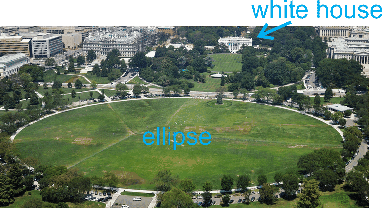\[Figure 9\]

Ellipses Centered at (h, k)
---------------------------

**Objective**

To graph and find the equation of ellipses that are not centered at the origin.

**Guidance**

Just like in the previous lessons, an ellipse does not always have to be placed with its center at the origin. If the center is $(h, k)$ the entire ellipse will be shifted $h$ units to the left or right and $k$ units up or down. The equation becomes $\frac{\left(x-h\right)^2}{a^2}+ \frac{\left(y-k\right)^2}{b^2}=1$. We will address how the vertices, co-vertices, and foci change in the next example.

**Example A**

Graph $\frac{\left(x-3\right)^2}{16}+ \frac{\left(y+1\right)^2}{4}=1$. Then, find the vertices, co-vertices, and foci.

**Solution:** First, we know this is a horizontal ellipse because $16 > 4$. Therefore, the center is $(3, -1)$ and $a = 4$ and $b = 2$. Use this information to graph the ellipse.

To graph, plot the center and then go out 4 units to the right and left and then up and down two units. This is also how you can find the vertices and co-vertices. The vertices are $(3 \pm 4,-1)$ or $(7, -1)$ and $(-1, -1)$. The co-vertices are $(3,-1 \pm 2)$ or $(3, 1)$ and $(3, -3)$.

$$
\begin{align*}
c^2&=16-4=12 \\
c&=2\sqrt{3}
\end{align*}
$$

Therefore, the foci are $\left(3 \pm 2\sqrt{3},-1\right)$.

From this example, we can create formulas for finding the vertices, co-vertices, and foci of an ellipse with center $(h, k)$. Also, when graphing an ellipse, not centered at the origin, make sure to plot the center.

| **Orientation** | **Equation** | **Vertices** | **Co-Vertices** | **Foci** |
| --- | --- | --- | --- | --- |
| Horizontal | $\frac{\left(x-h\right)^2}{a^2}+ \frac{\left(y-k\right)^2}{b^2}=1$ | $(h \pm a,k)$ | $(h,k \pm b)$ | $(h \pm c,k)$ |
| Vertical | $\frac{\left(x-h\right)^2}{b^2}+ \frac{\left(y-k\right)^2}{a^2}=1$ | $(h,k \pm a)$ | $(h \pm b,k)$ | $(h,k \pm c)$ |

**Example B**

Find the equation of the ellipse with vertices $(-3, 2)$ and $(7, 2)$ and co-vertex $(2, -1)$.

**Solution:** These two vertices create a horizontal major axis, making the ellipse horizontal. If you are unsure, plot the given information on a set of axes. To find the center, use the midpoint formula with the vertices.

$\left(\frac{-3+7}{2}, \frac{2+2}{2}\right)= \left(\frac{4}{2}, \frac{4}{2}\right)=(2,2)$

The distance from one of the vertices to the center is $a$, $\left |7-2 \right \vert=5$. The distance from the co-vertex to the center is $b$, $\left |-1-2 \right \vert=3$. Therefore, the equation is $\frac{\left(x-2\right)^2}{5^2}+ \frac{\left(y-2\right)^2}{3^2}=1$ or $\frac{\left(x-2\right)^2}{25}+ \frac{\left(y-2\right)^2}{9}=1$.

**Example C**

Graph $49(x-5)^2+25(y+2)^2=1225$ and find the foci.

**Solution:** First we have to get this into standard form, like the equations above. To make the right side 1, we need to divide everything by 1225.

$$
\begin{align*}
\frac{49\left(x-5\right)^2}{1225}+ \frac{25\left(y+2\right)^2}{1225}&=\frac{1225}{1225} \\
\frac{\left(x-5\right)^2}{25}+ \frac{\left(y+2\right)^2}{49}&=1
\end{align*}
$$

Now, we know that the ellipse will be vertical because $25 < 49$. $a = 7, b = 5$ and the center is $(5, -2)$.

$$
\begin{align*}
c^2&=49-25=24 \\
c&=\sqrt{24}=2\sqrt{6}
\end{align*}
$$

The foci are $\left(5,-2 \pm 2\sqrt{6}\right)$ or $(5, -6.9)$ and $(5, 2.9)$.

**Guided Practice**

1. Find the center, vertices, co-vertices and foci of $\frac{\left(x+4\right)^2}{81}+ \frac{\left(y-7\right)^2}{16}=1$.

2. Graph $25(x-3)^2+4(y-1)^2=100$ and find the foci.

3. Find the equation of the ellipse with co-vertices $(-3, -6)$ and $(5, -6)$ and focus $(1, -2)$.

**Answers**

1. The center is $(-4, 7),a=\sqrt{81}=9$ and $b=\sqrt{16}=4$, making the ellipse horizontal. The vertices are $(-4 \pm 9,7)$ or $(-13, 7)$ and $(5, 7)$. The co-vertices are $(-4,7 \pm 4)$ or $(-4, 3)$ and $(-4, 11)$. Use $c^2=a^2-b^2$ to find $c$.

$$
\begin{align*}
c^2&=81-16=65\\
c&=\sqrt{65}
\end{align*}
$$

The foci are $\left(-4- \sqrt{65},7\right)$ and $\left(-4+ \sqrt{65},7\right)$.

2. Change this equation to standard form in order to graph.

\begin{align*}
\frac{25\left(x-3\right)^2}{100}+ \frac{4\left(y-1\right)^2}{100}&=\frac{100}{100} \\
\frac{\left(x-3\right)^2}{4}+ \frac{\left(y-1\right)^2}{25}&=1
\end{align*}
$$

center: $(3, 1), b = 2, a = 5$

Find the foci.

$$
\begin{align*}
c^2&=25-4=21 \\
c&=\sqrt{21}
\end{align*}
$$

The foci are $\left(3,1+ \sqrt{21}\right)$ and $\left(3,1- \sqrt{21}\right)$.

3. The co-vertices $(-3, -6)$ and $(5, -6)$ are the endpoints of the minor axis. It is $\left |-3-5\right \vert=8$ units long, making $b = 4$. The midpoint between the co-vertices is the center.

$\left(\frac{-3+5}{2},-6\right)=\left(\frac{2}{2},-6\right)=(1,-6)$

The focus is $(1, -1)$ and the distance between it and the center is 4 units, or $c$. Find $a$.

$$
\begin{align*}
16&=a^2-16 \\
32&=a^2 \\
a&=\sqrt{32}=4\sqrt{2}
\end{align*}
$$

The equation of the ellipse is $\frac{\left(x-1\right)^2}{16}+ \frac{\left(y+6\right)^2}{32}=1$.

**Vocabulary**

__Standard Form (of an Ellipse)__

$\frac{\left(x-h\right)^2}{a^2}+ \frac{\left(y-k\right)^2}{b^2}=1$ or $\frac{\left(x-h\right)^2}{b^2}+ \frac{\left(y-k\right)^2}{a^2}=1$ where $(h, k)$ is the center.

**Problem Set**

Find the center, vertices, co-vertices, and foci of each ellipse below.

1.  $\frac{\left(x+5\right)^2}{25}+ \frac{\left(y+1\right)^2}{36}=1$
2.  $(x+2)^2+16(y-6)^2=16$
3.  $\frac{\left(x-2\right)^2}{9}+\frac{\left(y-3\right)^2}{49}=1$
4.  $25x^2+64(y-6)^2=1600$
5.  $(x-8)^2+ \frac{\left(y-4\right)^2}{9}=1$
6.  $81(x+4)^2+4(y+5)^2=324$
7.  Graph the ellipse in #1.
8.  Graph the ellipse in #2.
9.  Graph the ellipse in #4.
10. Graph the ellipse in #5.

Using the information below, find the equation of each ellipse.

11. vertices: $(-2, -3)$ and $(8, -3)$ co-vertex: $(3, -5)$
12. vertices: $(5, 6)$ and $(5, -12)$ focus: $(5, -7)$
13. co-vertices: $(0, 4)$ and $(14, 4)$ focus: $(7, 1)$
14. foci: $(-11, -4)$ and $(1, -4)$ vertex: $(-12, -4)$
15. **_Extension_** Rewrite the equation of the ellipse, $36x^2+25y^2-72x+200y-464=0$ in standard form, by completing the square for both the $x$ and $y$ terms. Then, find the center, vertices, co-vertices, and foci.

</article>

### 10.4 Hyperbolas

<article>

**Objective**

To identify parts of and graph hyperbolas centered at the origin or not.

**Review Queue**

1.  Find the vertex, focus, and directrix of the parabola: $(y+5)^2=-8(x-1)$.
2.  Find the center and radius of the circle: $(x-2)^2+(y-6)^2=25$.
3.  Find the center, vertices, co-vertices, and foci of the ellipse: $\frac{(x+7)^2}{9} + \frac{(y-3)^2}{64}=1$.

Graphing Hyperbolas Centered at the Origin
------------------------------------------

**Objective**

To analyze hyperbolas centered at the origin.

**Guidance**

From the _Rational Functions_ chapter, we know that the resulting graph of a rational function is a hyperbola with two **branches**. A hyperbola is also a conic section. To create a hyperbola, you would slice a plane through two inverted cones, such that the plane is perpendicular to the bases of the cones.

$ on a hyperbola has the property, $d_1-d_2=P$, where $P$ is a constant.")

Comparing this to the ellipse, where $d_1+d_2=P$ and the equation was $\frac{x^2}{a^2} + \frac{y^2}{b^2}=1$ or $\frac{x^2}{b^2} + \frac{y^2}{a^2}=1$.

For a hyperbola, then, the equation will be $\frac{x^2}{a^2} - \frac{y^2}{b^2}=1$ or $\frac{y^2}{a^2} - \frac{x^2}{b^2}=1$. Notice in the vertical orientation of a hyperbola, the $y^2$ term in first. Just like with an ellipse, there are two **vertices**, on the hyperbola. Here, they are the two points that are closest to each other on the graph. The line through the vertices and foci is called the **transverse axis**. Its midpoint is the **center** of the hyperbola. In this concept, the center will be the origin. There will always be two branches for any hyperbola and two asymptotes.

")

\[Figure 4\]

**Example A**

Graph $\frac{x^2}{64} - \frac{y^2}{25}=1$. Then, find the vertices, foci, and asymptotes.

**Solution:** First, this hyperbola has a horizontal transverse axis because the $x^2$ term is first. Also, with hyperbolas, the $a$ and $b$ term stay in place, but the $x$ and $y$ terms switch. $a$ **_is not_** always greater than $b$.

Therefore, $a=\sqrt{64}=8$ and $b=\sqrt{25}=5$. To graph this hyperbola, go out 8 units to the left and right of the center and 5 units up and down to make a rectangle. The diagonals of this rectangle are the asymptotes.

Draw the hyperbola branches with the vertices on the transverse axis and the rectangle. Sketch the branches to get close to the asymptotes, but not touch them.

$ and the asymptotes are $y=\pm \frac{5}{8}x$ (see pictures above. To find the foci, we use the Pythagorean Theorem, $c^2=a^2+b^2$ because the foci are _further away_ from the center than the vertices.")

$$
\begin{align*}
c^2 &= 64+25=89 \\
c &= \sqrt{89}
\end{align*}
$$

The foci are $\left(\pm \sqrt{89}, 0 \right)$.

**Example B**

Graph $36y^2 - 9x^2=324$. Identify the foci.

**Solution:** This equation is not in standard form. To rewrite it in standard form, the right side of the equation must be 1. Divide everything by 324.

$$
\begin{align*}
\frac{36y^2}{324} - \frac{9x^2}{324} &= \frac{324}{324} \\
\frac{y^2}{9} - \frac{x^2}{36} &=1
\end{align*}
$$

Now, we can see that this is a vertical hyperbola, where $a=3$ and $b=6$. Draw the rectangle, asymptotes, and plot the vertices on the $y$\-axis.

$$
\begin{align*}
c^2 &= 36+9=45 \\
c &= \sqrt{45} = 3\sqrt{5}
\end{align*}
$$

The foci are $\left(0, 3 \sqrt{5}\right)$ and $\left(0, -3 \sqrt{5}\right)$.

**Example C**

Graph $\frac{x^2}{4} - \frac{y^2}{4}=1$. Identify the asymptotes.

**Solution:** This will be a horizontal hyperbola, because the $x$\-term is first. $a$ and $b$ will both be 2 because $\sqrt{4}=2$. Draw the square and diagonals to form the asymptotes.

**Important Note:** The asymptotes and square are _not_ a part of the function. They are included in graphing a hyperbola because it makes it easier to do so.

Also, when graphing hyperbolas, we are _sketching_ each branch. We did not make a table of values to find certain points and then connect. You can do this, but using the square or rectangle with the asymptotes produces a pretty accurate graph and is much simpler.

**Guided Practice**

1. Find the vertices, foci, and asymptotes of $y^2-\frac{x^2}{25}=1$.

2. Graph #1.

3. Graph $9x^2-49y^2=411$.

**Answers**

1. First, let’s rewrite the equation like this: $\frac{y^2}{1} - \frac{x^2}{25}=1$. We know that the transverse axis is vertical because the $y$\-term is first, making $a=1$ and $b=5$. Therefore, the vertices are $(0, -1)$ and $(0, 1)$. The asymptotes are $y= \frac{1}{5}x$ and $y= -\frac{1}{5}x$. Lastly, let’s find the foci using $c^2=a^2+b^2$.

$$
\begin{align*}
c^2 &= 1+25=26 \\
c &= \sqrt{26}
\end{align*}
$$

The foci are $\left(0, -\sqrt{26}\right)$ and $\left(0, \sqrt{26}\right)$.

2. 

$$
\begin{align*}
\frac{9x^2}{441} - \frac{49y^2}{441} &= \frac{441}{441} \\
\frac{x^2}{49} - \frac{y^2}{9} &= 1
\end{align*}
$$

$a=9$ and $b=6$ with a horizontal transverse axis.

__Hyperbola__

The set of all points such that the difference of the distances from two fixed points, called **foci**, is constant.

__Branch__

Half of a hyperbola.

__Transverse Axis__

The axis that passes through the vertices of the hyperbola.

__Vertices__

The two closest points on the branches of a hyperbola.

__Asymptotes__

The boundary lines of a hyperbola.

**Problem Set**

Find the vertices, asymptotes, and foci of each hyperbola below. Then, graph.

1.  $\frac{x^2}{9} - \frac{y^2}{16} =1$
2.  $4y^2-25x^2=100$
3.  $\frac{x^2}{81} - \frac{y^2}{64} =1$
4.  $x^2-y^2=16$
5.  $\frac{y^2}{49} - \frac{x^2}{25} =1$
6.  $121y^2-9x^2=1089$
7.  $y^2-x^2=1$
8.  $\frac{x^2}{64} - \frac{y^2}{4} =1$
9.  $\frac{y^2}{4} - \frac{x^2}{64} =1$
10. **_Writing_** Compare the hyperbolas from #8 and #9. How are they the same? How are they different? What do you know about the asymptotes and foci?
11. **_Critical Thinking_** Compare the equations $\frac{x^2}{25} - \frac{y^2}{9} =1$ and $\frac{x^2}{25} + \frac{y^2}{9} =1$. Graph them on the same axes and find their foci.

Writing the Equation of a Hyperbola, Centered at the Origin
-----------------------------------------------------------

**Objective**

To write the equation of a hyperbola given the foci, vertices, and/or the asymptotes.

**Guidance**

In the previous concept, we graphed hyperbolas, given the equation. In this concept, we are going to work backwards and find the equation, given certain pieces of information. For this entire concept, the hyperbola will be centered at the origin.

**Example A**

Find the equation of the hyperbola, centered at the origin, with a vertex of $(-4, 0)$ and focus of $(-6, 0)$.

**Solution:** Because the vertex and focus are on the $x$\-axis, we know that the transverse axis is horizontal. Therefore, the equation will be $\frac{x^2}{a^2} - \frac{y^2}{b^2}=1$. From the vertex, we know that $a=4$ and $c=6$. Let’s solve for $b^2$ using $c^2=a^2+b^2$.

$$
\begin{align*}
6^2 &= 4^2+b^2 \\
36 &= 16+b^2 \rightarrow b^2=20
\end{align*}
$$

The equation of the hyperbola is $\frac{x^2}{16} - \frac{y^2}{20}=1$.

**Example B**

Find the equation of the hyperbola, centered at the origin, with an asymptote of $y=\frac{2}{3}x$ and vertex of $(0, 12)$.

**Solution:** We know that $a=12$, making the transverse axis is vertical and the general equation of the asymptote $y=\frac{a}{b}x$. Therefore, $\frac{2}{3} = \frac{12}{b}$, making $b=18$. Therefore, the equation of the hyperbola is $\frac{y^2}{144} - \frac{x^2}{324}=1$.

In this example, we showed that the slope of the asymptote can be reduced to something that is not always $\frac{a}{b}$, but $c \left(\frac{m}{n}\right) = \frac{a}{b}$, where $c$ is some constant that we can reduce the fraction by.

**Example C**

Find the equations of two hyperbolas with an asymptote of $y= -\frac{5}{9}x$.

**Solution:** This asymptote can be for either a vertical or horizontal hyperbola. $-\frac{5}{9}$ can also be a reduced fraction of $\frac{a}{b}$, like in the previous example. For example, the asymptote $y=-\frac{10}{18}x$ reduces to $y=-\frac{5}{9}x$.

If the hyperbola is horizontal, then the equation of the asymptote is $y=-\frac{b}{a}x$ and that would make $a=9$ and $b=5$ and the equation would be $\frac{x^2}{81} - \frac{y^2}{25}=1$. If the equation is vertical, then the asymptote is $y=-\frac{a}{b}x$ and $a=5$ and $b=9$. The equation would be $\frac{y^2}{25} - \frac{x^2}{81}=1$. If the slope is reduced from a larger fraction, we could also have $\frac{x^2}{324} - \frac{y^2}{100}=1$ or $\frac{y^2}{100} - \frac{x^2}{324}=1$ as a possible answer.

**Guided Practice**

Find the equation of the hyperbolas, centered at the origin, with the given information.

1. vertex: $(0, 2)$

focus: $(0, 5)$

2. asymptote: $y=x$

vertex: $(4, 0)$

3. Find the equations of two hyperbolas, centered at the origin, with different $a$ and $b$ values and an asymptote of $y=\frac{3}{4}x$.

**Answers**

1. The vertex is on the $y$\-axis, so this is a vertical hyperbola with $a=2$. $c=5$, so we need to find $b^2$.

$$
\begin{align*}
c^2 &= a^2+b^2 \\
25 &= 4+b^2 \rightarrow b^2=21
\end{align*}
$$

The equation of the hyperbola is $\frac{y^2}{4} - \frac{x^2}{21}=1$.

2. Rewriting the slope of $y=x$, we get $y=\frac{1}{1}x$. So, we know that $a$ and $b$ are in a ratio of 1:1. Because the vertex is $(4, 0)$, we know that $a=4$ and that the hyperbola is horizontal. Because $a$ and $b$ are in a ratio of 1:1, $b$ has to equal 4 as well. The equation of the hyperbola is $\frac{x^2}{16} - \frac{y^2}{16}=1$.

3. One possibility is that $b=3$ and $a=4$ making the equation $\frac{x^2}{16} - \frac{y^2}{9}=1$. A second possibility could be that $a$ and $b$ are a multiply of the ratio 4:3. So, $a=8$ and $b=6$, making the equation $\frac{x^2}{64} - \frac{y^2}{36}=1$.

**Problem Set**

Find the equation of the hyperbola, centered at the origin, given the information below.

1.  vertex: $(-2, 0)$ focus: $(-5, 0)$
2.  $b=6$ focus: $(0, 11)$
3.  vertex: $(0, 5)$ asymptote: $y=x$
4.  asymptote: $y=-\frac{1}{2}x$ vertex: $(6, 0)$
5.  asymptote: $y=3x$  $\ b=9$
6.  vertex: $(0, 8)$ focus: $\left(0, 6 \sqrt{2}\right)$
7.  Find the equation of two hyperbolas such that:
    1.  They have the same $a$ and $b$ values.
    2.  The equation of an asymptote is $y=\frac{4}{5}x$.
    3.  They are centered at the origin.
8.  Find the equation of two hyperbolas such that:
    1.  They have different $a$ and $b$ values and both horizontal.
    2.  The equation of an asymptote is $y=-\frac{2}{3}x$.
    3.  They are centered at the origin.
9.  Find the equation of two hyperbolas such that:
    1.  They have different $a$ and $b$ values and both vertical.
    2.  The equation of an asymptote is $y=6x$.
    3.  They are centered at the origin.
10. Find the equation of two hyperbolas such that:
    1.  They have the same $a$ and $b$ values.
    2.  The equation of an asymptote is $y=-\frac{10}{7}x$.
    3.  They are centered at the origin.

Hyperbolas Centered at (h, k)
-----------------------------

**Objective**

To graph and find the equation of hyperbolas that are centered at the origin.

**Guidance**

Just like in the previous lessons, a hyperbola does not always have to be placed with its center at the origin. If the center is $(h, k)$ the entire ellipse will be shifted $h$ units to the left or right and $k$ units up or down. The equation becomes $\frac{(x-h)^2}{a^2} - \frac{(y-k)^2}{b^2}=1$. We will address how the vertices, co-vertices, and foci change in the next example.

**Example A**

Graph $\frac{(x-2)^2}{16} - \frac{(y+1)^2}{9}=1$. Then, find the vertices, foci, and asymptotes.

**Solution:** First, we know this is a horizontal hyperbola because the $x$ term is first. Therefore, the center is $(2, -1)$ and $a=4$ and $b=3$. Use this information to graph the hyperbola.

To graph, plot the center and then go out 4 units to the right and left and then up and down 3 units. Draw the box and asymptotes.

$ or $(6, -1)$ and $(-2, -1)$.")

To find the foci, we need to find $c$ using $c^2=a^2+b^2$.

$$
\begin{align*}
c^2 &= 16+9=25 \\
c &= 5
\end{align*}
$$

Therefore, the foci are $(2 \pm 5, -1)$ or $(7, -1)$ and $(-3, -1)$.

To find the asymptotes, we have to do a little work to find the $y$\-intercepts. We know that the slope is $\pm \frac{b}{a}$ or $\pm \frac{3}{4}$ and they pass through the center. Let’s write each asymptote in point-slope form using the center and each slope.

$y-1=\frac{3}{4}(x+2)$ and $y-1=-\frac{3}{4}(x+2)$

Simplifying each equation, the asymptotes are $y=\frac{3}{4}x-\frac{5}{2}$ and $y=-\frac{3}{4}x+\frac{1}{2}$.

From this example, we can create formulas for finding the vertices, foci, and asymptotes of a hyperbola with center $(h, k)$. Also, when graphing a hyperbola, not centered at the origin, make sure to plot the center.

| **Orientation** | **Equation** | **Vertices** | **Foci** | **Asymptotes** |
| --- | --- | --- | --- | --- |
| Horizontal | $\frac{(x-h)^2}{a^2} - \frac{(y-k)^2}{b^2} =1$ | $(h \pm a, k)$ | $(h \pm c, k)$ | $y-k= \pm \frac{b}{a}(x-h)$ |
| Vertical | $\frac{(y-k)^2}{a^2} + \frac{(x-h)^2}{b^2} =1$ | $(h, k \pm a)$ | $(h, k \pm c)$ | $y-k= \pm \frac{a}{b}(x-h)$ |

**Example B**

Find the equation of the hyperbola with vertices $(-3, 2)$ and $(7, 2)$ and focus $(-5, 2)$.

**Solution:** These two vertices create a horizontal transverse axis, making the hyperbola horizontal. If you are unsure, plot the given information on a set of axes. To find the center, use the midpoint formula with the vertices.

$\left(\frac{-3+7}{2}, \frac{2+2}{2}\right) = \left(\frac{4}{2}, \frac{4}{2}\right)=(2, 2)$

The distance from one of the vertices to the center is $a$, $|7 - 2|=5$. The distance from the center to the given focus is $c$, $|-5 -2|=7$. Use $a$ and $c$ to solve for $b$.

$$
\begin{align*}
7^2 &= 5^2+b^2 \\
b^2 &= 24 \rightarrow b=2 \sqrt{6}
\end{align*}
$$

Therefore, the equation is $\frac{(x-2)^2}{25} - \frac{(y-2)^2}{24}=1$.

**Example C**

Graph $49(y-3)^2-25(x+4)^2=1225$ and find the foci.

**Solution:** First we have to get the equation into standard form, like the equations above. To make the right side 1, we need to divide everything by 1225.

$$
\begin{align*}
\frac{49(y-3)^2}{1225} - \frac{25(x+4)^2}{1225} &= \frac{1225}{1225} \\
\frac{(y-3)^2}{25} - \frac{(x+4)^2}{49} &=1
\end{align*}
$$

Now, we know that the hyperbola will be vertical because the $y$\-term is first. $a=5$, $b=7$ and the center is $(-4, 3)$.

$$
\begin{align*}
c^2 &= 49+25=74 \\
c &= \sqrt{74}
\end{align*}
$$

The foci are $\left(-4, 3 \pm \sqrt{74}\right)$ or $(-4, 11.6)$ and $(-4, -5.6)$.

**Guided Practice**

1. Find the center, vertices, foci, and asymptotes of $\frac{(y-1)^2}{81} - \frac{(x+5)^2}{16}=1$.

2. Graph $25(x-3)^2-4(y-1)^2=100$ and find the foci.

3. Find the equation of the hyperbola with vertices $(-6, -3)$ and $(-6, 5)$ and focus $(-6, 7)$.

**Answers**

1. The center is $(-5, 1)$, $a=\sqrt{81}=9$ and $b=\sqrt{16}=4$, and the hyperbola is horizontal because the $y$\-term is first. The vertices are $\left(-5, 1 \pm 9\right)$ or $(-5, 10)$ and $(-5, -8)$. Use $c^2=a^2+b^2$ to find $c$.

$$
\begin{align*}
c^2 &= 81+16=97 \\
c &= \sqrt{97}
\end{align*}
$$

The foci are $\left(-5, 1+ \sqrt{97}\right)$ and $\left(-5, 1- \sqrt{97}\right)$.

The asymptotes are $y-1= \pm \frac{9}{4}(x+5)$ or $y= \frac{9}{4}x + 12 \frac{1}{4}$ and $y= -\frac{9}{4}x - 10 \frac{1}{4}$.

2. Change this equation to standard form in order to graph.

$$
\begin{align*}
\frac{25(x-3)^2}{100} - \frac{4(y-1)^2}{100} &= \frac{100}{100} \\
\frac{(x-3)^2}{4} - \frac{(y-1)^2}{25} &=1
\end{align*}
$$

center: $(3, 1)$, $a=2$, $b=5$

$$
\begin{align*}
c^2 &= 25+4 = 29 \\
c &= \sqrt{29}
\end{align*}
$$

The foci are $\left(3, 1+ \sqrt{29}\right)$ and $\left(3, 1- \sqrt{29}\right)$.

3. The vertices are $(-6, -3)$ and $(-6, 5)$ and the focus is $(-6, 7)$. The transverse axis is going to be vertical because the $x$\-value does not change between these three points. The distance between the vertices is $|-3 -5|=8$ units, making $a=4$. The midpoint between the vertices is the center.

$\left(-6, \frac{-3+5}{2}\right) = \left(-6, \frac{2}{2}\right) = (-6,1)$

The focus is $(-6, 7)$ and the distance between it and the center is 6 units, or $c$. Find $b$.

$$
\begin{align*}
36 &= b^2+16 \\
20 &= b^2 \\
b &= \sqrt{20}=2\sqrt{5}
\end{align*}
$$

The equation of the hyperbola is $\frac{(y-1)^2}{16} - \frac{(x+6)^2}{20}=1$.

**Vocabulary**

__Standard Form (of a Hyperbola)__

$\frac{(x-h)^2}{a^2} - \frac{(y-k)^2}{b^2} = 1$ or $\frac{(y-h)^2}{a^2} - \frac{(x-k)^2}{b^2} = 1$ where $(h, k)$ is the center.

**Problem Set**

Find the center, vertices, co-vertices, foci, and asymptotes of each hyperbola below.

1.  $\frac{(x+5)^2}{25} - \frac{(y+1)^2}{36}=1$
2.  $(y+2)^2-16(x-6)^2=16$
3.  $\frac{(y-2)^2}{9} - \frac{(x-3)^2}{49}=1$
4.  $25x^2-64(y-6)^2=1600$
5.  $(x-8)^2 - \frac{(y-4)^2}{9}=1$
6.  $81(y+4)^2-4(x+5)^2=324$
7.  Graph the hyperbola in #1.
8.  Graph the hyperbola in #2.
9.  Graph the hyperbola in #5.
10. Graph the hyperbola in #6.

Using the information below, find the equation of each hyperbola.

11. vertices: $(-2, -3)$ and $(8, -3)$ $b=7$
12. vertices: $(5, 6)$ and $(5, -12)$ focus: $(5, -15)$
13. asymptote: $y+3=\frac{4}{9}(x+1)$ horizontal transverse axis
14. foci: $(-11, -4)$ and $(1, -4)$ vertex: $(-8, -4)$
15. **_Extension_** Rewrite the equation of the hyperbola, $49x^2-4y^2+490x-16y+1013=0$ in standard form, by completing the square for both the $x$ and $y$ terms. Then, find the center, vertices, asymptotes, and foci.

</article>

### 10.5 General Conic Equations and Solving Non-Linear Systems

<article>

**Objective**

To become familiar with the general conic equation, classify conics, and solve systems of equations with conics, quadratics, and lines.

**Review Queue**

1.  Solve the quadratic equation by completing the square: $x^2-6x+10=4$
2.  Solve the quadratic equation by completing the square: $3x^2+12x-20=0$
3.  Find the equation of the parabola with vertex $(-5, -2)$ and directrix $y=1$.
4.  Find the equation of the ellipse with vertices $(2, 7)$ and $(2, -5)$ and focus $(2, 5)$.

General Conic Equation
----------------------

**Objective**

To change the general second-degree equation into the standard form of a parabola, ellipse, circle, or hyperbola.

**Guidance**

The equation of any conic section can be written in the form $Ax^2+Bxy+Cy^2+Dx+Ey+F=0$, which is the **general second-degree equation** in terms of $x$ and $y$. For all the conic sections we studied in this chapter, $B=0$ because all axes were either horizontal or vertical. When a conic is in this form, you have to complete the square to get it into standard form.

**Standard Form of Conic Sections with Center $(h, k)$**

|     | **Horizontal Axis** | **Vertical Axis** |
| --- | --- | --- |
| Circle | $(x-h)^2+(y-k)^2=r^2$ |     |
| Parabola | $(y-k)^2=4p(x-h)$ | $(x-h)^2=4p(y-k)$ |
| Ellipse | $\frac{(x-h)^2}{a^2} + \frac{(y-k)^2}{b^2}=1$ | $\frac{(x-h)^2}{b^2} + \frac{(y-k)^2}{a^2}=1$ |
| Hyperbola | $\frac{(x-h)^2}{a^2} - \frac{(y-k)^2}{b^2}=1$ | $\frac{(y-k)^2}{a^2} - \frac{(x-h)^2}{b^2}=1$ |

**Example A**

Determine the type of conic section $x^2+y^2-6x+10y-6=0$ is and rewrite the equation in standard form.

**Solution:** Start by rewriting the equation with the $x$ terms and $y$ terms next to each other and moving the constant to the other side of the equation.

$$
x^2+y^2-6x+10y-6=0 \\
(x^2-6x)+(y^2+10y)=6
$$

Now, complete the square for both the $x$ and $y$ terms. To complete the square, you need to add $\left(\frac{b}{2}\right)^2$ to both sides of the equation.

$$
\begin{align*}
(x^2-6x+ {\color{blue}9}) + (y^2+10y+ {\color{red}25})&= 6+ {\color{blue}9}+ {\color{red}25} \\
(x-3)^2+(y+5)^2 &= 40
\end{align*}
$$

By looking at the standard forms above, we can see that this is a circle. Another clue related to the type of conic is that $A$ and $C$ are equal in the general second-degree equation.

**Example B**

Determine the type of conic section that $20x^2-20y^2-80x+240y+320=0$ is and rewrite the equation in standard form.

**Solution:** Using the logic from the previous example, we can conclude that this conic is not a circle. It is also not a parabola because it has both the $x^2$ and $y^2$ terms. Rewrite the equation, grouping the $x$ terms together, $y$ terms together, and moving the constant over to the other side. Then, pull out the GCF of each set of terms.

$$
\begin{align*}
20x^2-20y^2-90x+240y+320 &= 0 \\
20x^2-80x-20y^2+240y &= -320 \\
20(x^2-4x)-20(y^2-12y)&= -320
\end{align*}
$$

Now, complete the square for the $x$ and $y$ terms. When determining what constant will “complete the square” for each grouping, don’t forget to multiply the constant by the number outside the parenthesis before adding it to the other side.

$$
\begin{align*}
20(x^2-4x)-20(y^2-12y) &=\text{-}320 \\
20(x^2-4x+ {\color{blue}4})-20(y^2-12y+ {\color{red}36}) &=\text{-}320+ {\color{blue}80}- {\color{red}720} \\
\frac{20(x-2)^2}{\text{-}960} - \frac{20(y-6)^2}{\text{-}960} &= \frac{\text{-}960}{\text{-}960} \\
\text{-}\frac{(x-2)^2}{48} + \frac{(y-6)^2}{48} &=1\\
\frac{(y-6)^2}{48}- \frac{(x-2)^2}{48} &=1
\end{align*}
$$

We now see that this conic is a hyperbola. Going back to the original equation, note that $C$ is negative. In order for a general second-degree equation to be a hyperbola, $A$ or $C$ (not both) must be negative. If $A$ and $C$ are both positive or negative and not equal, the equation represents an ellipse.

**Example C**

Write the equation of the conic below.

^2}{a^2} + \frac{(y-k)^2}{b^2}=1$. The center is $(-3, 6)$, the major axis is 14 units long, making $a=7$, and the minor axis is 6 units long, making $b=3$. The equation is therefore $\frac{(x-(-3))^2}{7^2} + \frac{(y-6)^2}{3^2}=1$ or $\frac{(x+3)^2}{49} + \frac{(y-6)^2}{4}=1$.")

**Guided Practice**

Determine the conic and rewrite each equation in standard form.

1. $9x^2+16y^2+18x-135=0$

2. $y^2-3x-8y+10=0$

3. Write the equation of the conic below.

1. Complete the square. Ellipse.

$$
\begin{align*}
9x^2+16y^2+18x-135 &=0 \\
9x^2+18x+16y^2 &=135 \\
9(x^2+2x+ {\color{red}1})+16y^2 &=135+ {\color{red}9} \\
9(x+1)^2+16y^2 &=144 \\
\frac{(x+1)^2}{16} + \frac{y^2}{9} &=1
\end{align*}
$$

2. Complete the square. Parabola.

$$
\begin{align*}
y^2-3x-8y+10 &=0 \\
y^2-8y-3x &=-10 \\
y^2-8y+ {\color{red}16} &=3x-10+{\color{red}16} \\
(y-4)^2 &=3x+6 \\
(y-4)^2 &=3(x+2)
\end{align*}
$$

3. This is a circle because the distance around the center is the same. The center is $(0, -4)$ and the radius is 5. The equation is $x^2+(y+4)^2=25$.

**Vocabulary**

__General Second-Degree Equation__

$Ax^2+Bxy+Cy^2+Dx+Ey+F=0$. For the conic sections in this chapter, $B=0$.

**Problem Set**

Find the equation of each conic section below.

1.  
    
    \[Figure 3\]
2.  
    
    \[Figure 4\]
3.  
    
    \[Figure 5\]
4.  
    
    \[Figure 6\]

Rewrite each equation in standard form, classify the conic, and find the center. If the conic is a parabola, find the vertex.

5.  $3x^2+3y^2-6x+9y-14=0$
6.  $6x^2+12x-y+15=0$
7.  $x^2+2y^2+4x+2y-27=0$
8.  $x^2-y^2+3x-2y-43=0$
9.  $y^2-8x-6y+49=0$
10. $-64x^2+225y^2-256x-3150y-3631=0$

Classifying Conic Sections
--------------------------

**Objective**

To classify conic sections using the discriminant.

**Guidance**

Another way to classify a conic section when it is in the general form is to use the discriminant, like from the Quadratic Formula. The discriminant is what is underneath the radical, $b^2-4ac$, and we can use this to determine if the conic is a parabola, circle, ellipse, or hyperbola. If the general form of the equation is $Ax^2+Bxy+Cy^2+Dx+Ey+F=0$, where $B=0$, then the discriminant will be $B^2-4AC$.

Use the table below:

| $B^2-4AC=0$ and $A=0$ or $C=0$ | Parabola |
| --- | --- |
| $B^2-4AC<0$ and $A=C$ | Circle |
| $B^2-4AC<0$ and $A \ne C$ | Ellipse |
| $B^2-4AC>0$ | Hyperbola |

**Example A**

Use the discriminant to determine the type conic: $x^2-4y^2+5x-8y+16=0$.

**Solution:** $A=1$, $B=0$, and $C=-4$

$0^2-4(1)(-4)=16$ This is a hyperbola.

**Example B**

Use the discriminant to determine the type of conic: $3x^2+3y^2-9x-12y-20=0$

**Solution:** $A=3$, $B=0$, $C=3$

$0^2-4(3)(3)=-36$ Because $A=C$ and the discriminant is less than zero, this is a circle.

**Guided Practice**

Use the discriminant to determine the type of conic.

1. $2x^2+5y^2-8x+25y+115=0$

2. $5y^2-9x-10y-14=0$

3. Use the discriminant to determine the type of conic. Then, change the equation into standard form to verify your answer. Find the center or vertex, if it is a parabola.

$-4x^2+3y^2-8x+24y+32=0$

**Answers**

1. $0^2-4(2)(5)=-40$, this is an ellipse.

2. $0^2-4(0)(5)=0$, this is a parabola.

3. $0^2-4(-4)(3)=48$, this is a hyperbola. Changing it to standard form, we have:

$$
\begin{align*}
(-4x^2-8x)+(3y^2+24y) &=-32 \\
-4(x^2+2x+1)+3(y^2+8y+16) &=-32+48-4 \\
-4(x+1)^2+3(y+4)^2 &=12 \\
\frac{-(x+1)^2}{3}+\frac{(y+4)^2}{4} &=1
\end{align*}
$$

Usually, we write the negative term second, so the equation is $\frac{(y+4)^2}{4} - \frac{(x+1)^2}{3}=1$. The center is $(-4, -1)$.

**Vocabulary**

__Discriminant__

When referring to the general second-degree equation, $Ax^2+Bxy+Cy^2+Dx+Ey+F=0$, the discriminant is $B^2-4AC$ and it determines the type of conic the equation represents.

**Problem Set**

Use the discriminant to determine the type of conic each equation represents.

1.  $2x^2+2y^2+16x-8y+25=0$
2.  $x^2-y^2-2x+5y-12=0$
3.  $6x^2+y^2-12x+7y+35=0$
4.  $3x^2-15x+9y-18=0$
5.  $10y^2+6x-40y+253=0$
6.  $4x^2+4y^2+32x+48y+465=0$

Match the equation with the correct graph.

8.  $4y^2+x+56y+188=0$
9.  $x^2+y^2+10x-14y+65=0$
10. $25x^2+y^2-200x-10y+400=0$

Use the discriminant to determine the type of conic. Then, change the equation into standard form to verify your answer. Find the center or vertex, if it is a parabola.

11. $x^2-12x+6y+66=0$
12. $x^2+y^2+2x+2y-2=0$
13. $x^2-y^2-10x-10y-10=0$
14. $y^2-10x+8y+46=0$
15. **_Find the Area of an Ellipse_** Graph $x^2+y^2=36$ and find is area.
    1.  Then, graph $\frac{x^2}{36} + \frac{y^2}{25}=1$ and $\frac{x^2}{25} + \frac{y^2}{36}=1$ on the same axes.
    2.  Do these ellipses have the same area? Why or why not?
    3.  If the equation of the area of a circle is $A=\pi r^2$, what do you think the area of an ellipse is? Use $a$ and $b$ as in the standard form, $\frac{x^2}{a^2} + \frac{y^2}{b^2}=1$.
    4.  Find the areas of the ellipses from part a. Are the areas more or less than the area of the circle? Why or why not?

Solving Systems of Lines, Quadratics and Conics
-----------------------------------------------

**Objective**

To solve systems of equations with lines, parabolas, circles, or ellipses by graphing and substitution.

**Guidance**

In the _Solving Systems of Equations_ chapter, we solved a system involving two lines or three planes, by using graphing, substitution, and linear combinations. In this concept, we will add circles, parabolas, and ellipses to systems of equations. Because both $x$ and $y$ can be squared in these equations, there will often be more than one answer.

**Example A**

Estimate the solutions for the system of equations below.

$(0, 7)$, $(4.7, 5.5)$, $(4.9, 4.3)$, and $(-1, 2.9)$

Keep in mind these are only estimates. In the next example, we will show how to find the exact answers.

**Example B**

Solve 

$$
\begin{align*}
x^2+y^2 &=25 \\
3x+2y &=6
\end{align*}
$$

**Solution:** Let’s solve this system by graphing. The first equation is a circle, centered at the origin, with a radius of 5. The second equation is a line. In slope intercept form, it is $y=-\frac{3}{2}x+3$.

$ and in the fourth quadrant it looks like $(4, -3)$. These are our estimated answers.")

To find the exact value of these points of intersection, we need to use substitution. Substitute in the linear equation in for $y$ into the circle equation and solve for $x$.

$$
\begin{align*}
x^2+\left(-\frac{3}{2}x+3\right)^2 &=25 \\
x^2+\frac{9}{4}x^2-9x+9 &=25 \\
\frac{13}{4}x^2-9x-16 &=0 \\
13x^2-36x-64 &=0
\end{align*}
$$

Use the Quadratic Formula:

$$
\begin{align*}
x &= \frac{36 \pm \sqrt{36^2-4(13)(-64)}}{2(13)} \\
&= \frac{36 \pm \sqrt{4624}}{26} \\
&= \frac{36 \pm 68}{26}
\end{align*}
$$

The solutions, for $x$, are $\frac{36+68}{26}=4$ and $\frac{36-68}{26}=-1\frac{3}{13}$. Plug these into either equation to solve for $y$.

$y=-\frac{3}{2}(4)+3=-3$ and $y=-\frac{3}{2} \left(-\frac{16}{13}\right)+3=4 \frac{11}{13}$

The points are $(4, -3)$ and $\left(-1 \frac{3}{13}, 4 \frac{11}{13}\right)$.

The technique used in this example is how it is recommended you approach each problem. First, graph the system so that you have an idea of how many solutions there are and where they are located. Then, use substitution to solve for the exact answers.

**Example C**

Solve 

$$
\begin{align*}
& \frac{x^2}{16} + \frac{y^2}{9}=1 \\
& y^2=-\frac{4}{3}(x-6)
\end{align*}
$$

**Solution:** Graphing the two equations, we have four points of intersection below. The second equation is solved for $y^2$, so substitute that into the first equation.

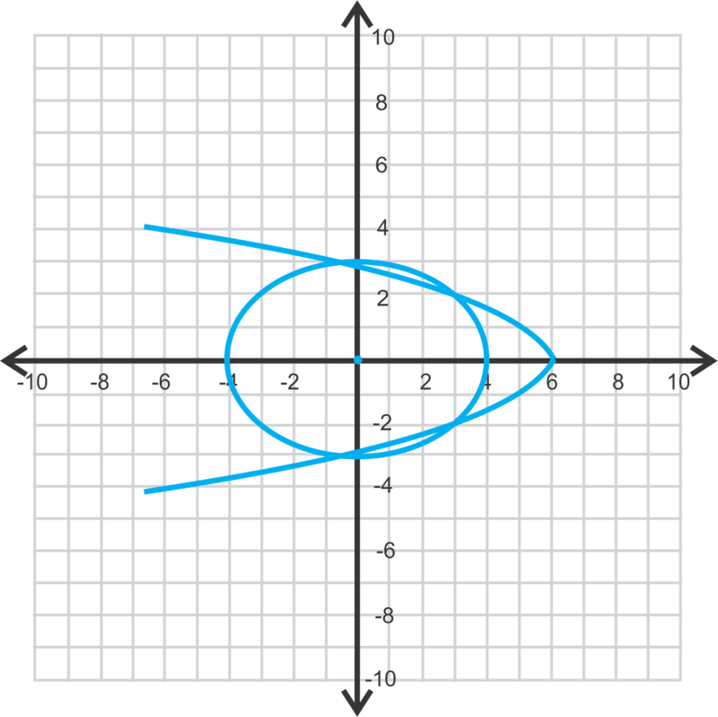
\begin{align*}
\frac{x^2}{16} - \frac{4(x-6)}{3 \cdot 9} &= 1 \\
\frac{x^2}{16} - \frac{4x-24}{27} &=1 \\
27x^2-16(4x-24) &=432 \\
27x^2-64x-48 &=0
\end{align*}
$$

Now, use the Quadratic Formula to solve for $x$.

$$
\begin{align*}
x &= \frac{64 \pm \sqrt{(-64)^2-4(27)(-48)}}{2(27)} \\
&= \frac{64 \pm \sqrt{9280}}{54} \\
&= \frac{32 \pm 4 \sqrt{145}}{27}
\end{align*}
$$

Plugging these into the calculator we get $x = \frac{32+4 \sqrt{145}}{27} \approx 2.97$ and $x = \frac{32-4 \sqrt{145}}{27} \approx -0.6$. Looking at the graph, we know that there will be two different $y$\-values for each $x$\-value to give four points of intersection. Using the estimations, solve for $y$. You can choose either equation.

$$
\begin{align*}
y^2 &= -\frac{4}{3}(2.97-6) \qquad \qquad \quad \quad y^2= -\frac{4}{3}(-0.6-6) \\
y^2 &= 4.04 \qquad \qquad \qquad and \qquad \ y^2= 8.8 \\
y &= \pm 2.01 \qquad \qquad \qquad \qquad \quad \ \ y= \pm 2.97
\end{align*}
$$

The points are $(2.97, 2.01)$, $(2.97, -2.01)$, $(-0.6, 2.97)$, and $(-0.6, -2.97)$.

**Guided Practice**

1. Estimate the solutions to the system below.

2. 

$$
\begin{align*}
x^2+(y-1)^2 &= 36 \\
x^2 &= 2(y+9)
\end{align*}
$$

3. 

$$
\begin{align*}
x^2 &=y+8 \\
4x+5y &= 12
\end{align*}
$$

**Answers**

1. $(3, -0.1)$ and $(4.5, -6)$

2. This is a circle and a parabola that intersects in four places.

$$
\begin{align*}
2(y+9)+(y-1)^2 &=36 \\
2y+18+y^2-2y+1 &=36 \\
y^2 &= 17 \\
y &= \pm \sqrt{17} \approx \pm 4.12
\end{align*}
$$

The corresponding $x$\-values are:

$$
\begin{align*}
x^2 &= 2(4.12+9) \qquad \qquad \quad x^2= 2(-4.12+9) \\
x^2 &= 26.25 \qquad \qquad and \qquad x^2= 9.76 \\
x &= \pm 5.12 \qquad \qquad \qquad \quad \ \ x= \pm 3.12
\end{align*}
$$

The solutions are: $(4.12, 5.12)$, $(4.12, -5.12)$, $(-4.12, 3.12)$ and $(-4.12, -3.12)$.

3. This is a line and a parabola that intersect in two points.

$$
\begin{align*}
4x+5(x^2-8) &=12 \\
4x+5x^2-40 &=12 \\
5x^2+4x-52 &=0 \\
x &= \frac{-4 \pm \sqrt{4^2-4(5)(-52)}}{2(5)} \\
x &= \frac{-4 \pm \sqrt{1056}}{10} \approx 3.65,2.85
\end{align*}
$$

Using the first equation, $y=3.65^2-8=5.32$ and $y = 2.85^2-8=0.12$. The points are $(3.65, 5.32)$ and $(2.85, 0.12)$.

**Problem Set**

Estimate the solutions for each system of equations below.

1.  
    
    \[Figure 14\]
2.  
    
    \[Figure 15\]
3.  
    
    \[Figure 16\]
4.  
    
    \[Figure 17\]
5.  How many different ways can a circle and a parabola intersect? Draw each possibility.
6.  How many different ways can a circle and an ellipse intersect? Draw each possibility.

Solve each system of equations below.

7.  .

____$$
\begin{align*}
5x^2+3y &= 17 \\
x-y &= 1
\end{align*}
$$__

$$
\begin{align*}
5x^2+3y &= 17 \\
x-y &= 1
\end{align*}
$$__

__$$
\begin{align*}
5x^2+3y &= 17 \\
x-y &= 1
\end{align*}
$$__

$$
\begin{align*}
5x^2+3y &= 17 \\
x-y &= 1
\end{align*}
$$

8.  .

____$$
\begin{align*}
x^2+y^2 &= 7.5 \\
x+2y &= 6
\end{align*}
$$__

$$
\begin{align*}
x^2+y^2 &= 7.5 \\
x+2y &= 6
\end{align*}
$$__

__$$
\begin{align*}
x^2+y^2 &= 7.5 \\
x+2y &= 6
\end{align*}
$$__

$$
\begin{align*}
x^2+y^2 &= 7.5 \\
x+2y &= 6
\end{align*}
$$

9.  .

____$$
\begin{align*}
x^2 &= y+4 \\
\frac{x^2}{4}+(y+2)^2 &= 1
\end{align*}
$$__

$$
\begin{align*}
x^2 &= y+4 \\
\frac{x^2}{4}+(y+2)^2 &= 1
\end{align*}
$$__

__$$
\begin{align*}
x^2 &= y+4 \\
\frac{x^2}{4}+(y+2)^2 &= 1
\end{align*}
$$__

$$
\begin{align*}
x^2 &= y+4 \\
\frac{x^2}{4}+(y+2)^2 &= 1
\end{align*}
$$

10. .

____$$
\begin{align*}
(x-1)^2+(y-3)^2 &= 25 \\
x^2 &= -2(y-10)
\end{align*}
$$__

$$
\begin{align*}
(x-1)^2+(y-3)^2 &= 25 \\
x^2 &= -2(y-10)
\end{align*}
$$__

__$$
\begin{align*}
(x-1)^2+(y-3)^2 &= 25 \\
x^2 &= -2(y-10)
\end{align*}
$$__

$$
\begin{align*}
(x-1)^2+(y-3)^2 &= 25 \\
x^2 &= -2(y-10)
\end{align*}
$$

11. .

____$$
\begin{align*}
x^2+y^2 &=16 \\
4x-3y &= 18
\end{align*}
$$__

$$
\begin{align*}
x^2+y^2 &=16 \\
4x-3y &= 18
\end{align*}
$$__

__$$
\begin{align*}
x^2+y^2 &=16 \\
4x-3y &= 18
\end{align*}
$$__

$$
\begin{align*}
x^2+y^2 &=16 \\
4x-3y &= 18
\end{align*}
$$

12. .

____$$
\begin{align*}
(x+4)^2+(y+1)^2 &= 36 \\
\frac{(x+1)^2}{4} + \frac{(y-2)^2}{25} &= 1
\end{align*}
$$__

$$
\begin{align*}
(x+4)^2+(y+1)^2 &= 36 \\
\frac{(x+1)^2}{4} + \frac{(y-2)^2}{25} &= 1
\end{align*}
$$__

__$$
\begin{align*}
(x+4)^2+(y+1)^2 &= 36 \\
\frac{(x+1)^2}{4} + \frac{(y-2)^2}{25} &= 1
\end{align*}
$$__

$$
\begin{align*}
(x+4)^2+(y+1)^2 &= 36 \\
\frac{(x+1)^2}{4} + \frac{(y-2)^2}{25} &= 1
\end{align*}
$$

13. **_Challenge_** Find the solutions for the system

$$
\begin{align*}
x^2+y^2 &= r^2 \\
y &= mx
\end{align*}
$$

Leave your answers in terms of $m$ and $r$.

14. **_Challenge_** Determine if the system of three equations below have one common solution.

$$
\begin{align*}
x^2+3y^2 &= 16 \\
3x^2+y^2 &= 16 \\
y &= x
\end{align*}
$$

</article>

## 11.0 Sequences and Series

<article>

This chapter of Algebra II explores sequences of numbers that follow a particular pattern. Students will begin by recognizing patterns, describing patterns in words and continuing the patterns. Commonly known sequences such as the Fibonacci sequence will be investigated. Students will analyze arithmetic and geometric sequences to determine recursive and general rules for sequences. Students will use formulas and the graphing calculator to find the sums of arithmetic and geometric series.

</article>

### 11.1 General Sequences

<article>

**Objective**

Recognize patterns in sequences of numbers, describe the pattern and determine additional terms in the sequence.

**Review Queue**

Find the domain and range of the functions below.

1.  $y=3x-4$
2.  $y=x^2-2$
3.  $y=\frac{x(x-1)}{2}$

Finding the Next Term in a Sequence
-----------------------------------

**Objective**

Observe and continue the pattern apparent in a **sequence**, or arrangement of numerical values.

**Guidance**

When looking at a sequence of numbers, consider the following possibilities.

1. There could be a **common difference** (the same value is added or subtracted) to progress from each term to the next.

Example: $5, 8, 11, 14, \ldots$ (add 3)

2. There could be a **common ratio** (factor by which each term is multiplied) to progress from one term to the next.

Example: $9, 3, 1$, $\frac{1}{3} \ldots$ $\left ( \right .$ multiply by $\left . \frac{1}{3} \right )$

3. If the terms are fractions, perhaps there is a pattern in the numerator and a different pattern in the denominators.

Example: $\frac{1}{9}, \frac{3}{8}, \frac{5}{7}, \frac{7}{6}, \ldots$ (numerator (+2), denominator (-1))

4. If the terms are growing rapidly, perhaps the difference between the term values is increasing by some constant factor.

Example: $2, 5, 9, 14, \ldots$ (add 3, add 4, add 5, ...)

5. The terms may represent a particular type of number such as prime numbers, perfect squares, cubes, etc.

Example: $2, 3, 5, 7, \ldots$ (prime numbers)

6. Consider whether each term is the result of performing an operation on the two prior terms.

Example: $2, 5, 7, 12, 19, \ldots$ (add the previous two terms)

7. Consider the possibility that the value is connected to the term number:

Example: $0, 2, 6, 12, \ldots$

In this example $(0 \times 1) = 0, (1 \times 2) = 2, (2 \times 3) = 6, (3 \times 4) = 12, \ldots$

This list is not intended to be a comprehensive list of all possible patterns that may be present in a sequence but they are a good place to start when looking for a pattern.

**Example A**

Find the next two terms in the sequence: $160, 80, 40, 20, \underline{\;\;\;\;\;\;\;}, \underline{\;\;\;\;\;\;\;}$

**Solution:** Each term is the result of multiplying the previous term by $\frac{1}{2}$. Therefore, the next terms are:

$\frac{1}{2}(20)=10$ and $\frac{1}{2}(10)=5$

**Example B**

Find the next two terms in the sequence: $0, 3, 7, 12, 18, \underline{\;\;\;\;\;\;\;}, \underline{\;\;\;\;\;\;\;}$

**Solution:** The difference between the first two terms $(3-0)$ is 3, the difference between the second and third terms $(7-3)$ is 4, the difference between the third and fourth terms $(12-7)$ is 5 and the difference between the fourth and fifth terms $(18-12)$ is 6. Each time we add one more to get the next term. The next difference will be 7, so $18+7=25$ for the sixth term. To get the seventh term, we add 8, so $25+8=33$.

**Example C**

Find the next two terms in the sequence: $9, 5, 4, 1, 3, \underline{\;\;\;\;\;\;\;}, \underline{\;\;\;\;\;\;\;}$

**Solution:** This sequence requires that we look at the previous two terms. To get the third term, the second term was subtracted from the first: $9-5=4$. To get the fourth term, the third term is subtracted from the second: $5-4=1$. Similarly: $4-1=3$. Now, to get the next terms, continue the pattern:

$1-3=-2$ and $3-(-2)=5$

**Guided Practice**

Find the next two terms in each of the following sequences:

1. $-5, -1, 3, 7, \underline{\;\;\;\;\;\;\;}, \underline{\;\;\;\;\;\;\;}$

2. $\frac{1}{3}, \frac{2}{3}, \frac{7}{9}, \frac{5}{6} \underline{\;\;\;\;\;\;\;}, \underline{\;\;\;\;\;\;\;}$

3. $1, 4, 9, 16, \underline{\;\;\;\;\;\;\;}, \underline{\;\;\;\;\;\;\;}$

**Answers**

1. Each term is the previous term plus 4. Therefore, the next two terms are 11 and 15.

2. The pattern here is somewhat hidden because some of the fractions have been reduced. If we “unreduced” the second and fourth terms we get the sequence: $\frac{1}{3}$, $\frac{4}{6}$, $\frac{7}{9}$,$\frac{10}{12}, \underline{\;\;\;\;\;\;\;}, \underline{\;\;\;\;\;\;\;}$. Now the pattern can be observed to be that the numerator and denominator each increase by 3. So the next two terms are $\frac{13}{15}$ and $\frac{16}{18}$. Reducing the last term gives us the final answer of $\frac{13}{15}$ and $\frac{8}{9}$.

3. This sequence is the set of perfect squares or the term number squared. Therefore the $5^{th}$ and $6^{th}$ terms will be $5^2=25$ and $6^2=36$.

**Vocabulary**

__Sequence__

An arrangement of numbers which follows a pattern.

__Common Difference__

The constant value which is repeatedly added to each term in an arithmetic sequence to obtain the next term.

__Common Ratio__

The constant value which is multiplied by each term in a geometric sequence to obtain the next term.

**Problem Set**

Find the next three terms in each sequence.

1.  $15, 21, 27, 33, \underline{\;\;\;\;\;\;\;}, \underline{\;\;\;\;\;\;\;}, \underline{\;\;\;\;\;\;\;}$
2.  $-4, 12, -36, 108, \underline{\;\;\;\;\;\;\;}, \underline{\;\;\;\;\;\;\;}, \underline{\;\;\;\;\;\;\;}$
3.  $51, 47, 43, 39, \underline{\;\;\;\;\;\;\;}, \underline{\;\;\;\;\;\;\;}, \underline{\;\;\;\;\;\;\;}$
4.  $100, 10, 1, 0.1, \underline{\;\;\;\;\;\;\;}, \underline{\;\;\;\;\;\;\;}, \underline{\;\;\;\;\;\;\;}$
5.  $1, 2, 4, 8, \underline{\;\;\;\;\;\;\;}, \underline{\;\;\;\;\;\;\;}, \underline{\;\;\;\;\;\;\;}$
6.  $\frac{7}{2}, \frac{5}{3}, \frac{3}{4}, \frac{1}{5}, \underline{\;\;\;\;\;\;\;}, \underline{\;\;\;\;\;\;\;}, \underline{\;\;\;\;\;\;\;}$

Find the missing terms in the sequences.

7.  $1, 4, \underline{\;\;\;\;\;\;\;}, 16, 25, \underline{\;\;\;\;\;\;\;}$
8.  $\frac{2}{3}, \frac{3}{4}, \underline{\;\;\;\;\;\;\;}, \frac{5}{6}, \underline{\;\;\;\;\;\;\;}$
9.  $0, 2, \underline{\;\;\;\;\;\;\;}, 9, 14,\underline{\;\;\;\;\;\;\;}$
10. $1, \underline{\;\;\;\;\;\;\;}, 27, 64, 125, \underline{\;\;\;\;\;\;\;}$
11. $5, \underline{\;\;\;\;\;\;\;}, 11, 17, 28, \underline{\;\;\;\;\;\;\;}, 73$
12. $3, 8, \underline{\;\;\;\;\;\;\;}, 24, \underline{\;\;\;\;\;\;\;}, 48$

Describing the Pattern and Writing a Recursive Rule for a Sequence
------------------------------------------------------------------

**Objective**

Recognize and describe the pattern and write a recursive rule for a sequence.

**Guidance**

A **recursive rule** for a sequence is a formula which tells us how to progress from one term to the next in a sequence. Generally, the variable $n$ is used to represent the term number. In other words, $n$ takes on the values 1 (first term), 2 (second term), 3 (third term), etc. The variable, $a_n$ represents the $n^{th}$ term and $a_{n-1}$ represents the term preceding $a_n$.

Example sequence: $4, 7, 11, 16, \ldots, a_{n-1}, a_n$

In the above sequence, $a_1=4$, $a_2=7$, $a_3=11$ and $a_4=16$.

**Example A**

Describe the pattern and write a recursive rule for the sequence: $9, 11, 13, 15, \ldots$

**Solution:** First we need to determine what the pattern is in the sequence. It appears that 2 is added to each term to obtain the following term in the sequence. We can use $a_{n-1}$ and $a_n$ to write a recursive rule as follows: $a_n=a_{n-1}+2$

**Example B**

Write a recursive rule for the sequence: $3, 9, 27, 81, \ldots$

**Solution:** In this sequence, each term is multiplied by 3 to get the next term. We can write a recursive rule: $a_n=3a_{n-1}$

**Example C**

Write a recursive rule for the sequence: $1, 1, 2, 3, 5, 8, \ldots$

**Solution:** This is a special sequence called the Fibonacci sequence. In this sequence each term is the sum of the previous two terms. We can write the recursive rule for this sequence as follows: $a_n=a_{n-2}+a_{n-1}$.

**Guided Practice**

**Write the recursive rules for the following sequences.**

1. $1, 2, 4, 8, \ldots$

2. $1, -2, -5, -8, \ldots$

3. $1, 2, 4, 7, \ldots$

**Answers**

1. In this sequence each term is double the previous term so the recursive rule is: $a_n=2a_{n-1}$

2. This time three is subtracted each time to get the next term: $a_n=a_{n-1}-3$.

3. This one is a little trickier to express. Try looking at each term as shown below:

$$
\begin{align*}
a_1 &=1 \\
a_2 &=a_1+1 \\
a_3 &=a_2+2 \\
a_4 &=a_3+3 \\
& \ \ \vdots \\
a_n &=a_{n-1}+(n-1)
\end{align*}
$$

**Vocabulary**

__Recursive Rule__

A rule that can be used to calculate a term in a sequence given the previous term(s).

**Problem Set**

Describe the pattern and write a recursive rule for the following sequences.

1.  $\frac{1}{4}, -\frac{1}{2}, 1, -2 \ldots$
2.  $5, 11, 17, 23, \ldots$
3.  $33, 28, 23, 18, \ldots$
4.  $1, 4, 16, 64, \ldots$
5.  $21, 30, 39, 48, \ldots$
6.  $100, 75, 50, 25, \ldots$
7.  $243, 162, 108, 72, \ldots$
8.  $128, 96, 72, 54, \ldots$
9.  $1, 5, 10, 16, 23, \ldots$
10. $0, 2, 2, 4, 6, \ldots$
11. $3, 5, 8, 12, \ldots$
12. $0, 2, 6, 12, \ldots$

Using and Writing Nᵗʰ Term Rules for Sequences
----------------------------------------------

**Objective**

Use an $n^{th}$ term rule or general rule for a sequence to find terms and write a general rule for a given sequence.

**Guidance**

In the previous concept we wrote a recursive rule to find the next term in a sequence. Recursive rules can help us generate multiple sequential terms in a sequence but are not helpful in determining a particular single term. Consider the sequence: $3, 5, 7, \ldots, a_n$. The recursive rule for this sequence is $a_n=a_{n-1}+2$. What if we want to find the $100^{th}$ term? The recursive rule only allows us to find a term in the sequence if we know the previous term. An $n^{th}$ **term or general rule,** however, will allow us to find the $100^{th}$ term by replacing $n$ in the formula with 100.

**Example A**

Write the first three terms, the $15^{th}$ term and the $40^{th}$ term of the sequence with the general rule: $a_n=n^2-1$.

**Solution:** We can find each of these terms by replacing $n$ with the appropriate term number:

$$
\begin{align*}
a_1 &=(1)^2-1=0 \\
a_2 &=(2)^2-1=3 \\
a_3 &=(3)^2-1=8 \\
a_{15} &=(15)^2-1=224 \\
a_{40} &=(40)^2-1=1599
\end{align*}
$$

**Calculator:** These terms can also be found using a graphing calculator. First press **$2^{nd}$ STAT** (to get to the **List** menu). Arrow over to **OPS,** select option **5: seq(** and type in (expression, variable, begin, end). For this particular problem, the calculator yields the following:

$seq\left(x^2-1,x,1,3 \right) =\{0 \ 3 \ 8\}$ for the first three terms

$seq\left(x^2-1,x,15,15 \right)=\{224\}$ for the $15^{th}$ term

$seq\left(x^2-1,x,40,40 \right)=\{1599\}$ for the $40^{th}$ term

**Example B**

Write a general rule for the sequence: $5, 10, 15, 20,\ldots$

**Solution:** The previous example illustrates how a general rule maps a term number directly to the term value. Another way to say this is that the general rule expresses the $n^{th}$ term as a function of $n$. Let’s put the terms in the above sequence in a table with their term numbers to help identify the rule.

Looking at the terms and term numbers together helps us to see that each term is the result of multiplying the term number by 5. The general rule is $a_n=5n$

| $n$ | 1   | 2   | 3   | 4   |
| --- | --- | --- | --- | --- |
| $a$ | 5   | 10  | 15  | 20  |

**Example C**

Find the $n^{th}$ term rule for the sequence: $0, 2, 6, 12,\ldots$

**Solution:** Let’s make the table again to begin to analyze the relationship between the term number and the term value.

| $n$ | 1   | 2   | 3   | 4   |
| --- | --- | --- | --- | --- |
| $a_n$ | 0   | 2   | 6   | 12  |
| $n(?)$ | $(1)(0)$ | $(2)(1)$ | $(3)(2)$ | $(4)(3)$ |

This time the pattern is not so obvious. To start, write each term as a product of the term number and a second factor. Then it can be observed that the second factor is always one less that the term number and the general rule can be written as $a_n=n(n-1)$

**Guided Practice**

1. Given the general rule: $a_n=3n-13$, write the first five terms, $25^{th}$ term and the $200^{th}$ term of the sequence.

2. Write the general rule for the sequence: $4, 5, 6, 7,\ldots$

3. Write the general rule and find the $35^{th}$ term of the sequence: $-1, 0, 3, 8, 15,\ldots$

**Answers**

1. Plug in the term numbers as shown: 

$$
\begin{align*}
a_1 &=3(1)-13=-10 \\
a_2 &=3(2)-13=-7 \\
a_3 &=3(3)-13=-4 \\
a_4 &=3(4)-13=-1 \\
a_5 &=3(5)-13=2 \\
a_{25} &=3(25)-13=62 \\
a_{200} &=3(200)-13=587
\end{align*}
$$

2. Put the values in a table with the term numbers and see if there is a way to write the term as a function of the term number.

| $n$ | 1   | 2   | 3   | 4   |
| --- | --- | --- | --- | --- |
| $a_n$ | 4   | 5   | 6   | 7   |
| $n\pm(?)$ | $(1)+3$ | $(2)+3$ | $(3)+3$ | $(4)+3$ |

Each term appears to be the result of adding three to the term number. Thus, the general rule is $a_n=n+3$

3. Put the values in a table with the term numbers and see if there is a way to write the term as a function of the term number.

| $n$ | 1   | 2   | 3   | 4   | 5   |
| --- | --- | --- | --- | --- | --- |
| $a_n$ | \-1 | 10  | 3   | 8   | 15  |
| $n(?)$ | $(1)(-1)$ | $(2)(0)$ | $(3)(1)$ | $(4)(2)$ | $(5)(3)$ |

Each term appears to be the result of multiplying the term number by two less than the term number. Thus, the general rule is $a_n=n(n-2)$

**Vocabulary**

__$N^{th}$ term or general rule__

A formula which relates the term to the term number and thus can be used to calculate any term in a sequence whether or not any terms are known.

**Problem Set**

Use the $n^{th}$ term rule to generate the indicated terms in each sequence.

1.  $2n+7$, terms $1-5$ and the $10^{th}$ term.
2.  $-5n-1$, terms $1-3$ and the $50^{th}$ term.
3.  $2^n-1$, terms $1-3$ and the $10^{th}$ term.
4.  $\left(\frac{1}{2}\right)^n$, terms $1-3$ and the $8^{th}$ term.
5.  $\frac{n(n+1)}{2}$, terms $1-4$ and the $20^{th}$ term.

Use your calculator to generate the first 5 terms in each sequence. Use **MATH > FRAC**, on your calculator to convert decimals to fractions.

6.  $4n-3$
7.  $-\frac{1}{2}n+5$
8.  $\left(\frac{2}{3}\right)^n+1$
9.  $2n(n-1)$
10. $\frac{n(n+1)(2n+1)}{6}$

Write the $n^{th}$ term rule for the following sequences.

11. $3,5,7,9,\ldots$
12. $1,7,25,79,\ldots$
13. $6,14,24,36,\ldots$
14. $6,5,4,3,\ldots$
15. $2,5,9,14,\ldots$

Series and Summation Notation
-----------------------------

**Objective**

Write the terms of a series and find the sum of a finite series.

**Guidance**

A **series** is the sum of the terms in a sequence. A series is often expresses in summation notation(also called sigma notation) which uses the capital Greek letter $\sum$, sigma. Example: $\sum\limits_{n=1}^5 n=1+2+3+4+5=15$. Beneath the sigma is the index (in this case $n$) which tells us what value to plug in first. Above the sigma is the upper limit which tells us the upper limit to plug into the rule.

**Example A**

Write the terms and find the sum of the series: $\sum\limits_{n=1}^6 4n+1$

**Solution:** Begin by replacing n with the values 1 through 6 to find the terms in the series and then add them together.

$$
\begin{align*}
& \left(4(1)-1\right)+\left(4(2)-1\right)+\left(4(3)-1\right)+\left(4(4)-1\right)+\left(4(5)-1\right)+\left(4(6)-1\right) \\
& 3+7+11+15+19+23 \\
& =78
\end{align*}
$$

**Calculator:** The graphing calculator can also be used to evaluate this sum. We will use a compound function in which we will sum a sequence. Go to **$2^{nd}$ STAT** (to get to the **List** menu) and arrow over to **MATH**. Select option **5: sum(** then return to the **List** menu, arrow over to **OPS** and select option **5: seq(** to get sum(seq( on your screen. Next, enter in (expression, variable, begin, end)just as we did in the previous topic to list the terms in a sequence. By including the sum( command, the calculator will sum the terms in the sequence for us. For this particular problem the expression and result on the calculator are:

$$
sum(seq(4x-1,x,1,6))=78
$$

To obtain a list of the terms, just use $seq\left(4x-1,x,1,6\right)=\{3 \ \ 7 \ \ 11 \ \ 15 \ \ 19 \ \ 23\}$.

**Example B**

Write the terms and find the sum of the series: $\sum\limits_{n=9}^{11} \frac{n(n+1)}{2}$

**Solution:** Replace $n$ with the values 9, 10 and 11 and sum the resulting series.

$$
\begin{align*}
& \frac{9(9-1)}{2}+\frac{10(10-1)}{2}+\frac{11(11-1)}{2} \\
& \qquad \qquad \qquad 36+45+55 \\
& \qquad \qquad \qquad \qquad 136
\end{align*}
$$

Using the calculator: $sum(seq(x(x-1)/2,x,9,11))=136$.

**More Guidance**

There are a few special series which are used in more advanced math classes, such as calculus. In these series, we will use the variable, $i$, to represent the index and $n$ to represent the upper bound (the total number of terms) for the sum.

$\sum\limits_{i=1}^n 1=n$

Let $n = 5$, now we have the series $\sum\limits_{i=1}^5 1=1+1+1+1+1=5$. Basically, in the series we are adding 1 to itself $n$ times (or calculating $n\times1$) so the resulting sum will always be $n$.

$\sum\limits_{i=1}^n i=\frac{n(n+1)}{2}$

If we let $n=5$ again we get $\sum\limits_{i=1}^n i=1+2+3+4+5=15=\frac{5(5+1)}{2}$. This one is a little harder to derive but can be illustrated using different values of $n$. This rule is closely related to the rule for the sum of an arithmetic series and will be used to prove the sum formula later in the chapter.

$\sum\limits_{i=1}^n i=\frac{n(n+1)(2n+1)}{6}$

Let $n=5$ once more. Using the rule, the sum is $\frac{5(5+1)(2(5)+1)}{6}=\frac{5(6)(11)}{6}=55$

If we write the terms in the series and find their sum we get $1^2+2^2+3^2+4^2+5^2=1+4+9+16+25=55$.

The derivation of this rule is beyond the scope of this course.

**Example C**

Use one of the rules above to evaluate $\sum\limits_{i=1}^{15} i^2$.

**Solution:** Using the rule $\sum\limits_{i=1}^n i^2=\frac{n(n+1)(2n+1)}{6}$, we get $\frac{15(15+1)(2(15)+1)}{6}=\frac{15(16)(31)}{6}=1240$

**Guided Practice**

Evaluate the following. First without a calculator, then use the calculator to check your result.

1. $\sum\limits_{n=3}^7 2(n-3)$

2. $\sum\limits_{n=1}^7 \frac{1}{2}n+1$

3. $\sum\limits_{n=1}^4 3n^2-5$

**Answers**

1. 

$$
\begin{align*}
\sum\limits_{n=3}^7 2(n-3) &=2(3-3)+2(4-3)+2(5-3)+2(6-3)+2(7-3) \\
 &=2(0)+2(1)+2(2)+2(3)+2(4) \\
 &=0+2+4+6+8 \\
 &=20
\end{align*}
$$

$sum(seq(2(x-3),x,3,7)=20$

2.

$$
\begin{align*}
\sum\limits_{n=1}^7 \frac{1}{2}n+1 &=\frac{1}{2}(1)+1+\frac{1}{2}(2)+1+\frac{1}{2}(3)+1+\frac{1}{2}(4)+1+\frac{1}{2}(5)+1+\frac{1}{2}(6)+1+\frac{1}{2}(7)+1 \\
&=\frac {1}{2}+1+1+1+\frac{3}{2}+1+2+1+\frac{5}{2}+1+3+1+\frac{7}{2}+1 \\
&=\frac{16}{2}+13 \\
&=8+13 \\
&=21
\end{align*}
$$

$sum(seq(1/2x+1,x,1,7)=21$

3. 

$$
\begin{align*}
\sum\limits_{n=1}^4 3n^2-5 &=3(1)^2-5+3(2)^2-5+3(3)^2-5+3(4)^2-5 \\
&=3-5+12-5+27-5+48-5 \\
&=90-20 \\
&=70
\end{align*}
$$

$sum(seq(3x^2-5,x,1,4)=70$

**Vocabulary**

__Series__

The sum of the terms in a sequence.

**Problem Set**

Write out the terms and find the sum of the following series.

1.  $\sum\limits_{n=1}^5 2n$
2.  $\sum\limits_{n=5}^8 n+3$
3.  $\sum\limits_{n=10}^{15} n(n-3)$
4.  $\sum\limits_{n=3}^7 \frac{n(n-1)}{2}$
5.  $\sum\limits_{n=1}^6 2^{n-1}+3$

Use your calculator to find the following sums.

6.  $\sum\limits_{n=10}^{15} \frac{1}{2}n+3$
7.  $\sum\limits_{n=0}^{50} n-25$
8.  $\sum\limits_{n=1}^5 \left(\frac{1}{2}\right)^{n-5}$
9.  $\sum\limits_{n=5}^{12} \frac {n(2n+1)}{2}$
10. $\sum\limits_{n-1}^{100} \frac{1}{2}n$

In problems 11 and 12, write out the terms in each of the series ($a$ and $b$) and explain why the sums are equal.

1.  $\sum\limits_{n=1}^5 2n+3$
2.  $3(5)+\sum\limits_{n=1}^5 2n$

1.  $\sum\limits_{n=1}^5 \frac{n(n+1)}{2}$
2.  $\frac{1}{2}\sum\limits_{n=1}^5 n(n+1)$

</article>

### 11.2 Arithmetic Sequences and Series

<article>

**Objective**

Identify arithmetic sequences, find the $n^{th}$ term rule for an arithmetic sequence and find the sum of a finite arithmetic sequence.

**Review Queue**

Describe the pattern in each sequence below.

1.  $3, 5, 7, 9, \ldots$
2.  $1, 4, 8, 13, \ldots$
3.  Find $\sum \limits_{n=1}^5 7n+3$

Arithmetic Sequences and Finding the Nᵗʰ Term Given the Common Difference and a Term
------------------------------------------------------------------------------------

**Objective**

Identify an arithmetic sequence and its common difference and write an $n^{th}$ term rule given the common difference and a term.

**Guidance**

In this concept we will begin looking at a specific type of sequence called an **arithmetic sequence**. In an arithmetic sequence the difference between any two consecutive terms is constant. This constant difference is called the **common difference**. For example, question one in the Review Queue above is an arithmetic sequence. The difference between the first and second terms is $(5 - 3) = 2$, the difference between the second and third terms is $(7 - 5) = 2$ and so on. We can generalize this in the equation below:

$a_n-a_{n-1}=d$, where $a_{n-1}$ and $a_n$ represent two consecutive terms and $d$ represents the common difference.

Since the same value, the common difference, $d$, is added to get each successive term in an arithmetic sequence we can determine the value of any term from the first term and how many time we need to add $d$ to get to the desired term as illustrated below:

Given the sequence: $22, 19, 16, 13, \ldots$ in which $a_1=22$ and $d=-3$

$$
\begin{align*}
a_1&=22 \ or \ 22+(1-1)(-3)=22+0=22 \\
a_2&=19 \ or \ 22+(2-1)(-3)=22+(-3)=19 \\
a_3&=16 \ or \ 22+(3-1)(-3)=22+(-6)=16 \\
a_4&=13 \ or \ 22+(4-1)(-3)=22+(-9)=13 \\
&\qquad \qquad \vdots \\
a_n&=22+(n-1)(-3) \\
a_n&=22-3n+3 \\
a_n&=-3n+25
\end{align*}
$$

Now we can generalize this into a rule for the $n^{th}$ term of any arithmetic sequence:

$$
a_{n}=a_1+(n-1)d
$$

**Example A**

Find the common difference and $n^{th}$ term rule for the arithmetic sequence: $2, 5, 8, 11 \ldots$

**Solution:** To find the common difference we subtract consecutive terms.

$$
\begin{align*}
5-2&=3 \\
8-5&=3 \ ,\text{thus the common difference is} \ 3. \\
11-8&=3
\end{align*}
$$

Now we can put our first term and common difference into the $n^{th}$ term rule discovered above and simplify the expression.

$$
\begin{align*}
a_n&=2+(n-1)(3) \\
&=2+3n-3 \quad ,\text{so} \ a_n=3n-1. \\
&=3n-1
\end{align*}
$$

**Example B**

Find the $n^{th}$ term rule and thus the $100^{th}$ term for the arithmetic sequence in which $a_1=-9$ and $d=2$.

**Solution:** We have what we need to plug into the rule:

$$
\begin{align*}
a_n&=-9+(n-1)(2) \\
&=-9+2n-2 \quad , \text{thus the} \ n^{th} \ \text{term rule is} \ a_n=2n-11. \\
&=2n-11
\end{align*}
$$

Now to find the $100^{th}$ term we can use our rule and replace $n$ with 100: $a_{100}=2(100)-11=200-11=189$.

**Example C**

Find the $n^{th}$ term rule and thus the $100^{th}$ term for the arithmetic sequence in which $a_3=8$ and $d=7$.

**Solution:** This one is a little less straightforward as we will have to first determine the first term from the term we are given. To do this, we will replace $a_n$ with $a_3=8$ and use 3 for $n$ in the formula to determine the unknown first term as shown:

$$
\begin{align*}
a_1+(3-1)(7)&=8 \\
a_1+2(7)&=8 \\
a_1+14&=8 \\
a_1&=-6
\end{align*}
$$

Now that we have the first term and the common difference we can follow the same process used in the previous example to complete the problem.

$$
\begin{align*}
a_n&=-6+(n-1)(7) \\
&=-6+7n-7 \quad , \text{thus} \ a_n=7n-13. \\
&=7n-13
\end{align*}
$$

Now we can find the $100^{th}$ term: $a_{100}=7(100)-13=687$.

**Guided Practice**

1. Find the common difference and the $n^{th}$ term rule for the sequence: $5, -3, -11,\ldots$

2. Write the $n^{th}$ term rule and find the $45^{th}$ term for the arithmetic sequence with $a_{10}=1$ and $d=-6$.

3. Find the $62^{nd}$ term for the arithmetic sequence with $a_1=-7$ and $d=\frac{3}{2}$.

**Answers**

1. The common difference is $-3-5=-8$. Now $a_n=5+(n-1)(-8)=5-8n+8=-8n+13$.

2. To find the first term:

$$
\begin{align*}
a_1+(10-1)(-6)&=1 \\
a_1-54&=1 \\
a_1&=55
\end{align*}
$$

Find the $n^{th}$ term rule: $a_n=55+(n-1)(-6)=55-6n+6=-6n+61$.

Finally, the $45^{th}$ term: $a_{45}=-6(45)+61=-209$.

3. This time we will not simplify the $n^{th}$ term rule, we will just use the formula to find the $62^{rd}$ term: $a_{62}=-7+(62-1) \left(\frac{3}{2}\right)=-7+61 \left(\frac{3}{2}\right)=- \frac{14}{2}+ \frac{183}{2}= \frac{169}{2}$.

**Vocabulary**

__Arithmetic Sequence__

A sequence in which the difference between any two consecutive terms is constant.

__Common Difference__

The value of the constant difference between any two consecutive terms in an arithmetic sequence.

**Problem Set**

Identify which of the following sequences is arithmetic. If the sequence is arithmetic find the $n^{th}$ term rule.

1.  $2, 3, 4, 5, \ldots$
2.  $6, 2, -1, -3, \ldots$
3.  $5, 0, -5, -10, \ldots$
4.  $1, 2, 4, 8, \ldots$
5.  $0, 3, 6, 9, \ldots$
6.  $13, 12, 11, 10, \ldots$

Write the $n^{th}$ term rule for each arithmetic sequence with the given term and common difference.

7.  $a_1=15$ and $d=-8$
8.  $a_1=-10$ and $d= \frac{1}{2}$
9.  $a_3=24$ and $d=-2$
10. $a_5=-3$ and $d=3$
11. $a_{10}=-15$ and $d=-11$
12. $a_7=32$ and $d=7$

Finding the Nᵗʰ Term Given Two Terms
------------------------------------

**Objective**

Write an $n^{th}$ term rule for an arithmetic sequence given any two terms in the sequence.

**Guidance**

In the last concept we were given the common difference directly or two consecutive terms from which we could determine the common difference. In this concept we will find the common difference and write $n^{th}$ term rule given any two terms in the sequence.

**Example A**

Find the common difference, first term and $n^{th}$ term rule for the arithmetic sequence in which $a_7=17$ and $a_{20}=82$.

**Solution:** We will start by using the $n^{th}$ term rule for an arithmetic sequence to create two equations in two variables:

$a_7=17$, so $a_1+(7-1)d=17$ or more simply: $a_1+6d=17$

$a_{20}=82$, so $a_1+(20-1)d=82$ or more simply: $a_1+19d=82$

Solve the resulting system:

$$
\begin{align*}
& \qquad a_1+6d=17 \qquad \qquad \quad \cancel{a}_1+6d \ =17 \\
&\underline{-1(a_1+19d=82)} \quad \Rightarrow \quad \underline{- \cancel{a}_1-19d=-82} \\
&\qquad \qquad \qquad \qquad \qquad \qquad \quad \ -13d=-65 \\
&\qquad \qquad \qquad \qquad \qquad \qquad \qquad \quad \ \ d=5
\end{align*}
$$

, replacing $d$ with 5 in one of the equations we get 

$$
\begin{align*}
a_1+6(5)&=7 \\
a_1+30&=17 \\
a_1&=-13
\end{align*}
$$

.

Using these values we can find the $n^{th}$ term rule:

$$
\begin{align*}
a_n&=-13+(n-1)(5) \\
a_n&=-13+5n-5 \\
a_n&=5n-18
\end{align*}
$$

**Example B**

Find the common difference, first term and $n^{th}$ term rule for the arithmetic sequence in which $a_{11}=-13$ and $a_{40}=-71$.

**Solution:** Though this is exactly the same type of problem as Example A, we are going to use a different approach. We discovered in the last concept that the $n^{th}$ term rule is really just using the first term and adding $d$ to it $n-1$ times to find the $n^{th}$ term. We are going to use that idea to find the common difference. To get from the $11^{th}$ term to the $40^{th}$ term, the common difference is added $40-11$ or 29 times. The difference in the term values is $-71-(-13)$ or -58. What must be added 29 times to create a difference of -58? We can subtract the terms and divide by the difference in term number to determine the common difference.

$$
\frac{-71- \left(-13\right)}{40-11}= \frac{-71+13}{29}=\frac{-58}{29}=-2. \ \text{So} \ d=-2.
$$

Now we can use the common difference and one of the terms to find the first term as we did previously.

$$
\begin{align*}
a_1+(11-1)(-2)&=-13 \\
a_1+(-20)&=-13 \\
a_1&=7
\end{align*}
$$

Writing the $n^{th}$ term rule we get: $a_n=7+(n-1)(-2)=7-2n+2=-2n+9$.

**More Guidance**

Before we look at the final example for this concept, we are going to connect the $n^{th}$ term rule for an arithmetic sequence to the equation of a line. Have you noticed that the simplified $n^{th}$ term rule, $a_n=pn+q$, where $p$ and $q$ represent constants, looks a little like $y=mx+b$, the slope-intercept form of the equation of a line? Let’s explore why this is the case using the arithmetic sequence $1, 4, 7, 10, \ldots$ If we create points by letting the $x$ – coordinate be the term number and the $y$ – coordinate be the term, we get the following points and can plot them in the coordinate plane as shown below,

, (2, 4), (3, 7), (4, 10)$")

Notice, that all of these points lie on the same line. This happens because for each increase of one in the term number $(x)$, the term value $(y)$ increases by 3. This common difference is actually the slope of the line.

We can find the equation of this line using the slope, 3, and the point $(1, 1)$ in the equation $y=mx+b$ as follows:

$$
\begin{align*}
1&=3(1)+b \\
1&=2+b \quad , \text{so the equation of the line is} \ y=3x-1 \\
-1&=b
\end{align*}
$$

The $n^{th}$ term rule for the sequence is thus: $a_n=3n-1$.

**Example C**

Find the common difference, first term and $n^{th}$ term rule for the arithmetic sequence in which $a_{10}=-50$ and $a_{32}=-182$.

**Solution:** This time we will use the concept that the terms in an arithmetic sequence are actually points on a line to write an equation. In this case our points are $(10, -50)$ and $(32, -182)$. We can find the slope and the equation as shown.

$$
m=\frac{-182- \left(-50\right)}{32-10}=\frac{-132}{22}=-6
$$

Use the point $(10, -50)$ so find the $y$\-intercept: 

$$
\begin{align*}
-50&=-6(10)+b \\
-50&=-60+b \\
10&=b
\end{align*}
$$

, so $y=-6x+10$ and $a_n=-6n+10$.

**Guided Practice**

1. Use the method in Example A to find the $n^{th}$ term rule for the arithmetic sequence with $a_6=-13$ and $a_{15}=-40$.

2. Use the method in Example B to find the $n^{th}$ term rule for the arithmetic sequence with $a_6=13$ and $a_{22}=77$.

3. Use the method in Example C to find the $n^{th}$ term rule for the arithmetic sequence with $a_7=-75$ and $a_{25}=-273$.

**Answers**

1. From $a_6=-13$ we get the equation $a_1+(6-1)d=a_1+5d=-13$.

From $a_{15}=-40$ we get the equation $a_1+(15-1)d=a_1+14d=-40$.

Use the two equations to solve for $a_1$ and $d$:

$$
\begin{align*}
& \quad \ a_1+5d=-13 \qquad \qquad \qquad \qquad \quad a_1+5(-3)=-13 \\
&\underline{-a_1-14d=40 \;\;} \ \text{Use} \ d \ \text{to find} \ a_1 \Rightarrow \qquad a_1-15=-13. \\
& \qquad \ -9d=27 \qquad \qquad \qquad \qquad \qquad \qquad \quad \ \ a_1=2 \\
& \qquad \qquad d=-3
\end{align*}
$$

Find the $n^{th}$ term rule: $a_n=2+(n-1)(-3)=2-3n+3=-3n+5$.

2. The common difference is $\frac{77-13}{22-6}=\frac{64}{16}=4$. The first term can be found using $a_6=13$: 

$$
\begin{align*}
a_1+(6-1)(4)&=13 \\
a_1+20&=13 \\
a_1&=-7
\end{align*}
$$

. Thus $a_n=-7+(n-1)(4)=-7+4n-4=4n-11$.

3. From $a_7=-75$ we get the point $(7, -75)$. From $a_{25}=-273$ we get the point $(25, -273)$. The slope between these points is $\frac{-273- \left(-75\right)}{25-7}=\frac{-198}{18}=-11$. The $y$\-intercept can be found next using the point $(7, -75)$:

$$
\begin{align*}
-75&=-11(7)+b \\
-75&=-77+b \\
2&=b
\end{align*}
$$

The final equation is $y=-11x+2$ and the $n^{th}$ term rule is $a_n=-11n+2$.

**Problem Set**

Use the two given terms to find an $n^{th}$ term rule for the sequence.

1.  $a_7=-17$ and $a_{25}=-71$
2.  $a_{11}=23$ and $a_{42}=85$
3.  $a_3=-6$ and $a_{12}=-3$
4.  $a_8=24$ and $a_2=9$
5.  $a_6=-27$ and $a_{10}=-47$
6.  $a_4=37$ and $a_{12}=85$
7.  $a_{13}=-20$ and $a_{30}=-54$
8.  $a_3=23$ and $a_9=65$
9.  $a_{30}=-31$ and $a_{45}=-46$
10. $a_5=25$ and $a_{11}=73$
11. $a_{10}=-2$ and $a_{25}=-14$
12. $a_{16}=14$ and $a_{28}=23$

Finding the Sum of a Finite Arithmetic Series
---------------------------------------------

**Objective**

Find the sum of an arithmetic series using the formula and the calculator.

**Guidance**

In the concept **Series and Summation Notation** we explored how to use the calculator to evaluate the sum of a series. This method can be used to find the sum of an arithmetic series as well. However, in this concept we will explore an algebraic method unique to arithmetic series. As we discussed earlier in the unit a series is simply the sum of a sequence so an arithmetic series is a sum of an arithmetic sequence. Let’s look at an example to illustrate this and develop a formula to find the sum of a finite arithmetic series.

**Example A**

Find the sum of the arithmetic series: $1 + 3 + 5 + 7 + 9 +11 + \ldots + 35 + 37 + 39$

**Solution:** Now, while we could just add up all of the terms to get the sum, if we had to sum a large number of terms that would be very time consuming. A famous German mathematician, Johann Carl Friedrich Gauss, used the method described here to determine the sum of the first 100 integers in grade school. First, we can write out all the numbers twice, in ascending and descending order, and observe that the sum of each pair of numbers is the same:

$$
\begin{align*}
& \ 1 \ \ 3 \quad 5 \quad 7 \quad \ 9 \quad 11 \quad \ldots \quad 35 \quad 37 \quad 39 \\
& 39 \ 37 \ 35 \ \ 33 \ \ 31 \quad 29 \quad \ldots \quad 5 \quad \ 3 \quad \ \ 1 \\
& \qquad \qquad \qquad \quad \ \vdots \\
& 40 \ 40 \ 40 \ \ 40 \ \ 40 \quad 40 \quad \ldots \ \ 40 \quad \ 40 \quad 40
\end{align*}
$$

Notice that the sum of the corresponding terms in reverse order is always equal to 40, which is the sum of the first and last terms in the sequence.

What Gauss realized was that this sum can be multiplied by the number of terms and then divided by two (since we are actually summing the series twice here) to get the sum of the terms in the original sequence. For the problem he was given in school, finding the sum of the first 100 integers, he was able to just use the first term, $a_1=1$ , the last term, $a_n=100$, and the total number of terms, $n=100$, in the following formula:

$$
\frac{n \left(a_1+a_n\right)}{2}=\frac{100 \left(1+100\right)}{2}=5050
$$

In our example we know the first and last terms but how many terms are there? We need to find $n$ to use the formula to find the sum of the series. We can use the first and last terms and the $n^{th}$ term to do this.

$$
\begin{align*}
a_n&=a_1+d(n-1) \\
39&=1+2(n-1) \\
38&=2(n-1)\\
19&=n-1 \\
20&=n
\end{align*}
$$

 Now the sum is $\frac{20 \left(1+39\right)}{2}=400$.

**More Guidance-Proof of the Arithmetic Sum Formula**

The rule for finding the $n^{th}$ term of an arithmetic sequence and properties of summations that were explored in the problem set in the concept **Series and Summation Notation** can be used to prove the formula algebraically. First, we will start with the $n^{th}$ term rule $a_n=a_1+(n-1)d$. We need to find the sum of numerous $n^{th}$ terms ($n$ of them to be exact) so we will use the index, $i$, in a summation as shown below:

$\sum \limits_{i=1}^n \left [ a_1+(i-1)d\right ]$ Keep in mind that $a_1$ and $d$ are constants in this expression.

We can separate this into two separate summations as shown: $\sum \limits_{i=1}^n a_1+ \sum \limits_{i=1}^n (i-1)d$

Expanding the first summation, $\sum \limits_{i=1}^n a_1=a_1+a_1+a_1+ \ldots+a_1$ such that $a_1$ is added to itself $n$ times. We can simplify this expression to $a_1n$.

In the second summation, $d$ can be brought out in front of the summation and the difference inside can be split up as we did with the addition to get: $d \left [ \sum \limits_{i=1}^n i- \sum \limits_{i=1}^n 1 \right ]$. Using rules from the concept **Series and Summation Notation**, $\sum \limits_{i=1}^n i= \frac{1}{2}n(n+1)$ and $\sum \limits_{i=1}^n 1=n$. Putting it all together, we can write an expression without any summation symbols and simplify.

$$
\begin{align*}
& a_1n+d \left [ \frac{1}{2}n(n+1)-n\right ] \\
&=a_1n+\frac{1}{2}dn(n+1)-dn && \ \text{Distribute} \ d \\
&=\frac{1}{2}n \left [2a_1+d(n+1)-2d\right ] && \ \text{Factor out} \ \frac{1}{2}n \\
&=\frac{1}{2}n \left [ 2a_1+dn+d-2d\right ] \\
&=\frac{1}{2}n \left [ 2a_1+dn-d\right ] \\
&=\frac{1}{2}n \left [ 2a_1+d(n-1)\right ] && \leftarrow \ \text{This version of the equation is very useful if you don't know the} \ n^{th} \ \text{term}.\\
&=\frac{1}{2}n \left [ a_1+(a_1+d(n-1))\right ] \\
&=\frac{1}{2}n(a_1+a_n)
\end{align*}
$$

**Example B**

Find the sum of the first 40 terms in the arithmetic series $35 + 31 + 27 + 23 + \ldots$

**Solution:** For this particular series we know the first term and the common difference, so let’s use the rule that doesn't require the $n^{th}$ term: $\frac{1}{2}n \left [ 2a_1+d(n-1)\right ]$, where $n=40,d=-4$ and $a_1=35$.

$$
\frac{1}{2}(40) \left [ 2(35)+(-4)(40-1)\right ]=20 \left [ 70-156 \right ]=-1720
$$

We could also find the $n^{th}$ term and use the rule $\frac{1}{2}n(a_1+a_n)$, where $a_n=a_1+d(n-1)$.

$a_{40}=35+(-4)(40-1)=35-156=-121$, so the sum is $\frac{1}{2}(40)(35-121)=20(-86)=-1720$.

**Example C**

Given that in an arithmetic series $a_{21}=165$ and $a_{35}=277$, find the sum of terms 21 to 35.

**Solution:** This time we have the “first” and “last” terms of the series, but not the number of terms or the common difference. Since our series starts with the $21^{st}$ term and ends with the $35^{th}$ term, there are 15 terms in this series. Now we can use the rule to find the sum as shown.

$$
\frac{1}{2}(15)(165+277)=3315
$$

**Example D**

Find the sum of the arithmetic series $\sum \limits_{i=1}^8 (12-3i)$

**Solution:** From the summation notation, we know that we need to sum 8 terms. We can use the expression $12-3i$ to find the first and last terms as and the use the rule to find the sum.

First term: $12-3(1)=9$

Last term: $12-3(8)=-12$

$\sum \limits_{i=1}^8 (12-3i)=\frac{1}{2}(8)(9-12)=4(-3)=-12$.

We could use the calculator in this problem as well: $sum(seq(12-3x,x,1,8))=-12$

**Guided Practice**

1. Find the sum of the series $87 + 79 + 71 + 63 + \ldots + -105$.

2. Find $\sum \limits_{i=10}^{50}(3i-90)$.

3. Find the sum of the first 30 terms in the series $1 + 6 + 11 + 16 +\ldots$

**Answers**

1. $d=8$, so 

$$
\begin{align*}
-105&=87+(-8)(n-1) \\
-192&=-8n+8 \\
-200&=-8n \\
n&=25
\end{align*}
$$

 and then use the rule to find the sum is $\frac{1}{2}(25)(87-105)=-225$

2. $10^{th}$ term is $3(10)-90=-60$, $50^{th}$ term is $3(50)-90=60$ and $n=50-10+1=41$ (add 1 to _include_ the $10^{th}$ term). The sum of the series is $\frac{1}{2}(41)(-60+60)=0$. Note that the calculator is a great option for this problem: $sum(seq(3x-90,x,10,50))=0$.

3. $d=5$, use the sum formula, $\frac{1}{2}n(2a_1+d(n-1))$, to get $\frac{1}{2}(30)\left [2(1)+5(30-1)\right]=15\left[2+145\right]=2205$

**Problem Set**

Find the sums of the following arithmetic series.

1.  $-6 + -1 + 4 +\ldots+ 119$
2.  $72 + 60 + 48 + \ldots + -84$
3.  $3 + 5 + 7 + \ldots + 99$
4.  $25 + 21 + 17 + \ldots + -23$
5.  Find the sum of the first 25 terms of the series $215 + 200 + 185 + \ldots$
6.  Find the sum of the first 14 terms in the series $3 + 12 + 21 + \ldots$
7.  Find the sum of the first 32 terms in the series $-70 + -65 + -60 + \ldots$
8.  Find the sum of the first 200 terms in $-50 + -49 + -48 +\ldots$

Evaluate the following summations.

9.  $\sum \limits_{i=4}^{10}(5i-22)$
10. $\sum \limits_{i=2}^{25}(-3i+37)$
11. $\sum \limits_{i=11}^{48}(i-20)$
12. $\sum \limits_{i=5}^{40}(50-2i)$

Find the sum of the series bounded by the terms given. Include these terms in the sum.

13. $a_7=39$ and $a_{23}=103$
14. $a_8=1$ and $a_{30}=-43$
15. $a_4=-15$ and $a_{17}=24$
16. How many cans are needed to make a triangular arrangement of cans if the bottom row has 35 cans and successive row has one less can than the row below it?
17. Thomas gets a weekly allowance. The first week it is one dollar, the second week it is two dollars, the third week it is three dollars and so on. If Thomas puts all of his allowance in the bank, how much will he have at the end of one year?

</article>

### 11.3 Geometric Sequences and Series

<article>

**Objective**

Identify geometric sequences, find the $n^{th}$ term rule for a geometric sequence and find the sum of a finite geometric sequence.

**Review Queue**

1.  Find the $n^{th}$ term rule for the arithmetic sequence with $a_8=1$ and $a_{32}=13$.
2.  Find $\sum\limits_{i=1}^{15}(2i+7)$.
3.  Find the sum of the series $9+7+5+3+ \ldots + -37 + -39$.

Geometric Sequences and Finding the Nᵗʰ Term Given the Common Ratio and the First Term
--------------------------------------------------------------------------------------

**Objective**

Identify a geometric sequence and its common ratio and write an $n^{th}$ term rule given the common ratio and a term.

**Guidance**

A **geometric sequence** is a sequence in which the ratio between any two consecutive terms, $\frac{a_n}{a_{n-1}}$, is constant. This constant value is called the **common ratio**. Another way to think of this is that each term is multiplied by the same value, the common ratio, to get the next term.

**Example A**

Consider the sequence $2, 6, 18, 54, \ldots$

Is this sequence geometric? If so, what is the common difference?

**Solution:** If we look at each pair of successive terms and evaluate the ratios, we get $\frac{6}{2}=\frac{18}{6}=\frac{54}{18}=3$ which indicates that the sequence is geometric and that the common ratio is 3.

**More Guidance**

Now let’s see if we can develop a general rule ($n^{th}$ term) for this sequence. Since we know that each term is multiplied by 3 to get the next term, let’s rewrite each term as a product and see if there is a pattern.

$$
\begin{align*}
a_1 &= 2 \\
a_2 &= a_1(3)=2(3)=2(3)^1 \\
a_3 &= a_2(3)=2(3)(3)=2(3)^2 \\
a_4 &= a_3(3)=2(3)(3)(3)=2(3)^3
\end{align*}
$$

This illustrates that the general rule is $a_n=a_1(r)^{n-1}$, where $r$ is the common ratio. This even works for the first term since $a_1=2(3)^0=2(1)=2$.

**Example B**

Write a general rule for the geometric sequence $64, 32, 16, 8, \ldots$

**Solution:** From the general rule above we can see that we need to know two things: the first term and the common ratio to write the general rule. The first term is 64 and we can find the common ratio by dividing a pair of successive terms, $\frac{32}{64}=\frac{1}{2}$. The $n^{th}$ term rule is thus $a_n=64 \left(\frac{1}{2}\right)^{n-1}$.

**Example C**

Find the $n^{th}$ term rule for the sequence $81, 54, 36, 24, \ldots$ and hence find the $12^{th}$ term.

**Solution:** The first term here is 81 and the common ratio, $r$, is $\frac{54}{81}=\frac{2}{3}$. The $n^{th}$ term rule is $a_n=81 \left(\frac{2}{3}\right)^{n-1}$. Now we can find the $12^{th}$ term $a_{12}=81 \left(\frac{2}{3}\right)^{12-1}=81 \left(\frac{2}{3}\right)^{11}=\frac{2048}{2187}$. Use the graphing calculator for the last step and **MATH > Frac** your answer to get the fraction. We could also use the calculator and the general rule to generate terms $seq(81(2/3)^\land(x-1), x, 12, 12)$. Reminder: the $seq ( \ )$ function can be found in the **LIST** (**$2^{nd}$ STAT**) Menu under **OPS**. Be careful to make sure that the entire exponent is enclosed in parenthesis.

**Example D**

Randall deposits $1000 in a savings account which earns 3% interest per year. What is the value of his investment after 15 years?

**Solution:** This is actually a geometric sequence. The value of the investment at the end of each year is the terms in the sequence which corresponds to that year. Our common difference will be 1.03 (103%) because we are maintaining the original amount (100%) and adding another 3%. Let’s look at the terms:

$$
\begin{align*}
& \text{Year} \qquad \qquad \ 1 \qquad \qquad \qquad \ 2 \qquad \qquad \qquad \ 3 \qquad \qquad \ \ \ldots \qquad \qquad \ 14 \qquad \qquad \qquad 15 \\
& \text{Value} \qquad 1000(1.03) \qquad 1000(1.03)^2 \qquad 1000(1.03)^3 \qquad \ \ldots \qquad 1000(1.03)^{14} \qquad 1000(1.03)^{15}
\end{align*}
$$

The general rule for the terms in this sequence (i.e. the value of the investment after a prescribed number of years) is $a_n=1000(1.03)^n$. Note that since we are looking at the value at the end of a certain number of years and we will get interest for all of those years, the exponent is $n$ rather than $(n-1)$. The value at the end of five years can be calculated using $a_{15}=1000(1.03)^{15}=1557.967417 \approx \$1557.97$

**Guided Practice**

1. Identify which of the following are geometric sequences. If the sequence is geometric, find the common ratio.

a. $5, 10, 15, 20, \ldots$

b. $1, 2, 4, 8, \ldots$

c. $243, 49, 7, 1, \ldots$

2. Find the general rule and the $20^{th}$ term for the sequence $3, 6, 12, 24, \ldots$

3. Find the $n^{th}$ term rule and list terms 5 thru 11 using your calculator for the sequence $-1024, 768, -432, -324, \ldots$

4. Find the value of a 10 year old car if the purchase price was $22,000 and it depreciates at a rate of 9% per year.

**Answers**

1. a. arithmetic

b. geometric, $r=2$

c. geometric, $r=\frac{1}{7}$

2. The first term is 3 and the common ratio is $r=\frac{6}{3}=2$ so $a_n=3(2)^{n-1}$.

The $20^{th}$ term is $a_{20}=3(2)^{19}=1, 572, 864$.

3. The first term is -1024 and the common ratio is $r=\frac{768}{-1024}=-\frac{3}{4}$ so $a_n=-1024 \left(-\frac{3}{4}\right)^{n-1}$.

Using the calculator sequence function to find the terms and **MATH > Frac**,

$seq \ (-1024(-3/4)^\land(x-1), x, 5, 11)= \left\{-324 \quad 243 \quad -\frac{729}{4} \quad \frac{2187}{16} \quad -\frac{6561}{256} \quad \frac{19683}{256} \quad -\frac{59049}{1024}\right\}$

4. The first term (value of the car after 0 years) is $22,000. The common ratio is $1-.09$ or $0.91$. The value of the car after $n$ years can be determined by $a_n=22, 000(0.91)^n$. For 10 years we get $a_{10}=22, 000(0.91)^{10}=8567.154599 \approx \$8567$.

**Vocabulary**

__Geometric Sequence__

A sequence in which the ratio of any two consecutive terms is constant.

__Common Ratio__

The value of the constant ratio between any two consecutive terms in a geometric sequence. Also, the value by which you multiply a term in the sequence to get the next term.

**Problem Set**

Identify which of the following sequences are arithmetic, geometric or neither.

1.  $2, 4, 6, 8, \ldots$
2.  $\frac{1}{2}, \frac{3}{2}, \frac{9}{2}, \frac{27}{2}, \ldots$
3.  $1, 2, 4, 7, \ldots$
4.  $24, -16, \frac{32}{3}, -\frac{64}{9}, \ldots$
5.  $10, 5, 0, -5, \ldots$
6.  $3, 4, 7, 11, \ldots$

Given the first term and common ratio, write the $n^{th}$ term rule and use the calculator to generate the first five terms in each sequence.

7.  $a_1=32$ and $r=\frac{3}{2}$
8.  $a_1=-81$ and $r=-\frac{1}{3}$
9.  $a_1=7$ and $r=2$
10. $a_1=\frac{8}{125}$ and $r=-\frac{5}{2}$

Find the $n^{th}$ term rule for each of the following geometric sequences.

11. $162, 108, 72, \ldots$
12. $-625, -375, -225, \ldots$
13. $\frac{9}{4}, -\frac{3}{2}, 1, \ldots$
14. $3, 15, 75, \ldots$
15. $5, 10, 20, \ldots$
16. $\frac{1}{2}, -2, 8, \ldots$

Use a geometric sequence to solve the following word problems.

17. Rebecca inherited some land worth $50,000 that has increased in value by an average of 5% per year for the last 5 years. If this rate of appreciation continues, about how much will the land be worth in another 10 years?
18. A farmer buys a new tractor for $75,000. If the tractor depreciates in value by about 6% per year, how much will it be worth after 15 years?

Finding the Nᵗʰ Term Given the Common Ratio and any Term or Two Terms
---------------------------------------------------------------------

**Objective**

Write an $n^{th}$ term rule for a geometric sequence given the common ratio and any term or any two terms in the sequence.

**Guidance**

We will be using the general rule for the $n^{th}$ term in a geometric sequence and the given term(s) to determine the first term and write a general rule to find any other term.

**Example A**

Consider the geometric sequence in which the common ratio is $-\frac{4}{5}$ and $a_5=1280$. Find the first term in the sequence and write the general rule for the sequence.

**Solution:** We will start by using the term we know, the common ratio and the general rule, $a_n=a_1 r^{n-1}$. By plugging in the values we know, we can then solve for the first term, $a_1$.

$$
\begin{align*}
a_5 &=a_1 \left(-\frac{4}{5} \right)^4 \\
1280 &= a_1 \left(-\frac{4}{5} \right)^4 \\
\frac{1280}{\left(-\frac{4}{5} \right)^4} &=a_1 \\
3125 &=a_1
\end{align*}
$$

Now, the $n^{th}$ term rule is $a_n=3125 \left(-\frac{4}{5} \right)^{n-1}$.

**Example B**

Find the $n^{th}$ term rule for a sequence in which $a_1=16$ and $a_7=\frac{1}{4}$

**Solution:** Since $a_7=\frac{1}{4}$ and we know the first term, we can write the equation $\frac{1}{4}=16r^6$ and solve for the common ratio:

$$
\begin{align*}
\frac{1}{4} &=16r^6 \\
\frac{1}{64} &=r^6 \\
\sqrt[6]{\frac{1}{64}} &=\sqrt[6]{r^6} \\
\frac{1}{2} &=r
\end{align*}
$$

The $n^{th}$ term rule is $a_n=16 \left(\frac{1}{2} \right)^{n-1}$

**Example C**

Find the $n^{th}$ term rule for the geometric sequence in which $a_5=8$ and $a_{10}=\frac{1}{4}$.

**Solution:** Using the same method at the previous example, we can solve for $r$ and $a_1$. Then, write the general rule.

Equation 1: $a_5=8$, so $8=a_1 r^4$, solving for $a_1$ we get $a_1=\frac{8}{r^4}$.

Equation 2: $a_{10}=\frac{1}{4}$, so $\frac{1}{4}=a_1 r^9$, solving for $a_1$ we get $a_1=\frac{\frac{1}{4}}{r^9}$.

$$
\begin{align*}
\frac{8}{r^4} &=\frac{\frac{1}{4}}{r^9} \\
8r^9 &=\frac{1}{4} r^4 \\
\frac{8r^9}{8r^4} &=\frac{\frac{1}{4}r^4}{8r^4} \\
r^5 &=\frac{1}{32} \\
\sqrt[5]{r^5} &=\sqrt[5]{\frac{1}{32}} \\
r &=\frac{1}{2}
\end{align*}
$$

Thus, $a_1=\frac{8}{\left(\frac{1}{2} \right)^4}=\frac{8}{\frac{1}{16}}=\frac{8}{1} \cdot \frac{16}{1}=128$.

The $n^{th}$ term rule is $a_n=\left(\frac{3}{8} \right) (2)^{n-1}$.

$^*$ Note: In solving the equation above for $r$ we divided both sides by $r^4$. In general it is not advisable to divide both sides of an equation by the variable because we may lose a possible solution, $r=0$. However, in this case, $r\ne 0$ since it is the common ratio in a geometric sequence.

**Guided Practice**

1. Find the first term and the $n^{th}$ term rule for the geometric sequence given that $r=-\frac{1}{2}$ and $a_6=3$.

2. Find the common ratio and the $n^{th}$ term rule for the geometric sequence given that $a_1=-\frac{16}{625}$ and $a_6=-\frac{5}{2}$.

3. Find the $n^{th}$ term rule for the geometric sequence in which $a_5=6$ and $a_{13}=1536$.

**Answers**

1. Use the known quantities in the general form for the $n^{th}$ term rule to find $a_1$.

$$
\begin{align*}
3 &=a_1 \left(-\frac{1}{2} \right)^5 \\
\left(-\frac{32}{1} \right) \cdot 3 &=a_1 \left(-\frac{1}{32} \right) \cdot \left(-\frac{32}{1} \right) \\
a_1 &=-96
\end{align*}
$$

Thus, $a_n=-96 \left(-\frac{1}{2} \right)^{n-1}$

2. Again, substitute in the known quantities to solve for $r$.

$$
\begin{align*}
-\frac{5}{2} &=\left(-\frac{16}{625} \right) r^5 \\
-\frac{5}{2}\left(-\frac{625}{16} \right)&=r^5 \\
\frac{3125}{32} &=r^5 \\
\sqrt[5]{\frac{3125}{32}} &=\sqrt[5]{r^5} \\
r &=\frac{5}{2}
\end{align*}
$$

So, $a_n=-\frac{16}{625} \left(\frac{5}{2} \right)^{n-1}$

3. This time we have two unknowns, the first term and the common ratio. We will need to solve a system of equations using both given terms.

Equation 1: $a_5=6$, so $6=a_1r^4$, solving for $a_1$ we get $a_1=\frac{6}{r^4}$.

Equation 2: $a_{13}=1536$, so $1536=a_1 r^{12}$, solving for $a_1$ we get $a_1=\frac{1536}{r^{12}}$.

Now that both equations are solved for $a_1$ we can set them equal to each other and solve for $r$.

$$
\begin{align*}
\frac{6}{r^4} &=\frac{1536}{r^{12}} \\
6r^{12} &=1536r^4 \\
\frac{6r^{12}}{6r^4} &=\frac{1536r^4}{6r^4} \\
r^8 &=256 \\
\sqrt[8]{r^8} &=\sqrt[8]{256} \\
r &=2
\end{align*}
$$

Now use $r$ to find $a_1$: $a_1=\frac{6}{(2^4)}=\frac{6}{16}=\frac{3}{8}$.

The $n^{th}$ term rule is $a_n=\left(\frac{3}{8} \right)(2)^{n-1}$.

**Problem Set**

Use the given information to find the $n^{th}$ term rule for each geometric sequence.

1.  $r=\frac{2}{3}$ and $a_8=\frac{256}{81}$
2.  $r=-\frac{3}{4}$ and $a_5=\frac{405}{8}$
3.  $r=\frac{6}{5}$ and $a_4=3$
4.  $r=-\frac{1}{2}$ and $a_7=5$
5.  $a_1=\frac{11}{8}$ and $a_7=88$
6.  $a_1=24$ and $a_4=81$
7.  $a_1=36$ and $a_4=\frac{3}{4}$
8.  $a_1=\frac{343}{216}$ and $a_5=\frac{6}{7}$
9.  $a_6=486$ and $a_{10}=39366$
10. $a_5=648$ and $a_{10}=\frac{19683}{4}$
11. $a_3=\frac{2}{3}$ and $a_5=\frac{3}{2}$
12. $a_5=\frac{4}{3}$ and $a_9=-\frac{128}{3}$

Use a geometric sequence to solve the following word problems.

13. Ricardo’s parents want to have $100,000 saved up to pay for college by the time Ricardo graduates from high school (16 years from now). If the investment vehicle they choose to invest in claims to yield 7% growth per year, how much should they invest today? Give your answer to the nearest one thousand dollars.
14. If a piece of machinery depreciates (loses value) at a rate of 6% per year, what was its initial value if it is 10 years old and worth $50,000? Give your answer to the nearest one thousand dollars.

Finding the Sum of a Finite Geometric Series
--------------------------------------------

**Objective**

Find the sum of a geometric series using the formula and the calculator.

**Guidance**

We have discussed in previous sections how to use the calculator to find the sum of any series provided we know the $n^{th}$ term rule. For a geometric series, however, there is a specific rule that can be used to find the sum algebraically. Let’s look at a finite geometric sequence and derive this rule.

Given $a_n=a_1r^{n-1}$

The sum of the first $n$ terms of a geometric sequence is: $S_n=a_1+a_1r+a_1r^2+a_1r^3+ \ldots +a_1r^{n-2}+a_1r^{n-1}$

Now, factor out $a_1$ to get $a_1(1+r^2+r^3+ \ldots +r^{n-2}+r^{n-1})$. If we isolate what is in the parenthesis and multiply this sum by $(1-r)$ as shown below we can simplify the sum:

$$
\begin{align*}
&(1-r)S_n=(1-r)(1+r+r^2+r^3+ \ldots +r^{n-2}+r^{n-1}) \\
&= (1+r+r^2+r^3+ \ldots +r^{n-2}+r^{n-1}-r-r^2-r^3-r^4- \ldots -r^{n-1}-r^n) \\
&= (1+r+r^2+r^3+ \ldots +r^{n-2}+r^{n-1}-r-r^2-r^3-r^4- \ldots -r^{n-1}-r^n) \\
&= (1-r)^n
\end{align*}
$$

By multiplying the sum by $1-r$ we were able to cancel out all of the middle terms. However, we have changed the sum by a factor of $1-r$, so what we really need to do is multiply our sum by $\frac{1-r}{1-r}$, or 1.

$a_1(1+r^2+r^3+ \ldots +r^{n-2}+r^{n-1}) \frac{1-r}{1-r}=\frac{a_1(1-r^n)}{1-r}$, which is the sum of a finite geometric series.

So, $S_n=\frac{a_1(1-r^n)}{1-r}$

**Example A**

Find the sum of the first ten terms of the geometric sequence $a_n=\frac{1}{32}(-2)^{n-1}$. This could also be written as, “Find $\sum\limits_{n=1}^{10} \frac{1}{32}(-2)^{n-1}$.”

**Solution:** Using the formula, $a_1=\frac{1}{32}$, $r=-2$, and $n=10$.

$$
S_{10}=\frac{\frac{1}{32}(1-(-2)^{10})}{1-(-2)} = \frac{\frac{1}{32}(1-1024)}{3} = -\frac{341}{32}
$$

We can also use the calculator as shown below.

$$
sum(seq(1/32(-2)^{x-1}, x, 1, 10))=-\frac{341}{32}
$$

**Example B**

Find the first term and the $n^{th}$ term rule for a geometric series in which the sum of the first 5 terms is 242 and the common ratio is 3.

**Solution:** Plug in what we know to the formula for the sum and solve for the first term:

$$
\begin{align*}
242 &= \frac{a_1(1-3^5)}{1-3} \\
242 &= \frac{a_1(-242)}{-2} \\
242 &= 121a_1 \\
a_1 &= 2
\end{align*}
$$

The first term is 2 and $a_n=2(3)^{n-1}$.

**Example C**

Charlie deposits $1000 on the first of each year into his investment account. The account grows at a rate of 8% per year. How much money is in the account on the first day on the $11^{th}$ year.

**Solution:** First, consider what is happening here on the first day of each year. On the first day of the first year, $1000 is deposited. On the first day of the second year $1000 is deposited and the previously deposited $1000 earns 8% interest or grows by a factor of 1.08 (108%). On the first day of the third year another $1000 is deposited, the previous year’s deposit earns 8% interest and the original deposit earns 8% interest for two years (we multiply by $1.08^2$):

$$
\begin{align*}
&\text{Sum Year} \ 1: 1000\\
&\text{Sum Year} \ 2:1000 + 1000(1.08)\\
&\text{Sum Year} \ 3: 1000 + 1000(1.08) + 1000(1.08)^2\\
&\text{Sum Year} \ 4: 1000 + 1000(1.08) + 1000(1.08)^2 + 1000(1.08)^3\\
& \qquad \qquad \qquad \qquad \qquad \vdots\\
&\text{Sum Year} \ 11: 1000 + 1000(1.08) + 1000(1.08)^2 + 1000(1.08)^3 + \ldots + 1000(1.08)^9 + 1000(1.08)^{10}
\end{align*}
$$

$^*$ There are 11 terms in this series because on the first day of the $11^{th}$ year we make our final deposit and the original deposit earns interest for 10 years.

This series is geometric. The first term is 1000, the common ratio is 1.08 and $n=11$. Now we can calculate the sum using the formula and determine the value of the investment account at the start of the $11^{th}$ year.

$$
s_{11}=\frac{1000 \left(1-1.08^{11}\right)}{1-1.08}=16645.48746 \approx \$16,645.49
$$

**Guided Practice**

1. Evaluate $\sum\limits_{n=3}^8 2(-3)^{n-1}$.

2. If the sum of the first seven terms in a geometric series is $\frac{215}{8}$ and $r=-\frac{1}{2}$, find the first term and the $n^{th}$ term rule.

3. Sam deposits $50 on the first of each month into an account which earns 0.5% interest each month. To the nearest dollar, how much is in the account right after Sam makes his last deposit on the first day of the fifth year (the $49^{th}$ month).

**Answers**

1. Since we are asked to find the sum of the $3^{rd}$ through $8^{th}$ terms, we will consider $a_3$ as the first term. The third term is $a_3=2(-3)^2=2(9)=18$. Since we are starting with term three, we will be summing 6 terms, $a_3+a_4+a_5+a_6+a_7+a_8$, in total. We can use the rule for the sum of a geometric series now with $a_1=18$, $r=-3$ and $n=6$ to find the sum:

$$
\sum_{n=3}^8 2(-3)^{n-1}=\frac{18(1-(-3)^6)}{1-(-3)}=-3276
$$

2. We can substitute what we know into the formula for the sum of a geometric series and solve for $a_1$.

$$
\begin{align*}
\frac{215}{8} &= \frac{a_1 \left(1-\left(-\frac{1}{2}\right)^7\right)}{1- \left(-\frac{1}{2}\right)} \\
\frac{215}{8} &= a_1 \left(\frac{43}{64}\right) \\
a_1 &= \left(\frac{64}{43}\right)\left(\frac{215}{8}\right)=40
\end{align*}
$$

The $n^{th}$ term rule is $a_n=40 \left(-\frac{1}{2}\right)^{n-1}$

3. The deposits that Sam make and the interest earned on each deposit generate a geometric series,

$$
\begin{align*}
& S_{49}=50+50(1.005)^1+50(1.005)^2+50(1.005)^3+ \ldots +50(1.005)^{47}+50(1.005)^{48}, \\
& \qquad \ \ \uparrow \qquad \qquad \qquad \qquad \qquad \qquad \qquad \qquad \qquad \qquad \qquad \qquad \qquad \qquad \quad \uparrow \\
& \quad \text{last deposit} \qquad \qquad \qquad \qquad \qquad \qquad \qquad \qquad \qquad \qquad \qquad \qquad \text{first deposit}
\end{align*}
$$

Note that the first deposit earns interest for 48 months and the final deposit does not earn any interest. Now we can find the sum using $a_1=50$, $r=1.005$ and $n=49$.

$$
S_{49}=\frac{50(1-(1.005)^{49})}{(1-1.005)} \approx \$2768
$$

**Problem Set**

Use the formula for the sum of a geometric series to find the sum of the first five terms in each series.

1.  $a_n=36 \left(\frac{2}{3}\right)^{n-1}$
2.  $a_n=9(-2)^{n-1}$
3.  $a_n=5(-1)^{n-1}$
4.  $a_n=\frac{8}{25} \left(\frac{5}{2}\right)^{n-1}$

Find the indicated sums using the formula and then check your answers with the calculator.

5.  $\sum\limits_{n=1}^4(-1) \left(\frac{1}{2}\right)^{n-1}$
6.  $\sum\limits_{n=2}^8(128) \left(\frac{1}{4}\right)^{n-1}$
7.  $\sum\limits_{n=2}^7 \frac{125}{64}\left(\frac{4}{5}\right)^{n-1}$
8.  $\sum\limits_{n=5}^{11} \frac{1}{32}(-2)^{n-1}$

Given the sum and the common ratio, find the $n^{th}$ term rule for the series.

9.  $\sum\limits_{n=1}^6 a_n=-63$ and $r=-2$
10. $\sum\limits_{n=1}^4 a_n=671$ and $r=\frac{5}{6}$
11. $\sum\limits_{n=1}^5 a_n=122$ and $r=-3$
12. $\sum\limits_{n=2}^7 a_n=-\frac{63}{2}$ and $r=-\frac{1}{2}$

Solve the following word problems using the formula for the sum of a geometric series.

13. Sapna’s grandparents deposit $1200 into a college savings account on her $5^{th}$ birthday. They continue to make this birthday deposit each year until making the final deposit on her $18^{th}$ birthday. If the account earns 5% interest annually, how much is there after the final deposit?
14. Jeremy wants to have save $10,000 in five years. If he makes annual deposits on the first of each year and the account earns 4.5% interest annually, how much should he deposit each year in order to have $10,000 in the account after the final deposit on the first of the $6^{th}$ year. Round your answer to the nearest $100.

</article>

### 11.4 Infinite Series

<article>

**Objective**

Evaluate partial sums of infinite series and determine the sum of convergent infinite geometric series.

**Review Queue**

Evaluate the following sums.

1.  $\sum \limits_{n=1}^8 4 \left(\frac{1}{2}\right)^{n-1}$
2.  $\sum \limits_{n=4}^{10} 5n-1$
3.  $\sum \limits_{n=12}^{20} -2n+50$

Partial Sums
------------

**Objective**

Determine partial sums of various types of series and observe the behavior of the sequences formed by these sums.

**Guidance**

An **infinite series** is a series with an infinite number of terms. In other words, the value of $n$ increases without bound as shown in the series below.

$$
\begin{align*}
\sum \limits_{n=1}^{\infty}3n+1 & =4+7+10+13+ \ldots \\
\sum \limits_{n=1}^{\infty}4(2)^{n-1} & =4+8+16+32+ \ldots\\
\sum \limits_{n=1}^{\infty}8 \left(\frac{1}{2}\right)^{n-1}&=8+4+2+1+ \frac{1}{2}+ \ldots
\end{align*}
$$

These sums continue forever and can increase without bound.

Since we cannot find the sums of these series by adding all the terms, we can analyze their behavior by observing patterns within their **partial sums**. A partial sum is a sum of a finite number of terms in the series. We can look at a series of these sums to observe the behavior of the infinite sum. Each of these partial sums is denoted by $S_n$ where $n$ denotes the index of the last term in the sum. For example, $S_6$ is the sum of the first 6 terms in an infinite series.

**Example A**

Find the first five partial sums of $\sum \limits_{n=1}^{\infty} 2n-1$ and make an observation about the sum of the infinite series.

**Solution:** The first five partial sums are $S_1, S_2, S_3, S_4$ and $S_5$. To find each of these sums we will need the first five terms of the sequence: 1, 3, 5, 7, 9. No we can find the partial sums as shown:

$$
\begin{align*}
S_1&=a_1=1 \\
S_2&=a_1+a_2=1+3=4 \\
S_3&=a_1+a_2+a_3=1+3+5=9 \\
S_4&=a_1+a_2+a_3+a_4=1+3+5+7=16 \\
S_5&=a_1+a_2+a_3+a_4+a_5=1+3+5+7+9=25
\end{align*}
$$

Notice that each sum can also be found by adding the $n^{th}$ term to the previous sum: $S_n=S_{n-1}+a_n$.

For example: $S_5=S_4+a_4=16+9=25$

The sequence of the first five partial sums is 1, 4, 9, 16, 25. This pattern will continue and the terms will continue to grow without bound. In other words, the partial sums continue to grow and the infinite sum cannot be determined as it is infinitely large.

**Example B**

Find the first five partial sums of $\sum \limits_{n=1}^{\infty} \left(\frac{1}{2}\right)^{n-1}$ and make an observation about the sum of the infinite series.

**Solution:** The first five terms of this sequence are: $1, \frac{1}{2}, \frac{1}{4}, \frac{1}{8}, \frac{1}{16}$. The partial sums are thus:

$$
\begin{align*}
S_1&=1 \\
S_2&=1.5 \\
S_3&=1.75 \\
S_4&=1.875 \\
S_5&=1.9375
\end{align*}
$$

Consider what happens with each subsequent term: We start with 1 and add $\frac{1}{2}$ putting us halfway between 1 and 2. Then we add $\frac{1}{4}$, putting us halfway between 1.5 and 2. Each time we add another term, we are cutting the distance between our current sum and 2 in half. If this pattern is continued, we will get ever closer to 2 but never actually reach two. Therefore, the sum is said to “converge to” or “approach” 2.

To support our conjecture further, we can use the calculator to find the $50^{th}$ partial sum: $S_{50}=2$. Eventually, if we sum enough terms, the calculator will give us the value to which the sum approaches due to rounding.

**Example C**

Find the first five partial sums of $\sum \limits_{n=1}^{\infty} \frac{1}{n}$, the “harmonic series” and make an observation about the sum of the infinite series. (You may need to find addition partial sums to see the behavior of the infinite series.)

**Solution:** Use the calculator to find the following sums:

$$
\begin{align*}
S_1&=sum(seq(1/x,x,1,1))=1 \\
S_2&=sum(seq(1/x,x,1,2))=1.5 \\
S_3&=sum(seq(1/x,x,1,3))=1.833 \\
S_4&=sum(seq(1/x,x,1,4))=2.083 \\
S_5&=sum(seq(1/x,x,1,5))=2.283
\end{align*}
$$

In this series, the behavior is not quite as clear. Consider some additional partial sums:

$$
\begin{align*}
S_{50}&=4.499 \\
S_{100}&=5.187 \\
S_{500}&=6.793
\end{align*}
$$

In this case, the partial sums don’t seem to have a bound. They will continue to grow and therefore there is no finite sum.

**Guided Practice**

Find the first five partial sums of the infinite series below and additional partial sums if needed to determine the behavior of the infinite series. Use the calculator to find the partial sums as shown in Example C.

1. $\sum \limits_{n=1}^{\infty} 4 \left(\frac{3}{2}\right)^{n-1}$

2. $\sum \limits_{n=1}^{\infty} 500 \left(\frac{2}{3}\right)^{n-1}$

3. $\sum \limits_{n=1}^{\infty} \frac{5}{6n}$

**Answers**

1. $S_1=4; \ S_2=10; \ S_3=19; \ S_4=32.5; \ S_5=52.75;$ The partial sums are growing with increasing speed and thus the infinite series will have no bound.

2. $S_1=500; \ S_2=833.333; \ S_3=1055.556; \ S_4=1203.704; \ S_5=1302.469;$ Here the sums seems to be growing by smaller amounts each time. Look at the sum additional partial sums to see if there is an apparent upper limit to their growth. $S_{50}=1499.9999 \ldots=1500; \ S_{100}=1500$. The sum is clearly approaching 1500 and thus the infinite series has a finite sum.

3. $S_1=0.833; \ S_2=1.25; \ S_3=1.528; \ S_4=1.736; \ S_5=1.903;$ This sequence of partial sums is growing slowly, but will it approach a finite value or continue to grow? Look at additional partial sums: $S_{50}=3.749; \ S_{100}=4.323; \ S_{500}=5.661$. In this case, the sums continue to grow without bound so the infinite series will have no bound.

**Vocabulary**

__Infinite Series__

A series in which the index increases without end. There are an infinite number of terms.

__Partial Sum__

The sum of a finite number of terms in an infinite series.

**Problem Set**

Find the first five partial sums and additional partial sums as needed to discuss the behavior of each infinite series. Use your calculator to find the partial sums.

1.  $\sum \limits_{n=1}^{\infty}10(0.9)^{n-1}$
2.  $\sum \limits_{n=1}^{\infty}8(1.03)^{n-1}$
3.  $\sum \limits_{n=1}^{\infty}\frac{1}{2}n$
4.  $\sum \limits_{n=1}^{\infty}\frac{10}{n}$
5.  $\sum \limits_{n=1}^{\infty}\frac{1}{2} \left(\frac{3}{4}\right)^{n-1}$
6.  $\sum \limits_{n=1}^{\infty}\frac{1}{n^2}$
7.  $\sum \limits_{n=1}^{\infty}6(0.1)^{n-1}$
8.  $\sum \limits_{n=1}^{\infty}0.01n+5$
9.  $\sum \limits_{n=1}^{\infty}2 \left(\frac{7}{8}\right)^{n-1}$
10. Which of the series above are arithmetic? Do any of them have a finite sum? Can you explain why?
11. Which of the series above are geometric? Do any of them have a finite sum? Can you explain why?

Finding the Sum of an Infinite Geometric Series
-----------------------------------------------

**Objective**

Indentify infinite geometric series for which a sum can be determined and find the sum.

**Guidance**

In the previous concept we explored partial sums of various infinite series and observed their behavior as $n$ became large to see if the sum of the infinite series was finite. Now we will focus our attention on geometric series. Look at the partial sums of the infinite geometric series below:

| **Series** | **$\sum \limits_{n=1}^{\infty}3(1)^{n-1}$** | **$\sum \limits_{n=1}^{\infty}10 \left(\frac{3}{4}\right)^{n-1}$** | **$\sum \limits_{n=1}^{\infty}5 \left(\frac{6}{5}\right)^{n-1}$** | **$\sum \limits_{n=1}^{\infty}(-2)^{n-1}$** | **$\sum \limits_{n=1}^{\infty}2 \left(- \frac{1}{3}\right)^{n-1}$** |
| --- | --- | --- | --- | --- | --- |
| $S_5$ | 15  | 30.508 | 37.208 | 11  | 1.506 |
| $S_{10}$ | 30  | 37.747 | 129.793 | $-341$ | 1.5 |
| $S_{50}$ | 150 | 40  | 227485.954 | $-3.753 \times 10^{14}$ | 1.5 |
| $S_{100}$ | 300 | 40  | 2070449338 | $-4.226 \times 10^{29}$ | 1.5 |

From the table above, we can see that the two infinite geometric series which have a finite sum are $\sum \limits_{n=1}^{\infty}10 \left(\frac{3}{4}\right)^{n-1}$ and $\sum \limits_{n=1}^{\infty}2 \left(- \frac{1}{3}\right)^{n-1}$. The two series both have a common ratio, $r$, such that $\left | r \right \vert < 1$ or $-1 < r < 1$.

Take a look at the formula for the sum of a finite geometric series: $S_n=\frac{a_1\left(1-r^n\right)}{1-r}$. What happens to $r^n$ if we let $n$ get very large for an $r$ such that $\left |r \right \vert <1$? Let’s take a look at some examples.

| **$r$ values** | **$r^5$** | **$r^{25}$** | **$r^{50}$** | **$\ldots$** | **$r^n$ or $r^{\infty}$** |
| --- | --- | --- | --- | --- | --- |
| $\frac{5}{6}$ | $0.40188$ | $0.01048$ | $0.00011$ |     | $0$ |
| $- \frac{4}{5}$ | $-0.32768$ | $-0.00378$ | $0.00001$ |     | $0$ |
| $1.1$ | $1.61051$ | $10.83471$ | $117.39085$ |     | keeps growing |
| $- \frac{1}{3}$ | $-0.00412$ | $-1.18024 \times 10^{-12}$ | $1.39296 \times 10^{-24}$ |     | $0$ |

This table shows that when $\left | r \right \vert <1$, $r^n=0$, for large values of $n$. Therefore, for the sum of an infinite geometric series in which $\left | r \right \vert <1, S_{\infty}=\frac{a_1 \left(1-r^n\right)}{1-r}=\frac{a_1\left(1-0\right)}{1-r}=\frac{a_1}{1-r}$.

**Example A**

Find the sum of the geometric series if possible. $\sum \limits_{n=1}^{\infty}100 \left(\frac{8}{9}\right)^{n-1}$.

**Solution:** Using the formula with $a_1=100$, $r=\frac{8}{9}$, we get $S_{\infty}=\frac{100}{1- \frac{8}{9}}=\frac{100}{\frac{1}{9}}=900$.

**Example B**

Find the sum of the geometric series if possible. $\sum \limits_{n=1}^{\infty}9 \left(\frac{4}{3}\right)^{n-1}$.

**Solution:** In this case, $\left | r \right \vert=\frac{4}{3}>1$, therefore the sum is infinite and cannot be determined.

**Example C**

Find the sum of the geometric series if possible. $\sum \limits_{n=1}^{\infty}5(0.99)^{n-1}$

**Solution:** In this case $a_1=5$ and $r=0.99$, so $S_{\infty}=\frac{5}{1-0.99}=\frac{5}{0.01}=500$.

**Guided Practice**

Find the sums of the following infinite geometric series, if possible.

1. $\sum \limits_{n=1}^{\infty}\frac{1}{9} \left(- \frac{3}{2}\right)^{n-1}$

2. $\sum \limits_{n=1}^{\infty}4 \left(\frac{7}{8}\right)^{n-1}$

3. $\sum \limits_{n=1}^{\infty}3(-1)^{n-1}$

**Answers**

1. $\left | r \right \vert=\left |- \frac{3}{2} \right \vert=\frac{3}{2}>1$ so the infinite sum does not exist.

2. $a_1=4$ and $r=\frac{7}{8}$ so $S_{\infty}=\frac{4}{1- \frac{7}{8}}=\frac{4}{\frac{1}{8}}=32$.

3. $\left | r \right \vert=\left |-1 \right \vert=1 \ge 1$, therefore the infinite sum does not converge. If we observe the behavior of the first few partial sums we can see that they oscillate between 0 and 3.

$$
\begin{align*}
S_1&=3 \\
S_2&=0 \\
S_3&=3 \\
S_4&=0
\end{align*}
$$

This pattern will continue so there is no determinable sum for the infinite series.

**Problem Set**

Find the sums of the infinite geometric series, if possible.

1.  $\sum \limits_{n=1}^{\infty} 5 \left(\frac{2}{3}\right)^{n-1}$
2.  $\sum \limits_{n=1}^{\infty} \frac{1}{10} \left(- \frac{4}{3}\right)^{n-1}$
3.  $\sum \limits_{n=1}^{\infty} 2 \left(- \frac{1}{3}\right)^{n-1}$
4.  $\sum \limits_{n=1}^{\infty} 8(1.1)^{n-1}$
5.  $\sum \limits_{n=1}^{\infty} 6(0.4)^{n-1}$
6.  $\sum \limits_{n=1}^{\infty} \frac{1}{2} \left(\frac{3}{7}\right)^{n-1}$
7.  $\sum \limits_{n=1}^{\infty} \frac{5}{3} \left(\frac{1}{6}\right)^{n-1}$
8.  $\sum \limits_{n=1}^{\infty} \frac{1}{5} (1.05)^{n-1}$
9.  $\sum \limits_{n=1}^{\infty} \frac{4}{7} \left(\frac{6}{7}\right)^{n-1}$
10. $\sum \limits_{n=1}^{\infty} 15 \left(\frac{11}{12}\right)^{n-1}$
11. $\sum \limits_{n=1}^{\infty} 0.01 \left(\frac{3}{2}\right)^{n-1}$
12. $\sum \limits_{n=1}^{\infty} 100 \left(\frac{1}{5}\right)^{n-1}$

</article>

## 12.0 Introduction to Probability

<article>

This chapter introduces the concepts of probability. We will begin looking at sample spaces (the number of ways in which multiple events can occur) using the fundamental counting principle, factorials, permutations, combinations and binomial expansion. Next, we will learn how to calculate probability based on these sample spaces for singular and multiple events. Finally, we will exam the difference between independent, mutually exclusive and dependent events.

</article>

### 12.1 The Fundamental Counting Principle

<article>

**Objective**

To develop an understanding of and use the Fundamental Counting Principle to determine the number of unique arrangements that can be made of multiple items.

**Review Queue**

Write the $n^{th}$ term rules for the following sequences.

1. $21, 26, 31, 36, 41, \ldots$

2. $-16, 8, -4, 2, -1, \ldots$

Find the sums of the following series.

3. $\sum \limits_{n=1}^6 (n+1)^2$

4. $\sum \limits_{n=1}^ {\infty} 5 \left(\frac{1}{2}\right)^{n-1}$

Applying the Fundamental Counting Principle
-------------------------------------------

**Objective**

Define and apply the Fundamental Counting Principle.

**Guidance**

Sometimes we want to know how many different combinations can be made of a variety of items. The **fundamental counting principle** which states that the number of ways in which multiple events can occur can be determined by multiplying the number of possible outcomes for each event together. In other words, if events $A$, $B$, and $C$ have 5, 3 and 4 possible outcomes respectively, then the possible combinations of outcomes is $5 \times 3 \times 4=60$.

The following examples will aid in developing an understanding of this concept and its application.

**Example A**

Sofia works in a clothing store. He has been given the task of setting up a mannequin with a skirt, a shirt and a pair of shoes from a display of coordinating skirts, shirts and shoes. Since they all coordinate she can pick any shirt, any skirt and any pair of shoes and the outfit will work. If there are 3 skirts, 5 shirts and 2 pairs of shoes, how many ways can she dress the mannequin?

**Solution:** Let’s use a tree to help us visualize the possibilities. If we start with Shirt A, we get the following possibilities for the remainder of the outfit:

Shirt A, Skirt A, Shoe A

Shirt A, Skirt A, Shoe B

Shirt A, Skirt B, Shoe A

Shirt A, Skirt B, Shoe B

Shirt A, Skirt C, Shoe A

Shirt A, Skirt C, Shoe B

Consider that there are four other shirts that will also have 6 combinations of skirts and shirts that will go with them. Now, there are $5 \times 6$ total combinations which is 30 ways that Sofia could dress the mannequin.

**Example B**

Ralph is trying to purchase a new car. The salesperson tells him that there are 8 different possible interior colors, 5 exterior colors and 3 car models to choose from. How many different unique cars does he have to choose from?

**Solution:** Instead of making a tree diagram this time, let’s look at a more efficient method for determining the number of combinations. If we consider what happens in the tree diagram, the 8 different interior colors would each be matched with each of the 5 exterior colors and those combinations would then be linked to the 3 different models, we can see that:

$$
8 \ \text{interior colors} \times 5 \ \text{exterior colors} \times \ \text{3 models}= 8 \times 5 \times 3=120 \ \text{combinations}
$$

**Example C**

Monique is having a 5 course dinner in the dining room on a cruise. The menu consists of 2 appetizers, 3 soups, 2 salads, 4 entrees and 3 desserts. How many different meals could be configured if she chooses one of each course?

**Solution:** Following the method described in example B, we can multiply the number of chooses for each course together to determine the total combinations:

$2 \times 3 \times 2 \times 4 \times 3=144 \ \text{unique} \ 5 \ \text{course meals}$.

**Guided Practice**

1. A coffee shop offers a special espresso deal. You choose one of three sizes, one of 5 flavored syrups and whole, nonfat or soy milk. How many drink combinations can be made?

2. Sarah goes to a local deli which offers a soup, salad and sandwich lunch. There are 3 soups, 3 salads and 6 sandwiches from which to choose. How many different lunches can be formed?

3. A design your own t-shirt website offers 5 sizes, 8 colors and 25 designs for their shirts. How many different t-shirts can be designed?

**Answers**

1. There are 3 sizes, 5 syrups and 3 kinds of milk from which to choose. So, $3 \times 5 \times 3=45 \ \text{drinks}$.

2. $3 \ \text{soups} \times 3 \ \text{salads} \times 6 \ \text{sandwiches}=54 \ \text{lunch combos}$.

3. $5 \ \text{sizes} \times 8 \ \text{colors} \times 25 \ \text{designs}=1000 \ \text{shirts}$.

**Vocabulary**

__The Fundamental Counting Principle__

states that the number of ways in which multiple events can occur can be determined by multiplying the number of possible outcomes for each event together.

**Problem Set**

Use the Fundamental Counting Principle to answer the following questions.

1.  A frozen yogurt shop has a half price Sunday Sundae special. Customers can get one of four flavors, one of three syrups and one of twelve toppings on their sundae. How many possible sundae combinations can be made?
2.  At a neighborhood restaurant wings are the specialty. The restaurant offers 3 sizes of wings, 4 levels of heat and ranch or blue cheese dipping sauce. How many different orders are possible?
3.  A noodle restaurant offers five types of noodles to choose from and each dish comes with a choice of one of four meats and six different sauces. How many combinations can be made?
4.  Charlie flips a coin and then rolls a die. How many different outcomes are possible?
5.  On a one week cruise, the ship stops in four ports. At each port there are six different excursions to choose from. If a passenger chooses one excursion at each port, how many different vacation experiences can be created?
6.  Samuel wants to know if he can go a whole month without wearing the exact same outfit twice. He has three pairs of pants, six shirts and two pairs of shoes. Can he make a unique outfit for each day of the month?
7.  A car dealership has four different models to choose from in six exterior colors. If there are three different interior colors to choose from, how many different vehicles can be designed?
8.  A burrito bar offers a lunch special burrito. Customers can choose a flour or corn tortilla; chicken, steak or carnitas; white or brown rice; black beans or pinto beans; cheese, guacamole, or sour cream; and one of four salsas for a special price. How many different burritos can be made?
9.  Maria rolls a die, spins a spinner with four numbers and then flips a coin. How many possible outcomes are there?
10. A local restaurant offers a dinner special. Diners can choose one of six entrees, one of three appetizers and one of 3 desserts. How many different meals can be formed?

Using the Fundamental Counting Principle with and without Repetition
--------------------------------------------------------------------

**Objective**

To determine the number of possible combinations in situations where elements may be repeated.

**Guidance**

Consider a phone number. A phone number consists entirely of numbers or repeated items. In this concepts we will look at how to determine the total number of possible combinations of items which may be repeated.

**Example A**

A license plate consists of three letters and four numbers in the state of Virginia. If letters and numbers can be repeated, how many possible license plates can be made?

**Solution:** If we consider the three slots for the letters, how many letters can be chosen to place in each slot? How about the four slots for the numbers? If there are no restrictions, i.e. letter and numbers can be repeated, the total number of license plates is:

$$
\underline{{\color{red}26}} \times \underline{{\color{red}26}} \times \underline{{\color{red}26}} \times \underline{{\color{blue}10}} \times \underline{{\color{blue}10}} \times \underline{{\color{blue}10}} \times \underline{{\color{blue}10}}=175,760,000
$$

Now, what if letters or numbers could not be repeated? Well, after the first letter is chosen, how many letters could fill the next spot? Since we started with 26, there would be 25 unused letters for the second slot and 24 for the third slot. Similarly with the numbers, there would be one less each time:

$$
\underline{{\color{red}26}} \times \underline{{\color{red}25}} \times \underline{{\color{red}24}} \times \underline{{\color{blue}10}} \times \underline{{\color{blue}9}} \times \underline{{\color{blue}8}} \times \underline{{\color{blue}7}}=78,624,000
$$

**Example B**

How many unique five letter passwords can be made? How many can be made if no letter is to be repeated?

**Solution:** Since there are 26 letters from which to choose for each of 5 slots, the number of unique passwords can be found by multiplying 26 by itself 5 times or $(26)^5=11,881,376$. If we do not repeat letters, then we need to subtract one each time we multiply: $26 \times 25 \times 24 \times 23 \times 22=7,893,600$.

**Example C**

How many unique 4 digit numbers can be made? What if no digits can be repeated?

**Solution:** For the first part, consider that in order for the number to be a four digit number, the first digit cannot be zero. So, we start with only 9 digits for the first slot. The second slot could be filled with any of the ten digits and so on:

$$
\underline{9} \times \underline{10} \times \underline{10} \times \underline{10}=9000.
$$

For the second part, in which digits cannot be repeated, we would still have 9 possible digits for the first slot, then we’d have 9 again for the second slot (we cannot repeat the first digit, but we can add 0 back into the mix), then 8 for the third slot and 7 for the final slot:

$$
\underline{9} \times \underline{9} \times \underline{8} \times \underline{7}=4536.
$$

**Guided Practice**

1. How many unique passwords can be made from 6 letters followed by 1 number or symbol if there are ten possible symbols? No letters or numbers can be repeated.

2. If a license plate has three letters and three numbers, how many possible combinations can be made?

3. In a seven digit phone number, the first three digits represent the exchange. If, within a particular area code, there are 53 exchanges, how many phone numbers can be made?

**Answers**

1. $\underline{{\color{red}26}} \times \underline{{\color{red}25}} \times \underline{{\color{red}24}} \times \underline{{\color{red}23}} \times \underline{{\color{red}22}} \times \underline{{\color{red}21}} \times \underline{{\color{blue}20}}=3,315,312,000$

2. $\underline{{\color{red}26}} \times \underline{{\color{red}26}} \times \underline{{\color{red}26}} \times \underline{{\color{blue}10}} \times \underline{{\color{blue}10}} \times \underline{{\color{blue}10}} =17,576,000$

3. $\underline{{\color{red}53}} \times \underline{{\color{blue}10}} \times \underline{{\color{blue}10}} \times \underline{{\color{blue}10}} \times \underline{{\color{blue}10}}=530,000$

**Problem Set**

Use the Fundamental Counting Principle to answer the following questions. Refer back to the examples and guided practice for help.

1.  How many six digit numbers can be formed if no digits can be repeated?
2.  How many five digit numbers can be formed that end in 5?
3.  How many license plates can be formed of 4 letters followed by 2 numbers?
4.  How many seven digit phone numbers can be made if there are 75 exchanges in the area?
5.  How many four letter pins (codes) can be made?
6.  How many four number/letter pins can be made if no number or letter can be repeated?
7.  How many different ways can nine unique novels be arranged on a shelf?
8.  How many different three scoop cones can be made from 12 flavors of ice cream allowing for repetition? What if no flavors can be repeated?
9.  How many different driver’s license numbers can be formed by 2 letters followed by 6 numbers?
10. How many student ID numbers can be made by 4 random digits (zero cannot come first) followed by the student’s grade (9, 10, 11 or 12). Example: 5422-12 for a $12^{th}$ grader.

</article>

### 12.2 Permutations and Combinations

<article>

**Objective**

To define and use factorials to determine the numbers of permutations or combinations that can be made of multiple items.

**Review Queue**

1. The summer reading requirement for an English course is to read one of 6 novels, one of 3 biographies and one of 4 other nonfiction selections. How many different assignments might be completed?

2. How many six-digit identification numbers can be formed if digits may be repeated but none can start with zero?

3. How many ways can seven DVD’s be arranged on a shelf?

Define and Apply Permutations and Factorials
--------------------------------------------

**Objective**

To define and use factorials to determine the number of permutations or arrangements of objects.

**Guidance**

The number of **permutations** of objects is the number of possible arrangements of the objects. Consider question three in the review queue: How many ways can seven DVD’s be arranged on a shelf? This is an example of a permutation. We used the Fundamental Counting Principle without repetition to determine the permutations of DVD’s.

**Example A**

How many ways can 5 students sit in a row?

**Solution:** If we consider the students sitting in one of five seats, then we have 5 students to choose from for the first seat, four remaining to choose from for the second seat and so on until all the seats are filled.

$\underline5\times\underline4\times\underline3\times\underline2\times\underline1=120$ So there are 120 ways to seat the students.

**More Guidance**

The way we just wrote out $\underline5\times\underline4\times\underline3\times\underline2\times\underline1$ can also be expressed as a **factorial**. A factorial is the product of a number with each number less than itself. We use the notation, $5!$, which is read as “five factorial” to represent the expression $\underline5\times\underline4\times\underline3\times\underline2\times\underline1$. It is important to note that $0!=1!=1$. Students are often perplexed that both zero and one factorial are equal to one but think back to the context for illustration. If you want to arrange zero items, how many ways can you do it? If you want to arrange one item, how many ways can you do it? There is only one way to “arrange” zero or one item.

To evaluate a factorial on the TI-83 or 84 graphing calculator, type in the number, then press MATH$\rightarrow$NUM, $4!$. Press ENTER to evaluate.

**Example B**

Evaluate $\frac{10!}{6!}$

**Solution:** We should expand the numerator and the denominator to see which common factors the numerator and denominator that we can cancel out to simplify the expression.

$$
\frac{10\times9\times8\times7\times{\color{red}6\times5\times4\times3\times2\times1}}{{\color{red}6\times5\times4\times3\times2\times1}}=\frac{10\times9\times8\times7\times{\color{red}\cancel{6!}}}{{\color{red}\cancel{6!}}}=10\times9\times8\times7=5040
$$

**Example C**

On a shelf there are 6 different math books, 4 different science books and 8 novels. How many ways can the books be arranged if the groupings are maintained (meaning all the math books are together, the science books are together and the novels are together).

**Solution:** There are 6 math books so if we think of filling 6 slots with the six books, then we start with 6 books for the first slot, then 5, then 4, etc: ${\underline{{\color{red}6}}\times\underline{{\color{red}5}}\times\underline{{\color{red}4}}\times\underline{{\color{red}3}}\times\underline{{\color{red}2}}\times\underline{{\color{red}1}}}={\color{red}720}$ ways.

There are 4 science books so we can arrange them in $\underline{{\color{blue}4}}\times\underline{{\color{blue}3}}\times\underline{{\color{blue}2}}\times\underline{{\color{blue}1}}={\color{blue}24}$ ways.

There are 8 novels so we can arrange them in $\underline{{\color{green}8}}\times\underline{{\color{green}7}}\times\underline{{\color{green}6}}\times\underline{{\color{green}5}}\times\underline{{\color{green}4}}\times\underline{{\color{green}3}}\times\underline{{\color{green}2}}\times\underline{{\color{green}1}}={\color{green}40,320}$ ways.

Now, if each type of book can be arranged in so many ways and there are three types of books which can be displayed in $\underline{3}\times\underline{2}\times\underline{1}=6$ ways, then there are:

${\color{red}720}\times{\color{blue}24}\times{\color{green}40320}\times6=4,180,377,600$ total ways to arrange the books.

**Guided Practice**

Evaluate the following expressions with factorials.

1. $\frac{12!}{9!}$

2. $\frac{4\times8!}{3!5!}$

3. How many ways can nine children line up?

4. How many ways can 3 cookbooks, 5 textbooks, 7 novels and 4 nonfiction books be arranged on a shelf if the groupings are maintained?

**Answers**

1. $\frac{12\times11\times10\times{\color{red}\cancel{9!}}}{{\color{red}\cancel{9!}}}=1320$

2. $\frac{4\times8\times7\times6\times{\color{red}\cancel{5!}}}{3\times2\times1\times{\color{red}\cancel{5!}}}=\frac{4\times8\times7\times{\color{red}\cancel{6}}}{{\color{red}\cancel{3}\times\cancel{2}}\times1}=224$

3. $9!=362,880$

4. $3!\times5!\times7!\times4!\times4!=2,090,188,800$

**Vocabulary**

__Permutations__

The number of ways items in a set can be arranged or ordered.

__Factorial__

Operation in which a number is multiplied by each positive number less than itself.

**Problem Set**

Evaluate the following factorial expressions.

1.  $\frac{5!}{2!3!}$
2.  $\frac{10!}{2!7!}$
3.  $\frac{4!8!}{9!}$
4.  $\frac{5!10!}{12!}$
5.  How many ways can a baseball team manager arrange nine players in a lineup?
6.  How many ways can the letters in the word FACTOR be arranged?
7.  How many ways can 12 school buses line up?
8.  How many ways can eight girls sit together in a row?
9.  If the two of the eight girls in problem eight must sit together, how many ways can the 8 girls be arranged in the row such that the two girls sit together?
10. How many ways can seven diners sit around a circular table. (Hint: It is not $7!$, consider how a circular seating arrangement is different than a linear arrangement.)
11. How many ways can three cookbooks, four novels and two nonfiction books be arranged on a shelf if the groupings are maintained?
12. How many ways can two teachers, four male students, five female students and one administrator be arranged if the teachers must sit together, the male students must sit together and the female students must sit together?

Permutations of Subsets and Permutations with Repetition
--------------------------------------------------------

**Objective**

To calculate the permutations of a subset of items and to calculate permutations of a set with indistinguishable objects, i.e. two or more objects are identical.

**Guidance**

Sometimes we want to order a select subset of a group. For example, suppose we go to an ice cream shop that offers 15 flavors. If we want to layer 3 scoops of different flavors on an ice cream cone, how many arrangements are possible? Here, the order matters so a chocolate, strawberry and vanilla cone is different than a strawberry, vanilla and chocolate cone. This is an example of permutations of a subset. We don’t need to know how many ways we can order all 15 flavors, just three choices. You have actually solved problems like this already using the Fundamental Counting Principle. There are 15 choices for scoop one, 14 choices for scoop two and 13 choices for scoop 3, so $15\times14\times13=2730$.

We can use factorials to solve this as well. Consider the expression: $\frac{15\times14\times13\times12!}{12!}=\frac{15!}{(15-3)!}=\frac{n!}{(n-r)!}$, where $n$ represents the total number of elements in the set and $r$ represents the number of elements in the subset we are selecting. Mathematically, this can be written using the notation $_{15}P_3$ or $_nP_r$. To summarize, if we wish to find the number of permutations of $r$ elements selected from a larger set containing $n$ elements, we can use the formula: $_nP_r=\frac{n!}{(n-r)!}$.

$^*$ Note that some textbooks use the notation $P^n_r$ to represent $_nP_r$.

We can evaluate this expression easily on the calculator as well. First, enter the value of $n(15)$, then go to MATH$\rightarrow$PRB, select 2: $_nP_r$. Now enter the value of $r (3)$ to get the expression 15 $_nP_r$ 3 on your screen. Press ENTER one more time and the result is 2730.

**Example A**

How many ways can a President, Vice President, Secretary and Treasurer be selecting from a club with ten members?

**Solution:** In the selection process here, the order matters so we are calculating the number of permutations of a subset of 4 members of the 10 member club. So,

$$
_{10}P_4=\frac{10!}{(10-4)!}=\frac{10\times9\times8\times7\times{\color{red}6!}}{{\color{red}6!}}=10\times9\times8\times7=5040.
$$

**Example B**

Consider the word, VIRGINIA. How many unique ways can these letters be arranged?

**Solution:** There are eight letters which can be arranged $8!$ ways. However, some of these arrangements will not be unique because there are multiple I’s in the word VIRGINIA. For example, if we let the three I’s be different colors, then we can see that there are several indistinguishable ways the I’s can be arranged.

$$
\text{V{\color{red}I}RG{\color{blue}I}N{\color{green}I}A}, \ \text{V{\color{red}I}RG{\color{green}I}N{\color{blue}I}A}, \ \text{V{\color{blue}I}RG{\color{red}I}N{\color{green}I}A}, \ \text{V{\color{blue}I}RG{\color{green}I}N{\color{red}I}A}, \ \text{V{\color{green}I}RG{\color{red}I}N{\color{blue}I}A}, \ \text{V{\color{green}I}RG{\color{blue}I}N{\color{red}I}A}
$$

In fact, there are $3!$ or 6 ways that the three I’s can be arranged that are indistinguishable when the arrangement of the remaining letters is constant. To figure out the number of unique arrangements of the 8 letters with 3 that are indistinguishable we can find the permutations of the 8 letters and divide by the permutations of the indistinguishable items.

$$
\frac{8!}{3!}=\frac{8\times7\times6\times5\times4\times{\color{red}3!}}{{\color{red}3!}}=8\times7\times6\times5\times4=6720
$$

**Example C**

Consider the word PEPPERS. How many unique arrangements can be made of these letters?

**Solution:** There are seven letters in total, three of which are P and two of which are E. We can expand upon what we did in the last example and divide by the number of ways each of these letters can be arranged.

$$
\frac{7!}{3!2!}=\frac{7\times6\times5\times4\times{\color{red}3!}}{{\color{red}3!}\times2\times1}=\frac{7\times6\times5\times(2\times{\color{red}\cancel{2}})}{{\color{red}\cancel{2}}}=7\times6\times5\times2=420
$$

**More Guidance**

We can generalize the rule used in Examples B and C as follows. In a set with $n$ elements, in which $n_1, n_2, n_3, \ldots$ are indistinguishable, we can find the number of unique permutations of the $n$ elements using the formula:

$$
\frac{n!}{n_1!\times n_2!\times n_3!\times\ldots}
$$

**Guided Practice**

1. Find $_{10}P_6$

2. On a team of 12 players, how many ways can the coach select players to receive on of each of the following awards (one award per player): most valuable player, best sportsmanship, most improved player.

3. How many ways can 5 yellow, 4 red and 3 green balls be arranged in a row?

**Answers**

1. $_{10}P_6=\frac{10!}{(10-6)!}=\frac{10\times9\times8\times7\times6\times5\times{\color{red}4!}}{{\color{red}4!}}=151,200$

2. $_{12}P_3=\frac{12!}{(12-3)!}=\frac{12\times11\times10\times{\color{red}9!}}{{\color{red}9!}}=1,320$

3. $\frac{12!}{5!\times4!\times3!}=\frac{12\times11\times10\times9\times8\times7\times6\times{\color{red}5!}}{{\color{red}4!}\times4!\times3!}=\frac{{\color{red}12}\times11\times10\times9\times(4\times{\color{green}2})7\times{\color{blue}6}}{{\color{red}(4\times3)}\times{\color{green}2}\times{\color{blue}3\times2}}=11\times10\times9\times4\times7=27,720$

**Problem Set**

Evaluate the following expressions.

1.  $_8P_5$
2.  $_{11}P_8$
3.  Evaluate and explain the results of each of the following: $_5P_5, \ _5P_0, \ _5P_1$
4.  Sarah needs to go to five different stores. How many ways can she go to two of them before lunch?
5.  In a race there are eleven competitors in a particular age group. How many possible arrangements are there for the top five finishers in this age group?
6.  How many ways can eight distinct raffle prizes be awarded to fifteen ticket holders.
7.  In a class of 24 students, there are six groups of four students. How many ways can a teacher select one group for each of three classroom maintenance responsibilities?
8.  At a birthday party there are 6 unique prizes to be given randomly to the 6 quests such that no one guest receives more than one prize. How many ways can this be done?
9.  How many unique ways can the letters in MISSISSIPPI be arranged?
10. How many ways can two Geometry books, eight Algebra books and three Pre-Calculus books be arranged on a shelf if all the books of each respective subject are identical.
11. At a math department luncheon, the department chair has three $20 gift certificates to the local coffee shop, five $25 gift certificates to a local bookstore and two state of the art calculators to give as prizes amongst the 10 department members. If each teacher receives one prize, how many unique distributions of prizes can be made?

Define and Apply Combinations
-----------------------------

**Objective**

To define and calculate combinations of objects and to recognize the difference between a combination and a permutation.

**Guidance**

Combinations of a subset of a larger set of objects refer to the number of ways we can choose items in any order. For comparison, look at the table below to see when order matters and when order doesn’t matter.

<table title="" id="x-ck12-eC1jazEyLVltOTZaWEozY1dOaGFRLi4." summary=""><thead><tr><th><strong>Combinations</strong></th><th><strong>Permutations</strong></th></tr></thead><tbody><tr><td><ul id="x-ck12-MTFkMDAzOTk5YzZjZmU3MDM3ZWI0YzE4NmQ2Y2VmZTk.-xdh"><li>Ways to select the members of a committee from a larger population</li></ul></td><td><ul id="x-ck12-NTVjODJjMzI3YTU1NmJiYmI1ZGI1MzlhYTJjOTQ1ODQ.-wbg"><li>Ways to select specific officers in a club-president, vice president, treasurer, etc.</li></ul></td></tr><tr><td><ul id="x-ck12-YWY0NDhiNmNlZTMwMjY5NWI1ZTFlODlmYjRmMWQyZTI.-jdq"><li>Ways to select a set number of pizza toppings from a larger list of choices</li></ul></td><td><ul id="x-ck12-NWZlMGU4YjliYWFkYzIyNGNlN2Q3OTA2NGZhYTRkY2I.-hmb"><li>Ways to select and arrange scoops of ice cream on a cone</li></ul></td></tr><tr><td><ul id="x-ck12-ZTIwZTkxNGI4ZWRmNzM4ODY5NTFhMmM0ZmUzYWUwMDE.-p1h"><li>Ways to select books from a reading list</li></ul></td><td><ul id="x-ck12-MDRmNzNkY2I1MGQwNmJiMGFiZDQ0NDAwMzI2YmE5MjM.-n6s"><li>Ways to select and order in which to read books selected from a reading list.</li></ul></td></tr></tbody></table>

The simplest way to describe the difference between a combination and a permutation is to say that in a combination the order doesn’t matter. The members of a committee could be selected in any order but the officers in a club are assigned a specific position and therefore the order does matter. Be careful of the use of these words in the real world as they are sometimes misused. For example, a locker combination. The ways to select and order the three numbers for a locker combination is not actually a combination, but a permutation since the order does matter.

**Example A**

How many ways can we choose three different flavors of ice cream from a selection of 15 flavors to place in a bowl?

**Solution:** First, does order matter in the bowl? When we created an ice cream cone with three scoops in an earlier concept the order did matter but here it does not. Let’s work from the example of the ice cream cone. We determined the number of permutations of a subset of three flavors from the total 15 flavors using the formula: $\frac{n!}{(n-r)!}=\frac{15!}{(15-3)!}=\frac{15!}{12!}=\frac{15\times14\times13\times{\color{red}\cancel{12!}}}{{\color{red}\cancel{12!}}}=2730$. Now that order doesn’t matter, this number includes the $3!$ ways to arrange each combination of 3 flavors. We can divide 2,730 by $3!$ to determine the number of combinations: $\frac{2730}{3\times2\times1}=\frac{2730}{6}=455$.

The notation and formula for combinations can be written as: $\dbinom{n}{r}={_nC}_r=C^n_r=\frac{n!}{r!(n-r)!}$, where $n$ represents the number of elements in the set and $r$ represents the number of elements in the subset.

**Example B**

Evaluate the following expressions:

1. $\dbinom{8}{5}$

2. $_8C_0$

3. $_8C_8$

4. $C^{10}_7$

5. Explain why the answers to 2 and 3 are the same.

**Solution:** All of the notations in problems 1-4 indicate that we should use the formula for a combination. We can use the graphing calculator to evaluate these as well. Problems 2 and 3 are set up in the form of the calculator notation so we will use the calculator to evaluate those two and the formula for the other two.

1. $\dbinom{8}{5}=\frac{8!}{5!(8-5)!}=\frac{8\times7\times{\color{red}6}\times{\color{red}\cancel{5!}}}{{\color{red}\cancel{5!}}\times{\color{red}3}\times{\color{red}2}\times1}=\frac{8\times7}{1}=56$.

2. Type in 8 on the TI-83 Graphing calculator, then MATH$\rightarrow$PRB, select 3: $_nC_r$. Now type in 0 and your screen should read 8 $_nC_r$ 0 before your press ENTER to get the answer 1.

3. Type in 8 on the TI-83 Graphing calculator, then MATH$\rightarrow$PRB, select 3: $_nC_r$. Now type in 8 and your screen should read 8 $_nC_r$ 8 before your press ENTER to get the answer 1.

4. $C^{10}_7=\frac{10!}{7!(10-7)!}=\frac{10\times9\times8\times{\color{red}\cancel{7!}}}{{\color{red}\cancel{7!}}\times3!}=\frac{10\times{\color{red}\cancel{3}}\times3\times4\times{\color{red}\cancel{2}}}{{\color{red}\cancel{3}}\times{\color{red}\cancel{2}}}=120$

5. In problem 2, we are looking at the ways to choose 0 items from 8 choices. There is only one way to do this. In problem 3 we are looking at the ways to choose 8 items from 8 choices. Well, the only way to do that is to choose all 8 items. So, there is only 1 way to choose zero items or all the items from a set.

**Example C**

How many ways can a team of five players be selected from a class of 20 students?

**Solution:** We can express this problem using the notation $\dbinom{20}{5}$ and then use the formula to evaluate.

$$
\dbinom{20}{5}=\frac{20!}{5!\times15!}=\frac{{\color{red}\cancel{20}}\times19\times{\color{red}\cancel{6}}\times3\times17\times16\times{\color{red}\cancel{15!}}}{{\color{red}\cancel{5\times4}}\times{\color{red}\cancel{3\times2}}\times{\color{red}\cancel{15!}}}=15,504.
$$

**Guided Practice**

1. Evaluate the following using the formula for combinations of the calculator.

a. $\dbinom{7}{5}$

b. $_{20}C_{12}$

c. $C^{15}_7$

2. How many ways can a committee of three students be formed from a club of fifteen members?

3. How many three-topping pizzas can be made if there are 10 topping choices?

**Answers**

1. Using the calculator for each of these we get:

a. $7 \ _nC_r \ 5 = 21$

b. $20 \ _nC_r \ 12 = 125,970$

c. $15 \ _nC_r \ 7 = 6,435$

2. $\dbinom{15}{3}=\frac{15!}{3!(15-3)!}=\frac{{\color{red}\cancel{3}}\times5\times{\color{red}\cancel{2}}\times7\times13\times{\color{red}\cancel{12!}}}{{\color{red}\cancel{3\times2}}\times{\color{red}\cancel{12!}}}=455$.

3. $C^{10}_3=10 \ _nC_r \ 3 = 120$.

**Vocabulary**

__Combinations__

The number of ways a subset of items can be selected from a larger set disregarding order of selection.

**Problem Set**

Evaluate the following combinations with or without a calculator.

1.  $_{13}C_{10}$
2.  $C^{10}_6$
3.  $\dbinom{18}{10}$
4.  Explain why $_9C_5={_9C}_4=126$.
5.  Decide whether the following situations are permutations and which are combinations.
    1.  Ways to arrange students in a row.
    2.  Ways to select a group of students.
    3.  Ways to organize books on a shelf.
    4.  Ways to select books to read from a larger collection.
    5.  Ways to select three different yogurt flavors from a collection of ten flavors.

In each scenario described below, use either a combination or permutation as appropriate to answer the question.

6.  There are seven selections for appetizers on a caterer’s menu. How many ways can you select three of them?
7.  You only have time for seven songs on your workout playlist. If you have 10 favorites, how many ways can you select seven of them for the list? Now, how many ways can you select them in a particular order?
8.  How many ways can you select two teams of five players each from a group of ten players?
9.  At the local frozen yogurt shop a sundae comes with your choice of three toppings. If there are 12 choices for toppings, how many combinations of toppings are possible?
10. How many ways can four people be selected from a group of 30 to serve on a committee? What if each of the four people was selected to fill a specific position on the committee?
11. A soccer team has 20 players, but only 11 play at any one time.
    1.  How many ways can the coach select a group of eleven players to start (disregard positions)?
    2.  Now, of the eleven players on the field, one is a goalie, four play defense, three play midfield and three play offense. How many ways are there to assign the eleven players to these positions?
    3.  Considering your answers to parts a and b, how many ways can the coach select eleven players and assign them positions on the field? Assume all players can play each position.

</article>

### 12.3 The Binomial Theorem

<article>

**Objective**

To recognize the connection between the elements in Pascal’s Triangle and the expansion of Binomials and to use the Binomial Theorem to expand binomials.

**Review Queue**

1. How many ways can seven different floats be ordered in a parade?

2. How many unique ways can the letters in the word COMMITTEE be arranged?

3. How many combinations of 4 sundae toppings can be made from a selection of 12?

Pascal’s Triangle and the Coefficients in the Expansion of Binomials
--------------------------------------------------------------------

**Objective**

Observe and use the connection between Pascal’s Triangle and expanded binomials to assist in expanding binomials.

**Guidance**

**Pascal’s Triangle:**

Another pattern that can be observed is that the row number is equal to the number of elements in that row. Row 1, for example has 1 element, 1. Row 2 has 2 elements, 1 and 1. Row 3 has 3 elements, 1, 2 and 1.

A third pattern is that the second element in the row is equal to one less than the row number. For example, in row 5 we have 1, 4, 6, 4 and 1.

**Example A**

Continue the triangle to determine the elements in the $9^{th}$ row of Pascal’s Triangle.

**Solution:** Following the pattern of adding adjacent elements to get the elements in the next row, we find hat the eighth row is: $1 \ \ 7 \ \ 21 \ \ 35 \ \ 35 \ \ 21 \ \ 7 \ \ 1$

Now, continue the pattern again to find the $9^{th}$ row: $1 \ \ 8 \ \ 28 \ \ 56 \ \ 70 \ \ 56 \ \ 28 \ \ 8 \ \ 1$

**Example B**

Expand the binomial $(a+b)^4$ and discuss the pattern within the exponents of each variable as well as the pattern found in the coefficients of each term.

**Solution:**

$$
\begin{align*}
&(a+b)(a+b)(a+b)(a+b) \\
&(a^2+2ab+b^2)(a^2+2ab+b^2) \\
a^4+2a^3b+a^2& b^2+2a^3b+4a^2b^2+2ab^3+a^2b^2+2ab^3+b^4 \\
& a^4+4a^3b+6a^2b^2+4ab^3+b^4
\end{align*}
$$

1. Take two binomials at a time and square them using $(a+b)^2=a^2+2ab+b^2$

2. Next, distribute each term in the first trinomial over each term in the second trinomial and collect like terms.

We can see that the powers of $a$ start with 4 (the degree of the binomial) and decrease by one each term while the powers of $b$ start with zero and increase by one each term. The number of terms is 5 which is one more than the degree of the binomial. The coefficients of the terms are $1 \ \ 4 \ \ 6 \ \ 4 \ \ 1$, the elements of row 5 in Pascal’s Triangle.

**Example C**

Use what you discovered in the previous example to expand $(x+y)^6$.

**Solution:** The degree of this expansion is 6, so the powers of $x$ will begin with 6 and decrease by one each term until reaching 0 while the powers of $y$ will begin with zero and increase by one each term until reaching 6. We can write the variables in the expansion (leaving space for the coefficients) as follows:

$$
\underline{\; \; \; \; \;}x^6 \ +\underline{\; \; \; \; \;}x^5 y \ +\underline{\; \; \; \; \;}x^4 y^2 \ +\underline{\; \; \; \; \;}x^3 y^3 \ +\underline{\; \; \; \; \;}x^2 y^4 \ +\underline{\; \; \; \; \;}xy^5 \ +\underline{\; \; \; \; \;}y^6
$$

In the previous example we observed that the coefficients for a fourth degree binomial were found in the fifth row of Pascal’s Triangle. Here we have a $6^{th}$ degree binomial, so the coefficients will be found in the $7^{th}$ row of Pascal’s Triangle. Now we can fill in the blanks with the correct coefficients.

$$
x^6+6x^5y+15x^4y^2+20x^3y^3+15x^2y^4+6xy^5+y^6
$$

**Example D**

Use Pascal’s Triangle to expand $(x-2)^5$.

**Solution:** We will use the $6^{th}$ row of Pascal’s Triangle for the coefficients and the powers observed in the exponents to begin the expansion as follows:

$$
1x^5+5x^4(-2)+10x^3(-2)^2+10x^2(-2)^3+5x(-2)^4+1(-2)^5
$$

Now, compute the powers of -2 and multiply these by the coefficients of each terms to simplify:

$$
\begin{align*}
1x^5+5x^4&(-2)+10x^3(4)+10x^2(-8)+5x(16)+1(-32) \\
& x^5-10x^4+40x^3-80x^2+80x-32
\end{align*}
$$

**Guided Practice**

1. Write out the elements in row 10 of Pascal’s Triangle.

2. Expand $(a+4)^3$

3. Write out the coefficients in the expansion of $(2x-3)^4$

**Answers**

1. The $9^{th}$ row was determined in Example A to be: $1 \ \ 8 \ \ 28 \ \ 56 \ \ 70 \ \ 56 \ \ 28 \ \ 8 \ \ 1$

Subsequently, the $10^{th}$ row is: $1 \ \ 9 \ \ 36 \ \ 84 \ \ 126 \ \ 126 \ \ 84 \ \ 36 \ \ 9 \ \ 1$

2. 

$$
\begin{align*}
a^3&+3a^2(4)+3a(4)^2+(4)^3 \\
& a^3+12a^2+48a+64
\end{align*}
$$

3. 

$$
\begin{align*}
(2x)^4+4&(2x)^3(-3)+6(2x)^2(-3)^2+4(2x)(-3)^3+(-3)^4 \\
&16x^4-96x^3+216x^2-216x+81
\end{align*}
$$

**Problem Set**

1.  Write out the elements in row 7 of Pascal’s Triangle.
2.  Write out the elements in row 13 of Pascal’s Triangle.

Use Pascal’s Triangle to expand the following binomials.

3.  $(x-6)^4$
4.  $(2x+5)^6$
5.  $(3-x)^7$
6.  $(x^2-2)^3$
7.  $(x+4)^5$
8.  $(2-x^3)^4$
9.  $(a-b)^6$
10. $(x+1)^{10}$

Using the Binomial Theorem
--------------------------

**Objective**

Define and apply the binomial theorem to determine the expansions of binomials.

**Guidance**

Using Pascal’s Triangle and the patterns within it are only one way to expand binomials. The Binomial Theorem can also be used to expand binomials and is sometimes more efficient, particularly for higher degree binomials. The Binomial Theorem is given by:

$$
(a+b)^n=\dbinom{n}{0} a^n b^0 + \dbinom{n}{1} a^{n-1} b^1 + \dbinom{n}{2}  a^{n-2} b^2 + \ldots + \dbinom{n}{n-1} a^1 b^{n-1} + \dbinom{n}{n} a^0 b^n
$$

It can be seen in this rule that the powers of $a$ and $b$ decrease and increase, respectively, as we observed in the previous concept. Recall that the notation $\dbinom{n}{r}$ refers to the calculation of the number of combinations of $r$ elements selected from a set of $n$ elements and that $\dbinom{n}{r}={_nC}_r = \frac{n!}{r!(n-r)!}$.

As it turns out, $\dbinom{n}{0}, \dbinom{n}{1}, \dbinom{n}{2}, \dbinom{n}{3} \ldots \dbinom{n}{n-1}, \dbinom{n}{n},$ are the elements in the $(n+1)^{st}$ row of Pascal’s Triangle. If we let $n=5$, then we can find the coefficients as follows:

$$
\dbinom{5}{0}=\frac{5!}{0!5!}=1; \ \dbinom{5}{1}=\frac{5!}{1!4!}=5; \ \dbinom{5}{2}=\frac{5!}{2!3!}=10; \ \dbinom{5}{3}=\frac{5!}{3!2!}=10; \ \dbinom{5}{4}=\frac{5!}{4!1!}=5; \ \dbinom{5}{5}=\frac{5!}{5!0!}=1
$$

These are the elements of the $6^{th}$ row of Pascal’s Triangle: $1 \ \ 5 \ \ 10 \ \ 10 \ \ 5 \ \ 1$

The Binomial Theorem allows us to determine the coefficients of the terms in the expansion without having to extend the triangle to the appropriate row.

**Example A**

Use the Binomial Theorem to expand $(x+2y)^6$

**Solution:** First, in this example, $a=x$, $b=2y$ and $n=6$. Now we can substitute into the rule.

$$
(x+2y)^6=\dbinom{6}{0}x^6(2y)^0+\dbinom{6}{1}x^5(2y)^1+\dbinom{6}{2}x^4(2y)^2+\dbinom{6}{3}x^3(2y)^3+\dbinom{6}{4}x^2(2y)^4+\dbinom{6}{5}=x^1(2y)^5+\dbinom{6}{6}x^0(2y)^6
$$

Now we can simplify:

$$
\begin{align*}
&=(1)x^6(1)+(6)x^5(2y)+(15)x^4(4y^2)+(20)x^3(8y^3)+(15)x^2(16y^4)+(6)x(32y^5)+(1)(1)(64y^6) \\
&=x^6+12x^5y+30x^4y^2+160x^3y^3+240x^2y^4+192xy^5+64y^6
\end{align*}
$$

**More Guidance**

What if we just want to find a single term in the expansion? We can use the following rule to represent the $(r+1)^{st}$ term in the expansion: $\dbinom{n}{r}a^{n-r}b^r$. The rule is for the $(r+1)^{st}$ term because if we want the $1^{st}$ term, then $r=0$ (refer back to the Binomial Theorem expansion rule). The value of $r$ in the expansion is always one less than the term number.

**Example B**

Find the $4^{th}$ term in the expansion of $(3x-5)^8$.

**Solution:** Since we want the $4^{th}$ term, $r=3$. Now we can set up the formula with $a=3x$, $b=-5$, $n=8$ and $r=3$ and evaluate:

$$
\dbinom{8}{3}(3x)^{8-3}(-5)^3=(56)(243x^5)(-125)=-1,701,000x^5
$$

**Example C**

Find the coefficient of the term containing $y^5$ in the expansion of $(4+y)^9$.

**Solution:**

This time, think about the rule, $\dbinom{n}{r}a^{n-r}b^r$, and that we know that $b^r=y^5$ and thus $r=5$. We also know that $n=9$ and $a=4$. Now we can fill in the rest of the rule:

$$
\dbinom{9}{5}(4)^{9-5} y^5=(126)(256)y^5=32,256 y^5
$$

**Guided Practice**

1. Use the Binomial Theorem to show that $(a+b)^2=a^2+2ab+b^2$.

2. Find the coefficient of the $5^{th}$ term in the expansion of $(1-3x)^{10}$.

3. Find the constant term in the expansion of $\left(4x^3+\frac{1}{x} \right)^4$.

**Answers**

1. 

$$
\begin{align*}
(a+b)^2 &=\dbinom{2}{0}a^2b^0+\dbinom{2}{1}a^1b^1+\dbinom{2}{2}a^0b^2 \\
&=(1)a^2(1)+(2)ab+(1)(1)b^2 \\
&=a^2+2ab+b^2
\end{align*}
$$

2. $r=4$ in the $5^{th}$ term so, $\dbinom{10}{4}(1)^{10-4}(-3x)^4=210(1)(81x^4)=17,010x^4$. Since only the coefficient is required, we can drop the variable for the final answer: 17,010.

3. The constant term occurs when the power of $x$ is zero. Let $r$ remain unknown for the time being: $\dbinom{4}{r}(4x^3)^{4-r}\left(\frac{1}{x}\right)^r$. Now isolate the variables to determine when the power of $x$ will be zero as shown:

We can set the variable portion of the expanded term rule equal to $x^0$.

Then simplify using the rules of exponents on the left hand side of the equation until we have like bases, $x$, on both sides and can drop the bases to set the exponents equal to each other and solve for $r$.

$$
\begin{align*}
(x^3)^{4-r} (x^{-1})^r &=x^0 \\
x^{12-3r} \cdot x^{-r} &=x^0 \\
x^{12-3r-r} &=x^0 \\
x^{12-4r} &=x^0 \\
12-4r &=0 \\
12 &=4r \\
r &=3
\end{align*}
$$

Now, plug the value of $r$ into the rule to get the constant term in the expansion.

$$
\dbinom{4}{3}(4x^3)^{4-3}\left(\frac{1}{x}\right)^3=4(4x^3)\left(\frac{1}{x}\right)^3=16.
$$

**Problem Set**

Expand the following binomials using the Binomial Theorem.

1.  $(x-a)^7$
2.  $(2a+3)^4$

Find the $n^{th}$ term in the expansions of the following binomials.

3.  $(7x-2)^5; \ n = 4$
4.  $\left(6x+\frac{1}{2} \right)^7; \ n = 3$
5.  $(5-a)^9; \ n = 7$
6.  $\left(\frac{2}{3}x+9y \right)^6; \ n = 4$
7.  Find the term with  $\ x^5$ in the expansion of $(3x-2)^7$.
8.  Find the term with  $\ y^6$ in the expansion of $(5-y)^8$.
9.  Find the term with  $\ a^3$ in the expansion of $(2a-b)^{10}$.
10. Find the term with  $\ x^4$ in the expansion of $(8-3x)^5$.
11. Find the constant term in the expansion of $\left(x^2+\frac{3}{x} \right)^6$.
12. Find the constant term in the expansion of $\left(\frac{5}{x^3}-x \right)^8$.

</article>

### 12.4 Introduction to Probability

<article>

**Objective**

Develop an understanding of the probability of a particular outcome of an event and to calculate this probability.

**Review Queue**

1. Simplify $\dbinom{5}{3}(2x)^{5-3}(-y)^3$.

2. Expand $(m-n)^4$.

3. Find the term containing $x^5$ in the expansion of $(x-4)^7$.

Finding the Probability of an Event
-----------------------------------

**Objective**

Determine the probability of an event with a known sample space.

**Guidance**

The **probability** of a particular outcome of an event occurring is a measure of how likely the desired outcome is to occur. In this concept we will calculate the probability of an event using the ratio of the number of ways the desired outcome can occur to the number of items in the **sample space**. The sample space is essentially a list of all the possible outcomes. For example, when we roll a single die, the sample space is $\{1, 2, 3, 4, 5, 6\}$ because these are all the possible outcomes. So, the probability of rolling a 3 is $\frac{1}{6}$ because there is one way to roll a 3 and there are 6 elements in the sample space. We can write a rule for probability when all the outcomes in the sample space are equally likely:

$$
P(\text{event}) = \frac{\text{number of desirable outcomes}}{\text{number of outcomes in the sample space}}
$$

**Example A**

What is the probability of rolling a single die and obtaining a prime number?

**Solution:** In this example there are exactly 3 prime numbers on the die $\{2, 3, 5\}$ and there are six elements in the sample space $\{1, 2, 3, 4, 5, 6\}$ so $P(\text{prime}) = \frac{3}{6}=\frac{1}{2}$.

**Example B**

What is the probability of rolling a four and a three when two dice are rolled? How about a sum of six when two dice are rolled? What is the most likely sum to roll?

**Solution:** In this case it is useful to make a diagram of the sample space when two dice are rolled.

$$
\begin{align*}
& 1,1 \quad 2,1 \quad 3,1 \quad 4,1 \quad {\color{blue}5,1} \quad 6,1 \\
& 1,2 \quad 2,2 \quad 3,2 \quad {\color{blue}4,2} \quad 5,2 \quad 6,2 \\
& 1,3 \quad 2,3 \quad {\color{blue}3,3} \quad {\color{red}4,3} \quad 5,3 \quad 6,3 \\
& 1,4 \quad {\color{blue}2,4} \quad {\color{red}3,4} \quad 4,4 \quad 5,4 \quad 6,4 \\
& {\color{blue}1,5} \quad 2,5 \quad 3,5 \quad 4,5 \quad 5,5 \quad 6,5 \\
& 1,6 \quad 2,6 \quad 3,6 \quad 4,6 \quad 5,6 \quad 6,6
\end{align*}
$$

From this diagram we can see that there are 36 possible outcomes when two dice are rolled.

* To answer the first part of the question, we can observe in the table that there are two ways (shown in ${\color{red}\text{red}}$) that can we roll a 4 and a 3 so the probability of rolling a 4 and a 3 is $\frac{2}{36}=\frac{1}{18}$.

* For the second part, there are 5 ways (shown in ${\color{blue}\text{blue}}$) that a sum of six can be rolled. Therefore the probability of rolling a sum of six is $\frac{6}{36}=\frac{1}{6}$.

**More Guidance**

The examples above are more accurately described as theoretical probabilities because the theory is that if all the outcomes have an equal likelihood of occurring then the probability is the ratio described about. Does this mean however that when we flip a coin four times we will get 2 heads and 2 tails? Theoretically, this is the most likely outcome, but it is possible that in an experiment we get very different results. When we use the results of an experiment to determine probabilities they are referred to as experimental probabilities. Each flip of the coin Complete the table below to investigate the connection between theoretical and experimental probabilities.

| **Number of flips of a coin** | **Number of Heads** | **Number of Tails** | **Probability of flipping a Head** | **Probability of flipping a Tail** |
| --- | --- | --- | --- | --- |
| 5   |     |     |     |     |
| 10  |     |     |     |     |
| 50  |     |     |     |     |
| 100 |     |     |     |     |
| $1000^{\ast}$ |     |     |     |     |
| Theoretical |     |     | $\frac{1}{2}$ | $\frac{1}{2}$ |

$^*$ You may wish to use a probability simulator to investigate how many heads and tails are achieved with 1000 flips or combine your results for the 100 flips with 9 other classmates.

Is the experimental probability the same as the theoretical probability? What do you notice as the number of flips increases?

**Example C**

In a case study of an experimental drug, there were 80 participants. Of the 80 participants, 65 of them experienced no significant side effects from the treatment. What is the probability of a person taking the drug to experience significant side effects? How accurate do you think this probability is? Justify your answer.

**Solution:** If 65 of the 80 participants did not experience significant side effects, then 15 of them did. So the likelihood of someone in the future experiencing a significant side effect to the drug is $\frac{15}{80}=\frac{3}{16}$. This is experimental probability and as we learned in the investigation, the accuracy of this type of probability will increase as the number of trials in the study increases. Also, as individuals and their general health vary, so will the likelihood of a particular person to experience side effects from a drug vary.

**Guided Practice**

1. What is the probability of selecting a red chip from a bag containing 10 red chips, 12 blue chips and 15 white chips?

2. What is the probability of rolling doubles when two dice are rolled?

3. Over the course of a month, Sally and Stan recorded how many times their cell phones dropped a call. During this time Sally made 55 phone calls and 4 of them were dropped while Stan made 36 calls and 3 were dropped. What is the probability that Sally’s cell phone drops a call? How about Stan’s? Who appears to have to more reliable service?

**Answers**

1. $P(\text{red})=\frac{10}{10+12+15}=\frac{10}{37}$.

2. There are six ways to roll doubles $(1, 1), (2, 2),$ etc (refer back to the diagram in Example B). So $P(\text{doubles})=\frac{6}{36}=\frac{1}{6}$.

3. Sally, $P(\text{dropped call})=\frac{4}{55}\approx 0.0727$; Stan, $P(\text{dropped call})=\frac{3}{36}=\frac{1}{12}\approx 0.0833$; Sally appears to have the more reliable service.

**Vocabulary**

__Probability__

The measurement of the likelihood of the desired outcome of an event.

__Sample Space__

The set of all the possible outcomes of an event

__Theoretical Probability__

The ratio of the number of ways a desired outcome can be achieved to the number of outcomes in the sample space.

__Experimental Probability__

The ratio of the number of ways a desired outcome can be achieved to the number of outcomes in the sample space determined by an experiment with multiple trials.

__Trial__

Each flip of a coin, roll of the dice or other event which results in one of a set number of possible results.

**Problem Set**

Determine the following probabilities.

In a standard deck of cards there are 4 suits (two black suits: spades and clubs, and two red suits: hearts and diamonds) and in each suit there are cards numbered 2 through 10, a jack, a queen, a king and an ace. Use this information to answer questions 1-5.

1.  What is the probability of randomly drawing a queen?
2.  What is the probability of randomly drawing a black card?
3.  What is the probability of randomly drawing a face card (jack, queen or king)?
4.  What is the probability of randomly drawing a red five?
5.  What is the probability of drawing an even numbered card?

Use the table of outcomes for rolling two fair dice (Example B) to answer questions 6-10.

6.  What is the probability of rolling a sum greater than 8?
7.  What is the probability of rolling doubles?
8.  What is the probability of rolling two prime numbers?
9.  What is the probability of rolling a sum that is prime?
10. What is the probability of rolling an even sum?

In a bag of goodies at a party there are 8 gum balls, 5 gobstoppers and 10 fireball candies. When children win a party game they get to reach in the bag and pull out a prize. All three candies are spherical and the same size and thus indistinguishable to the touch ensuring a random selection.

11. What is the probability of selecting a gobstopper?
12. What is the probability of selecting a fireball?
13. You are the third person to select a candy from the bag and the first two party goers selected a gum ball and a gobstopper, respectively. What is the probability that you will get a gumball?

Calculating Probabilities of Combined Events
--------------------------------------------

**Objective**

Calculate the probability of events which require the using of permutations or combinations to determine the number of elements in the sample space and the number of desired outcomes in the sample space.

**Guidance**

When multiple events occur we can calculate the probability of these combined events by finding their product if the events are independent. **Independent Events** are events for which the outcome of one event does not affect the outcome of a second event. For example, if we roll a die and then roll it again, the outcome of the second roll is independent from the outcome of the first event.

To determine the probability of two independent events, $A$ and $B$, both occurring, we multiply the probabilities of each of the two events together: $P(A) \times P(B) = P(A \ and \ B)$.

$^*$Note, the use of set notation will be introduced in the concept “Union and Intersection of Sets”.

In some cases, the outcome of one event affects the outcome of a second event. For example, when a hand of cards is dealt in a game of poker, the probability of receiving a particular card changes based on what cards have already been dealt. This is an example of **Conditional Probability**. We will introduce conditional probability here for situations in which we can manipulate the subsequent probabilities to make independent events as shown in Example C.

**Example A**

Given a fair die and a fair coin, find the following probabilities.

1.  rolling a 5 and getting tails.
2.  rolling an odd number and getting heads.

**Solution:** Since the outcome of rolling the die does not affect the outcome of flipping the coin, these are independent events. Thus we can determine their individual probabilities and multiply them together.

1.  $P(5) \times P(T) = \frac{1}{6}\times\frac{1}{2}=\frac{1}{12}$.
2.  $P(1, 3, 5) \times P(H) = \frac{3}{6}\times\frac{1}{2}=\frac{3}{12}=\frac{1}{4}$

**Example B**

What is the probability of rolling doubles twice in a row? Three times in a row?

**Solution:** Each of these rolls are independent events. It is human nature to think that just because we have rolled doubles once or twice already that we are unlikely to roll them another time. It is true that that probability of rolling doubles three times in a row is smaller than rolling doubles once but this is not because the probability changes for each roll. Let’s look at why this occurs:

$P(\text{doubles}) = \frac{6}{36}=\frac{1}{6}$, since there are six ways to roll doubles.

$P(\text{doubles twice}) = \frac{1}{6}\times\frac{1}{6}=\frac{1}{36}$

$P(\text{doubles three times}) = \frac{1}{6}\times\frac{1}{6}\times\frac{1}{6}=\frac{1}{216}$

**Example C**

What is the probability that you draw an ace from a deck of cards three times if each card is replaced before the next card is drawn? What if each card is not replaced?

**Solution:** There are 4 aces in a deck of cards, so there is a $\frac{4}{52}=\frac{1}{13}$ chance of drawing an ace each time a card is selected. For the first part of the question which requires each card chosen to be replaced, the probability of selecting an ace does not chance so the events are independent of one another.

$P(\text{three aces, with replacement}) = \left(\frac{1}{13}\right)^3=\frac{1}{2197}$.

The second part of the question does not require replacement. Now the events are not strictly independent. We can, however, determine the probability of an independent event and use multiplication to find the probability of the combined events. For the first selection, there are 4 aces in the 52 card deck. After an ace is selected, how many cards remain? Well, to determine the probability of selecting three aces, we must assume the first selected was an ace so now there are 3 aces remaining in a deck of 51 cards. After the second ace is selected, there are 2 aces in a deck of 50 cards. Now we can find the product of these probabilities.

$P(\text{three aces, without replacement}) = \frac{4}{52}\times\frac{3}{51}\times\frac{2}{50}=\frac{1}{13}\times\frac{1}{17}\times\frac{1}{25}=\frac{1}{5525}$.

Notice that the probability of selecting an ace diminishes with each selection in this situation because the number of aces in the deck is being reduced.

**Guided Practice**

Determine the following probabilities.

1. Rolling snake eyes (double ones) and then rolling a sum of seven on a pair of dice.

2. Turning over a face card (jack, queen or king) followed by an ace from a full, shuffled deck of cards.

3. Drawing a hand of five cards which contains exactly 2 jacks, from a full, shuffled deck of cards.

4. Randomly selecting a pair of black socks followed by a pair of navy blue socks and then a pair of white socks from a drawer containing 5 black pairs, 4 navy blue pairs and 8 white pairs if each selection is replaced before the next pair is chosen. What if each pair is not replaced?

**Answers**

1. $P(\text{snake eyes}) \times P(\text{seven}) = \frac{1}{36}\times\frac{1}{6}=\frac{1}{216}$.

2. $P(\text{jack, queen, king}) \times P(\text{ace}) = \frac{12}{52}\times\frac{4}{51}=\frac{4}{221}$

3. $P(\text{jack}) \times P(\text{jack}) \times P(\text{non jack}) \times P(\text{non jack}) \times P(\text{non jack}) =\frac{4}{52}\times \frac{3}{51} \times \frac{48}{50} \times \frac{47}{49}\times \frac{46}{48}=\frac{1081}{270725}\approx 0.00399298$

We aren’t quite finished, however, because what we have determined here is the probability that the first two cards are the jacks and the last three are the non jacks. These cards could have been dealt in any order so we need to determine the number of permutations of these cards and multiply by that value. Keep in mind that the jacks are “non distinguishable” and the non jacks are “non distinguishable”. The permutations are: $\frac{5!}{2!3!}=10$. This could also be described as the number of combinations of selecting two jacks from a set of five cards: $_5C_2=\frac{5!}{2!(5-2)!}=10$. These are just two ways to find the same result. Now that we have the number of combinations or arrangements, we can multiple our probability by this value:

$\frac{1081}{270725}\times10\approx0.0399298181$.

4. For the first part of the question, the total number of socks in the drawer remains the same for each selection, 17. So, $P(\text{black, then blue, then white}) = \frac{5}{17}\times\frac{4}{17}\times\frac{8}{17}=\frac{160}{4913}\approx0.032567$. Now, if we do not replace the socks, the number of socks decreases with each sock selected: $P(\text{black, then blue, then white}) = \frac{5}{17}\times\frac{4}{16}\times\frac{8}{15}=\frac{160}{4080}=\frac{2}{51}\approx0.039216$. This probability is slightly higher because removing one pair of black socks makes it more likely that we will select a different color pair of socks for the next pair and so on.

**Vocabulary**

__Independent Events__

Multiple events for which the outcome of one event does not affect the outcome of a second or subsequent event. The probability of multiple independent events occurring is the product of the probabilities of the individual events.

__Conditional Events__

Events for which the outcome of one event is influenced by the outcome of a previous event. In this concept, we can manipulate the probabilities of the subsequent events to reflect the desired outcome of previous events and thus create pseudo-independent events.

**Problem Set**

Given a spinner as shown in the illustration below, two fair six sided dice and a standard deck of 52 playing cards, calculate the probability of each compound event below.

2.  Spin an odd number and roll an odd sum.
3.  Draw four red cards in a row without replacement.
4.  Draw three face cards (jack, queen, king) without replacement.
5.  Rolling a sum of eight and spinning a 2.
6.  Spin a three, three times in a row.
7.  Roll an even sum and spin a prime number.
8.  Draw a five card hand containing exactly 3 red and 2 black cards.
9.  Draw a five card flush (a hand in which all cards are the same suit).
10. Draw a hand of five cards containing exactly two hearts.
11. Draw a hand of three cards that contains at least one spade.
12. Roll a sum of 7 or 11 and draw three cards in which at least one is a face card.

Tree Diagrams and Probability Distributions
-------------------------------------------

**Objective**

Use Tree Diagrams, combinations or permutations to determine the probabilities of multiple events and probability distributions.

**Guidance**

Sometimes it is useful to create a tree diagram to illustrate the possible outcomes of multiple events and their individual probabilities, calculate the probabilities of the combined events and the sample space. In other cases, we might use combinations or permutations to create a Probability Distribution table. A **Probability Distribution** is a table which includes all possible outcomes (sample space) and their respective probabilities.

**Example A**

A game of chance involves flipping a coin and selecting a chip from one of two urns. If the coin toss results in heads, then you select from urn A which contains 8 yellow chips and 5 green chips. If the coin toss results in tails, then you select from urn B which contains 6 yellow chips and 6 green chips. Use this information to create a tree diagram illustrating the possible outcomes and their probabilities and then determine the probability of selecting a yellow chip.

**Solution:** First, we need to make a tree diagram. The first branches of the diagram show the coin toss results and the second sets of branches show the chip selection results. Notice that each set of branches in the tree diagram has probabilities which sum to 1. This happens because one of the outcomes must occur. In other words, you either select a yellow or a green chip (there is no other outcome in the sample space) so the sum of the probabilities will be 1. These types of events are called **Complimentary Events**.

Now, to answer the question: What is the probability of selecting a yellow chip? Looking at the diagram, there are two ways to select a yellow chip. One, we could toss the coin and get heads and then select a yellow chip from urn A and this probability is $\frac{4}{13}$. Two, we could toss the coin and get tails and then select a yellow chip and this probability is $\frac{1}{4}$. We can add the probabilities of these two “paths” to the same end result and get $\frac{4}{13}+\frac{1}{4}=\frac{29}{52} \thickapprox 0.5577$.

**Example B**

In a box of 20 candies, there are 8 which contain nuts. If 5 pieces are randomly selected and consumed, create a probability distribution table to show the probability of selecting 0, 1, 2, 3, 4, or 5 candies which contain nuts in the sample.

**Solution:** First, let’s create a formula for determining the probability of each of the outcomes. We can use combinations to help us do this. First, how many ways are there to select 5 pieces of candy from a box of 20 pieces? This is a combination, so $_{20}C_5$ or $\dbinom{20}{5}$. This value will be the total number of possible outcomes and thus the denominator of our probability ratio. Now, how many ways are there to select 0 of the 8 candies with nut and 5 of the 12 candies without nuts? Again, we have combinations and their product can be found for the numerator of our probability ratio: $\dbinom{8}{0} \dbinom{12}{5}$. Now we can put it all together and find the probability of selecting 0 candies with nuts: $\frac{\dbinom{8}{0} \dbinom{12}{5}}{\dbinom{20}{5}}=\frac{33}{646} \thickapprox 0.05108$.

Similarly, for 1 candy containing nuts: $\frac{\dbinom{8}{1} \dbinom{12}{4}}{\dbinom{20}{5}}=\frac{165}{646} \thickapprox 0.25542$.

For 2 candies with nuts we get: $\frac{\dbinom{8}{2} \dbinom{12}{3}}{\dbinom{20}{5}}=\frac{385}{969} \thickapprox 0.39732$, and so on.

The table to the right shows all of the final probabilities for each outcome in the sample space. This is called a Probability Distribution Table.

What happens if we add up all of the probabilities in this table?

$0.05108 + 0.25542 + 0.39732 + 0.23839 + 0.05418 + 0.00361 = 1$

This means that the probability of getting one of these outcomes is 100%. Also, this shows that our probability distribution is correct because we have included all of the possible outcomes and the sum of their probabilities is 1. In other words, this illustrates that there are no other possible outcomes since there is a 100% chance of getting one of these results.

| **Number of Candies Selected Containing Nuts** | **Probability** |
| --- | --- |
| 0   | $\frac{33}{646} \thickapprox 0.05108$ |
| 1   | $\frac{165}{646} \thickapprox 0.25542$ |
| 2   | $\frac{385}{969} \thickapprox 0.39732$ |
| 3   | $\frac{77}{323} \thickapprox 0.23839$ |
| 4   | $\frac{35}{646} \thickapprox 0.05418$ |
| 5   | $\frac{7}{1938} \thickapprox 0.00361$ |

**Example C**

Over time, Ronald has shown that in 2 of 5 attempts he makes a bulls eye with a bow and arrow. Create a probability distribution table which shows the possible outcomes and the associated probabilities when Ronald shoots three arrows.

**Solution:** First, we will consider each bulls eye a success and each non bulls eye a failure. So, the probability of a success is $\frac{2}{5}$ and the probability of a failure is $\frac{3}{5}$. The probability of zero successes is $\left(\frac{3}{5}\right)^3=\frac{27}{125}=0.216$. Similarly, the probability of three successes is $\left(\frac{2}{5}\right)^3=\frac{8}{125}=0.064$. With three shots, there are two other possibilities to consider. Ronald could also have one success and two failures or two successes and one failure. In these cases, we must consider that any one or two of the shots could be successes so we will multiply by the number of “combinations” that are possible. For example, if Ronald has one success, then there are $\dbinom{3}{1}$ or 3 ways this could occur: SFF, FSF or FFS. So we will multiple the combinations by the probability of one success and two failures: $\tbinom{3}{1} \left(\frac{2}{5}\right)^1 \left(\frac{3}{5}\right)^2=\frac{54}{125}=0.432$. For two successes and one failure we have $\tbinom{3}{2} \left(\frac{2}{5}\right)^2 \left(\frac{3}{5}\right)^1=\frac{36}{125}=0.288$. Now, make a probability distribution table:

| **Number of Bulls Eyes** | **Probability** |
| --- | --- |
| 0   | 0.216 |
| 1   | 0.432 |
| 2   | 0.288 |
| 3   | 0.064 |

This is an example of a special type of probability called a Binomial Probability because its rule resembles the Binomial Theorem. In order for a problem to be a binomial probability it must consist of multiple independent trials, called Bernoulli Trials, in which there is either a success or a failure. In other words, $P(\text{success}) + P(\text{failure}) = 1$ and the result of each trial is independent of the result of a previous trial.

If we let $n = \text{number of trials}$, $p = \text{probability of a success}$ and $r = \text{number of successes}$, we can use the following formula to determine the probability of any number of successes.

$$
P( r \ \text{successes}) = \dbinom{n}{r}(p)^r(1-p)^{n-r}.
$$

Notice that this formula is exactly what we did to find the probability of Ronald shooting two bulls eyes:

For two bulls eyes, $n=3$, $p=\frac{2}{5}$, and $r=2$: $\dbinom{3}{2} \left(\frac{2}{5}\right)^2 \left(1- \frac{2}{5}\right)^{3-2}=\dbinom{3}{2} \left(\frac{2}{5}\right)^2 \left(\frac{3}{5}\right)^1=\frac{36}{125}=0.288$.

**Guided Practice**

1. Sarah either walks or rides the bus to school. When she walks she is more likely to be late to school than when she rides the bus. Complete the tree diagram and find the probability that Sarah is late for school.

3. On any given workday, there is a 15% chance that Professor Calculus will cause an explosion in his laboratory. Use the Binomial Probability formula to determine the probability that Professor Calculus will cause less than three explosions in a five day work week.

**Answers**

1. 

$P(\text{walk and late}) + P(\text{bus and late}) =\left(\frac{2}{3}\right) \left(\frac{1}{10}\right)+ \left(\frac{1}{3}\right) \left(\frac{1}{20}\right)=\frac{1}{12} \thickapprox 0.08333$

2.

| **Number of defective bulbs** | **Probability** |
| --- | --- |
| 0   | $\frac{\dbinom{2}{0} \dbinom{13}{3}}{\dbinom{15}{3}}=0.628571$ |
| 1   | $\frac{\dbinom{2}{1} \dbinom{13}{2}}{\dbinom{15}{3}}=0.342857$ |
| 2   | $\frac{\dbinom{2}{2} \dbinom{13}{1}}{\dbinom{15}{3}}=0.028571$ |

$0.62857 + 0.342857 + 0.028571 = 0.999998$

Since we rounded the individual probabilities, the sum may reflect this inaccuracy. For all intents and purposes, this answer is 1.

Note that it is not possible to select a sample containing 3 defective bulbs because there are only 2 defective bulbs in the box.

3. Less than three explosions implies that Professor Calculus could cause 0, 1 or 2 explosions in the work week. We can add these individual probabilities to determine the probability. For the Binomial Probability, $n=5$ (since there are 5 days in the work week), $p=0.15$ and $r$ takes on the values 0, 1 and 2.

$$
\dbinom{5}{0}(0.15)^0(0.85)^5+\dbinom{5}{1}(0.15)^1(0.85)^4+ \dbinom{5}{2}(0.15)^2(0.85)^3=0.443705 + 0.391505 + 0.138178 = 0.973388
$$

**Vocabulary**

__Probability Distribution__

A summary, usually a table, of the possible outcomes of an experiment or series of events and all the corresponding probabilities.

__Complimentary Events__

A pair of events such that if one event does not occur the other one will. As a result, the sum of their probabilities must be equal to 1.

**Problem Set**

Jamie and Olivia are best friends and neighbors. As such they often eat dinner together at one of their houses. About 30% of the time, they eat at Jamie’s house and her mother makes a non vegetarian meal 65% of the time. The rest of the time, they eat at Olivia’s house and her mother serves a vegetarian meal 55% of the time.

1.  Make a tree diagram, including the appropriate probabilities to illustrate this scenario.
2.  What is the probability of going to Olivia’s house and eating a meal containing meat?
3.  What is the probability that the girls will eat a vegetarian dinner?

Tommy has 20 water balloons in bucket. There is a $\frac{1}{8}$ chance of each balloon exploding on him before he even has a chance to throw it. Use a Binomial Probability Distribution to answer the following questions.

4.  What is the probability that Tommy throws eight without any breaking on him?
5.  What is the probability that exactly five of the eight balloons he attempts to throw explode on him?
6.  What is the probability that more than two of the eight explode on him?

A vaccine has a 92% success rate. The vaccine is given to 50 patients in a medical practice. Use a Binomial Probability Distribution to answer the following questions.

7.  What is the probability that it works for all patients?
8.  What is the probability that is fails for exactly 9 patients?
9.  What is the probability that it fails for more than 1 patient?

Five cards are randomly selected from a deck of cards.

10. Create a probability distribution table for the number of “high” cards (jack, queen, king or ace) in a 5 card hand chosen at random.
11. What is the probability of getting at least one high card?
12. What is the probability of getting at least two?

Basic Geometric Probabilities
-----------------------------

**Objective**

Determine the probabilities of events occurring based on Geometric properties.

**Guidance**

Sometimes we need to use our knowledge of geometry to determine the likelihood of an event occurring. We may use areas, volumes, angles, polygons or circles.

**Example A**

A game of pin-the-tale-on-the-donkey has a rectangular poster that is 2ft by 2ft. The area in which the tale should be pinned is shown as a circle with radius 1 inch. Assuming that the pinning of the tale is completely random and that it will be pinned on the poster (or the player gets another try), find the probability of pinning the tale in the circle?

**Solution:** This probability can be found by dividing the area of the circle target by the area of the poster. We must have the same units of measure for each area so we will convert the feet to inches.

$$
\frac{1^2 \pi}{24^2} \thickapprox 0.005454 \ or \ \text{about} \ 0.5 \% \ \text{chance}.
$$

**Example B**

In a game of chance, a pebble is dropped onto the board shown below. If the radius of each of blue circle is 1 cm, find the probability that the pebble will land in a blue circle.

$P(\text{blue circle}) = \frac{16 \pi}{64} \thickapprox 0.785$

**Example C**

What is the probability that a randomly thrown dart will land in a red area on the dart board shown? What is the probability that exactly two of three shots will land in the red? The radius of the inner circle is 1 unit and the radius of each annulus is 1 unit as well.

![0](media/424.png "Figure 6: **Solution:** First we need to determine the probability of landing in the red. There are four rings of width 1 and the radius of the center circle is also 1 so the total radius is 5 units. The area of the whole target is thus $25 \pi$ square units. Now, we need to find the areas of the two red rings and the red circular center. The center circle area is $\pi$ square units. The outside ring area can be found by subtracting the area inside from the entire circle’s area. The inside circle will have a radius of 4 units, the area of the outer ring is $25 \pi -16 \pi=9 \pi$ square units. This smaller red ring’s area can be found similarly. The circle with this red ring on the outside has a radius of 3 and the circle inside has a radius of 2 so, $9 \pi -4 \pi=5 \pi$ square units. Finally, we can add them together to get the total red area and divide by the area of the entire target. $\frac{9 \pi+5 \pi+ \pi}{25 \pi}=\frac{15 \pi}{25 \pi}=\frac{3}{5}$. So the probability of hitting the red area is $\frac{3}{5}$ or 60%.")

For the second part of the problem we will use a binomial probability. There are 3 trials, 2 successes and the probability of a success is 0.6: $\dbinom{3}{2}(0.6)^2(0.4)=0.432$

**Guided Practice**

1. Consider the picture below. If a “circle” is randomly chosen, what is the probability that it will be:

a. red

b. yellow

c. blue or green

d. not orange

1. a. $\frac{29}{225}$

b. $\frac{69}{225}$

c. $\frac{84}{225}$

d. $\frac{182}{225}$

2. 

$$
\begin{align*}
P(1)&=\frac{2^2 \pi}{5^2 \pi}=\frac{4}{25} \\
P(2)&=\frac{120}{360} \left(\frac{5^2 \pi- 2^2 \pi}{5^2 \pi}\right)=\frac{1}{3} \times \frac{21 \pi}{25 \pi}=\frac{7}{25} \\
P(3)&=\frac{90}{360} \left(\frac{5^2 \pi- 2^2 \pi}{5^2 \pi}\right)=\frac{1}{4} \times \frac{21 \pi}{25 \pi}=\frac{21}{100} \\
P(4)&=\frac{150}{360} \left(\frac{5^2 \pi- 2^2 \pi}{5^2 \pi}\right)=\frac{5}{12} \times \frac{21 \pi}{25 \pi}=\frac{35}{100}
\end{align*}
$$

Now add them up:

$$
\begin{align*}
& P(1) + P(2) + P(3) + P(4) = \\
&=\frac{4}{25}+\frac{7}{25}+\frac{21}{100}+\frac{35}{100} \\
&=\frac{16}{100}+\frac{28}{100}+\frac{21}{100}+\frac{35}{100} \\
&=\frac{100}{100}=1
\end{align*}
$$

The probability of landing in region 4 at least twice in five shots is equivalent to $1 - \left [ P(0) + P(1) \right ]$.

Use binomial probability to determine these probabilities:

$$
\begin{align*}
&1-\left [ \dbinom{5}{0} \left(\frac{35}{100}\right)^0 \left(\frac{65}{100}\right)^5+ \dbinom{5}{1} \left(\frac{35}{100}\right)^1 \left(\frac{65}{100}\right)4\right ] \\
&=1-(0.116029+0.062477) \\
& \thickapprox 0.821
\end{align*}
$$

**Problem Set**

Use the diagram below to find the probability that a randomly dropped object would land in a triangle of a particular color.

2.  green
3.  plum
4.  not yellow
5.  not yellow or light blue

The dart board to the right has a red center circle (bull’s eye) with area $\pi \ cm^2$. Each ring surrounding this bull’s eye has a width of 2 cm. Use this information to answer the following questions.

7.  What is the probability of a bull’s eye?
8.  What is the probability that in 10 throws, exactly 6 land in the black regions?
9.  What is the probability that in 10 throws, at least one will land in the bull’s eye?
10. How many darts must be thrown to have a 95% chance of making a bull’s eye?

</article>

### 12.5 Venn Diagrams and Independence

<article>

**Objective**

To use Venn diagrams and the related set notation to show the relationships between sets.

**Review Queue**

1. A fair pair of dice is rolled twice. What is the probability of obtaining a sum of six on both rolls?

2. A drawer contains 4 pairs of brown socks and 5 pairs of black socks. If two pairs are randomly selected without replacement, what is the probability of selecting at least one pair of black socks?

3. Three cards are selected randomly from a deck of 52 playing cards. What is the probability of selecting cards of the same suit (all three are either red or black) if the cards are replaced between each drawing? What if the cards are not replaced?

Union and Intersection of Sets
------------------------------

**Objective**

Define and apply the notations for union and intersection of sets and the compliment of a set.

**Guidance**

A Venn diagram is shown below.

**Example A**

At a school of 500 students, there are 125 students enrolled in Algebra II, 257 students who play sports and 52 students that are enrolled in Algebra II and play sports. Create a Venn diagram to illustrate this information.

**Solution:** First, let’s let set $A$ represent the students enrolled in Algebra II and set $B$ represent the students who play sports. Generally speaking, it is easiest to start in the center or “intersection” of the Venn diagram. Once we place 52 in the intersection, then we can subtract it from the total number of students who play sports and the total number of student who take Algebra II to determine how many just do one or the other. Finally, we can subtract this total from 500 to figure out how many are outside the circles altogether.

| **Symbol** | **Description** | **Value for this Problem** |
| --- | --- | --- |
| $n(A)$ | The number of elements in set $A$ | 125 |
| $n(A \cap B)$ | The number of elements in the intersection of sets $A$ and $B$ (all the elements that are in both sets-the overlap) | 52  |
| $n(A \cup B)$ | The number of elements in the union of sets $A$ and $B$ (all the elements that are in one or both of the sets) | 330 |
| $n(A ^\prime)$ | The number of elements in the compliment of $A$ (the number of elements outside set $A$) | 375 |
| $n((A \cup B)^\prime)$ | The number of elements in the compliment of $A \cup B$ (everything outside the union of $A$ and $B$) | 170 |
| $n((A \cap B)^\prime)$ | The number of elements in the compliment of $A \cap B$ (everything outside the intersection of $A$ and $B$) | 448 |
| $n(A \cap B^\prime)$ | The number of elements in the intersection of $A$ and $B$'s compliment (the number of elements in $A$ but not in $B$) | 73  |

**Example B**

Create a Venn diagram to illustrate the following information regarding the subsets $M$ and $N$ in universe $U$:

$$
n(M)=89; \ n(N)=103; \ n(M \cup N)=130; \ n(U)=178
$$

**Solution:** Again, we will start in the middle or intersection. We must determine how many elements are in the intersection. Let’s consider that when we add the elements in $M$ to the elements in $N$, we are adding the elements in the intersection twice. This happens because they are counted in set $M$ and counted again in set $N$. Did you notice that $n(M)+n(N)=89+103=192$ while the $n(M \cup N)=130$? We have double counted the 62 (192-130) elements in $M \cap N$. Now we can put this number in the Venn diagram and work our way out as we did in the previous example.

+n(N)-n(M \cap N)=n(M \cup N)$ to represent the relationship between the regions in the Venn diagram and to solve problems. In this case, substituting in the given information we can determine the $n(M \cap N)$ as shown below:")

$$
\begin{align*}
89+103-n(M \cap N)&=130 \\
192-n(M \cap N)&=130 \\
-n(M \cap N)&=-62 \\
n(M \cap N)&=62
\end{align*}
$$

**Example C**

Create a Venn diagram to represent the following information and answer the questions that follow.

In a survey of 150 high school students it was found that:

80 students have laptops

110 students have cell phones

125 students have iPods

62 students have both a laptop and a cell phone

58 students have both a laptop and iPod

98 students have both a cell phone and an iPod

50 students have all three items

a. How many students have just a cell phone?

b. How many students have none of the mentioned items?

c. How many students have an iPod and laptop but not a cellphone?

**Solution:** First we will use the given information to construct the Venn diagram as shown.

 = {\color{green}0}$. Finally we can add up all the values in the circles and subtract this from 150, the total number of students surveyed to determine that 3 students have none of the items.")

Now that the Venn diagram is complete, we can use it to answer the questions.

a. There are 0 students that just have a cell phone.

b. There are 3 students with none of the mentioned technology.

c. There are 8 students with an iPod and laptop but no cell phone.

**Guided Practice**

Use the Venn diagram to determine the number of elements in each set described in the problems.

$")

2. $n(C)$

3. $n(A^\prime)$

4. $n(A \cap B)$

5. $n(A \cup B \cup C)$

6. $n(A \cap C^\prime)$

7. $n(A \cap B \cap C)$

8. $n(A^\prime \cap B^\prime \cap C^\prime)$

**Answers**

1. $3 + 7 + 8 + 8 =26$

2. $8 + 8 + 4 + 12 = 32$

3. $8 + 4 + 12 + 6 = 30$

4. $7 + 8 = 15$

5. $3 + 7 + 8 + 8 + 8 + 4 + 12 = 50$

6. $3 + 7 =10$.

7. 8

8. 6

**Problem Set**

Use the information below for problems 1-5.

In a survey of 80 households, it was found that:

30 had at least one dog

42 had at least one cat

21 had at least one “other” pet (fish, turtle, reptile, hamster, etc.)

20 had dog(s) and cat(s)

10 had cat(s) and “other” pet(s)

8 had dog(s) and “other” pet(s)

5 had all three types of pets

1.  Make a Venn diagram to illustrate the results of the survey.
2.  How many have dog(s) and cat(s) but no “other” pet(s)?
3.  How many have only dog(s)?
4.  How many have no pets at all?
5.  How many “other” pet(s) owners also have dog(s) or cat(s) but not both?

Use the letters in the Venn diagram below to describe the region for each of the sets.

7.  $A$
8.  $A \cup B$
9.  $A \cap B^\prime$
10. $(A \cap B)^\prime$
11. $(A \cup B)^\prime$
12. $A^\prime$
13. $B^\prime \cup A$

Probability Using a Venn Diagram and Conditional Probability
------------------------------------------------------------

**Objective**

Use Venn diagrams to solve probability problems.

**Guidance**

It is often useful to use a Venn diagram to visualize the probabilities of multiple events. In Example A we explore the use of a Venn diagram to determine the probabilities of individual events, the intersection of events and the compliment of an event. In Example C we will continue to explore the concept of a conditional probability and how to use a Venn diagram to solve these problems as well as the formula for conditional probability first introduced in the concept “Calculating Probabilities of Combined Events”.

**Example A**

Use the Venn diagram to find the probabilities.

$")

b. $P(B)$

c. $P(A \cap B)$

d. $P(A \cup B)$

e. $P(A^\prime \cap B^\prime)$

**Solution:** Essentially we will do exactly what we did in the previous concept with probabilities rather than whole numbers. Notice that the sum of all the values in the diagram is $0.4 + 0.3 + 0.2 + 0.1 = 1$. This diagram represents the entire sample space for two events, $A$ and $B$.

a. To find the $P(A)$, we will add the probability that only $A$ occurs to the probability that $A$ and $B$ occur to get $0.4 + 0.3 = 0.7$. So $P(A)=0.7$.

b. Similarly, $P(B)=0.2+0.3=0.5$.

c. Now, $P(A \cap B)$ is the value in the overlapping region 0.3.

d. $P(A \cup B)=0.4+0.3+0.2=0.9$. Which can also be found using the formula $P(A)+P(B)-P(A \cap B)=0.7+0.5-0.3=0.9$.

e. $P(A^\prime \cap B^\prime)$ needs to be determined by finding where in the diagram everything outside of $A$ overlaps with everything outside of $B$. That will be the region outside of both circles and that probability is 0.1. Another way to think of this is $P(A \cup B)^\prime$, or $1-P(A \cup B)$.

**More Guidance**

There are a couple of equivalent set notations or probabilities and they are called De Morgan’s Laws.

$(A \cap B)^\prime=(A^\prime \cup B^\prime)$ for sets or $P(A \cap B)^\prime=P(A^\prime \cup B^\prime)$ for probabilities.

and

$(A \cup B)^\prime=(A^\prime \cap B^\prime)$ for sets or $P(A \cup B)^\prime=P(A^\prime \cap B^\prime)$ for probabilities.

We looked at the second one in part e of Example A. We will look at the first one in the next Example.

**Example B**

Given $P(A)=0.6$, $P(B)=0.3$ and $P(A \cup B)=0.7$, find $P(A \cap B)$ and $P(A^\prime \cup B^\prime)$.

**Solution:** First, we can use the formula for the union of two sets to determine the intersection.

$$
\begin{align*}
P(A)+P(B)-P(A \cap B)&=P(A \cup B) \\
0.6+0.3-P(A \cap B)&=0.7 \\
0.9-0.7&=P(A \cap B) \\
0.2&=P(A \cap B)
\end{align*}
$$

Now we can use De Morgan’s Law to find $P(A^\prime \cup B^\prime)$.

$$
P(A^\prime \cup B^\prime)=P(A \cap B)^\prime=1-P(A \cup B)=1-0.2=0.8.
$$

We could have also created a Venn diagram for the probabilities and interpreted $P(A^\prime \cup B^\prime)$ and the regions outside $A$ union with the regions outside $B$ which would be everything in the Venn diagram except the overlap of the two regions or $P(A \cap B)$.

**Example C**

The data from a survey of 140 students showed that 37 study music, 103 play a sport and 25 do neither. Create a Venn diagram to illustrate the data collected and then determine the probability that if a student is selected at random,

a. he or she will study music

b. he or she will study music given that he or she plays a sport.

**Solution:** Let $M$ represent the set of students who study music and $S$ represent the set of students who play sports. First let’s determine the number of students that study music and play a sport to fill in the overlapping region in the diagram and then we can find the other values.

$$
\begin{align*}
n(M)+n(S)-n(M \cap S)&=n(M \cup S) \\
37+103-n(M \cap S)&=115 \\
n(M \cap S)&=25
\end{align*}
$$

=\frac{n(M)}{140}=\frac{37}{140} \thickapprox 0.264$.")

b. The probability that a randomly selected student will study music given that he/she plays a sport is called a conditional probability. We use the notation $P(M|S)$ to represent the $P(M)$ given that $S$ has already occurred. To find this probability using a Venn diagram, we find the number of student who study music and play a sport and divide by the number of students who play a sport or $P(M|S)=\frac{n(M \cap S)}{n(S)}=\frac{25}{103} \thickapprox 0.243$. Think of it this way, when we say that we know that the student plays a sport, then the numerator is limited to those students who study music and play a sport and the denominator is limited to those who play a sport.

There is also a formula for conditional probability: $P(A|B)=\frac{P(A \cap B)}{P(B)}$

In the context of our problem, it is: $P(M|S)=\frac{P(M \cap S)}{P(S)}=\frac{\frac{25}{140}}{\frac{103}{140}}=\frac{25}{140} \cdot \frac{140}{103}=\frac{25}{103}$.

Notice that the resulting probability is the same as previously determined. Either method can be used.

**Guided Practice**

1. In a class of 260 seniors, 125 study Spanish, 95 study Chemistry, 165 study Mathematics, 18 study Spanish and Chemistry, 75 study Chemistry and Math, 20 study Math and Spanish and 15 study all three subjects. Make a Venn diagram to illustrate the data and then find the probability that a student selected at random studies:

a. just Spanish

b. Math and Chemistry but not Spanish

c. none of these subjects

d. Spanish, given that he/she studies Math

2.Given $P(A \cap B)=0.4$, $P(A \cap B^\prime)=0.2$ and $P(A^\prime \cap B^\prime)=0.3$, find $P(B)$ and $P(A|B)$.

**Answers**

1. =\frac{70}{260}=\frac{7}{26} \thickapprox 0.269$")

b. $P(M \cap C \cap S^\prime)=\frac{60}{260}=\frac{3}{13} \thickapprox 0.231$

c. $P(M^\prime \cap C^\prime \cap S^\prime)=\frac{5}{260}=\frac{1}{52} \thickapprox 0.0192$

d. $P(S|M)=\frac{P(S \cap M)}{P(M)}=\frac{\frac{20}{260}}{\frac{165}{260}}=\frac{4}{33} \thickapprox 0.121$

2. The information gives us the Venn diagram:

$, must be 0.1 in order for the total of the probabilities in the sample space to equal 1. Thus, $P(B)=0.5$. $P(A|B)=\frac{P(A \cap B)}{P(B)}=\frac{0.4}{0.5}=\frac{4}{5}=0.8$.")

**Problem Set**

For questions 1-3, find the indicated probabilities given $P(A)=0.5$, $P(B)=0.65$ and $P(A \cup B)=0.75$.

1.  $P(A \cap B)$
2.  $P(A^\prime \cap B^\prime)$
3.  $P(B|A)$

For questions 4-6, find the indicated probabilities given $P(A)=0.6$, $P(B)=0.8$ and $P(A \cup B)^\prime=0.2$.

4.  $P(A \cap B^\prime)$
5.  $P(B|A)$
6.  $P(A|B)$

For questions 7-9, find the indicated probabilities given $P(A \cap B^\prime)=0.3$, $P(B \cap A^\prime)=0.2$ and $P(A \cup B)=0.8$.

7.  $P(A \cap B)$
8.  $P(A)$
9.  $P(B|A)$
10. Given $P(A)=2P(B)$, $P(A \cup B)=0.8$ and $P(A \cap B)=0.1$, find $P(A)$.
11. The international club at a school has 105 members, many of whom speak multiple languages. The most commonly spoken languages in the club are English, Spanish and Chinese. Use the Venn Diagram below to determine the probability of selecting a student who: \[Figure 11\]
    1.  does not speak English.
    2.  speaks Spanish given that he/she speaks English.
    3.  speaks English given that he/she speaks Chinese.
    4.  speaks Spanish and English but not Chinese.

Independent, Conditional and Mutually Exclusive Events
------------------------------------------------------

**Objective**

Define and apply the appropriate formulas to determine probabilities of combined events which are Independent, Conditional or Mutually Exclusive.

**Guidance**

We have already discussed the formula for conditional probabilities: $P(A|B)=\frac{P(A \cap B)}{P(B)}$. These events are not independent, they are conditional because the outcome of event $B$ affects the outcome of event $A$. When events are independent, $P(A|B)=P(A)$, meaning that it doesn’t matter that event $B$ has occurred, the result of event $B$ does not affect the result of event $A$. Now we can replace $P(A|B)$ with $\frac{P(A \cap B)}{P(B)}$ in the previous statement to get $\frac{P(A \cap B)}{P(B)}=P(A)$. Finally, multiply both sides by $P(B)$ to get $P(A \cap B)=P(A) \times P(B)$ for independent events $A$ and $B$. We can use this rule to determine if events are independent or to find the intersection of known independent events.

It is also possible for two events to have not intersection, or $P(A \cap B)=0$. When this occurs we say that the events (or sets) are Mutually Exclusive. If one has occurred, then the other cannot occur. Examples of **Mutually Exclusive** sets are Boys and Girls, Juniors and Seniors-it is not possible to be both. It is important to note here that mutually exclusive events cannot be independent unless the probability of one of the events is zero since for independent events $P(A \cap B)=P(A) \times P(B)$ and the only way a product can equal zero is if one of the factors is equal to zero.

**Example A**

Given two events, $A$ and $B$, such that $P(A)=0.3$, $P(B)=0.5$ and $P(A \cup B)=0.65$

a. Find $P(A \cap B)$.

b. State with a reason whether the events are independent.

c. State with a reason whether the events are mutually exclusive.

**Solution:**

a. Since we are not told that the events are independent, we do not know that $P(A \cap B)=P(A) \times P(B)$. However, for all events, independent or otherwise, it is true that $P(A)+P(B)-P(A \cap B)=P(A \cup B)$ so

$$
\begin{align*}
0.3+0.5-P(A \cap B)&=0.65 \\
P(A \cap B)&=0.15
\end{align*}
$$

b. To determine if the events are independent we will test the rule $P(A \cap B)=P(A) \times P(B)$.

$$
P(A) \times P(B)=0.3 \times 0.5=0.15=P(A \cap B).
$$

Thus, the events are independent since the product of their probabilities is equal to the probability of their intersection.

c. The events are not mutually exclusive because $P(A \cap B)=0.15 \ne 0$.

**Example B**

Given that $A$ and $B$ are independent events such that $P(A)=0.4$ and $P(A \cup B)=0.76$, find

a. $P(B)$

b. Probability of $A$ or $B$ but **not** both occurring.

**Solution:**

a. Since we know the two events are independent, we know that $P(A \cap B)=0.4 P(B)$. Now we can use the formula for the probability of the union of the two sets and substitute this product for the probability of the intersection:

$$
\begin{align*}
0.4+P(B)-0.4 P(B)&=0.76 \\
0.6 P(B)&=0.36 \\
P(B)&=0.6
\end{align*}
$$

b. To find the probability of either $A$ or $B$ occurring but not both, we need to find $P(A \cap B)$ and subtract this from $P(A \cup B)$.

$$
0.76-(0.4)(0.6)=0.76-0.24=0.52
$$

**Example C**

Events $A$ and $B$ are independent such that $P(B \cap A^\prime)=0.2$ and $P(A \cap B)=0.3$. Find $P(A \cup B)$.

**Solution:** For this problem, a Venn diagram might be useful to illustrate the given information.

=0.5$ and since we know that the events are independent, we know:")

$$
\begin{align*}
P(A) \times P(B)&=P(A \cap B) \\
P(A) \times 0.5&=0.3 \\
P(A)&=\frac{0.3}{0.5}=0.6
\end{align*}
$$

Now, $P(A \cup B)=0.6+0.5-0.3=0.8$.

**Guided Practice**

1. Given two events, $A$ and $B$, such that $P(A)=0.4$, $P(B)=0.5$ and $P(A \cup B)=0.75$

a. Find $P(A \cap B)$.

b. State with a reason whether the events are independent.

c. Find $P(A|B)$.

2. Given that $A$ and $B$ are independent events such that $P(A)=0.8$ and $P(A \cup B)=0.9$, find

a. $P(B)$

b. $P(B \cap A^\prime)$

3. Events $A$ and $B$ are independent such that $P(A \cap B^\prime)=0.25$ and $P(A \cap B)=0.25$. Find $P(A \cup B)$.

**Answers**

1. a. 

$$
\begin{align*}
0.4+0.5-P(A \cap B)&=0.75 \\
P(A \cap B)&=0.15
\end{align*}
$$

b. If the events are independent, $P(A \cap B)=0.4 \times 0.5=0.2$.

Since $0.2 \ne 0.15$, the events are not independent.

c. $P(A|B)=\frac{P(A \cap B)}{P(B)}=\frac{0.15}{0.5}=0.3$.

2. a. 

$$
\begin{align*}
0.8+P(B)-0.8 P(B)&=0.9 \\
0.2 P(B)&=0.1 \\
P(B)&=0.5
\end{align*}
$$

b. $P(B \cap A^\prime)=P(B)-P(B \cap A)=0.5-0.8 \times 0.5=0.1$

3. $P(A)=P(A \cap B^\prime)+P(A \cap B)=0.25+0.25=0.5$

$P(A \cap B)=0.5 P(B)=0.25$ and thus $P(B)=0.5$

$P(A \cup B)=P(A)+P(B)-P(A \cap B)=0.5+0.5-0.25=0.75$

**Vocabulary**

__Mutually Exclusive__

Two or more sets which have no common elements or for which the intersection does not exist. In the case of probability, these would be events such that if one occurs, the other one cannot occur

**Problem Set**

1.  Events $A$ and $B$ are mutually exclusive. Describe $P(A|B)$.
2.  Events $A$ and $B$ are independent. Show that $P(B)=P(B|A)$.

For problems 3-7, use the given information about events $A$ and $B$ to determine whether or not the events are independent.

3.  $P(A)=0.6$, $P(B)=0.4$ and $P(A \cup B)=0.76$
4.  $P(A)=0.5$, $P(A \cap B)=0.2$ and $P(A \cup B)=0.8$
5.  $P(A)=0.3$, $P(B)=0.4$ and $P(A \cup B)=0.55$
6.  $P(A)=0.6$, $P(B \cap A^\prime)=0.28$ and $P(A \cap B)=0.42$

For problems 7-10, events $A$ and $B$ are independent.

7.  Given $P(A)=0.8$ and $P(A \cup B)=0.88$, find $P(B)$ and $P(A \ or \ B \ \text{but not both})$.
8.  Given $P(A \cap B^\prime)=0.54$ and $P(A \cap B)=0.36$, find $P(B)$ and $P(A \cup B)$.
9.  Given $P(B)=0.8$ and $P(A^\prime \cap B^\prime)=0.04$, find $P(A)$ and $P(A^\prime \cup B^\prime)$.
10. $P(A \cap B)=0.28$ and $P(A \cup B)=0.82$, find $P(A)$ and $P(B)$.

</article>

## 13.0 Trigonometric Ratios

<article>

This chapter explores trigonometric ratios in the context of problem solving in right triangles, non-right triangles and the unit circle. Radian measure and connections to area of triangles are also explored.

</article>

### 13.1 Right Triangle Trigonometry

<article>

**Objective**

To develop an understanding of trigonometric ratios and to use the trigonometric ratios sine, cosine and tangent along with their inverses to solve right triangles.

**Review Queue**

1. Given that $P(A)=0.8, P(B)=0.5$ and $P(A \cup B)=0.9$, determine whether events $A$ and $B$ are independent.

2. Events $A$ and $B$ are independent and $P(A)=0.6$ and $P(B)=0.5$, find $P(A \cup B)^ \prime$.

3. Reduce the radical expressions:

a. $\sqrt{240}$

b. $3 \sqrt{48}+5\sqrt{75}$

c. $4 \sqrt{15} \cdot \sqrt{30}$

Pythagorean Theorem and its Converse
------------------------------------

**Objective**

Discover, prove and apply the Pythagorean Theorem to solve for unknown sides in right triangles and prove triangles are right triangles.

**Guidance**

The Pythagorean Theorem refers to the relationship between the lengths of the three sides in a right triangle. It states that if $a$ and $b$ are the legs of the right triangle and $c$ is the hypotenuse, then $a^2+b^2=c^2$. For example, the lengths 3, 4, and 5 are the sides of a right triangle because $3^2+4^2=5^2 (9+16 = 25)$. Keep in mind that $c$ is always the longest side.

**Proof of Pythagorean Theorem**

There are many proofs of the Pythagorean Theorem and here is one of them. We will be using the concept that the area of a figure is equal to the sum of the areas of the smaller figures contained within it and algebra to derive the Pythagorean Theorem.

Using the figure below (a square with a smaller square inside), first write two equations for its area, one using the lengths of the sides of the outer square and one using the sum of the areas of the smaller square and the four triangles.

^2=a^2+2ab+b^2$")

Area 2: $c^2+4 \left(\frac{1}{2} ab \right)=c^2+2ab$

Now, equate the two areas and simplify:

$$
\begin{align*}
a^2+2ab+b^2&=c^2+2ab\\
a^2+b^2&=c^2
\end{align*}
$$

**Example A**

In a right triangle $a=7$ and $c=25$, find the length of the third side.

**Solution:** We can start by substituting what we know into the Pythagorean Theorem and then solve for the unknown side, $b$:

$$
\begin{align*}
7^2+b^2 &=25^2 \\
49+b^2 &=625 \\
b^2 &=576 \\
b &=24
\end{align*}
$$

**Example B**

Find the length of the third side of the triangle below. Leave your answer in reduced radical form.

$$
\begin{align*}
8^2+12^2 &=c^2 \\
64+144 &=c^2 \\
c^2 &=208 \\
c &=\sqrt{208}=\sqrt{16 \cdot 13}=4\sqrt{13}
\end{align*}
$$

**Example C**

Determine whether a triangle with lengths 21, 28, 35 is a right triangle.

**Solution:** We need to see if these values will satisfy $a^2+b^2=c^2$. If they do, then a right triangle is formed. So,

$$
\begin{align*}
21^2+28^2 &=441+784=1225 \\
35^2 &=1225
\end{align*}
$$

Yes, the Pythagorean Theorem is satisfied by these lengths and a right triangle is formed by the lengths 21, 28 and 35.

**Guided Practice**

For the given two sides, determine the length of the third side if the triangle is a right triangle.

1. $a=10$ and $b=5$

2. $a=5$ and $c=13$

Use the Pythagorean Theorem to determine if a right triangle is formed by the given lengths.

3. 16, 30, 34

4. 9, 40, 42

5. 2, 2, 4

**Answers**

1. $\sqrt{10^2+5^2}=\sqrt{100+25}=\sqrt{125}=5\sqrt{5}$

2. $\sqrt{13^2-5^2}=\sqrt{169-25}=\sqrt{144}=12$

3. 

$$
\begin{align*}
16^2+30^2 &=256+900=1156 \\
34^2 &=1156
\end{align*}
$$

 Yes, this is a right triangle.

4. 

$$
\begin{align*}
9^2+40^2 &=81+1600=1681 \\
42^2 &=1764
\end{align*}
$$

 No, this is not a right triangle.

5. This one is tricky, in a triangle the lengths of any two sides must have a sum _greater_ than the length of the third side. These lengths do not meet that requirement so not only do they not form a _right_ triangle, they do not make a triangle at all.

**Problem Set**

Find the unknown side length for each right triangle below.

1.  \[Figure 4\]
2.  \[Figure 5\]
3.  \[Figure 6\]
4.  $a=6, b=8$
5.  $b=6, c=14$
6.  $a=12, c=18$

Determine whether the following triangles are right triangles.

7.  \[Figure 7\]
8.  \[Figure 8\]
9.  \[Figure 9\]

Do the lengths below form a right triangle? Remember to make sure that they form a triangle.

10. 3, 4, 5
11. 6, 6, 11
12. 11, 13, 17
13. Major General James A. Garfield (and former President of the U.S.) is credited with deriving this proof of the Pythagorean Theorem using a trapezoid. Follow the steps to recreate his proof. \[Figure 10\](a) Find the area of the trapezoid using the trapezoid area formula: $A=\frac{1}{2}(b_1+b_2)h$ (b) Find the sum of the areas of the three right triangles in the diagram. (c) The areas found in the previous two problems should be the same value. Set the expressions equal to each other and simplify to get the Pythagorean Theorem.

Sine, Cosine, and Tangent
-------------------------

**Objective**

Define and apply the trigonometric ratios sine, cosine and tangent to solve for the lengths of unknown sides in right triangles.

**Guidance**

The trigonometric ratios sine, cosine and tangent refer to the known ratios between particular sides in a right triangle based on an acute angle measure.

If we consider the angle $B$, then we can describe each of the legs by its position relative to angle $B$: side $a$ is adjacent to $B$; side $b$ is opposite $B$

If we consider the angle $A$, then we can describe each of the legs by its position relative to angle $A$: side $b$ is adjacent to $A$; side $a$ is opposite $A$

Now we can define the trigonometry ratios as follows:

$$
\text{{\color{red}S}ine is} \ \frac{{\color{red}o}pposite}{{\color{red}h}ypotenuse} \quad \text{{\color{red}C}osine is} \ \frac{{\color{red}a}djacent}{{\color{red}h}ypotenuse} \quad \text{{\color{red}T}angent is} \ \frac{{\color{red}o}pposite}{{\color{red}a}djacent}
$$

A shorthand way to remember these ratios is to take the letters in red above and write the phrase:

$$
\text{{\color{red}SOH \ CAH \ TOA}}
$$

Now we can find the trigonometric ratios for each of the acute angles in the triangle above.

$$
\begin{align*}
\sin A &=\frac{a}{c} \qquad \sin B=\frac{b}{c} \\
\cos A &=\frac{b}{c} \qquad \cos B=\frac{a}{c} \\
\tan A &=\frac{a}{b} \qquad \tan B=\frac{b}{a}
\end{align*}
$$

It is important to understand that given a particular (acute) angle measure in a right triangle, these ratios are constant no matter how big or small the triangle. For example; if the measure of the angle is $25^\circ$, then $\sin 25^\circ \approx 0.4226$ and ratio of the opposite side to the hypotenuse is always 0.4226 no matter how big or small the triangle.

**Example A**

Find the trig ratios for the acute angles $R$ and $P$ in $\Delta PQR$.

$$
\sin R=\frac{8}{17}; \ \cos R=\frac{15}{17}; \ \tan R=\frac{8}{15}
$$

From angle $P$, $O=15$; $A=8$; and $H=17$. Now the trig ratios are:

$$
\sin P=\frac{15}{17}; \ \cos P=\frac{8}{17}; \ \tan P=\frac{15}{8}
$$

Do you notice any patterns or similarities between the trigonometric ratios? The opposite and adjacent sides are switched and the hypotenuse is the same. Notice how this switch affects the ratios:

$$
\sin R=\cos P \quad \cos R=\sin P \quad \tan R=\frac{1}{\tan P}
$$

**Example B**

Use trigonometric ratios to find the $x$ and $y$.

 and 6 is the adjacent side.")

To find $x$, we must use the given length of 6 in our ratio too. So we are using opposite and adjacent. Since tangent is the ratio of opposite over adjacent we get:

$$
\begin{align*}
\tan 35^\circ &=\frac{x}{6} \\
x &=6 \tan 35^\circ \quad \text{multiply both sides by 6}\\
x & \approx 4.20 \quad \quad \quad \text{Use the calculator to evaluate-type in 6TAN(35) ENTER}
\end{align*}
$$

NOTE: make sure that your calculator is in DEGREE mode. To check, press the MODE button and verify that DEGREE is highlighted (as opposed to RADIAN). If it is not, use the arrow buttons to go to DEGREE and press ENTER. The default mode is radian, so if your calculator is reset or the memory is cleared it will go back to radian mode until you change it.

To find $y$ using trig ratios and the given length of 6, we have adjacent and hypotenuse so we’ll use cosine:

$$
\begin{align*}
\cos 35^\circ &=\frac{6}{y} \\
\frac{\cos 35^\circ}{1} &=\frac{6}{y} \quad \quad \quad \quad \text{set up a proportion to solve for} \ y \\
6 &= y \cos 35^\circ \quad \text{cross multiply} \\
y &=\frac{6}{\cos 35^\circ} \quad \ \text{divide by} \cos 35^\circ \\
y &=7.32 \quad \quad \ \ \text{Use the calculator to evaluate-type in 6/TAN(35) ENTER}
\end{align*}
$$

Alternatively, we could find $y$ using the value we found for $x$ and the Pythagorean theorem:

$$
\begin{align*}
4.20^2+6^2 &=y^2 \\
53.64 &=y^2 \\
y & \approx 7.32
\end{align*}
$$

The downside of this method is that if we miscalculated our $x$ value, we will double down on our mistake and guarantee an incorrect $y$ value. In general you will help avoid this kind of mistake if you use the given information whenever possible.

**Example C**

Given $\Delta ABC$, with $m \angle A=90^\circ, m\angle C=20^\circ$ and $c=9$, find $a$ and $b$.

**Solution:** Visual learners may find it particularly useful to make a sketch of this triangle and label it with the given information:

 we can use the opposite side and the sine ratio: $\sin 20^\circ=\frac{9}{a}$, solving as we did in Example B we get $a=\frac{9}{\sin 20^\circ} \approx 26.31$ To find $b$ (the adjacent side) we can use the opposite side and the tangent ratio: $\tan 20^\circ=\frac{9}{b}$, solving for $b$ we get $b=\frac{9}{\tan 20^\circ} \approx 24.73$.")

**Guided Practice**

1. Use trig ratios to find $x$ and $y$:

3. The base of a playground slide is 6 ft from the base of the platform and the slide makes a $60^\circ$ angle with the ground. To the nearest tenth of a foot, how high is the platform at the top of the slide?

1. For $x$: 

$$
\begin{align*}
\cos 62^\circ &=\frac{5}{x} \\
x &=\frac{5}{\cos 62^\circ} \approx 10.65
\end{align*}
$$

For $y$: 

$$
\begin{align*}
\tan 62^\circ &=\frac{y}{5} \\
y &=5 \tan 62^\circ \approx 9.40
\end{align*}
$$

2. For $b$: 

$$
\begin{align*}
\sin 43^\circ &=\frac{7}{b} \\
b &=\frac{7}{\sin 43^\circ} \approx 10.26
\end{align*}
$$

For $c$: 

$$
\begin{align*}
\tan 43^\circ &=\frac{7}{c} \\
c &=\frac{7}{\tan 43^\circ} \approx 7.51
\end{align*}
$$

3. 

$$
\begin{align*}
\tan 60^\circ &=\frac{h}{6}\\
h &=6 \tan 60^\circ \approx 10.39
\end{align*}
$$

, so the height of the platform is 10.4 ft

**Problem Set**

Use you calculator to find the following trigonometric ratios. Give answers to four decimal places.

1.  $\sin 35^\circ$
2.  $\tan 72^\circ$
3.  $\cos 48^\circ$
4.  Write the three trigonometric ratios of each of the acute angles in the triangle below. \[Figure 17\]

Use trigonometric ratios to find the unknown side lengths in the triangles below. Round your answers to the nearest hundredth.

5.  \[Figure 18\]
6.  \[Figure 19\]
7.  \[Figure 20\]

For problems 8-10 use the given information about $\Delta ABC$ with right angle $B$ to find the unknown side lengths. Round your answer to the nearest hundredth.

8.  $a=12$ and $m \angle A=43^\circ$
9.  $m \angle C=75^\circ$ and $b=24$
10. $c=7$ and $m \angle A=65^\circ$
11. A ramp needs to have an angle of elevation no greater than 10 degrees. If the door is 3 ft above the sidewalk level, what is the minimum possible ramp length to the nearest tenth of a foot? \[Figure 21\]
12. A ship, _Sea Dancer_, is 10 km due East of a lighthouse. A second ship, _Nelly_, is due north of the lighthouse. A spotter on the _Sea Dancer_ measures the angle between the _Nelly_ and the lighthouse to be $38^\circ$. How far apart are the two ships to the nearest tenth of a kilometer? \[Figure 22\]

Inverse Trig Functions and Solving Right Triangles
--------------------------------------------------

**Objective**

Use the inverse trigonometric functions to find the measure of unknown acute angles in right triangles and solve right triangles.

**Guidance**

In the previous concept we used the trigonometric functions sine, cosine and tangent to find the ratio of particular sides in a right triangle given an angle. In this concept we will use the inverses of these functions, $\sin^{-1}$, $\cos^{-1}$ and $\tan^{-1}$, to find the angle measure when the ratio of the side lengths is known. When we type $\sin 30^\circ$ into our calculator, the calculator goes to a table and finds the trig ratio associated with $30^\circ$, which is $\frac{1}{2}$. When we use an inverse function we tell the calculator to look up the ratio and give us the angle measure. For example: $\sin^{-1} \left(\frac{1}{2} \right)=30^\circ$. On your calculator you would press $2^{ND} \text{SIN}$ to get $\text{SIN}^{-1}($ and then type in $\frac{1}{2}$, close the parenthesis and press ENTER. Your calculator screen should read $\text{SIN}^{-1} \left(\frac{1}{2}\right)$ when you press ENTER.

**Example A**

Find the measure of angle $A$ associated with the following ratios. Round answers to the nearest degree.

1.  $\sin A=0.8336$
2.  $\tan A=1.3527$
3.  $\cos A=0.2785$

**Solution:** Using the calculator we get the following:

1.  $\sin^{-1} (0.8336) \approx 56^\circ$
2.  $\tan^{-1} (1.3527) \approx 54^\circ$
3.  $\cos^{-1} (0.2785) \approx 74^\circ$

**Example B**

Find the measures of the unknown angles in the triangle shown. Round answers to the nearest degree.

$$
x=\tan^{-1} \left(\frac{23}{31} \right) \approx 37^\circ.
$$

Recall that in a right triangle, the acute angles are always complementary, so $90^\circ-37^\circ=53^\circ$, so $y=53^\circ$. We can also use the side lengths an a trig ratio to solve for $y$:

$$
y=\tan^{-1} \left(\frac{31}{23} \right) \approx 53^\circ.
$$

**Example C**

Solve the right triangle shown below. Round all answers to the nearest tenth.

$$
\begin{align*}
\sin B &=\frac{5}{8} \\
m \angle B &=\sin^{-1} \left(\frac{5}{8} \right) \approx 38.7^\circ
\end{align*}
$$

Now we can find $A$ two different ways.

Method 1: We can using trigonometry and the cosine ratio: 

$$
\begin{align*}
\cos A &=\frac{5}{8} \\
m \angle A &=\cos^{-1} \left(\frac{5}{8} \right) \approx 51.3^\circ
\end{align*}
$$

Method 2: We can subtract $m \angle B$ from $90^\circ$: $90^\circ-38.7^\circ=51.3^\circ$ since the acute angles in a right triangle are always complimentary.

Either method is valid, but be careful with Method 2 because a miscalculation of angle $B$ would make the measure you get for angle $A$ incorrect as well.

**Guided Practice**

1. Find the measure of angle $A$ to the nearest degree given the trigonometric ratios.

a. $\sin A=0.2894$

b. $\tan A=2.1432$

c. $\cos A=0.8911$

2. Find the measures of the unknown angles in the triangle shown. Round answers to the nearest degree.

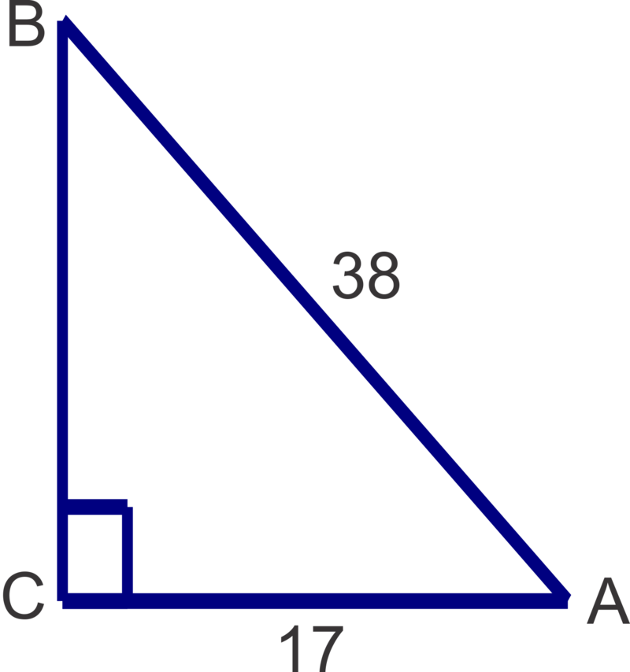

1. a. $\sin^{-1} (0.2894) \approx 17^\circ$

b. $\tan^{-1} (2.1432) \approx 65^\circ$

c. $\cos^{-1} (0.8911) \approx 27^\circ$

2. 

$$
x=\cos^{-1} \left(\frac{13}{20} \right) \approx 49^\circ; \quad y=\sin^{-1} \left(\frac{13}{20} \right) \approx 41^\circ
$$

3. 

$$
m \angle A=\cos^{-1} \left(\frac{17}{38} \right) \approx 63^\circ; \quad m \angle B=\sin^{-1} \left(\frac{17}{38} \right) \approx 27^\circ; \quad a=\sqrt{38^2-17^2} \approx 34.0
$$

**Problem Set**

Use your calculator to find the measure of angle $B$. Round answers to the nearest degree.

1.  $\tan B=0.9523$
2.  $\sin B=0.8659$
3.  $\cos B=0.1568$

Find the measures of the unknown acute angles. Round measures to the nearest degree.

4.  \[Figure 27\]
5.  \[Figure 28\]
6.  \[Figure 29\]
7.  \[Figure 30\]
8.  \[Figure 31\]
9.  \[Figure 32\]

Solve the following right triangles. Round angle measures to the nearest degree and side lengths to the nearest tenth.

10. \[Figure 33\]
11. \[Figure 34\]
12. \[Figure 35\]

Application Problems
--------------------

**Objective**

Use the Pythagorean Theorem and trigonometric ratios to solve the real world application problems.

**Guidance**

When solving word problems, it is important to understand the terminology used to describe angles. In trigonometric problems, the terms angle of elevation and angle of depression are commonly used. Both of these angles are always measured from a horizontal line as shown in the diagrams below.

An airplane approaching an airport spots the runway at an angle of depression of $25^\circ$. If the airplane is 15,000 ft above the ground, how far (ground distance) is the plane from the runway? Give your answer to the nearest 100 ft.

**Solution:** Make a diagram to illustrate the situation described and then use a trigonometric ratio to solve. Keep in mind that an angle of depression is down from a horizontal line of sight-in this case a horizontal line from the pilot of the plane parallel to the ground.

From the picture, we can see that we should use the tangent ratio to find the ground distance.

$$
\begin{align*}
\tan 25^\circ &=\frac{15000}{d} \\
d &=\frac{15000}{\tan 25^\circ} \approx 32,200 \ ft
\end{align*}
$$

**Example B**

Rachel spots a bird in a tree at an angle of elevation of $30^\circ$. If Rachel is 20 ft from the base of the tree, how high up in the tree is the bird? Give your answer to the nearest tenth of a foot.

**Solution:** Make a diagram to illustrate the situation. Keep in mind that there will be a right triangle and that the right angle is formed by the ground and the trunk of the tree.

$$
\begin{align*}
\tan 30^\circ &=\frac{h}{20} \\
h &=20 \tan 30^\circ \approx 11.5 \ ft
\end{align*}
$$

**Example C**

A 12 ft ladder is leaning against a house and reaches 10 ft up the side of the house. To the nearest degree, what angle does the ladder make with the ground?

**Solution:** In this problem, we will need to find an angle. By making a sketch of the triangle we can see which inverse trigonometric ratio to use.

\begin{align*}
\sin x^\circ &=\frac{10}{12} \\
\sin^{-1} \left(\frac{10}{12} \right) & \approx 56^\circ
\end{align*}
$$

**Guided Practice**

Use a trigonometry to solve the following application problems.

1. A ramp makes a $20^\circ$ angle with the ground. If door the ramp leads to is 2 ft above the ground, how long is the ramp? Give your answer to the nearest tenth of a foot.

2. Charlie lets out 90 ft of kite string. If the angle of elevation of the string is $70^\circ$, approximately how high is the kite? Give your answer to the nearest foot.

3. A ship’s sonar spots a wreckage at an angle of depression of $32^\circ$. If the depth of the ocean is about 250 ft, how far is the wreckage (measured along the surface of the water) from the ship, to the nearest foot.

**Answers**

1. 

$$
\begin{align*}
\sin 20^\circ &=\frac{2}{x} \\
x &=\frac{2}{\sin 20^\circ} \approx 5.8 \ ft
\end{align*}
$$

2. 

$$
\begin{align*}
\sin 70^\circ &=\frac{x}{90} \\
x &=90 \sin 70^\circ \approx 85 \ ft
\end{align*}
$$

3. 

$$
\begin{align*}
\tan 32^\circ &=\frac{250}{x} \\
x &=\frac{250}{\tan 32^\circ} \approx 400 \ ft
\end{align*}
$$

**Vocabulary**

__Angle of Elevation__

An angle measured up from a horizontal line.

__Angle of Depression__

An angle measured down from a horizontal line.

**Problem Set**

Use the Pythagorean Theorem and/or trigonometry to solve the following word problems.

1.  A square has sides of length 8 inches. To the nearest tenth of an inch, what is the length of its diagonal?
2.  Layne spots a sailboat from her fifth floor balcony, about 25 m above the beach, at an angle of depression of $3^\circ$. To the nearest meter, how far out is the boat?
3.  A zip line takes passengers on a 200 m ride from high up in the trees to a ground level platform. If the angle of elevation of the zip line is $10^\circ$, how high above ground is the tree top start platform? Give your answer to the nearest meter.
4.  The angle of depression from the top of an apartment building to the base of a fountain in a nearby park is $57^\circ$. If the building is 150 ft tall, how far away, to the nearest foot, is the fountain?
5.  A playground slide platform is 6 ft above ground. If the slide is 8 ft long and the end of the slide is 1 ft above ground, what angle does the slide make with the ground? Give your answer to the nearest degree.
6.  Benjamin spots a tree directly across the river from where he is standing. He then walks 27 ft upstream and determines that the angle between his previous position and the tree on the other side of the river is $73^\circ$. How wide, to the nearest foot, is the river?
7.  A rectangle has sides of length 6 in and 10 in. To the nearest degree, what angle does the diagonal make with the longer side?
8.  Tommy is flying his kite one afternoon and notices that he has let out the entire 130 ft of string. The angle his string makes with the ground is $48^\circ$. How high, to the nearest foot, is his kite at this time?
9.  A tree struck by lightning in a storm breaks and falls over to form a triangle with the ground. The tip of the tree makes a $18^\circ$ angle with the ground 21 ft from the base of the tree. What was the height of the tree to the nearest foot?
10. Upon descent an airplane is 19,000 ft above the ground. The air traffic control tower is 190 ft tall. It is determined that the angle of elevation from the top of the tower to the plane is $15^\circ$. To the nearest mile, find the ground distance from the airplane to the tower.
11. Why will the sine and cosine ratios always be less than 1?

</article>

### 13.2 The Unit Circle

<article>

**Objective**

To understand the concept of angles of rotation, co-terminal angles, reference angles and to find the exact value trigonometric ratios for angles that are multiples of 30 and 45 degrees given in degrees and radians.

**Review Queue**

1. Find the $m \angle A$ given the ratio.

a. $\sin A=0.9371$

b. $\tan A=3.2191$

c. $\cos A=0.7145$

2. Solve the triangle.

Introduction to Angles of Rotations, Coterminal Angles and Reference Angles
---------------------------------------------------------------------------

**Objective**

Understand the concept of an angle of rotation in the coordinate plane, identify coterminal and reference angles and find trigonometric ratios for any angle measure.

**Guidance**

Angles of rotation are formed in the coordinate plane between the positive $x$\-axis **(initial side)** and a ray **(terminal side)**. Positive angle measures represent a counterclockwise rotation while negative angles indicate a clockwise rotation.

**Example A**

Determine two coterminal angles to $837^\circ$, one positive and one negative.

**Solution:** To find coterminal angles we simply add or subtract $360^\circ$ multiple times to get the angles we desire. $837^\circ - 360^\circ = 477^\circ$, so we have a positive coterminal angle. Now we can subtract $360^\circ$ again to get $477^\circ - 360^\circ=117^\circ$.

**More Guidance**

A **reference angle** is the acute angle between the terminal side of an angle and the $x$ – axis. The diagram below shows the reference angles for terminal sides of angles in each of the four quadrants.

Note: A reference angle is never determined by the angle between the terminal side and the $y$ – axis. This is a common error for students, especially when the terminal side appears to be closer to the $y$ – axis than the $x$ – axis.

Determine the quadrant in which $-745^\circ$ lies and hence determine the reference angle.

**Solution:** Since our angle is more than one rotation, we need to add $360^\circ$ until we get an angle whose absolute value is less than $360^\circ$: $-745^\circ + 360^\circ = -385^\circ$, again $-385^\circ + 360^\circ = -25^\circ$.

Now we can plot the angle and determine the reference angle:

Note that the reference angle is positive $25^\circ$. All reference angles will be positive as they are acute angles (between $0^\circ$ and $90^\circ$).

Give two coterminal angles to $595^\circ$, one positive and one negative, find the reference angle.

**Solution:** To find the coterminal angles we can add/subtract $360^\circ$. In this case, our angle is greater than $360^\circ$ so it makes sense to subtract $360^\circ$ to get a positive coterminal angle: $595^\circ - 360^\circ = 235^\circ$. Now subtract again to get a negative angle: $235^\circ - 360^\circ = -125^\circ$.

By plotting any of these angles we can see that the terminal side lies in the third quadrant as shown.

Since the terminal side lies in the third quadrant, we need to find the angle between $180^\circ$ and $235^\circ$, so $235^\circ - 180^\circ = 55^\circ$.

1. Find two coterminal angles to $138^\circ$, one positive and one negative.

2. Find the reference angle for $895^\circ$.

3. Find the reference angle for $343^\circ$.

**Answers**

1. $138^\circ + 360^\circ = 498^\circ$ and $138^\circ - 360^\circ = -222^\circ$

2. $895^\circ - 360^\circ = 535^\circ, 535^\circ - 360^\circ = 175^\circ$. The terminal side lies in the second quadrant, so we need to determine the angle between $175^\circ$ and $180^\circ$, which is $5^\circ$.

3. $343^\circ$ is in the fourth quadrant so we need to find the angle between $343^\circ$ and $360^\circ$ which is $17^\circ$.

**Problem Set**

Find two coterminal angles to each angle measure, one positive and one negative.

1.  $-98^\circ$
2.  $475^\circ$
3.  $-210^\circ$
4.  $47^\circ$
5.  $-1022^\circ$

Determine the quadrant in which the terminal side lies and find the reference angle for each of the following angles.

6.  $102^\circ$
7.  $-400^\circ$
8.  $1307^\circ$
9.  $-820^\circ$
10. $304^\circ$
11. Explain why the reference angle for an angle between $0^\circ$ and $90^\circ$ is equal to itself.

Introduction to the Unit Circle and Radian Measure
--------------------------------------------------

**Objective**

Understand the concept of a unit circle, the meaning of one radian and to convert between radians and degrees.

**Guidance**

The unit circle is the circle centered at the origin with radius equal to one unit. This means that the distance from the origin to any point on the circle is equal to one unit.

. So a full revolution, or $360^\circ$, is equal to $2 \pi$ radians. Half a rotation, or $180^\circ$ is equal to $\pi$ radians.")

One radian is equal to the measure of $\theta$, the rotation required for the arc length intercepted by the angle to be equal to the radius of the circle. In other words the arc length is 1 unit for $\theta=1$ radian.

We can use the equality, $\pi=180^\circ$ to convert from degrees to radians and vice versa.

To convert from degrees to radians, multiply by $\frac{\pi}{180^\circ}$.

To convert from radians to degrees, multiply by $\frac{180^\circ}{\pi}$.

a. Convert $250^\circ$ to radians.

b. Convert $3 \pi$ to degrees.

**Solution:**

a. To convert from degrees to radians, multiply by $\frac{\pi}{180^\circ}$. So, $\frac{250 \pi}{180}=\frac{25 \pi}{18}$.

b. To convert from radians to degrees, multiply by $\frac{180^\circ}{\pi}$. So, $3 \pi \times \frac{180^\circ}{\pi}=3 \times 180^\circ=540^\circ$.

**Example B**

Find two angles, one positive and one negative, coterminal to $\frac{5 \pi}{3}$ and find its reference angle, in radians.

**Solution:** Since we are working in radians now we will add/subtract multiple of $2 \pi$ instead of $360^\circ$. Before we can add, we must get a common denominator of 3 as shown below.

$$
\frac{5 \pi}{3} + 2 \pi = \frac{5 \pi}{3} + \frac{6 \pi}{3} = \frac{11 \pi}{3} \quad and \quad \frac{5 \pi}{3} - 2 \pi = \frac{5 \pi}{3} - \frac{6 \pi}{3} =- \frac{\pi}{3}
$$

Now, to find the reference angle, first determine in which quadrant $\frac{5 \pi}{3}$ lies. If we think of the measures of the angles on the axes in terms of $\pi$ and more specifically, in terms of $\frac{\pi}{3}$, this task becomes a little easier.

Consider $\pi$ is equal to $\frac{3 \pi}{3}$ and $2 \pi$ is equal to $\frac{6 \pi}{3}$ as shown in the diagram. Now we can see that the terminal side of $\frac{5 \pi}{3}$ lies in the fourth quadrant and thus the reference angle will be:

$$
\frac{6 \pi}{3} - \frac{5 \pi}{3} = \frac{\pi}{3}
$$

Find two angles coterminal to $\frac{7 \pi}{6}$, one positive and one negative, and find its reference angle, in radians.

**Solution:** This time we will add multiples of $2 \pi$ with a common denominator of 6, or $\frac{2 \pi}{1} \times \frac{6}{6} = \frac{12 \pi}{6}$. For the positive angle, we add to get $\frac{7 \pi}{6} + \frac{12 \pi}{6} = \frac{19 \pi}{6}$. For the negative angle, we subtract to get $\frac{7 \pi}{6} - \frac{12 \pi}{6} = \frac{5 \pi}{6}$.

In this case $\pi$ is equal to $\frac{6 \pi}{6}$ and $2 \pi$ is equal to $\frac{12 \pi}{6}$ as shown in the diagram. Now we can see that the terminal side of $\frac{7 \pi}{6}$ lies in the third quadrant and thus the reference angle will be:

$$
\frac{7 \pi}{6} - \frac{6 \pi}{6} = \frac{\pi}{6}
$$

1. Convert the following angle measures from degrees to radians.

a. $-45^\circ$

b. $120^\circ$

c. $330^\circ$

2. Convert the following angle measures from radians to degrees.

a. $\frac{5 \pi}{6}$

b. $\frac{13 \pi}{4}$

c. $-\frac{5 \pi}{2}$

3. Find two coterminal angles to $\frac{11 \pi}{4}$, one positive and one negative, and its reference angle.

**Answers**

1. a. $-45^\circ \times \frac{\pi}{180^\circ}=-\frac{\pi}{4}$

b. $120^\circ \times \frac{\pi}{180^\circ}=\frac{2 \pi}{3}$

c. $330^\circ \times \frac{\pi}{180^\circ}=\frac{11 \pi}{6}$

2. a. $\frac{5 \pi}{6} \times \frac{180^\circ}{\pi}=150^\circ$

b. $\frac{13 \pi}{4} \times \frac{180^\circ}{\pi}=585^\circ$

c. $-\frac{5 \pi}{2} \times \frac{180^\circ}{\pi}=-450^\circ$

3. There are many possible coterminal angles, here are some possibilities:

positive coterminal angle: $\frac{11 \pi}{4} + \frac{8 \pi}{4} = \frac{19 \pi}{4}$ or $\frac{11 \pi}{4} - \frac{8 \pi}{4} = \frac{3 \pi}{4}$,

negative coterminal angle: $\frac{11 \pi}{4} - \frac{16 \pi}{4} = -\frac{5 \pi}{4}$ or $\frac{11 \pi}{4} - \frac{24 \pi}{4} = -\frac{13 \pi}{4}$

Using the coterminal angle, $\frac{3 \pi}{4}$, which is $\frac{\pi}{4}$ from $\frac{4 \pi}{4}$. So the terminal side lies in the second quadrant and the reference angle is $\frac{\pi}{4}$.

**Problem Set**

For problems 1-5, convert the angle from degrees to radians. Leave answers in terms of $\pi$.

1.  $135^\circ$
2.  $240^\circ$
3.  $-330^\circ$
4.  $450^\circ$
5.  $-315^\circ$

For problems 6-10, convert the angle measure from radians to degrees.

6.  $\frac{7 \pi}{3}$
7.  $-\frac{13 \pi}{6}$
8.  $\frac{9 \pi}{2}$
9.  $-\frac{3 \pi}{4}$
10. $\frac{5 \pi}{6}$

For problems 11-14, find two coterminal angles (one positive, one negative) and the reference angle for each angle in radians.

11. $\frac{8 \pi}{3}$
12. $\frac{11 \pi}{4}$
13. $-\frac{\pi}{6}$
14. $\frac{4 \pi}{3}$

Trigonometric Ratios on the Unit Circle
---------------------------------------

**Objective**

Determine exact value of trigonometric ratios for multiples of $0^\circ, 30^\circ$ and $45^\circ$ (or $0, \frac{\pi}{6}, \frac{\pi}{4}$ radians).

**Guidance**

Recall special right triangles from Geometry. In a $(30^\circ - 60^\circ - 90^\circ)$ triangle, the sides are in the ratio $1:\sqrt{3}:2$.

In an isosceles triangle $(45^\circ - 45^\circ - 90^\circ)$, the congruent sides and the hypotenuse are in the ratio $1:1:\sqrt{2}$.

$ triangle, the sides are in the ratio $1:\sqrt{3}:2$.")

")

\[Figure 15\]

Using these triangles, we can evaluate sine, cosine and tangent for each of the angle measures.

$$
\begin{align*}
& \sin 45^\circ = \frac{\sqrt{2}}{2} \qquad \quad \sin 60^\circ = \frac{\sqrt{3}}{2} \qquad \qquad \quad \ \ \sin 30^\circ = \frac{1}{2} \\
& \cos 45^\circ = \frac{\sqrt{2}}{2} \qquad \ \ \cos 60^\circ = \frac{1}{2} \qquad \qquad \qquad \ \ \cos 30^\circ = \frac{\sqrt{3}}{2} \\
& \tan 45^\circ = 1 \qquad \quad \ \ \tan 60^\circ = \frac{\frac{\sqrt{3}}{2}}{\frac{1}{2}}=\sqrt{3} \qquad \quad \tan 30^\circ = \frac{\frac{1}{2}}{\frac{\sqrt{3}}{2}} = \frac{\sqrt{3}}{2}
\end{align*}
$$

These triangles can now fit inside the unit circle.

$, we can see that each point is actually $(\cos \theta, \sin \theta)$, where $\theta$ is the reference angle. For example, $\sin 60^\circ=\frac{\sqrt{3}}{2}$ is the $y$ – coordinate of the point on the unit circle in the triangle with reference angle $60^\circ$. By reflecting these triangles across the axes and finding the points on the axes, we can find the trigonometric ratios of all multiples of $0^\circ, 30^\circ$ and $45^\circ$ (or $0, \frac{\pi}{6}, \frac{\pi}{4}$ radians).")

Find $\sin \frac{3 \pi}{2}$.

**Solution:** Find $\frac{3 \pi}{2}$ on the unit circle and the corresponding point is $(0, -1)$. Since each point on the unit circle is $(\cos \theta, \sin \theta), \sin \frac{3 \pi}{2}=-1$.

**Example B**

Find $\tan \frac{7 \pi}{6}$.

**Solution:** This time we need to look at the ratio $\frac{\sin \theta}{\cos \theta}$. We can use the unit circle to find $\sin \frac{7 \pi}{6}=-\frac{1}{2}$ and $\cos \frac{7 \pi}{6}=-\frac{\sqrt{3}}{2}$. Now, $\tan \frac{7 \pi}{6}=\frac{-\frac{1}{2}}{-\frac{\sqrt{3}}{2}}=\frac{1}{\sqrt{3}}=\frac{\sqrt{3}}{3}$.

**More Guidance**

Another way to approach these exact value problems is to use the reference angles and the special right triangles. The benefit of this method is that there is no need to memorize the entire unit circle. If you memorize the special right triangles, can determine reference angles and know where the ratios are positive and negative you can put the pieces together to get the ratios. Looking at the unit circle above, we see that all of the ratios are positive in Quadrant I, sine is the only positive ratio in Quadrant II, tangent is the only positive ratio in Quadrant III and cosine is the only positive ratio in Quadrant IV.

Keeping this diagram in mind will help you remember where cosine, sine and tangent are positive and negative. You can also use the pneumonic device - **A**ll **S**tudents **T**ake **C**alculus, or **ASTC**, to recall which is positive (all the others would be negative) in which quadrant.

The coordinates on the vertices will help you determine the ratios for the multiples of $90^\circ$ or $\frac{\pi}{2}$.

Find the exact values for the following trigonometric functions using the alternative method.

a. $\cos 120^\circ$

b. $\sin \frac{5 \pi}{3}$

c. $\tan \frac{7 \pi}{2}$

**Solution:**

a. First, we need to determine in which quadrant the angles lies. Since $120^\circ$ is between $90^\circ$ and $180^\circ$ it will lie in Quadrant II. Next, find the reference angle. Since we are in QII, we will subtract from $180^\circ$ to get $60^\circ$. We can use the reference angle to find the ratio, $\cos 60^\circ=\frac{1}{2}$. Since we are in QII where only sine is positive, $\cos 120^\circ=-\frac{1}{2}$.

b. This time we will need to work in terms of radians but the process is the same. The angle $\frac{5 \pi}{3}$ lies in QIV and the reference angle is $\frac{\pi}{3}$. This means that our ratio will be negative. Since $\sin \frac{\pi}{3}=\frac{\sqrt{3}}{2}, \sin \frac{5 \pi}{3}=-\frac{\sqrt{3}}{2}$.

c. The angle $\frac{7 \pi}{2}$ represents more than one entire revolution and it is equivalent to $2 \pi + \frac{3 \pi}{2}$. Since our angle is a multiple of $\frac{\pi}{2}$ we are looking at an angle on an axis. In this case, the point is $(0, -1)$. Because $\tan \theta=\frac{\sin \theta}{\cos \theta}, \tan \frac{7 \pi}{2}=\frac{-1}{0}$, which is undefined. Thus, $\tan \frac{7 \pi}{2}$ is undefined.

**Guided Practice**

Find the exact trigonometric ratios. You may use either method.

1. $\cos \frac{7 \pi}{3}$

2. $\tan \frac{9 \pi}{2}$

3. $\sin 405^\circ$

4. $\tan \frac{11 \pi}{6}$

5. $\cos \frac{2 \pi}{3}$

**Answers**

1. $\frac{7 \pi}{3}$ has a reference angle of $\frac{\pi}{3}$ in QI. $\cos \frac{\pi}{3}=\frac{1}{2}$ and since cosine is positive in QI, $\cos \frac{7 \pi}{3}=\frac{1}{2}$.

2. $\frac{9 \pi}{2}$ is coterminal to $\frac{\pi}{2}$ which has coordinates (0, 1). So $\tan \frac{9 \pi}{2}=\frac{\sin \frac{9 \pi}{2}}{\cos \frac{9 \pi}{2}}=\frac{1}{0}$ which is undefined.

3. $405^\circ$ has a reference angle of $45^\circ$ in QI. $\sin 45^\circ=\frac{\sqrt{2}}{2}$ and since sine is positive in QI, $\sin 405^\circ=\frac{\sqrt{2}}{2}$.

4. $\frac{11 \pi}{6}$ is coterminal to $\frac{\pi}{6}$ in QIV. $\tan \frac{\pi}{6}=\frac{\sqrt{3}}{3}$ and since tangent is negative in QIV, $\tan \frac{11 \pi}{6}=-\frac{\sqrt{3}}{3}$.

5. $\frac{2 \pi}{3}$ is coterminal to $\frac{\pi}{3}$ in QII. $\cos \frac{\pi}{3}=\frac{1}{2}$ and since cosine is negative in QII, $\cos \frac{2 \pi}{3}=\frac{1}{2}$.

**Problem Set**

Find the exact values for the following trigonometric functions.

1.  $\sin \frac{3 \pi}{4}$
2.  $\cos \frac{3 \pi}{2}$
3.  $\tan 300^\circ$
4.  $\sin 150^\circ$
5.  $\cos \frac{4 \pi}{3}$
6.  $\tan \pi$
7.  $\cos \left(-\frac{15 \pi}{4}\right)$
8.  $\sin 225^\circ$
9.  $\tan \frac{7 \pi}{6}$
10. $\sin 315^\circ$
11. $\cos 450^\circ$
12. $\sin \left(-\frac{7 \pi}{2}\right)$
13. $\cos \frac{17 \pi}{6}$
14. $\tan 270^\circ$
15. $\sin(-210^\circ)$

Reciprocal Trigonometric Functions
----------------------------------

**Objective**

Determine the ratios of the reciprocal trigonometric ratios cosecant, secant and cotangent for angles that are multiples of $0^\circ, 30^\circ$ and $45^\circ$ (or $0, \frac{\pi}{6}, \frac{\pi}{4}$ radians) without a calculator and evaluate the reciprocal trigonometric functions for all other angles using the calculator.

**Guidance**

Each of the trigonometric ratios has a reciprocal function associated with it as shown below.

The reciprocal of sine is cosecant: $\frac{1}{\sin \theta}=\csc \theta$, so $\csc \theta=\frac{H}{O}$ (hypotenuse over opposite)

The reciprocal of cosine is secant: $\frac{1}{\cos \theta}=\sec \theta$, so $\sec \theta=\frac{H}{A}$ (hypotenuse over adjacent)

The reciprocal of tangent is cotangent: $\frac{1}{\tan \theta}=\cot \theta$, so $\cot \theta=\frac{A}{O}$ (adjacent over opposite)

**Example A**

Use your calculator to evaluate $\sec \frac{2 \pi}{5}$.

**Solution:** First, be sure that your calculator is in radian mode. To check/change the mode, press the MODE button and make sure RADIAN is highlighted. If it is not, use the arrow keys to move the cursor to RADIANS and press enter to select RADIAN as the mode. Now we are ready to use the calculator to evaluate the reciprocal trig function. Since the calculator does not have a button for secant, however, we must utilize the reciprocal relationship between cosine and secant:

$$
\text{Since}\ \sec \theta=\frac{1}{\cos \theta}, \sec \frac{2 \pi}{5}=\frac{1}{\cos \frac{2 \pi}{5}}=3.2361.
$$

**Example B**

Use you calculator to evaluate $\cot 100^\circ$.

**Solution:** This time we will need to be in degree mode. After the mode has been changed we can use the reciprocal of cotangent, which is tangent, to evaluate as shown:

$$
\text{Since}\ \cot \theta=\frac{1}{\tan \theta}, \cot 100^\circ=\frac{1}{\tan 100^\circ} \approx -0.1763.
$$

**Example C**

Find the exact value of $\csc \frac{5 \pi}{3}$ without using a calculator. Give your answer in exact form.

**Solution:** The reciprocal of cosecant is sine so we will first find $\sin \frac{5 \pi}{3}$ Using either the unit circle or the alternative method, we can determine that $\sin \frac{5 \pi}{3}$ is $-\frac{\sqrt{3}}{2}$ using a $60^\circ$ reference angle in the fourth quadrant. Now, find its reciprocal: $\frac{1}{-\frac{\sqrt{3}}{2}}=-\frac{2}{\sqrt{3}}=-\frac{2 \sqrt{3}}{3}$.

**Guided Practice**

Use your calculator to evaluate the following reciprocal trigonometric functions.

1. $\csc \frac{7 \pi}{8}$

2. $\cot 85^\circ$

Evaluate the following without using a calculator. Give all answers in exact form.

3. $\sec 225^\circ$

4. $\csc \frac{5 \pi}{6}$

**Answers**

1. $\csc \frac{7 \pi}{8}=\frac{1}{\sin \frac{7 \pi}{8}}=2.6131$

2. $\cot 85^\circ=\frac{1}{\tan 85^\circ}=0.0875$

3. $\sec 225^\circ$ is the reciprocal of $\cot 225^\circ$, a $45^\circ$ reference angle in quadrant three where cosine is negative. Because $\cos 45^\circ=\frac{1}{\sqrt{2}}, \cos 225^\circ=-\frac{1}{\sqrt{2}}$, and $\sec 225^\circ=-\sqrt{2}$.

4. $\csc \frac{5 \pi}{6}$ is the reciprocal of $\sin \frac{5 \pi}{6}$, a $\frac{\pi}{6}$ or $30^\circ$ reference angle in the second quadrant where sine is positive. Because $\sin \frac{\pi}{6}=\frac{1}{2}, \sin \frac{5 \pi}{6}=\frac{1}{2},$ and $\csc \frac{5 \pi}{6}=2$.

**Problem Set**

Use your calculator to evaluate the reciprocal trigonometric functions. Round your answers to four decimal places.

1.  $\csc 95^\circ$
2.  $\cot 278^\circ$
3.  $\sec \frac{14 \pi}{5}$
4.  $\cot(-245^\circ)$
5.  $\sec \frac{6 \pi}{7}$
6.  $\csc \frac{23 \pi}{13}$
7.  $\cot 333^\circ$
8.  $\csc \frac{9 \pi}{5}$

Evaluate the following trigonometric functions without using a calculator. Give your answers exactly.

9.  $\sec \frac{5 \pi}{6}$
10. $\csc \left(-\frac{3 \pi}{2}\right)$
11. $\cot 225^\circ$
12. $\sec \frac{11 \pi}{3}$
13. $\csc \frac{7 \pi}{6}$
14. $\sec 270^\circ$
15. $\cot \frac{5 \pi}{3}$
16. $\csc 315^\circ$

Inverse Trigonometric Functions
-------------------------------

**Objective**

Determine the angle(s) given the exact value trigonometric ratios for angles that are multiples of $0^\circ, 30^\circ$ and $45^\circ$ (or $0, \frac{\pi}{6}, \frac{\pi}{4}$ radians).

**Guidance**

Earlier in the unit we learned how to find the measure of an acute angle in a right triangle using the inverse trigonometric ratios on the calculator. Now we will extend this inverse concept to finding the possible angle measures given a trigonometric ratio on the unit circle. We say possible, because there are an infinite number of possible angles with the same ratios. Think of the unit circle. For which angles does $\sin \theta=\frac{1}{2}$? From the special right triangles, we know that the reference angle must be $30^\circ$ or $\frac{\pi}{6}$. But because sine is positive in the first and second quadrants, the angle could also be $150^\circ$ or $\frac{5 \pi}{6}$. In fact, we could take either of these angles and add or subtract $360^\circ$ or $2 \pi$ to it any number of times and still have a coterminal angle for which the sine ratio would remain $\frac{1}{2}$. For problems in this concept we will specify a finite interval for the possible angles measures. In general, this interval will be $0 \le \theta < 360^\circ$ for degree measures and $0 \le \theta < 2 \pi$ for radian measures.

**Inverse Trigonometric Ratios on the Calculator**

When you use the calculator to find an angle given a ratio, the calculator can only give one angle measure. The answers for the respective functions will always be in the following quadrants based on the sign of the ratio.

| **Trigonometric Ratio** | **Positive Ratios** | **Negative Ratios** |
| --- | --- | --- |
| Sine | $0 \le \theta \le 90$ or $0 \le \theta \le \frac{\pi}{2}$ | $-90 \le \theta \le 0$ or $-\frac{\pi}{2} \le \theta \le 0$ |
| Cosine | $0 \le \theta \le 90$ or $0 \le \theta \le \frac{\pi}{2}$ | $90 < \theta \le 180^\circ$ or $\frac{\pi}{2} < \theta \le \pi$ |
| Tangent | $0 \le \theta \le 90$ or $0 \le \theta \le \frac{\pi}{2}$ | $-90 \le \theta < 0$ or $-\frac{\pi}{2} \le \theta < 0$ |

**Example A**

Use your calculator to find all solutions on the interval $0 \le \theta < 360^\circ$. Round your answers to the nearest tenth.

a. $\cos^{-1} (0.5437)$

b. $\tan^{-1}(-3.1243)$

c. $\csc^{-1}(3.0156)$

**Solution:** For all of these, we must first make sure the calculator is in degree mode.

a. Type in $2^{nd} \text{COS}$, to get $\cos^{-1}($ on your calculator screen. Next, type in the ratio to get $\cos^{-1} (0.5437)$ on the calculator and press ENTER. The result is $57.1^\circ$. This is an angle in the first quadrant and a reference angle. We want to have all the possible angles on the interval $0 \le \theta < 360^\circ$. To find the second angle, we need to think about where else cosine is positive. This is in the fourth quadrant. Since the reference angle is $57.1^\circ$, we can find the angle by subtracting $57.1^\circ$ from $360^\circ$ to get $302.9^\circ$ as our second angle. So $\cos^{-1}(0.5437)=57.1^\circ, 302.9^\circ$.

b. Evaluate $\tan^{-1}(-3.1243)$ on the calculator using the same process to get $-72.3^\circ$. This is a $72.3^\circ$ reference angle in the fourth quadrant. Since we want all possible answers on the interval $0 \le \theta < 360^\circ$, we need angles with reference angles of $72.3^\circ$ in the second and fourth quadrants where tangent is negative.

$2^{nd}$ quadrant: $180^\circ - 72.3^\circ = 107.7^\circ$ and $4^{th}$ quadrant: $360^\circ - 72.3^\circ = 287.7^\circ$

So, $\tan^{-1}(-3.1243)=107.7^\circ, 287.7^\circ$

c. This time we have a reciprocal trigonometric function. Recall that $\sin \theta=\frac{1}{\csc \theta}$. In this case, $\csc \theta=3.0156$ so $\sin \theta=\frac{1}{3.0156}$ and therefore $\csc^{-1}(3.0156)=\sin^{-1} \left(\frac{1}{3.0156}\right)=19.4^\circ$ from the calculator. Now, we need to find our second possible angle measure. Since sine (and subsequently, cosecant) is positive in the second quadrant, that is where our second answer lies. The reference angle is $19.4^\circ$ so the angle is $180^\circ -19.4^\circ=160.6^\circ$. So, $\csc^{-1}(3.0156)=19.4^\circ, 160.6^\circ$.

**Example B**

Use your calculator to find $\theta$, to two decimal places, where $0 \le \theta < 2 \pi$.

a. $\sec \theta = 2.1647$

b. $\sin \theta =-1.0034$

c. $\cot \theta =-1.5632$

**Solution:** For each these, we will need to be in radian mode on the calculator.

a. Since $\cos \theta=\frac{1}{\sec \theta}, \sec^{-1}(2.1647)=\cos^{-1} \left(\frac{1}{2.1647}\right)=1.09$ radians. This is a first quadrant value and thus the reference angle as well. Since cosine (and subsequently, secant) is also positive in the fourth quadrant, we can find the second answer by subtracting from $2 \pi$: $2 \pi -1.09=5.19$.

Hence, $\sec^{-1}(2.1647)=1.09, 5.19$

b. From the calculator, $\sin^{-1}(-0.3487)=-0.36$ radians, a fourth quadrant reference angle of 0.36 radians. Now we can use this reference angle to find angles in the third and fourth quadrants within the interval given for $\theta$.

$3^{rd}$ quadrant: $\pi+0.36=3.50$ and $4^{th}$ quadrant: $2 \pi -0.36=5.92$

So, $\sin^{-1}(-0.3487)=3.50, 5.92$

c. Here, $\tan \theta=\frac{1}{\cot \theta}$, so $\cot^{-1}(-1.5632)=\tan^{-1}\left(-\frac{1}{1.5632}\right)=-0.57$, a fourth quadrant reference angle of 0.57 radians. Since the ratio is negative and tangent and cotangent are both negative in the $2^{nd}$ and $4^{th}$ quadrants, those are the angles we must find.

$2^{nd}$ quadrant: $\pi - 0.57=2.57$ and $4^{th}$ quadrant: $2 \pi-0.57=5.71$

So, $\cot^{-1}(-1.5632)=2.57, 5.71$

**Example C**

Without using a calculator, find $\theta$, where $0 \le \theta < 2 \pi$.

a. $\sin \theta=-\frac{\sqrt{3}}{2}$

b. $\cos \theta=\frac{\sqrt{2}}{2}$

c. $\tan \theta=-\frac{\sqrt{3}}{3}$

d. $\csc \theta=-2$

**Solution:**

a. From the special right triangles, sine has the ratio $\frac{\sqrt{3}}{2}$ for the reference angle $\frac{\pi}{3}$. Now we can use this reference angle to find angles in the $3^{rd}$ and $4^{th}$ quadrant where sine is negative.

$3^{rd}$ quadrant: $\pi + \frac{\pi}{3}=\frac{4 \pi}{3}$ and $4^{th}$ quadrant: $2 \pi -\frac{\pi}{3}=\frac{5 \pi}{3}$

So, $\theta=\frac{4 \pi}{3}, \frac{5 \pi}{3}.$

b. From the special right triangles, cosine has the ratio $\frac{\sqrt{2}}{2}$ for the reference angle $\frac{\pi}{4}$. Since cosine is positive in the first and fourth quadrants, one answer is $\frac{\pi}{4}$ and the second answer ($4^{th}$ quadrant) will be $2 \pi -\frac{\pi}{4}=\frac{7 \pi}{4}$. So, $\theta=\frac{\pi}{4}, \frac{7 \pi}{4}$.

c. From the special right triangles, tangent has the ratio $\frac{\sqrt{3}}{3}$ for the reference angle $\frac{\pi}{6}$. Since tangent is negative in the second and fourth quadrants, we will subtract $\frac{\pi}{6}$ from $\pi$ and $2 \pi$ to find the angles.

$\pi -\frac{\pi}{6}=\frac{5 \pi}{6}$ and $2 \pi -\frac{\pi}{6}=\frac{11 \pi}{6}$. So, $\theta = \frac{5 \pi}{6}, \frac{11 \pi}{6}$.

d. First, consider that if $\csc \theta=-2$, then $\sin \theta=-\frac{1}{2}$. Next, from special right triangles, we know that sine is $\frac{1}{2}$ for a $\frac{\pi}{6}$ reference angle. Finally, find the angles with a reference angle of $\frac{\pi}{6}$ in the third and fourth quadrants where sine is negative. $\pi + \frac{\pi}{6}=\frac{7 \pi}{6}$ and $2 \pi -\frac{\pi}{6}=\frac{11 \pi}{6}$. So, $\theta=\frac{7 \pi}{6}, \frac{11 \pi}{6}$.

**Guided Practice**

1. Use your calculator to find all solutions on the interval $0 \le \theta < 360^\circ$. Round your answers to the nearest tenth.

a. $\sin^{-1}(0.7821)$

b. $\cot^{-1}(-0.6813)$

c. $\sec^{-1}(4.0159)$

2. Use your calculator to find $\theta$, to two decimal places, where $0 \le \theta < 2 \pi$.

a. $\cos \theta=-0.9137$

b. $\tan \theta=5.0291$

c. $\csc \theta=2.1088$

3. Without using a calculator, find $\theta$, where $0 \le \theta < 2 \pi$.

a. $\cos \theta=-\frac{\sqrt{3}}{2}$

b. $\cot \theta=\frac{\sqrt{3}}{3}$

c. $\sin \theta=-1$

**Answers**

1. a. $51.5^\circ$ and $180^\circ - 51.5^\circ=128^\circ$

b. $\cot^{-1}(-0.6813)=\tan^{-1} \left(-\frac{1}{0.6813} \right)=-55.7^\circ, 180^\circ-55.7^\circ=124.3^\circ$ and $360^\circ -55.7^\circ=304.3^\circ$

c. $\sec^{-1}(4.0159)=\cos^{-1} \left(\frac{1}{4.0159}\right)=75.6^\circ$ and $360^\circ -75.6^\circ=284.4^\circ$

2. a. $\cos^{-1}(-0.9137)=2.72$ and $\pi+2.72=30.34$

b. $\tan^{-1}(5.0291)=1.37$ and $\pi+1.37=4.51$

c. $\csc^{-1}(2.1088)=\sin^{-1} \left(\frac{1}{2.1088}\right)=0.49$ and $\pi-0.49=2.65$

3. a. $\cos^{-1} \left(\frac{\sqrt{3}}{2}\right)=\frac{\pi}{6}$, since the ratio is negative, $\theta=\pi -\frac{\pi}{6}=\frac{5 \pi}{6}$ and $\pi + \frac{\pi}{6}=\frac{7 \pi}{6}$

b. $\cot^{-1}\left(\frac{\sqrt{3}}{3}\right)=\tan^{-1} \sqrt{3}=\frac{\pi}{3}, \theta =\frac{\pi}{3}$, and $\pi + \frac{\pi}{3}=\frac{4 \pi}{3}$

c. $\sin^{-1}(-1)=\frac{3 \pi}{2}, \theta=\frac{3 \pi}{2}$

**Problem Set**

For problems 1-6, use your calculator to find all solutions on the interval $0 \le \theta < 360^\circ$. Round your answers to the nearest tenth.

1.  $\cos^{-1}(-0.2182)$
2.  $\sec^{-1}(10.8152)$
3.  $\tan^{-1}(-20.2183)$
4.  $\sin^{-1}(0.8785)$
5.  $\csc^{-1}(-6.9187)$
6.  $\cot^{-1}(0.8316)$

For problems 7-12, use your calculator to find $\theta$, to two decimal places, where $0 \le \theta < 2 \pi$.

7.  $\sin \theta=-0.6153$
8.  $\cos \theta=0.1382$
9.  $\cot \theta=-2.8135$
10. $\sec \theta=-8.8775$
11. $\tan \theta=0.9990$
12. $\csc \theta=12.1385$

For problems 13-18, find $\theta$, without using a calculator, where $0 \le \theta < 2 \pi$.

13. $\sin \theta=0$
14. $\cos \theta=-\frac{\sqrt{2}}{2}$
15. $\tan \theta=-1$
16. $\sec \theta=\frac{2 \sqrt{3}}{3}$
17. $\sin \theta=\frac{1}{2}$
18. $\cot \theta=\text{undefined}$
19. $\cos \theta=-\frac{1}{2}$
20. $\csc \theta=\sqrt{2}$
21. $\tan \theta=\frac{\sqrt{3}}{3}$

</article>

### 13.3 Introduction to Polar Coordinates

<article>

**Objective**

Understand the concept that points in the coordinate plane can be identified using Cartesian or $(x, y)$ coordinates, or using their distance from the origin and angle of rotation, as polar coordinates.

**Review Queue**

Evaluate the following trigonometric ratios. Give your answers exactly.

1. $\csc \frac{7 \pi}{6}$

2. $\tan \frac{3 \pi}{2}$

3. $\sec \pi$

Find all solutions for $\theta$ on the interval $\theta \le \theta < 2 \pi$.

4. $\cos \theta=\frac{\sqrt{3}}{2}$

5. $\sin \theta=\left(-\frac{\sqrt{2}}{2} \right)$

6. $\cot \theta=\frac{\sqrt{3}}{3}$

Trigonometric Ratios of Points on the Terminal Side of an Angle
---------------------------------------------------------------

**Objective**

Determine the equivalent Polar coordinates for a point given as an ordered pair in Cartesian form. In other words, determine to angle of rotation and radius (distance from the origin) of any point in the rectangular coordinate plane.

**Guidance**

Any point in the coordinate plane can be represented by its angle of rotation and radius, or distance from the origin. The point is said to lie on the terminal side of the angle. We can find the measure of the reference angle using right triangle trigonometry. When the point is identified in this manner we call the coordinates Polar coordinates. They are written as $(r, \theta)$, where $r$ is the radius and $\theta$ is the angle of rotation. The angle of rotation can be given in degrees or radians.

**Example A**

Find the angle of rotation (in degrees) and radius (distance from the origin) of the point $(-3, 6)$.

**Solution:** First, make a sketch, plot the point and drop a perpendicular to the $x$\-axis to make a right triangle.

=63.4^\circ$ is the reference angle so the angle of rotation is $180^\circ-63.4^\circ=116.6^\circ$.")

The radius or distance from the origin is the hypotenuse of the right triangle.

$$
\begin{align*}
r^2 &=(-3)^2+(6)^2 \\
r^2 &=45 \\
r &=\sqrt{45}=3\sqrt{5}
\end{align*}
$$

Using this information, we can write the point $(-3, 6)$ in Polar coordinate form as $\left ( 3 \sqrt{5}, 116.6^\circ \right )$

**Example B**

Write the Cartesian coordinates, $(3, -4)$, in Polar form. Give the angle in degrees.

**Solution:** Again, start with a sketch.

We can find the reference angle again using tangent: $\tan^{-1} \left(\frac{-4}{3} \right)=-53.1^\circ$. So the angle of rotation is $360^\circ-53.1^\circ=306.9^\circ$

Now find the radius:

$$
\begin{align*}
r^2 &=3^2+(-4)^2 \\
r^2 &=25 \\
r &=\sqrt{25}=5
\end{align*}
$$

The Polar coordinates are thus $(5, 306.9^\circ)$

$:")

The reference angle can be found using, $\theta=\tan^{-1} \left(\frac{y}{x} \right)$ and then the angle of rotation can be found by placing the reference angle in the appropriate quadrant and giving a positive angle of rotation from the positive $x$ – axis $(0^\circ \le \theta < 360^\circ$ or $0 \le \theta < 2 \pi)$. The radius is always $r=\sqrt{x^2+y^2}$ and should be given in reduced radical form.

**Example C**

Given the point $(-9, -5)$ on the terminal side of an angle, find the Polar coordinates (in radians) of the point and the six trigonometric ratios for the angle.

**Solution:** Make sure your calculator is in radian mode. Using the shortcut, we can find the Polar coordinates:

$\tan^{-1} \left(\frac{5}{9} \right)=0.51$. Since $x$ and $y$ are both negative, the point lies in the third quadrant which makes the angle of rotation $\pi+0.51=3.65$. The radius will be $r=\sqrt{9^2+5^2}=\sqrt{106}$. The Polar coordinates are $\left(\sqrt{106}, 3.65\right)$. As for the six trigonometric ratios, a diagram will help us:

Now we can use the hypotenuse, $\sqrt{106}$ to find the other ratios:

$\sin 3.65 =\frac{-5}{\sqrt{106}}=-\frac{5 \sqrt{106}}{106}$ and $\csc 3.65=-\frac{\sqrt{106}}{5}$.

$\cos 3.65 =\frac{-9}{\sqrt{106}}=-\frac{9 \sqrt{106}}{106}$ and $\sec 3.65=-\frac{\sqrt{106}}{9}$

**Guided Practice**

1. Find the angle of rotation (in degrees) and radius (distance from the origin) of the point $(7, 24)$.

2. Write the Cartesian coordinates, $(-8, -15)$, in Polar form(in radians) and find the six trigonometric ratios for the angle.

3. Given the point $(12, -4)$ on the terminal side of an angle, find the Polar coordinates (in degrees) of the point and the six trigonometric ratios for the angle.

**Answers**

1. $r=\sqrt{7^2+24^2}=25$, $\theta=\tan^{-1} \left(\frac{24}{7} \right) \approx 73.7^\circ$

2. $r=\sqrt{(-8)^2+(-15)^2}=17$ and $\theta=\tan^{-1} \left(\frac{-15}{-8} \right) \approx 1.08$ so the polar coordinates are $(17, 1.08)$.

The six trigonometric ratios are: 

$$
\begin{align*}
\sin 1.08 &=-\frac{15}{17} \quad \csc 1.08 =-\frac{17}{15} \\
\cos 1.08 &=-\frac{8}{17} \quad \sec 1.08 =-\frac{8}{15} \\
\tan 1.08 &=\frac{15}{8} \quad \ \ \cot 1.08 =-\frac{8}{15}
\end{align*}
$$

3. $r=\sqrt{12^2+(-4)^2}=4 \sqrt{10}$ and $\theta=\tan^{-1} \left(\frac{-4}{12} \right) \approx 341.6^\circ$ so the polar coordinates are $\left(4 \sqrt{10}, 341.6^\circ\right)$.

The six trigonometric ratios are: 

$$
\begin{align*}
\sin 341.6^\circ &=-\frac{\sqrt{10}}{10} \quad \csc 341.6^\circ=-\sqrt{10} \\
\cos 341.6^\circ &=\frac{3 \sqrt{10}}{10} \quad \csc 341.6^\circ=\frac{\sqrt{10}}{3} \\
\tan 341.6^\circ &=-\frac{1}{3} \quad \ \ \ \tan 341.6^\circ=-3
\end{align*}
$$

**Problem Set**

Angle measures should be rounded to the dearest degree or hundredth of a radian or given exactly if possible. All values of $r$ should be given in reduced radical form.

Write the following Cartesian coordinate pairs in Polar form. Use degrees for problems 1 and 2 and radians for problems 3 and 4.

1.  $(16, -30)$
2.  $(5, 5)$
3.  $(-5, -12)$
4.  $(-9, 40)$

Given the points on the terminal side of an angle, find the Polar coordinates (in degrees) of the point and the six trigonometric ratios for the angles.

5.  $(-6, 8)$
6.  $(0, -15)$
7.  $(10, -8)$
8.  $\left(4 \sqrt{3}, 4\right)$

Given the points on the terminal side of an angle, find the Polar coordinates (in radians) of the point and the six trigonometric ratios for the angles.

9.  $(-9, 0)$
10. $(13, -13)$
11. $(2, 3)$
12. $\left(-7, -7 \sqrt{3}\right)$

Using r and θ to find a Point in the Coordinate Plane
-----------------------------------------------------

**Objective**

Given the radius and angle of rotation $\theta$ of a point in the coordinate plane (polar coordinates), determine the Cartesian or rectangular coordinates of the point.

**Guidance**

In this concept we will convert Polar coordinates to Cartesian coordinates. Essentially we will reverse the process used in the previous concept.

**Example A**

Given the point $(6, 120^\circ)$, find the equivalent Cartesian coordinates.

**Solution:** First, consider the diagram below and the right triangle formed by a perpendicular segment to the $x$\-axis and hypotenuse equal to the radius. We can find the legs of the right triangle using right triangle trigonometry and thus the $x$ and $y$ coordinates of the point.

From the diagram we can see that the reference angle is $60^\circ$. Now we can use right triangle trigonometry to find $x$ and $y$. In this particular case, we can also use special right triangle ratios or the unit circle.

$$
\begin{align*}
\cos 60^\circ &=\frac{x}{6} \qquad \qquad \qquad \qquad \qquad \qquad \qquad \ \ \sin 60^\circ =\frac{y}{6} \\
x &=6 \cos 60^\circ=6 \left(\frac{1}{2} \right)=3 \qquad and \qquad \ \ \qquad y =6 \cos 60^\circ =6 \left(\frac{\sqrt{3}}{2} \right)=3\sqrt{3}
\end{align*}
$$

Since the point is in the second quadrant, the $x$ value should be negative giving the Cartesian coordinates $\left(-3, 3 \sqrt{3}\right)$.

Recall that every point on the unit circle was $(\cos \theta, \sin \theta)$, where $\theta$ represented the angle of rotation from the positive $x$ axis and the radius (distance from the origin) was 1. In these problems, our radius varies as we are no longer restricted to the unit circle. In the previous example, observe that the coordinates $(x, y)$ are essentially $(6 \cos 60^\circ, 6 \sin 60^\circ)$ where 6 was the radius and $60^\circ$ was the reference angle. We could have used the angle of rotation, $120^\circ$, and the only difference would be that the cosine ratio would be negative which would automatically make the $x$ coordinate negative. We can generalize this into a rule for converting from Polar coordinates to Cartesian coordinates:

$$
(r, \theta)=(r \cos \theta, r \sin \theta)
$$

**Example B**

Given the point, $(10, -220^\circ)$, find the Cartesian coordinates.

**Solution:** Using the rule with $r=10$ and $\theta=220^\circ$ and the calculator:

$$
(10 \cos(-220^\circ), 10 \sin(-220^\circ))=(-7.66, 6.43)
$$

**Example C**

Given the point, $\left(9, \frac{11 \pi}{6} \right)$, find the exact value of the Cartesian coordinates.

**Solution:** This time $r=9$ and $\theta=\frac{11 \pi}{6}$. So, $\left( 9 \cos \frac{11 \pi}{6}, 9 \sin \frac{11 \pi}{6} \right)=\left(9 \left(\frac{\sqrt{3}}{2} \right), 9 \left(-\frac{1}{2} \right) \right)=\left(\frac{9 \sqrt{3}}{2}, - \frac{9}{2} \right)$.

**Guided Practice**

1. Use your calculator to find the Cartesian coordinates equivalent to the Polar coordinates $(11, 157^\circ)$.

2. Find the exact value of the Cartesian coordinates equivalent to the Polar coordinates $(8, 45^\circ)$.

3. Find the exact value of the Cartesian coordinates equivalent to the Polar coordinates $\left(5, - \frac{\pi}{2} \right)$.

**Answers**

1. $(11 \cos 157^\circ, 11 \sin 157^\circ) \approx (-10.13, 4.30)$

2. $(8 \cos 45^\circ, 8 \sin 45^\circ)=\left(8 \left(\frac{\sqrt{2}}{2} \right), 8 \left(\frac{\sqrt{2}}{2} \right) \right)=(4 \sqrt{2}, 4 \sqrt{2})$

3. $\left(5 \cos \left(-\frac{\pi}{2} \right), 5 \sin \left(-\frac{\pi}{2} \right) \right)=(5(0), 5(-1))=(0, -5)$

**Problem Set**

Use your calculator to find the Cartesian coordinates equivalent to the following Polar coordinates. Give your answers rounded to the nearest hundredth.

1.  $(13, 38^\circ)$
2.  $(25, -230^\circ)$
3.  $(17, 345^\circ)$
4.  $(2, 140^\circ)$
5.  $\left(7, \frac{2 \pi}{5} \right)$
6.  $(9, 2.98)$
7.  $(3, -5.87)$
8.  $\left(10, \frac{13 \pi}{7} \right)$

Find the exact value Cartesian coordinates equivalent to the following Polar coordinates.

9.  $\left(5, \frac{\pi}{3} \right)$
10. $\left(6, -\frac{\pi}{4} \right)$
11. $\left(12, \frac{5 \pi}{6} \right)$
12. $(7, \pi)$
13. $(11, 2 \pi)$
14. $\left(14, \frac{4 \pi}{3} \right)$
15. $\left(27, \frac{3 \pi}{4} \right)$
16. $\left(40, -\frac{5 \pi}{6} \right)$

</article>

### 13.4 The Law of Sines

<article>

**Objective**

Use the Law of Sines proportion to solve non right triangles and find the area of triangles.

**Review Queue**

Evaluate the following trig functions. Give exact answers.

1. $\sin 225^\circ$

2. $\csc 300^\circ$

3. $\sec \frac{5 \pi}{6}$

4. $\tan \pi$

Law of Sines with AAS and ASA
-----------------------------

**Objective**

Derive the Law of Sines proportion and use it to solve non right triangles in which two angles and one side are given.

**Guidance**

Consider the non right triangle below. We can construct an altitude from any one of the vertices to divide the triangle into two right triangles as show below.

$$
\begin{align*}
\sin C&=\frac{h}{b} \qquad and \qquad \sin B=\frac{h}{c}\\
b \sin C&=h \qquad \qquad \quad \ c \sin B=h
\end{align*}
$$

Since both are equal to $h$, we can set them equal to each other to get:

$b \sin C=c \sin B$ and finally divide both sides by $bc$ to create the proportion:

$$
\frac{\sin C}{c}=\frac{\sin B}{b}
$$

If we construct the altitude from a different vertex, say $B$, we would get the proportion: $\frac{\sin A}{a}=\frac{\sin C}{c}$. Now, the transitive property allows us to conclude that $\frac{\sin A}{a}=\frac{\sin B}{b}$. We can put them all together as the Law of Sines: $\frac{\sin A}{a}=\frac{\sin B}{b}=\frac{\sin C}{c}$. In the examples that follow we will use the Law of Sines to solve triangles.

**Example A**

Solve the triangle.

$$
\frac{\sin 65^\circ}{a}=\frac{\sin 70^\circ}{15}=\frac{\sin 45^\circ}{c}
$$

Taking two ratios at a time we can solve the proportions to find $a$ and $c$ using cross multiplication.

To find $a$:

$$
\begin{align*}
\frac{\sin 65^\circ}{a}&=\frac{\sin 70^\circ}{15} \\
a&=\frac{15 \sin65^\circ}{\sin 70^\circ} \approx 14.5
\end{align*}
$$

To find $c$:

$$
\begin{align*}
\frac{\sin 70^\circ}{15}&=\frac{\sin 45^\circ}{c} \\
c&=\frac{15 \sin45^\circ}{\sin 70^\circ} \approx 11.3
\end{align*}
$$

This particular triangle is an example in which we are given two angles and the non-included side or AAS (also SAA).

**Example B**

Solve the triangle.

Second, write out the appropriate proportions to solve for the unknown sides, $a$ and $b$.

To find $a$:

$$
\begin{align*}
\frac{\sin 80^\circ}{a}&=\frac{\sin 50^\circ}{20} \\
a&=\frac{20 \sin80^\circ}{\sin 50^\circ} \approx 25.7
\end{align*}
$$

To find $b$:

$$
\begin{align*}
\frac{\sin 50^\circ}{b}&=\frac{\sin 50^\circ}{20} \\
b&=\frac{20 \sin50^\circ}{\sin 50^\circ} = 20
\end{align*}
$$

Notice that $c=b$ and $m \angle C=m \angle B$. This illustrates a property of isosceles triangles that states that the base angles (the angles opposite the congruent sides) are also congruent.

**Example C**

Three fishing ships in a fleet are out on the ocean. The Chester is 32 km from the Angela. An officer on the Chester measures the angle between the Angela and the Beverly to be $25^\circ$. An officer on the Beverly measures the angle between the Angela and the Chester to be $100^\circ$. How far apart, to the nearest kilometer are the Chester and the Beverly?

**Solution:** First, draw a picture. Keep in mind that when we say that an officer on one of the ships is measuring an angle, the angle she is measuring is at the vertex where her ship is located.

The angle at the Angela is $180^\circ - 100^\circ - 25^\circ = 55^\circ$.

Now find $x$,

$$
\begin{align*}
\frac{\sin 55^\circ}{x}&=\frac{\sin 100^\circ}{32} \\
x&=\frac{32 \sin 55^\circ}{\sin 100^\circ} \approx 27
\end{align*}
$$

The Beverly and the Chester are about 27 km apart.

**Guided Practice**

Solve the triangles.

1. ")

\[Figure 6\]

3. A surveying team is measuring the distance between point $A$ on one side of a river and point $B$ on the far side of the river. One surveyor is positioned at point $A$ and the second surveyor is positioned at point $C$, 65 m up the riverbank from point $A$. The surveyor at point $A$ measures the angle between points $B$ and $C$ to be $103^\circ$. The surveyor at point $C$ measures the angle between points $A$ and $B$ to be $42^\circ$. Find the distance between points $A$ and $B$.

**Answers**

1. $m \angle A=180^\circ - 82^\circ -24^\circ =74^\circ$

$$
\begin{align*}
\frac{\sin 24^\circ}{b}&=\frac{\sin 74^\circ}{11}, \ \text{so} \ b=\frac{11 \sin 24^\circ}{\sin 74^\circ} \approx 4.7 \\
\frac{\sin 82^\circ}{c}&=\frac{\sin 74^\circ}{11}, \ \text{so} \ c=\frac{11 \sin 82^\circ}{\sin 74^\circ} \approx 11.3
\end{align*}
$$

2. $m \angle C=180^\circ - 110^\circ -38^\circ =32^\circ$

$$
\begin{align*}
\frac{\sin 38^\circ}{a}&=\frac{\sin 110^\circ}{18}, \ \text{so} \ a=\frac{18 \sin 38^\circ}{\sin 110^\circ} \approx 11.8 \\
\frac{\sin 32^\circ}{c}&=\frac{\sin 110^\circ}{18}, \ \text{so} \ c=\frac{18 \sin 32^\circ}{\sin 110^\circ} \approx 10.2
\end{align*}
$$

3. 
\begin{align*}
m \angle B &= 180^\circ - 103^\circ - 42^\circ = 35^\circ \\
\frac{\sin 35^\circ}{65} &= \frac{\sin 42^\circ}{c} \\
c &= \frac{65 \sin 42^\circ}{\sin 35^\circ} \approx 75.8 \ m
\end{align*}
$$

**Problem Set**

Solve the triangles. Round your answers to the nearest tenth.

1.  \[Figure 8\]
2.  \[Figure 9\]
3.  \[Figure 10\]
4.  \[Figure 11\]
5.  \[Figure 12\]
6.  \[Figure 13\]

Using the given information, solve $\Delta ABC$.

7.  .

____$$
\begin{align*}
m \angle A&=85^\circ \\
m \angle C&=40^\circ \\
a&=12
\end{align*}
$$__

$$
\begin{align*}
m \angle A&=85^\circ \\
m \angle C&=40^\circ \\
a&=12
\end{align*}
$$__

__$$
\begin{align*}
m \angle A&=85^\circ \\
m \angle C&=40^\circ \\
a&=12
\end{align*}
$$__

$$
\begin{align*}
m \angle A&=85^\circ \\
m \angle C&=40^\circ \\
a&=12
\end{align*}
$$

8.  .

____$$
\begin{align*}
m \angle B&=60^\circ \\
m \angle C&=25^\circ \\
a&=28
\end{align*}
$$__

$$
\begin{align*}
m \angle B&=60^\circ \\
m \angle C&=25^\circ \\
a&=28
\end{align*}
$$__

__$$
\begin{align*}
m \angle B&=60^\circ \\
m \angle C&=25^\circ \\
a&=28
\end{align*}
$$__

$$
\begin{align*}
m \angle B&=60^\circ \\
m \angle C&=25^\circ \\
a&=28
\end{align*}
$$

9.  .

____$$
\begin{align*}
m \angle B&=42^\circ \\
m \angle A&=36^\circ \\
b&=8
\end{align*}
$$__

$$
\begin{align*}
m \angle B&=42^\circ \\
m \angle A&=36^\circ \\
b&=8
\end{align*}
$$__

__$$
\begin{align*}
m \angle B&=42^\circ \\
m \angle A&=36^\circ \\
b&=8
\end{align*}
$$__

$$
\begin{align*}
m \angle B&=42^\circ \\
m \angle A&=36^\circ \\
b&=8
\end{align*}
$$

10. .

____$$
\begin{align*}
m \angle B&=30^\circ \\
m \angle A&=125^\circ \\
c&=45
\end{align*}
$$__

$$
\begin{align*}
m \angle B&=30^\circ \\
m \angle A&=125^\circ \\
c&=45
\end{align*}
$$__

__$$
\begin{align*}
m \angle B&=30^\circ \\
m \angle A&=125^\circ \\
c&=45
\end{align*}
$$__

$$
\begin{align*}
m \angle B&=30^\circ \\
m \angle A&=125^\circ \\
c&=45
\end{align*}
$$

Use the Law of Sines to solve the following world problems.

11. A surveyor is trying to find the distance across a ravine. He measures the angle between a spot on the far side of the ravine, $X$, and a spot 200 ft away on his side of the ravine, $Y$, to be $100^\circ$. He then walks to $Y$ the angle between $X$ and his previous location to be $20^\circ$. How wide is the ravine?
12. A triangular plot of land has angles $46^\circ$ and $58^\circ$. The side opposite the $46^\circ$ angle is 35 m long. How much fencing, to the nearest half meter, is required to enclose the entire plot of land?

The Ambiguous Case - SSA
------------------------

**Objective**

When given two sides and the non-included angle, identify triangles in which there could be two solutions and find both if applicable.

**Guidance**

Recall that the sine ratios for an angle and its supplement will always be equal. In other words, $\sin \theta=\sin(180 - \theta)$. In Geometry you learned that two triangles could not be proven congruent using SSA and you investigated cases in which there could be two triangles. In Example A, we will explore how the Law of Sines can be used to find two possible triangles when given two side lengths of a triangle and a non-included angle.

**Example A**

Given $\Delta ABC$ with $m \angle A=30^\circ$, $a=5$, and $b=8$, solve for the other angle and side measures.

**Solution:** First, let’s make a diagram to show the relationship between the given sides and angles. Then we can set up a proportion to solve for angle $C$:

\begin{align*}
\frac{\sin 30^\circ}{5}&=\frac{\sin C}{8} \\
\sin C&=\frac{8 \sin 30^\circ}{5} \\
C&=\sin^{-1}\left(\frac{8 \sin 30^\circ}{5}\right) \approx 53.1^\circ
\end{align*}
$$

From here we can find $m \angle A=96.9^\circ$, since the three angles must add up to $180^\circ$. We can also find the third side using another Law of Sines ratio:

\begin{align*}
\frac{\sin 30^\circ}{5}&=\frac{\sin 96.9^\circ}{a} \\
a&=\frac{5 \sin 96.9^\circ}{\sin 30^\circ} \approx 9.9
\end{align*}
$$

Putting these measures in the triangle, we get:

But, we know that $\sin \theta=\sin(180 -\theta)$ so when we solved for $C$ we only got one of the two possible angles. The other angle will be $180^\circ-53.1^\circ=126.9^\circ$. Next we need to determine the measure of angle $A$ for and the length of the third side in this second possible triangle. The sum of the three angles must still be $180^\circ$, so $m \angle A=23.1^\circ$. Now set up a proportion to solve for the third side just as before:

\begin{align*}
\frac{\sin 30^\circ}{5}&=\frac{\sin 23.1^\circ}{a} \\
a&=\frac{5 \sin 23.1^\circ}{\sin 30^\circ} \approx 3.9
\end{align*}
$$

The second triangle would look like this:

In this instance there were two possible triangles.

**Example B**

Given $\Delta ABC$ with $m \angle B=80^\circ$, $a=5$ and $b=7$, solve for the other angle and side measures.

**Solution:** Again we will start with a diagram and use the law of sines proportion to find a second angle measure in the triangle.

\begin{align*}
\frac{\sin 80^\circ}{7}&=\frac{\sin A}{5} \\
\sin A&=\frac{5 \sin 80^\circ}{7} \\
A&=\sin^{-1}\left(\frac{5 \sin 80^\circ}{7}\right) \approx 44.7^\circ
\end{align*}
$$

Now find the third angle, $180^\circ - 80^\circ - 44.7^\circ=55.3^\circ$ and solve for the third side:

$$
\begin{align*}
\frac{\sin 80^\circ}{7}&=\frac{\sin 55.3^\circ}{c} \\
c&=\frac{7 \sin 55.3^\circ}{\sin 80^\circ} \approx 5.8
\end{align*}
$$

Because we used the inverse sine function to determine the measure of angle $A$, the angle could be the supplement of $44.7^\circ$ or $135.3^\circ$ so we need to check for a second triangle. If we let $m \angle A=135.3^\circ$ and then attempt to find the third angle, we will find that the sum of the two angles we have is greater than $180^\circ$ and thus no triangle can be formed.

$$
m \angle A + m \angle B + m \angle C=180^\circ \\
135.3^\circ + 80^\circ+m \angle C=180^\circ \\
215.3^\circ+m \angle C>180^\circ
$$

This example shows that two triangles are not always possible. Note that if the given angle is obtuse, there will only be one possible triangle for this reason.

**More Guidance**

In both examples we simply tested to see if there would be a second triangle. There are, however, guidelines to follow to determine when a second triangle exists and when it does not. The “check and see” method always works and therefore it is not necessary to memorize the following table. It is interesting, however, to see to pictures and make the connection between the inequalities and what if any triangle can be formed.

First, consider when $A$ is obtuse:

If $a>b$, then **one** triangle can be formed.

If $a>b$, the **one** triangle can be formed.

$\frac{\sin A}{a}=\frac{\sin B}{b}$ and that $\sin B=\frac{b \sin A}{a}$

If $b \sin A>a$, **no** triangle can be formed because $B>1$.

, **two** triangles can be formed because $\sin B<1$.")

Given $\Delta ABC$ with $m \angle A=42^\circ$, $b=10$ and $a=8$, use the rules to determine how many, if any, triangles can be formed and then solve the possible triangle(s).

**Solution:** In this case, $A$ is acute and $a<b$, so we need to look at the value of $b \sin a$. Since $b \sin A=10 \sin 42^\circ \approx 6.69 < a$, there will be two triangles. To solve for these triangles, use the Law of Sines extended proportion instead of making a diagram. Plugging in what we know, we have:

$$
\frac{\sin 42^\circ}{8}=\frac{\sin B}{b}=\frac{\sin C}{10}
$$

Take the first and last ratios to solve a proportion to find the measure of angle $A$.

$$
\begin{align*}
\frac{\sin C}{10}&=\frac{\sin 42^\circ}{8} \\
C&=\sin^{-1}\left(\frac{10 \sin 42^\circ}{8}\right) \approx 56.8^\circ
\end{align*}
$$

So, the $m \angle C \approx 56.8^\circ$ or $123.2^\circ$ and $m \angle B \approx 81.2^\circ$ or $14.8^\circ$ respectively.

Solve for the measure of side $b$ in each triangle:

$$
\begin{align*}
\frac{\sin 42^\circ}{8}&=\frac{\sin 81.2^\circ}{b} \qquad \qquad \qquad and \qquad \frac{\sin 42^\circ}{8}=\frac{\sin 14.8^\circ}{b}\\
b&=\frac{8 \sin 81.2^\circ}{\sin 42^\circ} \approx 11.8 \qquad \qquad \qquad \qquad \ b=\frac{8 \sin 14.8^\circ}{\sin 42^\circ} \approx 3.1
\end{align*}
$$

Putting it all together, we have:

Triangle 1: $m \angle A \approx 42^\circ, m \angle B \approx 81.2^\circ, m \angle C = 56.8^\circ, a=8, b \approx 11.8, c=10$

Triangle 2: $m \angle A \approx 42^\circ, m \angle B \approx 14.8^\circ, m \angle C = 123.2^\circ, a=8, b \approx 3.1, c=10$

**Guided Practice**

1. Use the given side lengths and angle measure to determine whether zero, one or two triangles exists.

a. $m \angle A=100^\circ, a=3, b=4$.

b. $m \angle A=50^\circ, a=8, b=10$.

c. $m \angle A=72^\circ, a=7, b=6$.

2. Solve the following triangles.

a. ")

\[Figure 25\]

3. Given $m \angle A=30^\circ$, $a=80$ and $b=150$, find $m \angle C$.

**Answers**

1. a. Since $A$ is obtuse and $a \le b$, no triangle can be formed.

b. Since $A$ is acute, $a<b$ and $b \sin A<a$, two triangles can be formed.

c. Since $A$ is acute and $a>b$, there is one possible triangle.

2. a. There will be two triangles in this case because $A$ is acute, $a<b$ and $b \sin A<a$.

Using the extended proportion: $\frac{\sin 25^\circ}{6}=\frac{\sin B}{8}=\frac{\sin C}{c}$, we get:

$$
\begin{align*}
m \angle B &\approx 34.3^\circ  \qquad or \qquad m \angle B \approx 145.7^\circ\\
m \angle C &\approx 120.7^\circ \qquad \qquad \ \ m \angle C \approx 9.3^\circ\\
c &\approx 12.2 \qquad \qquad \qquad \quad \ c \approx 2.3
\end{align*}
$$

b. Since $A$ is acute and $a>b$, there is one possible triangle.

Using the extended proportion: $\frac{\sin 50^\circ}{15}=\frac{\sin B}{14}=\frac{\sin C}{c}$, we get:

$$
\begin{align*}
m \angle B &\approx 45.6^\circ \\
m \angle C &\approx 84.4^\circ \\
c &\approx 19.5
\end{align*}
$$

3. In this instance $A$ is acute, $a<b$ and $b \sin A<a$ so two triangles can be formed. So, once we find the two possible measures of angle $B$, we will find the two possible measures of angle $C$. First find $m \angle B$:

$$
\begin{align*}
\frac{\sin 30^\circ}{80}&=\frac{\sin B}{150} \\
\sin B&=\frac{150 \sin 30^\circ}{80} \\
B & \approx 69.6^\circ, 110.4^\circ
\end{align*}
$$

Now that we have $B$, use the triangle sum to find $m \angle C \approx 80.4^\circ, 39.9^\circ$.

**Problem Set**

For problems 1-5, use the rules to determine if there will be one, two or no possible triangle with the given measurements.

1.  $m \angle A=65^\circ, a=10, b=11$
2.  $m \angle A=25^\circ, a=8, b=15$
3.  $m \angle A=100^\circ, a=6, b=4$
4.  $m \angle A=75^\circ, a=25, b=30$
5.  $m \angle A=48^\circ, a=41, b=50$

Solve the following triangles, if possible. If there is a second possible triangle, solve it as well.

6.  \[Figure 26\]
7.  \[Figure 27\]
8.  \[Figure 28\]
9.  \[Figure 29\]
10. \[Figure 30\]
11. \[Figure 31\]

Area of a Triangle
------------------

**Objective**

Use the sine ratio to find the area of non-right triangles in which two sides and the included angle measure are known.

**Guidance**

Recall the non right triangle for which we derived the law of sine.

We are most familiar with the area formula: $A=\frac{1}{2}bh$ where the base, $b$, is the side length which is perpendicular to the altitude. If we consider angle $C$ in the diagram, we can write the following trigonometric expression for the altitude of the triangle, $h$:

$$
\begin{align*}
\sin C&=\frac{h}{b} \\
b \sin C&=h
\end{align*}
$$

$$
A=\frac{1}{2}ab \ \sin C.
$$

It is important to note that $C$ is the angle between sides $a$ and $b$ and that any two sides and the included angle can be used in the formula.

**Example A**

Find the area of the triangle.

$$
A=\frac{1}{2}(6)(9)\sin(62^\circ) \approx 23.8 \ square \ units
$$

**Example B**

Find the area of the triangle.

$$
\begin{align*}
\frac{\sin 88^\circ}{17}&=\frac{\sin 41^\circ}{x} \\
x&=\frac{17 \sin 41^\circ}{\sin 88^\circ} \approx 11.2
\end{align*}
$$

Put these measures in the triangle:

$$
A=\frac{1}{2}(11.2)(17)\sin(51^\circ) \approx 74 \ square \ units
$$

**Example C**

Given $c=25 \ cm$, $a=31 \ cm$ and $B=78^\circ$, find the area of $\Delta ABC$.

**Solution:** Here we are given two sides and the included angle. We can adjust the formula to represent the sides and angle we are given: $A=\frac{1}{2}ac \ \sin B$. It really doesn’t matter which “letters” are in the formula as long as they represent **two sides and the included angle** (the angle _between_ the two sides.) Now put in our values to find the area: $A=\frac{1}{2}(31)(25)\sin(78^\circ)\approx 379 \ cm^2$.

**Guided Practice**

Find the area of each of the triangles below. Round answers to the nearest square unit.

1. ")

\[Figure 37\]

3. 

1. Two sides and the included angle are given so $A=\frac{1}{2}(20)(23)\sin 105^\circ \approx 222 \ sq \ units$.

2. Find side $a$ first: $\frac{\sin 70^\circ}{8}=\frac{\sin 60^\circ}{a}$, so $a=\frac{8 \sin 60^\circ}{\sin 70^\circ}\approx 7.4$. Next find $m \angle C=180^\circ - 60^\circ - 70^\circ = 50^\circ$.

Using the area formula, $A=\frac{1}{2}(7.4)(8)\sin 50^\circ \approx 22.7 \ sq \ units$.

3. Find $m \angle C=180^\circ - 80^\circ - 41^\circ = 59^\circ$. Find a second side: $\frac{\sin 59^\circ}{50}=\frac{\sin 80^\circ}{a}$, so $a=\frac{50 \sin 80^\circ}{\sin 59^\circ} \approx 57.4$.

Using the area formula, $A=\frac{1}{2}(57.4)(50)\sin 41^\circ \approx 941 \ sq \ units$.

**Problem Set**

Find the area of each of the triangles below. Round your answers to the nearest square unit.

1.  \[Figure 39\]
2.  \[Figure 40\]
3.  \[Figure 41\]
4.  $m \angle A=71^\circ, b=15, c=19$
5.  $m \angle C=120^\circ, b=22, a=16$
6.  $m \angle B=60^\circ, a=18, c=12$
7.  $m \angle A=28^\circ, m \angle C=73^\circ, b=45$
8.  $m \angle B=56^\circ, m \angle C=81^\circ, c=33$
9.  $m \angle A=100^\circ, m \angle B=30^\circ, a=100$
10. The area of $\Delta ABC$ is 66 square units. If two sides of the triangle are 11 and 21 units, what is the measure of the included angle? Is there more than one possible value? Explain.
11. A triangular garden is bounded on one side by a 20 ft long barn and a second side is bounded by a 25 ft long fence. If the barn and the fence meet at a $50^\circ$ angle, what is the area of the garden if the third side is the length of the segment between the ends of the fence and the barn?
12. A contractor is constructing a counter top in the shape of an equilateral triangle with side lengths 3 ft. If the countertop material costs $25 per square foot, how much will the countertop cost?

</article>

### 13.5 The Law of Cosines

<article>

**Objective**

Use the Law of Cosines equation to solve non right triangles and find the area of triangles using Heron’s Formula.

**Review Queue**

Find the value of $x$ in the following triangles.

1. ")

\[Figure 2\]

3. ")
----------------------------------------------------------

**Objective**

Use the Law of Cosines to determine the length of the third side of a triangle when two sides and the included angle are known.

**Guidance**

The Law of Cosines can be used to solve for the third side of a triangle when two sides and the included angle are known in a triangle. consider the non right triangle below in which we know $a, b$ and $C$. We can draw an altitude from $B$ to create two smaller right triangles as shown where $x$ represents the length of the segment from $C$ to the foot of the altitude and $b-x$ represents the length of remainder of the side opposite angle $B$.

Triangle 1: $x^2+k^2=a^2$ or $k^2=a^2-x^2$

Triangle 2: $(b-x)^2+k^2=c^2$ or $k^2=c^2-(b-x)^2$

Since both equations are equal to $k^2$, we can set them equal to each other and simplify:

$$
\begin{align*}
a^2-x^2 &=c^2-(b-x)^2 \\
a^2-x^2 &=c^2-(b^2-2bx+x^2) \\
a^2-x^2 &=c^2-b^2+2bx-x^2 \\
a^2 &=c^2-b^2+2bx \\
a^2+b^2-2bx &=c^2
\end{align*}
$$

Recall that we know the values of $a$ and $b$ and the measure of angle $C$. We don’t know the measure of $x$. We can use the cosine ratio as show below to find an expression for $x$ in terms of what we already know.

$$
\cos C=\frac{x}{a} \quad \text{so} \quad x=a \cos C
$$

Finally, we can replace $x$ in the equation to get the Law of Cosines: $a^2+b^2-2ab \cos C=c^2$

Keep in mind that $a$ and $b$ are the sides of angle $C$ in the formula.

**Example A**

Find $c$ when $m \angle C=80^\circ, a = 6$ and $b = 12$.

**Solution:** Replacing the variables in the formula with the given information and solve for $c$:

$$
\begin{align*}
c^2 &=6^2+12^2-2(6)(12) \cos 80^\circ \\
c^2 & \approx 154.995 \\
c & \approx 12.4
\end{align*}
$$

**Example B**

Find $a$, when $m \angle A=43^\circ$, $b=16$ and $c=22$.

**Solution:** This time we are given the sides surrounding angle $A$ and the measure of angle $A$. We can rewrite the formula as: $a^2=c^2+b^2-2cb \cos A$. Just remember that the length by itself on one side should be the side opposite the angle in the cosine ratio. Now we can plug in our values and solve for $a$.

$$
\begin{align*}
a^2 &=16^2+22^2-2(16)(22) \cos 43^\circ \\
a^2 & \approx 225.127 \\
a & \approx 15
\end{align*}
$$

**Example C**

Rae is making a triangular flower garden. One side is bounded by her porch and a second side is bounded by her fence. She plans to put in a stone border on the third side. If the length of the porch is 10 ft and the length of the fence is 15 ft and they meet at a $100^\circ$ angle, how many feet of stone border does she need to create?

**Solution:** Let the two known side lengths be $a$ and $b$ and the angle between is $C$. Now we can use the formula to find $c$, the length of the third side.

$$
\begin{align*}
c^2 &=10^2+15^2-2(10)(15) \cos 100^\circ \\
c^2 & \approx 377.094 \\
c & \approx 19.4
\end{align*}
$$

So Rae will need to create a 19.4 ft stone border.

**Guided Practice**

1. Find $c$ when $m \angle C=75^\circ, a = 32$ and $b = 40$.

2. Find $b$ when $m \angle B=120^\circ, a = 11$ and $c =17$.

3. Dan likes to swim laps across a small lake near his home. He swims from a pier on the north side to a pier on the south side multiple times for a workout. One day he decided to determine the length of his swim. He determines the distances from each of the piers to a point on land and the angles between the piers from that point to be $50^\circ$. How many laps does Dan need to swim to cover 1000 meters?

1. 

$$
\begin{align*}
c^2 &=32^2+40^2-2(32)(40) \cos 75^\circ \\
c^2 & \approx 1961.42 \\
c & \approx 44.3
\end{align*}
$$

2. 

$$
\begin{align*}
b^2 &=11^2+17^2-2(11)(17) \cos 120^\circ \\
b^2 & \approx 597 \\
b & \approx 24.4
\end{align*}
$$

3. 

$$
\begin{align*}
c^2 &=30^2+35^2-2(30)(35) \cos 50^\circ \\
c^2 & \approx 775.146 \\
c & \approx 27.84
\end{align*}
$$

Since each lap is 27.84 meters, Dan must swim $\frac{1000}{27.84} \approx 36$ laps.

**Problem Set**

Use the Law of Cosines to find the value of $x$, to the nearest tenth, in problems 1 through 6.

1.  \[Figure 6\]
2.  \[Figure 7\]
3.  \[Figure 8\]
4.  \[Figure 9\]
5.  \[Figure 10\]
6.  \[Figure 11\]

For problems 7 through 10, find the unknown side of the triangle. Round your answers to the nearest tenth.

7.  Find $c$, given $m \angle C=105^\circ$, $a = 55$ and $b = 61$.
8.  Find $b$, given $m \angle B=26^\circ$, $a = 33$ and $c = 24$.
9.  Find $a$, given $m \angle A=77^\circ$, $b = 12$ and $c = 19$.
10. Find $b$, given $m \angle B=95^\circ$, $a = 28$ and $c = 13$.
11. Explain why when $m \angle C=90^\circ$, the Law of Cosines becomes the Pythagorean Theorem.
12. Luis is designing a triangular patio in his backyard. One side, 20 ft long, will be up against the side of his house. A second side is bordered by his wooden fence. If the fence and the house meet at a $120^\circ$ angle and the fence is 15 ft long, how long is the third side of the patio?

Using the Law of Cosines with SSS (to find an angle)
----------------------------------------------------

**Objective**

Use the Law of Cosines to find the measure of an angle in a triangle in which all three side lengths are known.

**Guidance**

The Law of Cosines, $a^2+b^2-2ab \cos C$, can be rearranged to facilitate the calculation of the measure of angle $C$ when $a, b$ and $c$ are all known lengths.

$$
\begin{align*}
a^2+b^2-2ab \cos C &=c^2 \\
a^2+b^2-c^2 &=2ab \cos C \\
\frac{a^2+b^2-c^2}{2ab} &=\cos C
\end{align*}
$$

which can be further manipulated to $C=\cos^{-1} \left(\frac{a^2+b^2-c^2}{2ab} \right)$.

**Example A**

Find the measure of the largest angle in the triangle with side lengths 12, 18 and 21.

**Solution:** First, we must determine which angle will be the largest. Recall from Geometry that the longest side is opposite the largest angle. The longest side is 21 so we will let $c = 21$ since $C$ is the angle we are trying to find. Let $a =12$ and $b = 18$ and use the formula to solve for $C$ as shown. It doesn’t matter which sides we assign to $a$ and $b$. They are interchangeable in the formula.

$$
m \angle C=\cos^{-1} \left(\frac{12^2+18^2-21^2}{2(12)(18)} \right) \approx 86^\circ
$$

**Note:** Be careful to put parenthesis around the entire numerator and entire denominator on the calculator to ensure the proper order of operations. Your calculator screen should look like this:

$$
\cos^{-1}((12^2+18^2-21^2)/(2(12)(18)))
$$

**Example B**

Find the value of $x$, to the nearest degree.

$$
\cos^{-1} \left(\frac{22^2+8^2-16^2}{2(22)(8)} \right) \approx 34^\circ
$$

**Example C**

Find the $m \angle A$, if $a = 10, b = 15$ and $c = 21$.

**Solution:** First, let’s rearrange the formula to reflect the sides given and requested angle:

$\cos A=\left(\frac{b^2+c^2-a^2}{2(b)(c)} \right)$, now plug in our values $m \angle A=\cos^{-1} \left(\frac{15^2+21^2-10^2}{2(15)(21)} \right) \approx 26^\circ$

**Guided Practice**

1. Find the measure of $x$ in the diagram:

3. Find $m \angle B$, if $a = 68, b = 56$ and $c = 25$.

**Answers**

1. $\cos^{-1} \left(\frac{14^2+8^2-19^2}{2(14)(8)} \right) \approx 117^\circ$

2. The smallest angle will be opposite the side with length 47, so this will be our $c$ in the equation.

$$
\cos^{-1} \left(\frac{54^2+72^2-47^2}{2(54)(72)} \right) \approx 41^\circ
$$

3. Rearrange the formula to solve for $m \angle B, \cos B=\left(\frac{a^2+c^2-b^2}{2(a)(c)} \right); \cos^{-1} \left(\frac{68^2+25^2-56^2}{2(68)(25)} \right) \approx 52^\circ$

**Problem Set**

Use the Law of Cosines to find the value of $x$, to the nearest degree, in problems 1 through 6.

1.  \[Figure 14\]
2.  \[Figure 15\]
3.  \[Figure 16\]
4.  \[Figure 17\]
5.  \[Figure 18\]
6.  \[Figure 19\]
7.  Find the measure of the smallest angle in the triangle with side lengths 150, 165 and 200 meters.
8.  Find the measure of the largest angle in the triangle with side length 59, 83 and 100 yards.
9.  Find the $m \angle C$ if $a = 6, b = 9$ and $c=13$.
10. Find the $m \angle B$ if $a = 15, b = 8$ and $c = 9$.
11. Find the $m \angle A$ if $a = 24, b = 20$ and $c = 14$.
12. A triangular plot of land is bordered by a road, a fence and a creek. If the stretch along the road is 100 meters, the length of the fence is 115 meters and the side along the creek is 90 meters, at what angle do the fence and road meet?

Heron’s Formula for the Area of a Triangle and Problem Solving with Trigonometry
--------------------------------------------------------------------------------

**Objective**

Use Heron’s formula for area of a triangle when the side lengths are known and solve real world application problems using Law of Sines, Law of Cosines or the area formulas.

**Guidance**

Heron’s Formula, named after Hero of Alexandria 2000 years ago, can be used to find the area of a triangle given the three side lengths. The formula requires the semi-perimeter, $s$, or $\frac{1}{2}(a+b+c)$, where $a, b$ and $c$ are the lengths of the sides of the triangle.

Heron’s Formula: 

$$
\text{Area} =\sqrt{s(s-a)(s-b)(s-c)}
$$

**Example A**

Use Heron’s formula to find the area of a triangle with side lengths 13 cm, 16 cm and 23 cm.

**Solution:** First, find the semi-perimeter or $s$: $s=\frac{1}{2}(13+16+23)=26$. Next, substitute our values into the formula as shown and evaluate:

$$
A=\sqrt{26(26-13)(26-16)(26-23)}=\sqrt{26(13)(10)(3)}=\sqrt{10140} \approx 101 \ cm^2
$$

**Example B**

Alena is planning a garden in her yard. She is using three pieces of wood as a border. If the pieces of wood have lengths 4 ft, 6ft and 3 ft, what is the area of her garden?

**Solution:** The garden will be triangular with side lengths 4 ft, 6 ft and 3 ft. Find the semi-perimeter and then use Heron’s formula to find the area.

$$
\begin{align*}
s &=\frac{1}{2}(4+6+3)=\frac{13}{2} \\
A &=\sqrt{\frac{13}{2} \left(\frac{13}{2} -4 \right) \left(\frac{13}{2} -6 \right) \left(\frac{13}{2} -3 \right)}=\sqrt{\frac{13}{2} \left(\frac{5}{2} \right) \left(\frac{1}{2} \right) \left(\frac{7}{2} \right)}=\sqrt{\frac{455}{16}} \approx 28 \ ft^2
\end{align*}
$$

**Example C**

Caroline wants to measure the height of a radio tower. From some distance away from the tower, the angle of elevation from her spot to the top of the tower is $65^\circ$. Caroline walks 100 m further away from the tower and measures the angle of elevation to the top of tower to be $48^\circ$. How tall is the tower?

We can use angle properties (linear pair and triangle sum) to find the angles shown in green in the diagram.

$180^\circ-65^\circ=115^\circ$ and $180^\circ-48^\circ-115^\circ=17^\circ$

Next, we can use the Law of Sines in the obtuse triangle to find the hypotenuse in the right triangle:

$$
\begin{align*}
\frac{\sin 17^\circ}{100} &=\frac{\sin 48^\circ}{x} \\
x &=\frac{100 \sin 48^\circ}{\sin 17^\circ} \approx 254.18
\end{align*}
$$

Finally we can use the sine ratio in the right triangle to find the height of the tower:

$\sin 65^\circ=\frac{h}{254.18}, h=254.18 \sin 65^\circ \approx 230.37 \ m$

**Guided Practice**

Use the most appropriate rule or formula (Law of Sines, Law of Cosines, area formula with sine or Heron’s formula) to answer the following questions.

1. Find the area of a triangle with side lengths 50 m, 45 m and 25 m.

2. Matthew is planning to fertilize his grass. Each bag of fertilizer claims to cover 500 sq ft of grass. His property of land is approximately in the shape of a triangle. He measures two sides of his yard to be 75 ft and 100 ft and the angle between them is $72^\circ$. How many bags of fertilizer must he buy?

3. A pair of adjacent sides in a parallelogram are 3 in and 7 in and the angle between them is $62^\circ$, find the length of the diagonals.

**Answers**

1. Heron’s Formula: $s=\frac{1}{2}(50+45+25)=60, A=\sqrt{60(60-50)(60-45)(60-25)} \approx 561 \ m^2$.

2. Area formula with sine: $\frac{1}{2}(75)(100) \sin 72^\circ \approx 3566 \ ft^2$, Number of bags $\frac{3566}{500} \approx 7.132 \approx 8$ bags. We round up because 7 bags is not quite enough.

3. 

$$
\begin{align*}
c^2 &=3^2+7^2-2(3)(7) \cos 62^\circ \\
c &=\sqrt{38.28} \approx 6.19
\end{align*}
$$

 So, 6.19 in

To find the green diagonal we can use the Law of Cosines with the adjacent angle: $180^\circ-62^\circ-118^\circ$:

$$
\begin{align*}
c^2 &=7^2+3^2-2(7)(3) \cos 118^\circ \\
c &=\sqrt{77.72} \approx 8.82
\end{align*}
$$

 So, 8.82 in

**Problem Set**

Use the Law of Sines, Law of Cosine, area of triangle with sine or Heron’s Formula to solve the real world application problems.

1.  Two observers, Rachel and Luis, are standing on the shore, 0.5 miles apart. They each measure the angle between the shoreline and a sailboat out on the water at the same time. If Rachel’s angle is $63^\circ$ and Luis’ angle is $56^\circ$, find the distance between Luis and the sailboat to the nearest hundredth of a mile.
2.  Two pedestrians walk from opposite ends of a city block to a point on the other side of the street. The angle formed by their paths is $125^\circ$. One pedestrian walks 300 ft and the other walks 320 ft. How long is the city block to the nearest foot?
3.  Two sides and the included angle of a parallelogram have measures 3.2 cm, 4.8 cm and $54.3^\circ$ respectively. Find the lengths of the diagonals to the nearest tenth of a centimeter.
4.  A bridge is supported by triangular braces. If the sides of each brace have lengths 63 ft, 46 ft and 40 ft, find the measure of the largest angle to the nearest degree.
5.  Find the triangular area, to the nearest square meter, enclosed by three pieces of fencing 123 m, 150 m and 155 m long.
6.  Find the area, to the nearest square inch, of a parallelogram with sides of length 12 in and 15 in and included angle of $78^\circ$.
7.  A person at point $A$ looks due east and spots a UFO with an angle of elevation of $40^\circ$. At the same time, another person, 1 mi due west of A looks due east and sights the same UFO with an angle of elevation of $25^\circ$. Find the distance between $A$ and the UFO. How far is the UFO above the ground? Give answers to the nearest hundredth of a mile.
8.  Find the area of a triangular playground, to the nearest square meter, with sides of length 10 m, 15 m and 16 m.
9.  A yard is bounded on two sides with fences of length 80 ft and 60 ft. If these fences meet at a $75^\circ$ angle, how many feet of fencing are required to completely enclosed a triangular region?
10. When a boy stands on the bank of a river and looks across to the other bank, the angle of depression is $12^\circ$. If he climbs to the top of a 10 ft tree and looks across to other bank, the angle of depression is $15^\circ$. What is the distance from the first position of the boy to the other bank of the river? How wide is the river? Give your answers to the nearest foot.

</article>

## 14.0 Trigonometric Functions and Identities

<article>

In this chapter, we will extend our knowledge of trigonometry to graphing sine, cosine, and tangent functions and using trigonometric identities and formulas to simplify expressions, prove trigonometric statements, and solve equations.

</article>

### 14.1 Graphing Trigonometric Functions

<article>

**Objective**

To graph, translate, and reflect the sine, cosine, and tangent functions.

**Review Queue**

Find the exact values of the following expressions.

1. $\sin \frac{\pi}{4}$

2. $\cos \frac{5 \pi}{6}$

3. $\tan \frac{3 \pi}{4}$

4. $\sin \frac{7 \pi}{3}$

Graphing Sine and Cosine
------------------------

**Objective**

To graph and stretch the sine and cosine functions.

**Guidance**

In this concept, we will take the unit circle, introduced in the previous chapter, and graph it on the Cartesian plane.

To do this, we are going to “unravel” the unit circle. Recall that for the unit circle the coordinates are $(\cos \theta, \sin \theta)$ where $\theta$ is the central angle. To graph, $y=\sin x$ rewrite the coordinates as $(x, \sin x)$ where $x$ is the central angle, in radians. Below we expanded the sine coordinates for $\frac{3\pi}{4}$.

Now, look at the domain. It seems that, if we had continued the curve, it would repeat. This means that the sine curve is **periodic**. Look back at the unit circle, the sine value changes until it reaches $2 \pi$. After $2 \pi$, the sine values repeat. Therefore, the curve above will repeat every $2 \pi$ units, making the **period** $2 \pi$. The domain is all real numbers.

, we see that the curves are almost identical, except that the sine curve starts at $y = 0$ and the cosine curve starts at $y = 1$.")

**Example A**

Identify the highlighted points on $y=\sin x$ and $y=\cos x$ below.

\[Figure 6\], \[Figure 7\]

**Solution:** For each point, think about what the sine or cosine value is at those values. For point $A$, $\sin \frac{\pi}{4}=\frac{\sqrt{2}}{2}$, therefore the point is $\left(\frac{\pi}{4},\frac{\sqrt{2}}{2}\right)$. For point $B$, we have to work backwards because it is not exactly on a vertical line, but it is on a horizontal one. When is $\sin x=-\frac{1}{2}$? When $x=\frac{7 \pi}{6}$ or $\frac{11 \pi}{6}$. By looking at point $B$’s location, we know it is the second option. Therefore, the point is $\left(\frac{11 \pi}{6},\frac{1}{2}\right)$.

For the cosine curve, point $C$ is the same as point $A$ because the sine and cosine for $\frac{\pi}{4}$ is the same. As for point $D$, we use the same logic as we did for point $B$. When does $\cos x = -\frac{1}{2}$? When $x=\frac{2 \pi}{3}$ or $\frac{4\pi}{3}$. Again, looking at the location of point $D$, we know it is the second option. The point is $\left(\frac{4\pi}{3},\frac{1}{2}\right)$.

**More Guidance**

In addition to graphing $y=\sin x$ and $y=\cos x$, we can stretch the graphs by placing a number in front of the sine or cosine, such as $y=a\sin x$ or $y=a\cos x$. $|a|$ is the amplitude of the curve. In the next concept, we will shift the curves up, down, to the left and right.

**Example B**

Graph $y=3 \sin x$ over two periods.

**Solution:** Start with the basic sine curve. Recall that one period of the parent graph, $y=\sin x$, is $2 \pi$. Therefore, two periods will be $4 \pi$. The 3 indicates that the range will now be from 3 to -3 and the curve will be stretched so that the maximum is 3 and the minimum is -3. The red curve is $y=3 \sin x$.

**Example C**

Graph $y=\frac{1}{2}\cos x$ over two periods.

**Solution:** Now, the amplitude will be $\frac{1}{2}$ and the function will be “smooshed” rather than stretched.

Graph $y=-\sin x$ over two periods.

**Guided Practice**

1. Is the point $\left(\frac{5 \pi}{6},\frac{1}{2}\right)$ on $y=\sin x$? How do you know?

Graph the following functions for two full periods.

2. $y=6 \cos x$

3. $y=-3 \cos x$

4. $y=\frac{3}{2} \sin x$

**Answers**

1. Substitute in the point for $x$ and $y$ and see if the equation holds true.

$\frac{1}{2}=\sin\left(\frac{5 \pi}{6}\right)$

This is true, so $\left(\frac{5 \pi}{6},\frac{1}{2}\right)$ is on the graph.

2. Stretch the cosine curve so that the maximum is 6 and the minimum is -6.

__Trigonometric Function__

When the sine, cosine, or tangent of an angle is plotted in the $x-y$ plane such that $(x,f(x))$, where $x$ is the central angle from the unit circle and $f(x)$ is the sine, cosine, or tangent of that angle.

__Amplitude__

The height of a sine or cosine curve. In the equation, $y=a\sin x$ or $y = a\cos x$, the amplitude is $|a|$.

__Periodic__

When a function repeats its $y$\-values over a regular interval.

__Period__

The regular interval over which a periodic function repeats itself.

__Phase Shift__

The horizontal shift of a trigonometric function.

**Problem Set**

1.  Determine the exact value of each point on $y=\sin x$ or $y=\cos x$. 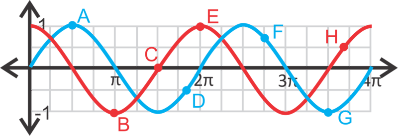\[Figure 14\]

2.  List all the points in the interval $[0,4 \pi]$ where $\sin x=\cos x$. Use the graph from #1 to help you.
3.  Draw from $y=\sin x$ from $[0, 2 \pi]$. Find $f \left(\frac{\pi}{3}\right)$ and $f \left(\frac{5 \pi}{3}\right)$. Plot these values on the curve.

For questions 4-12, graph the sine or cosine curve over two periods.

4.  $y=2 \sin x$
5.  $y=-5 \cos x$
6.  $y=\frac{1}{4} \cos x$
7.  $y=- \frac{2}{3} \sin x$
8.  $y=4 \sin x$
9.  $y=-1.5 \cos x$
10. $y=\frac{5}{3} \cos x$
11. $y=10 \sin x$
12. $y=-7.2 \sin x$
13. Graph $y=\sin x$ and $y=\cos x$ on the same set of axes. How many units would you have to shift the sine curve (to the left or right) so that it perfectly overlaps the cosine curve?
14. Graph $y=\sin x$ and $y=-\cos x$ on the same set of axes. How many units would you have to shift the sine curve (to the left or right) so that it perfectly overlaps $y=- \cos x$?

Write the equation for each sine or cosine curve below. $a>0$ for both questions.

15. \[Figure 15\]
16. \[Figure 16\]

Translating Sine and Cosine Functions
-------------------------------------

**Objective**

To be able to graph a translated sine or cosine function.

**Guidance**

Just like other functions, sine and cosine curves can be moved to the left, right, up and down. The general equation for a sine and cosine curve is $y=a \sin (x-h)+k$ and $y=a \cos(x-h)+k$, respectively. Also, just like in other functions, $h$ is the horizontal shift, also called a **phase shift**, and $k$ is the vertical shift. Notice, that because it is $x - h$ in the equation, $h$ will always shift in the opposite direction of what is in the equation.

**Example A**

Graph $y=\cos \left(x - \frac{\pi}{4}\right)$.

**Solution:** This function will be shifted $\frac{\pi}{4}$ units to the right. The easiest way to sketch the curve, is to start with the parent graph and then move it to the right the correct number of units.

Graph $y=\sin (x+2)+3$.

**Solution:** Because -2 is not written in terms of $\pi$ (like the $x$\-axis), we need to estimate where it would be on the axis. $- \frac{3 \pi}{4}=2.35 \ldots$ So, -2 will be shifted not quite to the $- \frac{3 \pi}{4}$ tic mark. Then, the entire function will be shifted up 3 units. The red graph is the final answer.

Find the equation of the sine curve below.

 is 1. Next, we can find the vertical shift. Recall that the maximum is usually 1, in this equation it is 2. That means that the function is shifted up 1 unit $(2-1)$. The horizontal shift is the hardest to find. Because sine curves are periodic, the horizontal shift can either be positive or negative.")

Because $\pi$ is $3.14 \ldots$, we can say that “moves back almost $\pi$ units” is -3 units. So, the equation is $y=\sin (x+3)+1$. If we did the positive horizontal shift, we could say that the equation would be $y=\sin (x-3.28)+1$.

. Then, to determine the positive shift equation, recall that a period is $2 \pi$, which is $6.28 \ldots$ So, the positive shift would be $2 \pi - 3$ or $6.28 - 3 = 3.28.$.")

**Guided Practice**

Graph the following functions from $[\pi, 3 \pi]$.

1. $y=-1+\sin x$

2. $y=\cos\left(x+\frac{\pi}{3}\right) - 2$

3. Find the equation of the cosine curve below.

1. Shift the parent graph down one unit.

+3$.")

+3$.")

**Vocabulary**

__Phase Shift__

The horizontal shift of a trigonometric function.

**Problem Set**

For questions 1-4, match the equation with its graph.

$")
2.  $y=\cos \left(x-\frac{\pi}{4}\right)+3$
3.  $y=\cos \left(x+\frac{\pi}{4}\right)-2$
4.  $y=\sin \left(x-\frac{\pi}{4}\right)+2$
5.  Which graph above represents:
    1.  $y=\cos(x-\pi)$
    2.  $y=\sin \left(x+\frac{3 \pi}{4}\right)-2$
6.  Fill in the blanks below.
    1.  $\sin x=\cos(x-\underline{\;\;\;\;\;})$
    2.  $\cos x=\sin(x-\underline{\;\;\;\;\;})$

For questions 7-12, graph the following equations from $[-2\pi, 2\pi]$.

7.  $y=\sin \left(x+\frac{\pi}{4}\right)$
8.  $y=1+\cos x$
9.  $y=\cos(x+\pi)-2$
10. $y=\sin(x+3)-4$
11. $y=\sin \left(x-\frac{\pi}{6}\right)$
12. $y=\cos(x-1)-3$
13. **_Critical Thinking_** Is there a difference between $y=\sin x +1$ and $y=\sin(x+1)$? Explain your answer.

Putting it all Together
-----------------------

**Objective**

To graph sine and cosine functions where the amplitude is changed and horizontal and vertical shifts.

**Guidance**

In this concept, we will combine the previous two concepts and change the amplitude, the horizontal shifts, vertical shifts, and reflections.

**Example A**

Graph $y=4 \sin \left(x-\frac{\pi}{4}\right)$. Find the domain and range.

**Solution:** First, stretch the curve so that the amplitude is 4, making the maximums and minimums 4 and -4. Then, shift the curve $\frac{\pi}{4}$ units to the right.

**Example B**

Graph $y=-2\cos (x-1)+1$. Find the domain and range.

**Solution:** The -2 indicates the cosine curve is flipped and stretched so that the amplitude is 2. Then, move the curve up one unit and to the right one unit.

The domain is all real numbers and the range is $y\in [-1,3]$.

Find the equation of the sine curve to the right.

**Solution:** First, let’s find the amplitude. The range is from 1 to -5, which is a total distance of 6. Divided by 2, we find that the amplitude is 3. Halfway between 1 and -5 is $\frac{1+(-5)}{5}=-2$, so that is our vertical shift. Lastly, we need to find the horizontal shift. The easiest way to do this is to superimpose the curve $y=3\sin (x)-2$ over this curve and determine the movement from one maximum to the closest maximum of this curve.

")

\[Figure 29\]

Subtracting $\frac{\pi}{2}$ and $\frac{\pi}{6}$, we have:

$\frac{\pi}{2}-\frac{\pi}{6}=\frac{3 \pi}{6}-\frac{\pi}{6}=\frac{2 \pi}{6}=\frac{\pi}{3}$

Making the equation $y=3 \sin \left(x+\frac{\pi}{3}\right)-2$.

**Guided Practice**

Graph the following functions. State the domain and range. Show two full periods.

1. $y=-2\sin \left(x-\frac{\pi}{2}\right)$

2. $y=\frac{1}{3}\cos (x+1)-2$

3. Write one sine equation and one cosine equation for the curve below.

1. The domain is all real numbers and the range is $y\in [-2,2]$.

-2$.")

**Problem Set**

Determine if the following statements are true or false.

1.  To change a cosine curve into a sine curve, shift the curve $\frac{\pi}{2}$ units.
2.  For any given sine or cosine graph, there are infinitely many possible equations that can be written to represent the curve.
3.  The amplitude is the same as the maximum value of the sine or cosine curve.
4.  The horizontal shift is always in terms of $\pi$.
5.  The domain of any sine or cosine function is always all real numbers.

Graph the following sine or cosine functions such that $x \in [-2 \pi, 2 \pi]$. State the domain and range.

6.  $y=\sin \left(x+\frac{\pi}{4}\right)+1$
7.  $y=2-3\cos x$
8.  $y=\frac{3}{4} \sin \left(x-\frac{2 \pi}{3}\right)$
9.  $y=-5 \sin(x-3)-2$
10. $y=2 \cos \left(x+\frac{5 \pi}{6}\right)-1.5$
11. $y=-2.8 \cos(x-8)+4$

Use the graph below to answer questions 12-15.

13. Write a cosine equation for the function where the amplitude is positive.
14. How often does a sine or cosine curve repeat itself? How can you use this to help you write different equations for the same graph?
15. Write a second sine and cosine equation with different horizontal shifts.

Use the graph below to answer questions 16-20.

17. Write a cosine equation for the function where the amplitude is positive.
18. Write a sine equation for the function where the amplitude is _negative_.
19. Write a cosine equation for the function where the amplitude is _negative_.
20. Describe the similarities and differences between the four equations from questions 16-19.

Changes in the Period of a Sine and Cosine Function
---------------------------------------------------

**Objective**

Here you’ll learn how to change the period of a sine and cosine function.

**Guidance**

The last thing that we can manipulate on the sine and cosine curve is the **period**

The normal period of a sine or cosine curve is $2 \pi$. To stretch out the curve, then the period would have to be longer than $2 \pi$. Below we have sine curves with a period of $4 \pi$ and then the second has a period of $\pi$.

")

\[Figure 36\]

To determine the period from an equation, we introduce $b$ into the general equation. So, the equations are $y=a\sin b(x-h)+k$ and $y=a\cos b(x-h)+k$, where $a$ is the amplitude, $b$ is the **frequency**, $h$ is the phase shift, and $k$ is the vertical shift. The frequency is the number of times the sine or cosine curve repeats within $2 \pi$. Therefore, the frequency and the period are indirectly related. For the first sine curve, there is half of a sine curve in $2 \pi$. Therefore the equation would be $y=\sin \frac{1}{2}x$. The second sine curve has two curves within $2 \pi$, making the equation $y=\sin 2x$. To find the period of any sine or cosine function, use $\frac{2 \pi}{|b|}$, where $b$ is the frequency. Using the first graph above, this is a valid formula: $\frac{2 \pi}{\frac{1}{2}}=2 \pi \cdot 2=4 \pi$.

**Example A**

Determine the period of the following sine and cosine functions.

a) $y=-3 \cos 6x$

b) $y=2 \sin \frac{1}{4}x$

c) $y=\sin \pi x -7$

**Solution:** a) The 6 in the equation tells us that there are 6 repetitions within $2 \pi$. So, the period is $\frac{2 \pi}{6}=\frac{\pi}{3}$.

b) The $\frac{1}{4}$ in the equation tells us the frequency. The period is $\frac{2 \pi}{\frac{1}{4}}=2 \pi \cdot 4=8 \pi$.

c) The $\pi$ is the frequency. The period is $\frac{2 \pi}{\pi}=2$.

**Example B**

Graph part a) from the previous example from $[0, 2 \pi]$. Determine where the maximum and minimum values occur. Then, state the domain and range.

 and the curve should repeat itself 6 times from 0 to $2 \pi$. The first maximum value is 3 and occurs at half the period, or $x=\frac{\pi}{6}$ and then repeats at $x=\frac{\pi}{2}, \frac{5 \pi}{6}, \frac{7 \pi}{6}, \frac{3 \pi}{2}, \ldots$ Writing this as a formula we start at $\frac{\pi}{6}$ and add $\frac{\pi}{3}$ to get the next maximum, so each point would be $\left(\frac{\pi}{6} \pm \frac{\pi}{3}n,3\right)$ where $n$ is any integer.")

The minimums occur at -3 and the $x$\-values are multiples of $\frac{\pi}{3}$. The points would be $\left(\pm \frac{\pi}{3}n, -3\right)$, again $n$ is any integer. The domain is all real numbers and the range is $y \in [-3,3]$.

**Example C**

Find all the solutions from the function in Example B from $[0, 2 \pi]$.

**Solution:** Before this concept, the zeros didn’t change in the frequency because we hadn’t changed the period. Now that the period can be different, we can have a different number of zeros within $[0, 2\pi]$. In this case, we will have 6 times the number of zeros that the parent function. To solve this function, set $y = 0$ and solve for $x$.

$$
\begin{align*}
0 &=-3 \cos 6x \\
0 &=\cos 6x
\end{align*}
$$

Now, use the inverse cosine function to determine when the cosine is zero. This occurs at the multiples of $\frac{\pi}{2}$.

$$
6x=\cos^{-1}0=\frac{\pi}{2}, \frac{3\pi}{2}, \frac{5\pi}{2}, \frac{7\pi}{2},\frac{9\pi}{2}, \frac{11\pi}{2}, \frac{13\pi}{2}, \frac{15 \pi}{2}, \frac{17\pi}{2}, \frac{19\pi}{2}, \frac{21\pi}{2}, \frac{23\pi}{2}
$$

We went much past $2 \pi$ because when we divide by 6, to get $x$ by itself, all of these answers are going to also be divided by 6 and smaller.

$$
x=\frac{\pi}{12}, \frac{\pi}{4}, \frac{5\pi}{12}, \frac{7\pi}{12}, \frac{3\pi}{4}, \frac{11\pi}{12}, \frac{13\pi}{12}, \frac{5\pi}{4}, \frac{17 \pi}{12}, \frac{19\pi}{12}, \frac{21\pi}{2}, \frac{23\pi}{12}
$$

$\frac{23 \pi}{12}<2\pi$ so we have found all the zeros in the range.

**Guided Practice**

1. Determine the period of the function $y=\frac{2}{3}\cos\frac{3}{4}x$.

2. Find the zeros of the function from #1 from $[0, 2\pi]$.

3. Determine the equation of the sine function with an amplitude of -3 and a period of $8\pi$.

**Answers**

1. The period is $\frac{2 \pi}{\frac{3}{4}}=2 \pi \cdot \frac{4}{3}=\frac{8 \pi}{3}$.

2. The zeros would be when $y$ is zero.

$$
\begin{align*}
0 &=\frac{2}{3} \cos \frac{3}{4}x \\
0 &=\cos \frac{3}{4}x \\
\frac{3}{4}x &=\cos^{-1}0=\frac{\pi}{2},\frac{3 \pi}{2} \\
x &=\frac{4}{3}\left(\frac{\pi}{2},\frac{3 \pi}{2}\right) \\
x &=\frac{2\pi}{3},2\pi
\end{align*}
$$

3. The general equation of a sine curve is $y=a\sin bx$. We know that $a = -3$ and that the period is $8 \pi$. Let’s use this to find the frequency, or $b$.

$$
\begin{align*}
\frac{2\pi}{b} &=8\pi \\
\frac{2\pi}{8\pi} &=b \\
\frac{1}{4} &=b
\end{align*}
$$

The equation of the curve is $y=-3\sin \frac{1}{4}x$.

**Vocabulary**

__Period__

The length in which an entire sine or cosine curve is completed.

__Frequency__

The number of times a curve is repeated within $2\pi$.

**Problem Set**

Find the period of the following sine and cosine functions.

1.  $y=5\sin 3x$
2.  $y=-2\cos 4x$
3.  $y=-3\sin 2x$
4.  $y=\cos \frac{3}{4}x$
5.  $y=\frac{1}{2}\cos 2.5x$
6.  $y=4\sin 3x$

Use the equation $y=5\sin 3x$ to answer the following questions.

7.  Graph the function from $[0, 2\pi]$ and find the domain and range.
8.  Determine the coordinates of the maximum and minimum values.
9.  Find all the zeros from $[0, 2\pi]$.

Use the equation $y=\cos \frac{3}{4}x$ to answer the following questions.

10. Graph the function from $[0, 4\pi]$ and find the domain and range.
11. Determine the coordinates of the maximum and minimum values.
12. Find all the zeros from $[0, 2\pi]$.

Use the equation $y=-3\sin 2x$ to answer the following questions.

13. Graph the function from $[0, 2\pi]$ and find the domain and range.
14. Determine the coordinates of the maximum and minimum values.
15. Find all the zeros from $[0, 2\pi]$.
16. What is the domain of every sine and cosine function? Can you make a general rule for the range? If so, state it.

Write the equation of the sine function, in the form $y=a\sin bx$, with the given amplitude and period.

17. Amplitude: -2 Period: $\frac{3 \pi}{4}$
18. Amplitude: $\frac{3}{5}$ Period: $5 \pi$
19. Amplitude: 9 Period: 6
20. **Challenge** Find all the zeros from $[0, 2\pi]$ of $y=\frac{1}{2}\sin 3\left(x-\frac{\pi}{3}\right)$.

Graphing Tangent
----------------

**Objective**

Here you’ll learn how to graph a tangent function.

**Guidance**

The graph of the **tangent function** is very different from the sine and cosine functions. First, recall that the tangent ratio is $\tan \theta=\frac{\text{opposite}}{\text{hypotenuse}}$. In radians, the coordinate for the tangent function would be $(\theta, \tan \theta)$

$$
\begin{align*}
x && \theta && 0 && \frac{\pi}{6} && \frac{\pi}{4} && \frac{\pi}{3} && \frac{\pi}{2} && \frac{2\pi}{3} && \frac{3\pi}{4} && \frac{5\pi}{6} && \pi \\
y && \tan \theta && 0 && \frac{\sqrt{3}}{3} && 1 && \sqrt{3} && \text{und.} && -\sqrt{3} && -1 && -\frac{\sqrt{3}}{3} && 0
\end{align*}
$$

After $\pi$, the $y$\-values repeat, making the tangent function periodic with a period of $\pi$.

The standard form of the equation is $y=a\tan b(x-h)+k$ where $a, b, h,$ and $k$ are the same as they are for the other trigonometric functions. For simplicity, we will not address phase shifts $(k)$ in this concept.

**Example A**

Graph $y=3 \tan x+1$ from $[-2\pi, 2\pi]$. State the domain and range.

**Solution:** First, the amplitude is 3, which means each $y$\-value will be tripled. Then, we will shift the function up one unit.

The domain will be all real numbers, except where the asymptotes occur. Therefore, the domain of this function will be $x\in \mathbb{R}, x \notin n\pi \pm \frac{\pi}{2}$. The range is all real numbers.

**Example B**

Graph $y=-\tan 2\pi$ from $[0, 2\pi]$ and state the domain and range. Find all zeros within this domain.

$$
\begin{align*}
0 &=-\tan 2x \\
0 &=\tan 2x \\
2x &=\tan^{-1}0=0, \pi, 2\pi, 3\pi, 4\pi \\
x &=0, \frac{\pi}{2}, \pi, \frac{3\pi}{2}, 2\pi
\end{align*}
$$

**Example C**

Graph $y=\frac{1}{4}\tan\frac{1}{4}x$ from $[0, 4\pi]$ and state the domain and range.

**Solution:** This function has a period of $\frac{\pi}{\frac{1}{4}}=4\pi$. The domain is all real numbers, except $2\pi, 6\pi, 10\pi, 2\pi \pm 4\pi n$, where $n$ is any integer. The range is all real numbers.

1. Find the period of the function $y=-4\tan \frac{3}{2}x$.

2. Find the zeros of the function from #1, from $[0, 2\pi]$.

3. Find the equation of the tangent function with an amplitude of 8 and a period of $6\pi$.

**Answers**

1. The period is $\frac{\pi}{\frac{3}{2}}=\pi \cdot \frac{2}{3}=\frac{2\pi}{3}$.

2. The zeros are where $y$ is zero. 

$$
\begin{align*}
0 &=-4\tan \frac{3}{2}x \\
0 &=\tan \frac{3}{2}x \\
\frac{3}{2}x &=\tan ^{-1}0=0, \pi, 2\pi, 3\pi \\
x &=\frac{2}{3}(0, \pi, 2\pi, 3\pi ) \\
x &=0, \frac{2\pi}{3}, \frac{4\pi}{3}, 2\pi
\end{align*}
$$

3. The general equation is $y=a\tan bx$. We know that $a = 8$. Let’s use the period to solve for the frequency, or $b$.

$$
\begin{align*}
\frac{\pi}{b} &=6\pi \\
b &=\frac{\pi}{6\pi}=\frac{1}{6}
\end{align*}
$$

The equation is $y=8\tan \frac{1}{6}x$.

**Vocabulary**

__Tangent Function__

Defined by the coordinates $(\theta, \tan \theta)$, where $\theta$ is the central angle from the unit circle and tangent is the ratio of the sine and cosine functions.

**Problem Set**

Graph the following tangent functions over $[0, 4\pi]$. Determine the period, domain, and range.

1.  $y=2\tan x$
2.  $y=-\frac{1}{3}\tan x$
3.  $y=-\tan 3x$
4.  $y=4\tan 2x$
5.  $y=\frac{1}{2}\tan 4x$
6.  $y=-\tan \frac{1}{2}x$
7.  $y=4+\tan x$
8.  $y=-3+\tan 3x$
9.  $y=1+\frac{2}{3}\tan \frac{1}{2}x$
10. Find the zeros of the function from #1.
11. Find the zeros of the function from #3.
12. Find the zeros of the function from #5.

Write the equation of the tangent function, in the form $y=a\tan bx$, with the given amplitude and period.

13. Amplitude: 3 Period: $\frac{3\pi}{2}$
14. Amplitude: $\frac{1}{4}$ Period: $2\pi$
15. Amplitude: -2.5 Period: 8
16. **Challenge** Graph $y=2\tan \frac{1}{3}\left(x+\frac{\pi}{4}\right)-1$ over $[0, 6\pi]$. Determine the domain and period.

</article>

### 14.2 Using Trigonometric Identities

<article>

**Objective**

Here you’ll learn how to use trigonometric identities to solve and prove trigonometric statements and problems.

**Review Queue**

Find the exact value of the trig functions below.

1. $\sin \frac{\pi}{3}$

2. $\cos \left(- \frac{5 \pi}{6}\right)$

3. $\sin 4 \pi$

4. $\tan \frac{7 \pi}{4}$

5. $\cos \frac{2 \pi}{3}$

6. $\tan \left(- \frac{2 \pi}{3}\right)$

Introduction to Trig Identities
-------------------------------

**Objective**

Here you’ll learn about the basic trigonometric identities and how to use them.

**Guidance**

**Trigonometric identities** are true for any value of $x$ (as long as the value is in the domain). In the _Reciprocal Trigonometric Functions_ concept from the previous chapter, you learned about secant, cosecant, and cotangent, which are all reciprocal functions of sine, cosine and tangent. These functions can be rewritten as the Reciprocal Identities because they are always true.

**Reciprocal Identities:** $\csc \theta=\frac{1}{\sin \theta} \quad \sec \theta=\frac{1}{\cos \theta} \quad \cot \theta=\frac{1}{\tan \theta}$

Other identities involve the tangent, variations on the Pythagorean Theorem, phase shifts, and negative angles. We will discover them in this concept.

**Example A**

$\tan \theta=\frac{opposite}{adjacent}$. Show that $\tan \theta=\frac{\sin \theta}{\cos \theta}$.This is the **Tangent Identity**.

**Solution:** Whenever we are trying to verify, or prove, an identity, we start with the statement we are trying to prove and work towards the desired answer. In this case, we will start with $\tan \theta=\frac{\sin \theta}{\cos \theta}$ and show that it is equivalent to $\tan \theta=\frac{opposite}{adjacent}$. First, rewrite sine and cosine in terms of the ratios of the sides.

$$
\begin{align*}
\tan \theta&=\frac{\sin \theta}{\cos \theta} \\
&=\frac{\frac{opposite}{hypotenuse}}{\frac{adjacent}{hypotenuse}}
\end{align*}
$$

Then, rewrite the complex fraction as a division problem and simplify.

$$
\begin{align*}
&=\frac{opposite}{hypotenuse} \div \frac{adjacent}{hypotenuse} \\
&=\frac{opposite}{\cancel{hypotenuse}} \cdot \frac{\cancel{hypotenuse}}{adjacent} \\
&=\frac{opposite}{adjacent}
\end{align*}
$$

We now have what we wanted to prove and we are done. **_Once you verify an identity, you may use it to verify other identities._**

**Example B**

Show that $\sin^2 \theta+ \cos^2 \theta=1$ is a true identity.

**Solution:** Change the sine and cosine in the equation into the ratios. In this example, we will use $y$ as the opposite side, $x$ is the adjacent side, and $r$ is the hypotenuse (or radius), as in the unit circle.

$$
\begin{align*}
\sin^2 \theta+ \cos^2 \theta&=1 \\
\left(\frac{y}{r}\right)^2+\left(\frac{x}{r}\right)^2&=1 \\
\frac{y^2}{r^2}+\frac{x^2}{r^2}&=1 \\
\frac{y^2+x^2}{r^2}&=1
\end{align*}
$$

Now, $x^2+y^2=r^2$ from the Pythagorean Theorem. Substitute this in for the numerator of the fraction.

$$
\frac{r^2}{r^2}=1
$$

This is one of the **Pythagorean Identities** and very useful.

**Example C**

Verify that $\sin \left(\frac{\pi}{2}- \theta \right)=\cos \theta$ by using the graphs of the functions.

**Solution:** The function $y=\sin \left(\frac{\pi}{2} - x \right)$ is a phase shift of $\frac{\pi}{2}$ of the sine curve.

**Guided Practice**

1. Prove the Pythagorean Identity: $1+ \tan^2 \theta=\sec^2 \theta$

2. Without graphing, show that $\sin (- \theta)=- \sin \theta$.

**Answers**

1. First, let’s use the Tangent Identity and the Reciprocal Identity to change tangent and secant in terms of sine and cosine.

$$
\begin{align*}
1+ \tan^2 \theta&=\sec^2 \theta \\
1+ \frac{\sin^2 \theta}{\cos^2 \theta}&=\frac{1}{\cos^2 \theta}
\end{align*}
$$

Now, change the 1 into a fraction with a base of $\cos^2 \theta$ and simplify.

$$
\begin{align*}
1+ \frac{\sin^2 \theta}{\cos^2 \theta}&=\frac{1}{\cos^2 \theta} \\
\frac{\cos^2 \theta}{\cos^2 \theta}+ \frac{\sin^2 \theta}{\cos^2 \theta}&=\frac{1}{\cos^2 \theta} \\
\frac{\cos^2 \theta+ \sin^2 \theta}{\cos^2 \theta}&=\frac{1}{\cos^2 \theta} \\
\frac{1}{\cos^2 \theta}&=\frac{1}{\cos^2 \theta}
\end{align*}
$$

In the second to last step, we arrived at the original Pythagorean Identity $\sin^2 \theta+\cos^2 \theta$ in the numerator of the left-hand side. Therefore, we can substitute in 1 for this and the two sides of the equation are the same.

2. First, recall that $\sin \theta=y$, where $(x, y)$ is the endpoint of the terminal side of $\theta$ on the unit circle.

Now, if we have $\sin (- \theta)$, what is it’s endpoint? Well, the negative sign tells us that the angle is rotated in a clockwise direction, rather than the usual counter-clockwise. By looking at the picture, we see that $\sin (- \theta)=-y$. Therefore, if $\sin \theta=y$, then $- \sin \theta=-y$ and combining the equations, we have $\sin (- \theta)=- \sin \theta$.

__Trigonometric Identity__

A trigonometric equation that is true for any $x$ value (within the domain).

__Verify__

To prove a trigonometric identity.

__Reciprocal Identities__

$\csc \theta=\frac{1}{\sin \theta}, \sec \theta=\frac{1}{\cos \theta},$ and $\cot \theta=\frac{1}{\tan \theta}$

__Tangent Identity__

$\tan \theta=\frac{\sin \theta}{\cos \theta}$

__Cotangent Identity__

$\cot \theta=\frac{\cos \theta}{\sin \theta}$

__Pythagorean Identities__

$\sin^2 \theta+ \cos^2 \theta=1, 1+ \tan^2 \theta=\sec^2 \theta,$ and $1+ \cot^2 \theta=\csc^2 \theta$

__Cofunction Identities__

$\sin \left(\frac{\pi}{2}- \theta \right)=\cos \theta, \cos \left(\frac{\pi}{2}- \theta \right)=\sin \theta,$ and $\tan \left(\frac{\pi}{2} - \theta \right)=\cot \theta$

__Negative Angle Identities__

$\sin (- \theta)=- \sin \theta, \cos(- \theta)=\cos \theta,$ and $\tan (- \theta)=- \tan \theta$

**Problem Set**

1.  Show that $\cot \theta=\frac{\cos \theta}{\sin \theta}$ by following the steps from Example A.
2.  Show that $\tan \theta=\frac{\sec \theta}{\csc \theta}$. Refer to Example A to help you.
3.  Show that $1+ \cot^2 \theta=\csc^2 \theta$ by following the steps from #1 in the Guided Practice.
4.  Explain why $\cos \left(\frac{\pi}{2} - \theta \right)=\sin \theta$ by using the graphs of the two functions.
5.  Following the steps from #2 in the Guided Practice, show that $\cos (- \theta)=\cos \theta$.
6.  Explain why $\tan (- \theta)=- \tan \theta$ is true, using the Tangent Identity and the other Negative Angle Identities.

Verify the following identities.

7.  $\cot \theta \sec \theta=\csc \theta$
8.  $\frac{\cos \theta}{\cot \theta}=\frac{\tan \theta}{\sec \theta}$
9.  $\sin \theta \csc \theta=1$
10. $\cot(- \theta)=- \cot \theta$
11. $\tan x \csc x \cos x=1$
12. $\frac{\sin^2 \left(-x\right)}{\tan^2 x}= \cos ^2 x$

Show that $\sin^2 \theta+ \cos^2 \theta=1$ is true for the following values of $\theta$.

13. $\frac{\pi}{4}$
14. $\frac{2 \pi}{3}$
15. $- \frac{7 \pi}{6}$
16. Recall that a function is odd if $f(-x)=-f(x)$ and even if $f(-x)=f(x)$. Which of the six trigonometric functions are odd? Which are even?

Using Trig Identities to Find Exact Trig Values
-----------------------------------------------

**Objective**

Here you'll use the basic trig identities to find exact trig values of angles other than the critical angles.

**Guidance**

You can use the Pythagorean, Tangent and Reciprocal Identities to find all six trigonometric values for certain angles. Let’s walk through a few examples so that you understand how to do this.

**Example A**

Given that $\cos \theta=\frac{3}{5}$ and $0 < \theta < \frac{\pi}{2}$, find $\sin \theta$.

**Solution:** Use the Pythagorean Identity to find $\sin \theta$.

$$
\begin{align*}
\sin^2 \theta+\cos^2 \theta&=1 \\
\sin^2 \theta+ \left(\frac{3}{5}\right)^2&=1 \\
\sin^2 \theta&=1- \frac{9}{25} \\
\sin^2 \theta&=\frac{16}{25} \\
\sin \theta&= \pm \frac{4}{5}
\end{align*}
$$

Because $\theta$ is in the first quadrant, we know that sine will be positive. $\sin \theta=\frac{4}{5}$

**Example B**

Find $\tan \theta$ of $\theta$ from Example A.

**Solution:** Use the Tangent Identity to find $\tan \theta$.

$$
\tan \theta=\frac{\sin \theta}{\cos \theta}=\frac{\frac{4}{5}}{\frac{3}{5}}=\frac{4}{3}
$$

**Example C**

Find the other three trigonometric functions of $\theta$ from Example.

**Solution:** To find secant, cosecant, and cotangent use the Reciprocal Identities.

$$
\csc \theta=\frac{1}{\sin \theta}=\frac{1}{\frac{4}{5}}= \frac{5}{4} \quad \sec \theta=\frac{1}{\cos \theta}=\frac{1}{\frac{3}{5}}=\frac{5}{3} \quad \cot \theta =\frac{1}{\tan \theta}=\frac{1}{\frac{4}{3}}=\frac{3}{4}
$$

**Guided Practice**

Find the values of the other five trigonometric functions.

1. $\tan \theta=- \frac{5}{12}, \frac{\pi}{2} < \theta < \pi$

2. $\csc \theta=-8, \pi < \theta < \frac{3 \pi}{2}$

**Answers**

1. First, we know that $\theta$ is in the second quadrant, making sine positive and cosine negative. For this problem, we will use the Pythagorean Identity $1+ \tan^2 \theta=\sec^2 \theta$ to find secant.

$$
\begin{align*}
1+ \left(- \frac{5}{12}\right)^2&=\sec^2 \theta \\
1+ \frac{25}{144}&=\sec^2 \theta \\
\frac{169}{144}&=\sec^2 \theta \\
\pm \frac{13}{12}&=\sec \theta \\
- \frac{13}{12}&=\sec \theta
\end{align*}
$$

If $\sec \theta=- \frac{13}{12}$, then $\cos \theta= - \frac{12}{13}$. $\sin \theta=\frac{5}{13}$ because the numerator value of tangent is the sine and it has the same denominator value as cosine. $\csc \theta=\frac{13}{5}$ and $\cot \theta=- \frac{12}{5}$ from the Reciprocal Identities.

2. $\theta$ is in the third quadrant, so both sine and cosine are negative. The reciprocal of $\csc \theta=-8$, will give us $\sin \theta=- \frac{1}{8}$. Now, use the Pythagorean Identity $\sin^2 \theta + \cos^2 \theta=1$ to find cosine.

$$
\begin{align*}
\left(- \frac{1}{8}\right)^2+ \cos^2 \theta&=1 \\
\cos^2 \theta&=1- \frac{1}{64} \\
\cos^2 \theta&=\frac{63}{64} \\
\cos \theta&=\pm \frac{3 \sqrt{7}}{8} \\
\cos \theta&=- \frac{3 \sqrt{7}}{8} \\
\end{align*}
$$

$\sec \theta=- \frac{8}{3 \sqrt{7}}=- \frac{8 \sqrt{7}}{21}, \tan \theta= \frac{1}{3 \sqrt{7}}= \frac{\sqrt{7}}{21},$ and $\cot \theta=3 \sqrt{7}$

**Problem Set**

1.  In which quadrants is the sine value positive? Negative?
2.  In which quadrants is the cosine value positive? Negative?
3.  In which quadrants is the tangent value positive? Negative?

Find the values of the other five trigonometric functions of $\theta$.

4.  $\sin \theta=\frac{8}{17},0 < \theta < \frac{\pi}{2}$
5.  $\cos \theta=- \frac{5}{6}, \frac{\pi}{2} < \theta < \pi$
6.  $\tan \theta= \frac{\sqrt{3}}{4},0 < \theta < \frac{\pi}{2}$
7.  $\sec \theta=- \frac{41}{9}, \pi < \theta < \frac{3 \pi}{2}$
8.  $\sin \theta=- \frac{11}{14}, \frac{3 \pi}{2} < \theta < 2 \pi$
9.  $\cos \theta=\frac{2 \sqrt{2}}{4},0 < \theta < \frac{\pi}{2}$
10. $\cot \theta=- \sqrt{5}, \pi < \theta < \frac{3 \pi}{2}$
11. $\csc \theta=4, \frac{\pi}{2} < \theta < \pi$
12. $\tan \theta=- \frac{7}{10}, \frac{3 \pi}{2} < \theta < 2 \pi$
13. Aside from using the identities, how else can you find the values of the other five trigonometric functions?
14. Given that $\cos \theta=\frac{6}{11}$ and $\theta$ is in the $2^{nd}$ quadrant, what is $\sin(- \theta)$?
15. Given that $\tan \theta=- \frac{5}{8}$ and $\theta$ is in the $4^{th}$ quadrant, what is $\sec(- \theta)$?

Simplifying Trigonometric Expressions
-------------------------------------

**Objective**

Here you'll use the basic trig identities to simplify more complicated expressions.

**Guidance**

Now that you are more familiar with trig identities, we can use them to simplify expressions. Remember, that you can use any of the identities in the _Introduction to Trig Identities_ concept. Here is a list of the identities again:

**Reciprocal Identities:** $\csc \theta=\frac{1}{\sin \theta}, \sec \theta=\frac{1}{\cos \theta},$ and $\cot \theta=\frac{1}{\tan \theta}$

**Tangent and Cotangent Identities:** $\tan \theta=\frac{\sin \theta}{\cos \theta}$ and $\cot \theta=\frac{\cos \theta}{\sin \theta}$

**Pythagorean Identities:** $\sin^2 \theta+ \cos^2 \theta=1, 1+ \tan^2 \theta=\sec^2 \theta,$ and $1+ \cot^2 \theta=\csc^2 \theta$

**Cofunction Identities:** $\sin \left(\frac{\pi}{2} - \theta\right)=\cos \theta, \cos \left(\frac{\pi}{2} - \theta\right)=\sin \theta,$ and $\tan \left(\frac{\pi}{2} - \theta\right)=\cot \theta$

**Negative Angle Identities:** $\sin(- \theta)=- \sin \theta, \cos(- \theta)=\cos \theta,$ and $\tan(- \theta)=- \tan \theta$

**Example A**

Simplify $\frac{\sec x}{\sec x-1}$.

**Solution:** When simplifying trigonometric expressions, one approach is to change everything into sine or cosine. First, we can change secant to cosine using the Reciprocal Identity.

$$
\frac{\sec x}{\sec x - 1} \rightarrow \frac{\frac{1}{\cos x}}{\frac{1}{\cos x}-1}
$$

Now, combine the denominator into one fraction by multiplying 1 by $\frac{\cos x}{\cos x}$.

$$
\frac{\frac{1}{\cos x}}{\frac{1}{\cos x}-1} \rightarrow \frac{\frac{1}{\cos x}}{\frac{1}{\cos x}- \frac{\cos x}{\cos x}} \rightarrow \frac{\frac{1}{\cos x}}{\frac{1- \cos x}{\cos x}}
$$

Change this problem into a division problem and simplify.

$$
\begin{align*}
\frac{\frac{1}{\cos x}}{\frac{1-\cos x}{\cos x}} \rightarrow & \frac{1}{\cos x} \div \frac{1- \cos x}{\cos x} \\
& \frac{1}{\cancel{\cos x}} \cdot \frac{\cancel{\cos x}}{1- \cos x} \\
& \frac{1}{1- \cos x}
\end{align*}
$$

**Example B**

Simplify $\frac{\sin^4x- \cos^4x}{\sin^2x- \cos^2x}$.

**Solution:** With this problem, we need to factor the numerator and denominator and see if anything cancels. The rules of factoring a quadratic and the special quadratic formulas can be used in this scenario.

$$
\frac{\sin^4x - \cos^4x}{\sin^2x-\cos^2x} \rightarrow \frac{\cancel{\left(\sin^2x-\cos^2x\right)} \left(\sin^2x+ \cos^2x\right)}{\cancel{\left(\sin^2x-\cos^2x\right)}} \rightarrow \sin^2x+\cos^2x \rightarrow 1
$$

In the last step, we simplified to the left hand side of the Pythagorean Identity. Therefore, this expression simplifies to 1.

**Example C**

Simplify $\sec \theta \tan^2 \theta+\sec \theta$.

**Solution:** First, pull out the GCF.

$$
\sec \theta \tan^2 \theta+ \sec \theta \rightarrow \sec \theta(\tan^2 \theta+1)
$$

Now, $\tan^2 \theta+1=\sec^2 \theta$ from the Pythagorean Identities, so simplify further.

$$
\sec \theta(\tan^2 \theta+1) \rightarrow \sec \theta \cdot \sec^2 \theta \rightarrow \sec^3 \theta
$$

**Guided Practice**

Simplify the following trigonometric expressions.

1. $\cos \left(\frac{\pi}{2} - x\right) \cot x$

2. $\frac{\sin \left(-x\right) \cos x}{\tan x}$

3. $\frac{\cot x \cos x}{\tan \left(-x\right) \sin \left(\frac{\pi}{2}-x \right)}$

**Answers**

1. Use the Cotangent Identity and the Cofunction Identity $\cos \left(\frac{\pi}{2}- \theta \right)=\sin \theta$.

$\cos \left(\frac{\pi}{2}-x\right) \cot x \rightarrow \cancel{\sin x} \cdot \frac{\cos x}{\cancel{\sin x}} \rightarrow \cos x$

2. Use the Negative Angle Identity and the Tangent Identity.

$\frac{\sin \left(-x\right) \cos x}{\tan x} \rightarrow \frac{- \sin x \cos x}{\frac{\sin x}{\cos x}} \rightarrow - \cancel{\sin x} \cos x \cdot \frac{\cos x}{\sin x} \rightarrow - \cos^2x$

3. In this problem, you will use several identities.

$\frac{\cot x \cos x}{\tan \left(-x\right) \sin \left(\frac{\pi}{2}-x\right)} \rightarrow \frac{\frac{\cos x}{\sin x} \cdot \cos x}{- \frac{\sin x}{\cancel{\cos x}} \cdot \cancel{\cos x}} \rightarrow \frac{\frac{\cos^2 x}{\sin x}}{- \sin x} \rightarrow \frac{\cos^2x}{\sin x} \cdot - \frac{1}{\sin x} \rightarrow - \frac{\cos^2x}{\sin^2 x} \rightarrow - \cot^2x$

**Problem Set**

Simplify the following expressions.

1.  $\cot x \sin x$
2.  $\cos^2x \tan(-x)$
3.  $\frac{\cos \left(-x\right)}{\sin \left(-x\right)}$
4.  $\sec x \cos(-x)- \sin^2x$
5.  $\sin x(1+ \cot^2x)$
6.  $1- \sin^2 \left(\frac{\pi}{2} - x\right)$
7.  $1- \cos^2 \left(\frac{\pi}{2}-x\right)$
8.  $\frac{\tan \left(\frac{\pi}{2}-x\right) \sec x}{1- \csc^2 x}$
9.  $\frac{\cos^2x \tan^2 \left(-x\right)-1}{\cos^2x}$
10. $\cot^2x+ \sin^2x+ \cos^2(-x)$
11. $\frac{\sec x \sin x+ \cos \left(\frac{\pi}{2}-x\right)}{1+ \sin \left(-x\right)}$
12. $\frac{\cos \left(-x\right)}{1+ \sin \left(-x\right)}$
13. $\frac{\sin^2 \left(-x\right)}{\tan^2x}$
14. $\tan \left(\frac{\pi}{2}-x\right) \cot x- \csc^2 x$
15. $\frac{\csc x \left(1- \cos^2x \right)}{\sin x \cos x}$

Verifying a Trigonometry Identity
---------------------------------

**Objective**

Here you'll use the basic trig identities to prove other identities.

**Guidance**

This concept continues where the previous one left off. Now that you are comfortable simplifying expressions, we will extend the idea to verifying entire identities. Here are a few helpful hints to verify an identity:

* Change everything into terms of sine and cosine.
* Use the identities when you can.
* Start with simplifying the left-hand side of the equation, then, once you get stuck, simplify the right-hand side. As long as the two sides end up with the same final expression, the identity is true.

**Example A**

Verify the identity $\frac{\cot^2x}{\csc x}=\csc x - \sin x$.

**Solution:** Rather than have an equal sign between the two sides of the equation, we will draw a vertical line so that it is easier to see what we do to each side of the equation. Start with changing everything into sine and cosine.

$$
\begin{align*}
\begin{array}{c|c c} \frac{\cot^2x}{\csc x} & \csc x - \sin x \\
\frac{\frac{\cos^2x}{\sin^2x}}{\frac{1}{\sin x}} & \frac{1}{\sin x}- \sin x \\
\frac{\cos^2x}{\sin x}\end{array}
\end{align*}
$$

Now, it looks like we are at an impasse with the left-hand side. Let’s combine the right-hand side by giving them same denominator.

$$
\begin{array}{|c} \frac{1}{\sin x}- \frac{\sin^2x}{\sin x} \\
\frac{1- \sin^2x}{\sin x} \\
\frac{\cos^2x}{\sin x}\end{array}
$$

The two sides reduce to the same expression, so we can conclude this is a valid identity. In the last step, we used the Pythagorean Identity, $\sin^2 \theta+\cos^2 \theta=1$, and isolated the $\cos^2x=1- \sin^2x$.

There are usually more than one way to verify a trig identity. When proving this identity in the first step, rather than changing the cotangent to $\frac{\cos^2x}{\sin^2x}$, we could have also substituted the identity $\cot^2x=\csc^2x-1$.

**Example B**

Verify the identity $\frac{\sin x}{1- \cos x}=\frac{1+ \cos x}{\sin x}$.

**Solution:** Multiply the left-hand side of the equation by $\frac{1+ \cos x}{1+ \cos x}$.

$$
\begin{align*}
\frac{\sin x}{1- \cos x}&= \frac{1+ \cos x}{\sin x} \\
\frac{1+ \cos x}{1+ \cos x} \cdot \frac{\sin x}{1- \cos x}&= \\
\frac{\sin \left(1+\cos x\right)}{1- \cos^2x}&= \\
\frac{\sin \left(1+\cos x\right)}{\sin^2x}&= \\
\frac{1+\cos x}{\sin x}&=
\end{align*}
$$

The two sides are the same, so we are done.

**Example C**

Verify the identity $\sec(-x)=\sec x$.

**Solution:** Change secant to cosine.

$$
\sec(-x)= \frac{1}{\cos \left(-x\right)}
$$

From the Negative Angle Identities, we know that $\cos (-x)=\cos x$.

$$
\begin{align*}
&=\frac{1}{\cos x} \\
&=\sec x
\end{align*}
$$

**Guided Practice**

Verify the following identities.

1. $\cos x \sec x=1$

2. $2- \sec^2x=1- \tan^2x$

3. $\frac{\cos \left(-x\right)}{1+ \sin \left(-x\right)}=\sec x+ \tan x$

**Answers**

1. Change secant to cosine.

$$
\begin{align*}
\cos x \sec x&=\cos \cdot \frac{1}{\cos x} \\
&=1
\end{align*}
$$

2. Use the identity $1+ \tan^2 \theta=\sec^2 \theta$.

$$
\begin{align*}
2- \sec^2x&=2-(1+ \tan^2x) \\
&=2-1- \tan^2x \\
&=1- \tan^2x
\end{align*}
$$

3. Here, start with the Negative Angle Identities and multiply the top and bottom by $\frac{1+ \sin x}{1+ \sin x}$ to make the denominator a monomial.

$$
\begin{align*}
\frac{\cos \left(-x\right)}{1+ \sin \left(-x\right)}&=\frac{\cos x}{1- \sin x} \cdot \frac{1+ \sin x}{1+ \sin x} \\
&=\frac{\cos x \left(1+ \sin x \right)}{1- \sin^2x} \\
&=\frac{\cos x \left(1+ \sin x\right)}{\cos^2x} \\
&=\frac{1+ \sin x}{\cos x} \\
&=\frac{1}{\cos x}+ \frac{\sin x}{\cos x} \\
&=\sec x+ \tan x
\end{align*}
$$

**Problem Set**

Verify the following identities.

1.  $\cot (-x)=- \cot x$
2.  $\csc (-x)=- \csc x$
3.  $\tan x \csc x \cos x=1$
4.  $\sin x+ \cos x \cot x=\csc x$
5.  $\csc \left(\frac{\pi}{2}-x\right)=\sec x$
6.  $\tan \left(\frac{\pi}{2}-x\right)=\tan x$
7.  $\frac{\csc x}{\sin x}- \frac{\cot x}{\tan x}=1$
8.  $\frac{\tan^2x}{\tan^2x+1}=\sin^2x$
9.  $(\sin x- \cos x)^2+(\sin x+ \cos x)^2=2$
10. $\sin x- \sin x \cos^2x= \sin^3x$
11. $\tan^2x+1+\tan x \sec x=\frac{1+ \sin x}{\cos^2x}$
12. $\cos^2x=\frac{\csc x \cos x}{\tan x+ \cot x}$
13. $\frac{1}{1- \sin x} - \frac{1}{1+ \sin x}=2 \tan x \sec x$
14. $\csc^4x- \cot^4x=\csc^2x+\cot^2x$
15. $(\sin x - \tan x)(\cos x- \cot x)=(\sin x-1)(\cos x-1)$

</article>

### 14.3 Solving Trigonometric Equations

<article>

**Objective**

Here you’ll learn how to solve equations with trigonometric functions.

**Review Queue**

Solve the following equations.

1. $x^2-7x-18=0$

2. $9x^4-16=0$

3. $\sin x= \frac{\sqrt{2}}{2},0< x < \frac{\pi}{2}$

Using Algebra
-------------

**Objective**

Here you'll solve trig equations using algebra.

**Guidance**

In the previous concept, we verified trigonometric identities, which are true for every real value of $x$. In this concept, we will solve trigonometric equations. An equation is only true for some values of $x$.

**Example A**

Verify that $\csc x-2=0$ when $x=\frac{5 \pi}{6}$.

**Solution:** Substitute in $x=\frac{5 \pi}{6}$ to see if the equations holds true.

$$
\begin{align*}
\csc \left(\frac{5 \pi}{6}\right)-2&=0 \\
\frac{1}{\sin \left(\frac{5 \pi}{6}\right)}-2&=0 \\
\frac{1}{\frac{1}{2}}-2&=0 \\
2-2&=0
\end{align*}
$$

This is a true statement, so $x=\frac{5 \pi}{6}$ is a solution to the equation.

**Example B**

Solve $2 \cos x+1=0$.

**Solution:** To solve this equation, we need to isolate $\cos x$ and then use inverse to find the values of $x$ when the equation is valid. You already did this to find the zeros in the graphing concepts earlier in this chapter.

$$
\begin{align*}
2 \cos x+1&=0 \\
2 \cos x&=-1 \\
\cos x&=- \frac{1}{2}
\end{align*}
$$

So, when is the $\cos x=- \frac{1}{2}$? Between $0 \le x< 2 \pi, x=\frac{2 \pi}{3}$ and $\frac{4 \pi}{3}$. But, the trig functions are periodic, so there are more solutions than just these two. You can write the general solutions as $x=\frac{2 \pi}{3} \pm 2 \pi n$ and $x=\frac{4 \pi}{3} \pm 2 \pi n$, where $n$ is any integer. You can check your answer graphically by graphing $y=\cos x$ and $y=- \frac{1}{2}$ on the same set of axes. Where the two lines intersect are the solutions.

Solve $5 \tan(x+2)-1=0$, where $0 \le x < 2 \pi$.

**Solution:** In this example, we have an interval where we want to find $x$. Therefore, at the end of the problem, we will need to add or subtract $\pi$, the period of tangent, to find the correct solutions within our interval.

$$
\begin{align*}
5 \tan(x+2)-1&=0 \\
5 \tan(x+2)&=1 \\
\tan(x+2)&=\frac{1}{5}
\end{align*}
$$

Using the $\tan^{-1}$ button on your calculator, we get that $\tan^{-1} \left(\frac{1}{5}\right)=0.1974$. Therefore, we have:

$$
\begin{align*}
x+2&=0.1974 \\
x&=-1.8026
\end{align*}
$$

This answer is not within our interval. To find the solutions in the interval, add $\pi$ a couple of times until we have found all of the solutions in $[0, 2 \pi]$.

$$
\begin{align*}
x&=-1.8026+ \pi=1.3390 \\
&=1.3390+ \pi=4.4806
\end{align*}
$$

The two solutions are $x = 1.3390$ and 4.4806.

**Guided Practice**

1. Determine if $x=\frac{\pi}{3}$ is a solution for $2 \sin x=\sqrt{3}$.

Solve the following trig equations in the interval $0 \le x< 2 \pi$.

2. $3 \cos^2x-5=0$

3. $3 \sec(x-1)+2=0$

**Answers**

1. $2 \sin \frac{\pi}{3}= \sqrt{3} \rightarrow 2 \cdot \frac{\sqrt{3}}{2}=\sqrt{3}$ Yes, $x=\frac{\pi}{3}$ is a solution.

2. Isolate the $\cos^2x$ and then take the square root of both sides. Don’t forget about the $\pm$!

$$
\begin{align*}
9 \cos^2x-5&=0 \\
9 \cos^2x&=5 \\
\cos^2x&=\frac{5}{9} \\
\cos x&=\pm \frac{\sqrt{5}}{3}
\end{align*}
$$

The $\cos x=\frac{\sqrt{5}}{3}$ at $x=0.243$ rad (use your graphing calculator). To find the other value where cosine is positive, subtract 0.243 from $2 \pi$, $x=2 \pi -0.243=6.037$ rad.

The $\cos x=- \frac{\sqrt{5}}{3}$ at $x=2.412$ rad, which is in the $2^{nd}$ quadrant. To find the other value where cosine is negative (the $3^{rd}$ quadrant), use the reference angle, 0.243, and add it to $\pi$. $x= \pi+0.243=3.383$ rad.

3. Here, we will find the solution within the given range, $0 \le x< 2 \pi$.

$$
\begin{align*}
3 \sec(x-1)+2&=0 \\
3 \sec(x-1)&=-2 \\
\sec(x-1)&=- \frac{2}{3} \\
\cos(x-1)&=- \frac{3}{2}
\end{align*}
$$

At this point, we can stop. The range of the cosine function is from 1 to -1. $- \frac{3}{2}$ is outside of this range, so there is no solution to this equation.

**Problem Set**

Determine if the following values for $x$. are solutions to the equation $5+6 \csc x=17$.

1.  $x=- \frac{7 \pi}{6}$
2.  $x=\frac{11 \pi}{6}$
3.  $x=\frac{5 \pi}{6}$

Solve the following trigonometric equations. If no solutions exist, write _no solution_.

4.  $1- \cos x=0$
5.  $3 \tan x - \sqrt{3}=0$
6.  $4 \cos x=2 \cos x+1$
7.  $5 \sin x-2=2 \sin x+4$
8.  $\sec x-4=- \sec x$
9.  $\tan^2(x-2)=3$

Sole the following trigonometric equations within the interval $0 \le x < 2 \pi$. If no solutions exist, write _no solution_.

10. $\cos x=\sin x$
11. $- \sqrt{3} \csc x=2$
12. $6 \sin(x-2)=14$
13. $7 \cos x -4=1$
14. $5+4 \cot^2x=17$
15. $2 \sin^2x-7=-6$

By Using Quadratic Techniques
-----------------------------

**Objective**

Here you'll solve trig equations by factoring and the Quadratic Formula.

**Guidance**

Another way to solve a trig equation is to use factoring or the quadratic formula. Let’s look at a couple of examples.

**Example A**

Solve $\sin^2x-3 \sin x+2=0$.

**Solution:** This sine equation looks a lot like the quadratic $x^2-3x+2=0$ which factors to be $(x-2)(x-1)=0$ and the solutions are $x = 2$ and 1. We can factor the trig equation in the exact same manner. Instead of just $x$, we will have $\sin x$ in the factors.

$$
\begin{align*}
\sin^2x-3 \sin x+2&=0 \\
(\sin x-2)(\sin x-1)&=0 \\
\sin x=2 \ and \ \sin x&=1
\end{align*}
$$

There is no solution for $\sin x=2$ and $\sin x=1$ when $x= \frac{\pi}{2} \pm 2 \pi n$.

**Example B**

Solve $1- \sin x=\sqrt{3} \cos x$ in the interval $0 \le x < 2 \pi$.

**Solution:** To solve this equation, use the Pythagorean Identity $\sin^2x+\cos^2x=1$. Solve for either cosine and substitute into the equation. $\cos x=\sqrt{1- \sin^2 x}$

$$
\begin{align*}
1- \sin x&=\sqrt{3} \cdot \sqrt{1- \sin^2x} \\
(1- \sin x)^2&=\sqrt{3-3 \sin^2x}^2 \\
1-2 \sin x+\sin^2x&=3-3 \sin^2x \\
4 \sin^2x-2 \sin x-2&=0 \\
2 \sin^2x-\sin x-1&=0 \\
(2 \sin x+1)(\sin x-1)&=0
\end{align*}
$$

Solving each factor for $x$, we get $\sin x=- \frac{1}{2} \rightarrow x=\frac{7 \pi}{6}$ and $\frac{11 \pi}{6}$ and $\sin x=1 \rightarrow x=\frac{\pi}{2}$.

**Example C**

Solve $\tan^2x-5 \tan x-9=0$ in the interval $0 \le x < \pi$.

**Solution:** This equation is not factorable so you have to use the Quadratic Formula.

$$
\begin{align*}
\tan x&=\frac{5 \pm \sqrt{\left(-5\right)^2-4 \left(1\right) \left(-9\right)}}{2} \\
&=\frac{5 \pm \sqrt{61}}{2} \\
& \approx 6.41 \ and \ -1.41
\end{align*}
$$

$x \approx \tan^{-1} 6.41 \approx 1.416 \ \text{rad}$ and $x \approx \tan^{-1}-1.41 \approx -0.954 \ \text{rad}$

The first answer is within the range, but the second is not. To adjust -0.954 to be within the range, we need to find the answer in the second quadrant, $\pi - 0.954=2.186 \ \text{rad}$.

**Guided Practice**

Solve the following trig equations using any method in the interval $0 \le x < 2 \pi$.

1. $\sin^2x \cos x=\cos x$

2. $\sin^2x=2 \sin(-x)+1$

3. $4 \cos^2x-2 \cos x-1=0$

**Answers**

1. Put everything onto one side of the equation and factor out a cosine.

$$
\begin{align*}
\sin^2x \cos x- \cos x&=0 \\
\cos x(\sin^2x-1)&=0 \\
\cos x(\sin x -1)(\sin x+1)&=0
\end{align*}
$$

$$
\begin{align*}
\cos x&=0 \qquad \qquad \ \ \sin x=1 \qquad \ \ \sin x=-1 \\
x&=\frac{\pi}{2} \ and \ \frac{3 \pi}{2} \qquad \ x=\frac{\pi}{2} \qquad \qquad x=\frac{3 \pi}{2}
\end{align*}
$$

2. Recall that $\sin(-x)=- \sin x$ from the Negative Angle Identities.

$$
\begin{align*}
\sin^2x&=2 \sin(-x)+1 \\
\sin^2x&=-2 \sin x+1 \\
\sin^2x+2 \sin x+1&=0 \\
(\sin x+1)^2&=0 \\
\sin x&=-1 \\
x&=\frac{3 \pi}{2}
\end{align*}
$$

3. This quadratic is not factorable, so use the quadratic formula.

$$
\begin{align*}
\cos x&=\frac{2 \pm \sqrt{2^2 -4 \left(4\right) \left(-1\right)}}{2 \left(4\right)} \\
&=\frac{2 \pm \sqrt{20}}{8} \\
&=\frac{1 \pm 2 \sqrt{5}}{4}
\end{align*}
$$

$$
\begin{align*}
x& \approx \cos^{-1} \left(\frac{1+ \sqrt{5}}{4}\right) && x \approx \cos^{-1} \left(\frac{1- \sqrt{5}}{4}\right) \\
& \approx \cos^{-1} 0.8090 \qquad and && \ \ \approx \cos^{-1}-0.3090 \\
& \approx 0.6283 && \ \ \approx 1.8850 \ (\text{reference angle is} \ \pi-1.8850 \approx 1.2570)
\end{align*}
$$

The other solutions in the range are $x \approx 2 \pi - 0.6283 \approx 5.6549$ and $x \approx \pi + 1.2570 \approx 4.3982$.

**Problem Set**

Solve the following trig equations using any method. Find all solutions in the interval $0 \le x < 2 \pi$. Round any decimal answers to 4 decimal places.

1.  $2 \cos^2x-\sin x -1=0$
2.  $4 \sin^2x+5 \sin x+1=0$
3.  $3 \tan^2x- \tan x=0$
4.  $2 \cos^2x+\cos(-x)-1=0$
5.  $1- \sin x=\sqrt{2} \cos x$
6.  $\sqrt{\sin x}=2 \sin x-1$
7.  $\sin^3x-\sin x=0$
8.  $\tan^2x-8 \tan x-7=0$
9.  $5 \cos^2x+3 \cos x-2=0$
10. $\sin x- \sin x \cos^2x=1$
11. $\cos^2x-3 \cos x-2=0$
12. $\sin^2x \cos x=4 \cos x$
13. $\cos x \csc^2x+2 \cos x=6 \cos x$

Using your graphing calculator, graph the following equations and determine the points of intersection in the interval $0 \le x < 2 \pi$.

14. .

____$$
\begin{align*}
y&=\sin^2x \\
y&=2 \sin x-1
\end{align*}
$$__

$$
\begin{align*}
y&=\sin^2x \\
y&=2 \sin x-1
\end{align*}
$$__

__$$
\begin{align*}
y&=\sin^2x \\
y&=2 \sin x-1
\end{align*}
$$__

$$
\begin{align*}
y&=\sin^2x \\
y&=2 \sin x-1
\end{align*}
$$

15. .

____$$
\begin{align*}
y&=4 \cos x-3 \\
y&=-2 \tan x
\end{align*}
$$__

$$
\begin{align*}
y&=4 \cos x-3 \\
y&=-2 \tan x
\end{align*}
$$__

__$$
\begin{align*}
y&=4 \cos x-3 \\
y&=-2 \tan x
\end{align*}
$$__

$$
\begin{align*}
y&=4 \cos x-3 \\
y&=-2 \tan x
\end{align*}
$$

</article>

### 14.4 Sum and Difference Formulas

<article>

**Objective**

To use and derive the sum and difference formulas.

**Review Queue**

Using your calculator, find the value of each trig function below. Round your answer to 4 decimal places.

1. $\sin 75^\circ$

2. $\cos 15^\circ$

3. $\tan 105^\circ$

4. $\cos 255^\circ$

Finding Exact Trig Values using Sum and Difference Formulas
-----------------------------------------------------------

**Objective**

Here you'll use the sum and difference formulas to find exact values of angles other than the critical angles.

**Guidance**

You know that $\sin 30^\circ=\frac{1}{2}, \cos 135^\circ=-\frac{\sqrt{2}}{2}, \tan 300 ^\circ = -\sqrt{3},$ etc... from the special right triangles. In this concept, we will learn how to find the exact values of the trig functions for angles other than these multiples of $30^\circ, 45^\circ,$ and $60^\circ$. Using the Sum and Difference Formulas, we can find these exact trig values.

**Sum and Difference Formulas**

$$
\begin{align*}
\sin(a\pm b) &=\sin a \cos b \pm \cos a \sin b \\
\cos(a\pm b) &=\cos a \cos b \mp \sin a \sin b \\
\tan(a \pm b) &=\frac{\tan a \pm \tan b}{1 \mp \tan a \tan b}
\end{align*}
$$

**Example A**

Find the exact value of $\sin 75^\circ$.

**Solution:** This is an example of where we can use the sine sum formula from above, 

$$
\sin(a+
b)=\sin a \cos b+\cos a \sin b
$$

, where $a = 45^\circ$ and $b = 30^\circ$.

$$
\begin{align*}
\sin 75^\circ &=\sin(45^\circ + 30 ^\circ) \\
&= \sin 45^\circ \cos 30^\circ +\cos 45^\circ \sin 30 ^\circ \\
&= \frac{\sqrt{2}}{2}\cdot \frac{\sqrt{3}}{2}+\frac{\sqrt{2}}{2}\cdot \frac{1}{2} \\
&= \frac{\sqrt{6}+\sqrt{2}}{4}
\end{align*}
$$

In general, $\sin (a+b)\ne \sin a+\sin b$ and similar statements can be made for the other sum and difference formulas.

**Example B**

Find the exact value of $\cos \frac{11 \pi}{12}$.

**Solution:** For this example, we could use either the sum or difference cosine formula, $\frac{11\pi}{12}=\frac{2\pi}{3}+\frac{\pi}{4}$ or $\frac{11\pi}{12}=\frac{7\pi}{6}-\frac{\pi}{4}$. Let’s use the sum formula.

$$
\begin{align*}
\cos \frac{11\pi}{12} &=\cos \left(\frac{2\pi}{3}+\frac{\pi}{4}\right) \\
&=\cos \frac{2\pi}{3}\cos \frac{\pi}{4}-\sin\frac{2\pi}{3}\sin \frac{\pi}{4} \\
&= -\frac{1}{2}\cdot \frac{\sqrt{2}}{2}-\frac{\sqrt{3}}{2} \cdot \frac{\sqrt{2}}{2} \\
&= -\frac{\sqrt{2}+\sqrt{6}}{4}
\end{align*}
$$

**Example C**

Find the exact value of $\tan \left(-\frac{\pi}{12}\right)$.

**Solution:** This angle is the difference between $\frac{\pi}{4}$ and $\frac{\pi}{3}$.

$$
\begin{align*}
\tan \left(\frac{\pi}{4}-\frac{\pi}{3}\right) &=\frac{\tan \frac{\pi}{4}-\tan \frac{\pi}{3}}{1+\tan \frac{\pi}{4} \tan \frac{\pi}{3}} \\
&=\frac{1-\sqrt{3}}{1+\sqrt{3}}
\end{align*}
$$

This angle is also the same as $\frac{23 \pi}{12}$. You could have also used this value and done $\tan\left(\frac{\pi}{4}+\frac{5 \pi}{3}\right)$ and arrived at the same answer.

**Guided Practice**

Find the exact values of:

1. $\cos 15^\circ$

2. $\tan 255^\circ$

**Answers**

1. 

$$
\begin{align*}
\cos 15^\circ &=\cos(45^\circ - 30^\circ) \\
&= \cos 45^\circ \cos 30^\circ + \sin 45 ^\circ \sin 30 ^\circ \\
&= \frac{\sqrt{2}}{2}\cdot \frac{\sqrt{3}}{2}+\frac{\sqrt{2}}{2}\cdot \frac{1}{2} \\
&= \frac{\sqrt{6}+\sqrt{2}}{4}
\end{align*}
$$

2. 

$$
\begin{align*}
\tan (210^\circ + 45^\circ) &=\frac{\tan 210^\circ+\tan 45^\circ}{1-\tan 210^\circ \tan 45^\circ} \\
&= \frac{\frac{\sqrt{3}}{3}+1}{1-\frac{\sqrt{3}}{3}}=\frac{\frac{\sqrt{3}+3}{3}}{\frac{3-\sqrt{3}}{3}}=\frac{\sqrt{3}+3}{3-\sqrt{3}}
\end{align*}
$$

**Vocabulary**

__Sum and Difference Formulas__

$$
\begin{align*}
\sin(a\pm b) &=\sin a \cos b \pm \cos a \sin b \\
\cos (a \pm b) &=\cos a \cos b \mp \sin a \sin b \\
\tan (a \pm b) &=\frac{\tan a \pm \tan b}{1 \mp \tan a \tan b}
\end{align*}
$$

**Problem Set**

Find the exact value of the following trig functions.

1.  $\sin 15^\circ$
2.  $\cos \frac{5\pi}{12}$
3.  $\tan 345^\circ$
4.  $\cos (-255^\circ)$
5.  $\sin \frac{13 \pi}{12}$
6.  $\sin \frac{17\pi}{12}$
7.  $\cos 15^\circ$
8.  $\tan (-15^\circ)$
9.  $\sin 345^\circ$
10. Now, use $\sin 15^\circ$ from #1, and find $\sin 345^\circ$. Do you arrive at the same answer? Why or why not?
11. Using $\cos 15^\circ$ from #7, find $\cos 165^\circ$. What is another way you could find $\cos 165^\circ$?
12. Describe any patterns you see between the sine, cosine, and tangent of these “new” angles.
13. Using your calculator, find the $\sin 142^\circ$. Now, use the sum formula and your calculator to find the $\sin 142^\circ$ using $83^\circ$ and $59^\circ$.
14. Use the sine difference formula to find $\sin 142^\circ$ with any two angles you choose. Do you arrive at the same answer? Why or why not?
15. **Challenge** Using $\sin (a+b)=\sin a \cos b +\cos a \sin b$ and $\cos (a+b)=\cos a \cos b - \sin a \sin b$, show that $\tan (a+b)=\frac{\tan a + \tan b}{1-\tan a \tan b}$.

Simplifying Trig Expressions using Sum and Difference Formulas
--------------------------------------------------------------

**Objective**

Here you'll use the sum and difference formulas to simplify expressions.

**Guidance**

We can also use the sum and difference formulas to simplify trigonometric expressions.

**Example A**

The $\sin a = -\frac{3}{5}$ and $\cos b =\frac{12}{13}$. $a$ is in the $3^{rd}$ quadrant and $b$ is in the $1^{st}$. Find $\sin(a+b)$.

**Solution:** First, we need to find $\cos a$ and $\sin b$. Using the Pythagorean Theorem, missing lengths are 4 and 5, respectively. So, $\cos a=-\frac{4}{5}$ because it is in the $3^{rd}$ quadrant and $\sin b = \frac{5}{13}$. Now, use the appropriate formulas.

$$
\begin{align*}
\sin (a+b) &=\sin a \cos b + \cos a \sin b \\
&= -\frac{3}{5}\cdot \frac{12}{13}+-\frac{4}{5}\cdot \frac{5}{13} \\
&= -\frac{56}{65}
\end{align*}
$$

**Example B**

Using the information from Example A, find $\tan (a+b)$.

**Solution:** From the cosine and sine of $a$ and $b$, we know that $\tan a=\frac{3}{4}$ and $\tan b=\frac{5}{12}$.

$$
\begin{align*}
\tan (a+b) &=\frac{\tan a +\tan b}{1-\tan a \tan b} \\
&= \frac{\frac{3}{4}+\frac{5}{12}}{1-\frac{3}{4}\cdot\frac{5}{12}} \\
&= \frac{\frac{14}{12}}{\frac{11}{16}}=\frac{56}{33}
\end{align*}
$$

**Example C**

Simplify $\cos (\pi - x)$.

**Solution:** Expand this using the difference formula and then simplify.

$$
\begin{align*}
\cos (\pi - x) &=\cos \pi \cos x +\sin \pi \sin x \\
&=-1\cdot \cos x +0\cdot \sin x \\
&=-\cos x
\end{align*}
$$

**Guided Practice**

1. Using the information from Example A, find $\cos(a-b)$.

2. Simplify $\tan (x+\pi)$.

**Answers**

1. 

$$
\begin{align*}
\cos(a-b) &=\cos a \cos b + \sin a \sin b \\
&=-\frac{4}{5}\cdot \frac{12}{13}+-\frac{3}{5}\cdot\frac{5}{13} \\
&=-\frac{63}{65}
\end{align*}
$$

2. 

$$
\begin{align*}
\tan (x+\pi)&=\frac{\tan x +\tan \pi}{1-\tan x \tan \pi} \\
&=\frac{\tan x +0}{1-\tan 0} \\
&=\tan x
\end{align*}
$$

**Problem Set**

$\sin a =-\frac{8}{17}, \pi \le a < \frac{3\pi}{2}$ and $\sin b =-\frac{1}{2}, \frac{3\pi}{2}\le b <2\pi$. Find the exact trig values of:

1.  $\sin (a+b)$
2.  $\cos (a+b)$
3.  $\sin (a-b)$
4.  $\tan (a+b)$
5.  $\cos (a-b)$
6.  $\tan (a-b)$

Simplify the following expressions.

7.  $\sin (2\pi-x)$
8.  $\sin \left(\frac{\pi}{2}+x\right)$
9.  $\cos (x+\pi)$
10. $\cos \left(\frac{3\pi}{2}-x\right)$
11. $\tan(x+2\pi)$
12. $\tan(x-\pi)$
13. $\sin \left(\frac{\pi}{6}-x\right)$
14. $\tan \left(\frac{\pi}{4}+x\right)$
15. $\cos \left(x-\frac{\pi}{3}\right)$

Determine if the following trig statements are true or false.

16. $\sin(\pi - x)=\sin (x-\pi)$
17. $\cos(\pi - x)=\cos (x-\pi)$
18. $\tan(\pi - x)=\tan (x-\pi)$

Solving Trig Equations using Sum and Difference Formulas
--------------------------------------------------------

**Objective**

Here you'll solve trig equations using the sum and difference formulas.

**Guidance**

Lastly, we can use the sum and difference formulas to solve trigonometric equations. For this concept, we will only find solutions in the interval $0\le x <2\pi$.

**Example A**

Solve $\cos (x-\pi)=\frac{\sqrt{2}}{2}$.

**Solution:** Use the formula to simplify the left-hand side and then solve for $x$.

$$
\begin{align*}
\cos (x-\pi) &=\frac{\sqrt{2}}{2} \\
\cos x \cos \pi +\sin x \sin \pi &=\frac{\sqrt{2}}{2} \\
-\cos x &=\frac{\sqrt{2}}{2}\\
\cos x &=-\frac{\sqrt{2}}{2}
\end{align*}
$$

The cosine negative in the $2^{nd}$ and $3^{rd}$ quadrants. $x=\frac{3\pi}{4}$ and $\frac{5\pi}{4}$.

**Example B**

Solve $\sin \left(x+\frac{\pi}{4}\right)+1=\sin \left(\frac{\pi}{4}-x\right)$.

**Solution:**

$$
\begin{align*}
\sin \left(x+\frac{\pi}{4}\right)+1 &=\sin \left(\frac{\pi}{4}-x\right) \\
\sin x \cos \frac{\pi}{4}+\cos x \sin \frac{\pi}{4}+1 &=\sin \frac{\pi}{4}\cos x -\cos \frac{\pi}{4}\sin x \\
\sin x \cdot \frac{\sqrt{2}}{2}+\cos x \cdot \frac{\sqrt{2}}{2}+1 &=\frac{\sqrt{2}}{2}.\cos x -\frac{\sqrt{2}}{2} \cdot \sin x \\
\sqrt{2} \sin x &=-1 \\
\sin x &=-\frac{1}{\sqrt{2}}=-\frac{\sqrt{2}}{2}
\end{align*}
$$

In the interval, $x=\frac{5\pi}{4}$ and $\frac{7\pi}{4}$.

**Example C**

Solve $2\sin \left(x+\frac{\pi}{3}\right)=\tan \frac{\pi}{3}$.

**Solution:**

$$
\begin{align*}
2\sin\left(x+\frac{\pi}{3}\right) &=\tan \frac{\pi}{3} \\
2\left(\sin x \cos \frac{\pi}{3}+\cos x \sin \frac{\pi}{3}\right) &=\sqrt{3} \\
2\sin x \cdot \frac{1}{2}+2\cos x \cdot \frac{\sqrt{3}}{2} &=\sqrt{3} \\
\sin x +\sqrt{3}\cos x &=\sqrt {3} \\
\sin x &=\sqrt{3}(1-\cos x) \\
\sin ^2x &=3(1-2\cos x+\cos ^2x) \qquad \text{square both sides} \\
1-\cos ^2x &=3-6\cos x + 3\cos ^2 x \qquad \ \ \text{substitute} \ \sin ^2{x} = 1-\cos ^2x \\
0 &=4\cos^2x-6\cos x +2 \\
0 &=2\cos^2x-3\cos x +1
\end{align*}
$$

At this point, we can factor the equation to be $(2\cos x -1)(\cos x -1)=0$. $\cos x =\frac{1}{2}$, and 1, so $x=0, \frac{\pi}{3}, \frac{5 \pi}{3}$. Be careful with these answers. When we check these solutions it turns out that $\frac{5\pi}{3}$ does not work.

$$
\begin{align*}
2\sin\left(\frac{5\pi}{3}+\frac{\pi}{3}\right) &=\tan \frac{\pi}{3} \\
2\sin 2\pi &=\sqrt{3} \\
0 &\ne \sqrt{3}
\end{align*}
$$

Therefore, $\frac{5\pi}{3}$ is an extraneous solution.

**Guided Practice**

Solve the following equations in the interval $0\le x<2\pi$.

1. $\cos(2\pi - x)=\frac{1}{2}$

2. $\sin \left(\frac{\pi}{6}-x\right)+1 = \sin \left(x+\frac{\pi}{6}\right)$

3. $\cos \left(\frac{\pi}{2}+x\right)=\tan \frac{\pi}{4}$

**Answers**

1. 

$$
\begin{align*}
\cos (2\pi-x) &=\frac{1}{2} \\
\cos 2\pi \cos x +\sin 2 \pi \sin x &=\frac{1}{2} \\
\cos x &=\frac{1}{2} \\
x &=\frac{\pi}{3} \ and \ \frac{5\pi}{3}
\end{align*}
$$

2. 

$$
\begin{align*}
\sin \left(\frac{\pi}{6}-x\right)+1 &=\sin \left(x+\frac{\pi}{6}\right)\\
\sin \frac{\pi}{6}\cos x-\cos \frac{\pi}{6}\sin x +1 &=\sin x \cos \frac{\pi}{6}+\cos x \sin \frac{\pi}{6} \\
\frac{1}{2}\cos x - \frac{\sqrt{3}}{2}\sin x+1 &=\frac{\sqrt{3}}{2}\sin x +\frac{1}{2} \cos x \\
1 &=\sqrt{3}\sin x \\
\frac{1}{\sqrt{3}} &=\sin x \\
x &=\sin ^{-1}\left(\frac{1}{\sqrt{3}}\right)=0.6155 \ and \ 2.5261 \ \text{rad}
\end{align*}
$$

3. 

$$
\begin{align*}
\cos \left(\frac{\pi}{2}+x\right) &=\tan \frac{\pi}{4} \\
\cos \frac{\pi}{2} \cos x - \sin \frac{\pi}{2} \sin x &=1 \\
-\sin x &=1 \\
\sin x &=-1 \\
x &=\frac{3\pi}{2}
\end{align*}
$$

**Problem Set**

Solve the following trig equations in the interval $0\le x < 2\pi$.

1.  $\sin (x-\pi)=-\frac{\sqrt{2}}{2}$
2.  $\cos(2\pi +x)=-1$
3.  $\tan \left(x+\frac{\pi}{4}\right)=1$
4.  $\sin \left(\frac{\pi}{2}-x\right)=\frac{1}{2}$
5.  $\sin \left(x+\frac{3\pi}{4}\right)+\sin \left(x-\frac{3\pi}{4}\right)=1$
6.  $\sin \left(x+\frac{\pi}{6}\right)=-\sin \left(x-\frac{\pi}{6}\right)$
7.  $\cos \left(x+\frac{\pi}{6}\right)=\cos \left(x-\frac{\pi}{6}\right)+1$
8.  $\cos \left(x+\frac{\pi}{3}\right)+\cos \left(x-\frac{\pi}{3}\right)=1$
9.  $\tan(x+\pi)+2\sin (x+\pi)=0$
10. $\tan (x+\pi)+\cos \left(x+\frac{\pi}{2}\right)=0$
11. $\tan \left(x+\frac{\pi}{6}\right)=\tan \left(x+\frac{\pi}{4}\right)$
12. $\sin \left(x-\frac{5\pi}{3}\right)-2\sin \left(x-\frac{2\pi}{3}\right)=0$
13. $4\sin (x+\pi)-2=2\cos\left(x+\frac{\pi}{2}\right)$
14. $1+2\cos(x-\pi)+\cos x =0$
15. **Real Life Application** The height, $h$ (in feet), of two people in different seats on a Ferris wheel can be modeled by $h_1=50\cos 6t+46$ and $h_2=50\cos 6\left(t-\frac{\pi}{3}\right)+46$ where $t$ is the time (in minutes). When are the two people at the same height?

</article>

### 14.5 Double and Half Angle Formulas

<article>

**Objective**

You’ll learn how to use the double and half angle formulas.

**Review Queue**

Use your calculator to find the value of the trig functions below. Round your answers to 4 decimal places.

1. $\sin 22.5^\circ$

2. $\tan 157.5$

Find the exact values of the trig expressions below.

3. $\cos \left(\frac{\pi}{4}+\frac{\pi}{4}\right)$

4. $\sin \left(\frac{2 \pi}{3} - \frac{\pi}{4}\right)$

Finding Exact Trig Values using Double and Half Angle Formulas
--------------------------------------------------------------

**Objective**

Here you'll use the half and double angle formulas to find exact values of angles other than the critical angles.

**Guidance**

In the previous concept, we added two different angles together to find the exact values of trig functions. In this concept, we will learn how to find the exact values of the trig functions for angles that are half or double of other angles. Here we will introduce the Double-Angle $(2a)$ and Half-Angle $\left(\frac{a}{2}\right)$ Formulas.

**Double-Angle and Half-Angle Formulas**

$$
\begin{align*}
\cos 2a&=\cos^2 a- \sin^2a && \sin 2a=2 \sin a \cos a \\
&=2 \cos^2 a-1 && \tan 2a=\frac{2 \tan a}{1- \tan^2 a} \\
&=1- \sin^2a \\
\sin \frac{a}{2}&= \pm \sqrt{\frac{1- \cos a}{2}} && \tan \frac{a}{2}=\frac{1- \cos a}{\sin a} \\
\cos \frac{a}{2}&= \pm \sqrt{\frac{1+ \cos a}{2}} && \qquad \ \ =\frac{\sin a}{1+ \cos a}
\end{align*}
$$

The signs of $\sin \frac{a}{2}$ and $\cos \frac{a}{2}$ depend on which quadrant $\frac{a}{2}$ lies in. For $\cos 2a$ and $\tan \frac{a}{2}$ any formula can be used to solve for the exact value.

**Example A**

Find the exact value of $\cos \frac{\pi}{8}$.

**Solution:** $\frac{\pi}{8}$ is half of $\frac{\pi}{4}$ and in the first quadrant.

$$
\begin{align*}
\cos \left(\frac{1}{2} \cdot \frac{\pi}{4}\right)&=\sqrt{\frac{1+ \cos \frac{\pi}{4}}{2}} \\
&=\sqrt{\frac{1+ \frac{\sqrt{2}}{2}}{2}} \\
&=\sqrt{\frac{1}{2} \cdot \frac{2+\sqrt{2}}{2}} \\
&=\frac{\sqrt{2+ \sqrt{2}}}{2}
\end{align*}
$$

**Example B**

Find the exact value of $\sin 2a$ if $\cos a=- \frac{4}{5}$ and $\frac{3 \pi}{2} \le a < 2 \pi$.

**Solution:** To use the sine double-angle formula, we also need to find $\sin a$, which would be $\frac{3}{5}$ because $a$ is in the $4^{th}$ quadrant.

$$
\begin{align*}
\sin 2a&=2 \sin a \cos a \\
&=2 \cdot \frac{3}{5} \cdot - \frac{4}{5} \\
&=- \frac{24}{25}
\end{align*}
$$

**Example C**

Find the exact value of $\tan 2a$ for $a$ from Example B.

**Solution:** Use $\tan a=\frac{\sin a}{\cos a}=\frac{\frac{3}{5}}{- \frac{4}{5}}=- \frac{3}{4}$ to solve for $\tan 2a$.

$$
\tan 2a=\frac{2 \cdot - \frac{3}{4}}{1- \left(- \frac{3}{4}\right)^2}=\frac{- \frac{3}{2}}{\frac{7}{16}}= - \frac{3}{2} \cdot \frac{16}{7}=- \frac{24}{7}
$$

**Guided Practice**

1. Find the exact value of $\cos \left(-\frac{5 \pi}{8}\right)$.

2. $\cos a=\frac{4}{7}$ and $0 \le a < \frac{\pi}{2}$. Find:

a) $\sin 2a$

b) $\tan \frac{a}{2}$

**Answers**

1. $- \frac{5 \pi}{8}$ is in the $3^{rd}$ quadrant.

$- \frac{5 \pi}{8}=\frac{1}{2} \left(- \frac{5 \pi}{4}\right) \rightarrow \cos \frac{1}{2} \left(- \frac{5 \pi}{4}\right)=- \sqrt{\frac{1+ \cos \left(- \frac{5 \pi}{4}\right)}{2}}=-\sqrt{\frac{1- \frac{\sqrt{2}}{2}}{2}}=\sqrt{\frac{1}{2} \cdot \frac{2-\sqrt{2}}{2}}=\frac{\sqrt{2- \sqrt{2}}}{2}$

2. First, find $\sin a$. $4^2+y^2=7^2\rightarrow y=\sqrt{33}$, so $\sin a=\frac{\sqrt{33}}{7}$

a) $\sin 2a=2 \cdot \frac{\sqrt{33}}{7} \cdot \frac{4}{7}=\frac{8 \sqrt{33}}{49}$

b) You can use either $\tan \frac{a}{2}$ formula.

$$
\tan \frac{a}{2}=\frac{1- \frac{4}{7}}{\frac{\sqrt{33}}{7}}=\frac{3}{7} \cdot \frac{7}{\sqrt{33}}=\frac{3}{\sqrt{33}}=\frac{\sqrt{33}}{11}
$$

**Vocabulary**

__Double-Angle and Half-Angle Formulas__

$$
\begin{align*}
\cos 2a&=\cos^2 a- \sin^2a && \sin 2a=2 \sin a \cos a \\
&=2 \cos^2 a-1 && \tan 2a=\frac{2 \tan a}{1- \tan^2 a} \\
&=1- \sin^2a \\
\sin \frac{a}{2}&= \pm \sqrt{\frac{1- \cos a}{2}} && \tan \frac{a}{2}=\frac{1- \cos a}{\sin a} \\
\cos \frac{a}{2}&= \pm \sqrt{\frac{1+ \cos a}{2}} && \qquad \ \ =\frac{\sin a}{1+ \cos a}
\end{align*}
$$

**Problem Set**

Find the exact value of the following angles.

1.  $\sin 105^\circ$
2.  $\tan \frac{\pi}{8}$
3.  $\cos \frac{5 \pi}{12}$
4.  $\cos 165^\circ$
5.  $\sin \frac{3 \pi}{8}$
6.  $\tan \left(- \frac{\pi}{12}\right)$
7.  $\sin \frac{11 \pi}{8}$
8.  $\cos \frac{19 \pi}{12}$

The $\cos a=- \frac{5}{13}$ and $\frac{3 \pi}{2} \le a < 2 \pi$. Find:

9.  $\sin 2a$
10. $\cos \frac{a}{2}$
11. $\tan \frac{a}{2}$
12. $\cos 2a$

The $\sin a=\frac{8}{11}$ and $\frac{\pi}{2} \le a < \pi$. Find:

13. $\tan 2a$
14. $\sin \frac{a}{2}$
15. $\cos \frac{a}{2}$
16. $\sin 2a$

Simplifying Trig Expressions using Double and Half Angle Formulas
-----------------------------------------------------------------

**Objective**

Here you'll use the half and double angle formulas to simplify more complicated expressions.

**Guidance**

We can also use the double-angle and half-angle formulas to simplify trigonometric expressions.

**Example A**

Simplify $\frac{\cos 2x}{\sin x \cos x}$.

**Solution:** Use $\cos 2a=\cos^2a-\sin^2a$ and then factor.

$$
\begin{align*}
\frac{\cos 2x}{\sin x \cos x}&=\frac{\cos^2x- \sin^2x}{\sin x+ \cos x} \\
&=\frac{\left(\cos x- \sin x\right) \cancel{\left(\cos x + \sin x\right)}}{\cancel{\sin x+ \cos x}} \\
&=\cos x- \sin x
\end{align*}
$$

**Example B**

Find the formula for $\sin 3x$.

**Solution:** You will need to use the sum formula and the double-angle formula. $\sin 3x=\sin(2x+x)$

$$
\begin{align*}
\sin 3x&=\sin (2x+x) \\
&=\sin 2x \cos x + \cos 2x \sin x \\
&=2 \sin x \cos x \cos x+ \sin x(2 \cos^2x-1) \\
&=2 \sin x \cos^2x+2 \sin x \cos^2 x- \sin x \\
&=4 \sin x \cos^2x- \sin x \\
&=\sin x(4 \cos^2x-1)
\end{align*}
$$

We will explore other possibilities for the $\sin 3x$ because of the different formulas for $\cos 2a$ in the Problem Set.

**Example C**

Verify the identity $\cos x+2 \sin^2 \frac{x}{2}=1$.

**Solution:** Simplify the left-hand side use the half-angle formula.

$$
\begin{align*}
& \cos x+2 \sin^2 \frac{x}{2} \\
& \cos x+2 \left(\sqrt{\frac{1- \cos x}{2}}\right)^2 \\
& \cos x+2 \cdot \frac{1- \cos x}{2} \\
& \cos x+1- \cos x \\
& 1
\end{align*}
$$

**Guided Practice**

1. Simplify $\frac{\sin 2x}{\sin x}$.

2. Verify $\cos x+2 \cos^2 \frac{x}{2}=1+ 2 \cos x$.

**Answers**

1. $\frac{\sin 2x}{\sin x}=\frac{2 \sin x \cos x}{\sin x}=2 \cos x$

2. 

$$
\begin{align*}
\cos x+2 \cos^2 \frac{x}{2}&=1+2 \cos x \\
\cos x+2 \sqrt{\frac{1+ \cos x}{2}}^2&= \\
\cos x+1 + \cos x&= \\
1+2 \cos x&=
\end{align*}
$$

**Problem Set**

Simplify the following expressions.

1.  $\sqrt{2+2 \cos x} \left(\cos \frac{x}{2}\right)$
2.  $\frac{\cos 2x}{\cos^2x}$
3.  $\tan 2x(1+ \tan x)$
4.  $\cos 2x- 3 \sin^2x$
5.  $\frac{1+\cos 2x}{\cot x}$
6.  $(1+ \cos x)^2 \tan \frac{x}{2}$

Verify the following identities.

7.  $\cot \frac{x}{2}=\frac{\sin x}{1- \cos x}$
8.  $\frac{\sin x}{1+ \cos x}=\frac{1- \cos x}{\sin x}$
9.  $\frac{\sin 2x}{1+ \cos 2x}= \tan x$
10. $(\sin x+ \cos x)^2=1+ \sin 2x$
11. $\sin x \tan \frac{x}{2}+2 \cos x=2 \cos^2 \frac{x}{2}$
12. $\cot x+ \tan x=2 \csc 2x$
13. $\cos 3x=4 \cos^3x-3 \cos x$
14. $\cos 3x=\cos^3x-3 \sin^2x \cos x$
15. $\sin 2x-\tan x=\tan x \cos 2x$
16. $\cos^4x-\sin^4x=\cos 2x$

Solving Trig Equations using Double and Half Angle Formulas
-----------------------------------------------------------

**Objective**

Here you'll solve trig equations using the half and double angle formulas.

**Guidance**

Lastly, we can use the half and double angle formulas to solve trigonometric equations.

**Example A**

Solve $\tan 2x+\tan x=0$ when $0\le x <2\pi$.

**Solution:** Change $\tan 2x$ and simplify.

$$
\begin{align*}
\tan 2x + \tan x &=0 \\
\frac{2\tan x}{1-\tan ^2 x}+\tan x &=0 \\
2\tan x +\tan x(1-\tan ^2x) &=0 \quad \rightarrow \text{Multiply everything by} \ 1-\tan^2x \text{ to eliminate denominator.}\\
2\tan x +\tan x -\tan ^3 x &=0 \\
3\tan x - \tan ^3 x &=0 \\
\tan x(3-\tan^2 x) &=0
\end{align*}
$$

Set each factor equal to zero and solve.

$$
\begin{align*}
&\ \qquad \qquad \qquad \qquad \qquad \qquad \qquad 3-\tan ^2x =0 \\
&\ \ \qquad \qquad \qquad \qquad \qquad \qquad \qquad \ -\tan ^2 x =-3 \\
&\tan x=0 \qquad \qquad \qquad and \qquad \qquad \ \tan^2 x=3 \\
& \qquad x=0 \ and \ \pi \ \qquad \qquad \qquad \quad \qquad \tan x =\pm \sqrt{3} \\
& \qquad \qquad \qquad \qquad \qquad \qquad \qquad \qquad \qquad \ x =\frac{\pi}{3}, \frac{2\pi}{3}, \frac{4\pi}{3}, \frac{5\pi}{3}
\end{align*}
$$

**Example B**

Solve $2\cos \frac{x}{2}+1=0$ when $0\le x<2\pi$.

**Solution:** In this case, you do not have to use the half-angle formula. Solve for $\frac{x}{2}$.

$$
\begin{align*}
2\cos \frac{x}{2}+1 &=0 \\
2\cos \frac{x}{2} &=-1 \\
\cos \frac{x}{2} &= -\frac{1}{2}
\end{align*}
$$

Now, let’s find $\cos a = -\frac{1}{2}$ and then solve for $x$ by dividing by 2.

$$
\begin{align*}
\frac{x}{2} &=\frac{2\pi}{3},\frac{4\pi}{3} \\
&=\frac{4\pi}{3}, \frac{8\pi}{3}
\end{align*}
$$

Now, the second solution is not in our range, so the only solution is $x=\frac{4\pi}{3}$.

**Example C**

Solve $4\sin x \cos x = \sqrt{3}$ for $0\le x < 2\pi$.

**Solution:** Pull a 2 out of the left-hand side and use the $\sin 2x$ formula.

$$
\begin{align*}
4\sin x \cos x &=\sqrt{3} \\
2\cdot 2\sin x \cos x &=\sqrt{3} \\
2 \cdot \sin 2x &=\sqrt{3} \\
\sin 2x &=\frac{\sqrt{3}}{2} \\
2x &= \frac{\pi}{3}, \frac{5\pi}{3}, \frac{7\pi}{3}, \frac{11\pi}{3} \\
x &= \frac{\pi}{6}, \frac{5\pi}{6}, \frac{7\pi}{6}, \frac{11\pi}{6}
\end{align*}
$$

**Guided Practice**

Solve the following equations for $0\le x <2\pi$.

1. $\sin \frac{x}{2}=-1$

2. $\cos 2x-\cos x=0$

**Answers**

1. 

$$
\begin{align*}
\sin \frac{x}{2} &=-1 \\
\frac{x}{2} &=\frac{3\pi}{2} \\
x &=3\pi
\end{align*}
$$

From this we can see that there are no solutions within our interval.

2. 

$$
\begin{align*}
\cos 2x - \cos x &=0 \\
2\cos ^2x-\cos x -1 &=0 \\
(2\cos x -1)(\cos x +1) &=0
\end{align*}
$$

Set each factor equal to zero and solve.

$$
\begin{align*}
2\cos x-1 &=0 \\
2\cos x &=1 \qquad \qquad \qquad \qquad\cos x +1=0\\
\cos x &=\frac{1}{2} \qquad \qquad and \qquad \qquad \cos x =-1\\
x &=\frac{\pi}{3}, \frac{5\pi}{3} \qquad \qquad \qquad \qquad \quad \ x=\pi \\
\end{align*}
$$

**Problem Set**

Solve the following equations for $0\le x < 2\pi$.

1.  $\cos x -\cos \frac{1}{2}x=0$
2.  $\sin 2x \cos x=\sin x$
3.  $\cos 3x = \cos ^3x=3\sin ^2x\cos x$
4.  $\tan 2x - \tan x =0$
5.  $\cos 2x -\cos x =0$
6.  $2\cos ^2\frac{x}{2}=1$
7.  $\tan \frac{x}{2}=4$
8.  $\cos \frac{x}{2}=1+\cos x$
9.  $\sin 2x +\sin x=0$
10. $\cos ^2x=\cos 2x =0$
11. $\frac{\cos 2x}{\cos ^2x}=1$
12. $\cos 2x-1=\sin^2x$
13. $\cos 2x =\cos x$
14. $\sin 2x-\cos 2x =1$
15. $\sin^2x-2=\cos 2x$
16. $\cot x+\tan x=2\csc 2x$

</article>

